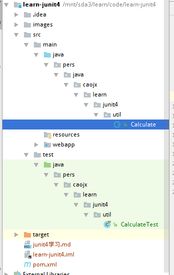
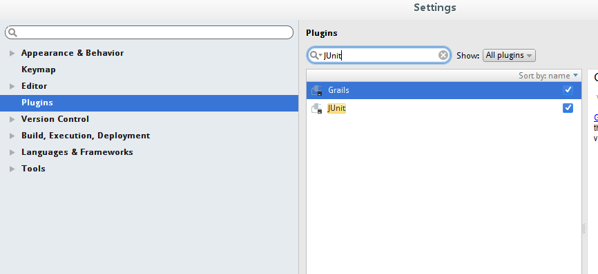
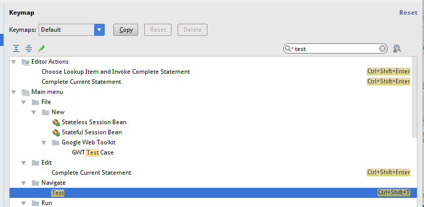
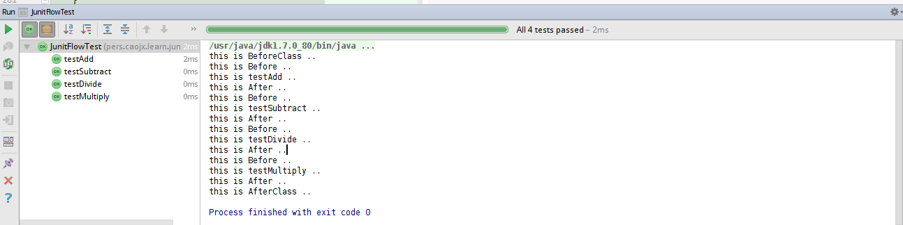

## 一、JUnit4 学习

   本笔记通慕课网观看JUnit视频学习后整理的、本机主要了解如下内容

* JUnit4的快速入门
* JUnit4的使用详解
* JUnit4的深入使用


## 二、JUnit4快速入门

### 2.1 什么是JUnit
    
JUnit官网:http://junit.org/junit4/

JUnit是一个Java语言的单元测试框架。它由Kent Beck和Erich Gamma建立，逐渐成为源于Kent Beck的sUnit的xUnit家族中最为成功的一个。 JUnit有它自己的JUnit扩展生态圈。多数Java的开发环境都已经集成了JUnit作为单元测试的工具。[1-2] 
JUnit是由 Erich Gamma 和 Kent Beck 编写的一个回归测试框架（regression testing framework）。Junit测试是程序员测试，即所谓白盒测试，因为程序员知道被测试的软件如何（How）完成功能和完成什么样（What）的功能。Junit是一套框架，继承TestCase类，就可以用Junit进行自动测试了

原文说明：http://baike.baidu.com/link?url=lf5R0blQ4DeRax3_6cEIwY2OtRIzauX89Z4xlZjRblyUGqytENCZM5kdix3eyOd1qr3SYh4aqPgdOzjraNbNea


### 2.2 为什么要使用JUnit


### 2.3 如何开发测试用例

新建learn-junit4 web项目，使用maven进行搭建，项目结构图如下：
  


在pom文件中引入junit4的依赖

```xml
    <dependency>
      <groupId>junit</groupId>
      <artifactId>junit</artifactId>
      <version>4.12</version>
       <scope>test</scope>
    </dependency>
```

#### 2.3.1 Calculate.java

这个Java类里边写简单的四则运算

```java
package pers.java.caojx.learn.junit4.util;

/**
 * Description: 简单的四则运算类
 *
 * @author caojx
 * Created by caojx on 2017年04月03 下午4:08:08
 */
public class Calculate {

    public int add(int a, int b){
        return a + b;
    }

    public int subtract(int a, int b){
        return a - b;
    }

    public int multiply(int a, int b){
        return a * b;
    }

    public int divide(int a, int b){
        return a / b;
    }
}


```


#### 2.3.2 CalculateTest.java

CalculateTest.java类用于测试Calculate.java类

```java
package pers.caojx.learn.junit4.util;

import org.junit.Test;
import pers.java.caojx.learn.junit4.util.Calculate;

import static org.junit.Assert.*;

/**
 * Description: Calculate测试类
 *
 * @author caojx
 * Created by caojx on 2017年04月03 下午4:12:12
 */
public class CalculateTest {

    /**
     * 测试add方法,使用junit中的Test注解,建议方法命名以test开头
     * 断言测试assertEquals(Expected,Actual) 第一个参数的期待值，第二个参数是实际值
     * 
     * 1.测试方法上必须是哟该你@Test进行注解
     * 2.测试方法必须使用public void进行修饰，不能带返回值
     * 3.应该新建一个测试目录来存放我们的测试代码
     * 4.测试类的包应该和被测试类保持一致
     * 5.测试单元中的每个方法必须可以独立测试，测试方法间不能有任何依赖
     * 6.测试类使用Test作为类名的后缀(建议)
     * 7.测试方法使用test作为方法名的前缀(建议)
     */
    @Test
    public void testAdd(){
        assertEquals(6, new Calculate().add(3,3));
    }

    /**
     * 测试subtract方法
     */
    @Test
    public void testSubtract(){
        assertEquals(3, new Calculate().subtract(5,2));
    }

    /**
     * 测试multiply方法
     */
    @Test
    public void testMultiply(){
        assertEquals(4, new Calculate().multiply(2,2));
    }

    /**
     * 测试divide方法
     */
    @Test
    public void testDivide(){
        assertEquals(3, new Calculate().divide(6,2));
    }

}


```

#### 2.3.3 运行结果


#### 2.3.4 在idea中自动生成测试类

1.确保IDEA中启动了JUnit插件  


2.如果使用的eclipse快捷键，需要自定义一下Navigate的快捷键


3.如果是IDEA默认的快捷键，责使用ctrl+shift+t生成


是哟该你快捷键可以自动为我们生成测试类


### 2.4 测试失败的两种情况

* 测试用例不是用来证明你是对的，而是用来证明你没有错。
* 测试用例用来达到你想要的预期结果，但是对于逻辑性的错误无能为力。

#### 2.4.1 ErrorAndFailureTest.java
```java
package pers.caojx.learn.junit4.util;

import org.junit.Test;
import pers.java.caojx.learn.junit4.util.Calculate;

import static org.junit.Assert.assertEquals;

/**
 * Description:测试失败的两种情况
 *
 * @author caojx
 * Created by caojx on 2017年04月03 下午5:52:52
 */
public class ErrorAndFailureTest {


    /**
     * 1.Failure一般由测试使用的断言方法判断失败所引起的，这表示测试点发现了问题，就是说程序输出的结果和我们预期的不一样
     * 2.error是有代码引起的异常，他可以产生于测试代码本身的错误，也可能是被测试代码中的一个隐藏的bug
     * 3.测试用例不是用来证明你是对的，而是用来证明你没有错
     */
    @Test
    public void testAdd(){
        assertEquals(5, new Calculate().add(3,3));
    }

    @Test
    public void testDivide(){
        assertEquals(3, new Calculate().divide(6,0));
    }
}

```


### 2.5 Junit运行流程


#### 2.5.1 JunitFlowTest.java

```java
package pers.caojx.learn.junit4.util;

import org.junit.*;

import static org.junit.Assert.*;

/**
 * Description: JUnit运行流程
 *
 * @author caojx
 * Created by caojx on 2017年04月03 下午6:14:14
 */
public class JunitFlowTest {

    /**
     * 1.@BeforeClass修饰的方法会在所有的方法被调用之前被执行，而且该方法是静态的，所以当测试类运行后接着就会直接运行他，
     * 而且在内存中只会存在一份实力，比较适合加载配置文件
     * 2.@AfterClass所修饰的方法会在调用之后被执行，比较适合对资源的清理，如数据库的连接
     * 3.@Before和@After会在每个@Test标注的方法前后各执行一次
     */
    @BeforeClass
    public static void setUpBeforeClass () throws Exception{
        System.out.println("this is BeforeClass ..");
    }

    @AfterClass
    public static void tearDownAfterClass() throws Exception {
        System.out.println("this is AfterClass ..");

    }

    @Before
    public void setUp() throws Exception {
        System.out.println("this is Before ..");
    }

    @After
    public void tearDown() throws Exception {
        System.out.println("this is After ..");
    }

    @Test
    public void testAdd() throws Exception {
        System.out.println("this is testAdd ..");
    }

    @Test
    public void testSubtract() throws Exception {
        System.out.println("this is testSubtract ..");
    }

    @Test
    public void testMultiply() throws Exception {
        System.out.println("this is testMultiply ..");
    }

    @Test
    public void testDivide() throws Exception {
        System.out.println("this is testDivide ..");
    }

}
```

运行结果：  


### 2.6 Junit中的常用注解

#### 2.6.1 JunitAnnotation.java

```java
package pers.caojx.learn.junit4.util;

import org.junit.*;
import pers.java.caojx.learn.junit4.util.Calculate;

import static org.junit.Assert.assertEquals;

/**
 * Description: JUnit常用注解
 *
 * @author caojx
 * Created by caojx on 2017年04月03 下午6:14:14
 */
public class JunitAnnotation {

    /*
     * 常用注解如下：
	 * @Test:将一个普通的方法修饰成为一个测试方法
	 * 		@Test(expected=XX.class) 捕获异常
	 * 		@Test(timeout=毫秒 ) 设置方法的测试时间，如果方法的运行时间操作设置的测试时间则会出错
	 * @BeforeClass：它会在所有的方法运行前被执行，static修饰
	 * @AfterClass:它会在所有的方法运行结束后被执行，static修饰
	 * @Before：会在每一个测试方法被运行前执行一次
	 * @After：会在每一个测试方法运行后被执行一次
	 * @Ignore:所修饰的测试方法会被测试运行器忽略,意思是这个方法不会被执行
	 * @RunWith:可以更改测试运行器 org.junit.runner.Runner
	 */

    @Test(expected = ArithmeticException.class)
    public void testDivide() {
        assertEquals(3, new Calculate().divide(6, 0));
    }


    @Ignore("这里可以写说明，为什么不执行")
    @Test(timeout = 2000)
    public void testWhile() {
        while (true) {
            System.out.println("run forever...");
        }
    }

    /**
     * 下边这个测试方法不会通过，因为测试方法只有3s，而方法需要4s才可以执行完成
     */
    @Test(timeout = 3000)
    public void testReadFile() {
        try {
            Thread.sleep(4000);
        } catch (InterruptedException e) {
            e.printStackTrace();
        }

    }
}
```
## 三、JUnit深入使用

### 3.1 Junit测试套件的使用

在实际的开发中，随着项目的深入，规模会越来越大，测试类也会越来越多，这样就会带来一个问题，如果我有
100个测试类，难道要依次运行100个测试类吗，不过还好JUnit为我门提供了一个批量运行测试类的方法，称为测试套件。
使用测试套件，我们可以将所有的测试类都集合在一个测试套件中。这样我们每次需要验证某些功能的时候，只要执行测试套件就可以了。  


#### 3.1.1 SuiteTest.java测试套件入口类

测试套件就是组织测试类一起运行的，用来管理测试类  
写一个作为测试套件的入口类这里是SuiteTest.java，这个类里不包含其他的方法,包含了也不会执行  
@RunWith()更改测试运行器为Suite.class  
将要测试的类作为数组传入到Suite.SuiteClasses（{}）  
    
```java
package pers.caojx.learn.junit4.util;

import org.junit.Test;
import org.junit.runner.RunWith;
import org.junit.runners.Suite;

/**
 * Description: JUnit测试套件
 *
 * @author caojx
 * Created by caojx on 2017年04月03 下午6:14:14
 */
@RunWith(Suite.class) //这里些测试类运行器，Suite.class使用测试套件
@Suite.SuiteClasses({TaskTest1.class,TaskTest2.class,TaskTest3.class}) //传入需要测试的测试类
public class SuiteTest {
    
	/*
	 * 1.测试套件就是组织测试类一起运行的
	 * 
	 * 写一个作为测试套件的入口类，这个类里不包含其他的方法,包含了也不会执行
	 * @RunWith()更改测试运行器为Suite.class
	 * 将要测试的类作为数组传入到Suite.SuiteClasses（{}）
	 */

}
```

#### 3.1.2 写3个测试类

```java
package pers.caojx.learn.junit4.util;

import org.junit.Test;

public class TaskTest1 {

	@Test
	public void test() {
		System.out.println("this is TaskTest1...");
	}

}
```

```java
package pers.caojx.learn.junit4.util;

import org.junit.Test;

public class TaskTest2 {

	@Test
	public void test() {
		System.out.println("this is TaskTest2...");
	}

}

```

```java
package pers.caojx.learn.junit4.util;

import org.junit.Test;

public class TaskTest3 {

	@Test
	public void test() {
		System.out.println("this is TaskTest3...");
	}

}
```

#### 3.1.3 执行SuiteTest套件测试类后的结果  


### 3.2 JUnit参数化设置

#### 3.2.1 ParameterTest.java参数测试类

我们可以向测试方法中传递参数，进行测试

```java
package pers.caojx.learn.junit4.util;

import org.junit.Test;
import org.junit.runner.RunWith;
import org.junit.runners.Parameterized;
import org.junit.runners.Parameterized.Parameters;
import pers.java.caojx.learn.junit4.util.Calculate;

import java.util.Arrays;
import java.util.Collection;

import static org.junit.Assert.assertEquals;

/**
 * Description: JUnit参数化设置
 *
 * @author caojx
 * Created by caojx on 2017年04月03 下午10:14:14
 */
@RunWith(Parameterized.class)
public class ParameterTest {
    /*
	 * 1.更改默认的测试运行器为RunWith(Parameterized.class)
	 * 2.声明变量来存放预期值 和结果值
	 * 3.测试类声明一个带有参数的公共构造函数，并在其中为之声明变量赋值
	 * 4.声明一个返回值 为Collection的公共静态方法，并使用@Parameters进行修饰
	 */
    int expected =0;
    int input1 = 0;
    int input2 = 0;

    public ParameterTest(int expected,int input1,int input2) {
        this.expected = expected;
        this.input1 = input1;
        this.input2 = input2;
    }

    /**
     * 数组中的参数对应的是测试方法中的参数
     * @return
     */
    @Parameters
    public static Collection<Object[]> t() {
        return Arrays.asList(new Object[][]{
                {3,1,2},
                {4,2,2}
        }) ;
    }
    
    @Test
    public void testAdd() {
        assertEquals(expected, new Calculate().add(input1, input2));
    }
}
```
#### 3.2.2 JUnit参数化设置测试结果

