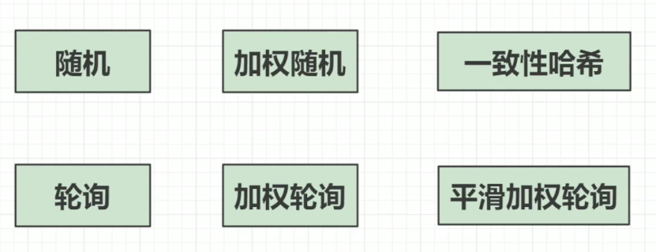
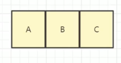
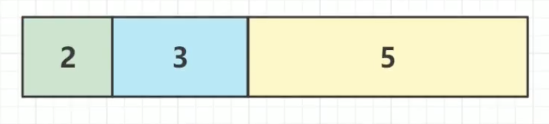
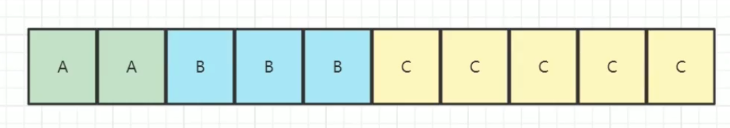
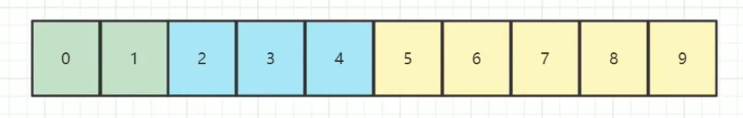
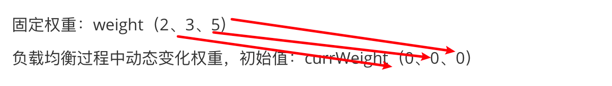
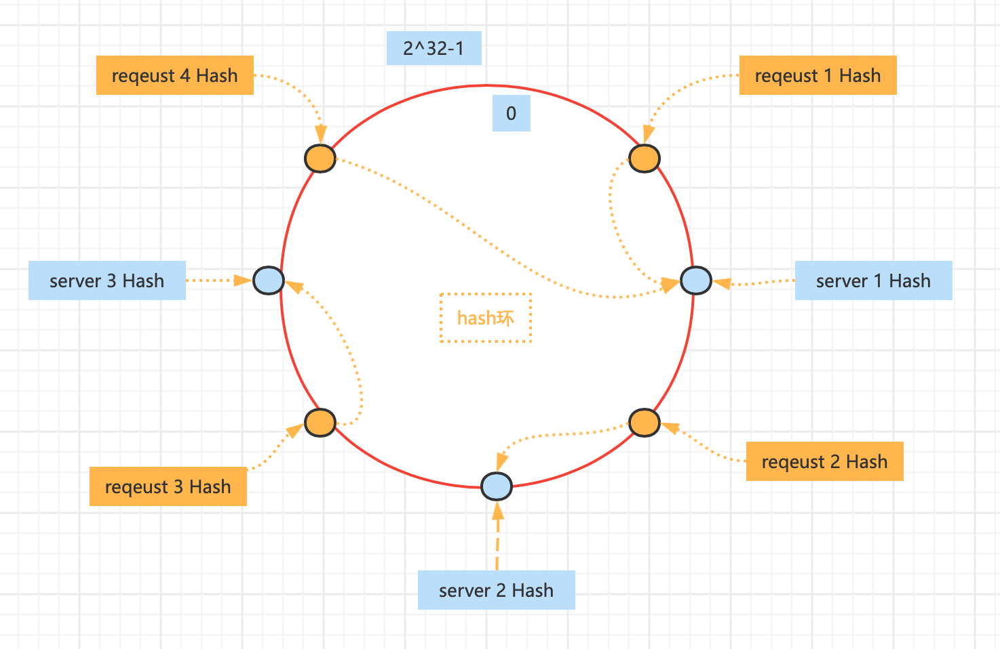

# 负载均衡算法学习


视频教程：https://www.bilibili.com/video/BV1Uf4y1j79y?vd_source=763b2ec1aba2026d6d6983dd3bd86607





## 1.服务器列表准备

```java
/**
 * 服务器id
 *
 * @author caojx created on 2022/6/20 8:34 PM
 */
public class ServerIps {

    /**
     * A、B、C 假设是三台服务器
     */
    public static final List<String> LIST = Arrays.asList("A", "B", "C");
  
   /**
     * 三台服务器的ip地址
     */
    public static final List<String> LIST_IP = Arrays.asList("192.168.0.10", "192.168.0.20", "192.168.0.40", "192.168.0.50");


    /**
     * A、B、C 服务器，带权重
     * 即假如10次请求，A要请求2次，B要请求3次，C要请求5次
     */
    public static final Map<String, Integer> WEIGHT_LIST = new LinkedHashMap<>();

    static {
        WEIGHT_LIST.put("A", 2);
        WEIGHT_LIST.put("B", 3);
        WEIGHT_LIST.put("C", 5);
    }
}

```


## 2.随机

```java
/**
 * 随机轮询
 *
 * @author caojx created on 2022/6/20 8:34 PM
 */
public class RandomSelect {

    public static void main(String[] args) {
        for (int i = 0; i < 10; i++) {
            System.out.println(getServer());
        }
    }

    /**
     * 随机访问集合中的某一个值即可
     *
     * @return
     */
    public static String getServer() {
        Random random = new Random();
        int rand = random.nextInt(ServerIps.LIST.size());

        // 随机访问集合中的某一个值即可
        return ServerIps.LIST.get(rand);
    }
}

```


## 3.轮询


```java

/**
 * 轮询
 *
 * @author caojx created on 2022/6/20 8:38 PM
 */
public class RoundRobin {

    public static void main(String[] args) {
        for (int i = 0; i < 10; i++) {
            System.out.println(getServer());
        }
    }

    // 位置
    public static Integer POS = 0;

    /**
     * 轮询按序遍历即可
     *
     * @return
     */
    public static String getServer() {
        String ip = null;

        synchronized (POS) {
            if (POS >= ServerIps.LIST.size()) {
                POS = 0;
            }

            ip = ServerIps.LIST.get(POS);
            POS++;
        }

        return ip;
    }

}

```


## 3.加权

假如服务器权重如下

```java
/**
 * A、B、C 服务器，带权重，即假如10次请求，A要请求2次，B要请求3次，C要请求5次
 */
public static final Map<String, Integer> WEIGHT_LIST = new LinkedHashMap<>();
static {
    WEIGHT_LIST.put("A", 2);
    WEIGHT_LIST.put("B", 3);
    WEIGHT_LIST.put("C", 5);
}
```


对于我们的3台服务器




权重如下




### 3.1.方案一：根据权重占用数组位数

那么我们把3台服务，变成如下即可，按照权重在对应的位置放置对应的服务器，A的权重为2（占用2个位置），B的权重为3（占用3个位置），C的权重为5（占用5个位置）



然后按照这个顺序编辑集合即可实现加权轮询、或者加权随机。但是这种方式，如果我有1w台服务器，就要操作1w次数组，这种方式不是很好。


#### 3.1.1.加权随机

```java
/**
 * 加权随机
 *
 * @author caojx created on 2022/6/20 8:49 PM
 */
public class WeightRandom {

    public static void main(String[] args) {
        for (int i = 0; i < 10; i++) {
            System.out.println(getServer());
        }
    }

    /**
     * 缺点权重大ips越大占内存带权重随机
     *
     * @return
     */
    public static String getServer() {

        List<String> ips = new ArrayList<>();

        for (String ip : ServerIps.WEIGHT_LIST.keySet()) {
            Integer weight = ServerIps.WEIGHT_LIST.get(ip);

            // weight多少在ips里面存多少  例A权重为2 在ips里面存两个
            for (int i = 0; i < weight; i++) {
                ips.add(ip);
            }
        }

        // 随机取，这里说的是概率
        Random random = new Random();
        int randomPos = random.nextInt(ips.size());
        return ips.get(randomPos);
    }
}
```


#### 3.2.2.加权轮询

```java
/**
 * 加权轮询
 *
 * @author caojx created on 2022/6/20 8:49 PM
 */
public class WeightRoundRobin {

    public static void main(String[] args) {
        for (int i = 0; i < 10; i++) {
            System.out.println(getServer());
        }
    }

    // 位置
    public static Integer POS = 0;

    /**
     * 缺点权重大ips越大占内存带权重随机
     *
     * @return
     */
    public static String getServer() {

        List<String> ips = new ArrayList<>();

        for (String ip : ServerIps.WEIGHT_LIST.keySet()) {
            Integer weight = ServerIps.WEIGHT_LIST.get(ip);

            // weight多少在ips里面存多少  例A权重为2 在ips里面存两个
            for (int i = 0; i < weight; i++) {
                ips.add(ip);
            }
        }


        // 循环取ip即可
        String ip = null;
        synchronized (POS) {
            if (POS >= ips.size()) {
                POS = 0;
            }
            ip = ips.get(POS);
            POS++;
        }
        return ip;
    }
}

```


### 3.2.方案二：优化加权轮询

对于方案1来说，如果我有1w台服务器，就要操作1w次数组，这种方式不是很好，所以我们换一种方案


以为总权重是10，我们将数组分为0~9，那么我们每次请求都会落到如下的区间中。




即：如果你请求的次数< 权重，就可以放到我的这个权重中，如果不小于再往后找，由此我们可以得到一个公式


请求次数 - 权重值，如果<0，说明本次请求次数，在权重值范围内，没有超过权重值，那么这个请求就可以分配给相应的这个服务器。

请求次数 - 权重值，如果>=0，说明本次请求次数，不在权重区间内，就应该往后找。


工作流程

0号位<2（A服务器权重），所以服务器A可以处理

1号位<2（A服务求权重），所以服务器A可以处理

2号位 不小于 2（A服务器权重），所以服务器A不可以处理，pos=2（位置）-2（A权重）=0，往后找到B服务器，0<3（B服务器权重），所以B服务器可以处理

3号位 不小于 2（A服务器权重），所以服务器A不可以处理，pos=3（位置）-2（A权重）=1，往后找到B服务器，1<3（B服务器权重），所以B服务器可以处理

4号位 不小于 2（A服务器权重），所以服务器A不可以处理，pos=4（位置）-2（A权重）=2，往后找到B服务器，2<3（B服务器权重），所以B服务器可以处理

5号位 不小于 2（A服务器权重），所以服务器A不可以处理，pos=5（位置）-2（A权重）=3，往后找到B服务器，3不小于3（B服务器权重），所以B服务器不可以可以处理，pos=3（位置）-（B权重）=0，往后找到C服务器，0<5，所以C服务器可以处理

....


```java
/**
 * 优化加权轮询
 *
 * @author caojx created on 2022/6/20 8:49 PM
 */
public class WeightRoundRobinV2 {

    public static void main(String[] args) {
        for (int i = 0; i < 10; i++) {
            System.out.println(getServer(i));
        }
    }

    public static String getServer(Integer num) {
        int totalWeights = ServerIps.WEIGHT_LIST.values().stream().mapToInt(w -> w).sum();

        Integer pos = num % totalWeights;

        for (String ip : ServerIps.WEIGHT_LIST.keySet()) {
            Integer weight = ServerIps.WEIGHT_LIST.get(ip);

            // 坐标小于权重，说明可以由该服务器处理
            if (pos < weight) {
                return ip;
            }

            // 位置坐标=位置坐标-权重
            pos = pos - weight;
        }

        return "";
    }
}

```


结果

```java
A
A
B
B
B
C
C
C
C
C
```


这种方法虽然解决了List重复的问题，但是这个服务器请求，先连续请求A、再连续访问B、在连续访问C

如果A权重设置为200，B服务器设置300，C服务器设置10000，就会导致，前面200次都请求A，再访问300次B，在访问10000次C，就会导致每个服务器都请求很久，所以这时候又有了平滑加权轮询。


### 3.3.方案三：平滑加权轮询

把请求打散一些

比如第一个请求A、再请求B、再请求C，在一段时间内不会一直去请求同一个服务器。


- 固定权重：weight（2、3、5）
- 负载均衡过程中动态变化权重，初始值：currWeight（0、0、0）


**步骤：**

1. currWeight+weight ：固定权重+动态变化的权重，按照位置相加



2+0=2,、3+0=3、5+0=5

2. max(currWeight) 计算最大权重  = 5

3. 结果是C服务器

4. 计算动态变化的权重：max(currWeight)-=sum(weight)  

   max(currWeight) 5 - sum(weight)  （2+3+5=10） = -5，即动态变化的权重为 2、3、-5

又回到第一步


进行10轮之后，动态变化的权重又变回了初始值


| currWeight +weight | max(currWeight) | result                   | 动态变化的权重：max(currWeight)-=sum(weight) |
| ------------------ | --------------- | ------------------------ | -------------------------------------------- |
| 2、3、5            | 5               | 假设权重5，由服务器C处理 | 2、3、-5=（最大的权重5-10=-5）               |
| 4、6、0            | 6               | B                        | 4、-4、0                                     |
| 6、-1、5           | 6               | B                        | -4、-1、5                                    |
| -2、2、10          | 10              | C                        | -2、2、0                                     |
| 0、5、5、          | 5               | B                        | 0、-5、5                                     |
| 2、-2、10          | 10              | C                        | 2、-2、0                                     |
| 4、1、5            | 5               | C                        | 4、1、-5                                     |
| 6、4、0            | 6               | A                        | -4、4、0                                     |
| -2、7、5           | 7               | B                        | -2、-3、5                                    |
| 0、0、10           | 10              | C                        | 0、0、0   最后动态权重，又变回了初始值       |


这些也不用太纠结，记住就行了


```java
/**
 * 平滑加权轮询
 *
 * @author caojx created on 2022/6/20 8:49 PM
 */
public class WeightRoundRobinV3 {

    public static void main(String[] args) {
        for (int i = 0; i < 10; i++) {
            System.out.println(getServer());
        }
    }

    /**
     * 动态权重
     */
    public static Map<String, Weight> currWeights = new HashMap<>();

    public static String getServer() {
        int totalWeights = ServerIps.WEIGHT_LIST.values().stream().mapToInt(w -> w).sum();

        // 初始化一个 动态权重，currWeights 默认值 0
        if (currWeights.isEmpty()) {
            ServerIps.WEIGHT_LIST.forEach((ip, weight) -> {
                currWeights.put(ip, new Weight(ip, weight, 0));
            });
        }

        // currWeight +weight 动态权重+固定权重
        for (Weight weight : currWeights.values()) {
            weight.setCurrentWeight(weight.getCurrentWeight() + weight.getWeight());
        }

        // 找最大值 max(currWeight)
        Weight maxCurrentWeight = null;
        for (Weight weight : currWeights.values()) {
            if (maxCurrentWeight == null || weight.getCurrentWeight() > maxCurrentWeight.getCurrentWeight()) {
                maxCurrentWeight = weight;
            }
        }

        // 动态变化的权重：max(currWeight)-=sum(weight)
        maxCurrentWeight.setCurrentWeight(maxCurrentWeight.getCurrentWeight() - totalWeights);


        return maxCurrentWeight.getIp();
    }

    /**
     * 权重
     */
    public static class Weight {
        /**
         * 服务器主机
         */
        private String ip;

        /**
         * 固定权重
         */
        private Integer weight;

        /**
         * 当前权重
         */
        private Integer currentWeight;

        public Weight(String ip, Integer weight, Integer currentWeight) {
            this.ip = ip;
            this.weight = weight;
            this.currentWeight = currentWeight;
        }

        public String getIp() {
            return ip;
        }

        public void setIp(String ip) {
            this.ip = ip;
        }

        public Integer getWeight() {
            return weight;
        }

        public void setWeight(Integer weight) {
            this.weight = weight;
        }

        public Integer getCurrentWeight() {
            return currentWeight;
        }

        public void setCurrentWeight(Integer currentWeight) {
            this.currentWeight = currentWeight;
        }
    }
}

```


## 4.一致性hash算法

参考：https://www.imooc.com/wiki/Zookeeper/zookeeperloadblance.html


一致性哈希策略的实现方式：

我们先把服务列表中的地址进行哈希计算，把计算后的值放到哈希环上，接收到请求后，根据请求的固定属性值来进行哈希计算，然后根据请求的哈希值在哈希环上顺时针寻找服务地址的哈希值，寻找到哪个服务地址的哈希值，就把请求分配给哪个服务。


注意：哈希环的范围，从 0 开始，到 2 的32 次方减 1 结束，也就是到 Integer 的最大取值范围。




在示例的图中，哈希环上有 3 个 Server 的 Hash 值，每个请求的 Hash 值都顺时针去寻找 Server 的 Hash 值，找到哪个就将请求分配给哪个服务。接下来我们用 Java 实现一致性哈希策略，使用 IP 地址进行 Hash 计算：


假设3台服务器ip

```java
/**
 * 三台服务器的ip地址
 */
public static final List<String> LIST_IP = Arrays.asList("192.168.0.10", "192.168.0.20", "192.168.0.40", "192.168.0.50");

```


```java
package com.caojx.learn;

import java.util.SortedMap;
import java.util.TreeMap;

/**
 * 一致性哈希策略 Demo
 */
public class ConsistentHashing {

    public static void main(String[] args) {
        String[] requestIps = {"192.168.0.15", "192.168.0.30", "192.168.0.45"};
        for(String requestIp: requestIps){
            String address = getServer(requestIp);
            System.out.println("请求 " + requestIp + " 被分配给服务 " + address);
        }
    }

    public static String getServer(String requestId) {
        // 新建 TreeMap 集合 ，以 Key，Value 的方式绑定 Hash 值与地址
        SortedMap<Integer, String> serverHashMap = new TreeMap<>();
        // 计算 Server 地址的 Hash 值
        for (String address : ServerIps.LIST_IP) {
            int serverHash = Math.abs(address.hashCode());
            // 绑定 Hash 值与地址
            serverHashMap.put(serverHash, address);
        }

        int requestHash = Math.abs(requestId.hashCode());
        // 在 serverHashMap 中寻找所有大于 requestHash 的 key
        SortedMap<Integer, String> tailMap = serverHashMap.tailMap(requestHash);
        //如果有大于 requestHash 的 key， 第一个 key 就是离 requestHash 最近的 serverHash
        if (!tailMap.isEmpty()) {
            Integer key = tailMap.firstKey();
            // 根据 key 获取 Server address
            return serverHashMap.get(key);
        } else {
            // 如果 serverHashMap 中没有比 requestHash 大的 key
            // 则直接在 serverHashMap 取第一个服务
            Integer key = serverHashMap.firstKey();
            // 根据 key 获取 Server address
            return serverHashMap.get(key);
        }
    }
}

```


执行结果

```text
请求 192.168.0.15 被分配给服务 192.168.0.20
请求 192.168.0.30 被分配给服务 192.168.0.40
请求 192.168.0.45 被分配给服务 192.168.0.50
```

