#Java消息中间件-ActiveMQ

[TOC]

本笔记主要根据慕课网视屏教程整理出：https://www.imooc.com/learn/856

练习源码：https://github.com/caojx-git/learn

使用其他消息中间件：https://github.com/jovezhao/nest

## 一、简介

### 1.1 案例

老王有两个女儿，每天晚上睡觉前都要给女儿们讲故事，女儿才睡得照，在沒有使中间件之前，老王需要分别给两个女儿讲故事，这样老王又要工作，又要讲故事很晚，老王也很累。

  

老王后来使用了中间件（假设微信是中间件），老王只要将故事推送到微信中，然后让两个女儿订阅微信中的故事，两个女儿就可以在想听故事的时候听到老王的故事，这样老王也省了很多精力。

  

### 1.2 消息中间件带来的好处

- 系统的解耦

- 异步

- 横向扩展

- 安全可靠

  消息中间件会将我们的消息保存，直到我们的消息被消费为止。如果其他系统没有消费，或消费系统出现异常的时候，消费系统可以在下一次恢复正常后继续消费这条消息。

- 顺序保存

### 1.3 消息中间件概述

#### 1. 什么是中间件？

非底层操作系统软件，非业务应用软件，不是直接给最终用户使用的，不能直接给客户带来价值的软件系统统称为中间件。

#### 2. 什么是消息中间件？

关注于**数据的发送和接受**，利用高效可靠的**异步**消息传递机制集成**分布式系统**。

如下是消息中间件示意图：

  

应用程序A通过应用程序接口向消息中间件发送消息，应用程序B通过应用程序接口向消息中间件接收消息。


#### 3.什么是 JMS？

Java消息服务（Java Message Service）即JMS，是一个Java平台中关于面向消息中间件的**API**，用于在两个应用程序之间，或分布式系统中发送消息，进行**异步**通信。

#### 4. 什么是AMQP？

AMQP（advanced message queuing protocol）是一个提供统一消息服务的**应用层**标准协议，基于此协议的客户端与消息中间件可传递消息，**并不受客户端/中间件不同产品，不同开发语言条件限制**。

#### 5. JMS与AMQP对比

|          | JMS规范                                                      | AMQP协议                                                     |
| -------- | ------------------------------------------------------------ | ------------------------------------------------------------ |
| 定义     | Java API                                                     | Wire-protocol                                                |
| 跨语言   | 否                                                           | 是                                                           |
| 消息类型 | 提供两种消息类型p2p、pub/sub                                 | 提供了5中消息类型<br />direct、fanout、topic、headers、system |
| 消息类型 | TextMessage、MapMessage、ByteMessage、StreamMessage、ObjectMessage、Message | byte[]                                                       |
| 综合评价 | JMS定义了Java API层面的标准；在Java体系中国年，多个client均可以通过JMS进行交互，不需要应用修改代码，但是对于跨平台的支持较差。 | AMQP的主要特征是面向消息、队列、路由（包括点对点和发布/订阅）、可靠性、安全。 |

### 1.4 常见的消息中间件对比

#### 1. ActiveMQ

ActiveMQ是Apache出品，最流行，能力强劲的开源消息总线。ActiveMQ是一个完全支持JMS1.1和J2EE1.4规范的JMS Provider实现，尽管JMS规范出台已经是很久的事情了，但是JMS在当今的J2EE应用中间件任然扮演着特殊的地位。

**ActiveMQ的特性**：

- 多种语言和协议编写客户端
- 支持语言：Java、C、C++、C#、Ruby、Perl、Python、PHP
- 支持应用协议：OpenWire、Stomp REST、WS、Notification、XMPP、AMQP
- 完全支持JMS1.1和J2EE1.4规范（持久化、XA消息、事务）
- 虚拟主题、组合目的、镜像队列


#### 2. RabbitMQ

RabbitMQ是一个开源的AMQP实现，服务端用Erlang语言编写。用于在分布式系统中存储转发消息，在易用性、扩展性、高可用性表现不俗。

**RabbitMQ的特性**：

- 支持多种客户端，如：Java、Python、Ruby、.NET、JMS、C、PHP、ActionScript等
- AMQP的完整实现（vhost、Exchange、Binding、Routing Key等）
- 事务支持/发布确认
- 消息持久化

#### 3. Kafka

Kafka是一个高吞吐量的分布式发布订阅消息系统，是一个分布式的、分区的、可靠的分布式日志存储服务。它通过一种独一无二的设计提供了一个消息系统的功能。

**Kafka的特性**

- 通过O(1)的磁盘数据结构提供消息的持久化，这种结构对于即使数以TB的消息存储也能够保持长时间的稳定性能。
- 高吞吐量：即使是非常比普通的硬件Kafka也可以支持每秒数百万的消息。
- Partion、Consumer Group

#### 4. ActiveMQ、RabbitMQ和Kafka消息中间件对比

|          | ActiveMQ                                                     | RabbitMQ                                                     | KafKa                                                        |
| -------- | ------------------------------------------------------------ | ------------------------------------------------------------ | ------------------------------------------------------------ |
| 跨语言   | 支持(Java优先)                                               | 语言无关                                                     | 支持（Java优先）                                             |
| 支持协议 | OpenWire,Stomp,XMPP,AMQP                                     | AMQP                                                         |                                                              |
| 优点     | 遵循JMS规范安装部署方便                                      | 继承Erlang天生的并发性最初用于金融行业，稳定性，安全性有保障 | 依赖zk，可动态扩展节点，高性能，高吞吐量，无限扩容，消息可指定追溯 |
| 缺点     | 根据其他用户反馈，会莫名丢失消息。目前重心在下代产品apolle上，目前社区不活跃，对5.x维护较少 | Erlang语言难度较大，不支持动态扩展                           | 严格的顺序机制，不支持消息优先级，不支持标准的消息协议，不利于平台的迁移 |
| 综合评价 | 适合中小企业消息应用场景，不适合上千个队列的应用场景         | 适合对性能稳定性要求高的企业级应用                           | 一般应用在大数据日志处理货对实时性（少量延迟），可靠性（少量丢失数据）要求稍低的场景使用 |

### 1.5 JMS规范

#### 1. Java消息服务定义

Java消息服务（Java Message Service）即JMS，是一个Java平台中关于面向消息中间件的**API**，用于在两个应用程序之间，或分布式系统中发送消息，进行**异步**通信。

#### 2. JMS相关概念

**提供者**：实现JMS规范的消息中间件服务器

**客户端**：发送或接受消息的应用程序

**生产者/发布者**：创建并发送消息的客户端

**消费者/订阅者**：接受并处理消息的客户端

**消息**：应用程序之间传递的数据内容

**消息模式**：在客户端之间传递消息的方式，JMS定义了主题和队列两种模式

#### 3. 队列模式

- 客户端包括生产者和消费者
- 队列中的消息只能被一个消费者所消费
- 消费者可以随时消费队列中的消息

下图是队列模式示意图：


应用1和应用2分别发送了消息M1/M3/M5 和M2/M4/M6共6条消息，然后消息队列中有了这6条消息，然后创建了2个消费者应用3建立了2个连接和应用4建立了一个连接，由结果可见，应用消费者中的每个连接平摊了队列中的每个消息。

#### 4. 主题模式

- 客户端包括发布者可订阅者
- 主题中的消息被所有订阅者消费
- 消费者不能消费订阅之前就发送到主题中的消息

下图是主题模式示意图：

 

创建两个订阅者应用3和应用4与JMS主题先建立连接，然后再创建两个发布者应用1和应用2与JMS主题建立连接分别发送了M1/M3/M5和M2/M4/M6，这时JMS主题中有了6条消息，由于应用3和应用4在之前就订阅了该主题的消息，所以应用3和应用4都能收到所有的消息。主要是订阅者需要提前去订阅主题。

#### 5.JMS编码接口

- ConnectionFactory 用于创建连接到消息中间件的连接工厂，这个工厂一般由消息提供商提供。
- Connection 代表了应用程序和消息服务器之间的通信链路
- Destination 指消息发布和接受的地点，包括队列或主题
- Session 表示一个单线程的上下文会话，用于发送和接收消息
- MessageConsumer 由会话创建，用于接受发送到目标的消息
- MessageProducer 由会话创建，用于发送消息到目标
- Message 是在消费者和生产者之间传送的对象，消息头，一组消息属性，一个消息体


#### 6. JMS编码接口之间的关系

  

首先连接工厂创建一个连接Connection，有了这个连接之后就可以创建会话Session，这里我们的连接也可以创建多个会话Session，而每个会话是在一个线程上下文的。由会话Session我们可以创建生产者和消费者，并且会话也可以用来创建一个新的消息。然后我们可以使用我们的生产者将我们的消息发送到指定的目的地，然后我们的消费者可以到指定的目的地去接收我们的消息。


## 二、安装ActiveMQ

### 2.1 Windows平台安装ActiveMQ

1. 下载安装包 http://www.apache.org/dyn/closer.cgi?filename=/activemq/5.15.3/apache-activemq-5.15.3-bin.zip&action=download

2. 直接启动

   解压安装包后进入bin/win64目录，运行activemq.bat即运行activeMQ

3. 使用服务启动

   解压安装包后进入bin/win64目录，运行installService.bat,运行之后，会将ActiveMQ以服务的方式安装到我们电脑，这样我们就可以以服务的方式启动了。

### 2.2 Linux平台安装ActiveMQ

http://www.apache.org/dyn/closer.cgi?filename=/activemq/5.15.3/apache-activemq-5.15.3-bin.tar.gz&action=download

```shell
#解压安装包
#tar -zxvf apache-activemq-5.15.3.tar.gz
#cd apache-activemq-5.15.3/bin
#ls 
activemq      activemq-diag activemq.jar  env           linux-x86-32  linux-x86-64  macosx        wrapper.jar
#启动activeMQ
#./activemq start #启动后activeMQ默认端口是8161

#需要停止activemq
#./activemq stop
```

访问：http://127.0.0.1:8161 后点击Manage ActiveMQ broker 会要求输入ActiveMQ管理密码，默认是admin/admin


  


## 三、JMS接口规范连接ActiveMQ

**使用JMS接口规范连接ActiveMQ**

- 创建生产者/消费者
- 创建发布者/订阅者

这里我们将演示p2p和发布订阅两种模式

注意：本节内容可以参考**1.5 JMS规范**

### 3.1 pom.xml

引入activemq依赖

```xml
<!-- 引入activemq依赖-->
<dependency>
  <groupId>org.apache.activemq</groupId>
  <artifactId>activemq-all</artifactId>
  <version>5.15.3</version>
</dependency>
```

### 3.1 队列模式的消息演示 

队列模式的特点：

- 客户端包括生产者和消费者
- 队列中的消息只能被一个消费者所消费
- 消费者可以随时消费队列中的消息

**1.AppProducer.java**

使用队列模式创建一个生产者，发送100个消息到消息队列中，所以**之前要先启动activemq**。

```java
package caojx.learn.jms.queue;

import org.apache.activemq.ActiveMQConnectionFactory;

import javax.jms.*;

/**
 * @author caojx
 * Created on 2018/3/13 下午下午12:41
 * jms队列模式-消息生产者
 */
public class AppProducer {


    public static final String url="tcp://127.0.0.1:61616"; //连接activemq的地址，61616是连接activemq默认的端口

    public static final String queueName="queue-test"; //队列名称

    public static void main(String[] args) throws JMSException {

        //1.创建ConnectionFactory
        ConnectionFactory connectionFactory = new ActiveMQConnectionFactory(url);

        //2.创建Connection
        Connection connection = connectionFactory.createConnection();

        //3.启动连接
        connection.start();

        //4.创建会话，第一个参数表示是否在事务中处理，由于是演示代码所以不使用事务false，第二个参数是连接应答模式，Session.AUTO_ACKNOWLEDGE表示自动应答
        Session session = connection.createSession(false, Session.AUTO_ACKNOWLEDGE);

        //5.创建一个目标 队列
        Destination destination = session.createQueue(queueName);

        //6.创建一个生产者,并指定目标
        MessageProducer producer = session.createProducer(destination);

        for (int i = 1; i <= 100; i++) {
            //7.创建消息
            TextMessage textMessage = session.createTextMessage("test"+i);
            //8.发送消息
            producer.send(textMessage);
            System.out.println("发送消息"+textMessage.getText());
        }
        //9.关闭连接
        connection.close();
    }
}
```

2. **执行生产者的main方法发送消息**

   控制台：

   ```text
   发送消息test1
   发送消息test2
   ...
   发送消息test97
   发送消息test98
   发送消息test99
   发送消息test100
   ```

   activemq管理界面：

   Name:队列名称 quque-test

   Number Of Pending Messages：挂起消息的数目

   Number Of Consumers：消费者数目

   Messages Enqueued：消息队列中的数目，待消费的数量

   Messages Dequeued：消息出对的数目，已消费的数量

     

3. **AppConsumer.java**

消费者，用于接收生产者发送到消息队列这中的消息

```java
package caojx.learn.jms.queue;

import org.apache.activemq.ActiveMQConnectionFactory;

import javax.jms.*;

/**
 * @author caojx
 * Created on 2018/3/13 下午下午12:56
 * jms队列模式-消息消费者
 */
public class AppConsumer {

    public static final String url="tcp://127.0.0.1:61616"; //连接activemq的地址，61616是连接activemq默认的端口

    public static final String queueName="queue-test"; //队列名称

    public static void main(String[] args) throws JMSException {

        //1.创建ConnectionFactory
        ConnectionFactory connectionFactory = new ActiveMQConnectionFactory(url);

        //2.创建Connection
        Connection connection = connectionFactory.createConnection();

        //3.启动连接
        connection.start();

        //4.创建会话，第一个参数表示是否在事务中处理，由于是演示代码所以不使用事务false，第二个参数是连接应答模式，Session.AUTO_ACKNOWLEDGE表示自动应答
        Session session = connection.createSession(false, Session.AUTO_ACKNOWLEDGE);

        //5.创建一个目标 队列
        Destination destination = session.createQueue(queueName);

        //6.创建一个消费者,并指定目标
        MessageConsumer consumer = session.createConsumer(destination);

       //7.创建一个监听器,接收消息
        consumer.setMessageListener(new MessageListener() {
            public void onMessage(Message message) {
                TextMessage textMessage = (TextMessage) message;
                try {
                    System.out.println("接收消息："+textMessage.getText());
                } catch (JMSException e) {
                    e.printStackTrace();
                }
            }
        });

        //注意，由于消息接收是异步的，所以不能关闭connection
        //connection.close();
    }
}
```

4. **执行消费者的main方法接收消息**

控制台：

```text
接收消息：test1
....
接收消息：test99
接收消息：test100
```

activemq管理界面：

Name:队列名称 quque-test

Number Of Pending Messages：挂起消息的数目

Number Of Consumers：消费者数目

Messages Enqueued：消息队列中的数目，待消费的数量

Messages Dequeued：消息出对的数目，已消费的数量

  

**注意：如果先启动多个消费者，再启动生产者发送消息，队列模式的消费者会平均分摊消息队列中的消息**

### 3.2 主题模式的消息演示

主题模式的特点：

- 客户端包括发布者可订阅者
- 主题中的消息被所有订阅者消费
- 消费者不能消费订阅之前就发送到主题中的消息

**1.AppProducer.java**

使用主题模式创建一个发布者，发送100个消息到主题中，所以**之前要先启动activemq**。

```java
package caojx.learn.jms.topic;

import org.apache.activemq.ActiveMQConnectionFactory;

import javax.jms.*;

/**
 * @author caojx
 * Created on 2018/3/13 下午下午12:41
 * jms主题模式-消息发布者
 */
public class AppProducer {


    public static final String url="tcp://127.0.0.1:61616"; //连接activemq的地址，61616是连接activemq默认的端口

    public static final String topicName="topic-test"; //主题名称

    public static void main(String[] args) throws JMSException {

        //1.创建ConnectionFactory
        ConnectionFactory connectionFactory = new ActiveMQConnectionFactory(url);

        //2.创建Connection
        Connection connection = connectionFactory.createConnection();

        //3.启动连接
        connection.start();

        //4.创建会话，第一个参数表示是否在事务中处理，由于是演示代码所以不使用事务false，第二个参数是连接应答模式，Session.AUTO_ACKNOWLEDGE表示自动应答
        Session session = connection.createSession(false, Session.AUTO_ACKNOWLEDGE);

        //5.创建一个目标 主题
        Destination destination = session.createTopic(topicName);

        //6.创建一个发布者,并指定目标
        MessageProducer producer = session.createProducer(destination);

        for (int i = 1; i <= 100; i++) {
            //7.创建消息
            TextMessage textMessage = session.createTextMessage("test"+i);
            //8.发送消息
            producer.send(textMessage);
            System.out.println("发送消息"+textMessage.getText());
        }
        //9.关闭连接
        connection.close();
    }
}
```

2. **AppConsumer.java**

订阅者，用于接收发布者发送的对应主题消息

```java
package caojx.learn.jms.topic;

import org.apache.activemq.ActiveMQConnectionFactory;

import javax.jms.*;

/**
 * @author caojx
 * Created on 2018/3/13 下午下午12:56
 * jms主题模式-消息订阅者
 */
public class AppConsumer {

    public static final String url="tcp://127.0.0.1:61616"; //连接activemq的地址，61616是连接activemq默认的端口

    public static final String topicName="topic-test"; //主题名称

    public static void main(String[] args) throws JMSException {

        //1.创建ConnectionFactory
        ConnectionFactory connectionFactory = new ActiveMQConnectionFactory(url);

        //2.创建Connection
        Connection connection = connectionFactory.createConnection();

        //3.启动连接
        connection.start();

        //4.创建会话，第一个参数表示是否在事务中处理，由于是演示代码所以不使用事务false，第二个参数是连接应答模式，Session.AUTO_ACKNOWLEDGE表示自动应答
        Session session = connection.createSession(false, Session.AUTO_ACKNOWLEDGE);

        //5.创建一个目标
        Destination destination = session.createTopic(topicName);

        //6.创建一个订阅者,并指定目标 主题
        MessageConsumer consumer = session.createConsumer(destination);

       //7.创建一个监听器,接收消息
        consumer.setMessageListener(new MessageListener() {
            public void onMessage(Message message) {
                TextMessage textMessage = (TextMessage) message;
                try {
                    System.out.println("接收消息："+textMessage.getText());
                } catch (JMSException e) {
                    e.printStackTrace();
                }
            }
        });

        //注意，由于消息接收是异步的，所以不能关闭connection
        //connection.close();
    }
}
```

3. **测试**

   主题模式需要先让订阅者订阅主题，然后发布者往主题中发送消息，订阅者才可以订阅到到消息。所以这里先启动订阅者（启动3个）,然后启动1个发布者发布消息。

   ​

   启动3个发布者后，topic-test显示有3个订阅者

     

   启动发布者发布消息

   发布者控制台

   ```text
   发送消息test1
   发送消息test2
   ...
   发送消息test100
   ```

   3个消费者控制台都是，即都接收到一样的消息

   ```text
   接收消息：test1
   接收消息：test2
   接收消息：test3
   ....
   接收消息：test100
   ```

       

   ​

## 四、Spring集成JMS

本节了解spring继承jms连接activemq。

### 4.1 spring继承jms连接activemq

spring继承jms连接activema，提供了

- ConnectionFactory 用于管理连接的连接工厂

  ConnectionFactory是spring为我们提供的连接池，之所有需要连接池是由于JmsTemplate每次发送消息都会重新创建连接，会话和productor 。在spring中分别提供了SingleConnectionFactory和CachingConnectionFactory。

- JmsTemplate 用于接收和发送消息的模板类

  JmsTemplate是spring提供的，只需向spring容器内注册这个类就可以使用JmsTemplate方便的操作jms。

  JmsTemplate类是线程安全的，可以在整个应用范围使用。

- MessageListerner 消息监听器

  实现一个onMessage方法，该方法只接收一个Message参数。


### 4.2 编码实现

编码实现可以边参考，可以更好理解jms

[理解JMS规范中消息的传输模式和消息持久化](http://blog.csdn.net/wilsonke/article/details/42804245)

[理解JMS规范中的持久订阅和非持久订阅](http://blog.csdn.net/aitangyong/article/details/26013387)

1.**项目目录**

  

2. **pom.xml**

```xml
<project xmlns="http://maven.apache.org/POM/4.0.0" xmlns:xsi="http://www.w3.org/2001/XMLSchema-instance"
         xsi:schemaLocation="http://maven.apache.org/POM/4.0.0 http://maven.apache.org/xsd/maven-4.0.0.xsd">
    <modelVersion>4.0.0</modelVersion>

    <groupId>caojx.learn</groupId>
    <artifactId>activemq-java</artifactId>
    <version>1.0-SNAPSHOT</version>
    <packaging>jar</packaging>

    <name>activemq-java</name>
    <url>http://maven.apache.org</url>

    <properties>
        <project.build.sourceEncoding>UTF-8</project.build.sourceEncoding>
        <spring.version>4.3.14.RELEASE</spring.version>
    </properties>

    <dependencies>
        <dependency>
            <groupId>junit</groupId>
            <artifactId>junit</artifactId>
            <version>3.8.1</version>
            <scope>test</scope>
        </dependency>

        <!--集成spring-->
        <dependency>
            <groupId>org.springframework</groupId>
            <artifactId>spring-context</artifactId>
            <version>${spring.version}</version>
        </dependency>

        <dependency>
            <groupId>org.springframework</groupId>
            <artifactId>spring-jms</artifactId>
            <version>${spring.version}</version>
        </dependency>

        <dependency>
            <groupId>org.springframework</groupId>
            <artifactId>spring-test</artifactId>
            <version>${spring.version}</version>
            <scope>test</scope>
        </dependency>

        <!--集成spring的时候，可以不需要activemq-all依赖-->
        <dependency>
            <groupId>org.apache.activemq</groupId>
            <artifactId>activemq-core</artifactId>
            <version>5.7.0</version>
            <exclusions>
                <exclusion>
                    <groupId>org.springframework</groupId>
                    <artifactId>spring-context</artifactId>
                </exclusion>
            </exclusions>
        </dependency>

    </dependencies>
</project>
```

3. **ProducerService.java**

```java
package caojx.learn.jms.spring.queue;

/**
 * @author caojx
 * Created on 2018/3/13 下午下午9:25
 * 接收消息业务接口
 */
public interface ProducerService {

    void sendMessage(String message);
}
```

4. **ProducerServiceImpl.java**

```java
package caojx.learn.jms.spring.queue;

import org.springframework.beans.factory.annotation.Autowired;
import org.springframework.jms.core.JmsTemplate;
import org.springframework.jms.core.MessageCreator;

import javax.annotation.Resource;
import javax.jms.*;

/**
 * @author caojx
 * Created on 2018/3/13 下午下午9:33
 * 接收消息业务实现类
 */
public class ProducerServiceImpl implements ProducerService {

    @Autowired
    JmsTemplate jmsTemplate;

    public void sendMessage(final String message) {
        //使用消息模板发送消息
        jmsTemplate.send(new MessageCreator() {
            //创建一个消息
            public Message createMessage(Session session) throws JMSException {
                TextMessage textMessage = session.createTextMessage(message);
                return textMessage;
            }
        });
        System.out.println("发送消息："+message);
    }
}
```

5. **spring-jms-common.xml**

jms与spring集成公共配置，如果要使用持久模式必须指定clientId（接收者Id）,这样即使是在主题模式下订阅者也能接收到之前发布者该给对应订阅者的消息，即相当于消费者有个vip卡，消息提供者会给消费者预留消息。极力推荐两篇文章会对jms理解更深刻

[理解JMS规范中消息的传输模式和消息持久化](http://blog.csdn.net/wilsonke/article/details/42804245)

[理解JMS规范中的持久订阅和非持久订阅](http://blog.csdn.net/aitangyong/article/details/26013387)

```xml
<?xml version="1.0" encoding="UTF-8"?>
<beans xmlns="http://www.springframework.org/schema/beans"
       xmlns:xsi="http://www.w3.org/2001/XMLSchema-instance"
       xmlns:context="http://www.springframework.org/schema/context"
       xsi:schemaLocation="http://www.springframework.org/schema/beans http://www.springframework.org/schema/beans/spring-beans.xsd http://www.springframework.org/schema/context http://www.springframework.org/schema/context/spring-context.xsd">

    <context:annotation-config/>

    <!--ActiveMQ为我们提供的ConnectionFactory-->
    <bean id="targetConnectionFactory" class="org.apache.activemq.ActiveMQConnectionFactory">
        <!-- 配置activemq的连接配置 -->
        <property name="brokerURL" value="tcp://127.0.0.1:61616"></property>
        <property name="userName" value="admin"></property>
        <property name="password" value="admin"></property>
    </bean>

    <!--spring jms为我们提供连接池，代理activemq的连接工厂-->

    <!--
    持久订阅时，客户端向JMS 服务器注册一个自己身份的ID，当这个客户端处于离线时，JMS Provider 会为这个ID 保存所有发送到主题的消息，
    当客户再次连接到JMS Provider时，会根据自己的ID得到所有当自己处于离线时发送到主题的消息。
    -->
    <bean id="connectionFactory" class="org.springframework.jms.connection.CachingConnectionFactory">
        <!--代理的连接工厂-->
        <property name="targetConnectionFactory" ref="targetConnectionFactory"></property>
        <!-- 持久订阅模式时接收者ID必须指定,如果使用非持久订阅模式时不用配置 -->
        <!--<property name="clientId" value="client_119"/>-->
        <!-- Session缓存数量 -->
        <property name="sessionCacheSize" value="10" />
    </bean>

    <!--一个队列目的地，点对点队列模式-->
    <bean id="queueDestination" class="org.apache.activemq.command.ActiveMQQueue">
        <!-- 设置消息队列的名字 -->
        <constructor-arg index="0" value="queue"/>
    </bean>

    <!--一个主题目的地，发布订阅模式-->
    <bean id="topicDestination" class="org.apache.activemq.command.ActiveMQTopic">
        <!-- 设置消息主题的名字 -->
        <constructor-arg index="0" value="topic"/>
    </bean>
</beans
```

6. **spring-jms-producer.xml**

提供者配置文件，会映入公共配置，jmsTemplate用于配置消息模板，编写的时候可以自行选择主题模式或队列模式

```xml
<?xml version="1.0" encoding="UTF-8"?>
<beans xmlns="http://www.springframework.org/schema/beans"
       xmlns:xsi="http://www.w3.org/2001/XMLSchema-instance"
       xmlns:context="http://www.springframework.org/schema/context"
       xsi:schemaLocation="http://www.springframework.org/schema/beans http://www.springframework.org/schema/beans/spring-beans.xsd http://www.springframework.org/schema/context http://www.springframework.org/schema/context/spring-context.xsd">

    <!--导入公共配置-->
    <import resource="spring-jms-common.xml"></import>

    <!--消息模板,用于发送消息-->
    <bean id="jmsTemplate" class="org.springframework.jms.core.JmsTemplate">
        <property name="connectionFactory" ref="connectionFactory"/>
        <!--发送消息的目的地,一个队列-->
        <!--<property name="defaultDestination" ref="queueDestination"/>-->
        <!--发送消息的目的地,一个主题-->
        <property name="defaultDestination" ref="topicDestination"/>
    </bean>

    <!--bean配置-->
    <bean class="caojx.learn.jms.spring.queue.ProducerServiceImpl"></bean>
</beans>
```

7. **spring-jms-consumer.xml**

消费者配置文件，使用消息监听器监听消息

```xml
<?xml version="1.0" encoding="UTF-8"?>
<beans xmlns="http://www.springframework.org/schema/beans"
       xmlns:xsi="http://www.w3.org/2001/XMLSchema-instance"
       xmlns:context="http://www.springframework.org/schema/context"
       xsi:schemaLocation="http://www.springframework.org/schema/beans http://www.springframework.org/schema/beans/spring-beans.xsd">

    <!--导入公共配置-->
    <import resource="spring-jms-common.xml"></import>

    <!--配置消息监听器-->
    <bean id="consumerMessageListener" class="caojx.learn.jms.spring.queue.ConsumerMessageListener"></bean>

    <!--配置消息监听容器-->
    <bean id="jmsContainer" class="org.springframework.jms.listener.DefaultMessageListenerContainer">
        <!--连接工厂-->
        <property name="connectionFactory" ref="connectionFactory"/>
        <!--队列模式-->
        <!--<property name="destination" ref="queueDestination"/>-->
        <!--主题模式-->
        <property name="destination" ref="topicDestination"/>
        <!--消息监听器-->
        <property name="messageListener" ref="consumerMessageListener"/>

        <!-- 持久订阅模式时接收者ID必须指定,如果使用非持久订阅模式时不用配置 -->
 <!--       <property name="clientId" value="client_119"/>
        <property name="durableSubscriptionName" value="client_119"/>-->
    </bean>
</beans>
```

8. **ConsumerMessageListener.java**

消费者消息监听器，接收消息

```java
package caojx.learn.jms.spring.queue;

import javax.jms.JMSException;
import javax.jms.Message;
import javax.jms.MessageListener;
import javax.jms.TextMessage;

/**
 * @author caojx
 * Created on 2018/3/13 下午下午9:49
 */
public class ConsumerMessageListener implements MessageListener {

    public void onMessage(Message message) {
        TextMessage textMessage = (TextMessage) message;
        try {
            System.out.println("接收消息："+textMessage.getText());
        } catch (JMSException e) {
            e.printStackTrace();
        }
    }
}
```

9.**AppProducer.java**

消息发送者

```java
package caojx.learn.jms.spring.queue;

import org.springframework.context.support.ClassPathXmlApplicationContext;

/**
 * @author caojx
 * Created on 2018/3/13 下午下午9:43
 * 消息提供者
 */
public class AppProducer {
    public static void main(String[] args) {
        ClassPathXmlApplicationContext context = new ClassPathXmlApplicationContext("spring-jms-producer.xml");
        ProducerService service = context.getBean(ProducerService.class);
        for (int i = 0; i < 100; i++) {
            service.sendMessage("test"+i);
        }
        //关闭资源
        context.close();
    }
}
```

10.**AppConsumer.java**

消息消费者

```java
package caojx.learn.jms.spring.queue;

import org.springframework.context.support.ClassPathXmlApplicationContext;

/**
 * @author caojx
 * Created on 2018/3/13 下午下午9:57
 * 消息消费者
 */
public class AppConsumer {
    public static void main(String[] args) throws Exception{
        ClassPathXmlApplicationContext context = new ClassPathXmlApplicationContext("spring-jms-consumer.xml");
    }
}
```


注意:如果使用持久订阅，由于设置了clientId,如果先启动**AppConsumer.java**消费者，由于消费者会等待接受消息，对应的clientId连接没有关闭，再启动**AppProducer.java**发布消息的时候会报错。如果不使用持久订阅，即不设置clientid，则不会出现如下错误。

下边的报错也不算是错误，如果**AppProducer.java**先发布消息context.close();关闭了clientId,然后**AppConsumer.java**接收消息就不会有这个问题了。就好比发了个消息就下线了，然后接收者上线就可以接收到消息。

```java
Exception in thread "main" org.springframework.jms.InvalidClientIDException: Broker: localhost - Client: client_119 already connected from tcp://127.0.0.1:57479; nested exception is javax.jms.InvalidClientIDException: Broker: localhost - Client: client_119 already connected from tcp://127.0.0.1:57479
	at org.springframework.jms.support.JmsUtils.convertJmsAccessException(JmsUtils.java:282)
	at org.springframework.jms.support.JmsAccessor.convertJmsAccessException(JmsAccessor.java:169)
	at org.springframework.jms.core.JmsTemplate.execute(JmsTemplate.java:487)
	at org.springframework.jms.core.JmsTemplate.send(JmsTemplate.java:559)
	at org.springframework.jms.core.JmsTemplate.send(JmsTemplate.java:550)
	at caojx.learn.jms.spring.queue.ProducerServiceImpl.sendMessage(ProducerServiceImpl.java:22)
	at caojx.learn.jms.spring.queue.AppProducer.main(AppProducer.java:15)
Caused by: javax.jms.InvalidClientIDException: Broker: localhost - Client: client_119 already connected from tcp://127.0.0.1:57479
	at org.apache.activemq.broker.region.RegionBroker.addConnection(RegionBroker.java:247)
	at org.apache.activemq.broker.jmx.ManagedRegionBroker.addConnection(ManagedRegionBroker.java:227)
	at org.apache.activemq.broker.BrokerFilter.addConnection(BrokerFilter.java:99)
	at org.apache.activemq.advisory.AdvisoryBroker.addConnection(AdvisoryBroker.java:119)
	at org.apache.activemq.broker.BrokerFilter.addConnection(BrokerFilter.java:99)
	at org.apache.activemq.broker.BrokerFilter.addConnection(BrokerFilter.java:99)
	at org.apache.activemq.broker.BrokerFilter.addConnection(BrokerFilter.java:99)
	at org.apache.activemq.broker.TransportConnection.processAddConnection(TransportConnection.java:843)
	at org.apache.activemq.broker.jmx.ManagedTransportConnection.processAddConnection(ManagedTransportConnection.java:77)
	at org.apache.activemq.command.ConnectionInfo.visit(ConnectionInfo.java:139)
	at org.apache.activemq.broker.TransportConnection.service(TransportConnection.java:330)
	at org.apache.activemq.broker.TransportConnection$1.onCommand(TransportConnection.java:194)
	at org.apache.activemq.transport.MutexTransport.onCommand(MutexTransport.java:50)
	at org.apache.activemq.transport.WireFormatNegotiator.onCommand(WireFormatNegotiator.java:125)
	at org.apache.activemq.transport.AbstractInactivityMonitor.onCommand(AbstractInactivityMonitor.java:301)
	at org.apache.activemq.transport.TransportSupport.doConsume(TransportSupport.java:83)
	at org.apache.activemq.transport.tcp.TcpTransport.doRun(TcpTransport.java:233)
	at org.apache.activemq.transport.tcp.TcpTransport.run(TcpTransport.java:215)
	at java.lang.Thread.run(Thread.java:748)
```


## 五、activeMQ集群

本节主要了解：

- ActiveMQ集群配置
- 消息中间件在企业系统中的使用

### 5.1 activeMQ集群理论

#### 1. 为什么要对消息中间件集群？

- 实现**高可用**，以排除单点故障引起的服务中断
- 实现**负载均衡**，以提升效率为更多客户提供服务

#### 2. 集群方式

- 客户端集群：让多个消费者消费同一个队列
- Broker clusters：多个Broker之间同步消息
- Master Slave：高可用

#### 3. 集群客户端配置

- ActiveMQ失效转移（failover）

  允许当其中一台消息服务器宕机时，客户端在传输层上重新连接到其他消息服务器

  语法：failover:(消息服务器uri1,…,消息服务器uriN)?transportOptions

  transportOptions重要参数说明：

  randomize 默认为true，表示在URI列表中选择URI连接时是否采用随机策略

  initialReconnectDelay 默认为10，单位毫秒，表示第一次尝试重连之间等待时间

  maxReconnectDelay 默认30000，单位毫秒，表示最长重连的时间间隔

#### 4. Broker Cluster集群配置

**原理**

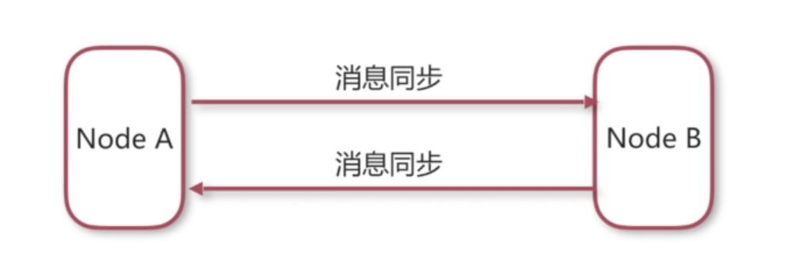      

节点A将消息同步给节点B，节点B将消息同步给节点A，通过这样的消息同步之后，节点A和节点B之间都有相同的消息。它的实现方式采用的是一种网络连接器的方式实现的

**NetworkConnector(网络连接器)**

网络连接器主要用于配置ActiveMQ服务器与服务器之间的网络通讯方式，用于服务器透传消息

网络连接器分为静态连接和动态连接

**静态连接器：**

在配置连接器的时候去指定具体的ip地址，参考一下配置

```xml
<networkConnectors>
	<networkConnector uri="static:(tpc://127.0.0.1:61617,tpc://127.0.0.1:61618)"/>
</networkConnectors>
```

**动态连接器：**

如果我们服务器比较多的时候，或者服务器可能需要动态扩展的时候，静态配置显然比较麻烦，这时我们需要使用动态连接，动态连接主要使用组播的方式实现的，参考一下配置

```xml
<transportConnectors>
	<transportConnector uri="tcp://localhost:0" discoveryUri="multicast://default"/>
</transportConnectors>
```

#### 5. Master/Slave 集群配置

这种集群方式主要有一下3种实现方案

- Share nothing storage master/slave (已经过时，5.8+后移除)，这里不了解
- Share storage master/slave 共享储存
- Replicated LevelDB Store 基于复制的LevelDB Store,主要使用zookeeper实现


**共享存储集群的原理：**

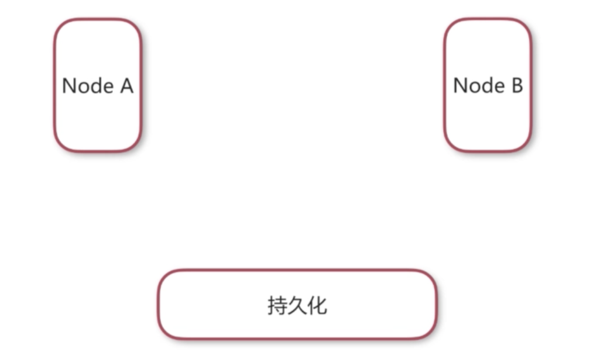  

假如我们有节点A和节点B两台服务器，还有一个共享的储存地址持久化（可以是jdbc的数据库，也可以是基于SAN的文件系统）。

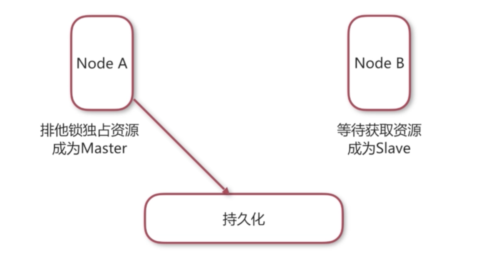  

然后我们将节点A和节点B都配置到同一个持久化地址后，先启动节点A，这时节点A获取到资源排它锁成为Master，节点B因为他获取不到锁资源成为Slave，成为Master的节点A获取到了对外服务开放的能力，可以通过外部的客户端提交信息到节点A，但是不能够发送信息到节点B。

  

如果节点A挂点了，节点B会立即获取到持久化资源的排它锁，节点B成为新的Master，可以接收外部客户端发送的消息，客户端使用失效转移之后将请求发送到节点B，这样就完成了整个请求的不间断性，达到了高可用效果。


**基于复制的LevelDB Store的原理：**

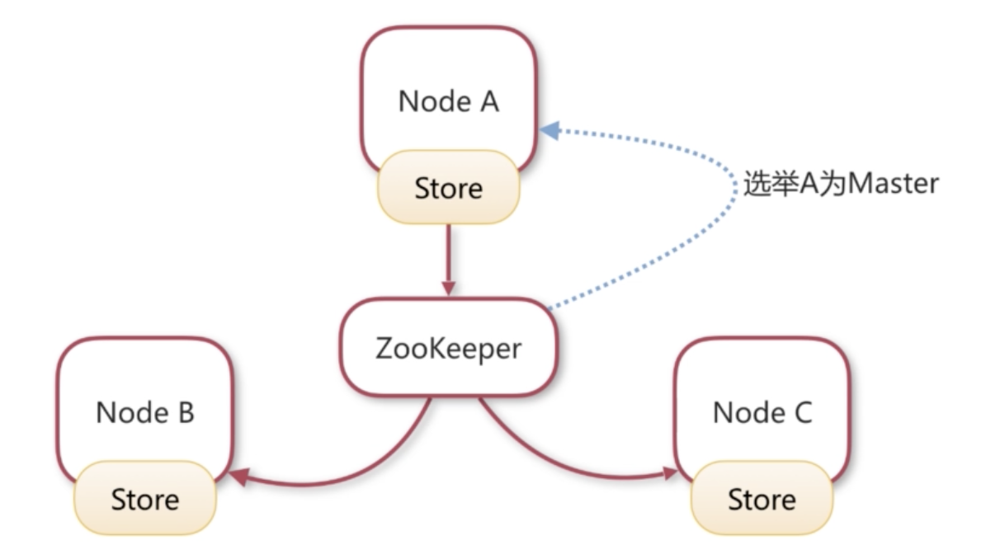  

因为LevelDB是基于zookeeper的，所以服务器至少需要3台，这里假设我们有3台服务器节点A/B/C，每个节点都有自己的持久化方式，因为她们都配置同样的zookeeper节点，通过zookeeper来选举一台服务器节点作为Master。比如选举了节点A作为Master，这时节点A成为Master之后，节点A具有了对外服务的能力，而节点B和节点C是不具有对外服务的能力的。节点A获取到外部发送过的消息之后，先进行本地储存（Store），然后通过zookeeper将消息同步给节点B和节点C，节点B和节点C分别在自己的服务器上储存。当然如果节点A出现故障，zookepper会立即选举一台新的Master出来。


#### 6. 两种集群方式的对比

|                | 高可用 | 负载均衡 | 特点                                                         |
| -------------- | ------ | -------- | ------------------------------------------------------------ |
| Master/Slave   | 是     | 否       | Slave服务器不具备对外服务的能力                              |
| Broker Cluster | 否     | 是       | 自己的消息没有在一个地方储存，当某台服务器挂掉的时候，消息可能会同步丢失 |

上边的两种集群方案要么是不支持负载均衡，要么不能高可用，是否有一种方案可以即可以负载均衡又可以做到高可用呢？


### 5.2 activeMQ集群实践

由于是演示配置，所以都在同一台机器上完成

#### 1. 三台服务器的完美集群方案

  

假如我们有3台服务器，我们可以组一个如上图的架构即达到高可用，又可以负载均衡。

节点A和节点B和节点C组成一个 Broker Cluster集群方案，然后节点B和节点C组成一个Master/Slave方案共享持久化内容。


#### 2. 实现配置

**配置说明：**

|        | 服务端口 | 管理端口 | 存储               | 网络连接器     | 用途           |
| ------ | -------- | -------- | ------------------ | -------------- | -------------- |
| Node-A | 61616    | 8161     | -                  | Node-B、Node-C | 消费者         |
| Node-B | 61617    | 8162     | /share_file/kahadb | Node-A         | 生产者、消费者 |
| Node-C | 61618    | 8163     | /share_file/kahadb | Node-A         | 生产者、消费者 |

上边因为Node-A配置的是Broker集群，所以Node-A不需要配置存储，Node-B和Node-C配置的是Master/Slave集群，所以需要配置存储。

Node-A只能做消费者（Broker Cluster集群），如果作为生产者的话，因为网络连接是双向连接，Node-A的消息能够被Node-B和Node-C消费掉，如果单Node-A上边有消息，但是还么有被消费的时候，如果Node-A节点挂掉，Node-B和Node-C就收不到消息。


**配置准备：**

```shell
#1.创建active_cluster目录，复制activemq安装包到里边，并解压3分作为节点A/B/C
$mkdir activemq_cluster
$cp apache-activemq-5.15.3-bin.tar.gz activemq_cluster
$tar -zxvf apache-activemq-5.15.3-bin.tar.gz
$cp apache-activemq-5.15.3 apache-activemq-nodeA
$cp apache-activemq-5.15.3 apache-activemq-nodeB
$cp apache-activemq-5.15.3 apache-activemq-nodeC

#2.创建一个共享文件夹用于nodeB和nodeC的共享储存文件夹
$ mkdir kahadb
```

**节点A配置:**

修改apache-activemq-nodeA/conf/activemq.xml，注释掉不需要使用的协议，服务端口为61618，新增网络连接配置，由于这里是已知的3台服务器，所以这里使用静态配置网络连接，连接到B和C两台服务器。

```xml
        <transportConnectors>
            <!-- DOS protection, limit concurrent connections to 1000 and frame size to 100MB -->
            <transportConnector name="openwire" uri="tcp://0.0.0.0:61616?maximumConnections=1000&amp;wireFormat.maxFrameSize=104857600"/>
            <!--

            	注释不需要的协议

            <transportConnector name="amqp" uri="amqp://0.0.0.0:5672?maximumConnections=1000&amp;wireFormat.maxFrameSize=104857600"/>
            <transportConnector name="stomp" uri="stomp://0.0.0.0:61613?maximumConnections=1000&amp;wireFormat.maxFrameSize=104857600"/>
            <transportConnector name="mqtt" uri="mqtt://0.0.0.0:1883?maximumConnections=1000&amp;wireFormat.maxFrameSize=104857600"/>
            <transportConnector name="ws" uri="ws://0.0.0.0:61614?maximumConnections=1000&amp;wireFormat.maxFrameSize=104857600"/>

       		-->
        </transportConnectors>

        <!-- 新增网络连接配置项，名字自定义，uri使用静态配置，连接到B和C两台服务器 -->
        <networkConnectors>
        	<networkConnector name="local_network" uri="static:(tcp://127.0.0.1:61617,tcp://127.0.0.1:61618)"/>
        </networkConnectors>
```

查看后端管理端口是否需要修改apache-activemq-nodeA/conf/jetty.xml,由于已经是8161，不需要修改

```xml
    <bean id="jettyPort" class="org.apache.activemq.web.WebConsolePort" init-method="start">
             <!-- the default port number for the web console -->
        <property name="host" value="0.0.0.0"/>
        <property name="port" value="8161"/>
    </bean>
```

**节点B配置：**

修改apache-activemq-nodeB/conf/activemq.xml，注释掉不需要使用的协议，配置服务端口为61617，新增网络连接配置，使用静态配置网络连接，连接到A服务器。并配置B与C的持久化共享文件目录

```xml
   <!--配置B与C的共享文件夹 -->
	<persistenceAdapter>
            <!--<kahaDB directory="${activemq.data}/kahadb"/> -->
            <kahaDB directory="/Users/caojx/Downloads/activemq_cluster/kahadb"/>
    </persistenceAdapter>
	
	<transportConnectors>
            <!-- DOS protection, limit concurrent connections to 1000 and frame size to 100MB -->
            <transportConnector name="openwire" uri="tcp://0.0.0.0:61617?maximumConnections=1000&amp;wireFormat.maxFrameSize=104857600"/>
            <!-- 注释不需要的协议 
            <transportConnector name="amqp" uri="amqp://0.0.0.0:5672?maximumConnections=1000&amp;wireFormat.maxFrameSize=104857600"/>
            <transportConnector name="stomp" uri="stomp://0.0.0.0:61613?maximumConnections=1000&amp;wireFormat.maxFrameSize=104857600"/>
            <transportConnector name="mqtt" uri="mqtt://0.0.0.0:1883?maximumConnections=1000&amp;wireFormat.maxFrameSize=104857600"/>
            <transportConnector name="ws" uri="ws://0.0.0.0:61614?maximumConnections=1000&amp;wireFormat.maxFrameSize=104857600"/>
            -->
        </transportConnectors>

        <!-- 新增网络连接配置项，名字自定义，uri使用静态配置，连接到A服务器 -->
        <networkConnectors>
            <networkConnector name="network_a" uri="static:(tcp://127.0.0.1:61616)"/>
        </networkConnectors>
```

修改apache-activemq-nodeB/conf/jetty.xml中的管理端口8162

```xml
    <bean id="jettyPort" class="org.apache.activemq.web.WebConsolePort" init-method="start">
             <!-- the default port number for the web console -->
        <property name="host" value="0.0.0.0"/>
        <property name="port" value="8162"/>
    </bean>
```


**配置C节点：**

修改apache-activemq-nodeC/conf/activemq.xml，注释掉不需要使用的协议，配置服务端口为61618，新增网络连接配置，使用静态配置网络连接，连接到A服务器。并配置B与C的持久化共享文件目录

```xml
   <!--配置B与C的共享文件夹 -->
	<persistenceAdapter>
            <!--<kahaDB directory="${activemq.data}/kahadb"/> -->
            <kahaDB directory="/Users/caojx/Downloads/activemq_cluster/kahadb"/>
    </persistenceAdapter>
	
	<transportConnectors>
            <!-- DOS protection, limit concurrent connections to 1000 and frame size to 100MB -->
            <transportConnector name="openwire" uri="tcp://0.0.0.0:61618?maximumConnections=1000&amp;wireFormat.maxFrameSize=104857600"/>
            <!-- 注释不需要的协议 
            <transportConnector name="amqp" uri="amqp://0.0.0.0:5672?maximumConnections=1000&amp;wireFormat.maxFrameSize=104857600"/>
            <transportConnector name="stomp" uri="stomp://0.0.0.0:61613?maximumConnections=1000&amp;wireFormat.maxFrameSize=104857600"/>
            <transportConnector name="mqtt" uri="mqtt://0.0.0.0:1883?maximumConnections=1000&amp;wireFormat.maxFrameSize=104857600"/>
            <transportConnector name="ws" uri="ws://0.0.0.0:61614?maximumConnections=1000&amp;wireFormat.maxFrameSize=104857600"/>
            -->
        </transportConnectors>

        <!-- 新增网络连接配置项，名字自定义，uri使用静态配置，连接到A服务器 -->
        <networkConnectors>
            <networkConnector name="network_a" uri="static:(tcp://127.0.0.1:61616)"/>
        </networkConnectors>
```

修改apache-activemq-nodeC/conf/jetty.xml中的管理端口8163

```xml
    <bean id="jettyPort" class="org.apache.activemq.web.WebConsolePort" init-method="start">
             <!-- the default port number for the web console -->
        <property name="host" value="0.0.0.0"/>
        <property name="port" value="8163"/>
    </bean>
```

**启动3台ActiveMQ:**

```shell
$./apache-activemq-nodeA/bin/activemq start
$./apache-activemq-nodeB/bin/activemq start
$./apache-activemq-nodeC/bin/activemq start
```

启动之后，可以在浏览器中访问节点Ahttp://127.0.0.1:8161 和节点Bhttp://127.0.0.1:8162 而节点C由于在B的后边启动所以作为节点B的Slave暂时不能访问，当B节点挂调后C节点会获得资源成为新的Master，就可以方位节点Chttp://127.0.0.1:8163。


#### 3. 编码

生产者

```java
package caojx.learn.jms.queue;

import org.apache.activemq.ActiveMQConnectionFactory;

import javax.jms.*;

/**
 * @author caojx
 * Created on 2018/3/13 下午下午12:41
 * jms队列模式-消息生产者
 */
public class AppProducer {

    //配置多个节点，failover失效转移，当61617节点失效之后，会将请求转向61618节点，randomize表示从节点列表中随机选择一台
    public static final String url="failover:(tcp://127.0.0.1:61617,tcp://127.0.0.1:61618)?randomize=true";
    public static final String queueName="queue-test"; //队列名称


    public static void main(String[] args) throws JMSException {

        //1.创建ConnectionFactory
        ConnectionFactory connectionFactory = new ActiveMQConnectionFactory(url);

        //2.创建Connection
        Connection connection = connectionFactory.createConnection();

        //3.启动连接
        connection.start();

        //4.创建会话，第一个参数表示是否在事务中处理，由于是演示代码所以不使用事务false，第二个参数是连接应答模式，Session.AUTO_ACKNOWLEDGE表示自动应答
        Session session = connection.createSession(false, Session.AUTO_ACKNOWLEDGE);

        //5.创建一个目标 队列
        Destination destination = session.createQueue(queueName);

        //6.创建一个生产者,并指定目标
        MessageProducer producer = session.createProducer(destination);

        for (int i = 1; i <= 100; i++) {
            //7.创建消息
            TextMessage textMessage = session.createTextMessage("test"+i);
            //8.发送消息
            producer.send(textMessage);
            System.out.println("发送消息"+textMessage.getText());
        }
        //9.关闭连接
        connection.close();
    }
}

```


消费者

```java
package caojx.learn.jms.queue;

import org.apache.activemq.ActiveMQConnectionFactory;

import javax.jms.*;

/**
 * @author caojx
 * Created on 2018/3/13 下午下午12:56
 * jms队列模式-消息消费者
 */
public class AppConsumer {

    //配置多个节点，failover失效转移，当61616节点失效之后，会将请求转向61617节点或，61618节点 randomize表示从节点列表中随机选择一台
    public static final String url="failover:(tcp://127.0.0.1:61616,tcp://127.0.0.1:61617,tcp://127.0.0.1:61618)?randomize=true";

    public static final String queueName="queue-test"; //队列名称

    public static void main(String[] args) throws JMSException {

        //1.创建ConnectionFactory
        ConnectionFactory connectionFactory = new ActiveMQConnectionFactory(url);

        //2.创建Connection
        Connection connection = connectionFactory.createConnection();

        //3.启动连接
        connection.start();

        //4.创建会话，第一个参数表示是否在事务中处理，由于是演示代码所以不使用事务false，第二个参数是连接应答模式，Session.AUTO_ACKNOWLEDGE表示自动应答
        Session session = connection.createSession(false, Session.AUTO_ACKNOWLEDGE);

        //5.创建一个目标 队列
        Destination destination = session.createQueue(queueName);

        //6.创建一个消费者,并指定目标
        MessageConsumer consumer = session.createConsumer(destination);

       //7.创建一个监听器,接收消息
        consumer.setMessageListener(new MessageListener() {
            public void onMessage(Message message) {
                TextMessage textMessage = (TextMessage) message;
                try {
                    System.out.println("接收消息："+textMessage.getText());
                } catch (JMSException e) {
                    e.printStackTrace();
                }
            }
        });

        //注意，由于消息接收是异步的，所以不能关闭connection
        //connection.close();
    }
}
```

#### 4. 测试

测试的时候我们可以停止任何一台节点nodeA/nodeB/nodeC服务器，然后测试结果是停止任何一台服务器服务依然正常，即使停掉2台剩下一台服务也依然正常。


## 六、企业级系统中的最佳实践

本节主要了解企业级系统中的现状，分析存在的问题，然后提出解决方案

**实际业务场景分析：**

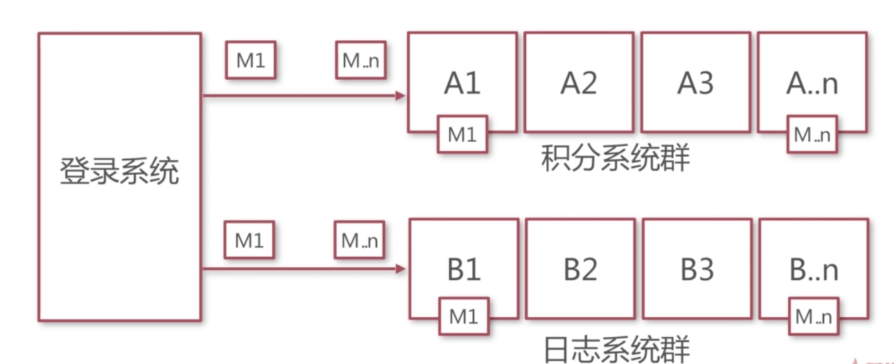  

如上图所示某个企业总存在3个子系统登录系统，积分系统和日志系统，其中每个子系统都进行了集群，用户登录操作后要保证将登录事件通知到积分系统和业务系统，并且积分系统和日志系统不能重复收到这个消息，登录成功后要将登录事件发送到积分系统和日志系统。

**实际业务场景特点：**

- 子业务系统都有集群的可能性
- 同一个消息会广播给关注改消息的所有子系统
- 同一类消息在集群中被负载消费
- 业务的发生和消费的发布最终一致性

**需要解决的问题：**

- 不同业务系统分别处理同一个消息，同一业务系统负载处理同类消息
- 解决消息发送时的一致性问题
- 解决消息处理时的幂等性问题
- 基于消息机制简历事件总线

**集群系统处理消息方案**

使用JMS级联的解决方案1：

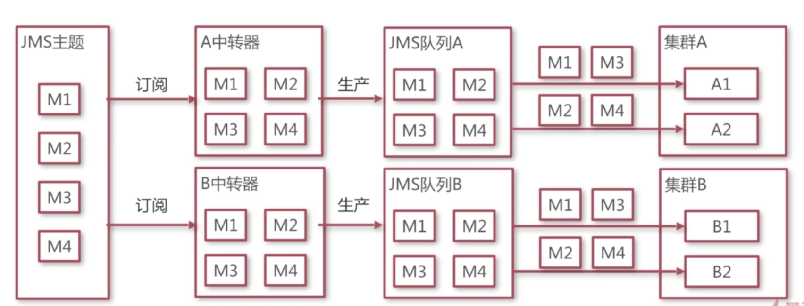  

JMS存在两种消息模式，发布/订阅和消息队列模式，我们需要将两种模式结合起来应用。如上图发布者将消息发送到JMS主题，然后两个中转器接收主题中的消息，然后再将消息发送到JMS队列中，最后集群系统负载消费。

这个方案主要存在几个问题，主要是中转器的使用增加了开发的复杂性，因为每增加一个业务系统集群都需要增加一个中转器，并且需要保证中转器的高可用，如果中转器出现故障消息将在主题中堆积，如下是解决这类问题的犯案。

使用ActiveMQ的虚拟主题解决方案2:

- 发布者：将消息发布到一个主题中，主题明为VirtualTopic开头，如VirtualTopic.Test
- 消费者：从队列中获取消息，在队列名中表明自己的身份，如Comsumer.A.VirtualTopic.Test

**解决消息发送时的一致性为题：**

使用JMS中的XA系列的接口保证强一致性：

- 引入分布式事务
- 要求业务操作必须支持XA协议

使用消息的本地事务解决方案1：

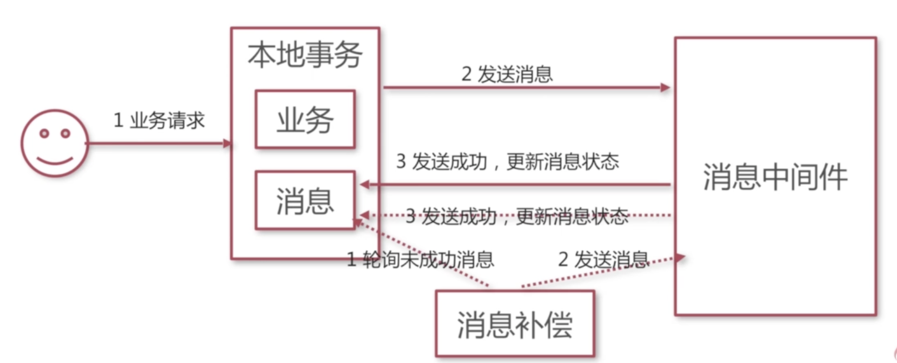  


使用内存日志的解决方案2：

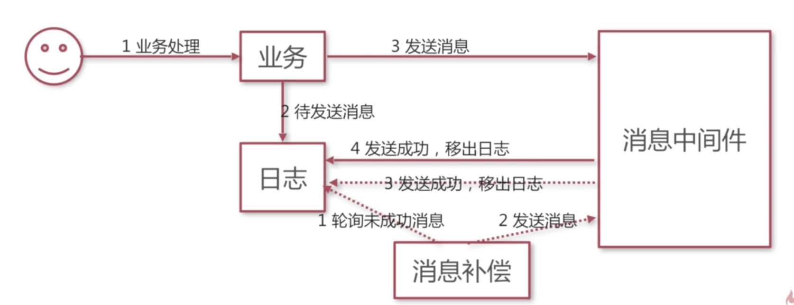


**解决消息处理时的幂等性问题：**

使用本地消息表的本地事务解决方案1：

  

1消费者从消息中间件获取消息，2消费者查询日志消息是否已经处理过，3如果没有处理消费者开始使用本地事务处理业务，和更新消息状态，4最后向消息中间件确认消息。

使用内存日志的解决方案2：

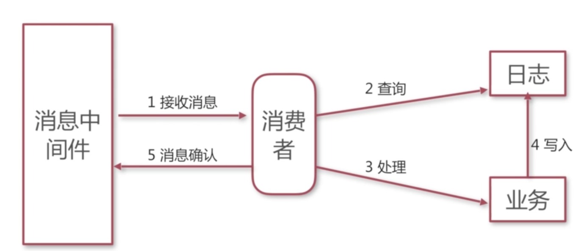  

1消费者从消息中间件获取消息，2消费者去查询本地内存日志是否已经处理过，3如果说当前消息没有被处理，那么进行业务处理，4业务处理成功之后更新本地内存日志。5最后再确认消息。

**基于消息机制简历事件总线:**

使用了最终一致性后系统变得很复杂，不管是发送方还是接收方都需要做更多的事情，为了简化开发我们需要将一些代码进行复用，将有规律性的代码放到一起。

我们之前的消息发送接收就像是一个事件，发送者就是事件的发起者，消费者就是时间的影响者，这样的架构方式也称为事件驱动。

什么是事件驱动架构？

事件驱动架构（Event Driven Architecture, EDA）定义了一个设计和实现一个应用系统的方法学，在这个系统里事件可传输于松散耦合的组件服务之间。

特点：有事我找你，没事别烦我，就是不要是不是来问我有关于你关注的消息，有消息的时候我会通知你

案例：

https://github.com/jovezhao/nest

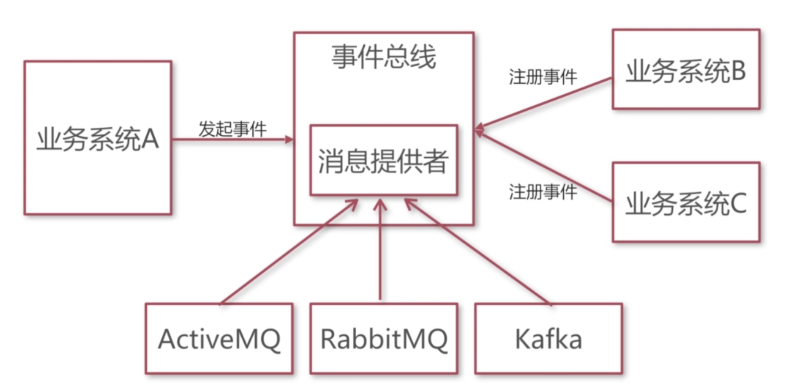

首先我们假如我们有3个业务系统，使用事件总线来简化业务事件之间的发布接收，业务系统B/C通过事件总线提供的方法进行事件注册，业务发起系统通过事件总线提供的方法进行发起事件。这样事件总线就实现了事件的发送和接收以及内存日志的处理。但是事件总线还不具备消息中间件的功能，所以事件总线还需要定义一个抽象的消息提供者，然后我们可以根据不同的消息中间件提供消息提供者，比如ActiveMQ/RabbitMQ/Kafka消息提供者。

该事件总线编码可以参考：https://github.com/jovezhao/nest

## 七、使用其他消息中间件

这里只是对消息进行简单的原理，源码见：https://github.com/jovezhao/nest

之前的消息中间件中我们使用的都是ActiveMQ,ActiveMQ最大的优点就是JMS，jms使得Java消息中间件的开发变得简单，但是ActiveMQ各方面都表现的比较中庸，存在很多自己的缺点，比如吞吐量没有kafka强，稳定性没有RabbitMQ强。在企业开发中往往也不只是基于ActiveMQ的开发，还有其他许多优秀的消息中间件。下边简单介绍一下其他消息中间件的使用方法。

**企业开发需要解决的问题：**

在前面的企业开发过程中我们了解了企业开发中需要解决的问题：

- 不同业务系统分别处理同一个消息，同一业务系统负载处理同类消息
- 解决消息发送时的一致性问题
- 解决消息处理时的幂等性问题
- 基于消息机制简历事件总线

我们使用其他消息中间件时只需要解决

- 解决个业务系统集群处理同一条消息
- 实现自己的消息提供者

常用的消息中间件

- ActiveMQ
- RabbitMQ
- Kafka

### 7.1 集成RabbitMQ

**RabbitMQ:使用交换器绑定到队列**

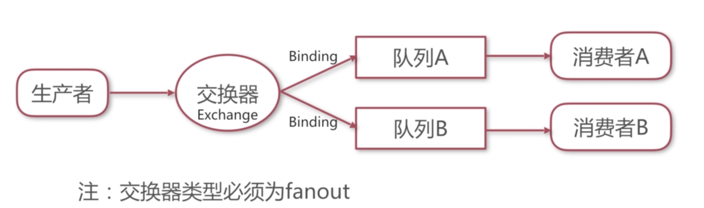  

在RabbitMQ中消费者首先需要将队列与交换器绑定，生产者不是直接将消息发送到队列而是发送到交换器。

**RabbitMQ消息提供者源码解析**

- 创建ConnectionFactory
- 创建Connection
- 创建Channel通道
- 基于通道创建一个交换器Exchange
- 定义Queue队列并将队列绑定到交换器

### 7.2 集成Kafka

**Kafka使用group.id分组消费者**

- 配置消息者参数group.id相同时对消息进行负载处理
- 配置服务器partitions参数，控制同一个group.id下的consumer数量小于partitions
- kafka只保证同一个partition下的消息是有序的

**Kafka消息提供者源码分析：**

- 创建生产者
- 创建消费者

## 参考与推荐文章

[理解JMS规范中消息的传输模式和消息持久化](http://blog.csdn.net/wilsonke/article/details/42804245)

[理解JMS规范中的持久订阅和非持久订阅](http://blog.csdn.net/aitangyong/article/details/26013387)

[Spring整合JMS(消息中间件)](http://blog.csdn.net/suifeng3051/article/details/51718675)

[ActiveMQ订阅模式持久化实现](http://blog.csdn.net/fulai0_0/article/details/52127320)

https://www.cnblogs.com/wangjian1990/p/6689703.html