# Docker化的Java应用

[TOC]

最近几年Docker是特别的火，可以说有云计算的地方就有Docker，Docker之所以能这么火，确实是解决了大部分企业的痛点。
比如说快速的持续集成，服务的弹性伸缩，部署简单解放运维，还有更重要的是它为企业节省了机器资源，目前已有很多公司
在生产上大规模的使用Docker。Docker已经成为了IT开发人员的必备技能。

本笔记了解：
- 什么是Docker
- 理解Docker
- Docker的简单使用
- Nginx服务
- Docker化的Java Web

## 一、什么是Docker

Docker历史
- 2010年dotCloud PASS成立
- 2013年Docker开源
- 2014年6月Docker发布了第一个里程碑版本Docker1.0
- 至今

什么是Docker?  
Docker是一个用来装应用的容器，就像杯子可以装水，笔筒可以放笔，你可以将HelloWorld放在Docker里，可以把网站放在Docker里
可以将你任何想的到的程序放到Docker里。
- Docker is the world’s leading software container platform，Docker是世界领先的容器化平台
- 由Docker公司开发，开源，托管在GitHub
- 跨平台，支持Windows、MacOS、Linux

Docker思想  
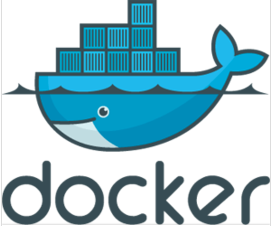  
上图是Docker的Logo，是一条鲸鱼驮着很多的集装箱在大海里自由的翱游，这个Logo非常形象的体现了Docker的思想
- 集装箱  
    在没有集装箱的时候运输货物是非常零散的，货物非常容易掉，有了集装箱之后，货物都装到箱子里边去，箱子是密封的，相对也很
    不容易丢失，这容易将货物安全原样的送到目的地。我们可以将货物想象成我们的程序，假如目前你需要将一个运行的程序部署到另外一
    台机器上去，很容易出现少考了数据，或配置文件而导致启动不起来，大多是认为的疏忽导致的错误，而Docker的集装箱就是帮我们解决
    这样的问题，它这可保证我们的应用程序不管放在哪里都不会缺东西。

- 标准化
  - 运输方式：Docker运输程序有一个超级码头，任何一个地方需要货物的时候，都由鲸鱼先送到超级码头，然后再由鲸鱼从超级码头将
    货物送到目的地。
  - 存储方式：比如你将程序拷贝到笔记本上的时候，你需要指定一个目录，你还得记住这个目录，免得下次你需要改里边的东西，你可
    能还需要往这里传。有了Docker之后，这些我们都不需要了，因为你不需要关心你的应用存在什么地方，你想要运行或停止你的应用程
    序的时候，你只需要执行一个命令就可以了。
  - API:Docker提供了一系列的RestAPI接口，包含了对Docker，也就是对应用的启动、停止、删除、查看等控制，比如说你不用Docker
    的时候，如果你要启动的的Web应用的时候，你需要启动Tomcat的startup命令，停止的时候执行shutdown命令，如果你不使用Tomcat服务
    器，你可能还需要使用别的命令来控制。有了接口标准化，你只需要执行同样的命令就可以控制所有的应用。

- 隔离
    隔离以下子可能不太明白，虚拟机知道吧，你要用虚拟机的时候，有自己的可用内存，有硬盘有CPU的存在，完全感觉不到外边主机的存在，
    Docker也差不多，不过在技术上Docker更加轻量，可以实现快速的创建和销毁，比如你创建一个虚拟机可能需要等个几分钟，但是创建Docker
    只需要1s。这种隔离最底层的技术实际上是Linux的一种内核限制机制叫LXC，LXC是一种轻量级的容器虚拟化技术，它最大效率的隔离了进程和
    资源，通过cgroup，namespace等限制隔离进程组和使用的物理资源，比如CPU、内存、IO等等。这种机制早在七八年前加入到Linux内核了
    只是在2013年Docker出世的时候他才火起来。

Docker解决了什么问题？  
如果一个应用要正常的运行需要什么？比如一个JavaWeb程序启动起来需要依赖什么？我觉得，需要这么几个部分，首先依赖与最底层的操作系统，
然后操作系统上依赖于JDK、Tomcat、代码、配置文件。操作系统变了可能导致我们的程序运行失败，比如说程序中调用了某些系统命令，换了一
个系统调不起来了。JDK版本也可能导致程序的运行失败，比如说.class文件是用1.7编译的，运行环境装了一个1.6的JDK，就会发现.class识别
不了。Tomcat版本也可能导致程序运行的失败，比如说旧版本的配置在新的版本中不太支持了。代码旧更加有可能了，比如说你的代码引用了一个
C盘或D盘等文件，或者使用了某些系统的环境编码等等。配置也是一样，首先就是可能你少了某些配置文件，要么是你的一些配置是跟系统相关的，
换了一个环境旧运行不起来了。

Docker会将操作系统、JDK、Tomcat、代码、配置一个个的放到集装箱中，再打包放到鲸鱼上，由鲸鱼给我们送到服务器上，在你的机上怎么运行
在服务器上也就怎么运行，不会有任何的问题，也就是说Docker解决了运行环境不一致的问题。

系统好卡，那个哥们又写死循环了？如果大家要跟别人共用服务器的场景，可能会有这样的体会，莫名其妙的发现自己的程序挂了，啥原因，要么是内存
不够了，要么是内存满了。还有就是忽然发现某个服务变慢了，甚至使用终端都比较卡，但是Linux本身就是一个多用户的操作系统，可以给多个用户使用，
怎么办呢？Docker的隔离机制旧解决了这种问题，Docker是怎么解决的呢，如果将大家的程序放到Docker里边运行，就算别人的程序还是死循环，疯狂的
吃CPU，疯狂的打日志把磁盘占满，或者是占用大量的内存，内存泄露，最后都不会导致别人的程序运行错误，只会导致自己的程序运行错误。因为Docker
在启动的时候就给它限定好了最大使用的CPU、内存、硬盘资源等，如果超过了分配的资源就会停止运行。

双十一来了，服务器快撑不住了?大家知道大部分业务量不是每天都是很平均的，特别是电商系统，每年总是会有那么几天业务量要比平时多几倍甚至是几十
倍，比如说双十一，如果按平时的量去准备服务器，大规模访问的时候肯定撑不住，但是每天都按照双十一的情况去准备服务器，那就是极大的浪费，所以就
只能在节日前临时扩展机器，过完节再将多余的机器下线，这就给运维带来了极大的工作量，一到这种节日运维人员需要在每台机器上部署各种各样的服务，
大家知道我要运行一个程序需要装Java、Tomcat等很多东西，并且很有可能启不来，还需要调试。有了Docker之后，一切都变得非常美好了，只需要点击
一下鼠标，就可以从十台服务器变为一百台甚至是更多，这都是分分钟的事，为什么会这么快，这就是Docker标准化的优势，不管在那台机器上，不管要
运行什么服务，都是用标准的方式将我们的程序运过来，下载过来，再用标准的方式将他运行起来，我就可以做到，只要在每台机器上执行一两条命令，就可
以让程序正常跑起来，并且不用担心会不会有问题，总结就是，Docker的标准化让快速扩展弹性伸缩变得简单。

## 二、Docker核心技术
Docker里边有三个词汇镜像、产库、容器，我们可以这样理解镜像就是我们之前说的集装箱，仓库就是超级码头，容器就是我们运行程序的地方，使用Docker
运行程序的过程就是取仓库把镜像拉到本地，然后用一条命令将镜像运行起来，变成容器。

### 2.1Docker镜像
镜像的英文名叫Image。前面我们说到集装箱，想像以下，鲸鱼驼着所有的集装箱就是一个镜像。从本质上来说镜像到底是什么呢？其实镜像就是一系列的文件
他可以包括我们应用程序的文件，也可以包括应用运行环境的文件，Docker会将这些文件保存到本地，既然保存了，那么是以什么样的格式来保存呢，说到镜像
的存储格式，就要说到Linux的存储一个技术即联合文件系统UFS（Union File System）,他是一种增强的文件系统，他可以将不同目录挂载同一个虚拟文件
系统下。如下，我们可以在test目录下可以同时看到test1与test2目录的内容。  
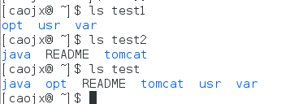  
通过联合文件系统我们就可以实现对文件的分层，比如说test1可以看成是第一层，test2是第二层，每一层有每一层自己的文件，Docker镜像就是利用了这种
分层的概念来实现镜像的存储。下边这张图就是一个镜像的存储格式，可以很明显的看到这个图是分层的，就好像一个个的集装箱合在一起。最底层是一个操作
系统的引导，倒数第二层是一个具体的Linux操作系统，倒数第三层可以看成是我们的JDK，Tomcat等，倒数第四层可以看成是我们的代码，顶层后便再说到。
每一层都是可以控制的。Docker镜像中的每一层文件系统都是只读的，然后每一层加载完成后，这些文件都会看成是同一个目录。相当于只有一个文件系统。
Docker这个文件系统就成为镜像。  
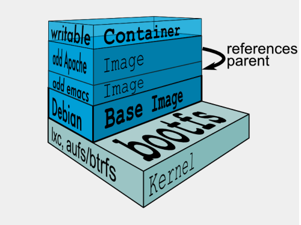

### 2.2Docker容器
容器的本质就是一个进程，我们可以暂时将容器想象成一个虚拟机。如下图所示，每个虚拟机都有自己的文件系统，我们可以将下图中的整个部分看成是容器的
文件系统，只不过Docker的这个文件系统是一层一层的，并且最下边的n层都是只读的，只有最上边的那一层是可写的。为什么需要有可写的一层呢？想想大家
的程序，必然会写一些日志，写一些文件，或者是对系统的某些文件作一些修改，这是大部分程序都有的需求，所以在最上边容器层创建了一个可读可写的文件
系统。如果程序在运行过程中需要写一个镜像里边的文件，这种情况会发生什么呢?因为镜像的每一层都是只读的，所以在写这个文件之前会将这个文件拷到容器，
然后再对其进行修改。修改之后，当我们的应用读一个文件的时候，他会从最顶层开始查找，如果没有就会到下一层取查找。由于容器层即最顶层是可读可写的，
而下边的镜像层只是可读的，这样就可以保证我们的同一个镜像可以生成多个容器独立运行，且他们之间没有任何干扰。    


### 2.3Docker仓库
构建镜像的目的最要是需要在其他的机器和其他的环境运行我们的程序，如果只需要在我本机上运行的化就不需要构建镜像了，既然要让我们的镜像在其他机
器上运行，首先我们就需要将我们的镜像传送到其他机器上，我们可以利用Docker仓库完成这个传输过程，我们需要将我们的镜像传送到我们的Docker仓库
中，在由我的目的地从Docker仓库把我们需要运行的镜像拉过去这就完成了传输过程。谁提供了Docker仓库呢，我们得有个中央服务器提供给我们一个地址
去访问他，是谁提供了这样的一个服务呢，Docker官方和很多国内公司都由提供一公共的镜像仓库,我们可以将我们的镜像传送过去，如下：  
[https://hub.docker.com](https://hub.docker.com)  
[https://c.163.com/](https://c.163.com/)  
如果我们的镜像比较私密，或只是公司内部使用，Docker同样支持搭建自己的仓库中心，我们将自己的镜像传送到自己的Docker仓库就可以使用。

## 三、Docker的安装

### 3.1Windows安装
Win10之外：  
[https://www.docker.com/products/docker-toolbox](https://www.docker.com/products/docker-toolbox)
Win10:  
[https://www.docker.com/products/docker#/windows](https://www.docker.com/products/docker#/windows)

下边我们演示Docker在windows7中的安装  
1.下载对应的Windows版本（主要是Windows7）
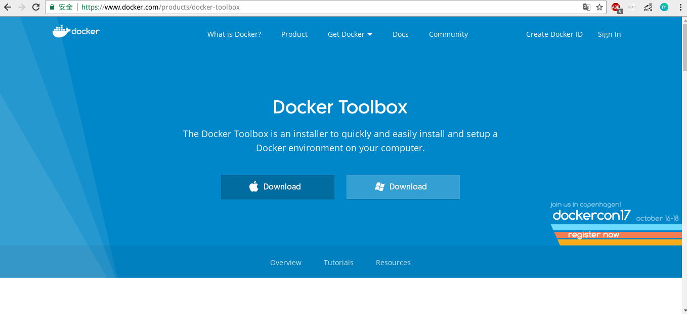    
2.下载后安装  
DockerToolbox-17.06.0a-ce.exe，注意，如过我们本机没有安装Git for Windows，则安装过程中需要勾选Git for Windows，如过已经安装，
不用勾选，不过每次运行Docker Quickstart Terminal的时候，需要指定C:\Program Files\Git\bin\bash.exe  
如下安装完成后运行出错，告诉我们缺少boot2docker.iso，我们可以查看Docker的安装目录是否有该文件，有的话将其复制到  
 用户目录D:\Users\caojx\.docker\machine\cache\boot2docker.iso，没有的话按照步骤3下载boot2docker.iso      
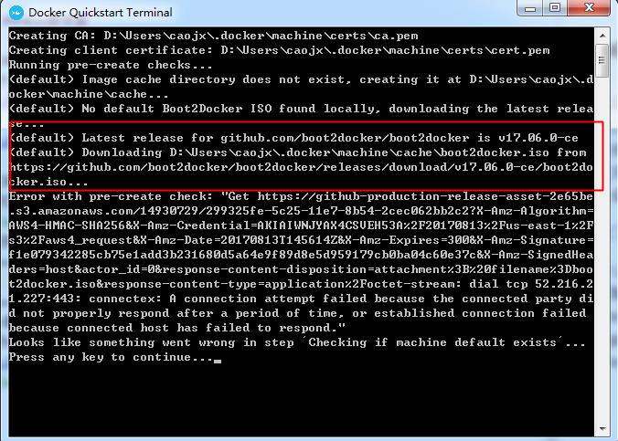    
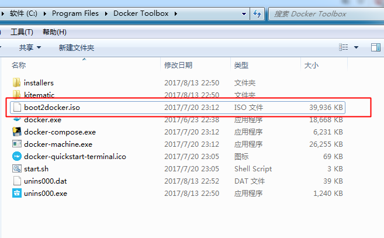     
3.下载boot2docker.iso      
在Docker首次启动时需要下载的一个boot2docker.iso,复制文件boot2docker.iso到C:\Users\caojx\.docker\machine\cache\boot2docker.iso目录，
重新打开Docker Quickstart Terminal    
[https://github.com/boot2docker/boot2docker/releases](https://github.com/boot2docker/boot2docker/releases)    
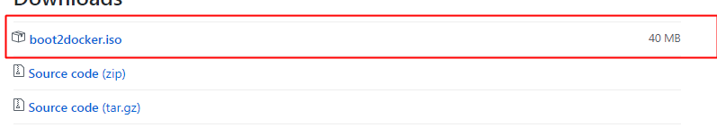  
4.运行Docker
拷贝boot2docker.iso到D:\Users\caojx\.docker\machine\cache\boot2docker.iso我们可以看到Docker在Windows7上成功运行  
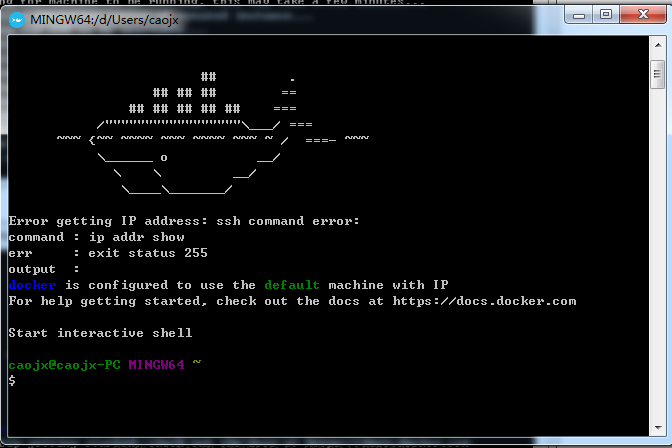  
不过运行docker version出现如下错误 ，原因是我BIOS没有设置启用虚拟化技术，设置好后就可以了。  
An error occurred trying to connect: Get http://%2F%2F.%2Fpipe%2Fdocker_engine/v1.30/version: open //./pipe/docker_engine:   
The system cannot find the file specified.  

### 3.2MacOS安装
1.下载地址，安装  
[https://www.docker.com/docker-mac](https://www.docker.com/docker-mac)  
MacOS上安装Docker是最简单的，只需要双击运行安装文件就可以，这里不过多的介绍  
2.验证是是否安装成功，没有错误即成功安装    
docker version  
### 3.3Linux安装
1.系统要求
- 64-bit 系统
- kernel 3.10+
  2.检查内核版本是否大于3.10  
```text
$ uname -r
```
3.确保yum是最新的
```text
$ yum update
```
4.添加yum源
```text
$ sudo vim /etc/yum.repos.d/docker.repo
```
在docker.repo文件中添加如下内容
```text
[dockerrepo] 
name=Docker Repository 
baseurl=https://yum.dockerproject.org/repo/main/centos/$releasever/ 
enabled=1 
gpgcheck=1 
gpgkey=https://yum.dockerproject.org/gpg
```
5.安装docker
```text
$ sudo yum install -y docker-engine
```
6.启动docker
```text
# systemctl start docker.service
# docker version
Client:
 Version:      17.05.0-ce
 API version:  1.29
 Go version:   go1.7.5
 Git commit:   89658be
 Built:        Thu May  4 22:06:25 2017
 OS/Arch:      linux/amd64

Server:
 Version:      17.05.0-ce
 API version:  1.29 (minimum version 1.12)
 Go version:   go1.7.5
 Git commit:   89658be
 Built:        Thu May  4 22:06:25 2017
 OS/Arch:      linux/amd64
 Experimental: false
```
参考文章：  
[http://blog.csdn.net/yuanchao99/article/details/51396979](http://blog.csdn.net/yuanchao99/article/details/51396979)  
[http://www.imooc.com/article/16448](http://www.imooc.com/article/16448)

## 四、第一个Docker镜像
docker的多数命令跟git有点相似，如果会使用git的话，使用起docker更加容易，提示下边的所有实验是在CentOS7上完成的  

1.拉取镜像
从docker仓库中拉取镜像
```text
docker pull [OPTIONS] NAME[:TAG|@DIGEST]
-NAME 表示拉取镜像的名字
-TAG  可选，默认是最新的
```
2.查看本机有的docker的镜像
```text
docker images [OPTIONS] [REPOSITORY[:TAG]]
```
测试如下
```text
# docker pull hello-world
Using default tag: latest --默认是最新的版本
latest: Pulling from library/hello-world
b04784fba78d: Pull complete 
Digest: sha256:f3b3b28a45160805bb16542c9531888519430e9e6d6ffc09d72261b0d26ff74f
Status: Downloaded newer image for hello-world:latest
# docker images  --查看下载的镜像
REPOSITORY          TAG                 IMAGE ID            CREATED             SIZE
hello-world         latest              1815c82652c0        2 months ago        1.84kB
```
上边我们没有指定docker仓库的地址，这时我们拉取docker镜像的时候，就会从默认的docker仓库[https://hub.docker.com](https://hub.docker.com)拉取镜像。

3.运行docker镜像
```text
# docker run [OPTIONS] IMAGE [COMMAND] [ARG...]
```
测试如下
```text
# docker run hello-world

Hello from Docker!
This message shows that your installation appears to be working correctly.

To generate this message, Docker took the following steps:  --消息生成的步骤
 1. The Docker client contacted the Docker daemon. --1.Docker client 连接了Docker daemon
 2. The Docker daemon pulled the "hello-world" image from the Docker Hub. --2.Docker daemon从远程仓库拉取了"hello-world"镜像
 3. The Docker daemon created a new container from that image which runs the --3.Docker daemon创建了新的容器，这个容器运行了可执行文件，可以执行文件生成了当前输出
    executable that produces the output you are currently reading.
 4. The Docker daemon streamed that output to the Docker client, which sent it --4.Docker daemon把输出流给到Docker client，然后输出到终端
    to your terminal.

To try something more ambitious, you can run an Ubuntu container with:
 $ docker run -it ubuntu bash

Share images, automate workflows, and more with a free Docker ID:
 https://cloud.docker.com/

For more examples and ideas, visit:
 https://docs.docker.com/engine/userguide/
```
4.docker的运行过程如下图所示  
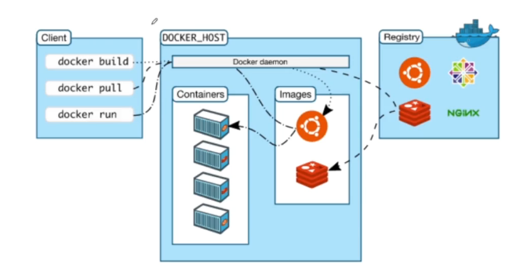
- Client 本机  
- DOCKER_HOST 可以看成Docker Daemon部分  
- Registry Docker远程仓库  
  5.停止容器运行
```text
# docker stop [OPTIONS] CONTAINER [CONTAINER...]
```

## 五、运行Nginx镜像

1.从网易蜂巢中下载nginx镜像  
网易蜂巢镜像仓库地址[https://c.163.com/hub#/m/home/](https://c.163.com/hub#/m/home/)，需要注册才可访问    
```text
# docker pull hub.c.163.com/library/nginx:latest  --运行nginx镜像
latest: Pulling from library/nginx
5de4b4d551f8: Pull complete 
d4b36a5e9443: Pull complete 
0af1f0713557: Pull complete 
Digest: sha256:f84932f738583e0169f94af9b2d5201be2dbacc1578de73b09a6dfaaa07801d6
Status: Downloaded newer image for hub.c.163.com/library/nginx:latest
#docker images
REPOSITORY                    TAG                 IMAGE ID            CREATED             SIZE
hello-world                   latest              1815c82652c0        2 months ago        1.84kB
hub.c.163.com/library/nginx   latest              46102226f2fd        3 months ago        109MB
```
2.运行nginx镜像
```text
# docker run -d hub.c.163.com/library/nginx 
fd7e968320289e7a374cf12dce4e6374873dbc2c39f33ad7bf51edeb1d016801
#docker ps --查看docker上正在运行的容器
CONTAINER ID        IMAGE                         COMMAND                  CREATED             STATUS              PORTS               NAMES
fd7e96832028        hub.c.163.com/library/nginx   "nginx -g 'daemon ..."   10 minutes ago      Up 10 minutes       80/tcp              flamboyant_kirch
```
3.查看容器的内部结构
通过如下nginx容器内部结构的查看，我们可以看出整个容器就相当于小型的虚拟机
```text
# docker exec --help
Usage:	docker exec [OPTIONS] CONTAINER COMMAND [ARG...]

Run a command in a running container

Options:
  -d, --detach               Detached mode: run command in the background
      --detach-keys string   Override the key sequence for detaching a container
  -e, --env list             Set environment variables
      --help                 Print usage
  -i, --interactive          Keep STDIN open even if not attached  --交互
      --privileged           Give extended privileges to the command
  -t, --tty                  Allocate a pseudo-TTY --终端
  -u, --user string          Username or UID (format: <name|uid>[:<group|gid>])
# docker exec -it fd7e96832028 bash --ffd7e96832028 为容器的编号，使用docker ps可看，bash为打开bash终端
root@fd7e96832028:/# ls --这是就像进入一个新的电脑一样
bin  boot  dev	etc  home  lib	lib32  lib64  libx32  media  mnt  opt  proc  root  run	sbin  srv  sys	tmp  usr  var
root@fd7e96832028:/# which nginx
/usr/sbin/nginx
```
## 六、Docker网络
1.docker网络
上边我们已经使用Docker运行了nginx，但是还没有通过浏览器访问到nginx，下边我们了解以下Docker的网络部分，以便通过网络访问我们的nginx
- 网络类型
  大家知道Docker的隔离性，网络也是隔离性的一部分，Linux利用了namespace命令空间来进行资源的隔离，比如PID namespace是用来隔离进程的，network  
  namespace就是用来隔离网络的，每一个network namespace都提供了一份独立的网络环境包括像网卡、路由、iptable规则等等，都是以其他存在的network 
  namespace隔离的。
  Docker容器提供了如下三种网络模式：
 - Bridge(桥接模式)：Docker容器一般情况下会分配一个独立的network namespace。
 - Host(仅主机模式)：如果启动容器使用Host模式，那么这个容器将不会获得一个独立的network namespace，而是和主机共同使用一个，这时候容器
    将不会虚拟出自己的网卡和配置自己的ip等，而是会使用宿主机上的ip和端口，也就是说你在Docker里边使用网络和在主机上使用网络是一样的。
 - None：没有网络，这种情况Docker将不会跟外界的任何东西通讯。
- 端口映射
  当使用Bridge模式的时候，就涉及到了一个问题，既然他使用的网络有独立的namespace，这就需要有一种技术使得容器内的端口可以在主机上访问到，
  这种技术就是端口映射。Docker可以将容器里边的端口映射到宿主机中的某个端口，当你在访问主机的某个端口的时候，其实就是你在访问容器里边的端口。  
  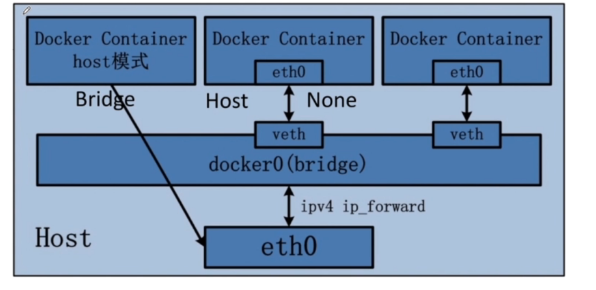

2.主机与Docker容器端口映射演示
- 使用指定的主机端口映射容器中的端口
```text
#docker ps --查看运行的nginx，默认使用80端口
CONTAINER ID        IMAGE                         COMMAND                  CREATED             STATUS              PORTS               NAMES
fd7e96832028        hub.c.163.com/library/nginx   "nginx -g 'daemon ..."   3 hours ago         Up 3 hours          80/tcp              flamboyant_kirch
#docker stop fd7e96832028 --先停止nginx容器
fd7e96832028
#docker -d -p 8080:80 hub.c.163.com/library/nginx  --docker -d -p 宿主机的端口:容器的端口 镜像名称
165f22d6a219684302b437fb01593d0c6d5a580c870d677fa8a142a37b016951
# netstat -na | grep 8080 --8080端口已经处于监听状态了
tcp6       0      0 :::8080                 :::*                    LISTEN  
```
如下图可见，我们访问主机的8080端口的使用，就会映射到容器的80端口  
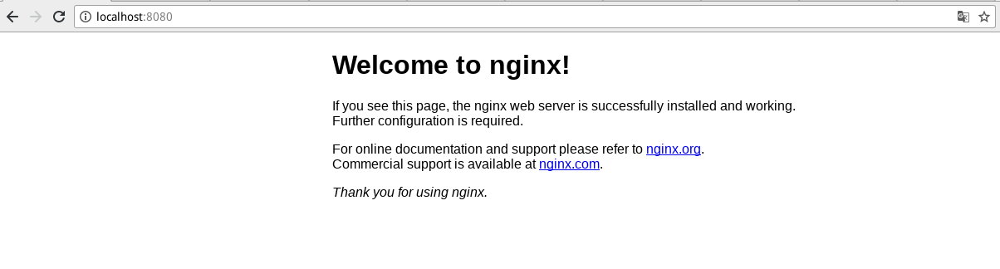

- 使用主机的随机端口映射容器的端口
```text
# docker run -d -P hub.c.163.com/library/nginx -P(大写)，会将Docker容器中所有的端口与宿主中的一个随即端口映射
7359fd2c25b535604242ee4f281d9a66ccd791599322614dcc027c273bbf362a
# netstat -na | grep 32768
tcp6       0      0 :::32768                :::*                    LISTEN     
tcp6       0      0 ::1:32768               ::1:45512               TIME_WAIT  
# docker ps --如下可见容器中的80端口与宿主机中的32768端口建立了映射
CONTAINER ID        IMAGE                         COMMAND                  CREATED             STATUS              PORTS                   NAMES
7359fd2c25b5        hub.c.163.com/library/nginx   "nginx -g 'daemon ..."   3 seconds ago       Up 2 seconds        0.0.0.0:32768->80/tcp   cranky_williams
```
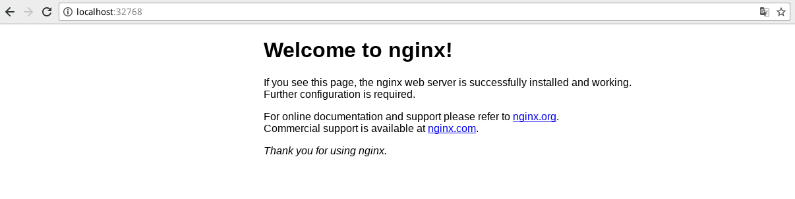

## 七、制作自己的镜像
前边我们hello-world和nginx都是从docker仓库下载回来的，这些都是由别人做好的镜像，放到镜像仓库上的，我们也可以制作自己的镜像，在开始制作自己的Docker镜像之前我们先了以下如下内容。
- Dockerfile
  Dockerfile就是告诉Docker我要怎么样来制作我的镜像，我要制作镜像的每一步操作分别是什么。
- Docker build
  用来执行Dockerfile里边所描述的每一件事情，最终会把Docker镜像给我们制作出来。


下边我们使用jpress-web-newest.war来演示镜像的制作，javaWeb项目
[https://github.com/JpressProjects/jpress/blob/alpha/wars/jpress-web-newest.war](https://github.com/JpressProjects/jpress/blob/alpha/wars/jpress-web-newest.war)

1.下载tomcat镜像  
网易蜂巢镜像仓库地址[https://c.163.com/hub#/m/home/](https://c.163.com/hub#/m/home/)  
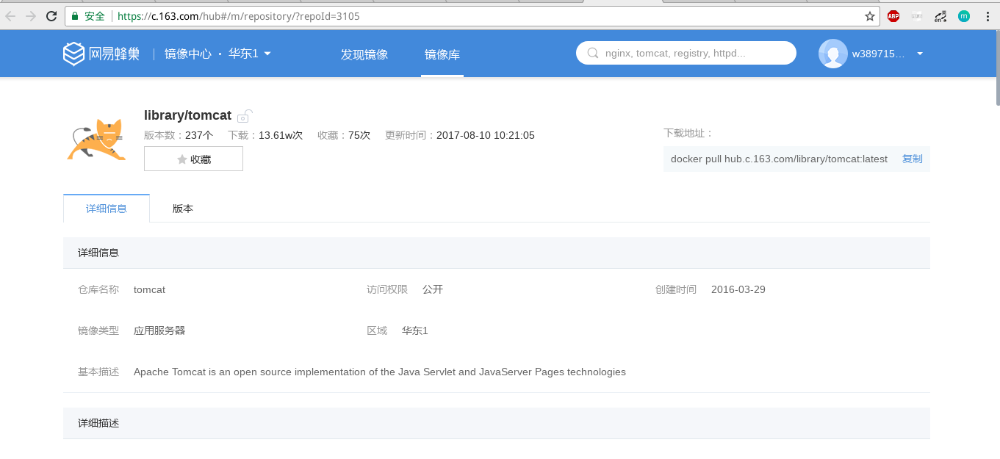
```text
# docker pull hub.c.163.com/library/tomcat:latest --下载命令,tomcat镜像中包含了jdk
latest: Pulling from library/tomcat
9af7279b9dbd: Pull complete 
31816c948f2f: Pull complete 
c59a1cdf83d3: Pull complete 
232c7a75d568: Pull complete 
de412d312979: Pull complete 
80315ba34693: Pull complete 
5d3f97bd90e8: Pull complete 
dc8dc63f6baa: Pull complete 
f6c6e2d67f03: Pull complete 
9123b340aa92: Pull complete 
76abaea2279d: Pull complete 
4476602e3346: Pull complete 
12e1fda011bd: Pull complete 
Digest: sha256:db1a8ca2fe44449d265e5505f300be6f34fc63211a5506400a0a8c24653af91f
Status: Downloaded newer image for hub.c.163.com/library/tomcat:latest
# docker images
REPOSITORY                     TAG                 IMAGE ID            CREATED             SIZE
hub.c.163.com/library/tomcat   latest              72d2be374029        10 days ago         292MB
hello-world                    latest              1815c82652c0        2 months ago        1.84kB
hub.c.163.com/library/nginx    latest              46102226f2fd        3 months ago        109MB
```
2.编写Dockerfile镜像文件
vim Dockerfile
```text
#1.告诉Docker需要制作一个镜像,已tomcat为起点
from hub.c.163.com/library/tomcat

#2.声明镜像的所有者
MAINTAINER caojx xxxx@163.com

#3.将web应用拷贝到镜像的webapps中
COPY jpress-web-newest.war /usr/local/tomcat/webapps
```
3.运行docker build
```text
# docker build .
Sending build context to Docker daemon   20.8MB
Step 1/3 : FROM hub.c.163.com/library/tomcat
 ---> 72d2be374029
Step 2/3 : MAINTAINER caojx xxxx@163.com
 ---> Using cache
 ---> dd77e031fda6
Step 3/3 : COPY jpress-web-newest.war /usr/local/tomcat/webapps
 ---> 7340e17574b9
Removing intermediate container 4d
# docker images
REPOSITORY                     TAG                 IMAGE ID            CREATED             SIZE
<none>                         <none>              7340e17574b9        43 seconds ago      313MB --该镜像没有名称和tag
hub.c.163.com/library/tomcat   latest              72d2be374029        10 days ago         292MB
hello-world                    latest              1815c82652c0        2 months ago        1.84kB
hub.c.163.com/library/nginx    latest              46102226f2fd        3 months ago        109MB
# docker build -t jpress:latest . --给镜像指定一个名称
Sending build context to Docker daemon   20.8MB
Step 1/3 : FROM hub.c.163.com/library/tomcat
 ---> 72d2be374029
Step 2/3 : MAINTAINER caojx xxxx@163.com
 ---> Using cache
 ---> dd77e031fda6
Step 3/3 : COPY jpress-web-newest.war /usr/local/tomcat/webapps
 ---> Using cache
 ---> 7340e17574b9
Successfully built 7340e17574b9
Successfully tagged jpress:latest
# docker images
REPOSITORY                     TAG                 IMAGE ID            CREATED             SIZE
jpress                         latest              7340e17574b9        3 minutes ago       313MB
hub.c.163.com/library/tomcat   latest              72d2be374029        10 days ago         292MB
hello-world                    latest              1815c82652c0        2 months ago        1.84kB
```

3.运行容器
```text
# docker run -d -p 8888:8080 jpress
b2a3db47ddc05e3616e05904c375b32bbcd67f561e12794eefa44b619ddde277
# netstat -na | grep 8888
tcp6       0      0 :::8888                 :::*                    LISTEN     
```
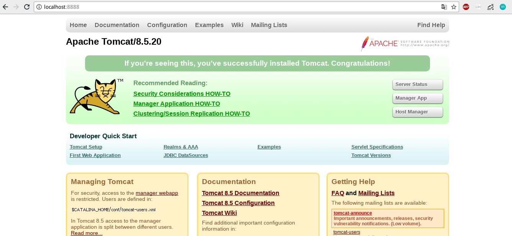
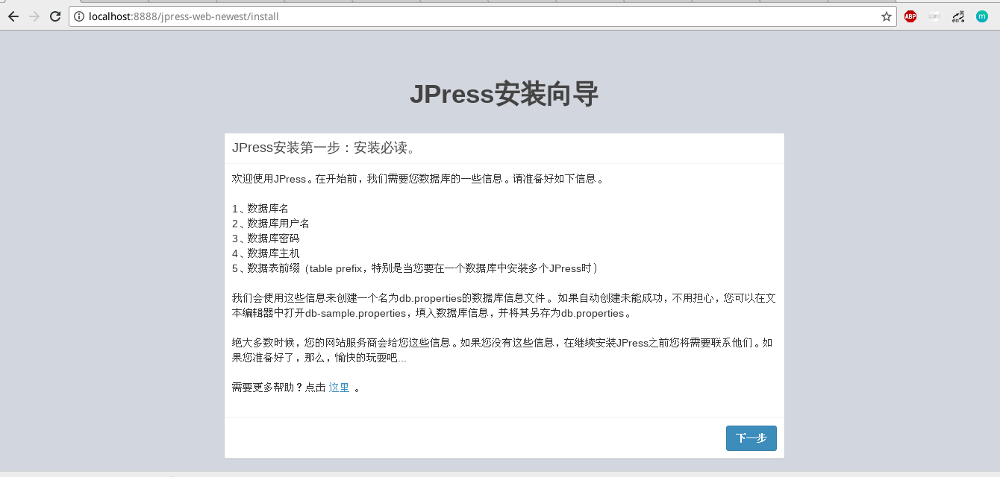

3.集成mysql  
运行jpress发现需要数据库,我们安装以下mysql镜像
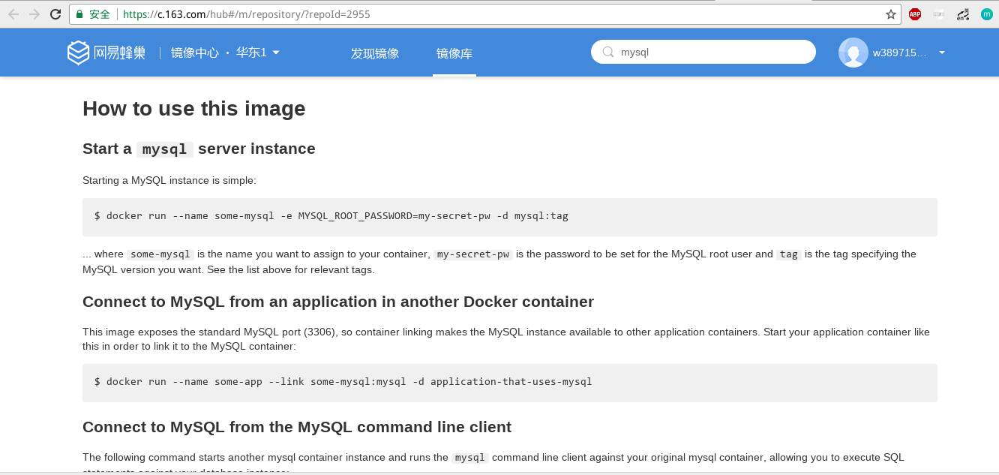    
```text
# docker pull hub.c.163.com/library/mysql:latest
latest: Pulling from library/mysql
42cb69312da9: Pull complete 
e2cf5467c4b5: Pull complete 
871ec0232f66: Pull complete 
3c0ae7ec690d: Pull complete 
d39b43089b70: Pull complete 
aa0e7cb4b67c: Pull complete 
738db9902d06: Pull complete 
ae333863ac05: Pull complete 
6d014992204a: Pull complete 
09aeca0c9a82: Pull complete 
0162083b2de0: Pull complete 
Digest: sha256:b2bce1a792237ac5df78877d583f34b09ab023a77130921a6bcce67ce2d24ff0
Status: Downloaded newer image for hub.c.163.com/library/mysql:latest
# docker run -d -p 3306:3306 -e MYSQL_ROOT_PASSWORD=caojx -e MYSQL_DATABASE=jpress hub.c.163.com/library/mysql:latest
231f88edeb710166c718fe3c9090a412501299fd7f274431e20df717bd7db96a
# ifconfig --查看docker机的ip
docker0: flags=4163<UP,BROADCAST,RUNNING,MULTICAST>  mtu 1500
        inet 172.17.0.1  netmask 255.255.0.0  broadcast 0.0.0.0
        inet6 fe80::42:7eff:fe9a:ffaa  prefixlen 64  scopeid 0x20<link>
        ether 02:42:7e:9a:ff:aa  txqueuelen 0  (Ethernet)
        RX packets 1544  bytes 546549 (533.7 KiB)
        RX errors 0  dropped 0  overruns 0  frame 0
        TX packets 1707  bytes 580831 (567.2 KiB)
        TX errors 0  dropped 0 overruns 0  carrier 0  collisions 0
```
连接mysql  
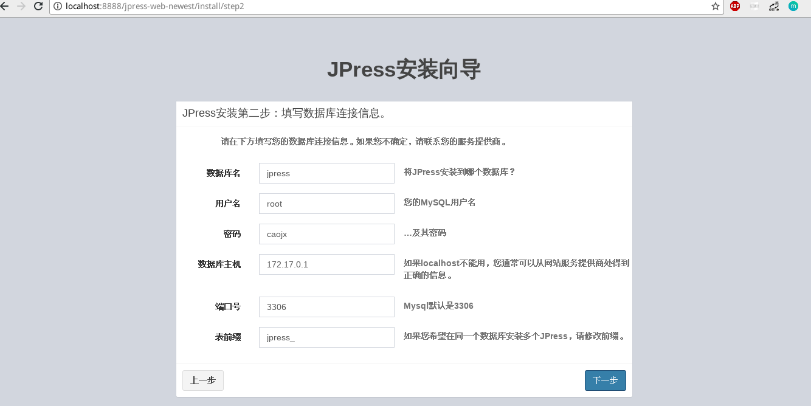  
安装jpress完成  
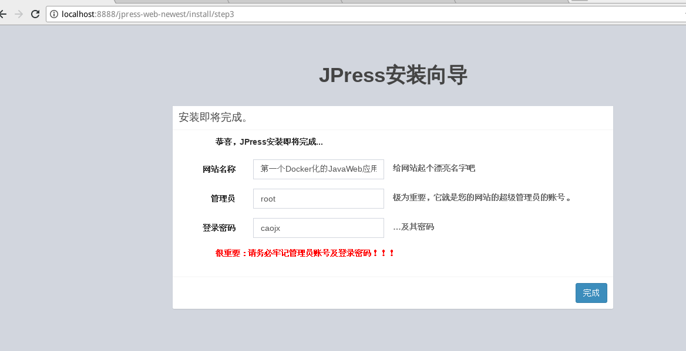  
重启容器  
```text
# docker ps
CONTAINER ID        IMAGE                                COMMAND                  CREATED             STATUS              PORTS                    NAMES
1cb9c2871412        hub.c.163.com/library/mysql:latest   "docker-entrypoint..."   5 minutes ago       Up 5 minutes        0.0.0.0:3306->3306/tcp   brave_hodgkin
50835660a371        jpress                               "catalina.sh run"        6 minutes ago       Up 6 minutes        0.0.0.0:8888->8080/tcp   elegant_leakey
# docker restart 50835660a371 --重启容器
50835660a371
```
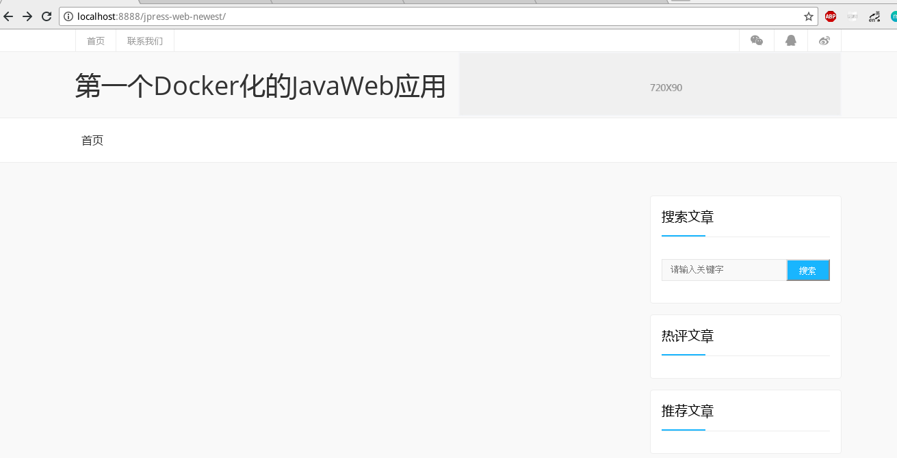  