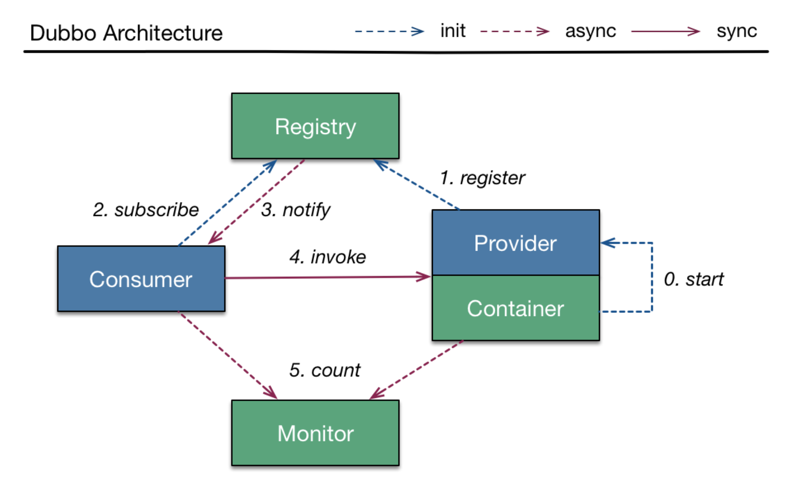
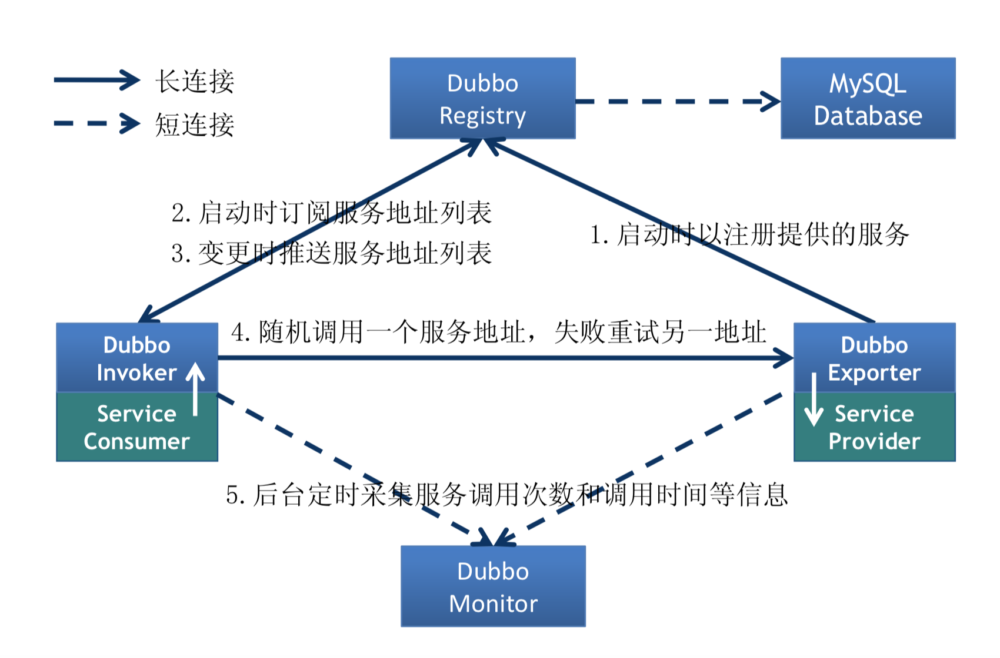
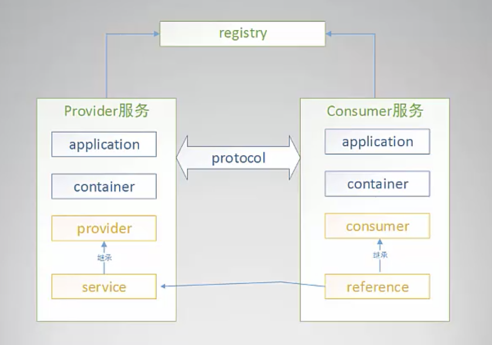
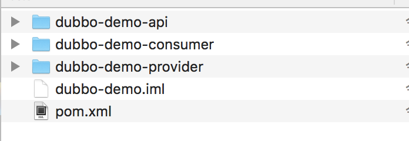
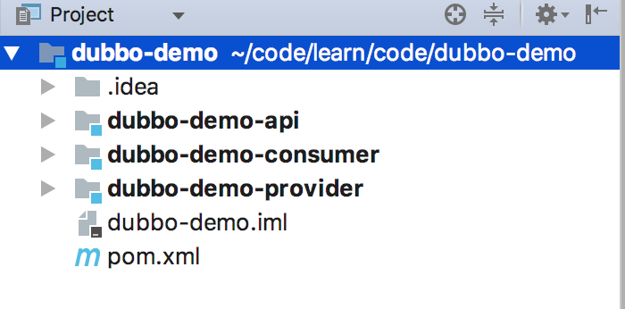
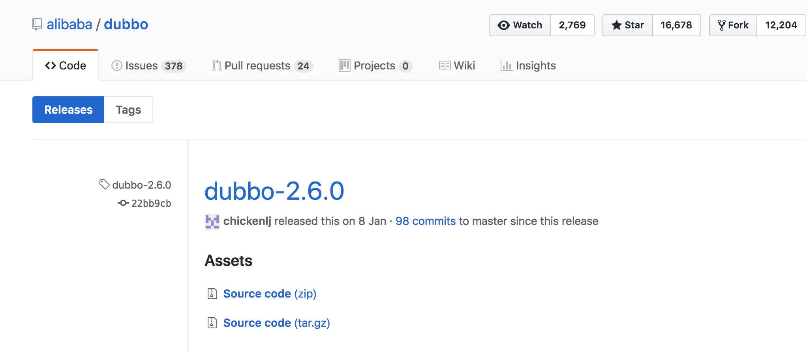
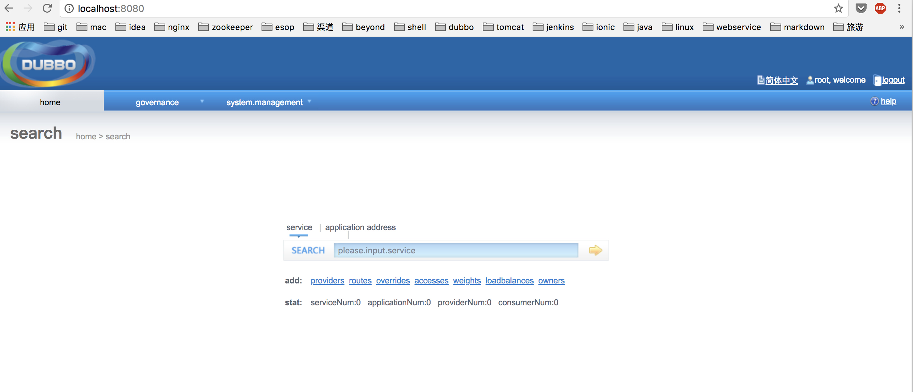
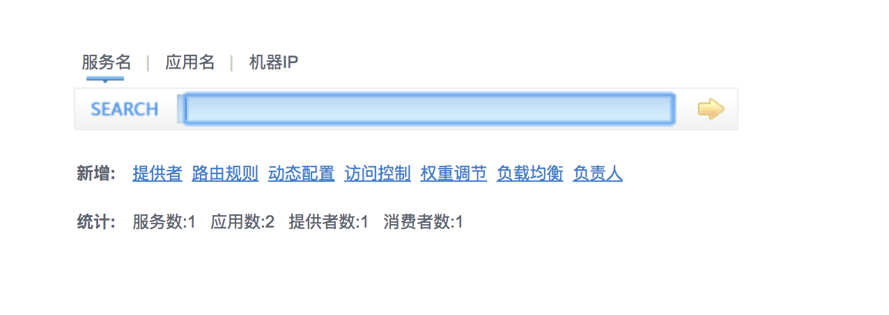

# Dubbo入门

[TOC]

duubo官网：http://dubbo.io/

学习源码：https://github.com/caojx-git/learn/tree/master/code/dubbo-demo

  

## 一、Dubbo 简介

### 1.1 简介

Dubbo是一个分布式服务**框架**，致力于提高性能和透明化的[RPC](http://www.importnew.com/22003.html)远程服务调用方案，以及SOA服务子方案。当网站规模达到了一定的量级的时候，普通的MVC框架已经不能满足我们的需求，于是分布式的服务框架和流动式的架构就凸显出来了。

**dubbo是**：

- 分布式服务框架
- 高性能和透明化的RPC远程服务调用方案 
- SOA服务治理方案

优点：

- 远程通讯：提供透明化的远程调用，提供多协议（Dubbo、RMI、WebService、Hessian、Http、Thrift、Redis、Memcached）支持
- 集群容错：如在均衡，失败容错，地址路由，动态配置等集群支持
- 自动发现：基于注册中心目录服务，是服务消费方能动态的查找服务提供方，支持平滑减少或增加机器。

### 1.2 如何使用Dubbo

- 本地服务

```xml
<bean id=“xxxService” class=“com.xxx.XxxServiceImpl” /> 
<bean id=“xxxAction” class=“com.xxx.XxxAction”>
	<property name=“xxxService” ref=“xxxService” /> 
</bean>

```

- 远程服务

```xml
<bean id=“xxxService” class=“com.xxx.XxxServiceImpl” /> 
<dubbo:service interface=“com.xxx.XxxService” ref=“xxxService” />
```

### 1.3 Dubbo能做什么

- 透明化的远程方法调用

  –  就像调用本地方法一样调用远程方法
  –  只需简单配置，没有任何API侵入。

- 软负载均衡及容错机制
  –  可在内网替代F5等硬件负载均衡器 

- 服务自动注册与发现
  –  不再需要写死服务提供方地址，注册中心基于接口名查询服务提 供者的IP地址，并且能够平滑添加或删除服务提供者

### 1.4 Dubbo基本原理

  

### 1.5 Dubbo与Spring Cloud、ICE的区别

|              | dubbo                                | spring cloud                         | Zeroc ICE                            |
| ------------ | ------------------------------------ | ------------------------------------ | ------------------------------------ |
| 相似功能     | 注册中心，负载均衡、安全机制访问控制 | 注册中心，负载均衡、安全机制访问控制 | 注册中心，负载均衡、安全机制访问控制 |
| 不同功能     | 服务治理更多一些                     | 17个子项目                           | 软件补丁服务，发布订阅服务           |
| 轻重程度     | 轻量级                               | 重量级                               | 重量级                               |
| 支持跨语言   | dubbox                               | 是                                   | 是                                   |
| 国内活跃程度 | 活跃                                 | 一般                                 | 不活跃                               |
| 开发语言     | java                                 | java                                 | c                                    |
| 性能         | 第二                                 | 第三                                 | 第一                                 |

[孰优孰劣？Dubbo VS Spring Cloud性能测试大对决！](http://mp.weixin.qq.com/s?__biz=MzA5MzQ2NTY0OA==&mid=2650796496&idx=1&sn=a544b76660484b9914b65f038cc39e6d&chksm=88562c8fbf21a5995909ffa9f172f31651b1ebd04897917e43caef3491954e24ed0d0477a5a1&mpshare=1&scene=23&srcid=01245faqrBlQETYK9c7zVmd3#rd)

## 二、 Dubbo Hello World

### 2.1 Dubbo标签

这里使用Hello World来入门Dubbo，主要是掌握Dubbo的8个标签，因为在开发过程中80%的工作都是围绕这8个标签进行的。

**标签列表如下：**

| 标签                 | 标签秒速                             | 特殊说明 |
| -------------------- | ------------------------------------ | -------- |
| \<dubbo:application/\> | 应用信息，就是当前服务的项目信息配置 |          |
| container | 服务的运行容器 |  |
| \<dubbo:provider/\> | 服务提供方的一些服务治理、性能测试调优的一些配置 | 该标签为当前服务的所有\<dubbo:service/\>和\<dubbo:protocol/\>标签的缺省值设置 |
| \<dubbo:service/\> | 服务提供者暴露接口配置 |          |
| \<dubbo:consumer/\> | 服务消费者的一些服务治理、性能测试调优的一些配置 | 该标签为当前服务的所有\<dubbo:reference/\>标签的缺省值设置 |
| \<dubbo:reference/\> | 服务消费者引用接口配置 |          |
| \<dubbo:register/\> | 注册中心配置 | 如果多个不同的注册中心，可以声明多个\<dubbo:register/\>标签并在\<dubbo:service/\>或\<dubbo:reference/\>的register属性指定使用的注册中心。 |
| \<dubbo:protocol/\> | 远程调用协议dubbo(netty默认)、hessian、http、injvm、memcached、redis、rmi、thrigt、webservice | 如果需要支持多协议，可以声明多个\<dubbo:protocol/\>标签，并在\<dubbo:service/\>中通过protocol属性指定使用的协议。 |

**标签之间依赖关联关系**

  


### 2.2 dubbo-demo

下载Dubbo：https://github.com/alibaba/dubbo/zipball/master

我们以官方的dubbo-demo模块快速了解dubbo,dubbo-demo有如下三个模块

  

dubbo-demo-api 服务提供者需要暴露的api接口

dubbo-demo-provider 服务提供者需要暴露的api接口的实现

dubbo-demo-consumer 服务消费者,需要引入provider的接口依赖配置


1. dubbo-demo-provider服务提供者配置文件dubbo-demo-provider.xml

```xml
<?xml version="1.0" encoding="UTF-8"?>
<beans xmlns:xsi="http://www.w3.org/2001/XMLSchema-instance"
       xmlns:dubbo="http://code.alibabatech.com/schema/dubbo"
       xmlns="http://www.springframework.org/schema/beans"
       xsi:schemaLocation="http://www.springframework.org/schema/beans http://www.springframework.org/schema/beans/spring-beans-2.5.xsd
       http://code.alibabatech.com/schema/dubbo http://code.alibabatech.com/schema/dubbo/dubbo.xsd">

    <!-- provider's application name, used for tracing dependency relationship -->
    <!-- 服务名称 -->
    <dubbo:application name="demo-provider"/>

    <!-- use multicast registry center to export service -->
    <!-- 使用multicast广播注册中心暴露服务地址,不需要启动任何中心节点，不需要安装zookper一样，和广播地址一样可以互相发现 -->
    <dubbo:registry address="multicast://224.5.6.7:1234"/>

    <!-- use dubbo protocol to export service on port 20880 -->
    <!-- 服务端和消费端双发通信协议，使用dubbo协议，端口20880 -->
    <dubbo:protocol name="dubbo" port="20880"/>

    <!-- service implementation, as same as regular local bean -->
    <bean id="demoService" class="com.alibaba.dubbo.demo.provider.DemoServiceImpl"/>

    <!-- declare the service interface to be exported -->
    <!-- 暴露服务的接口 -->
    <dubbo:service interface="com.alibaba.dubbo.demo.DemoService" ref="demoService"/>

</beans>
```

2. dubbo-demo-consumer服务消费者配置文件 dubbo-demo-consumer.xml

```xml
<?xml version="1.0" encoding="UTF-8"?>
<beans xmlns:xsi="http://www.w3.org/2001/XMLSchema-instance"
       xmlns:dubbo="http://code.alibabatech.com/schema/dubbo"
       xmlns="http://www.springframework.org/schema/beans"
       xsi:schemaLocation="http://www.springframework.org/schema/beans http://www.springframework.org/schema/beans/spring-beans-2.5.xsd
       http://code.alibabatech.com/schema/dubbo http://code.alibabatech.com/schema/dubbo/dubbo.xsd">

    <!-- consumer's application name, used for tracing dependency relationship (not a matching criterion),
    don't set it same as provider -->
    <dubbo:application name="demo-consumer"/>

    <!-- use multicast registry center to discover service -->
    <dubbo:registry address="multicast://224.5.6.7:1234"/>

    <!-- generate proxy for the remote service, then demoService can be used in the same way as the
    local regular interface -->
    <!-- 服务消费者，依赖于服务提供者暴露的接口 -->
    <dubbo:reference id="demoService" check="false" interface="com.alibaba.dubbo.demo.DemoService"/>

</beans>
```

3. DemoService.java 接口实现类

```java
package com.alibaba.dubbo.demo.provider;

import com.alibaba.dubbo.demo.DemoService;
import com.alibaba.dubbo.rpc.RpcContext;

import java.text.SimpleDateFormat;
import java.util.Date;

public class DemoServiceImpl implements DemoService {

    public String sayHello(String name) {
        System.out.println("[" + new SimpleDateFormat("HH:mm:ss").format(new Date()) + "] Hello " + name + ", request from consumer: " + RpcContext.getContext().getRemoteAddress());
        return "Hello " + name + ", response form provider: " + RpcContext.getContext().getLocalAddress();
    }

}
```

4. 启动服务提供者Provider.java

```java
package com.alibaba.dubbo.demo.provider;

import org.springframework.context.support.ClassPathXmlApplicationContext;

public class Provider {

    public static void main(String[] args) throws Exception {
        //Prevent to get IPV6 address,this way only work in debug mode
        //But you can pass use -Djava.net.preferIPv4Stack=true,then it work well whether in debug mode or not
        System.setProperty("java.net.preferIPv4Stack", "true");
        ClassPathXmlApplicationContext context = new ClassPathXmlApplicationContext(new String[]{"META-INF/spring/dubbo-demo-provider.xml"});
        context.start();

        System.in.read(); // press any key to exit
    }

}
```

5. 启动服务消费者Consumer.java

```java
package com.alibaba.dubbo.demo.consumer;

import com.alibaba.dubbo.demo.DemoService;
import org.springframework.context.support.ClassPathXmlApplicationContext;

public class Consumer {

    public static void main(String[] args) {
        //Prevent to get IPV6 address,this way only work in debug mode
        //But you can pass use -Djava.net.preferIPv4Stack=true,then it work well whether in debug mode or not
        System.setProperty("java.net.preferIPv4Stack", "true");
        ClassPathXmlApplicationContext context = new ClassPathXmlApplicationContext(new String[]{"META-INF/spring/dubbo-demo-consumer.xml"});
        context.start();
        DemoService demoService = (DemoService) context.getBean("demoService"); // get remote service proxy

        while (true) {
            try {
                Thread.sleep(1000);
                String hello = demoService.sayHello("world"); // call remote method
                System.out.println(hello); // get result

            } catch (Throwable throwable) {
                throwable.printStackTrace();
            }
        }
    }
}
```

6. 测试结果

** 消费者端日志：**

```text
[27/02/18 02:48:48:048 CST] main  INFO multicast.MulticastRegistry:  [DUBBO] Load registry store file /Users/caojx/.dubbo/dubbo-registry-demo-consumer-224.5.6.7:1234.cache, data: {com.alibaba.dubbo.demo.DemoService=empty://10.10.146.234:20880/com.alibaba.dubbo.demo.DemoService?anyhost=true&application=demo-provider&dubbo=2.0.0&generic=false&interface=com.alibaba.dubbo.demo.DemoService&methods=sayHello&pid=2415&side=provider&timestamp=1519714067878}, dubbo version: 2.0.0, current host: 10.10.146.234
[27/02/18 02:48:48:048 CST] main  INFO multicast.MulticastRegistry:  [DUBBO] Register: consumer://10.10.146.234/com.alibaba.dubbo.demo.DemoService?application=demo-consumer&category=consumers&check=false&dubbo=2.0.0&interface=com.alibaba.dubbo.demo.DemoService&methods=sayHello&pid=2430&qos.port=33333&side=consumer&timestamp=1519714127916, dubbo version: 2.0.0, current host: 10.10.146.234
[27/02/18 02:48:48:048 CST] main  INFO multicast.MulticastRegistry:  [DUBBO] Send broadcast message: register consumer://10.10.146.234/com.alibaba.dubbo.demo.DemoService?application=demo-consumer&category=consumers&check=false&dubbo=2.0.0&interface=com.alibaba.dubbo.demo.DemoService&methods=sayHello&pid=2430&qos.port=33333&side=consumer&timestamp=1519714127916 to /224.5.6.7:1234, dubbo version: 2.0.0, current host: 10.10.146.234
[27/02/18 02:48:48:048 CST] DubboMulticastRegistryReceiver  INFO multicast.MulticastRegistry:  [DUBBO] Receive multicast message: register consumer://10.10.146.234/com.alibaba.dubbo.demo.DemoService?application=demo-consumer&category=consumers&check=false&dubbo=2.0.0&interface=com.alibaba.dubbo.demo.DemoService&methods=sayHello&pid=2430&qos.port=33333&side=consumer&timestamp=1519714127916 from /10.10.146.234:1234, dubbo version: 2.0.0, current host: 10.10.146.234
[27/02/18 02:48:48:048 CST] main  INFO multicast.MulticastRegistry:  [DUBBO] Subscribe: consumer://10.10.146.234/com.alibaba.dubbo.demo.DemoService?application=demo-consumer&category=providers,configurators,routers&check=false&dubbo=2.0.0&interface=com.alibaba.dubbo.demo.DemoService&methods=sayHello&pid=2430&qos.port=33333&side=consumer&timestamp=1519714127916, dubbo version: 2.0.0, current host: 10.10.146.234
[27/02/18 02:48:48:048 CST] main  INFO multicast.MulticastRegistry:  [DUBBO] Send broadcast message: subscribe consumer://10.10.146.234/com.alibaba.dubbo.demo.DemoService?application=demo-consumer&category=providers,configurators,routers&check=false&dubbo=2.0.0&interface=com.alibaba.dubbo.demo.DemoService&methods=sayHello&pid=2430&qos.port=33333&side=consumer&timestamp=1519714127916 to /224.5.6.7:1234, dubbo version: 2.0.0, current host: 10.10.146.234
[27/02/18 02:48:48:048 CST] DubboMulticastRegistryReceiver  INFO multicast.MulticastRegistry:  [DUBBO] Receive multicast message: subscribe consumer://10.10.146.234/com.alibaba.dubbo.demo.DemoService?application=demo-consumer&category=providers,configurators,routers&check=false&dubbo=2.0.0&interface=com.alibaba.dubbo.demo.DemoService&methods=sayHello&pid=2430&qos.port=33333&side=consumer&timestamp=1519714127916 from /10.10.146.234:1234, dubbo version: 2.0.0, current host: 10.10.146.234
[27/02/18 02:48:48:048 CST] DubboMulticastRegistryReceiver  INFO multicast.MulticastRegistry:  [DUBBO] Receive multicast message: register dubbo://10.10.146.234:20880/com.alibaba.dubbo.demo.DemoService?anyhost=true&application=demo-provider&dubbo=2.0.0&generic=false&interface=com.alibaba.dubbo.demo.DemoService&methods=sayHello&pid=2428&side=provider&timestamp=1519714119408 from /10.10.146.234:1234, dubbo version: 2.0.0, current host: 10.10.146.234
[27/02/18 02:48:48:048 CST] DubboMulticastRegistryReceiver  INFO multicast.MulticastRegistry:  [DUBBO] Notify urls for subscribe url consumer://10.10.146.234/com.alibaba.dubbo.demo.DemoService?application=demo-consumer&category=providers,configurators,routers&check=false&dubbo=2.0.0&interface=com.alibaba.dubbo.demo.DemoService&methods=sayHello&pid=2430&qos.port=33333&side=consumer&timestamp=1519714127916, urls: [dubbo://10.10.146.234:20880/com.alibaba.dubbo.demo.DemoService?anyhost=true&application=demo-provider&dubbo=2.0.0&generic=false&interface=com.alibaba.dubbo.demo.DemoService&methods=sayHello&pid=2428&side=provider&timestamp=1519714119408], dubbo version: 2.0.0, current host: 10.10.146.234
[27/02/18 02:48:48:048 CST] DubboMulticastRegistryReceiver  INFO transport.AbstractClient:  [DUBBO] Successed connect to server /10.10.146.234:20880 from NettyClient 10.10.146.234 using dubbo version 2.0.0, channel is NettyChannel [channel=[id: 0xdf8f35df, /10.10.146.234:63941 => /10.10.146.234:20880]], dubbo version: 2.0.0, current host: 10.10.146.234
[27/02/18 02:48:48:048 CST] DubboMulticastRegistryReceiver  INFO transport.AbstractClient:  [DUBBO] Start NettyClient /10.10.146.234 connect to the server /10.10.146.234:20880, dubbo version: 2.0.0, current host: 10.10.146.234
[27/02/18 02:48:48:048 CST] main  INFO multicast.MulticastRegistry:  [DUBBO] Notify urls for subscribe url consumer://10.10.146.234/com.alibaba.dubbo.demo.DemoService?application=demo-consumer&category=providers,configurators,routers&check=false&dubbo=2.0.0&interface=com.alibaba.dubbo.demo.DemoService&methods=sayHello&pid=2430&qos.port=33333&side=consumer&timestamp=1519714127916, urls: [dubbo://10.10.146.234:20880/com.alibaba.dubbo.demo.DemoService?anyhost=true&application=demo-provider&dubbo=2.0.0&generic=false&interface=com.alibaba.dubbo.demo.DemoService&methods=sayHello&pid=2428&side=provider&timestamp=1519714119408], dubbo version: 2.0.0, current host: 10.10.146.234
[27/02/18 02:48:48:048 CST] main  INFO config.AbstractConfig:  [DUBBO] Refer dubbo service com.alibaba.dubbo.demo.DemoService from url multicast://224.5.6.7:1234/com.alibaba.dubbo.registry.RegistryService?anyhost=true&application=demo-consumer&check=false&dubbo=2.0.0&generic=false&interface=com.alibaba.dubbo.demo.DemoService&methods=sayHello&pid=2430&qos.port=33333&register.ip=10.10.146.234&remote.timestamp=1519714119408&side=consumer&timestamp=1519714127916, dubbo version: 2.0.0, current host: 10.10.146.234
Hello world, response form provider: 10.10.146.234:20880
Hello world, response form provider: 10.10.146.234:20880
Hello world, response form provider: 10.10.146.234:20880
Hello world, response form provider: 10.10.146.234:20880
Hello world, response form provider: 10.10.146.234:20880
```

** 服务提供端日志：**

```text
[27/02/18 02:48:39:039 CST] main  INFO config.AbstractConfig:  [DUBBO] Export dubbo service com.alibaba.dubbo.demo.DemoService to local registry, dubbo version: 2.0.0, current host: 10.10.146.234
[27/02/18 02:48:39:039 CST] main  INFO config.AbstractConfig:  [DUBBO] Export dubbo service com.alibaba.dubbo.demo.DemoService to url dubbo://10.10.146.234:20880/com.alibaba.dubbo.demo.DemoService?anyhost=true&application=demo-provider&bind.ip=10.10.146.234&bind.port=20880&dubbo=2.0.0&generic=false&interface=com.alibaba.dubbo.demo.DemoService&methods=sayHello&pid=2428&qos.port=22222&side=provider&timestamp=1519714119408, dubbo version: 2.0.0, current host: 10.10.146.234
[27/02/18 02:48:39:039 CST] main  INFO config.AbstractConfig:  [DUBBO] Register dubbo service com.alibaba.dubbo.demo.DemoService url dubbo://10.10.146.234:20880/com.alibaba.dubbo.demo.DemoService?anyhost=true&application=demo-provider&bind.ip=10.10.146.234&bind.port=20880&dubbo=2.0.0&generic=false&interface=com.alibaba.dubbo.demo.DemoService&methods=sayHello&pid=2428&qos.port=22222&side=provider&timestamp=1519714119408 to registry registry://224.5.6.7:1234/com.alibaba.dubbo.registry.RegistryService?application=demo-provider&dubbo=2.0.0&pid=2428&qos.port=22222&registry=multicast&timestamp=1519714119387, dubbo version: 2.0.0, current host: 10.10.146.234
[27/02/18 02:48:39:039 CST] main  INFO transport.AbstractServer:  [DUBBO] Start NettyServer bind /0.0.0.0:20880, export /10.10.146.234:20880, dubbo version: 2.0.0, current host: 10.10.146.234
[27/02/18 02:48:39:039 CST] main  INFO multicast.MulticastRegistry:  [DUBBO] Register: dubbo://10.10.146.234:20880/com.alibaba.dubbo.demo.DemoService?anyhost=true&application=demo-provider&dubbo=2.0.0&generic=false&interface=com.alibaba.dubbo.demo.DemoService&methods=sayHello&pid=2428&side=provider&timestamp=1519714119408, dubbo version: 2.0.0, current host: 10.10.146.234
[27/02/18 02:48:39:039 CST] main  INFO multicast.MulticastRegistry:  [DUBBO] Send broadcast message: register dubbo://10.10.146.234:20880/com.alibaba.dubbo.demo.DemoService?anyhost=true&application=demo-provider&dubbo=2.0.0&generic=false&interface=com.alibaba.dubbo.demo.DemoService&methods=sayHello&pid=2428&side=provider&timestamp=1519714119408 to /224.5.6.7:1234, dubbo version: 2.0.0, current host: 10.10.146.234
[27/02/18 02:48:39:039 CST] DubboMulticastRegistryReceiver  INFO multicast.MulticastRegistry:  [DUBBO] Receive multicast message: register dubbo://10.10.146.234:20880/com.alibaba.dubbo.demo.DemoService?anyhost=true&application=demo-provider&dubbo=2.0.0&generic=false&interface=com.alibaba.dubbo.demo.DemoService&methods=sayHello&pid=2428&side=provider&timestamp=1519714119408 from /10.10.146.234:1234, dubbo version: 2.0.0, current host: 10.10.146.234
[27/02/18 02:48:39:039 CST] main  INFO multicast.MulticastRegistry:  [DUBBO] Subscribe: provider://10.10.146.234:20880/com.alibaba.dubbo.demo.DemoService?anyhost=true&application=demo-provider&category=configurators&check=false&dubbo=2.0.0&generic=false&interface=com.alibaba.dubbo.demo.DemoService&methods=sayHello&pid=2428&side=provider&timestamp=1519714119408, dubbo version: 2.0.0, current host: 10.10.146.234
[27/02/18 02:48:39:039 CST] main  INFO multicast.MulticastRegistry:  [DUBBO] Send broadcast message: subscribe provider://10.10.146.234:20880/com.alibaba.dubbo.demo.DemoService?anyhost=true&application=demo-provider&category=configurators&check=false&dubbo=2.0.0&generic=false&interface=com.alibaba.dubbo.demo.DemoService&methods=sayHello&pid=2428&side=provider&timestamp=1519714119408 to /224.5.6.7:1234, dubbo version: 2.0.0, current host: 10.10.146.234
[27/02/18 02:48:39:039 CST] DubboMulticastRegistryReceiver  INFO multicast.MulticastRegistry:  [DUBBO] Receive multicast message: subscribe provider://10.10.146.234:20880/com.alibaba.dubbo.demo.DemoService?anyhost=true&application=demo-provider&category=configurators&check=false&dubbo=2.0.0&generic=false&interface=com.alibaba.dubbo.demo.DemoService&methods=sayHello&pid=2428&side=provider&timestamp=1519714119408 from /10.10.146.234:1234, dubbo version: 2.0.0, current host: 10.10.146.234
[27/02/18 02:48:40:040 CST] main  WARN multicast.MulticastRegistry:  [DUBBO] Ignore empty notify urls for subscribe url provider://10.10.146.234:20880/com.alibaba.dubbo.demo.DemoService?anyhost=true&application=demo-provider&category=configurators&check=false&dubbo=2.0.0&generic=false&interface=com.alibaba.dubbo.demo.DemoService&methods=sayHello&pid=2428&side=provider&timestamp=1519714119408, dubbo version: 2.0.0, current host: 10.10.146.234
[27/02/18 02:48:48:048 CST] DubboMulticastRegistryReceiver  INFO multicast.MulticastRegistry:  [DUBBO] Receive multicast message: register consumer://10.10.146.234/com.alibaba.dubbo.demo.DemoService?application=demo-consumer&category=consumers&check=false&dubbo=2.0.0&interface=com.alibaba.dubbo.demo.DemoService&methods=sayHello&pid=2430&qos.port=33333&side=consumer&timestamp=1519714127916 from /10.10.146.234:1234, dubbo version: 2.0.0, current host: 10.10.146.234
[27/02/18 02:48:48:048 CST] DubboMulticastRegistryReceiver  INFO multicast.MulticastRegistry:  [DUBBO] Receive multicast message: subscribe consumer://10.10.146.234/com.alibaba.dubbo.demo.DemoService?application=demo-consumer&category=providers,configurators,routers&check=false&dubbo=2.0.0&interface=com.alibaba.dubbo.demo.DemoService&methods=sayHello&pid=2430&qos.port=33333&side=consumer&timestamp=1519714127916 from /10.10.146.234:1234, dubbo version: 2.0.0, current host: 10.10.146.234
[27/02/18 02:48:48:048 CST] DubboMulticastRegistryReceiver  INFO multicast.MulticastRegistry:  [DUBBO] Send broadcast message: register dubbo://10.10.146.234:20880/com.alibaba.dubbo.demo.DemoService?anyhost=true&application=demo-provider&dubbo=2.0.0&generic=false&interface=com.alibaba.dubbo.demo.DemoService&methods=sayHello&pid=2428&side=provider&timestamp=1519714119408 to /224.5.6.7:1234, dubbo version: 2.0.0, current host: 10.10.146.234
[27/02/18 02:48:48:048 CST] DubboMulticastRegistryReceiver  INFO multicast.MulticastRegistry:  [DUBBO] Receive multicast message: register dubbo://10.10.146.234:20880/com.alibaba.dubbo.demo.DemoService?anyhost=true&application=demo-provider&dubbo=2.0.0&generic=false&interface=com.alibaba.dubbo.demo.DemoService&methods=sayHello&pid=2428&side=provider&timestamp=1519714119408 from /10.10.146.234:1234, dubbo version: 2.0.0, current host: 10.10.146.234
[14:48:49] Hello world, request from consumer: /10.10.146.234:63941
[14:48:50] Hello world, request from consumer: /10.10.146.234:63941
[14:48:51] Hello world, request from consumer: /10.10.146.234:63941
[14:48:52] Hello world, request from consumer: /10.10.146.234:63941
[14:48:53] Hello world, request from consumer: /10.10.146.234:63941
```

## 三、Zookeeper注册中心集群搭建

官网：http://zookeeper.apache.org/

下载地址：http://mirror.bit.edu.cn/apache/zookeeper/zookeeper-3.4.11/zookeeper-3.4.11.tar.gz

注意：使用zookeeper之前需要安装jdk

### 1.1 zookeeper 安装

```shell
#下载
[caojx@localhost ~]$ wget http://mirror.bit.edu.cn/apache/zookeeper/zookeeper-3.4.11/zookeeper-3.4.11.tar.gz
#解压
[caojx@localhost ~]$ tar -zxvf zookeeper-3.4.11.tar.gz
#进入配置目录
[caojx@localhost ~]$ cd zookeeper-3.4.11/conf/
[caojx@localhost conf]$ ls
configuration.xsl  log4j.properties  zoo_sample.cfg
#将zoo_sample.cfg重命名为zoo.cfg,必须这样做
[caojx@localhost conf]$ mv zoo_sample.cfg zoo.cfg

#日志文件夹需要自己手动创建
[caojx@localhost conf]$ vi zoo.cfg
dataDir=/tmp/zookeeper
dataLogDir=/tmp/logs

#启动zookepper
[caojx@localhost bin]$ cd ~/zookeeper-3.4.11/bin/
[caojx@localhost bin]$ ls
README.txt  zkCleanup.sh  zkCli.cmd  zkCli.sh  zkEnv.cmd  zkEnv.sh  zkServer.cmd  zkServer.sh
[caojx@localhost bin]$ ./zkServer.sh start
ZooKeeper JMX enabled by default
Using config: /home/caojx/zookeeper-3.4.11/bin/../conf/zoo.cfg
Starting zookeeper ... STARTED
```

### 1.2 dubbo-demo 注册中心切换为zookeeper

这里我将dubbo-demo单独拿出来，简化了一下，去除了不需要的一些东西，并使用zookeeper作为注册中心，这里仅贴出关键代码，其他的请去源码中查看

简化后的dubbo-demo源码：https://github.com/caojx-git/learn/tree/master/code/dubbo-demo

1. **项目模块**

依然为3个模块

dubbo-demo-api 服务提供者需要暴露的api接口

dubbo-demo-provider 服务提供者需要暴露的api接口的实现

dubbo-demo-consumer 服务消费者,需要引入provider的接口依赖配置

  

2. **dubbo-demo的pom.xml**

父模块的pom.xml文件内容如下：

```xml
<project xmlns:xsi="http://www.w3.org/2001/XMLSchema-instance" xmlns="http://maven.apache.org/POM/4.0.0"
         xsi:schemaLocation="http://maven.apache.org/POM/4.0.0 http://maven.apache.org/maven-v4_0_0.xsd">
    <modelVersion>4.0.0</modelVersion>

    <groupId>learn</groupId>
    <artifactId>dubbo-demo</artifactId>
    <version>2.6.1</version>

    <packaging>pom</packaging>
    <name>dubbo-demo</name>
    <description>The demo module of dubbo project</description>

    <properties>
        <spring.version>4.3.14.RELEASE</spring.version>
    </properties>

    <modules>
        <module>dubbo-demo-api</module>
        <module>dubbo-demo-provider</module>
        <module>dubbo-demo-consumer</module>
    </modules>

    <dependencies>

        <!--dubbo -->
        <dependency>
            <groupId>com.alibaba</groupId>
            <artifactId>dubbo</artifactId>
            <version>2.6.0</version>
        </dependency>

        <!--dubbo注册中心-->
        <dependency>
            <groupId>org.apache.zookeeper</groupId>
            <artifactId>zookeeper</artifactId>
            <version>3.4.6</version>
        </dependency>
        <!--zookeeper客户端-->
        <dependency>
            <groupId>com.github.sgroschupf</groupId>
            <artifactId>zkclient</artifactId>
            <version>0.1</version>
        </dependency>

        <!--spring-->
        <dependency>
            <groupId>org.springframework</groupId>
            <artifactId>spring-core</artifactId>
            <version>${spring.version}</version>
        </dependency>
        <dependency>
            <groupId>org.springframework</groupId>
            <artifactId>spring-context</artifactId>
            <version>${spring.version}</version>
        </dependency>
        
    </dependencies>
</project>
```

3. **dubbo-demo-provider的pom.xml**

服务提供者需要依赖dubbo-demo-api服务接口模块,用于暴露可以提供的服务

```xml
<project xmlns:xsi="http://www.w3.org/2001/XMLSchema-instance" xmlns="http://maven.apache.org/POM/4.0.0"
         xsi:schemaLocation="http://maven.apache.org/POM/4.0.0 http://maven.apache.org/maven-v4_0_0.xsd">
    <modelVersion>4.0.0</modelVersion>
    <parent>
        <groupId>learn</groupId>
        <artifactId>dubbo-demo</artifactId>
        <version>2.6.1</version>
    </parent>
    <artifactId>dubbo-demo-provider</artifactId>
    <packaging>jar</packaging>
    <name>dubbo-demo-provider</name>
    <description>The demo provider module of dubbo project</description>


    <dependencies>
        <dependency>
            <groupId>com.alibaba</groupId>
            <artifactId>dubbo-demo-api</artifactId>
            <version>2.6.1</version>
        </dependency>
    </dependencies>
</project>
```

4. **dubbo-demo-consumer的pom.xml**

服务消费者同样需要依赖dubbo-demo-api服务接口模块,以便让消费者知道有什么服务可以调用

```xml
<project xmlns:xsi="http://www.w3.org/2001/XMLSchema-instance" xmlns="http://maven.apache.org/POM/4.0.0"
         xsi:schemaLocation="http://maven.apache.org/POM/4.0.0 http://maven.apache.org/maven-v4_0_0.xsd">
    <modelVersion>4.0.0</modelVersion>
    <parent>
        <groupId>learn</groupId>
        <artifactId>dubbo-demo</artifactId>
        <version>2.6.1</version>
    </parent>
    <artifactId>dubbo-demo-consumer</artifactId>
    <packaging>jar</packaging>
    <name>dubbo-demo-consumer</name>
    <description>The demo consumer module of dubbo project</description>
    <dependencies>
        <dependency>
            <groupId>com.alibaba</groupId>
            <artifactId>dubbo-demo-api</artifactId>
            <version>2.6.1</version>
        </dependency>
    </dependencies>
</project>
```

5. **dubbo-demo-provider中的dubbo-demo-provider.xml配置**

使用zookeepper作为服务的注册中心

```xml
<?xml version="1.0" encoding="UTF-8"?>
<beans xmlns:xsi="http://www.w3.org/2001/XMLSchema-instance"
       xmlns:dubbo="http://code.alibabatech.com/schema/dubbo"
       xmlns="http://www.springframework.org/schema/beans"
       xsi:schemaLocation="http://www.springframework.org/schema/beans http://www.springframework.org/schema/beans/spring-beans-2.5.xsd
       http://code.alibabatech.com/schema/dubbo http://code.alibabatech.com/schema/dubbo/dubbo.xsd">

    <!-- provider's application name, used for tracing dependency relationship -->
    <!-- 服务名称 -->
    <dubbo:application name="demo-provider"/>

    <!-- use multicast registry center to export service -->
    <!-- 使用multicast广播注册中心暴露服务地址,不需要启动任何中心节点，不需要安装zookper一样，和广播地址一样可以互相发现 -->
<!--    <dubbo:registry address="multicast://224.5.6.7:1234"/>-->

    <!--使用zookeeper作为注册中心-->
    <dubbo:registry address="zookeeper://127.0.0.1:2181"/>

    <!-- use dubbo protocol to export service on port 20880 -->
    <!-- 服务端和消费端双发通信协议，使用dubbo协议，端口20880 -->
    <dubbo:protocol name="dubbo" port="20880"/>

    <!-- service implementation, as same as regular local bean -->
    <bean id="demoService" class="com.alibaba.dubbo.demo.provider.DemoServiceImpl"/>

    <!-- declare the service interface to be exported -->
    <!-- 暴露服务的接口 -->
    <dubbo:service interface="com.alibaba.dubbo.demo.DemoService" ref="demoService"/>

</beans>
```

6. **dubbo-demo-provider中的dubbo-demo-provider.xml配置**

与provider一样需要配置同样的注册中心

```xml
<?xml version="1.0" encoding="UTF-8"?>
<beans xmlns:xsi="http://www.w3.org/2001/XMLSchema-instance"
       xmlns:dubbo="http://code.alibabatech.com/schema/dubbo"
       xmlns="http://www.springframework.org/schema/beans"
       xsi:schemaLocation="http://www.springframework.org/schema/beans http://www.springframework.org/schema/beans/spring-beans-2.5.xsd
       http://code.alibabatech.com/schema/dubbo http://code.alibabatech.com/schema/dubbo/dubbo.xsd">

    <!-- consumer's application name, used for tracing dependency relationship (not a matching criterion),
    don't set it same as provider -->
    <dubbo:application name="demo-consumer"/>

    <!-- use multicast registry center to discover service -->
    <!--服务注册中心，与provider一样-->
 <!--   <dubbo:registry address="multicast://224.5.6.7:1234"/>-->

    <!--使用zookeeper作为注册中心-->
<!--    <dubbo:registry address="zookeeper://192.168.46.133:2181"/>-->
    <dubbo:registry address="zookeeper://127.0.0.1:2181"/>

    <!-- generate proxy for the remote service, then demoService can be used in the same way as the
    local regular interface -->
    <!-- 服务消费者，依赖于服务提供者暴露的接口 -->
    <dubbo:reference id="demoService" check="false" interface="com.alibaba.dubbo.demo.DemoService"/>
</beans>
```

6. **DemoServiceImpl.java**

服务实现类

```java
package com.alibaba.dubbo.demo.provider;

import com.alibaba.dubbo.demo.DemoService;
import com.alibaba.dubbo.rpc.RpcContext;

import java.text.SimpleDateFormat;
import java.util.Date;

public class DemoServiceImpl implements DemoService {

    public String sayHello(String name) {
        System.out.println("[" + new SimpleDateFormat("HH:mm:ss").format(new Date()) + "] Hello " + name + ", request from consumer: " + RpcContext.getContext().getRemoteAddress());
        return "Hello " + name + ", response form provider: " + RpcContext.getContext().getLocalAddress();
    }

}
```

7. **Provider.java**

启动服务提供者，主要如果之前安装过zookepper，且在其他项目中使用过请清理zookeeper中zoo.cfg中配置的dataDir目录中的内容，不然可能会连接不上zookepper，如果可以连上请忽略。

```java
package com.alibaba.dubbo.demo.provider;

import org.springframework.context.support.ClassPathXmlApplicationContext;

public class Provider {

    public static void main(String[] args) throws Exception {
        //Prevent to get IPV6 address,this way only work in debug mode
        //But you can pass use -Djava.net.preferIPv4Stack=true,then it work well whether in debug mode or not
        System.setProperty("java.net.preferIPv4Stack", "true");
        ClassPathXmlApplicationContext context = new ClassPathXmlApplicationContext(new String[]{"META-INF/spring/dubbo-demo-provider.xml"});
        context.start();

        System.in.read(); // press any key to exit
    }
}
```

8. **Consumer.java**

启动服务消费者

```java
package com.alibaba.dubbo.demo.consumer;

import com.alibaba.dubbo.demo.DemoService;
import org.springframework.context.support.ClassPathXmlApplicationContext;

public class Consumer {

    public static void main(String[] args) {
        //Prevent to get IPV6 address,this way only work in debug mode
        //But you can pass use -Djava.net.preferIPv4Stack=true,then it work well whether in debug mode or not
        System.setProperty("java.net.preferIPv4Stack", "true");
        ClassPathXmlApplicationContext context = new ClassPathXmlApplicationContext(new String[]{"META-INF/spring/dubbo-demo-consumer.xml"});
        context.start();
        DemoService demoService = (DemoService) context.getBean("demoService"); // get remote service proxy

        while (true) {
            try {
                Thread.sleep(1000);
                String hello = demoService.sayHello("world"); // call remote method
                System.out.println(hello); // get result

            } catch (Throwable throwable) {
                throwable.printStackTrace();
            }
        }
    }
}
```

9. **结果**

服务端日志：

```text
[22:40:03] Hello world, request from consumer: /192.168.46.1:62001
[22:40:04] Hello world, request from consumer: /192.168.46.1:62001
[22:40:05] Hello world, request from consumer: /192.168.46.1:62001
[22:40:06] Hello world, request from consumer: /192.168.46.1:62001
[22:40:07] Hello world, request from consumer: /192.168.46.1:62001
......
```

消费端日志：

```text
Hello world, response form provider: 192.168.46.1:20880
Hello world, response form provider: 192.168.46.1:20880
Hello world, response form provider: 192.168.46.1:20880
Hello world, response form provider: 192.168.46.1:20880
Hello world, response form provider: 192.168.46.1:20880
.....
```


### 1.3 zookeeper 集群部署

zookepper集群部署至少需要部署3台机器，部署奇数台，一般部署1，3，5，7…这样的数量，因为这是根据zookepper的选举算法决定，这个算法有两个必要条件

1. 集群中必须有一半以上的机器同意，才可以成为leader
2. 集群中一半的机器瘫痪，整个集群瘫痪。


1. **配置zookeeper集群**

参考：https://www.cnblogs.com/ahu-lichang/p/6723826.html

```shell
[caojx@localhost ~]$ pwd
/home/caojx
[caojx@localhost ~]$ mkdir zookeeper
[caojx@localhost ~]$ cd zookeeper
[caojx@localhost zookeeper]$ tar -zxvf zookeeper-3.4.11.tar.gz
[caojx@localhost zookeeper]$ mkdir -p zk_1 zk_2 zk_3
[caojx@localhost zookeeper]$ mkdir -p data_1 data_2 data_3
[caojx@localhost zookeeper]$ mkdir -p log_1 log_2 log_3
[caojx@localhost zookeeper]$ ls
data_1  data_2  data_3  zk_1  zk_2  zk_3  zookeeper-3.4.11
[caojx@localhost zookeeper]$ cp -rf zookeeper-3.4.11/ zk_1/
[caojx@localhost zookeeper]$ cp -rf zookeeper-3.4.11/ zk_2/
[caojx@localhost zookeeper]$ cp -rf zookeeper-3.4.11/ zk_3/
#配置第一台zk的配置文件
[caojx@localhost zookeeper]$ vi zk_1/zookeeper-3.4.11/conf/zoo.cfg 

#指定zk_1的端口
clientPort=2181
#指定zk_1的数据文件存放目录
dataDir=/home/caojx/zookeeper/data_1
dataLogDir=/home/caojx/zookeeper/log_1（新建log_1文件夹，可不要！！！）
#配置集群的ip地址，下边的1要与data_1目录中的myid文件内容一样
server.1=127.0.0.1:2888:3888 # (主机名, 心跳端口、数据端口)
server.2=127.0.0.1:2888:3888 #（都是默认端口）
server.3=127.0.0.1:2888:3888 # 2888是leader和follow之间通信，3888是投票选举时用的端口）

#创建myid,内容为1，与zoo.cfg中配置的1一样
[caojx@localhost zookeeper]$ vi data_1/myid
[caojx@localhost zookeeper]$ cat data_1/myid 
1

#配置第二台zk的配置文件
[caojx@localhost zookeeper]$ vi zk_2/zookeeper-3.4.11/conf/zoo.cfg 

#指定zk_2的端口
clientPort=2182
#指定zk_2的数据文件存放目录
dataDir=/home/caojx/zookeeper/data_2
dataLogDir=/home/caojx/zookeeper/log_2（新建log_2文件夹，可不要！！！）
#配置集群的ip地址，下边的2要与data_2目录中的myid文件内容一样
server.1=127.0.0.1:2888:3888 # (主机名, 心跳端口、数据端口)
server.2=127.0.0.1:2888:3888 #（都是默认端口）
server.3=127.0.0.1:2888:3888 # 2888是leader和follow之间通信，3888是投票选举时用的端口）

#创建myid,内容为2，与zoo.cfg中配置的2一样
[caojx@localhost zookeeper]$ vi data_2/myid
[caojx@localhost zookeeper]$ cat data_2/myid 
2

#配置第三台zk的配置文件
[caojx@localhost zookeeper]$ vi zk_3/zookeeper-3.4.11/conf/zoo.cfg 

#指定zk_3的端口
clientPort=2183
#指定zk_1的数据文件存放目录
dataDir=/home/caojx/zookeeper/data_3
dataLogDir=/home/caojx/zookeeper/log_3（新建log_3文件夹，可不要！！！）
#配置集群的ip地址，下边的3要与data_3目录中的myid文件内容一样
server.1=127.0.0.1:2888:3888
server.2=127.0.0.1:2888:3888
server.3=127.0.0.1:2888:3888

#创建myid,内容为3，与zoo.cfg中配置的3一样
[caojx@localhost zookeeper]$ vi data_3/myid
[caojx@localhost zookeeper]$ cat data_3/myid 
3

#启动3台zookeeper
[caojx@localhost zookeeper]$ zk_1/zookeeper-3.4.11/bin/zkServer.sh start
ZooKeeper JMX enabled by default
Using config: /home/caojx/zookeeper/zk_1/zookeeper-3.4.11/bin/../conf/zoo.cfg
Starting zookeeper ... STARTED
[caojx@localhost zookeeper]$ zk_2/zookeeper-3.4.11/bin/zkServer.sh start
ZooKeeper JMX enabled by default
Using config: /home/caojx/zookeeper/zk_2/zookeeper-3.4.11/bin/../conf/zoo.cfg
Starting zookeeper ... STARTED
[caojx@localhost zookeeper]$ zk_3/zookeeper-3.4.11/bin/zkServer.sh start
ZooKeeper JMX enabled by default
Using config: /home/caojx/zookeeper/zk_3/zookeeper-3.4.11/bin/../conf/zoo.cfg
Starting zookeeper ... STARTED
[caojx@localhost zookeeper]$ 

#查看启动状态，由下边Mode可知zk_3是leader，zk_1和zk_2是follower
[caojx@localhost zookeeper]$ zk_1/zookeeper-3.4.11/bin/zkServer.sh status
ZooKeeper JMX enabled by default
Using config: /home/caojx/zookeeper/zk_1/zookeeper-3.4.11/bin/../conf/zoo.cfg
Mode: follower
[caojx@localhost zookeeper]$ zk_2/zookeeper-3.4.11/bin/zkServer.sh status
ZooKeeper JMX enabled by default
Using config: /home/caojx/zookeeper/zk_2/zookeeper-3.4.11/bin/../conf/zoo.cfg
Mode: follower
[caojx@localhost zookeeper]$ zk_3/zookeeper-3.4.11/bin/zkServer.sh status
ZooKeeper JMX enabled by default
Using config: /home/caojx/zookeeper/zk_3/zookeeper-3.4.11/bin/../conf/zoo.cfg
Mode: leader 
```

2. **dubbo-demo连接测试**


配置dubbo-demo-provider.xml，配置多台zookeeper注册中心

```xml
<?xml version="1.0" encoding="UTF-8"?>
<beans xmlns:xsi="http://www.w3.org/2001/XMLSchema-instance"
       xmlns:dubbo="http://code.alibabatech.com/schema/dubbo"
       xmlns="http://www.springframework.org/schema/beans"
       xsi:schemaLocation="http://www.springframework.org/schema/beans http://www.springframework.org/schema/beans/spring-beans-2.5.xsd
       http://code.alibabatech.com/schema/dubbo http://code.alibabatech.com/schema/dubbo/dubbo.xsd">

    <!-- provider's application name, used for tracing dependency relationship -->
    <!-- 服务名称 -->
    <dubbo:application name="demo-provider"/>

    <!-- use multicast registry center to export service -->
    <!-- 使用multicast广播注册中心暴露服务地址,不需要启动任何中心节点，不需要安装zookper一样，和广播地址一样可以互相发现 -->
<!--    <dubbo:registry address="multicast://224.5.6.7:1234"/>-->

    <!--使用zookeeper作为注册中心-->
    <!--<dubbo:registry address="zookeeper://127.0.0.1:2181"/>-->

    <!--多台zookeeper集群作为注册中心-->
    <dubbo:registry address="zookeeper://127.0.0.1:2181?backup=127.0.0.1:2182,127.0.0.1:2183"/>

    <!-- use dubbo protocol to export service on port 20880 -->
    <!-- 服务端和消费端双发通信协议，使用dubbo协议，端口20880 -->
    <dubbo:protocol name="dubbo" port="20880"/>

    <!-- service implementation, as same as regular local bean -->
    <bean id="demoService" class="com.alibaba.dubbo.demo.provider.DemoServiceImpl"/>

    <!-- declare the service interface to be exported -->
    <!-- 暴露服务的接口 -->
    <dubbo:service interface="com.alibaba.dubbo.demo.DemoService" ref="demoService"/>

</beans>
```


配置dubbo-demo-consumer.xml，配置多台zookeeper注册中心

```xml
<?xml version="1.0" encoding="UTF-8"?>
<beans xmlns:xsi="http://www.w3.org/2001/XMLSchema-instance"
       xmlns:dubbo="http://code.alibabatech.com/schema/dubbo"
       xmlns="http://www.springframework.org/schema/beans"
       xsi:schemaLocation="http://www.springframework.org/schema/beans http://www.springframework.org/schema/beans/spring-beans-2.5.xsd
       http://code.alibabatech.com/schema/dubbo http://code.alibabatech.com/schema/dubbo/dubbo.xsd">

    <!-- consumer's application name, used for tracing dependency relationship (not a matching criterion),
    don't set it same as provider -->
    <dubbo:application name="demo-consumer"/>

    <!-- use multicast registry center to discover service -->
    <!--服务注册中心，与provider一样-->
 <!--   <dubbo:registry address="multicast://224.5.6.7:1234"/>-->

    <!--使用zookeeper作为注册中心-->
   <!-- <dubbo:registry address="zookeeper://127.0.0.1:2181"/>-->

    <!--多台zookeeper集群作为注册中心-->
	<dubbo:registry address="zookeeper://127.0.0.1:2181?	backup=127.0.0.1:2182,127.0.0.1:2183"/>

    <!-- generate proxy for the remote service, then demoService can be used in the same way as the
    local regular interface -->
    <!-- 服务消费者，依赖于服务提供者暴露的接口 -->
    <dubbo:reference id="demoService" check="false" interface="com.alibaba.dubbo.demo.DemoService"/>

</beans>
```

3. **结果**

控制台结果与1.2结果一致。


## 四、Dubbo 服务集群及负载均衡搭建

待补充。。。

dubbo的负载均衡有4中

1. 随机负载均衡（默认）
2. 权重轮询
3. 最少活跃度
4. 一致性hash算法


## 五、Dubbo 服务管理

参考：https://www.cnblogs.com/shengulong/p/8303454.html

本节我们来了解dubbo的服务管理控制台，在实际的项目开发管理过程中，这个管理控制台是非常有用的，在服务越来越多的时候，使用dubbo服务管理控制台，可以更方便的管理我们的服务。

dubbo:https://github.com/alibaba/dubbo/releases,我使用的是2.6.0

Tomcat:http://mirrors.shu.edu.cn/apache/tomcat/tomcat-7/v7.0.85/bin/apache-tomcat-7.0.85.zip

### 5.1 安装dubbo-admin

下载dubbo源码：https://github.com/alibaba/dubbo，编译dubbo-admin模块，但是现在dubbo-admin这个目录，不在这里了。

可以直接去下载他们打包好的源代码：https://github.com/alibaba/dubbo/releases

  

方式一：解压后，根目录里存在dubbo-admin，进入dubbo-admin目录，运行命令**mvn package -Dmaven.test.skip=true**安装完后，生成target目录，进入这个目录，找到dubbo-admin-2.6.0这个目录，把这个目录全部copy到tomcat的目录webapps下的ROOT下面（删除tomcat webapps目录下ROOT原有内容）

方式二：解压后，根目录里存在dubbo-admin，进入dubbo-admin目录，运行命令 **mvn install -Dmaven.test.skip=true **安装完后，生成target目录，进入这个目录，找到dubbo-admin-2.6.0.war，把这个war包copy到tomcat的目录webapps下的ROOT下面（删除tomcat webapps目录下ROOT原有内容），然后使用**jar xvf dubbo-admin-2.6.0.war**解压war包，把解压后的内容全部放到ROOT目录下

### 5.2 使用dubbo-admin

访问：http://localhost:8080/

启动tomcat，就可以看到dubbo-admin的界面，默认帐号密码root/root

  **修改帐号密码，以及注册信息**

```shell
# pwd
/Users/caojx/Downloads/apache-tomcat-7.0.85/webapps/ROOT/WEB-INF
#cat dubbo.properties 
dubbo.registry.address=zookeeper://127.0.0.1:2181
dubbo.admin.root.password=root
dubbo.admin.guest.password=guest
```

### 5.3 简单使用dubbo-admin

启动我们之前的dubbo-demo之后，注意dubbo-demo注册中心修改回zookeeper://127.0.0.1:2181，保持与dubbo-admin使用的注册中心一样，可以在dubbo-admin的首页看到服务的统计信息。

  


duubo-admin控制中心功能罗列很清楚，自己动手看比我这里说更好，所以不过多介绍。


## 参考

https://www.cnblogs.com/shengulong/p/8303454.html

http://dubbo.io/books/dubbo-admin-book/install/introduction.html

http://www.importnew.com/22003.html