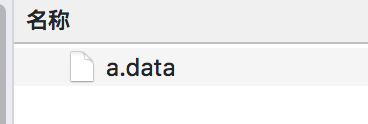
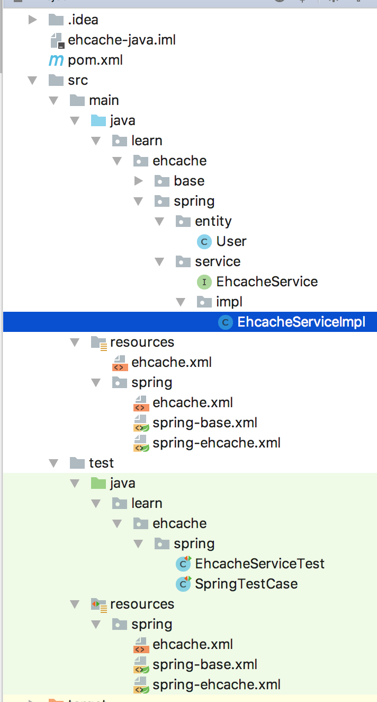

# Ehcache入门

[TOC]

参考原文：http://blog.csdn.net/vbirdbest/article/details/72763048

学习源码：https://github.com/caojx-git/learn/tree/master/code/ehcahce-java

Encache官网：http://www.ehcache.org/


## 一、简介

### 1.1 基本介绍

EhCache 是一个纯Java的进程内缓存框架，具有快速、精干等特点，是Hibernate中默认CacheProvider。Ehcache是一种广泛使用的开源Java分布式缓存。主要面向通用缓存,Java EE和轻量级容器。它具有内存和磁盘存储，缓存加载器,缓存扩展,缓存异常处理程序,一个gzip缓存servlet过滤器,支持REST和SOAP api等特点。

Ehcache最初是由Greg Luck于2003年开始开发。2009年,该项目被Terracotta购买。软件仍然是开源,但一些新的主要功能(例如，快速可重启性之间的一致性的)只能在商业产品中使用，例如Enterprise EHCache and BigMemory。维基媒体Foundationannounced目前使用的就是Ehcache技术。

Spring 提供了对缓存功能的抽象：即允许绑定不同的缓存解决方案（如Ehcache），但本身不直接提供缓存功能的实现。它支持注解方式使用缓存，非常方便。

### 1.2 主要的特性

1. 快速
2. 简单
3. 多种缓存策略
4. 缓存数据有两级：内存和磁盘，因此无需担心容量问题
5. 缓存数据会在虚拟机重启的过程中写入磁盘
6. 可以通过RMI、可插入API等方式进行分布式缓存
7. 具有缓存和缓存管理器的侦听接口
8. 支持多缓存管理器实例，以及一个实例的多个缓存区域
9. 提供Hibernate的缓存实现

### 1.3 集成

可以单独使用，一般在第三方库中被用到的比较多（如mybatis、shiro等）ehcache 对分布式支持不够好，多个节点不能同步，通常和redis一块使用

### 1.4 Ehcache 和 Redis 比较

- ehcache直接在jvm虚拟机中缓存，速度快，效率高；但是缓存共享麻烦，集群分布式应用不方便。
- redis是通过socket访问到缓存服务，效率比ecache低，比数据库要快很多， 
  处理集群和分布式缓存方便，有成熟的方案。如果是单个应用或者对缓存访问要求很高的应用，用ehcache。如果是大型系统，存在缓存共享、分布式部署、缓存内容很大的，建议用redis。

ehcache也有缓存共享方案，不过是通过RMI或者Jgroup多播方式进行广播缓存通知更新，缓存共享复杂，维护不方便；简单的共享可以，但是涉及到缓存恢复，大数据缓存，则不合适。

## 二、Hello World

### 2.1 pom.xml配置

EhCache最新版本是3.X ,2.X 比较稳定，所以还是用2.X版本

```xml
<dependency>
    <groupId>net.sf.ehcache</groupId>
    <artifactId>ehcache</artifactId>
    <version>2.10.3</version>
</dependency>
```

### 2.2 ehcache.xml

在src/main/resources/创建一个配置文件 ehcache.xml,默认情况下Ehcache会自动加载classpath根目录下名为ehcache.xml文件，也可以将该文件放到其他地方在使用时指定文件的位置

```xml
<?xml version="1.0" encoding="UTF-8"?>
<ehcache xmlns:xsi="http://www.w3.org/2001/XMLSchema-instance"
         xsi:noNamespaceSchemaLocation="http://ehcache.org/ehcache.xsd">

  <!-- 磁盘缓存位置
 	   磁盘存储:将缓存中暂时不使用的对象,转移到硬盘,类似于Windows系统的虚拟内存
       path:指定在硬盘上存储对象的路径
	-->
  <diskStore path="/Users/caojx/temp/ehcache"/>

  <!-- 默认缓存
 	 defaultCache:默认的缓存配置信息,如果不加特殊说明,则所有对象按照此配置项处理
	-->
  <defaultCache
          maxEntriesLocalHeap="10000"
          eternal="false"
          timeToIdleSeconds="120"
          timeToLiveSeconds="120"
          maxEntriesLocalDisk="10000000"
          diskExpiryThreadIntervalSeconds="120"
          memoryStoreEvictionPolicy="LRU">
    <persistence strategy="localTempSwap"/>
  </defaultCache>

  <!-- helloworld缓存
 	cache ：自定的缓存，当自定的配置不满足实际情况时可以通过自定义（可以包含多个cache节点）
	-->
  <cache name="HelloWorldCache"
         maxElementsInMemory="1000"
         eternal="false"
         timeToIdleSeconds="5"
         timeToLiveSeconds="5"
         overflowToDisk="false"
         memoryStoreEvictionPolicy="LRU"/>
</ehcache>
```

### 2.4 HelloWorld.java

```java
package learn.ehcache.base;

import net.sf.ehcache.Cache;
import net.sf.ehcache.CacheManager;
import net.sf.ehcache.Element;

/**
 * @author caojx
 * Created on 2018/3/7 下午下午1:03
 */
public class HelloWorld  {

    public static void main(String[] args) {

        // 1. 创建缓存管理器
        CacheManager cacheManager = CacheManager.create("./src/main/resources/ehcache.xml");

        // 2. 获取缓存对象,对应ehcache配置文件中的cache
        Cache cache = cacheManager.getCache("HelloWorldCache");

        // 3. 创建元素
        Element element = new Element("key1", "value1");

        // 4. 将元素添加到缓存
        cache.put(element);

        // 5. 获取缓存
        Element value = cache.get("key1");
        System.out.println(value);
        System.out.println(value.getObjectValue());

        // 6. 删除元素
        cache.remove("key1");

  /*      Dog dog = new Dog(1L, "taidi", (short)2);
        Element element2 = new Element("taidi", dog);
        cache.put(element2);
        Element value2 = cache.get("taidi");
        Dog dog2 = (Dog) value2.getObjectValue();
        System.out.println(dog2);
*/
        System.out.println(cache.getSize());

        // 7. 刷新缓存
        cache.flush();

        // 8. 关闭缓存管理器
        cacheManager.shutdown();
    }
}
```

测试结果：

```text
[ key = key1, value=value1, version=1, hitCount=1, CreationTime = 1520399184332, LastAccessTime = 1520399184333 ]
value1
0
```

## 三、Ehcache缓存常用配置

### 3.1 xml方式配置

- diskStore ： ehcache支持内存和磁盘两种存储
  - path ：指定磁盘存储的位置
- defaultCache ： 默认的缓存
  - maxEntriesLocalHeap=”10000”
  - eternal=”false”
  - timeToIdleSeconds=”120”
  - timeToLiveSeconds=”120”
  - maxEntriesLocalDisk=”10000000”
  - diskExpiryThreadIntervalSeconds=”120”
  - memoryStoreEvictionPolicy=”LRU”
- cache ：自定的缓存，当自定的配置不满足实际情况时可以通过自定义（可以包含多个cache节点）
  - name : 缓存的名称，可以通过指定名称获取指定的某个Cache对象
  - maxElementsInMemory ：内存中允许存储的最大的元素个数，0代表无限个
  - clearOnFlush：内存数量最大时是否清除。
  - eternal ：设置缓存中对象是否为永久的，如果是true，超时设置将被忽略，对象从不过期，此时会忽略timeToIdleSeconds和timeToLiveSeconds属性，默认为false  ，根据存储数据的不同，例如一些静态不变的数据如省市区等可以设置为永不过时
  - timeToIdleSeconds ： 设置对象在失效前的允许闲置时间（单位：秒）。仅当eternal=false对象不是永久有效时使用，可选属性，默认值是0，也就是可闲置时间无穷大，当对象自从最近一次被访问后，如果处于空闲状态的时间超过了timeToIdleSeconds属性值，这个对象就会过期，EHCache将把它从缓存中清空。只有当eternal属性为false，该属性才有效。如果该属性值为0，则表示对象可以无限期地处于空闲状态  。
  - timeToLiveSeconds ：缓存数据的生存时间（TTL），也就是一个元素从构建到消亡的最大时间间隔值，这只能在元素不是永久驻留时有效，如果该值是0就意味着元素可以停顿无穷长的时间，设定对象允许存在于缓存中的最长时间，以秒为单位。当对象自从被存放到缓存中后，如果处于缓存中的时间超过了 timeToLiveSeconds属性值，这个对象就会过期，EHCache将把它从缓存中清除。只有当eternal属性为false，该属性才有效。如果该属性值为0，则表示对象可以无限期地存在于缓存中。timeToLiveSeconds必须大于timeToIdleSeconds属性，才有意义 。
  - overflowToDisk ：内存不足时，是否启用磁盘缓存，true表示当内存缓存的对象数目达到了maxElementsInMemory界限后，会把溢出的对象写到硬盘缓存中。注意：如果缓存的对象要写入到硬盘中的话，则该对象必须实现了Serializable接口才行。
  - maxEntriesLocalDisk：当内存中对象数量达到maxElementsInMemory时，Ehcache将会对象写到磁盘中。
  - maxElementsOnDisk：硬盘中最大缓存对象数，若是0表示无穷大  。
  - diskSpoolBufferSizeMB：这个参数设置DiskStore（磁盘缓存）的缓存区大小。默认是30MB。每个Cache都应该有自己的一个缓冲区。
  - diskPersistent：是否在VM重启时存储硬盘的缓存数据。默认值是false。
  - diskExpiryThreadIntervalSeconds：磁盘失效线程运行时间间隔，默认是120秒。
  -  memoryStoreEvictionPolicy：当达到maxElementsInMemory限制时，Ehcache将会根据指定的策略去清理内存。可选策略有：LRU（最近最少使用，默认策略）、FIFO（先进先出）、LFU（最少访问次数）。  

### 3.2 编码方式配置

```java
Cache cache = manager.getCache("mycache"); 
CacheConfiguration config = cache.getCacheConfiguration(); 
config.setTimeToIdleSeconds(60); 
config.setTimeToLiveSeconds(120); 
config.setmaxEntriesLocalHeap(10000); 
config.setmaxEntriesLocalDisk(1000000);
```

### 3.3 Ehcache配置持久化到硬盘

Ehcache默认配置的话 为了提高效率，所以有一部分缓存是在内存中，然后达到配置的内存对象总量，则才根据策略持久化到硬盘中，这里是有一个问题的，假如系统突然中断运行 那内存中的那些缓存，直接被释放掉了，不能持久化到硬盘；这种数据丢失，对于一般项目是不会有影响的。

这时候我们就需要通过Ehcache配置，来实现缓存的持久化，不存内存中。

```xml
<?xml version="1.0" encoding="UTF-8"?>
<ehcache xmlns:xsi="http://www.w3.org/2001/XMLSchema-instance"
         xsi:noNamespaceSchemaLocation="http://ehcache.org/ehcache.xsd">
   <!-- 
         磁盘存储:将缓存中暂时不使用的对象,转移到硬盘,类似于Windows系统的虚拟内存
          path:指定在硬盘上存储对象的路径
   -->
   <diskStore path="/Users/caojx/temp/ehcache" />
    
   <!-- 
        defaultCache:默认的缓存配置信息,如果不加特殊说明,则所有对象按照此配置项处理
        maxElementsInMemory:设置了缓存的上限,最多存储多少个记录对象
        eternal:代表对象是否永不过期
        overflowToDisk:当内存中Element数量达到maxElementsInMemory时，Ehcache将会Element写到磁盘中
   -->
   <defaultCache
      maxElementsInMemory="100"
      eternal="true"
      overflowToDisk="true"/>
 
    <!-- 
        maxElementsInMemory设置成1，overflowToDisk设置成true，只要有一个缓存元素，就直接存到硬盘上去
        eternal设置成true，代表对象永久有效
        maxElementsOnDisk设置成0 表示硬盘中最大缓存对象数无限大
        diskPersistent设置成true表示缓存虚拟机重启期数据 
     -->
    <cache 
      name="HelloWorldCache"
      maxElementsInMemory="1" 
      eternal="true"
      overflowToDisk="true" 
      maxElementsOnDisk="0"
      diskPersistent="true"/>
</ehcache>
```

运行前面的测试代码，只要我们添加缓存元素 ，则直接写入到硬盘中

  

## 四、Ehcache API

- CacheManager：Cache的容器对象，并管理着（添加或删除）Cache的生命周期。

```java
// 可以自己创建一个Cache对象添加到CacheManager中
public void addCache(Cache cache);
public synchronized void removeCache(String cacheName);
```

- Cache: 一个Cache可以包含多个Element，并被CacheManager管理。它实现了对缓存的逻辑行为

- Element：需要缓存的元素，它维护着一个键值对， 元素也可以设置有效期，0代表无限制

- 获取CacheManager的方式：

  可以通过create()或者newInstance()方法或重载方法来创建获取CacheManager的方式：

```java
public static CacheManager create();
public static CacheManager create(String configurationFileName);
public static CacheManager create(InputStream inputStream);
public static CacheManager create(URL configurationFileURL);
public static CacheManager newInstance();
```

Ehcache的CacheManager构造函数或工厂方法被调用时，会默认加载classpath下名为ehcache.xml的配置文件。 
如果加载失败，会加载Ehcache jar包中的ehcache-failsafe.xml文件，这个文件中含有简单的默认配置。


## 五、Ehcache整合Spring

  

### 5.1 pom.xml

在pom.xml文件中引入ehcache和spring依赖

```xml
<?xml version="1.0" encoding="UTF-8"?>
<project xmlns="http://maven.apache.org/POM/4.0.0"
         xmlns:xsi="http://www.w3.org/2001/XMLSchema-instance"
         xsi:schemaLocation="http://maven.apache.org/POM/4.0.0 http://maven.apache.org/xsd/maven-4.0.0.xsd">
    <modelVersion>4.0.0</modelVersion>

    <groupId>caojx.learn</groupId>
    <artifactId>ehcache-java</artifactId>
    <version>1.0-SNAPSHOT</version>

    <properties>
        <project.build.sourceEncoding>UTF-8</project.build.sourceEncoding>
        <junit.version>4.10</junit.version>
        <spring.version>4.3.14.RELEASE</spring.version>
    </properties>

    <dependencies>
        <dependency>
            <groupId>junit</groupId>
            <artifactId>junit</artifactId>
            <version>${junit.version}</version>
            <scope>test</scope>
        </dependency>
        
        <!--ehcache-->
        <dependency>
            <groupId>net.sf.ehcache</groupId>
            <artifactId>ehcache</artifactId>
            <version>2.10.3</version>
        </dependency>

        <!-- springframework -->
        <dependency>
            <groupId>org.springframework</groupId>
            <artifactId>spring-webmvc</artifactId>
            <version>${spring.version}</version>
        </dependency>
        <dependency>
            <groupId>org.springframework</groupId>
            <artifactId>spring-core</artifactId>
            <version>${spring.version}</version>
        </dependency>
        <dependency>
            <groupId>org.springframework</groupId>
            <artifactId>spring-context</artifactId>
            <version>${spring.version}</version>
        </dependency>
        <dependency>
            <groupId>org.springframework</groupId>
            <artifactId>spring-context-support</artifactId>
            <version>${spring.version}</version>
        </dependency>
    </dependencies>
</project>
```

### 5.2 ehcache.xml

在src/main/resources/spring中添加ehcache.xml

```xml
<?xml version="1.0" encoding="UTF-8"?>
<ehcache xmlns:xsi="http://www.w3.org/2001/XMLSchema-instance"
         xsi:noNamespaceSchemaLocation="http://ehcache.org/ehcache.xsd">

    <!-- 磁盘缓存位置
          磁盘存储:将缓存中暂时不使用的对象,转移到硬盘,类似于Windows系统的虚拟内存
         path:指定在硬盘上存储对象的路径
      -->
    <diskStore path="/Users/caojx/temp/ehcache"/>

    <!-- 默认缓存 -->
    <defaultCache
            maxEntriesLocalHeap="10000"
            eternal="false"
            timeToIdleSeconds="120"
            timeToLiveSeconds="120"
            maxEntriesLocalDisk="10000000"
            diskExpiryThreadIntervalSeconds="120"
            memoryStoreEvictionPolicy="LRU">
        <persistence strategy="localTempSwap"/>
    </defaultCache>

    <!-- helloworld缓存 -->
    <cache name="HelloWorldCache"
           maxElementsInMemory="1000"
           eternal="false"
           timeToIdleSeconds="5"
           timeToLiveSeconds="5"
           overflowToDisk="false"
           memoryStoreEvictionPolicy="LRU"/>

    <cache name="UserCache"
           maxElementsInMemory="1000"
           eternal="false"
           timeToIdleSeconds="1800"
           timeToLiveSeconds="1800"
           overflowToDisk="false"
           memoryStoreEvictionPolicy="LRU"/>
</ehcache>
```

### 5.3 spring 配置

在src/main/resources/spring中配置spring-base.xml和spring-ehcache.xml

**spring-base.xml**

```xml
<?xml version="1.0" encoding="UTF-8"?>
<beans xmlns="http://www.springframework.org/schema/beans"
       xmlns:xsi="http://www.w3.org/2001/XMLSchema-instance"
       xmlns:context="http://www.springframework.org/schema/context" xmlns:util="http://www.springframework.org/schema/util"
       xsi:schemaLocation="http://www.springframework.org/schema/beans http://www.springframework.org/schema/beans/spring-beans.xsd http://www.springframework.org/schema/context http://www.springframework.org/schema/context/spring-context.xsd http://www.springframework.org/schema/util http://www.springframework.org/schema/util/spring-util.xsd">

   <context:component-scan base-package="learn.ehcache.**.dao,learn.ehcache.**.service"/>

</beans>
```

**spring-ehcache.xml**

```xml
<?xml version="1.0" encoding="UTF-8"?>
<beans xmlns="http://www.springframework.org/schema/beans"
       xmlns:xsi="http://www.w3.org/2001/XMLSchema-instance"
       xmlns:cache="http://www.springframework.org/schema/cache"
       xsi:schemaLocation="http://www.springframework.org/schema/beans
        http://www.springframework.org/schema/beans/spring-beans-3.0.xsd
        http://www.springframework.org/schema/cache
        http://www.springframework.org/schema/cache/spring-cache-3.2.xsd">

  <description>ehcache缓存配置管理文件</description>

  <!-- 启用缓存注解开关 -->
  <cache:annotation-driven cache-manager="cacheManager"/>

  <bean id="cacheManager" class="org.springframework.cache.ehcache.EhCacheCacheManager">
    <property name="cacheManager" ref="ehcache"/>
  </bean>

  <bean id="ehcache" class="org.springframework.cache.ehcache.EhCacheManagerFactoryBean">
    <property name="configLocation" value="classpath:spring/ehcache.xml"/>
  </bean>

</beans>
```

### 5.4 EhcacheService.java

```java
package learn.ehcache.spring.service;

/**
 * @author caojx
 * Created on 2018/3/7 下午下午8:38
 */
public interface EhcacheService {

    // 测试失效情况，有效期为5秒
    public String getTimestamp(String param);

    public String getDataFromDB(String key);

    public void removeDataAtDB(String key);

    public String refreshData(String key);

    public User findById(Long userId);

    public boolean isReserved(String userId);

    public void removeUser(Long userId);

    public void removeAllUser();
}
```

### 5.5 EhcacheServiceImpl.java

```java
package learn.ehcache.spring.service.impl;

import learn.ehcache.spring.entity.User;
import learn.ehcache.spring.service.EhcacheService;
import org.springframework.cache.annotation.CacheEvict;
import org.springframework.cache.annotation.CachePut;
import org.springframework.cache.annotation.Cacheable;
import org.springframework.stereotype.Service;

/**
 * @author caojx
 * Created on 2018/3/7 下午下午8:39
 */
@Service("ehcacheService")
public class EhcacheServiceImpl implements EhcacheService {

    // value的值和ehcache.xml中的配置保持一致
    @Cacheable(value="HelloWorldCache", key="#param")
    public String getTimestamp(String param) {
        Long timestamp = System.currentTimeMillis();
        return timestamp.toString();
    }

    @Cacheable(value="HelloWorldCache", key="#key")
    public String getDataFromDB(String key) {
        System.out.println("从数据库中获取数据...");
        return key + ":" + String.valueOf(Math.round(Math.random()*1000000));
    }

    @CacheEvict(value="HelloWorldCache", key="#key")
    public void removeDataAtDB(String key) {
        System.out.println("从数据库中删除数据");
    }

    @CachePut(value="HelloWorldCache", key="#key")
    public String refreshData(String key) {
        System.out.println("模拟从数据库中加载数据");
        return key + "::" + String.valueOf(Math.round(Math.random()*1000000));
    }

     // ------------------------------------------------------------------------
    @Cacheable(value="UserCache", key="'user:' + #userId")
    public User findById(Long userId) {
        System.out.println("模拟从数据库中查询数据");
        return (User) new User(1L, "mengdee");
    }

    @Cacheable(value="UserCache", condition="#userId.length()<12")
    public boolean isReserved(String userId) {
        System.out.println("UserCache:"+userId);
        return false;
    }

    //清除掉UserCache中某个指定key的缓存
    @CacheEvict(value="UserCache",key="'user:' + #userId")
    public void removeUser(Long userId) {
        System.out.println("UserCache remove:"+ userId);
    }

    //清除掉UserCache中全部的缓存
    @CacheEvict(value="UserCache", allEntries=true)
    public void removeAllUser() {
        System.out.println("UserCache delete all");
    }
}
```


### 5.6 注解基本使用方法

Spring对缓存的支持类似于对事务的支持。 
首先使用注解标记方法，相当于定义了切点，然后使用Aop技术在这个方法的调用前、调用后获取方法的入参和返回值，进而实现了缓存的逻辑。

- @Cacheable

  表明所修饰的方法是可以缓存的：当第一次调用这个方法时，它的结果会被缓存下来，在缓存的有效时间内，以后访问这个方法都直接返回缓存结果，不再执行方法中的代码段。 
  这个注解可以用condition属性来设置条件，如果不满足条件，就不使用缓存能力，直接执行方法。 
  可以使用key属性来指定key的生成规则。

- @Cacheable 支持如下几个参数：

  - value：缓存位置名称，不能为空，如果使用EHCache，就是ehcache.xml中声明的cache的name, 指明将值缓存到哪个Cache中

  - key：缓存的key，默认为空，既表示使用方法的参数类型及参数值作为key，支持SpEL，如果要引用参数值使用井号加参数名，如：#userId，

    一般来说，我们的更新操作只需要刷新缓存中某一个值，所以定义缓存的key值的方式就很重要，最好是能够唯一，因为这样可以准确的清除掉特定的缓存，而不会影响到其它缓存值 ， 
    本例子中使用实体加冒号再加ID组合成键的名称，如”user:1”、”order:223123”等

  - condition：触发条件，只有满足条件的情况才会加入缓存，默认为空，既表示全部都加入缓存，支持SpEL

  ```Java
  // 将缓存保存到名称为UserCache中，键为"user:"字符串加上userId值，如 'user:1'
  @Cacheable(value="UserCache", key="'user:' + #userId")    
  public User findById(Long userId) {    
      return (User) new User(1L, "mengdee");           
  }    

  // 将缓存保存进UserCache中，并当参数userId的长度小于12时才保存进缓存，默认使用参数值及类型作为缓存的key
  // 保存缓存需要指定key，value， value的数据类型，不指定key默认和参数名一样如："1"
  @Cacheable(value="UserCache", condition="#userId.length() < 12")    
  public boolean isReserved(String userId) {    
      System.out.println("UserCache:"+userId);    
      return false;    
  }
  ```

- @CachePut

  与@Cacheable不同，@CachePut不仅会缓存方法的结果，还会执行方法的代码段。它支持的属性和用法都与@Cacheable一致。

- @CacheEvict

  与@Cacheable功能相反，@CacheEvict表明所修饰的方法是用来删除失效或无用的缓存数据。

  @CacheEvict 支持如下几个参数：

  - value：缓存位置名称，不能为空，同上
  - key：缓存的key，默认为空，同上
  - condition：触发条件，只有满足条件的情况才会清除缓存，默认为空，支持SpEL
  - allEntries：true表示清除value中的全部缓存，默认为false

```java
//@CachePut不仅会缓存方法的结果，还会执行方法的代码段
@CachePut(value="HelloWorldCache", key="#key")
public String refreshData(String key) {
    System.out.println("模拟从数据库中加载数据");
    return key + "::" + String.valueOf(Math.round(Math.random()*1000000));
}

//清除掉UserCache中某个指定key的缓存    
@CacheEvict(value="UserCache",key="'user:' + #userId")    
public void removeUser(User user) {    
    System.out.println("UserCache"+user.getUserId());    
}    

//清除掉UserCache中全部的缓存    
@CacheEvict(value="UserCache", allEntries=true)    
public final void setReservedUsers(String[] reservedUsers) {    
   System.out.println("UserCache deleteall");    
}
```

### 5.7 测试

SpringTestCase.java

```java
package learn.ehcache.spring;

import org.junit.runner.RunWith;
import org.springframework.test.context.ContextConfiguration;
import org.springframework.test.context.junit4.AbstractJUnit4SpringContextTests;
import org.springframework.test.context.junit4.SpringJUnit4ClassRunner;

/**
 * @author caojx
 * Created on 2018/3/7 下午下午8:50
 */
@ContextConfiguration(locations = {"classpath:spring/spring-*.xml"})
@RunWith(SpringJUnit4ClassRunner.class)
public class SpringTestCase extends AbstractJUnit4SpringContextTests {
}
```

EhcacheServiceTest.java

```java
package learn.ehcache.spring;

import learn.ehcache.spring.service.EhcacheService;
import org.junit.Test;
import org.springframework.beans.factory.annotation.Autowired;

/**
 * @author caojx
 * Created on 2018/3/7 下午下午8:56
 */
public class EhcacheServiceTest extends SpringTestCase {

    @Autowired
    private EhcacheService ehcacheService;

    // 有效时间是5秒，第一次和第二次获取的值是一样的，因第三次是5秒之后所以会获取新的值
    @Test
    public void testTimestamp() throws InterruptedException{
        System.out.println("第一次调用：" + ehcacheService.getTimestamp("param"));
        Thread.sleep(2000);
        System.out.println("2秒之后调用：" + ehcacheService.getTimestamp("param"));
        Thread.sleep(4000);
        System.out.println("再过4秒之后调用：" + ehcacheService.getTimestamp("param"));
    }

    @Test
    public void testCache(){
        String key = "zhangsan";
        String value = ehcacheService.getDataFromDB(key); // 从数据库中获取数据...
        System.out.println("data:"+value);
        value = ehcacheService.getDataFromDB(key);  // 从缓存中获取数据，所以不执行该方法体
        System.out.println("data:"+value);
        ehcacheService.removeDataAtDB(key); // 从数据库中删除数据
        value = ehcacheService.getDataFromDB(key);  // 从数据库中获取数据...（缓存数据删除了，所以要重新获取，执行方法体）
        System.out.println("data:"+value);
    }

    @Test
    public void testPut(){
        String key = "mengdee";
        ehcacheService.refreshData(key);  // 模拟从数据库中加载数据
        String data = ehcacheService.getDataFromDB(key);
        System.out.println("data:" + data); // data:mengdee::103385

        ehcacheService.refreshData(key);  // 模拟从数据库中加载数据
        String data2 = ehcacheService.getDataFromDB(key);
        System.out.println("data2:" + data2);   // data2:mengdee::180538
    }


    @Test
    public void testFindById(){
        ehcacheService.findById(1L); // 模拟从数据库中查询数据,第二次查询的时候，直接返回结果
        ehcacheService.findById(1L);
    }

    @Test
    public void testIsReserved(){
        ehcacheService.isReserved("123");
        ehcacheService.isReserved("123");
    }

    @Test
    public void testRemoveUser(){
        // 线添加到缓存
        ehcacheService.findById(1L);

        // 再删除
        ehcacheService.removeUser(1L);

        // 如果不存在会执行方法体
        ehcacheService.findById(1L);
    }

    @Test
    public void testRemoveAllUser(){
        ehcacheService.findById(1L);
        ehcacheService.findById(2L);

        ehcacheService.removeAllUser();

        ehcacheService.findById(1L);
        ehcacheService.findById(2L);

//      模拟从数据库中查询数据
//      模拟从数据库中查询数据
//      UserCache delete all
//      模拟从数据库中查询数据
//      模拟从数据库中查询数据
    }
}
```


## 推荐文章

http://blog.csdn.net/vbirdbest/article/details/72763048

http://blog.java1234.com/blog/articles/274.html

