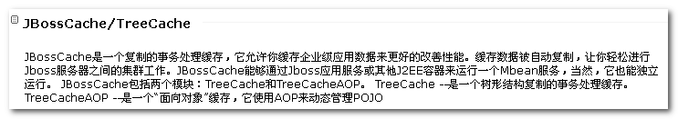
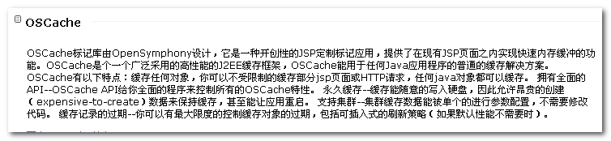
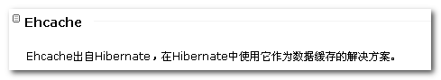
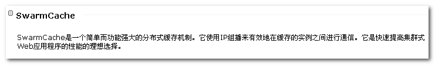

# ehcache与shiro整合

[TOC]

## 一、简介

每次需要shiro做权限控制， Realm的授权方法就会被调用， 查询数据库重新完成授权！ 

问题： 性能开销比较大  

解决： 对用户授权，只进行一次 查询，查询后，将用户授权信息放入缓存中，以后需要授权时，直接从缓存中获取数据，而无需查询数据表 


**JavaEE开发主流缓存技术**

   

  

  

  

## 二、Spring集成EhCache

### 2.1 引入Ehcahce依赖

在项目中导入 Ehcache的jar 包

```xml
<dependency>
       <groupId>net.sf.ehcache</groupId>
       <artifactId>ehcache-core</artifactId>
       <version>2.6.6</version>
</dependency>
```

### 2.2 ehcache.xml

在src/main/resources目录下创建ehcache.xml文件

```xml
<?xml version="1.0" encoding="UTF-8"?>
<ehcache xmlns:xsi="http://www.w3.org/2001/XMLSchema-instance"
         xsi:noNamespaceSchemaLocation="http://ehcache.org/ehcache.xsd">

<!-- 内存中缓存数据 过多，写入硬盘，diskStore 用来定义硬盘保存缓存数据位置 -->
    <diskStore path="java.io.tmpdir"/>

	<!-- 默认缓存配置策略 -->
	<!-- maxElementsInMemory 内存中允许存放对象最大数量 -->
	<!-- eternal 缓存数据是否是永久的  -->
	<!-- maxElementsOnDisk 硬盘中缓存最大对象数量 -->
    <defaultCache
            maxElementsInMemory="10000" 
            eternal="false"
            timeToIdleSeconds="120"
            timeToLiveSeconds="120"
            maxElementsOnDisk="10000000"
            diskExpiryThreadIntervalSeconds="120"
            memoryStoreEvictionPolicy="LRU">
        <persistence strategy="localTempSwap"/>
    </defaultCache>

</ehcache>
```

### 2.3 spring-ehcahe.xml

对Spring 进行 Ehcache 整合 

```xml
<beans xmlns="http://www.springframework.org/schema/beans"
	xmlns:xsi="http://www.w3.org/2001/XMLSchema-instance"
	xmlns:context="http://www.springframework.org/schema/context"
	xmlns:aop="http://www.springframework.org/schema/aop"
	xmlns:tx="http://www.springframework.org/schema/tx"
	xmlns:cache="http://www.springframework.org/schema/cache"
	xsi:schemaLocation="http://www.springframework.org/schema/beans 
	http://www.springframework.org/schema/beans/spring-beans.xsd
	http://www.springframework.org/schema/context
	http://www.springframework.org/schema/context/spring-context.xsd
	http://www.springframework.org/schema/aop
	http://www.springframework.org/schema/aop/spring-aop.xsd
	http://www.springframework.org/schema/tx 
	http://www.springframework.org/schema/tx/spring-tx.xsd
	http://www.springframework.org/schema/cache 
	http://www.springframework.org/schema/cache/spring-cache.xsd">


<!-- 通过配置注解 使用cache ,使用ehcache 缓存 -->
	<cache:annotation-driven cache-manager="ehCacheManager"/>
	 
	<!-- spring对ehcache的缓存工厂支持 -->
	<bean id="ehCacheManagerFactory" class="org.springframework.cache.ehcache.EhCacheManagerFactoryBean">
	    <property name="configLocation" value="classpath:ehcache.xml" />
	    <property name="shared" value="false" />
	</bean>
	
	<!-- spring对ehcache的缓存管理 -->
	<bean id="ehCacheManager"
          class="org.springframework.cache.ehcache.EhCacheCacheManager">
	    <property name="cacheManager" ref="ehCacheManagerFactory"></property>
	</bean>
</beans>
```

### 2.4 spring 缓存注解

通过Spring 提供缓存注解，对数据进行缓存 

@Cacheable和@CacheEvict来对缓存进行操作

@Cacheable：负责将方法的返回值加入到缓存中

@CacheEvict：负责清除缓存

@Cacheable("staff")// 对pageQuery 方法使用缓存

```java
@Cacheable("staff")// 对pageQuery 方法使用缓存
public Object pageQuery(int page, int rows) {}

@CacheEvict(value = "staff", allEntries = true)// 清除缓存
public String save(Staff staff) {}
```

通常在查询数据时，进行缓存， 在增加、修改、删除数据时，清除缓存 ！ 

**注意：ehcache在初始化时，至少要配置缓存区域， 而且配置区域名称需要和 @Cacheable 注解中指定区域名称一致！！！  **

```xml
<!-- 一个缓存区域, 用来存放取派员 -->
 <!-- name 是 缓存区域的名称 -->
<cache name="staff" 
    		maxElementsInMemory="10000" 
            eternal="false"
            timeToIdleSeconds="120"
            timeToLiveSeconds="120"/>
```

## 三、Shiro集成Ehcache

### 3.1 spring-shiro.xml

```xml
<!-- shiro对ehcache的缓存管理直接使用spring的缓存工厂 -->
<bean id="cacheManager" class="org.apache.shiro.cache.ehcache.EhCacheManager"> 
	    <property name="cacheManager" ref="ehCacheManagerFactory" />
</bean>

<!-- 安全管理器 -->
<bean id="securityManager" class="org.apache.shiro.web.mgt.DefaultWebSecurityManager">
	<!--设置自定义realm -->
	<property name="realm" ref="monitorRealm" />
	<!-- 将缓存管理器，交给安全管理器 -->
	<property name="cacheManager" ref="cacheManager"></property>
</bean>

<!--自定义Realm 继承自AuthorizingRealm -->
<bean id="monitorRealm" class="cn.itcast.bos.shiro.MonitorRealm">
	<!-- 配置授权 信息 缓存区名称  -->
	<property name="authorizationCacheName" value="authorizationCacheName"></property>
</bean>
```

Shiro集成Ehcache后，相当于将Ehcache缓存管理器交给Shiro管理。

### 3.2 ehcache.xml 

```xml
<!-- 配置存放 shiro授权缓存区域 -->
<cache name="authorizationCacheName"
    maxElementsInMemory="10000" 
    eternal="false"
    timeToIdleSeconds="120"
    timeToLiveSeconds="120"/>
```

Shiro 在执行 doGetAuthorizationInfo授权时，会将授权返回 SimpleAuthorizationInfo信息，放入对应名称的Ehcache缓存中。

Shiro对于登陆用户只授权一次，使用subject.logout方法， 对授权缓存区evict操作！


## 推荐文章

[shiro入门](https://github.com/caojx-git/learn/blob/master/notes/shiro/shiro%E5%AE%89%E5%85%A8%E6%A1%86%E6%9E%B6%E5%85%A5%E9%97%A8.md)

[ehcache入门](https://github.com/caojx-git/learn/blob/master/notes/ehcache/ehcache%E5%85%A5%E9%97%A8.md)