# ElasticSearch入门

[TOC]

官网：https://www.elastic.co/cn/

下载：https://www.elastic.co/downloads/elasticsearch

ElasticSearch权威指南：https://www.elastic.co/guide/cn/elasticsearch/guide/current/index.html

练习代码：https://github.com/caojx-git/learn/tree/master/code/elasticsearch-java


**本教程主要来自**

1. Elasticsearch学习，请先看这一篇 https://blog.csdn.net/laoyang360/article/details/52244917

2. java1234网：http://blog.java1234.com/index.html?typeId=24

   ​

本人一步一步按照教程实际操作过，非常好的文章。


## 带着问题上路——ES是如何产生的？

### 1. 思考：大规模数据如何检索？

如：当系统数据量上了10亿、100亿条的时候，我们在做系统架构的时候通常会从以下角度去考虑问题： 
1）用什么数据库好？(mysql、sybase、oracle、达梦、神通、mongodb、hbase…) 
2）如何解决单点故障；(lvs、F5、A10、Zookeep、MQ) 
3）如何保证数据安全性；(热备、冷备、异地多活) 
4）如何解决检索难题；(数据库代理中间件：mysql-proxy、Cobar、MaxScale等;) 
5）如何解决统计分析问题；(离线、近实时)

###2. 传统数据库的应对解决方案

对于关系型数据，我们通常采用以下或类似架构去解决查询瓶颈和写入瓶颈： 
解决要点： 
1）通过主从备份解决数据安全性问题； 
2）通过数据库代理中间件心跳监测，解决单点故障问题； 
3）通过代理中间件将查询语句分发到各个slave节点进行查询，并汇总结果 
  

### 3. 非关系型数据库的解决方案

对于Nosql数据库，以mongodb为例，其它原理类似： 
解决要点： 
1）通过副本备份保证数据安全性； 
2）通过节点竞选机制解决单点问题； 
3）先从配置库检索分片信息，然后将请求分发到各个节点，最后由路由节点合并汇总结果 
  

### 4.另辟蹊径——完全把数据放入内存怎么样？

我们知道，完全把数据放在内存中是不可靠的，实际上也不太现实，当我们的数据达到PB级别时，按照每个节点96G内存计算，在内存完全装满的数据情况下，我们需要的机器是：1PB=1024T=1048576G 
节点数=1048576/96=10922个 
实际上，考虑到数据备份，节点数往往在2.5万台左右。成本巨大决定了其不现实！

从前面讨论我们了解到，把数据放在内存也好，不放在内存也好，都不能完完全全解决问题。 
全部放在内存速度问题是解决了，但成本问题上来了。 
为解决以上问题，从源头着手分析，通常会从以下方式来寻找方法： 
1、存储数据时按有序存储； 
2、将数据和索引分离； 
3、压缩数据； 
这就引出了Elasticsearch。


## 一、ES基础

### 1.1 简介

ElasticSearch是一个基于Lucene的搜索服务器。它提供了一个分布式多用户能力的全文搜索引擎，基于RESTful web接口。Elasticsearch是用Java开发的，并作为Apache许可条款下的开放源码发布，是当前流行的企业级搜索引擎。设计用于[云计算](https://baike.baidu.com/item/%E4%BA%91%E8%AE%A1%E7%AE%97)中，能够达到实时搜索，稳定，可靠，快速，安装使用方便。

Elasticsearch也使用Java开发并使用Lucene作为其核心来实现所有索引和搜索的功能，但是它的目的是通过简单的RESTful API来隐藏Lucene的复杂性，从而让全文搜索变得简单。

我们建立一个网站或应用程序，并要添加搜索功能，但是想要完成搜索工作的创建是非常困难的。我们希望搜索解决方案要运行速度快，我们希望能有一个零配置和一个完全免费的搜索模式，我们希望能够简单地使用JSON通过HTTP来索引数据，我们希望我们的搜索服务器始终可用，我们希望能够从一台开始并扩展到数百台，我们要实时搜索，我们要简单的多租户，我们希望建立一个云的解决方案。因此我们利用Elasticsearch来解决所有这些问题以及可能出现的更多其它问题。

详细介绍：[百度百科](https://baike.baidu.com/item/elasticsearch/3411206?fr=aladdin)


### 1.2 Lucene与ES关系？

1）Lucene只是一个库。想要使用它，你必须使用Java来作为开发语言并将其直接集成到你的应用中，更糟糕的是，Lucene非常复杂，你需要深入了解检索的相关知识来理解它是如何工作的。

2）Elasticsearch也使用Java开发并使用Lucene作为其核心来实现所有索引和搜索的功能，但是它的目的是通过简单的RESTful API来隐藏Lucene的复杂性，从而让全文搜索变得简单。


### 1.3 ES主要解决的问题

1）检索相关数据 
2）返回统计结果
3）速度要快


### 1.4 ES工作原理

当ElasticSearch的节点启动后，它会利用多播(multicast)(或者单播，如果用户更改了配置)寻找集群中的其它节点，并与之建立连接。这个过程如下图所示：

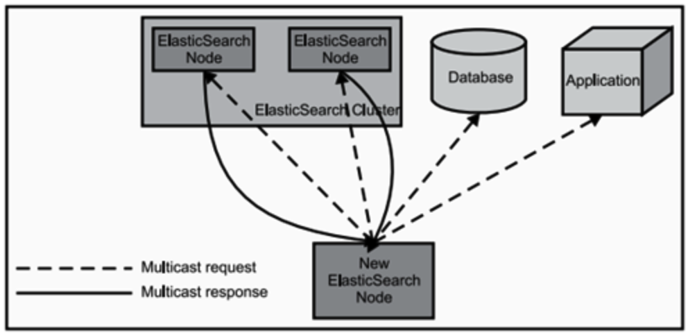  


### 1.5 ES核心概念

#### 1. Cluster：集群。

ES可以作为一个独立的单个搜索服务器。不过，为了处理大型数据集，实现容错和高可用性，ES可以运行在许多互相合作的服务器上。这些服务器的集合称为集群。

#### 2. Node：节点

形成集群的每个服务器称为节点。

#### 3. Shard：分片

当有大量的文档时，由于内存的限制、磁盘处理能力不足、无法足够快的响应客户端的请求等，一个节点可能不够。这种情况下，数据可以分为较小的分片。每个分片放到不同的服务器上。 
当你查询的索引分布在多个分片上时，ES会把查询发送给每个相关的分片，并将结果组合在一起，而应用程序并不知道分片的存在。即：这个过程对用户来说是透明的。

#### 4. Replia：副本

为提高查询吞吐量或实现高可用性，可以使用分片副本。 
副本是一个分片的精确复制，每个分片可以有零个或多个副本。ES中可以有许多相同的分片，其中之一被选择更改索引操作，这种特殊的分片称为主分片。 
当主分片丢失时，如：该分片所在的数据不可用时，集群将副本提升为新的主分片。

#### 5. 全文检索

全文检索就是对一篇文章进行索引，可以根据关键字搜索，类似于mysql里的like语句。 
全文索引就是把内容根据词的意义进行分词，然后分别创建索引，例如”你们的激情是因为什么事情来的” 可能会被分词成：“你们“，”激情“，“什么事情“，”来“ 等token，这样当你搜索“你们” 或者 “激情” 都会把这句搜出来。

### 1.6 ES数据架构的主要概念（与关系数据库Mysql对比）
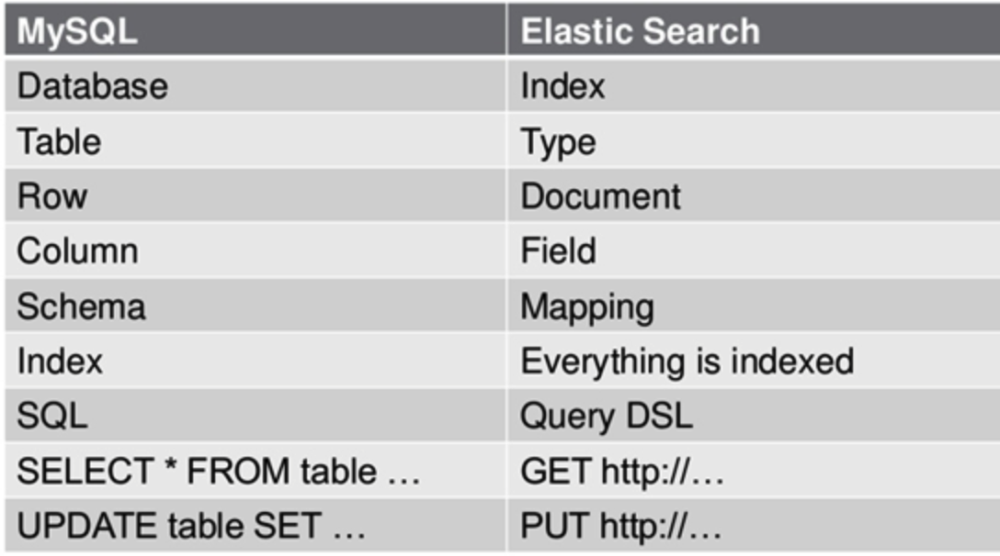    

（1）关系型数据库中的数据库（DataBase），等价于ES中的索引（Index）。 
（2）一个数据库下面有N张表（Table），等价于1个索引Index下面有N多类型（Type）。 
（3）一个数据库表（Table）下的数据由多行（ROW）多列（column，属性）组成，等价于1个Type由多个文档（Document）和多Field组成。 
（4）在一个关系型数据库里面，schema定义了表、每个表的字段，还有表和字段之间的关系。 与之对应的，在ES中：Mapping定义索引下的Type的字段处理规则，即索引如何建立、索引类型、是否保存原始索引JSON文档、是否压缩原始JSON文档、是否需要分词处理、如何进行分词处理等。 
（5）在数据库中的增insert、删delete、改update、查search操作等价于ES中的增PUT/POST、删Delete、改_update、查GET。

### 1.7 ELK是什么？

ELK=elasticsearch+Logstash+kibana 

- elasticsearch：后台分布式存储以及全文检索 
- logstash: 日志加工、“搬运工” 
- kibana：数据可视化展示。 

ELK架构为数据分布式存储、可视化查询和日志解析创建了一个功能强大的管理链。 三者相互配合，取长补短，共同完成分布式大数据处理工作。

### 1.8 ES特点和优势

1）分布式实时文件存储，可将每一个字段存入索引，使其可以被检索到。 
2）实时分析的分布式搜索引擎。 
分布式：索引分拆成多个分片，每个分片可有零个或多个副本。集群中的每个数据节点都可承载一个或多个分片，并且协调和处理各种操作； 
负载再平衡和路由在大多数情况下自动完成。 
3）可以扩展到上百台服务器，处理PB级别的结构化或非结构化数据。也可以运行在单台PC上（已测试） 
4）支持插件机制，分词插件、同步插件、Hadoop插件、可视化插件等。


### 1.9 ES性能结果展示

（1）硬件配置： 
	CPU 16核 AuthenticAMD 
	内存 总量：32GB 
	硬盘 总量：500GB 非SSD

（2）在上述硬件指标的基础上测试性能如下： 
	1）平均索引吞吐量： 12307docs/s（每个文档大小：40B/docs） 
	2）平均CPU使用率： 887.7%（16核，平均每核：55.48%） 
	3）构建索引大小： 3.30111 GB 
	4）总写入量： 20.2123 GB 
	5）测试总耗时： 28m 54s.


### 1.10 性能esrally工具（推荐）

使用参考：<http://blog.csdn.net/laoyang360/article/details/52155481>

### 1.11 为什么要用ES？

#### 1. ES国内外使用优秀案例

1） 2013年初，GitHub抛弃了Solr，采取ElasticSearch 来做PB级的搜索。 “GitHub使用ElasticSearch搜索20TB的数据，包括13亿文件和1300亿行代码”。

2）维基百科：启动以elasticsearch为基础的核心搜索架构。 
3）SoundCloud：“SoundCloud使用ElasticSearch为1.8亿用户提供即时而精准的音乐搜索服务”。 
4）百度：百度目前广泛使用ElasticSearch作为文本数据分析，采集百度所有服务器上的各类指标数据及用户自定义数据，通过对各种数据进行多维分析展示，辅助定位分析实例异常或业务层面异常。目前覆盖百度内部20多个业务线（包括casio、云分析、网盟、预测、文库、直达号、钱包、风控等），单集群最大100台机器，200个ES节点，每天导入30TB+数据。

#### 2. 我们也需要

实际项目开发实战中，几乎每个系统都会有一个搜索的功能，当搜索做到一定程度时，维护和扩展起来难度就会慢慢变大，所以很多公司都会把搜索单独独立出一个模块，用ElasticSearch等来实现。

近年ElasticSearch发展迅猛，已经超越了其最初的纯搜索引擎的角色，现在已经增加了数据聚合分析（aggregation）和可视化的特性，如果你有数百万的文档需要通过关键词进行定位时，ElasticSearch肯定是最佳选择。当然，如果你的文档是JSON的，你也可以把ElasticSearch当作一种“NoSQL数据库”， 应用ElasticSearch数据聚合分析（aggregation）的特性，针对数据进行多维度的分析。

【知乎：热酷架构师潘飞】ES在某些场景下替代传统DB 
个人以为Elasticsearch作为内部存储来说还是不错的，效率也基本能够满足，在某些方面替代传统DB也是可以的，前提是你的业务不对操作的事性务有特殊要求；而权限管理也不用那么细，因为ES的权限这块还不完善。 
由于我们对ES的应用场景仅仅是在于对某段时间内的数据聚合操作，没有大量的单文档请求（比如通过userid来找到一个用户的文档，类似于NoSQL的应用场景），所以能否替代NoSQL还需要各位自己的测试。 
如果让我选择的话，我会尝试使用ES来替代传统的NoSQL，因为它的横向扩展机制太方便了。

## 二、安装ElasticSearch

### 2.1 CentOS7中安装elasticsearch5.5

**第一步：必须要有jre支持**

elasticsearch是用Java实现的，跑elasticsearch必须要有jre支持，所以必须先安装jre

可以参考 <http://blog.java1234.com/blog/articles/307.html>  


**第二步：下载elasticsearch**

进入官方下载 <https://www.elastic.co/downloads/elasticsearch>

ElasticSearch5.5 https://artifacts.elastic.co/downloads/elasticsearch/elasticsearch-5.5.0.tar.gz

因为是centos中运行 所以我们选 tar.gz压缩包；

下载后 用ftp上传到centos里 我们把这个文件上传到 /home/data/下


**第三步：安装和配置elasticsearch**

进入data目录  解压

```shell
[root@bogon ~]# cd /home/data/
[root@bogon data]# tar -zxvf elasticsearch-5.5.2.tar.gz
# 新建目录 剪切文件到新目录
[root@bogon data]# cd
[root@bogon ~]# mkdir /home/es/
[root@bogon ~]# mv /home/data/elasticsearch-5.5.2 /home/es/
```

**第四步：启动elasticsearch**

```shell
[root@bogon ~]# sh /home/es/elasticsearch-5.5.2/bin/elasticsearch
报错了：
[2017-09-07T19:43:10,628][WARN ][o.e.b.ElasticsearchUncaughtExceptionHandler] [] uncaught exception in thread [main]
org.elasticsearch.bootstrap.StartupException: java.lang.RuntimeException: can not run elasticsearch as root
	at org.elasticsearch.bootstrap.Elasticsearch.init(Elasticsearch.java:127) ~[elasticsearch-5.5.2.jar:5.5.2]
	at org.elasticsearch.bootstrap.Elasticsearch.execute(Elasticsearch.java:114) ~[elasticsearch-5.5.2.jar:5.5.2]
	at org.elasticsearch.cli.EnvironmentAwareCommand.execute(EnvironmentAwareCommand.java:67) ~[elasticsearch-5.5.2.jar:5.5.2]
	at org.elasticsearch.cli.Command.mainWithoutErrorHandling(Command.java:122) ~[elasticsearch-5.5.2.jar:5.5.2]
	at org.elasticsearch.cli.Command.main(Command.java:88) ~[elasticsearch-5.5.2.jar:5.5.2]
	at org.elasticsearch.bootstrap.Elasticsearch.main(Elasticsearch.java:91) ~[elasticsearch-5.5.2.jar:5.5.2]
	at org.elasticsearch.bootstrap.Elasticsearch.main(Elasticsearch.java:84) ~[elasticsearch-5.5.2.jar:5.5.2]
Caused by: java.lang.RuntimeException: can not run elasticsearch as root
	at org.elasticsearch.bootstrap.Bootstrap.initializeNatives(Bootstrap.java:106) ~[elasticsearch-5.5.2.jar:5.5.2]
	at org.elasticsearch.bootstrap.Bootstrap.setup(Bootstrap.java:194) ~[elasticsearch-5.5.2.jar:5.5.2]
	at org.elasticsearch.bootstrap.Bootstrap.init(Bootstrap.java:351) ~[elasticsearch-5.5.2.jar:5.5.2]
	at org.elasticsearch.bootstrap.Elasticsearch.init(Elasticsearch.java:123) ~[elasticsearch-5.5.2.jar:5.5.2]

	... 6 more
```

意思是不能用root用户来启动，可以使用非root用户，如果没有其他用户我们可以新建一个用户来启动

```shell
#新建elastic用户 并且把目录权限赋予给elastic 
[root@bogon ~]# useradd elastic
[root@bogon ~]# chown -R elastic:elastic /home/es/elasticsearch-5.5.2/

#我们切换成elastic用户，然后执行
[root@bogon ~]# su elastic
[elastic@bogon root]$ sh /home/es/elasticsearch-5.5.2/bin/elasticsearch

#出来一大串info 说明成功了，但是这种方式是前台运行，不方便我们操作其他的 我们加下 -d 后台运行
#先ctrl+c退出执行；
[elastic@bogon root]$ sh /home/es/elasticsearch-5.5.2/bin/elasticsearch -d

#我们来检查下是否启动成功
[elastic@bogon root]$  ps -ef | grep elasticsearch
elastic    2962      1 23 19:48 pts/1    00:00:02 /home/java/jdk1.8.0_144/bin/java -Xms2g -Xmx2g -XX:+UseConcMarkSweepGC -XX:CMSInitiatingOccupancyFraction=75 -XX:+UseCMSInitiatingOccupancyOnly -XX:+AlwaysPreTouch -server -Xss1m -Djava.awt.headless=true -Dfile.encoding=UTF-8 -Djna.nosys=true -Djdk.io.permissionsUseCanonicalPath=true -Dio.netty.noUnsafe=true -Dio.netty.noKeySetOptimization=true -Dio.netty.recycler.maxCapacityPerThread=0 -Dlog4j.shutdownHookEnabled=false -Dlog4j2.disable.jmx=true -Dlog4j.skipJansi=true -XX:+HeapDumpOnOutOfMemoryError -Des.path.home=/home/es/elasticsearch-5.5.2 -cp /home/es/elasticsearch-5.5.2/lib/* org.elasticsearch.bootstrap.Elasticsearch -d

elastic    2977   2849  0 19:48 pts/1    00:00:00 grep --color=auto elasticsearch
```

注意 有朋友经常出现 如下错误

```text
ERROR: [2] bootstrap checks failed
[1]: max file descriptors [4096] for elasticsearch process is too low, increase to at least [65536]
[2]: max virtual memory areas vm.max_map_count [65530] is too low, increase to at least [262144]
```

可以参考：<http://blog.java1234.com/blog/articles/342.html>

**第五步：验证服务是否正常运行**

```shell
[elastic@bogon root]$ curl http://localhost:9200
{
  "name" : "IFcPEht",
  "cluster_name" : "elasticsearch",
  "cluster_uuid" : "alStuZsmTr-ffytTOAczqg",
  "version" : {
    "number" : "5.5.0",
    "build_hash" : "260387d",
    "build_date" : "2017-06-30T23:16:05.735Z",
    "build_snapshot" : false,
    "lucene_version" : "6.6.0"
  },
  "tagline" : "You Know, for Search"
}

出来这个 说明配置OK。
```

**第六步：允许外网访问**

前面我们配置的仅仅是本机使用 但是我们比如集群以及其他机器连接 ，则需要配置下。

可以修改 /home/es/elasticsearch/config/elasticsearch.yml 文件

把 network.host 和 http.port 前面的 备注去掉 然后Host改成你的局域网IP即可

```shell
#本机的ip地址
network.host: 192.168.46.136
# 设置节点间交互的tcp端口（集群）,(默认9300)  
transport.tcp.port: 9300  
# 监听端口（默认）  
http.port: 9200  
```

修改后 保存退出

然后我们把防火墙也关了 

systemctl stop firewalld.service

systemctl disable firewalld.service   禁止防火墙开机启动

最后我们重启下elasticsearch服务

ps -ef | grep elasticsearch 找到进程号

然后kill -9 进程号

再启动下elasticsearch

我们用谷歌浏览器请求下 <http://192.168.46.136:9200/>

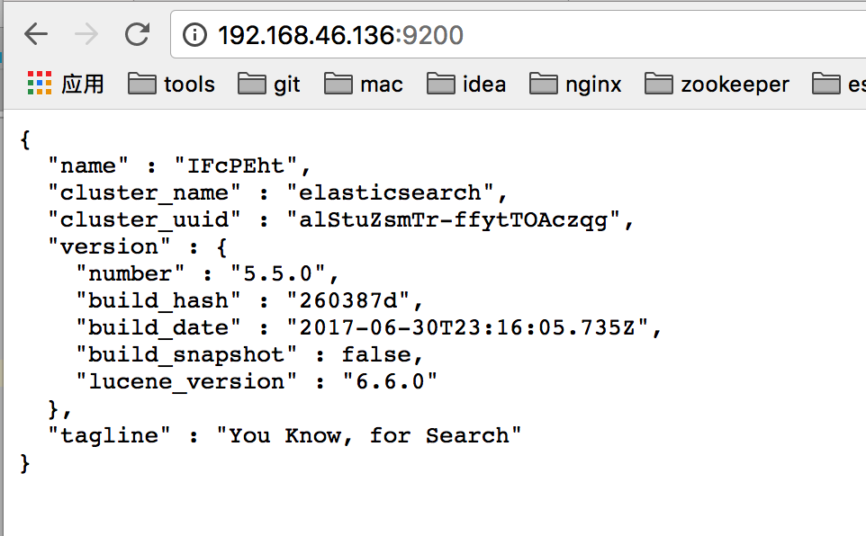    

OK 出现这东西 才算配置完成；

### 2.2 elasticsearch5.5启动出现的错误

**错误1：**

```text
Java HotSpot(TM) 64-Bit Server VM warning: INFO: os::commit_memory(0x0000000085330000, 2060255232, 0) failed; error='Cannot allocate memory' (errno=12)
```

由于elasticsearch5.5默认分配jvm空间大小为2g，修改jvm空间分配

vi /home/es/elasticsearch-5.5.2/config/jvm.options 

```shell
默认配置 
-Xms2g  
-Xmx2g  

改成

-Xms512m  
-Xmx512m
即可；
```

**错误2**：

```shell
ERROR: [2] bootstrap checks failed
[1]: max file descriptors [4096] for elasticsearch process is too low, increase to at least [65536]
[2]: max virtual memory areas vm.max_map_count [65530] is too low, increase to at least [262144]
```

启动报这个错误；

问题1 [1]: max file descriptors [4096] for elasticsearch process is too low, increase to at least [65536]

修改/etc/security/limits.conf文件，添加或修改如下行： （请切换到root用户 然后强制修改文件）

```shell
*        hard    nofile           65536
*        soft    nofile           65536
```

上边的\* 表示对所有用户生效，修改保存文件后可能不会马上生效，需要重启系统后生效。


问题2  [2]: max virtual memory areas vm.max_map_count [65530] is too low, increase to at least [262144]

```shell
#使用下面的方法临时使其生效
$ sudo sysctl -w vm.max_map_count=262144 

#永久生效
$ sudo vi /etc/sysctl.conf
	vm.max_map_count=262144
	
#让上边的修改生效
$sudo sysctl -p /etc/sysctl.conf
```


## 三、Java操作ElasticSearch

### 3.1 创建客户端连接

ElasticSearch提供了主流开发语言的连接开发包 ，新建的maven项目 添加如下依赖即可

```xml
<dependency>
    <groupId>org.elasticsearch.client</groupId>
    <artifactId>transport</artifactId>
    <version>5.5.2</version>
</dependency>
```

连接代码:

```java
package caojx.learn.base;

import org.elasticsearch.client.transport.TransportClient;
import org.elasticsearch.common.settings.Settings;
import org.elasticsearch.common.transport.InetSocketTransportAddress;
import org.elasticsearch.transport.client.PreBuiltTransportClient;

import java.net.InetAddress;

/**
 * @author caojx
 * Created on 2018/3/29 下午下午1:02
 */
public class ConnectTest {

    private static String host="192.168.46.136"; // 服务器地址
    private static int port=9300; // 9300是内部传输端口，9200是http端口，这两个不同的

    public static void main(String[] args) throws Exception{
        //这里有个Settings 等后面讲到集群再详解
        TransportClient client = new PreBuiltTransportClient(Settings.EMPTY)
                .addTransportAddress(new InetSocketTransportAddress(InetAddress.getByName(ConnectTest.host),ConnectTest.port));
        System.out.println(client);
        client.close();
    }
}
```

### 3.2 创建索引

配置maven依赖的pom.xml文件：

```xml
<project xmlns="http://maven.apache.org/POM/4.0.0" xmlns:xsi="http://www.w3.org/2001/XMLSchema-instance"
  xsi:schemaLocation="http://maven.apache.org/POM/4.0.0 http://maven.apache.org/xsd/maven-4.0.0.xsd">
  <modelVersion>4.0.0</modelVersion>

  <groupId>caojx.learn</groupId>
  <artifactId>elasticsearch-java</artifactId>
  <version>1.0-SNAPSHOT</version>
  <packaging>jar</packaging>

  <name>elasticsearch-java</name>
  <url>http://maven.apache.org</url>

  <properties>
    <project.build.sourceEncoding>UTF-8</project.build.sourceEncoding>
  </properties>

  <dependencies>
    <dependency>
      <groupId>junit</groupId>
      <artifactId>junit</artifactId>
      <version>3.8.1</version>
    </dependency>

    <!--elasticsearch-->
    <dependency>
      <groupId>org.elasticsearch.client</groupId>
      <artifactId>transport</artifactId>
      <version>5.5.2</version>
    </dependency>

    <!--json-->
    <dependency>
      <groupId>com.alibaba</groupId>
      <artifactId>fastjson</artifactId>
      <version>1.2.46</version>
    </dependency>
    <dependency>
      <groupId>junit</groupId>
      <artifactId>junit</artifactId>
      <version>RELEASE</version>
    </dependency>

  </dependencies>
</project>
```

使用Java代码创建索引,ElasticSearch客户端提供了多种方式的数据创建索引，包括json串,map,内置工具；我们正式开始一般用json格式，借助json工具框架，比如gson ,json-lib,fastjson等等；

```java
package caojx.learn.base;

import com.alibaba.fastjson.JSONObject;
import org.elasticsearch.action.get.GetResponse;
import org.elasticsearch.action.index.IndexResponse;
import org.elasticsearch.action.update.UpdateResponse;
import org.elasticsearch.client.transport.TransportClient;
import org.elasticsearch.common.settings.Settings;
import org.elasticsearch.common.transport.InetSocketTransportAddress;
import org.elasticsearch.common.xcontent.XContentFactory;
import org.elasticsearch.common.xcontent.XContentType;
import org.elasticsearch.transport.client.PreBuiltTransportClient;
import org.junit.After;
import org.junit.Before;
import org.junit.Test;

import java.net.InetAddress;
import java.util.Date;
import java.util.HashMap;
import java.util.Map;

/**
 * ElasticSearch客户端连接服务器测试
 * @author caojx
 * Created on 2018/3/29 下午下午1:08
 */
public class EsTest {

    private static String host="192.168.46.136"; // 服务器地址

    private static int port=9300; // 9300是内部传输端口，9200是http端口，这两个不同的
    

    private TransportClient client=null;

    /**
     * 获取连接
     * @throws Exception
     */
    @Before
    public void getClient() throws Exception{
       client = new PreBuiltTransportClient(Settings.EMPTY)
                .addTransportAddress(new InetSocketTransportAddress(InetAddress.getByName(EsTest.host),EsTest.port));
    }

    /**
     * 关闭连接
     */
    @After
    public void close(){
        if(client!=null){
            client.close();
        }
    }

    /**
     * 添加索引
     * @throws Exception
     */
    @Test
    public void testIndex() throws Exception{
        //三个参数 索引名称，类型，索引id
      IndexResponse response =  client.prepareIndex("twitter","tweet","1")
                .setSource(XContentFactory.jsonBuilder().startObject()
                .field("user","kimchy")
                .field("postData",new Date())
                .field("message","trying out Elasticsearch")
                .endObject()).get();
        //文档id使用自定义的id
        System.out.println("索引名称："+response.getIndex());
        System.out.println("类型："+response.getType());
        System.out.println("文档Id："+response.getId());
        System.out.println("当前实例状态："+response.status());
    }

    /**
     * 添加索引
     * @throws Exception
     */
    @Test
    public void testIndex2() throws Exception{
        String json = "{" +
                "\"user\":\"kimchy\"," +
                "\"postDate\":\"2013-01-30\"," +
                "\"message\":\"trying out Elasticsearch\"" +
                "}";
        //文档id让elastic自动生成
        IndexResponse response = client.prepareIndex("weibo","tweet")
                .setSource(json, XContentType.JSON)
                .get();
        System.out.println("索引名称："+response.getIndex());
        System.out.println("类型："+response.getType());
        System.out.println("文档Id："+response.getId());
        System.out.println("当前实例状态："+response.status());
    }


    /**
     * 添加索引
     * @throws Exception
     */
    @Test
    public void testIndex3() throws Exception{
        Map<String,Object> json = new HashMap<String,Object>();
        json.put("user","kimchy");
        json.put("postDate",new Date());
        json.put("message","trying out Elasticsearch");

        IndexResponse response = client.prepareIndex("qq","tweet")
                .setSource(json)
                .get();

        System.out.println("索引名称："+response.getIndex());
        System.out.println("类型："+response.getType());
        System.out.println("文档Id："+response.getId());
        System.out.println("当前实例状态："+response.status());
    }

    /**
     * 添加索引
     * @throws Exception
     */
    @Test
    public void testIndex4() throws Exception{
        JSONObject jsonObject = new JSONObject();
        jsonObject.put("user","kimchy");
        jsonObject.put("postDate",new Date());
        jsonObject.put("message","trying out Elasticsearch");

        IndexResponse response = client.prepareIndex("qq","tweet")
                .setSource(jsonObject.toString(), XContentType.JSON)
                .get();

        System.out.println("索引名称："+response.getIndex());
        System.out.println("类型："+response.getType());
        System.out.println("文档Id："+response.getId());
        System.out.println("当前实例状态："+response.status());
    }
}
```

### 3.3 获取数据

ElasticSearch提供了根据索引名称，类别，文档ID来获取数据

```java
@Test
public void testGet(){
    GetResponse getResponse=client.prepareGet("twitter", "tweet", "1").get();
    System.out.println(getResponse.getSourceAsString());
}
```

返回结果 {"user":"kimchy","postData":"2018-03-29T14:23:46.823Z","message":"trying out Elasticsearch"}

是个json串，我们可以用Json工具框架搞成对象，方便提取属性；

### 3.4 更新数据

Java操作ElasticSearch之Update数据

ElasticSearch提供了根据索引名称，类别，文档ID来修改数据，修改的设置数据可以是Map，Json串，自带工具。我们实际开发一般用Json。

```java
@Test
public void testUpdate(){
    JSONObject jsonObject=new JSONObject();
    jsonObject.put("user", "锋哥");
    jsonObject.put("postDate", "1989-11-11");
    jsonObject.put("message", "学习Elasticsearch");

    UpdateResponse response = client.prepareUpdate("twitter", "tweet", "1").setDoc(jsonObject.toString(),XContentType.JSON).get();
    System.out.println("索引名称："+response.getIndex());
    System.out.println("类型："+response.getType());
    System.out.println("文档ID："+response.getId()); // 第一次使用是1
    System.out.println("当前实例状态："+response.status());
}
```

我们运行前面的get方法，返回：

{"user":"锋哥","postData":"2018-03-30T05:00:43.241Z","message":"学习Elasticsearch","postDate":"1989-11-11"}

发现已经成功修改。

### 3.5 删除数据

Java操作ElasticSearch之Delete数据

ElasticSearch提供了根据索引名称，类别，文档ID来删除数据

```java
/**
 * 删除数据
 */
@Test
public void testDelete(){
    DeleteResponse response=client.prepareDelete("twitter", "tweet", "1").get();
    System.out.println("索引名称："+response.getIndex());
    System.out.println("类型："+response.getType());
    System.out.println("文档ID："+response.getId()); // 第一次使用是1
    System.out.println("当前实例状态："+response.status());
}
```

执行完后 我们运行前面的get方法 返回null 说明这条数据已经被删除了。


## 四、elasticsearch-head插件

> [head  ](http://www.sojson.com/tag_head.html)插件是最好安装的其中一个，[ elasticsearch  ](http://www.sojson.com/tag_elasticsearch.html)head 是集群管理工具、数据可视化、增删改查工具，[Elasticsearch  ](http://www.sojson.com/tag_elasticsearch.html)语句可视化

### 4.1 安装elasticsearch head

elasticsearch head插件是一个入门级的elasticsearch前端插件；我们来安装下

#### 1.安装nodejs

head插件是nodejs实现的，所以必须先安装Nodejs

NodeJs安装有好几种方式：

第一种： 最简单的是用yum命令，可惜我现在用的时候 发现 镜像中没有nodejs；所以这种方式放弃；

第二种：去官网下载源码，然后自己编译；编译过程中可能会出现问题，嫌麻烦也放弃这种方式；

第三种：去官网直接下载编译好的二进制文件，这种最方便；我们使用第三种方式；

先去官网：<https://nodejs.org/en/download/>

  


我们是centos 64位 所以右击 红圈里的 复制下载地址：

<https://nodejs.org/dist/v8.9.1/node-v8.9.1-linux-x64.tar.xz>

我们准备把nodejs安装到usr/local 下

```shell
$cd /usr/local/
#下载压缩包
$wget https://nodejs.org/dist/v8.9.1/node-v8.9.1-linux-x64.tar.xz
#xz文件 我们需要解压
tar -xJf node-v8.9.1-linux-x64.tar.xz
```

然后我们再配置环境变量：

vi /etc/profile

在最后加上：

```shell
export NODE_HOME=/usr/local/node-v8.9.1-linux-x64
export PATH=$NODE_HOME/bin:$PATH
```

加完之后，保存，再执行

```shell
#让环境变量生效；
$source /etc/profile
```

这里再说下 老版本的nodejs是不自带的npm工具的（ NPM是随同NodeJS一起安装的包管理工具,能解决NodeJS代码部署上的很多问题） 以往都要单独下载安装，现在的话 新版本都自己npm 所以不需要再安装了；

我们来验证下：

```shell
[root@bogon node-v8.9.1-linux-x64]# node -v
v8.9.1
[root@bogon node-v8.9.1-linux-x64]# npm -v
5.5.1
```

说明安装OK.

#### 2. 安装git

我们要用git方式下载head插件,使用如下命令安装

```shell
#安装git
$sudo yum install -y git
#验证
$git --version
```

#### 3. 下载以及安装head插件

github项目在国内下载很慢，配置一下vi /etc/hosts文件会快很多,在文件最后加上，需要重启主机或网络生效

```shell
151.101.72.249 http://global-ssl.fastly.Net
192.30.253.112 http://github.com
```

打开 https://github.com/mobz/elasticsearch-head 

```shell
#clone head项目
$ git clone git://github.com/mobz/elasticsearch-head.git
$ cd elasticsearch-head
#安装
$ npm install
#运行
$ npm run start

 open http://localhost:9100/
```

#### 4. 配置elasticsearch,允许head插件访问

进入elasticsearch config目录 打开 elasticsearch.yml 最后加上

```shell
# 增加参数，使head插件可以访问es  
http.cors.enabled: true  
http.cors.allow-origin: "*"
```

#### 5. 测试

启动elasticsearch，再进入head目录，执行npm run start 启动插件

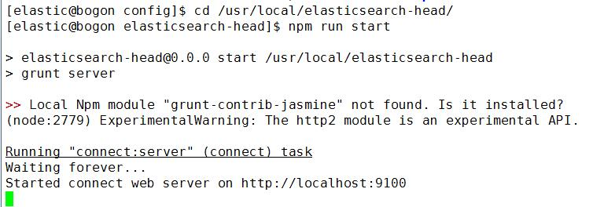  

说明启动成功，然后浏览器 执行 <http://192.168.46.136:9100/>

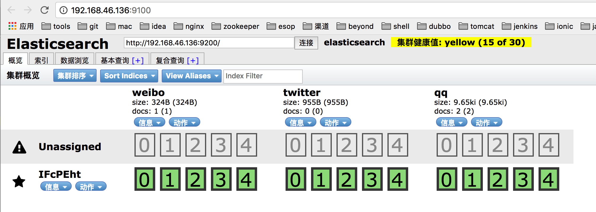  

内部输入 <http://192.168.46.136:9200/> 点击连接 如果右侧输出黄色背景字体 说明配置完整OK；

后面我们讲解具体怎么用。

### 4.2 elasticsearch-head插件添加索引

前面我们使用了java在elasticsearch添加索引，进行了数据的增删查改，这里我们使用elasticsearch-head插件进行对应的操作。

elasticsearch提供了丰富的http url接口对外提供服务，这也使得elasticsearch插件特别多，功能也强大。

#### 1. 创建索引方式1

我们今天来讲下 用head插件来添加索引，这里有好几种方式，先讲一种原始的。

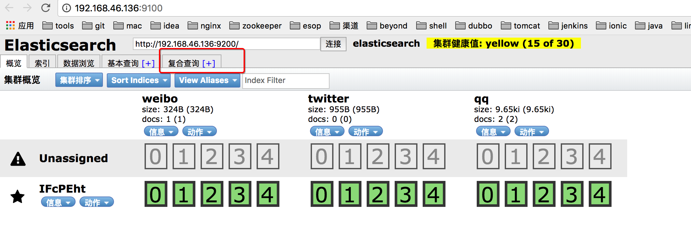  

进入主页，选择 复合查询  

我们以后执行操作 都在这里搞。

地址栏输入：<http://192.168.46.136/student/>

然后点击“提交请求”即可，右侧返回索引添加成功信息。

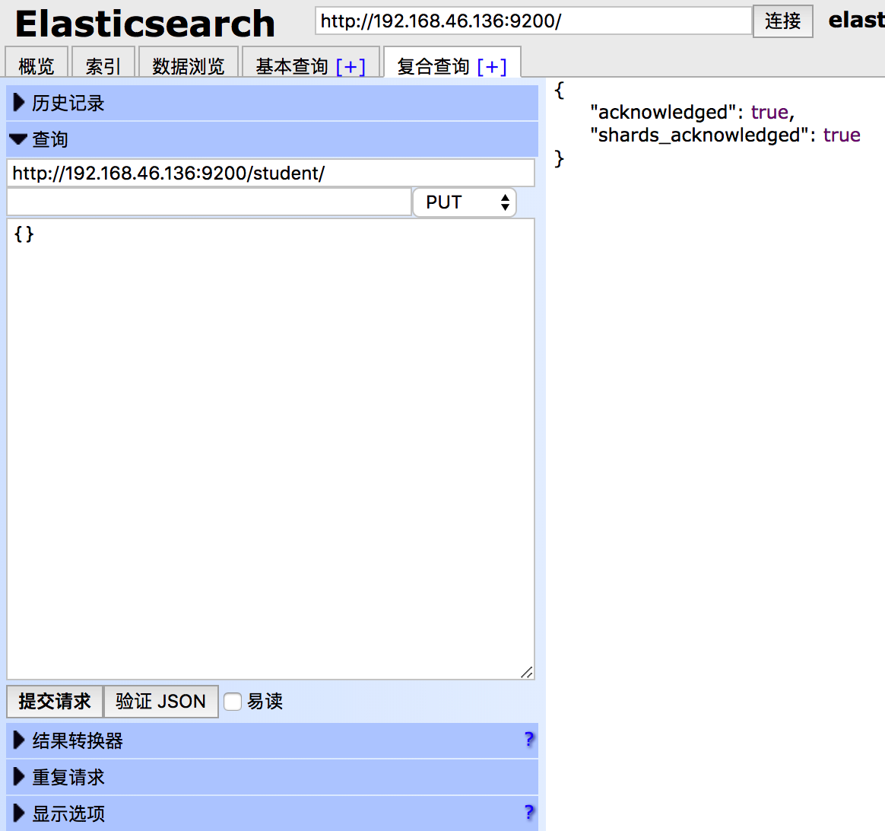  


我们返回 概要 首页 点击 刷新 也能看到新建的索引student

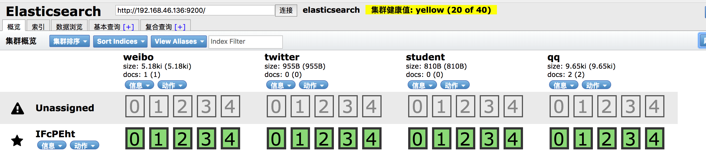  

#### 2. 索引创建方式2

下边这种方式创建索引更加简单。

点击 索引标签，点击“新建索引”。

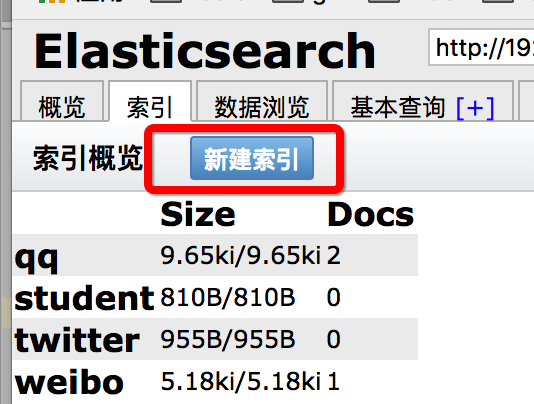  


这里我们输入索引名称即可 当然默认分片数是5 副本数是1 我们输入索引名称student2 分片数10 副本2

  

注意：假如单个机器部署的话副本是没地方分配的，一般集群都是2台或者2台以上机器集群，副本都不存对应的分片机器上的，这样能保证集群系统的可靠性。

我们点击"OK" 即可轻松建立索引 以及分片数和副本。


回到概要首页，这里可以清晰的看到索引以及分片和副本。

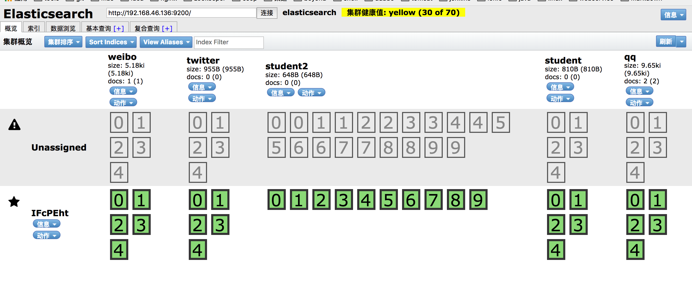 

当然要删除索引的话，点动作然后删除即可，比较简单。


### 4.3 elasticsearch-head插件添加，修改，删除文档

elasticsearch-head插件添加，修改，删除文档，我们用head插件来实现下添加，修改，删除文档操作。

#### 1. 添加或修改文档

首先是添加文档，这里我们给student索引添加文档

先进入复合查询

**post方式** http://192.168.46.136:9200/student/first/12/

这里student是索引 first是类别 12是id

假如id没写的话 系统也会给我们自动生成一个

假如id本身已经存在 那就变成了修改操作；我们一般都要指定下id。

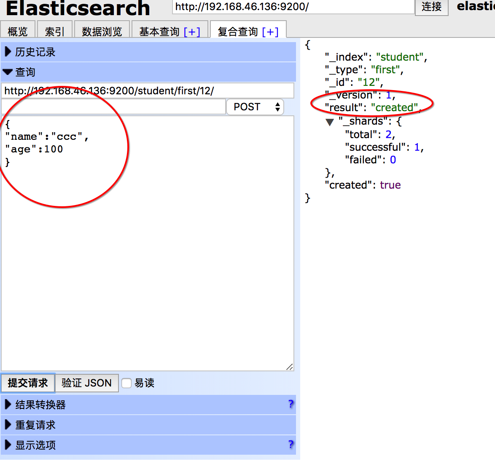  

我们发现提示创建成功，数据浏览里。

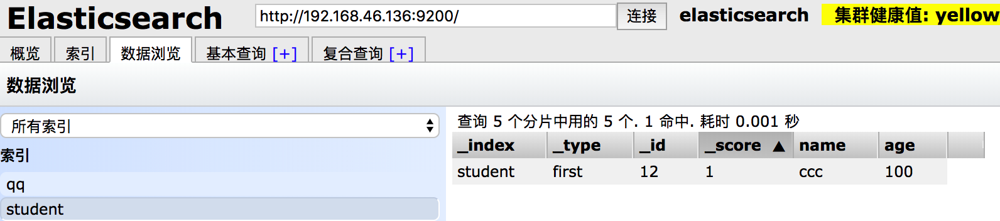  


#### 2. 获取文档

查询文档也有可以通过请求

http://192.168.46.136:9200/student/first/12/  **选择get方式**，然后点击提交

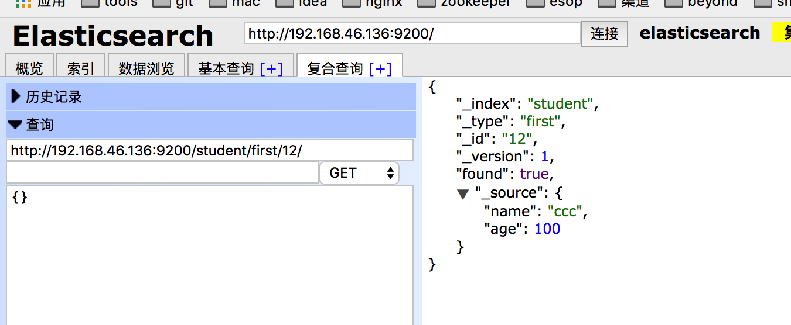


#### 3. 删除文档

选delete即可  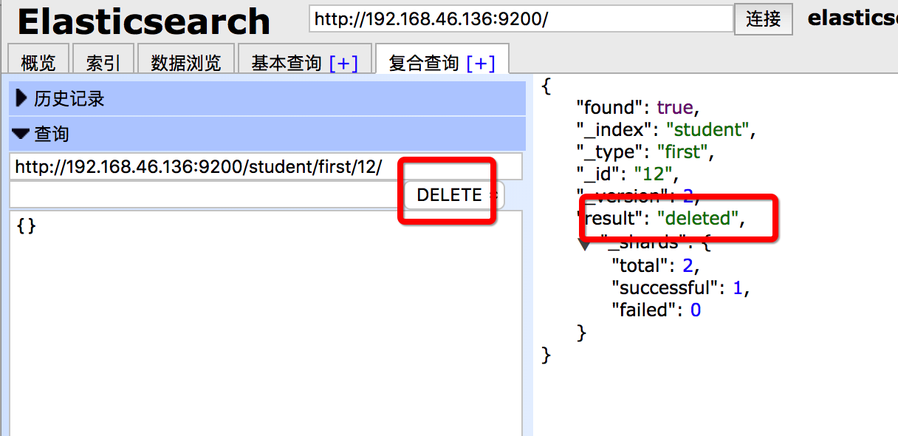  


### 4.4 elasticsearch-head删除索引

前面我们讲过删除索引的图形操作方式；

用http url命令也可以

输入：<http://192.168.46.136:9200/student/>

选择delete即可

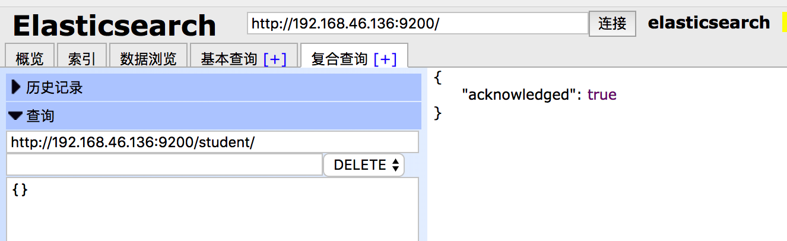  


### 4.5 elasticsearch-head索引打开和关闭

打开/关闭索引接口允许关闭一个打开的索引或者打开一个已经关闭的索引。

关闭的索引只能显示索引元数据信息，不能够进行读写操作。

比如我们新建一个索引student2

#### 1. 关闭索引

我们用 **POST** <http://192.168.46.136:9200/student2/_close/>  关闭索引

点击提交请求。

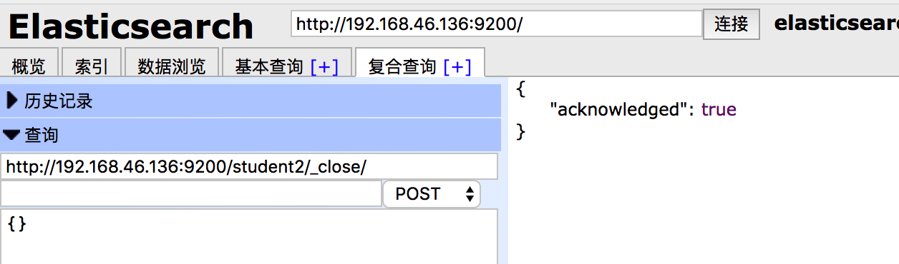  

再概要首页里，可以刷新下 看到student2被关闭，变成了灰色。

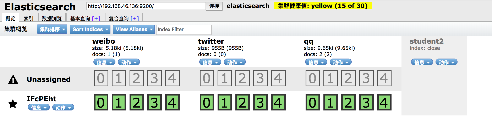    

#### 2. 打开索引

POST <http://192.168.1.110:9200/student2/_open/> 打开索引。

点击提交请求，回到概要首页，点击刷新。

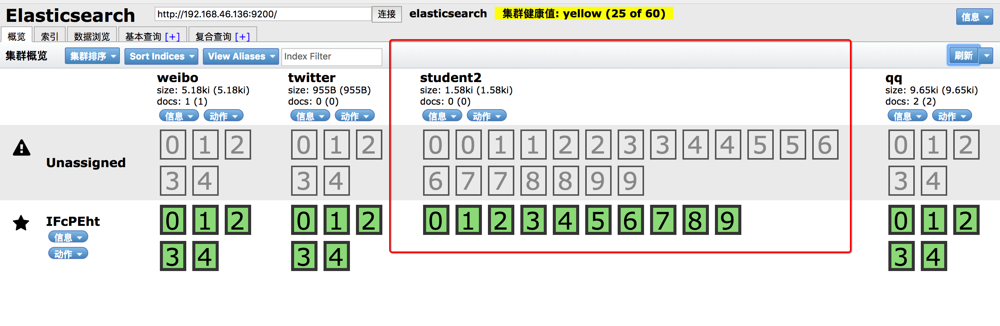  


### 4.5 elasticsearch-head索引映射

#### 1. 添加索引映射

可以参考：https://blog.csdn.net/napoay/article/details/52012249

elasticsearch HTTP API 允许你向索引(index)添加文档类型(type)，或者向文档类型(type)中添加字段(field)。

mapping是es实例用来在index的时候，作为各个字段的操作依据。比如，name，这个字段是否要索引、是否要存储、长度大小等等。虽然elasticsearch可以动态的处理这些，但是出于管理和运维的目的还是建议建立对应的索引映射，这个映射可以保存在文件里，以便将来重建索引用。

PUT http://192.168.46.136:9200/student/

注意：下边是创建索引并添加映射关系，添加新的student索引之前删除之前建的student索引。

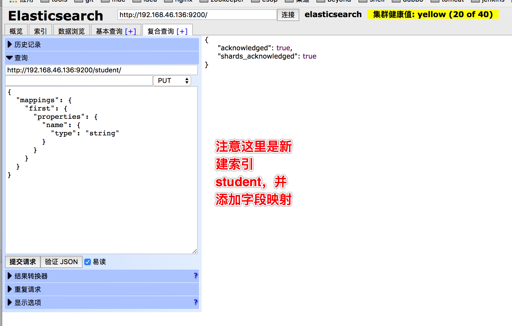  


这是一个最简单的mappings，定义了索引名称为student，类型为first的mapping。各个字段分别是一个json对象，里面有类型有索引是否需要。

#### 2. 查询索引映射

方式1：

<http://192.168.46.136:9200/student/>  GET  直接加索引名称即可 能查到所有信息

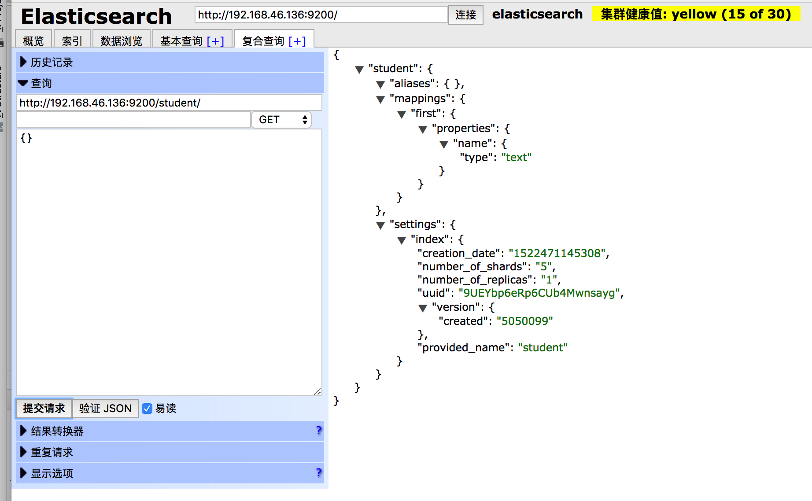  

方式2：

利用head插件图形工具，查看索引信息，进入概要首页，选择索引，然后索引信息，直接显示索引的映射状态信息。

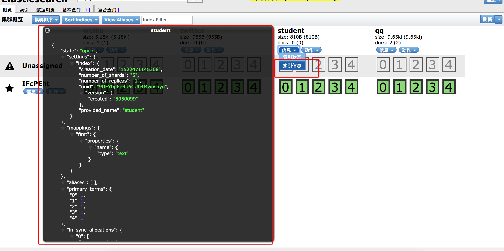  


## 五、elasticsearch-.yml 中文配置详解

```shell
# ======================== Elasticsearch Configuration =========================
#
# NOTE: Elasticsearch comes with reasonable defaults for most settings.
# Before you set out to tweak and tune the configuration, make sure you
# understand what are you trying to accomplish and the consequences.
#
# The primary way of configuring a node is via this file. This template lists
# the most important settings you may want to configure for a production cluster.
#
# Please see the documentation for further information on configuration options:
# <http://www.elastic.co/guide/en/elasticsearch/reference/current/setup-configuration.html>
#
# ---------------------------------- Cluster -----------------------------------
#
# Use a descriptive name for your cluster:
# 集群名称，默认是elasticsearch
# cluster.name: my-application
#
# ------------------------------------ Node ------------------------------------
#
# Use a descriptive name for the node:
# 节点名称，默认从elasticsearch-2.4.3/lib/elasticsearch-2.4.3.jar!config/names.txt中随机选择一个名称
# node.name: node-1
#
# Add custom attributes to the node:
# 
# node.rack: r1
#
# ----------------------------------- Paths ------------------------------------
#
# Path to directory where to store the data (separate multiple locations by comma):
# 可以指定es的数据存储目录，默认存储在es_home/data目录下
# path.data: /path/to/data
#
# Path to log files:
# 可以指定es的日志存储目录，默认存储在es_home/logs目录下
# path.logs: /path/to/logs
#
# ----------------------------------- Memory -----------------------------------
#
# Lock the memory on startup:
# 锁定物理内存地址，防止elasticsearch内存被交换出去,也就是避免es使用swap交换分区
# bootstrap.memory_lock: true
#
#
#
# 确保ES_HEAP_SIZE参数设置为系统可用内存的一半左右
# Make sure that the `ES_HEAP_SIZE` environment variable is set to about half the memory
# available on the system and that the owner of the process is allowed to use this limit.
# 
# 当系统进行内存交换的时候，es的性能很差
# Elasticsearch performs poorly when the system is swapping the memory.
#
# ---------------------------------- Network -----------------------------------
#
#
# 为es设置ip绑定，默认是127.0.0.1，也就是默认只能通过127.0.0.1 或者localhost才能访问
# es1.x版本默认绑定的是0.0.0.0 所以不需要配置，但是es2.x版本默认绑定的是127.0.0.1，需要配置
# Set the bind address to a specific IP (IPv4 or IPv6):
#
# network.host: 192.168.46.136
#
#
# 为es设置自定义端口，默认是9200
# 注意：在同一个服务器中启动多个es节点的话，默认监听的端口号会自动加1：例如：9200，9201，9202...
# Set a custom port for HTTP:
#
# http.port: 9200
#
# For more information, see the documentation at:
# <http://www.elastic.co/guide/en/elasticsearch/reference/current/modules-network.html>
#
# --------------------------------- Discovery ----------------------------------
#
# 当启动新节点时，通过这个ip列表进行节点发现，组建集群
# 默认节点列表：
# 127.0.0.1，表示ipv4的回环地址。
#	[::1]，表示ipv6的回环地址
#
# 在es1.x中默认使用的是组播(multicast)协议，默认会自动发现同一网段的es节点组建集群，
# 在es2.x中默认使用的是单播(unicast)协议，想要组建集群的话就需要在这指定要发现的节点信息了。
# 注意：如果是发现其他服务器中的es服务，可以不指定端口[默认9300]，如果是发现同一个服务器中的es服务，就需要指定端口了。
# Pass an initial list of hosts to perform discovery when new node is started:
# 
# The default list of hosts is ["127.0.0.1", "[::1]"]
#
# discovery.zen.ping.unicast.hosts: ["host1", "host2"]
#
#
#
#
# 通过配置这个参数来防止集群脑裂现象 (集群总节点数量/2)+1
# Prevent the "split brain" by configuring the majority of nodes (total number of nodes / 2 + 1):
#
# discovery.zen.minimum_master_nodes: 3
#
# For more information, see the documentation at:
# <http://www.elastic.co/guide/en/elasticsearch/reference/current/modules-discovery.html>
#
# ---------------------------------- Gateway -----------------------------------
#
# Block initial recovery after a full cluster restart until N nodes are started:
# 一个集群中的N个节点启动后,才允许进行数据恢复处理，默认是1
# gateway.recover_after_nodes: 3
#
# For more information, see the documentation at:
# <http://www.elastic.co/guide/en/elasticsearch/reference/current/modules-gateway.html>
#
# ---------------------------------- Various -----------------------------------
# 在一台服务器上禁止启动多个es服务
# Disable starting multiple nodes on a single system:
#
# node.max_local_storage_nodes: 1
#
# 设置是否可以通过正则或者_all删除或者关闭索引库，默认true表示必须需要显式指定索引库名称
# 生产环境建议设置为true，删除索引库的时候必须显式指定，否则可能会误删索引库中的索引库。
# Require explicit names when deleting indices:
#
# action.destructive_requires_name: true
```

下边是简介版本elasticsearch-.yml：

```shell
# 集群的名字  
cluster.name: my-application
# 节点名字  
node.name: node-1   
# 数据存储目录（多个路径用逗号分隔）  
path.data: /home/wjy/es/data  
# 日志目录  
path.logs: /home/wjy/es/logs  
#本机的ip地址
network.host: 192.168.46.136  
#设置集群中master节点的初始列表，可以通过这些节点来自动发现新加入集群的节点
discovery.zen.ping.unicast.hosts: ["192.168.46.136"]
# 设置节点间交互的tcp端口（集群）,(默认9300)  
transport.tcp.port: 9300  
# 监听端口（默认）  
http.port: 9200  
# 增加参数，使head插件可以访问es  
http.cors.enabled: true  
http.cors.allow-origin: "*"
```


## 六、elasticsearch5.5多机集群配置

ELasticsearch 5.5要求JDK版本最低为1.8

**配置集群之前  先把要加群集群的节点的里的data目录下的Node目录 删除，否则集群建立会失败。**

我这边虚拟机配置了两台centos IP分别是 192.168.1.110 和 192.168.1.111，分别配置下elasticsearch.yml配置文件。

110机器：

```shell
# 集群的名字 
cluster.name: my-application
# 节点名字  
node.name: node-1
#本机的ip地址
network.host: 192.168.1.110
# 监听端口（默认） 
http.port: 9200
#设置集群中master节点的初始列表，可以通过这些节点来自动发现新加入集群的节点-master节点ip
discovery.zen.ping.unicast.hosts: ["192.168.1.110"]
# 增加参数，使head插件可以访问es 
http.cors.enabled: true
http.cors.allow-origin: "*"
```

111机器：

```shell
# 集群的名字 
cluster.name: my-application
# 节点名字  
node.name: node-2
#本机的ip地址
network.host: 192.168.1.111
# 监听端口（默认） 
http.port: 9200
#设置集群中master节点的初始列表，可以通过这些节点来自动发现新加入集群的节点-master节点ip
discovery.zen.ping.unicast.hosts: ["192.168.1.110"]
```

这里两台机器的cluster.name必须一致 这样才算一个集群

node.name节点名称每台取不同的名称，用来表示不同的集群节点

network.host配置成自己的局域网IP

http.port端口就固定9200

discovery.zen.ping.unicast.hosts主动发现节点我们都配置成110节点IP

配置完后 重启es服务。


然后head插件我们查看下：

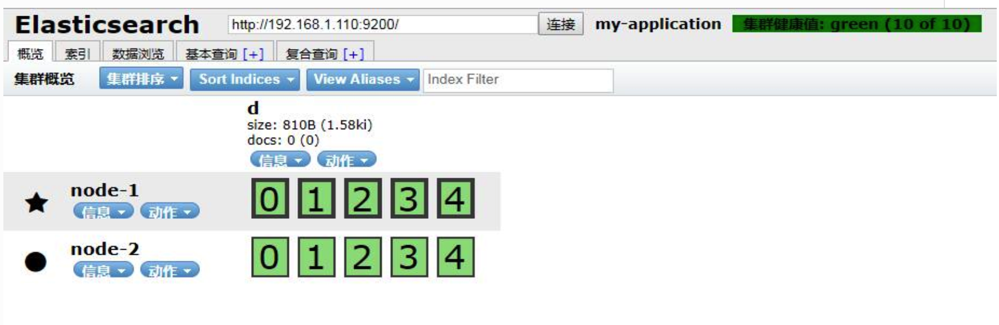      

说明集群配置OK 。


## 七、elasticsearch查询

### 7.1 索引映射文档数据准备

elasticsearch查询篇索引映射文档数据准备，我们后面要讲elasticsearch查询，先来准备下索引，映射以及文档。

我们先用Head插件建立索引film

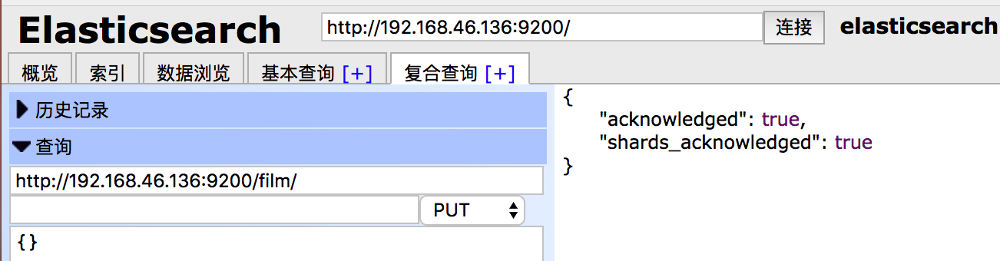  

然后建立映射。

POST : http://192.168.46.136:9200/film/_mapping/dongzuo/

```json
{
    "properties":
    {
        "director":
        {
            "type": "keyword"
        },
        "price":
        {
            "type": "float"
        },
        "publishDate":
        {
            "type": "date"
        },
        "title":
        {
            "type": "text"
        },
        "content":
        {
            "type": "text"
        }
    }
}
```

title 电影名称 publishDate 发布日期 content 简介 director导演 price 票价

数据准备：

```java
/**
     * 在elasticsearch-head创建了film索引并添加mapping映射，这里插入文档数据
     * @throws Exception
     */
    @Test
    public void testIndex5() throws Exception{
        JSONArray jsonArray=new JSONArray();

        JSONObject jsonObject=new JSONObject();
        jsonObject.put("title", "前任3：再见前任");
        jsonObject.put("publishDate", "2017-12-29");
        jsonObject.put("content", "一对好基友孟云（韩庚 饰）和余飞（郑恺 饰）跟女友都因为一点小事宣告分手，并且“拒绝挽回，死不认错”。两人在夜店、派对与交友软件上放飞人生第二春，大肆庆祝“黄金单身期”，从而引发了一系列好笑的故事。孟云与女友同甘共苦却难逃“五年之痒”，余飞与女友则棋逢敌手相爱相杀无绝期。然而现实的“打脸”却来得猝不及防：一对推拉纠结零往来，一对纠缠互怼全交代。两对恋人都将面对最终的选择：是再次相见？还是再也不见？");
        jsonObject.put("director", "田羽生");
        jsonObject.put("price", "35");
        jsonArray.add(jsonObject);


        JSONObject jsonObject2=new JSONObject();
        jsonObject2.put("title", "机器之血");
        jsonObject2.put("publishDate", "2017-12-29");
        jsonObject2.put("content", "2007年，Dr.James在半岛军火商的支持下研究生化人。研究过程中，生化人安德烈发生基因突变大开杀戒，将半岛军火商杀害，并控制其组织，接管生化人的研究。Dr.James侥幸逃生，只好寻求警方的保护。特工林东（成龙 饰）不得以离开生命垂危的小女儿西西，接受证人保护任务...十三年后，一本科幻小说《机器之血》的出版引出了黑衣生化人组织，神秘骇客李森（罗志祥 饰）（被杀害的半岛军火商的儿子），以及隐姓埋名的林东，三股力量都开始接近一个“普通”女孩Nancy（欧阳娜娜 饰）的生活，想要得到她身上的秘密。而黑衣人幕后受伤隐藏多年的安德烈也再次出手，在多次缠斗之后终于抓走Nancy。林东和李森，不得不以身犯险一同前去解救，关键时刻却发现李森竟然是被杀害的半岛军火商的儿子，生化人的实验记录也落入了李森之手......");
        jsonObject2.put("director", "张立嘉");
        jsonObject2.put("price", "45");
        jsonArray.add(jsonObject2);

        JSONObject jsonObject3=new JSONObject();
        jsonObject3.put("title", "星球大战8：最后的绝地武士");
        jsonObject3.put("publishDate", "2018-01-05");
        jsonObject3.put("content", "《星球大战：最后的绝地武士》承接前作《星球大战：原力觉醒》的剧情，讲述第一军团全面侵袭之下，蕾伊（黛西·雷德利 Daisy Ridley 饰）、芬恩（约翰·博耶加 John Boyega 饰）、波·达默龙（奥斯卡·伊萨克 Oscar Isaac 饰）三位年轻主角各自的抉 择和冒险故事。前作中觉醒强大原力的蕾伊独自寻访隐居的绝地大师卢克·天行者（马克·哈米尔 Mark Hamill 饰），在后者的指导下接受原力训练。芬恩接受了一项几乎不可能完成的任务，为此他不得不勇闯敌营，面对自己的过去。波·达默龙则要适应从战士向领袖的角色转换，这一过程中他也将接受一些血的教训。");
        jsonObject3.put("director", "莱恩·约翰逊");
        jsonObject3.put("price", "55");
        jsonArray.add(jsonObject3);

        JSONObject jsonObject4=new JSONObject();
        jsonObject4.put("title", "羞羞的铁拳");
        jsonObject4.put("publishDate", "2017-12-29");
        jsonObject4.put("content", "靠打假拳混日子的艾迪生（艾伦 饰），本来和正义感十足的体育记者马小（马丽 饰）是一对冤家，没想到因为一场意外的电击，男女身体互换。性别错乱后，两人互坑互害，引发了拳坛的大地震，也揭开了假拳界的秘密，惹来一堆麻烦，最终两人在“卷莲门”副掌门张茱萸（沈腾 饰）的指点下，向恶势力挥起了羞羞的铁拳。");
        jsonObject4.put("director", "宋阳 / 张吃鱼");
        jsonObject4.put("price", "35");
        jsonArray.add(jsonObject4);

        JSONObject jsonObject5=new JSONObject();
        jsonObject5.put("title", "战狼2");
        jsonObject5.put("publishDate", "2017-07-27");
        jsonObject5.put("content", "故事发生在非洲附近的大海上，主人公冷锋（吴京 饰）遭遇人生滑铁卢，被“开除军籍”，本想漂泊一生的他，正当他打算这么做的时候，一场突如其来的意外打破了他的计划，突然被卷入了一场非洲国家叛乱，本可以安全撤离，却因无法忘记曾经为军人的使命，孤身犯险冲回沦陷区，带领身陷屠杀中的同胞和难民，展开生死逃亡。随着斗争的持续，体内的狼性逐渐复苏，最终孤身闯入战乱区域，为同胞而战斗。");
        jsonObject5.put("director", "吴京");
        jsonObject5.put("price", "38");
        jsonArray.add(jsonObject5);

        for(int i=0;i<jsonArray.size();i++){
            JSONObject jo= (JSONObject) jsonArray.get(i);
            IndexResponse response=client.prepareIndex("film", "dongzuo")
                    .setSource(jo.toString(), XContentType.JSON).get();
            System.out.println("索引名称："+response.getIndex());
            System.out.println("类型："+response.getType());
            System.out.println("文档ID："+response.getId());
            System.out.println("当前实例状态："+response.status());
        }
    }
```


执行完 ，head插件里 刷新看下：

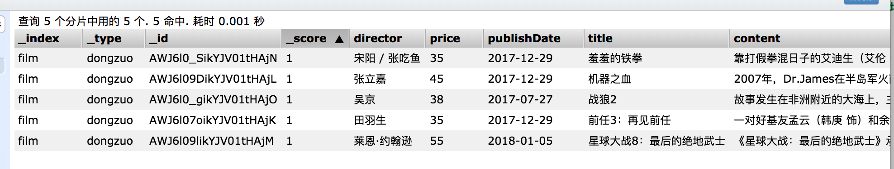  


### 7.2 elasticsearch查询所有数据restful api以及java代码实现


1. restful api实现如下

get  http://192.168.46.136:9200/film/dongzuo/_search/，返回所有数据

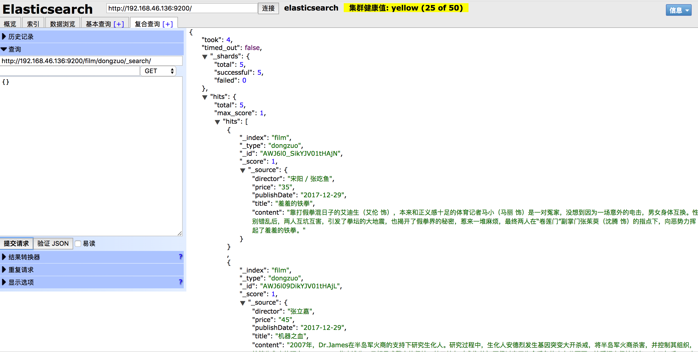  


2. java代码实现

```java
 	/**
     * 查询所有所用film 数据
     * @throws Exception
     */
    @Test
    public void searchAll()throws Exception{
        SearchRequestBuilder srb=client.prepareSearch("film").setTypes("dongzuo");
        SearchResponse sr=srb.setQuery(QueryBuilders.matchAllQuery()).execute().actionGet(); // 查询所有
        SearchHits hits=sr.getHits();
        for(SearchHit hit:hits){
            System.out.println(hit.getSourceAsString());
        }
    }
```


运行结果：

```text
{"director":"宋阳 / 张吃鱼","price":"35","publishDate":"2017-12-29","title":"羞羞的铁拳","content":"靠打假拳混日子的艾迪生（艾伦 饰），本来和正义感十足的体育记者马小（马丽 饰）是一对冤家，没想到因为一场意外的电击，男女身体互换。性别错乱后，两人互坑互害，引发了拳坛的大地震，也揭开了假拳界的秘密，惹来一堆麻烦，最终两人在“卷莲门”副掌门张茱萸（沈腾 饰）的指点下，向恶势力挥起了羞羞的铁拳。"}
{"director":"张立嘉","price":"45","publishDate":"2017-12-29","title":"机器之血","content":"2007年，Dr.James在半岛军火商的支持下研究生化人。研究过程中，生化人安德烈发生基因突变大开杀戒，将半岛军火商杀害，并控制其组织，接管生化人的研究。Dr.James侥幸逃生，只好寻求警方的保护。特工林东（成龙 饰）不得以离开生命垂危的小女儿西西，接受证人保护任务...十三年后，一本科幻小说《机器之血》的出版引出了黑衣生化人组织，神秘骇客李森（罗志祥 饰）（被杀害的半岛军火商的儿子），以及隐姓埋名的林东，三股力量都开始接近一个“普通”女孩Nancy（欧阳娜娜 饰）的生活，想要得到她身上的秘密。而黑衣人幕后受伤隐藏多年的安德烈也再次出手，在多次缠斗之后终于抓走Nancy。林东和李森，不得不以身犯险一同前去解救，关键时刻却发现李森竟然是被杀害的半岛军火商的儿子，生化人的实验记录也落入了李森之手......"}
{"director":"吴京","price":"38","publishDate":"2017-07-27","title":"战狼2","content":"故事发生在非洲附近的大海上，主人公冷锋（吴京 饰）遭遇人生滑铁卢，被“开除军籍”，本想漂泊一生的他，正当他打算这么做的时候，一场突如其来的意外打破了他的计划，突然被卷入了一场非洲国家叛乱，本可以安全撤离，却因无法忘记曾经为军人的使命，孤身犯险冲回沦陷区，带领身陷屠杀中的同胞和难民，展开生死逃亡。随着斗争的持续，体内的狼性逐渐复苏，最终孤身闯入战乱区域，为同胞而战斗。"}
{"director":"田羽生","price":"35","publishDate":"2017-12-29","title":"前任3：再见前任","content":"一对好基友孟云（韩庚 饰）和余飞（郑恺 饰）跟女友都因为一点小事宣告分手，并且“拒绝挽回，死不认错”。两人在夜店、派对与交友软件上放飞人生第二春，大肆庆祝“黄金单身期”，从而引发了一系列好笑的故事。孟云与女友同甘共苦却难逃“五年之痒”，余飞与女友则棋逢敌手相爱相杀无绝期。然而现实的“打脸”却来得猝不及防：一对推拉纠结零往来，一对纠缠互怼全交代。两对恋人都将面对最终的选择：是再次相见？还是再也不见？"}
{"director":"莱恩·约翰逊","price":"55","publishDate":"2018-01-05","title":"星球大战8：最后的绝地武士","content":"《星球大战：最后的绝地武士》承接前作《星球大战：原力觉醒》的剧情，讲述第一军团全面侵袭之下，蕾伊（黛西·雷德利 Daisy Ridley 饰）、芬恩（约翰·博耶加 John Boyega 饰）、波·达默龙（奥斯卡·伊萨克 Oscar Isaac 饰）三位年轻主角各自的抉 择和冒险故事。前作中觉醒强大原力的蕾伊独自寻访隐居的绝地大师卢克·天行者（马克·哈米尔 Mark Hamill 饰），在后者的指导下接受原力训练。芬恩接受了一项几乎不可能完成的任务，为此他不得不勇闯敌营，面对自己的过去。波·达默龙则要适应从战士向领袖的角色转换，这一过程中他也将接受一些血的教训。"}
```


### 7.3 elasticsearch分页查询数据restful api以及java代码实现

elasticsearch分页查询数据restful api以及java代码实现

1. restful api实现如下，返回2条数据：

POST <http://192.168.46.136:9200/film/dongzuo/_search/>

```json
{
  "from": 0,
  "size": 2
}
```


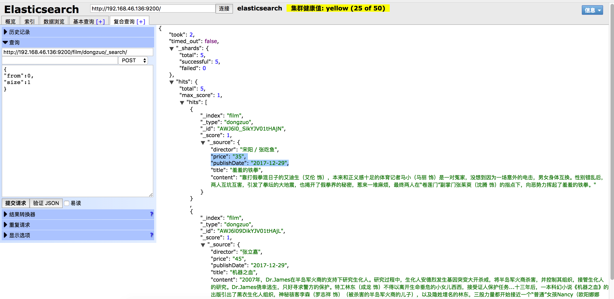  


2. java代码实现如下

```java
    /**
     * 分页查询
     * @throws Exception
     */
    @Test
    public void searchPaging()throws Exception{
        SearchRequestBuilder srb=client.prepareSearch("film").setTypes("dongzuo");
        SearchResponse sr=srb.setQuery(QueryBuilders.matchAllQuery()).setFrom(1).setSize(2).execute().actionGet(); // 查询所有
        SearchHits hits=sr.getHits();
        for(SearchHit hit:hits){
            System.out.println(hit.getSourceAsString());
        }
    }
```

运行结果：

```text
{"director":"张立嘉","price":"45","publishDate":"2017-12-29","title":"机器之血","content":"2007年，Dr.James在半岛军火商的支持下研究生化人。研究过程中，生化人安德烈发生基因突变大开杀戒，将半岛军火商杀害，并控制其组织，接管生化人的研究。Dr.James侥幸逃生，只好寻求警方的保护。特工林东（成龙 饰）不得以离开生命垂危的小女儿西西，接受证人保护任务...十三年后，一本科幻小说《机器之血》的出版引出了黑衣生化人组织，神秘骇客李森（罗志祥 饰）（被杀害的半岛军火商的儿子），以及隐姓埋名的林东，三股力量都开始接近一个“普通”女孩Nancy（欧阳娜娜 饰）的生活，想要得到她身上的秘密。而黑衣人幕后受伤隐藏多年的安德烈也再次出手，在多次缠斗之后终于抓走Nancy。林东和李森，不得不以身犯险一同前去解救，关键时刻却发现李森竟然是被杀害的半岛军火商的儿子，生化人的实验记录也落入了李森之手......"}
{"director":"吴京","price":"38","publishDate":"2017-07-27","title":"战狼2","content":"故事发生在非洲附近的大海上，主人公冷锋（吴京 饰）遭遇人生滑铁卢，被“开除军籍”，本想漂泊一生的他，正当他打算这么做的时候，一场突如其来的意外打破了他的计划，突然被卷入了一场非洲国家叛乱，本可以安全撤离，却因无法忘记曾经为军人的使命，孤身犯险冲回沦陷区，带领身陷屠杀中的同胞和难民，展开生死逃亡。随着斗争的持续，体内的狼性逐渐复苏，最终孤身闯入战乱区域，为同胞而战斗。"}
```

### 7.4 elasticsearch排序查询数据restful api以及java代码实现

elasticsearch排序查询数据restful api以及java代码实现

1. restful api实现如下，根据发布日期降序排列。

post:<http://192.168.46.136:9200/film/dongzuo/_search/>

```json
{
  "sort": [
    {
      "publishDate": {
        "order": "desc"
      }
    }
  ]
}
```

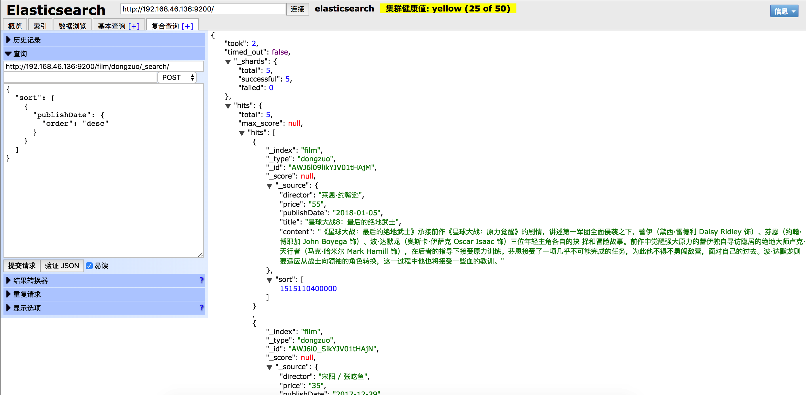  


2. Java代码实现

```java
    /**
     * 排序查询
     * @throws Exception
     */
    @Test
    public void searchOrderBy()throws Exception{
        SearchRequestBuilder srb=client.prepareSearch("film").setTypes("dongzuo");
        SearchResponse sr=srb.setQuery(QueryBuilders.matchAllQuery())
                .addSort("publishDate", SortOrder.DESC)
                .execute()
                .actionGet(); // 分页排序所有
        SearchHits hits=sr.getHits();
        for(SearchHit hit:hits){
            System.out.println(hit.getSourceAsString());
        }
    }
```
运行结果：
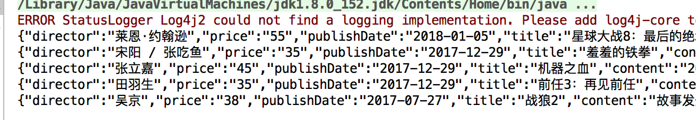

  ### 7.5 elasticsearch数据列过滤restful api以及java代码实现

1. restful api实现：

POST <http://192.168.46.136:9200/film/dongzuo/_search/>

```json
{
  "from": 0,
  "size": 2,
  "_source":{
    "include":["title","price"]
  }
}
```
只返回了需要的数据列  
  


2. Java代码实现

```java
    /**
     * 数据列过滤，相当于只需要返回对应的结果列
     * @throws Exception
     */
    @Test
    public void searchInclude()throws Exception{
        SearchRequestBuilder srb=client.prepareSearch("film").setTypes("dongzuo");
        SearchResponse sr=srb.setQuery(QueryBuilders.matchAllQuery())
                .setFetchSource(new String[]{"title","price"}, null)
                .execute()
                .actionGet(); // 分页排序所有
        SearchHits hits=sr.getHits();
        for(SearchHit hit:hits){
            System.out.println(hit.getSourceAsString());
        }
    }
```

运行结果：

```Text
{"price":"35","title":"羞羞的铁拳"}
{"price":"45","title":"机器之血"}
{"price":"38","title":"战狼2"}
{"price":"35","title":"前任3：再见前任"}
{"price":"55","title":"星球大战8：最后的绝地武士"}
```

### 7.6 elasticsearch简单条件查询restful api以及java代码实现

1. estful api实现：

post <http://192.168.46.136:9200/film/dongzuo/_search/>

```json
{
  "query":{
     "match":{"title":"战"}
  }
}
```

返回tile中包含"战"的数据

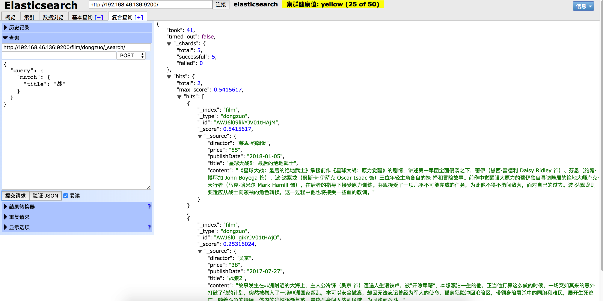  


2. java代码实现

```java
 /**
     * 简单条件查询
     * @throws Exception
     */
    @Test
    public void searchByCondition()throws Exception{
        SearchRequestBuilder srb=client.prepareSearch("film").setTypes("dongzuo");
        SearchResponse sr=srb.setQuery(QueryBuilders.matchQuery("title", "战"))
                .setFetchSource(new String[]{"title","price"}, null)
                .execute()
                .actionGet(); // 分页排序所有
        SearchHits hits=sr.getHits();
        for(SearchHit hit:hits){
            System.out.println(hit.getSourceAsString());
        }
    }
```

查询结果：

```text
{"price":"55","title":"星球大战8：最后的绝地武士"}
{"price":"38","title":"战狼2"}
```

### 7.7 elasticsearch条件查询高亮实现restful api以及java代码实现

1. restful api实现

post <http://192.168.46.136:9200/film/dongzuo/_search/>

```json
{
  "query":{
     "match":{"title":"战"}
  },
  "_source":{
    "include":["title","price"]
  },
  "highlight":{
      "fields":{"title":{}}
   }
}
```

结果显示title字段高亮显示了

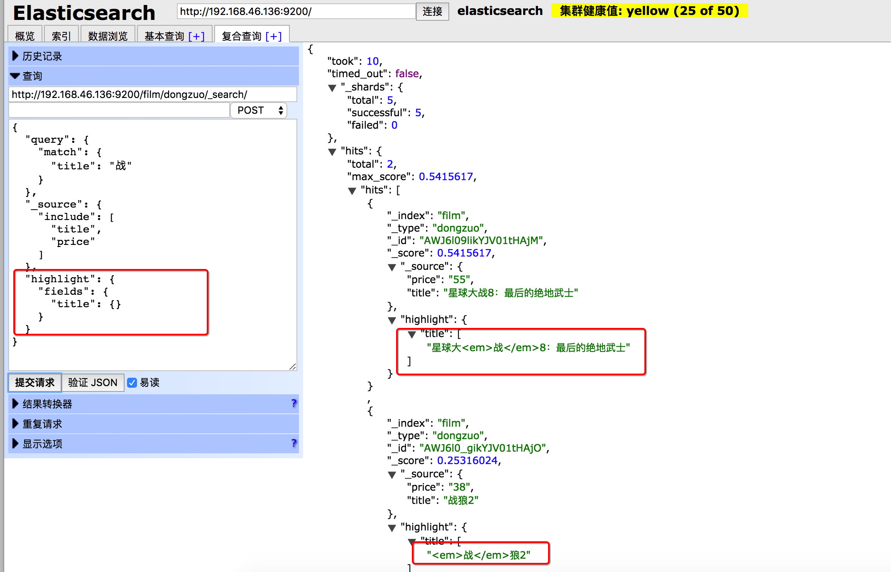  


2. java代码实现

```java
    /**
     * 条件查询高亮实现,使用指定的标识符号对返回结果进行高亮
     * @throws Exception
     */
    @Test
    public void searchHighlight()throws Exception{
        SearchRequestBuilder srb=client.prepareSearch("film").setTypes("dongzuo");
        HighlightBuilder highlightBuilder=new HighlightBuilder();
        highlightBuilder.preTags("<h2>");
        highlightBuilder.postTags("</h2>");
        highlightBuilder.field("title");
        SearchResponse sr=srb.setQuery(QueryBuilders.matchQuery("title", "战"))
                .highlighter(highlightBuilder)
                .setFetchSource(new String[]{"title","price"}, null)
                .execute()
                .actionGet(); // 分页排序所有
        SearchHits hits=sr.getHits();
        for(SearchHit hit:hits){
            System.out.println(hit.getSourceAsString());
            System.out.println(hit.getHighlightFields());
        }
    }
```

返回结果：

```text
{"price":"55","title":"星球大战8：最后的绝地武士"}
{title=[title], fragments[[星球大<h2>战</h2>8：最后的绝地武士]]}
{"price":"38","title":"战狼2"}
{title=[title], fragments[[<h2>战</h2>狼2]]}
```

### 7.8 elasticsearch组合多条件查询实现restful api以及java代码实现

实际开发中，基本都是组合多条件查询，elasticsearch提供bool来实现这种需求。

主要参数：

- must ：文档**必须匹配**这些条件才能被包含进来。

- must_not： 文档**必须不匹配**这些条件才能被包含进来。

- should：如果满足这些语句中的任意语句，将增加 _score ，否则，无任何影响。它们主要用于修正每个文档的相关性得分。

- filter：ES中的查询操作分为2种：查询（query）和过滤（filter）。**查询**即是之前提到的query查询，它**（查询）默认会计算每个返回文档的得分，然后根据得分排序**。而**过滤（filter）只会筛选出符合的文档，并不计算得分，且它可以缓存文档。**所以，单从性能考虑，过滤比查询更快。

  换句话说，过滤适合在大范围筛选数据，而查询则适合精确匹配数据。一般应用时，**应先使用过滤操作过滤数据，然后使用查询匹配数据。**


#### 1. must

文档**必须匹配**这些条件才能被包含进来。


1. 最简单的 模糊查询标题含有“战”，restful api实现

post:<http://192.168.1.111:9200/film/dongzuo/_search/>

```json
{
  "query": {
    "bool": {
      "must":{"match":{"title":"战"}}
    }
  }
}
```

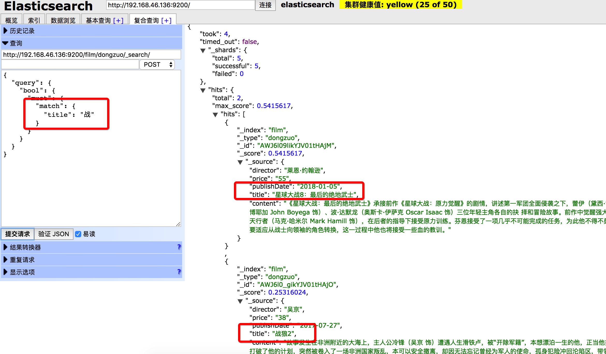  


2. 多条件查询


post:<http://192.168.1.111:9200/film/dongzuo/_search/>

```json
{
  "query": {
    "bool": {
      "must":[
		{"match":{"title":"战"}},
		{"match":{"content":"星球"}}
	  ]
    }
  }
}
```

返回结果：

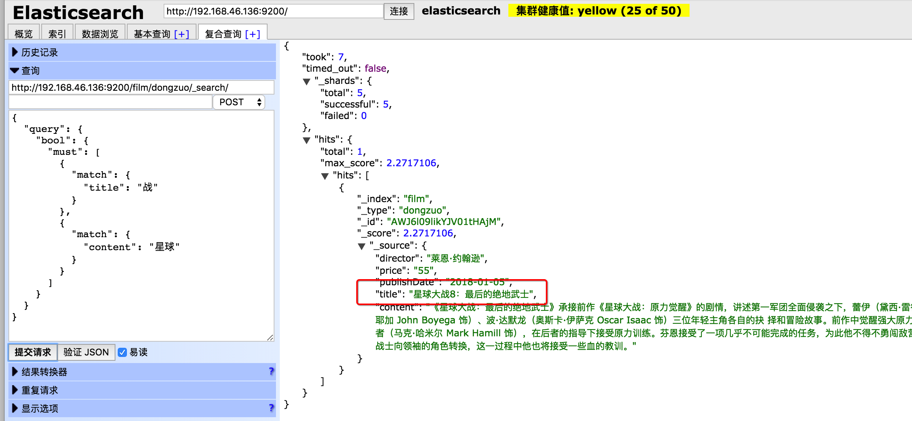  

3. java代码实现

```java
 /**
     * 多条件查询 must
     * @throws Exception
     */
    @Test
    public void searchMutil()throws Exception{
        SearchRequestBuilder srb=client.prepareSearch("film").setTypes("dongzuo");
        QueryBuilder queryBuilder=QueryBuilders.matchPhraseQuery("title", "战");
        QueryBuilder queryBuilder2=QueryBuilders.matchPhraseQuery("content", "星球");
        SearchResponse sr=srb.setQuery(QueryBuilders.boolQuery()
                .must(queryBuilder)
                .must(queryBuilder2))
                .execute()
                .actionGet();
        SearchHits hits=sr.getHits();
        for(SearchHit hit:hits){
            System.out.println(hit.getSourceAsString());
        }
    }
```

返回一条结果：

```text
{"director":"莱恩·约翰逊","price":"55","publishDate":"2018-01-05","title":"星球大战8：最后的绝地武士","content":"《星球大战：最后的绝地武士》承接前作《星球大战：原力觉醒》的剧情，讲述第一军团全面侵袭之下，蕾伊（黛西·雷德利 Daisy Ridley 饰）、芬恩（约翰·博耶加 John Boyega 饰）、波·达默龙（奥斯卡·伊萨克 Oscar Isaac 饰）三位年轻主角各自的抉 择和冒险故事。前作中觉醒强大原力的蕾伊独自寻访隐居的绝地大师卢克·天行者（马克·哈米尔 Mark Hamill 饰），在后者的指导下接受原力训练。芬恩接受了一项几乎不可能完成的任务，为此他不得不勇闯敌营，面对自己的过去。波·达默龙则要适应从战士向领袖的角色转换，这一过程中他也将接受一些血的教训。"}
```

#### 2. must_not

must_not： 文档**必须不匹配**这些条件才能被包含进来。

1. restful api 实现

内容里不含有“武士”

post:<http://192.168.1.111:9200/film/dongzuo/_search/>

```json
{
  "query": {
    "bool": {
      "must":{"match":{"title":"战"}},
      "must_not":{"match":{"content":"武士"}}
    }
  }
}
```
返回结果：  
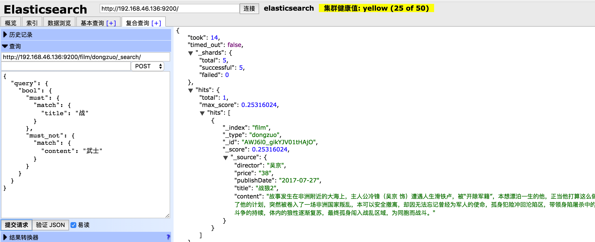  


2. java代码实现

```java
    /**
     * 多条件查询 most not
     * @throws Exception
     */
    @Test
    public void searchMutil2()throws Exception{
        SearchRequestBuilder srb=client.prepareSearch("film").setTypes("dongzuo");
        QueryBuilder queryBuilder=QueryBuilders.matchPhraseQuery("title", "战");
        QueryBuilder queryBuilder2=QueryBuilders.matchPhraseQuery("content", "武士");
        SearchResponse sr=srb.setQuery(QueryBuilders.boolQuery()
                .must(queryBuilder)
                .mustNot(queryBuilder2))
                .execute()
                .actionGet();
        SearchHits hits=sr.getHits();
        for(SearchHit hit:hits){
            System.out.println(hit.getSourceAsString());
        }
    }
```

返回结果：

```text
{"director":"吴京","price":"38","publishDate":"2017-07-27","title":"战狼2","content":"故事发生在非洲附近的大海上，主人公冷锋（吴京 饰）遭遇人生滑铁卢，被“开除军籍”，本想漂泊一生的他，正当他打算这么做的时候，一场突如其来的意外打破了他的计划，突然被卷入了一场非洲国家叛乱，本可以安全撤离，却因无法忘记曾经为军人的使命，孤身犯险冲回沦陷区，带领身陷屠杀中的同胞和难民，展开生死逃亡。随着斗争的持续，体内的狼性逐渐复苏，最终孤身闯入战乱区域，为同胞而战斗。"}
```

#### 3. should

如果满足这些语句中的任意语句，将增加 _score ，否则，无任何影响。它们主要用于修正每个文档的相关性得分

1. restful api 实现

post:http://192.168.46.136:9200/film/dongzuo/_search/

前面我们使用must,查询

```json
{
  "query": {
    "bool": {
      "must":{"match":{"title":"战"}}
    }
  }
}
```

得分情况我们看下：

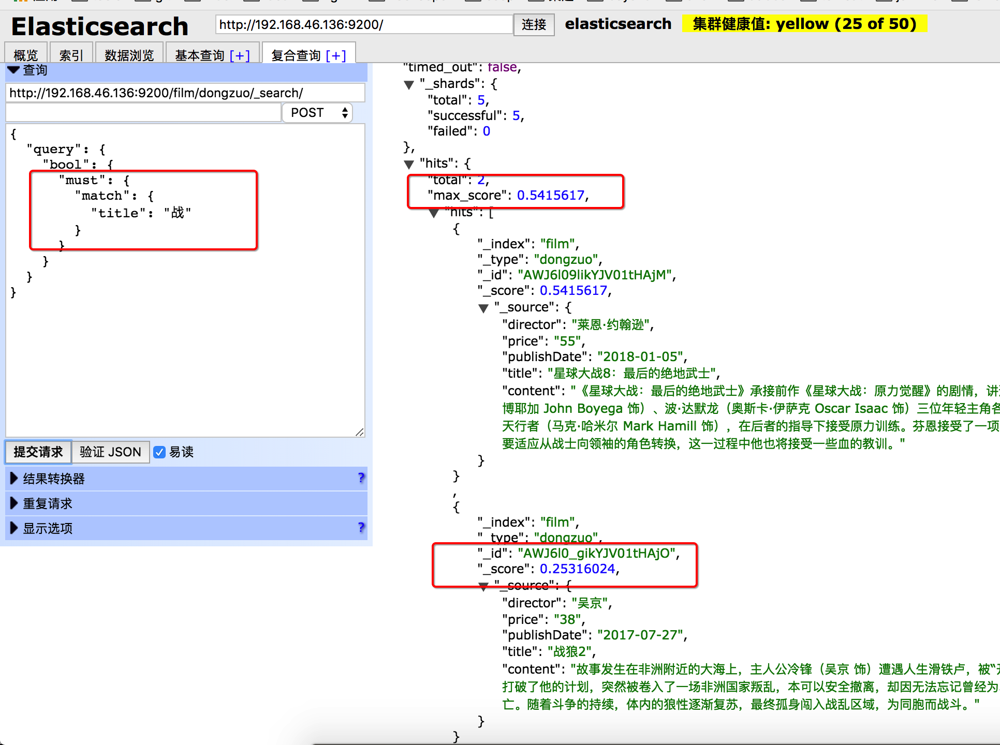  


我们加上should

post :http://192.168.46.136:9200/film/dongzuo/_search/

```json
{
  "query": {
    "bool": {
      "must":{"match":{"title":"战"}},
	  "should":[
		{"match":{"content":"星球"}},
		{"range":{"publishDate":{"gte":"2018-01-01"}}}
	  ]
    }
  }
}
```

返回结果一致，只是自己看得分_score变化了

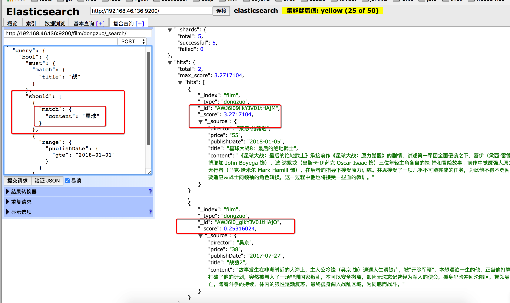  


2. java代码实现

```java
/**
     * 多条件查询 should
     * @throws Exception
     */
    @Test
    public void searchMutil3()throws Exception{
        SearchRequestBuilder srb=client.prepareSearch("film").setTypes("dongzuo");
        QueryBuilder queryBuilder=QueryBuilders.matchPhraseQuery("title", "战");
        QueryBuilder queryBuilder2=QueryBuilders.matchPhraseQuery("content", "星球");
        QueryBuilder queryBuilder3=QueryBuilders.rangeQuery("publishDate").gt("2018-01-01");
        SearchResponse sr=srb.setQuery(QueryBuilders.boolQuery()
                .must(queryBuilder)
                .should(queryBuilder2)
                .should(queryBuilder3))
                .execute()
                .actionGet();
        SearchHits hits=sr.getHits();
        for(SearchHit hit:hits){
            System.out.println(hit.getScore()+":"+hit.getSourceAsString());
        }
    }
```

#### 4. filter

ES中的查询操作分为2种：查询（query）和过滤（filter）。**查询**即是之前提到的query查询，它**（查询）默认会计算每个返回文档的得分，然后根据得分排序**。而**过滤（filter）只会筛选出符合的文档，并不计算得分，且它可以缓存文档。**所以，单从性能考虑，过滤比查询更快。

换句话说，过滤适合在大范围筛选数据，而查询则适合精确匹配数据。一般应用时，**应先使用过滤操作过滤数据，然后使用查询匹配数据。**

1. restful api 实现

post : http://192.168.46.136:9200/film/dongzuo/_search/

票价必须少于40

```json
{
	"query": {
		"bool": {
			"must": {
				"match": {"title": "战"}
			},
			"filter": {
				"range": {"price": {"lte":"40"}}
			}
		}
	}
}
```

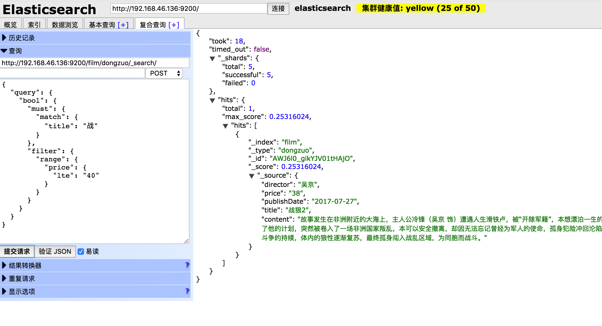  

2. java代码实现

```java

    /**
     * 多条件查询 filter
     * @throws Exception
     */
    @Test
    public void searchMutil4()throws Exception{
        SearchRequestBuilder srb=client.prepareSearch("film").setTypes("dongzuo");
        QueryBuilder queryBuilder=QueryBuilders.matchPhraseQuery("title", "战");
        QueryBuilder queryBuilder2=QueryBuilders.rangeQuery("price").lte(40);
        SearchResponse sr=srb.setQuery(QueryBuilders.boolQuery()
                .must(queryBuilder)
                .filter(queryBuilder2))
                .execute()
                .actionGet();
        SearchHits hits=sr.getHits();
        for(SearchHit hit:hits){
            System.out.println(hit.getSourceAsString());
        }
    }
```

返回结果：

```text
{"director":"吴京","price":"38","publishDate":"2017-07-27","title":"战狼2","content":"故事发生在非洲附近的大海上，主人公冷锋（吴京 饰）遭遇人生滑铁卢，被“开除军籍”，本想漂泊一生的他，正当他打算这么做的时候，一场突如其来的意外打破了他的计划，突然被卷入了一场非洲国家叛乱，本可以安全撤离，却因无法忘记曾经为军人的使命，孤身犯险冲回沦陷区，带领身陷屠杀中的同胞和难民，展开生死逃亡。随着斗争的持续，体内的狼性逐渐复苏，最终孤身闯入战乱区域，为同胞而战斗。"}
```


## 八、elasticsearch中文分词器插件smartcn

### 8.1 elasticsearch安装中文分词器插件smartcn

elasticsearch默认分词器比较坑，中文的话，直接分词成单个汉字。

我们这里来介绍下smartcn插件，这个是官方推荐的，中科院搞的，基本能满足需求；

还有另外一个IK分词器。假如需要自定义词库的话，那就去搞下IK，主页地址：<https://github.com/medcl/elasticsearch-analysis-ik>

smartcn安装比较方便，直接用 elasticsearch的bin目录下的plugin命令。

```shell
#进入elasticsearch的bin目录，安装smartcn
$./elasticsearch-plugin install analysis-smartcn
-> Downloading analysis-smartcn from elastic
[=================================================] 100%   
-> Installed analysis-smartcn
```

安装后 plugins目录会多一个smartcn文件包，安装后，我们需要重启es。

**（注意，假如集群是3个节点，所有节点都需要安装；不过一般都是先一个节点安装好所有的东西，然后克隆几个节点，这样方便）**


1. 我们来测试elasticsearch默认分词器

POST <http://192.168.46.136:9200/_analyze/> 

```json
{"analyzer":"standard","text":"我是中国人"}  
```

执行标准分词器，结果如下：

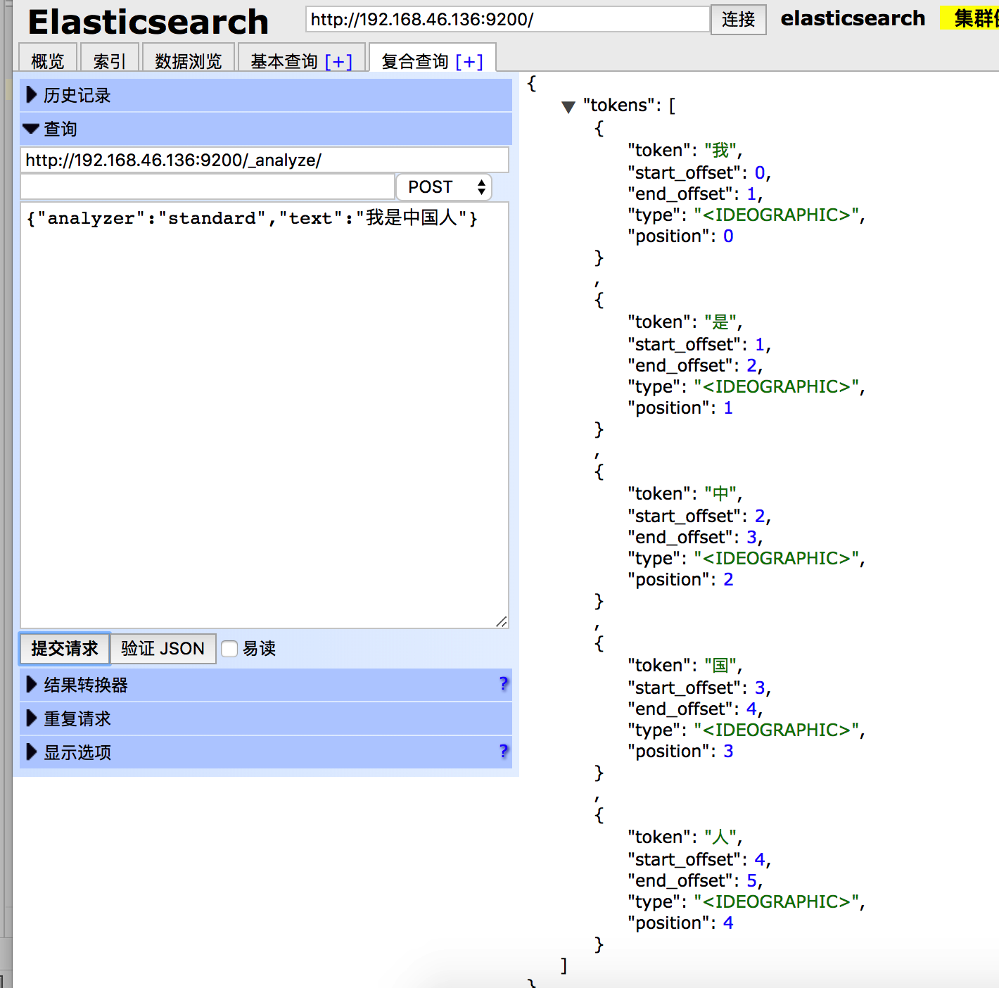  

中文都是单个字了，很不符合需求。


2. 使用smartcn分词器

POST <http://192.168.46.136:9200/_analyze/> 

```json
{"analyzer":"smartcn","text":"我是中国人"}
```

执行结果，我们发现 中国 编程个单个词汇。

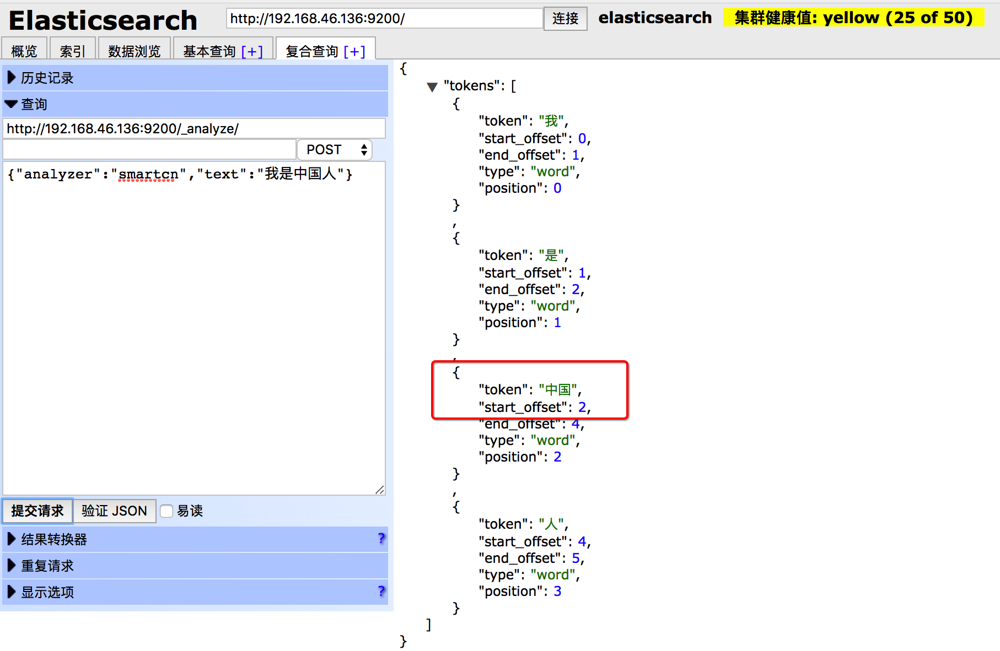  

### 8.2 elasticsearch基于smartcn中文分词查询

我们新建索引film2，然后映射的时候，指定smartcn分词。

1. 新建film2索引，然后执行前面的数据代码

Put  http://192.168.46.136:9200/film2

2. 建立映射

post  http://192.168.46.136:9200/film2/_mapping/dongzuo/

```json
{
    "properties":{
        "director":{
            "type": "keyword"
        },
        "price":{
            "type": "float"
        },
        "publishDate":{
            "type": "date"
        },
        "title":{
            "type": "text",
            "analyzer": "smartcn"
        },
        "content":{
            "type": "text",
            "analyzer": "smartcn"
        }
    }
}
```

这样前面film索引，数据是标准分词，中文全部一个汉字一个汉字分词；film2用了smartcn，根据内置中文词汇分词。


2. 我们用java代码来搞分词搜索
private static final String ANALYZER="smartcn";

```java
    /**
     * 条件分词查询
     * @throws Exception
     */
    @Test
    public void search()throws Exception{
        SearchRequestBuilder srb=client.prepareSearch("film2").setTypes("dongzuo");
        SearchResponse sr=srb.setQuery(QueryBuilders.matchQuery("title", "星球狼").analyzer(ANALYZER))
                .setFetchSource(new String[]{"title","price"}, null)
                .execute()
                .actionGet();
        SearchHits hits=sr.getHits();
        for(SearchHit hit:hits){
            System.out.println(hit.getSourceAsString());
        }
    }
```

指定了中文分词，查询的时候，查询的关键字先进行分词然后再查询，不指定的话，默认标准分词。

返回结果：

```text
{"price":"55","title":"星球大战8：最后的绝地武士"}
{"price":"38","title":"战狼2"}
```

这里再讲下多字段查询，比如百度搜索，搜索的不仅仅是标题，还有内容，所以这里就有两个字段；

我们使用 multiMatchQuery 我们看下Java代码：

```java
    /**
     * 多字段条件分词查询
     * @throws Exception
     */
    @Test
    public void search2()throws Exception{
        SearchRequestBuilder srb=client.prepareSearch("film2").setTypes("dongzuo");
        SearchResponse sr=srb.setQuery(QueryBuilders.multiMatchQuery("非洲星球", "title","content").analyzer(ANALYZER))
                .setFetchSource(new String[]{"title","price","content"}, null)
                .execute()
                .actionGet();
        SearchHits hits=sr.getHits();
        for(SearchHit hit:hits){
            System.out.println(hit.getSourceAsString());
        }
    }
```

返回结果：

```text
{"price":"55","title":"星球大战8：最后的绝地武士","content":"《星球大战：最后的绝地武士》承接前作《星球大战：原力觉醒》的剧情，讲述第一军团全面侵袭之下，蕾伊（黛西·雷德利 Daisy Ridley 饰）、芬恩（约翰·博耶加 John Boyega 饰）、波·达默龙（奥斯卡·伊萨克 Oscar Isaac 饰）三位年轻主角各自的抉 择和冒险故事。前作中觉醒强大原力的蕾伊独自寻访隐居的绝地大师卢克·天行者（马克·哈米尔 Mark Hamill 饰），在后者的指导下接受原力训练。芬恩接受了一项几乎不可能完成的任务，为此他不得不勇闯敌营，面对自己的过去。波·达默龙则要适应从战士向领袖的角色转换，这一过程中他也将接受一些血的教训。"}
{"price":"38","title":"战狼2","content":"故事发生在非洲附近的大海上，主人公冷锋（吴京 饰）遭遇人生滑铁卢，被“开除军籍”，本想漂泊一生的他，正当他打算这么做的时候，一场突如其来的意外打破了他的计划，突然被卷入了一场非洲国家叛乱，本可以安全撤离，却因无法忘记曾经为军人的使命，孤身犯险冲回沦陷区，带领身陷屠杀中的同胞和难民，展开生死逃亡。随着斗争的持续，体内的狼性逐渐复苏，最终孤身闯入战乱区域，为同胞而战斗。"}
```


## 参考博文

java1234Elasticsearch学习 http://blog.java1234.com/index.html?typeId=24

Elasticsearch学习，请先看这一篇 https://blog.csdn.net/laoyang360/article/details/52244917

Elasticsearch的使用场景深入详解 https://blog.csdn.net/laoyang360/article/details/52227541