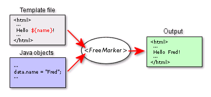
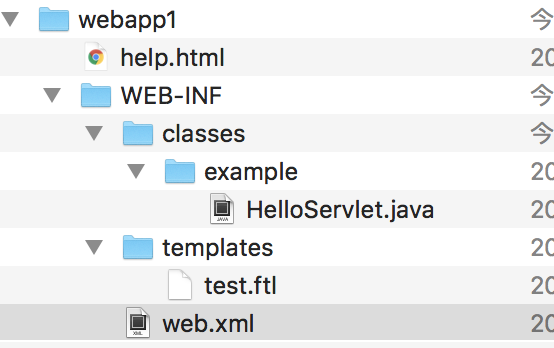

# FreeMarkeer入门

[TOC]

Freemarker官网：https://freemarker.apache.org/

Freemarker源码：https://prdownloads.sourceforge.net/freemarker/freemarker-2.2.8.tar.gz

Freemarker练习源码：https://github.com/caojx-git/learn/tree/master/code/freemarker-java

Freemarker视频教程：http://www.java1234.com/a/javaziliao/javaweb/2013/0804/536.html

Freemarker参考手册：https://github.com/caojx-git/learn/blob/master/notes/freemarker/FreeMarker%E5%8F%82%E8%80%83%E6%89%8B%E5%86%8C.pdf

**本笔记根据尚学堂freemarker视频教程整出**

## 一、简介

### 1.1 FreeMarker语言概述

FreeMarker是一个模板引擎，一个基于模板生成文本输出的通用工具，使用纯Java编写。

FreeMarker被设计用来生成HTML Web页面，特别是基于MVC模式的应用程序

虽然FreeMarker具有一些编程的能力，但通常由Java程序准备要显示的数据，由FreeMarker生成页面，通过模板显示准备的数据（如下图）

  

FreeMarker不是一个Web应用框架，而适合作为Web应用框架一个组件。

FreeMarker与容器无关，因为它并不知道HTTP或Servlet；FreeMarker同样可以应用于非Web应用程序环境。

FreeMarker更适合作为Model2框架（如Struts）的视图组件，你也可以在模板中使用JSP标记库。

FreeMarker是免费的。

### 1.2 FreeMarker特性

**通用目标**

能够生成各种文本：HTML、XML、RTF、Java源代码等等

易于嵌入到你的产品中：轻量级；不需要Servlet环境

插件式模板载入器：可以从任何源载入模板，如本地文件、数据库等等

你可以按你所需生成文本：保存到本地文件；作为Email发送；从Web应用程序发送它返回给Web浏览器

**强大的模板语言**

所有常用的指令：include、if/elseif/else、循环结构

在模板中创建和改变变量

几乎在任何地方都可以使用复杂表达式来指定值

命名的宏，可以具有位置参数和嵌套内容

名字空间有助于建立和维护可重用的宏库，或者将一个大工程分成模块，而不必担心名字冲突

输出转换块：在嵌套模板片段生成输出时，转换HTML转义、压缩、语法高亮等等；你可以定义自己的转换

**通用数据模型**

FreeMarker不是直接反射到Java对象，Java对象通过插件式对象封装，以变量方式在模板中显示

你可以使用抽象（接口）方式表示对象（JavaBean、XML文档、SQL查询结果集等等），告诉模板开发者使用方法，使其不受技术细节的打扰

**为Web准备**

在模板语言中内建处理典型Web相关任务（如HTML转义）的结构

能够集成到Model2 Web应用框架中作为JSP的替代

支持JSP标记库

为MVC模式设计：分离可视化设计和应用程序逻辑；分离页面设计员和程序员

**智能的国际化和本地化**

字符集智能化（内部使用UNICODE）

数字格式本地化敏感

日期和时间格式本地化敏感

非US字符集可以用作标识（如变量名）

多种不同语言的相同模板

**强大的XML处理能力**

<#recurse> 和<#visit>指令（2.3版本）用于递归遍历XML树。在模板中清楚和直觉的访问XML对象模型。开源论坛 [JForum](http://www.oschina.net/p/jforum) 就是使用了 FreeMarker 做为页面模板。

## 二、第一个FreeMarker程序

1. 建立一个普通的java项目：freemarker-java
2. 引入freemarker.jar包

```xml
<!-- https://mvnrepository.com/artifact/org.freemarker/freemarker -->
<dependency>
    <groupId>org.freemarker</groupId>
    <artifactId>freemarker</artifactId>
    <version>2.3.23</version>
</dependency>
```

3.     在项目src/resources目录下建立模板目录：templates
4.     在templates目录下，建立a.ftl模板文件，内容如下：

```html
你好啊，${user}，今天你的精神不错！
```

5.建立Test1.java文件，内容如下：

```java
package base;

import freemarker.template.Configuration;
import freemarker.template.Template;

import java.io.File;
import java.io.OutputStreamWriter;
import java.io.Writer;
import java.util.HashMap;
import java.util.Map;

/**
 * @author caojx
 * Created on 2018/3/8 下午下午6:56
 */
public class Test1 {

    public static void main(String[] args) throws Exception {
        //创建Freemarker配置实例
        Configuration cfg = new Configuration();

        //设置模板加载路径
        cfg.setDirectoryForTemplateLoading(new File("/Users/caojx/code/learn/code/freemarker-java/src/main/resources/templates"));

        //创建数据模型
        Map root = new HashMap();
        root.put("user", "老高");

        //加载模板文件
        Template t1 = cfg.getTemplate("a.ftl");

        //显示生成的数据,//将合并后的数据打印到控制台
        Writer out = new OutputStreamWriter(System.out);
        t1.process(root, out);
        out.flush();

        //显示生成的数据,//将合并后的数据直接返回成字符串！
//		StringWriter out = new StringWriter();
//		t1.process(root, out);
//		out.flush();
//		String temp = out.toString();
//		System.out.println(temp);	}
    }
}
```

6. 编译运行结果

```text
你好啊，老高，今天你的精神不错！
```


## 三、数据类型

### 3.1 直接指定值

直接指定值可以是字符串、数值、布尔值、集合及Map对象。
1. **字符串**
  直接指定字符串值使用单引号或双引号限定。字符串中可以使用转义字符”\"。如果字符串内有大量的特殊字符，则可以在引号的前面加上一个字母r，则字符串内的所有字符都将直接输出。

```html
<#assign b="abc"/> assign 用于定义变量 name=value
字符串：${b}
```

2. **数值**

数值可以直接输入，不需要引号。FreeMarker不支持科学计数法。

```html
<#assign b=123/>
数字：${b}
```

3. **布尔值**
  直接使用true或false，不使用引号。
```html
<#assign b=true  />
<#--
在模板中${}的方式只能输出基本数据类型如int与String
这里的boolean用${b}就会报错，而必须使用${b?string}
-->
布尔值：${b?string}
```

3. **集合**
  集合用中括号包括，集合元素之间用逗号分隔。
  使用数字范围也可以表示一个数字集合，如1..5等同于集合[1, 2, 3, 4, 5]；同样也可以用5..1来表示[5, 4, 3, 2, 1]。
```java
  //创建数据模型
List userList = new ArrayList<User>();
Map root = new HashMap();
userList.add(new User(1L,"tom1",18));
userList.add(new User(2L,"tom2",19));
userList.add(new User(3L,"tom3",20));
userList.add(new User(4L,"tom4",21));

root.put("userList",userList);
```


```html
#########集合##############
1.int类型集合
<#assign b=1..5/>
int集合1..5第0号元素：${b[0]}

<#assign b=[2,3,5]/>
int集合 ${b[0]}

2.string类型集合
<#assign b=["a","b","c","d"]/>
字符集合需要[]:${b[0]}

########list#######
item_index:当前变量的索引值
item_has_next:是否存在下一个对象

1.list遍历集合
<#list userList as user>
    ${user.userId}
</#list>

2.list 升序
<#list userList?sort as user>
    ${user.userId}
</#list>

3.list 降序
<#list userList?reverse as user>
    ${user.userId}
</#list>-->

4. sort_by 按照指定的变量值排序
sort_by有一个参数,该参数用于指定想要排序的子变量，排序是按照变量对应的值进行排序,如：
<#list userList?sort_by("age") as user>
    ${user.age}
</#list>
age是User对象的属性，排序是按age的值进行的。

5.遍历list并应用list隐含变量item_index
<#list userList as user>
  第${user_index+1}个用户
  用户编号：${user.userId}
  用户名：${user.userName}
  年  龄: ${user.age}
</#list>

6.遍历list并应用list隐含变量item_has_next
item_has_next,size使用：
<#list userList as user>
    用户编号:${user.userId}
    用户名：${user.userName}
    年  龄: ${user.age}
    <#if !user_has_next>
        共有${userList?size}最后一个用户是:${user.userName}
    </#if>
</#list>
```


3. **Map对象**
  Map对象使用花括号包括，Map中的key-value对之间用冒号分隔，多组key-value对之间用逗号分隔。
  注意：Map对象的key和value都是表达式，但key必须是字符串。
```html
1.定义map
<#--创建一个map,注意在freemarker中,map的key只能是字符串来作为key-->
<#assign userMap={"1":"刘德华","2":"张学友"}/>
<#--通过key获取map中的值-->
${userMap["1"]}

2.获取map的keys
<#assign keys=userMap?keys/>

3.遍历map 首选获取key的集合
<#list keys as key>
  key:${key}-value:${userMap["${key}"]}
</#list>

4.直接遍历map的第二种方式
<#list userMap?keys as key>
  key:${key}--value:${userMap["${key}"]}
</#list>


5.直接遍历map的values
<#list userMap?values as value>
    ${value}
</#list>
```

6. **时间对象**
```java
root.put("date1", new Date());
```
```freemarker
${date1?string("yyyy-MM-dd HH:mm:ss")}
```
7. **JAVABEAN的处理**

    Freemarker中对于javabean的处理跟EL表达式一致，类型可自动转化！非常方便!

    ```java
    //创建数据模型
    List userList = new ArrayList<User>();
    root.put("user",new User(1L,"freemarker_javabean",30));
    ```

    ```html
    ${"userId:"+user.userId+" userName:"+user.userName+" age:"+user.age}
    ```

### 3.2 输出变量值
   FreeMarker的表达式输出变量时，这些变量可以是顶层变量，也可以是Map对象的变量，还可以是集合中的变量，并可以使用点（.）语法来访问Java对象的属性。
1. **顶层变量**
     所谓顶层变量就是直接放在数据模型中的值。输出时直接用${variableName}即可。
     
2. **输出集合元素**
     可 以根据集合元素的索引来输出集合元素，索引用中括号包括。如： 输出[“1”， “2”， “3”]这个名为number的集合，可以用${number[0]}来输出第一个数字。FreeMarker还支持用number[1..2]来表示原 集合的子集合[“2”， “3”]。

3. **输出Map元素**
     对于JavaBean实例，FreeMarker一样把它看作属性为key，属性值为value的Map对象。
     输出Map对象时，可以使用点语法或中括号语法，如下面的几种写法的效果是一样的：

```html
book.author.name                                                                                                                         
book.author["name"]                                                                                                                      
book["author"].name                                                                                                                      
book["author"]["name"]    
```

使用点语法时，变量名字有和顶层变量一样的限制，但中括号语法没有任何限制。

### 3.1 字符串操作

1. **字符串连接**
  字符串连接有两种语法：
  (1)  使用${..}或#{..}在字符串常量内插入表达式的值；
  (2)  直接使用连接运算符“+”连接字符串。
  如，下面两种写法等效：

  ```html
  ${"Hello, ${user}"}                                         
  ${"Hello, " + user + "!"} 
  ```

  **有一点需要注意： ${..}只能用于文本部分作为插值输出，而不能用于比较等其他用途，如：**

  ```html
  <#if ${isBig}>Wow!</#if>
  <#if "${isBig}">Wow!</#if>
  ```

  应该写成：

  ```html
  <#if isBig>Wow!</#if>
  ```

2. **截取子串**
  截取子串可以根据字符串的索引来进行，如果指定一个索引值，则取得字符串该索引处的字符；如果指定两个索引值，则截取两个索引中间的字符串子串。如：

```html
<#assign number="01234">
${number[0]} <#-- 输出字符0 -->
${number[0..3]} <#-- 输出子串“0123” -->
```

### 3.4 集合连接操作
​	连接集合的运算符为“+”
### 3. 5 Map连接操作
​	Map连接操作的运算符为“+”
### 3.6 算术运算符

 	FreeMarker表达式中支持“+”、“－”、“*”、“/”、“%”运算符。

### 3.7 比较运算符

​	表达式中支持的比较运算符有如下几种：

1.  ==：判断两个值是否相等；

2. !=：判断两个值是否不相等；

注： =和!=可以用作字符串、数值和日期的比较，但两边的数据类型必须相同。而且FreeMarker的比较是精确比较，不会忽略大小写及空格。

3. \> （或者gt）：大于

4. \>=（或者gte）：大于等于
5. <（或者lt）：小于
6. <=（或者lte）：小于等于

注： 上面这些比较运算符可以用于数字和日期，但不能用于字符串。大部分时候，使用gt比>有更好的效果，因为FreeMarker会把>解释成标签的结束字符。可以使用括号来避免这种情况，如：<#if (x>y)>。

```java
root.put("num0", 18);
```

```html
if else 语句测试：
<#if num0 gt 18>  <#--不是使用>，大部分时候，freemarker会把>解释成标签结束！ -->
	及格！
<#else>
	不及格！
</#if>
```

### 3.8 逻辑运算符

1. &&： 逻辑与；

2. ||：逻辑或；

3. !：逻辑非

**逻辑运算符只能用于布尔值**

### 3.9 内建函数

FreeMarker提供了一些内建函数来转换输出，可以在任何变量后紧跟?，?后紧跟内建函数，就可以通过内建函数来转换输出变量。

字符串相关常用的内建函数：

1. html：对字符串进行HTML编码；

2. cap_first：使字符串第一个字母大写；

3. lower_case：将字符串转成小写；

4. upper_case：将字符串转成大写；

集合相关常用的内建函数：

1. size：
获得集合中元素的个数；
数字值相关常用的内建函数：
1. int：
取得数字的整数部分。


举例：

```java
root.put("htm2", "<b>粗体</b>");
```

```html
使用内建函数，直接在?后边使用：
${htm2?html}
```

### 3.10 空值处理运算符

FreeMarker的变量必须赋值，否则就会抛出异常。而对于FreeMarker来说，null值和不存在的变量是完全一样的，因为FreeMarker无法理解null值。
FreeMarker提供两个运算符来避免空值：

1. !：指定缺失变量的默认值；
2. ??：判断变量是否存在。

!运算符有两种用法：variable!或variable!defaultValue。第一种用法不给变量指定默认值，表明默认值是空字符串、长度为0的集合、或长度为0的Map对象。使用!运算符指定默认值并不要求默认值的类型和变量类型相同。

```html
<#-- ${sss} 没有定义这个变量，会报异常！ -->
${sss!} <#--没有定义这个变量，默认值是空字符串！ -->
${sss!"abc"} <#--没有定义这个变量，默认值是字符串abc！ -->
```

??运算符返回布尔值，如：variable??，如果变量存在，返回true，否则返回false。

```html
<#if user??><h1>Welcmoe ${user}!<h1></#if>
```

### 3.11 数据类型常见示例

 直接指定值 

   字符串 ： "Foo"或 者'Foo'或"It's\"quoted\""或r"C:\raw\string" 

   数字：123.45 

   布尔值：true,false 

   序列：["foo","bar", 123.45], 1..100 

   哈希表：{"name":"greenmouse", "price":150} 

   检索变量    顶层变量：user 

   从哈希表中检索数据：user.name,user[“name”] 

   从序列中检索：products[5]

   特殊变量：.main 

   字符串操作 

   插值（或连接）："Hello${user}!"（或"Free" + "Marker"） 

   获取一个字符：name[0]

   序列操作 

   连接：users +["guest"] 

   序列切分：products[10..19]  或  products[5..] 

   哈希表操作 

   连接：passwords+ {"joe":"secret42"} 

   算数运算: (x *1.5 + 10) / 2 - y % 100 

   比 较 运 算 ： x == y,   x != y,  x < y,   x > y,   x >= y,  x <= y, 

x &lt; y,  等等 

    逻辑操作：!registered&& (firstVisit || fromEurope) 

    内建函数：name?upper_case

    方法调用：repeat("What",3) 

   处理不存在的值 

   默认值：name!"unknown"  或者(user.name)!"unknown"  或者

name! 或者  (user.name)! 

   检测不存在的值：name??或者(user.name)?? 

参考：运算符的优先级


## 四、模板开发语句

​	最简单的模板是普通  HTML  文件（或者是其他任何文本文件—FreeMarker  本身不属于HTML）。当客户端访问页面时，FreeMarker要发送 HTML 代码至客户端浏览器端显示。如果想要页面动起来，就要在 HTML 中放置能被 FreeMarker 所解析的特殊部分。

​	${…}：FreeMarker 将会输出真实的值来替换花括号内的表达式，这样的表达式被称为

interpolations 插值，可以参考第上面示例的内容。

​	FTL tags 标签（FreeMarker  模板的语言标签）：FTL 标签和 HTML 标签有一点相似，但是它们是  FreeMarker 的指令而且是不会直接输出出来的东西。这些标签的使用一般以符号#开头。（用户自定义的 FTL 标签使用@符号来代替#，但这是更高级的主题内容了，后面会详细地讨论）

​	Comments 注释：FreeMarker的注释和 HTML 的注释相似，但是它用<#--和-->来分隔的。任何介于这两个分隔符（包含分隔符本身）之间内容会被 FreeMarker  忽略，就不会

输出出来了。

​	其他任何不是  FTL  标签，插值或注释的内容将被视为静态文本，这些东西就不会被

FreeMarker 所解析，会被按照原样输出出来。    

​	directives指令：就是所指的  FTL  标签。这些指令在  HTML  的标签（如<table>和

</table>）和 HTML 元素（如 table 元素）中的关系是相同的。（如果现在你还不能区

分它们，那么把“FTL 标签”和“指令”看做是同义词即可。）

### 4.1 if指令

数据

```java
root.put("user", "老高");
root.put("random", new Random().nextInt(100));
```

if.ftl模板
```html
if语句测试：
${user}是<#if user=="老高">我们的老师</#if>
------------------------------------------------
if else 语句测试：
<#if random gt 18>  <#--不是使用>，大部分时候，freemarker会把>解释成标签结束！ -->
	及格！
<#else>
	不及格！
</#if>
---------------------------------------------------
if else if else语句测试：
<#if random gte 90>
	优秀！
<#elseif random gte 80>
	良好！
<#else>
	一般！	
</#if>
----------------------------------------------------
```

结果：

```html
------------------------------------------------
if语句测试：
老高是我们的老师
------------------------------------------------
if else 语句测试：
  
	及格！
---------------------------------------------------
if else if else语句测试：
	一般！
----------------------------------------------------
```

### 4.2 switch指令

```html
<#switch value> 
	<#case refValue1> 
		... 
		<#break> 
	<#case refValue2> 
		... 
		<#break> 
	<#case refValueN> 
		... 
		<#break> 
	<#default> 
		... 
</#switch>
```

### 4.3 list指令

freemarker没有for循环的写法，list循环指令就是for循环指令

数据

```java
List list = new ArrayList();
list.add(new Address("中国","北京"));
list.add(new Address("中国","上海"));
list.add(new Address("美国","纽约"));
root.put("lst", list);
```

list.ftl模板
```html
测试list指令：
<#list lst as dizhi >
	<b>${dizhi.country}</b> <br/>
</#list>
```

结果：

```text
控制台打印：
测试list语句：
	<b>中国</b> <br/>
	<b>中国</b> <br/>
	<b>美国</b> <br/>
```

### 4.4 include指令

增加被包含文件include.txt，放于templates目录下

文件内容如下：

```text
我是被包含的文件！
```

模板文件中代码如下：

```html
测试include指令：
<#include "include.txt" />
```

### 4.5 自定义指令(macro指令)

不带参数的宏指令

```html
<#macro m1>   <#--定义指令m1 -->
	<b>aaabbbccc</b>
	<b>dddeeefff</b>
</#macro>

 <#--调用上面的宏指令 -->
<@m1 />
<@m1 /> 
```

带参数的宏指令

```html
<#macro m2 a b c >
	${a}--${b}--${c}
</#macro>

<#--  调用带参数的宏指令 -->
<@m2 a="老高" b="老张" c="老马" />
```

### 4.6 nested指令

 <#nested> 详单与占位，到时候会被替换成真正的内容。

```html
<#macro border> 
  <table border=4 cellspacing=0 cellpadding=4><tr><td> 
    <#nested> 
  </td></tr></table> 
</#macro>
```

```html
<@border >表格中的内容！</@border> <#--  表格中的内容会替换 <#nested>  -->
```

结果：

```text
<table border=4 cellspacing=0 cellpadding=4><tr><td>
表格中的内容！  </td></tr></table>
```


## 五、命名空间

### 5.1 简介

​	当运行 FTL 模板时，就会有使用assign 和 macro 指令创建的变量的集合（可能是空的），可以从前一章节来看如何使用它们。像这样的变量集合被称为 namespace 命名空间。在简单的情况下可以只使用一个命名空间，称之为 main namespace 主命名空间。因为通常只使用本页上的命名空间，所以就没有意识到这点。

​    如果想创建可以重复使用的宏，函数和其他变量的集合，通常用术语来说就是引用

library 库。使用多个命名空间是必然的。只要考虑你在一些项目中，或者想和他人共享使用的时候，你是否有一个很大的宏的集合。但要确保库中没有宏（或其他变量）名和数据模型中变量同名，而且也不能和模板中引用其他库中的变量同名。通常来说，变量因为名称冲突也会相互冲突。所以要为每个库中的变量使用不同的命名空间。

定义b.ftl文件：

```html
<#macro copyright date>
  <p>Copyright (C) ${date} 北京尚学堂.</p> 
</#macro> 
<#assign mail = "bjsxt@163.com"> <#-- assign 定义变量 mail -->
```

在a.ftl文件中引入b.ftl，从而可以使用b.ftl中定义的宏和变量：

```html
测试命名空间：
<#import "b.ftl" as bb  /> <#-- b.ftl 别名为 bb -->
<@bb.copyright date="2010-2011" />
${bb.mail}
<#assign mail="my@163.com"  />
${mail}
<#assign mail="my@163.com" in bb  /> <#-- assign 定义变量 mail并将变量存放到bb,即通过in 操作，直接修改bb原有的mail值 -->
${bb.mail}
```

执行后，控制台打印：

```freemarker
测试命名空间：
<p>Copyright (C) 2010-2011 北京尚学堂.</p> 
bjsxt@163.com
my@163.com
my@163.com
```

### 5.2 命名空间规则

​	如果你为 Example 公司工作，它们拥有 www.example.com 网的主页，你的工作是开发

一个部件库，那么要引入你所写的 FTL 的路径应该是：/lib/example.com/widget.ftl

 

​	注意到 www 已经被省略了。第三次路径分割后的部分可以包含子目录，可以像下面这

样写： /lib/example.com/commons/string.ftl 

一个重要的规则就是路径不应该包含大写字母，为了分隔词语，使用下划线_，就像

wml_form（而不是 wmlForm）。 

 

​	如果你的工作不是为公司或组织开发库，也要注意，你应该使用项目主页的 URL，比如

/lib/example.sourceforge.net/example.ftl或/lib/geocities.com/jsmith/example.ftl。

 

## 六、Servlet中使用Freemarker

使用详情集安[Freemarker](https://prdownloads.sourceforge.net/freemarker/freemarker-2.2.8.tar.gz)官方案例，解压后在examples目录下webapp1项目！

  


**1.web.xml**

没有任何特别之处

```xml
<?xml version="1.0" encoding="ISO-8859-1"?>

<!DOCTYPE web-app
    PUBLIC "-//Sun Microsystems, Inc.//DTD Web Application 2.3//EN"
    "http://java.sun.com/dtd/web-app_2_3.dtd">

<web-app>
  <display-name>FreeMarker Example Web Application 1</display-name>
  <servlet>
    <servlet-name>hello</servlet-name>
    <servlet-class>example.HelloServlet</servlet-class>
  </servlet>
  <servlet-mapping>
    <servlet-name>hello</servlet-name>
    <url-pattern>/hello</url-pattern>
  </servlet-mapping>
  <welcome-file-list>
      <welcome-file>help.html</welcome-file>
  </welcome-file-list>
</web-app>
```

2. test.ftl

```html
<html>
<head>
  <title>FreeMarker Example Web Application 1</title>
</head>
<body>
  ${message}
</body>
</html>
```

3. HelloServlet.java

```java
package example;

import java.util.*;
import java.io.*;
import javax.servlet.*;
import javax.servlet.http.*;
import freemarker.template.*;

/**
 * This Servlet does not do anything useful, just prints "Hello World!". The
 * intent is to help you to get started if you want to build your own Controller
 * servlet that uses FreeMarker for the View. For more advanced example, see the
 * 2nd Web application example.
 */
public class HelloServlet extends HttpServlet {
    private Configuration cfg; 
    
    public void init() {
        // Initialize the FreeMarker configuration;
        // - Create a configuration instance
        cfg = new Configuration();
        // - Templates are stoted in the WEB-INF/templates directory of the Web app.
        cfg.setServletContextForTemplateLoading(
                getServletContext(), "WEB-INF/templates");
        // In a real-world application various other settings should be explicitly
        // set here, but for the sake of brevity we leave it out now. See the
        // "webapp2" example for them.
    }
    
    protected void doGet(HttpServletRequest req, HttpServletResponse resp)
        throws ServletException, IOException {
        
        // Build the data-model
        Map root = new HashMap();
        root.put("message", "Hello World!");
        
        // Get the templat object
        Template t = cfg.getTemplate("test.ftl");
        
        // Prepare the HTTP response:
        // - Use the charset of template for the output
        // - Use text/html MIME-type
        resp.setContentType("text/html; charset=" + t.getEncoding());
        Writer out = resp.getWriter();
        
        // Merge the data-model and the template
        try {
            t.process(root, out);
        } catch (TemplateException e) {
            throw new ServletException(
                    "Error while processing FreeMarker template", e);
        }
    }
}
```


## 七、Struts2整合Freemarker

1. 详情见[Freemarker](https://prdownloads.sourceforge.net/freemarker/freemarker-2.2.8.tar.gz)官方案例，解压后在examples/struts-webapp
2. 解压struts2-core-X.X.X.jar文件，把在META-INF文件夹下面的struts-tags.tld文件复制到WEB-INF文件夹下。   将freemark的jar导入到工程中
3. 在web.xml文件中配置freemark同时启动JSPSupportServlet.代码如下：


```xml
<servlet>
	<servlet-name>freemarker</servlet-name>
	<servlet-class>
	    freemarker.ext.servlet.FreemarkerServlet
	</servlet-class>
	<!--下面的配置freemarke的ftl文件的位置 -->
	<init-param>
	    <param-name>TemplatePath</param-name>
	    <param-value>/</param-value>
	</init-param>
	<!-- 是否和服务器（tommcat)一起启动。-->
	<load-on-startup>1</load-on-startup>
</servlet>
 
<servlet-mapping>
	<servlet-name>freemarker</servlet-name>
	<url-pattern>*.ftl</url-pattern>
</servlet-mapping>
 
<servlet>
	<!-- define a JspSupportServlet Object -->
	<servlet-name>JspSupportServlet</servlet-name>
	<servlet-class>org.apache.struts2.views.JspSupportServlet</servlet-class>
	<!-- setting JspSupportServlet auto start -->
	<load-on-startup>1</load-on-startup>
</servlet>
```

4. 在FreeMarker模板中使用assign指令导入标签库。代码如下

```html
<#assign s=JspTaglibs["/WEB-INF/struts-tags.tld"] /> 
```

注：这里我把struts-tags.tld放在WEB-INF下面

5. 现在我们可以在FreeMarker模板中使用标签了。