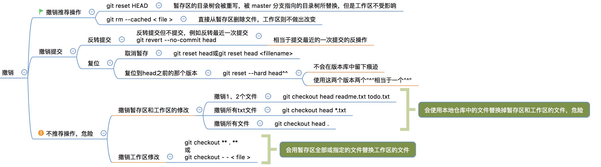

## Git 工作常用命令

[TOC]

本文主要了解在实际工作中经常需要使用的命令

其他本文没有介绍的命令可以先参考官网：https://git-scm.com/book/en/v2

## 一、git log

[原文连接](http://www.runoob.com/git/git-commit-history.html)

### 1.1 git log

在使用 Git 提交了若干更新之后，又或者克隆了某个项目，想回顾下提交历史，我们可以使用 git log 命令查看。
针对我们前一章节的操作，使用 git log 命令列出历史提交记录如下：
```shell
$ git log  
commit 88afe0e02adcdfea6844bb627de97da21eb10af1  
Merge: 14b4dca d7e7346  
Author: w3cschool <w3c@w3cschool.cc>  
Date:   Sun Mar 1 15:03:42 2015 +0800  
    Merge branch 'change_site'  
    	Conflicts:  
        test.txt  
 ommit 14b4dcadbdc847207651d5a9fae0d315057f346e  
 uthor: w3cschool <w3c@w3cschool.cc>  
 ate:   Sun Mar 1 14:53:15 2015 +0800  
    新增加一行  
 ommit d7e734640da06055e107eaf29cf350b3f1de1c2c  
 uthor: w3cschool <w3c@w3cschool.cc>  
 ate:   Sun Mar 1 14:48:57 2015 +0800  
    changed the site  
 ommit 556f0a0637978097b82287ac665a717623b21f3f    
 uthor: w3cschool <w3c@w3cschool.cc>  
 ate:   Sun Mar 1 14:40:34 2015 +0800  
    removed test2.txt  
```


### 1.2 git log —oneline

我们可以用 --oneline 选项来查看历史记录的简洁的版本。

```shell
$ git log --oneline  
88afe0e Merge branch 'change_site'  
14b4dca 新增加一行  
d7e7346 changed the site  
556f0a0 removed test2.txt  
2e082b7 add test2.txt  
048598f add test.txt  
85fc7e7 test comment from w3cschool.cc  
```

这告诉我们的是，此项目的开发历史。

### 1.3 git log 图形显示

我们还可以用 --graph 选项，查看历史中什么时候出现了分支、合并。以下为相同的命令，开启了拓扑图选项：

```shell
$ git log --oneline --graph  
*   88afe0e Merge branch 'change_site'  
|\  
| * d7e7346 changed the site  
| * | 14b4dca 新增加一行  
|/  
* 556f0a0 removed test2.txt  
* 2e082b7 add test2.txt  
* 048598f add test.txt  
* 85fc7e7 test comment from w3cschool.cc  
```

现在我们可以更清楚明了地看到何时工作分叉、又何时归并。
你也可以用 '--reverse'参数来逆向显示所有日志。

```shell
$ git log --reverse --oneline  
85fc7e7 test comment from w3cschool
048598f add test.txt  
2e082b7 add test2.txt  
556f0a0 removed test2.txt  
d7e7346 changed the site  
14b4dca 新增加一行  
88afe0e Merge branch 'change_site' 
```

### 1.4 git log 作者查询

如果只想查找指定用户的提交日志可以使用命令：git log --author , 例如，比方说我们要找 Git 源码中 Linus 提交的部分：

```shell
$ git log --author=Linus --oneline -5  
81b50f3 Move 'builtin-*' into a 'builtin/' subdirectory 
3bb7256 make "index-pack" a built-in  
377d027 make "git pack-redundant" a built-in    
b532581 make "git unpack-file" a built-in    
112dd51 make "mktag" a built-in   
```

### 1.5 git log 时间查询

如果你要指定日期，可以执行几个选项：--since 和 --before，但是你也可以用 --until 和 --after。
例如，如果我要看 Git 项目中三周前且在四月十八日之后的所有提交，我可以执行这个（我还用了 --no-merges 选项以隐藏合并提交）：

```shell
$ git log --oneline --before={3.weeks.ago} --after={2010-04-18} --no-merges
5469e2d Git 1.7.1-rc2  
d43427d Documentation/remote-helpers: Fix typos and improve language      
272a36b Fixup: Second argument may be any arbitrary string  
b6c8d2d Documentation/remote-helpers: Add invocation section  
5ce4f4e Documentation/urls: Rewrite to accomodate transport::address  
00b84e9 Documentation/remote-helpers: Rewrite description  
03aa87e Documentation: Describe other situations where -z affects git diff 
77bc694 rebase-interactive: silence warning when no commits rewritten  
636db2c t3301: add tests to use --format="%N"
```


## 二、git 已提交代码回退

**最好在代码回退前备份一下代码，避免操作失误**

### 2.1 本地分支版本回退

如果代码只提交到本地仓库，可以使用下边的方案回退。

```shell
#1.查看提交的commit id
#方式一
$git log --author=caojx --oneline  -10 #查看作者是caojx的近10次的提交历史
e48eac3 (origin/dev) 将原来的import oracle.sql.CHAR修改成String
a6766f6 针对JT-KF投诉工单，新增了几种情进行优化
090ab60 优化日志打印
3b91323 (origin/public-dev) YWZC000248535-JT-KF传输到手机ESOP-ESOP-1
0397798 YWZC000248535-JT-KF传输到手机ESOP-ESOP-1
#方式二
$git reflog

#2.查看某个commit id的修改
$git show e48eac3

#3.回退到指定的commit id版本
$git reset --hard commitId
```

### 2.2 自己远程分支版本回退

如果代码已经提交到自己的远程仓库，可以使用下边的方案回退。

```shell
#1.查看commit id
$git reflog
#2.查看对应commit id 变更内容
$git show commmitId
#3.本地先回退对应的commitId
$git reset --hard commitId

#4.强制推送到远程分支，强制推送会使用本地分支覆盖远程分支
$git push -f origin 分支名称
```

### 2.3 公共远程分支版本回退方式1

原文：http://blog.csdn.net/fuchaosz/article/details/52170105

如果代码已经提交到公共仓库，可以使用下边的方案回退。

看到这里，相信你已经能够回滚远程分支的版本了，那么你也许会问了，回滚公共远程分支和回滚自己的远程分支有区别吗？ 
答案是，当然有区别啦。

> 一个显而易见的问题：如果你回退公共远程分支，把别人的提交给丢掉了怎么办？

假如你的远程master分支情况是这样的:

**A1–A2–B1**

其中A、B分别代表两个人，A1、A2、B1代表各自的提交。并且所有人的本地分支都已经更新到最新版本，和远程分支一致。


**这个时候你发现A2这次提交有错误，你用reset回滚远程公共分支master到A1**，那么理想状态是你的队友一拉代码git pull，他们的master分支也回滚了，然而现实却是，你的队友会看到下面的提示：

```shell
$ git status
On branch master
Your branch is ahead of 'origin/master' by 2 commits.
  (use "git push" to publish your local commits)
nothing to commit, working directory clean
```

也就是说，你的队友的分支并没有主动回退，而是比远程分支超前了两次提交，因为远程分支回退了嘛。


(1) 这个时候，你大吼一声：兄弟们，老子回退版本了。如果你的队友都是神之队友，比如: Tony(腾讯CTO)，那么Tony会冷静的使用下面的命令来找出你回退版本后覆盖掉的他的提交(也就是B1那次提交)

```shell
$git reflog
```

然后冷静的把自己的分支回退到那次提交，并且拉个分支:

```shell
$git checkout tony_branch        //先回到自己的分支  
$git reflog                      //接着看看当前的commit id,例如:0bbbbb    
$git reset --hard B1             //回到被覆盖的那次提交B1
$git checkout -b tony_backup     //拉个分支，用于保存之前因为回退版本被覆盖掉的提交B1
$git checkout tony_branch        //拉完分支，迅速回到自己分支
$git reset --hard 0bbbbb         //马上回到自己分支的最前端，即A1
```

通过上面一通敲，Tony暂时舒了一口气，还好，B1那次提交找回来了,这时tony_backup分支最新的一次提交就是B1，接着Tony要把自己的本地master分支和远程master分支保持一致：

```shell
$git reset --hard origin/master
```

执行了上面这条命令后，Tony的master分支才真正的回滚了,也就是说你的回滚操作才能对Tony生效，这个时候Tony的本地maser是这样的：

**A1**

接着Tony要再次合并那个被丢掉的B1提交：

```shell
$git checkout master             //切换到master
$git merge tony_backup           //再合并一次带有B1的分支到master
```

好了，Tony终于长舒一口气，这个时候他的master分支是下面这样的：

**A1 – B1**

终于把丢掉的B1给找回来了，接着他push一下，你一拉也能同步。


**这种方式容易出现的问题：**


**同理对于所有队友也要这样做，但是如果该队友没有提交被你丢掉，那么他拉完代码git pull之后，只需要强制用远程master覆盖掉本地master就可以了**：

```shell
git reset --hard origin/master
```

(2) 然而很不幸的是，现实中，我们经常遇到的都是猪一样的队友，他们一看到下面提示：

```shell
$ git status
On branch master
Your branch is ahead of 'origin/master' by 2 commits.
  (use "git push" to publish your local commits)
nothing to commit, working directory clean12345
```

就习惯性的git push一下，或者他们直接用的SourceTree这样的图形界面工具，一看到界面上显示的是推送的提示就直接点了推送按钮，卧&槽，你辛辛苦苦回滚的版本就这样轻松的被你猪一样的队友给还原了，所以，只要有一个队友push之后，远程master又变成了：

**A1 – A2 – B1**

这就是分布式，每个人都有副本。这个时候你连揍他的心都有了，怎么办呢？你不能指望每个人队友都是git高手，下面我们用另外一种方法来回退版本。

> **注意：博主是在虚拟机中实验的，用于模拟两个人的操作，如果你在一个机器上，用同一个账号在不同的目录下克隆两份代码来实验的话，回退远程分支后，另外一个人是不会看到落后远程分支两次提交的，所以请务必使用虚拟机来模拟A、B两个人的操作**


### 2.4 公共远程分支版本回退方式2

原文：http://blog.csdn.net/fuchaosz/article/details/52170105

使用git reset回退公共远程分支的版本后，需要其他所有人手动用远程master分支覆盖本地master分支，显然，这不是优雅的回退方法，下面我们使用另个一个命令来回退版本：

```shell
$git revert HEAD                     //撤销最近一次提交
$git revert HEAD~1                   //撤销上上次的提交，注意：数字从0开始
$git revert 0ffaacc                  //撤销0ffaacc这次提交,我们可以用该命令回到A1
```

**git revert 命令意思是撤销某次提交**。它会产生一个新的提交，虽然代码回退了，但是版本依然是向前的，所以，当你用revert回退之后，所有人pull之后，他们的代码也自动的回退了。

**但是，要注意以下几点：**

1. revert 是撤销一次提交，所以后面的commit id是你需要回滚到的版本的前一次提交
2. 使用revert HEAD是撤销最近的一次提交，如果你最近一次提交是用revert命令产生的，那么你再执行一次，就相当于撤销了上次的撤销操作，换句话说，你连续执行两次revert HEAD命令，就跟没执行是一样的
3. 使用revert HEAD~1 表示撤销最近2次提交，这个数字是从0开始的，如果你之前撤销过产生了commi id，那么也会计算在内的。
4. 如果使用 revert 撤销的不是最近一次提交，那么一定会有代码冲突，需要你合并代码，合并代码只需要把当前的代码全部去掉，保留之前版本的代码就可以了.

**优点：**

git revert 命令的好处就是不会丢掉别人的提交，即使你撤销后覆盖了别人的提交，他更新代码后，可以在本地用 reset 向前回滚，找到自己的代码，然后拉一下分支，再回来合并上去就可以找回被你覆盖的提交了。

### 2.5 revert 合并代码，解决冲突

原文：http://blog.csdn.net/fuchaosz/article/details/52170105

使用revert命令，如果不是撤销的最近一次提交，那么一定会有冲突，如下所示：

```shell
<<<<<<< HEAD
全部清空
第一次提交
=======
全部清空
>>>>>>> parent of c24cde7... 全部清空123456
```

解决冲突很简单，因为我们只想回到某次提交，因此需要把当前最新的代码去掉即可，也就是HEAD标记的代码：

```shell
<<<<<<< HEAD
全部清空
第一次提交
=======1234
```

把上面部分代码去掉就可以了，然后再提交一次代码就可以解决冲突了。

### 2.6 错的太多了回退方案

原文：http://blog.csdn.net/fuchaosz/article/details/52170105

```text
自己的分支回滚直接用reset
公共分支回滚用revert
错的太远了直接将代码全部删掉，用正确代码替代
```

## 三、git 撤销操作

第二章主要是回退已经提交到了版本库中的代码，本节主要了解本地工作区、暂存、版本库之间的操作

  

## 四、git 提交代码

### 4.1 提交到自己的远程仓库

```shell
#1.添加追踪文件
$git add file
#2.提交到本地仓库
$git commit -m "修改xxx"
#3.推送到自己远程仓库
$git push origin xxx 
```

### 4.2 提交到远程公共仓库

```shell
#1.添加追踪文件
$git add file
#2.提交到本地仓库
$git commit -m "修改xxx"
#3.推送到自己远程仓库
$git push origin xxx 

#4.发起合并请求 pull request将自己的远程仓库的修改发起合并到公共远程仓库
```

### 4.3 储藏使用

如果我们有很多开发任务，我们需要同时进行多个任务的开发，这时我们就可以使用储藏命令，在每次完成一个任务编码时候，如果不想提交，就可以储藏一下，这样我们就能做到各个任务分别提交。

假如我们有A,B两个任务

```shell
#1.A完成开发后，暂时不想提交，储藏A任务
$git stash save "A任务完成了，先储藏起来"
#2.查看储藏
$git stash list

#3.储藏之后，我们本地的工作空间是新的，干净的
$git status

#3.继续开发其他任务

#4.需要使用A任务的时候，pop出来
$git stash pop
```

## 五、git 更新代码

### 5.1 更新自己远程仓库

```shell
#1.更新，并合并到当前分支
$git pull origin 分支名
```

### 5.2 更新远程公共仓库

```shell
#1.添加远程公共仓库地址，upstream是远程仓库别名
$git remote add upstream 远程仓库地址
#2.拉取远程仓库的dev分支代码
$git fetch upstream dev
#3.查看当前所在的分支,下边现实在dev
$git branch
* dev
  master
  public-dev
#3.将远程公共仓库的dev分支代码合并到本地dev分支
$git merge upstream/dev
```

