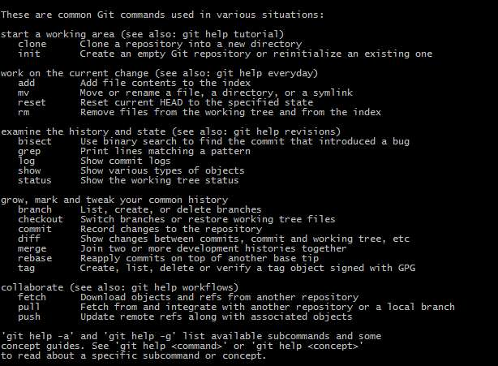
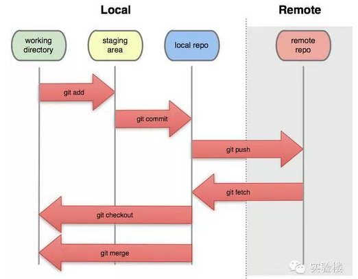
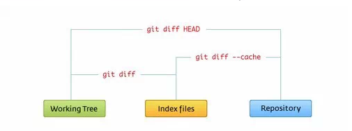

##Git 基本操作
Git 的工作就是创建和保存你项目的快照及与之后的快照进行对比。本章将对有关创建与提交你的项目快照的命令作介绍。


下面2张图可以直观的帮助你理解：



###获取与创建项目命令
>git init

用 git init 在目录中创建新的 Git 仓库。 你可以在任何时候、任何目录中这么做，完全是本地化的。
在目录中执行 git init，就可以创建一个 Git 仓库了。比如我们创建 runoob 项目：
>$ mkdir runoob
$ cd runoob/
$ git init
Initialized empty Git repository in /Users/tianqixin/www/runoob/.git/
\# 在 /www/runoob/.git/ 目录初始化空 Git 仓库完毕。

现在你可以看到在你的项目中生成了 .git 这个子目录。 这就是你的 Git 仓库了，所有有关你的此项目的快照数据都存放在这里。

>ls -a
.	..	.git

###git clone

使用 git clone 拷贝一个 Git 仓库到本地，让自己能够查看该项目，或者进行修改。
如果你需要与他人合作一个项目，或者想要复制一个项目，看看代码，你就可以克隆那个项目。 执行命令：

> git clone [url]

[url] 为你想要复制的项目，就可以了。
例如我们克隆 Github 上的项目：

>$ git clone git@github.com:schacon/simplegit.git
Cloning into 'simplegit'...
remote: Counting objects: 13, done.
remote: Total 13 (delta 0), reused 0 (delta 0), pack-reused 13
Receiving objects: 100% (13/13), done.
Resolving deltas: 100% (2/2), done.
Checking connectivity... done.
克隆完成后，在当前目录下会生成一个 simplegit 目录：
$ cd simplegit/ $ ls README Rakefile lib
上述操作将复制该项目的全部记录。
$ ls -a
.        ..       .git     README   Rakefile lib
$ cd .git
$ ls
HEAD        description info        packed-refs
branches    hooks       logs        refs
config      index       objects

默认情况下，Git 会按照你提供的 URL 所指示的项目的名称创建你的本地项目目录。 通常就是该 URL 最后一个 / 之后的项目名称。如果你想要一个不一样的名字， 你可以在该命令后加上你想要的名称。
##基本快照
Git 的工作就是创建和保存你的项目的快照及与之后的快照进行对比。本章将对有关创建与提交你的项目的快照的命令作介绍。
###git add

git add 命令可将该文件添加到缓存，如我们添加以下两个文件：

>$ touch README
$ touch hello.php
$ ls
README		hello.php
$ git status -s
?? README
?? hello.php
$ 

git status 命令用于查看项目的当前状态。
接下来我们执行 git add 命令来添加文件：
>$ git add README hello.php 

现在我们再执行 git status，就可以看到这两个文件已经加上去了。

>$ git status -s
A  README
A  hello.php
$ 

新项目中，添加所有文件很普遍，我们可以使用 git add . 命令来添加当前项目的所有文件。
现在我们修改 README 文件：

>$ vim README

在 README 添加以下内容：
``` Runoob Git 测试，然后保存退出。```
再执行一下 git status：
>$ git status -s
AM README
A  hello.php

"AM" 状态的意思是，这个文件在我们将它添加到缓存之后又有改动。改动后我们在执行 git add 命令将其添加到缓存中：
>$ git add .
$ git status -s
A  README
A  hello.php

当你要将你的修改包含在即将提交的快照里的时候，需要执行 git add。
###git status
git status 查看在你上次提交之后是否有修改。
我演示该命令的时候加了 -s 参数，以获得简短的结果输出。如果没加该参数会详细输出内容：
>$ git status
On branch master
Initial commit
Changes to be committed:
  (use "git rm --cached <file>..." to unstage)
	new file:   README
	new file:   hello.php
    
###git diff
执行 git diff 来查看执行 git status 的结果的详细信息。
git diff 命令显示已写入缓存与已修改但尚未写入缓存的改动的区别。git diff 有两个主要的应用场景。
尚未缓存的改动：git diff
查看已缓存的改动： git diff --cached
查看已缓存的与未缓存的所有改动：git diff HEAD
显示摘要而非整个 diff：git diff --stat
在 hello.php 文件中输入以下内容：
```\    <?php
echo '菜鸟教程：www.runoob.com';
?>```
>$ git status -s
A  README
AM hello.php
$ git diff
diff --git a/hello.php b/hello.php
index e69de29..69b5711 100644
\--- a/hello.php
+++ b/hello.php
@@ -0,0 +1,3 @@
+<?php
+echo '菜鸟教程：www.runoob.com';
+?>

git status 显示你上次提交更新后的更改或者写入缓存的改动， 而 git diff 一行一行地显示这些改动具体是啥。
接下来我们来查看下 git diff --cached 的执行效果：
>$ git add hello.php 
$ git status -s
A  README
A  hello.php
$ git diff --cached
diff --git a/README b/README
new file mode 100644
index 0000000..8f87495
\--- /dev/null
+++ b/README
@@ -0,0 +1 @@
+# Runoob Git 测试
diff --git a/hello.php b/hello.php
new file mode 100644
index 0000000..69b5711
\--- /dev/null
+++ b/hello.php
@@ -0,0 +1,3 @@
+<?php
+echo '菜鸟教程：www.runoob.com';
+?>

###git commit
使用 git add 命令将想要快照的内容写入缓存区， 而执行 git commit 将缓存区内容添加到仓库中。
Git 为你的每一个提交都记录你的名字与电子邮箱地址，所以第一步需要配置用户名和邮箱地址。
>$ git config --global user.name 'runoob'
$ git config --global user.email test@runoob.com

接下来我们写入缓存，并提交对 hello.php 的所有改动。在首个例子中，我们使用 -m 选项以在命令行中提供提交注释。
>$ git add hello.php
$ git status -s
A  README
A  hello.php
$ $ git commit -m '第一次版本提交'
[master (root-commit) d32cf1f] 第一次版本提交
 2 files changed, 4 insertions(+)
 create mode 100644 README
 create mode 100644 hello.php
 
现在我们已经记录了快照。如果我们再执行 git status:
>$ git status
 On branch master
nothing to commit (working directory clean)

以上输出说明我们在最近一次提交之后，没有做任何改动，是一个"working directory clean：干净的工作目录"。
如果你没有设置 -m 选项，Git 会尝试为你打开一个编辑器以填写提交信息。 如果 Git 在你对它的配置中找不到相关信息，默认会打开 vim。屏幕会像这样：
> Please enter the commit message for your changes. Lines starting
 with '#' will be ignored, and an empty message aborts the commit.
 On branch master
 Changes to be committed:
   (use "git reset HEAD <file>..." to unstage)
 modified:   hello.php
~
~
".git/COMMIT_EDITMSG" 9L, 257C  

如果你觉得 git add 提交缓存的流程太过繁琐，Git 也允许你用 -a 选项跳过这一步。命令格式如下：
>git commit -a

我们先修改 hello.php 文件为以下内容：
```  \ <?php
echo '菜鸟教程：www.runoob.com';
echo '菜鸟教程：www.runoob.com';
?>```
再执行以下命令：
>git commit -am '修改 hello.php 文件'
[master 71ee2cb] 修改 hello.php 文件
 1 file changed, 1 insertion(+)
 
 ###git reset HEAD
git reset HEAD 命令用于取消已缓存的内容。
我们先改动文件 README 文件，内容如下：

```Runoob Git 测试
菜鸟教程 ```

hello.php 文件修改为：
```\ <?php
echo '菜鸟教程：www.runoob.com';
echo '菜鸟教程：www.runoob.com';
echo '菜鸟教程：www.runoob.com';
?>```
现在两个文件修改后，都提交到了缓存区，我们现在要取消其中一个的缓存，操作如下：
>$ git status -s
 M README
 M hello.php
$ git add .
$ git status -s
M  README
M  hello.pp
$ git reset HEAD -- hello.php 
Unstaged changes after reset:
M	hello.php
$ git status -s
M  README
 M hello.php
 
现在你执行 git commit，只会将 README 文件的改动提交，而 hello.php 是没有的。
>$ git commit -m '修改'
[master f50cfda] 修改
 1 file changed, 1 insertion(+)
$ git status -s
 M hello.php
 
可以看到 hello.php 文件的修改并为提交。
这时我们可以使用以下命令将 hello.php 的修改提交：
>$ git commit -am '修改 hello.php 文件'
[master 760f74d] 修改 hello.php 文件
 1 file changed, 1 insertion(+)
$ git status
On branch master
nothing to commit, working directory clean

简而言之，执行 git reset HEAD 以取消之前 git add 添加，但不希望包含在下一提交快照中的缓存。
####git rm
git rm 会将条目从缓存区中移除。这与 git reset HEAD 将条目取消缓存是有区别的。 "取消缓存"的意思就是将缓存区恢复为我们做出修改之前的样子。
默认情况下，git rm file 会将文件从缓存区和你的硬盘中（工作目录）删除。
如果你要在工作目录中留着该文件，可以使用 git rm --cached：
如我们删除 hello.php文件：
>$ git rm hello.php 
rm 'hello.php'
$ ls
README

不从工作区中删除文件：
>$ git rm --cached README 
rm 'README'
$ ls
README

####git mv
git mv 命令做得所有事情就是 git rm --cached 命令的操作， 重命名磁盘上的文件，然后再执行 git add 把新文件添加到缓存区。
我们先把刚移除的 README 添加回来：
>$ git add README 

然后对其重名:

>$ git mv README  README.md
$ ls
README.md