# Gradle入门

[TOC]

Gradle是一个基于Apache Ant和Apache Maven概念的项目自动化构建工具。它使用一种基于Groovy的特定领域语言(DSL)来声明项目设置，抛弃了基于XML的各种繁琐配置。

面向Java应用为主。当前其支持的语言限于Java、Groovy、Kotlin和Scala，计划未来将支持更多的语言。

官网地址：https://gradle.org/

本笔记了解如下内容：  

- 准备Gradle
- Gradle在Java项目中应用
- 构建脚本介绍
- 依赖管理
- 多项目构建
- 测试
- 发布

## 一、Gradle准备

### 1.1 安装Gradle

- JDK需要1.7及以上版本，java -version
- 从Gradle官网下载Gradle，https://gradle.org/
- 配置环境变量
```text
export GRADLE_HOME=/usr/local/gradle-4.5
export PATH=$PATH:$GRADLE_HOME/bin
```
- 验证是否安装成功 gradle -v

### 1.2 Groovy 简介

Groovy 是用于Java虚拟机的一种敏捷的动态语言，他是一种成熟的面向对象编程语言，即可以用于面向对象编程，又可以用作纯粹的脚本语言。使用改语言不必写过多的代码，同时又具有闭包和动态语言的其他特性。

**Groovy与Java对比**

- Groovy完全兼容Java语法

- 分号是可选的

- 类、方法默认是public的

- 编译器自动给属性添加getter/setter方法

- 属性可以直接用点号获取

- 最后一个表达式的值会被作为返回值，即可以不写return

- == 等同于 equals(),不会有NullPointerException

**Groovy特性**
- 自带assert语句，可以在任何地方进行断言操作
- 可选类型，可以使用Java普通方式类型，也可以直接使用def 定义
- 可选的括号
- 字符串,字符串有' '、" "、"'  '"三种形式
- 集合API
- 闭包


案例演示：  

#### 1. Groovy基础特性

```groovy
//Groovy特性
public class ProjectVersion{
    private int major //groovy 分号可选 , 属性会自动添加getter，setter方法
    private int minor;

    public ProjectVersion(int major, int minor){
        this.major = major;
        this.minor = minor;
    }

    int getMajor() {
       major //最后一个值会作为方法的返回值
    }

    void setMajor(int major) {
        this.major = major
    }
}

ProjectVersion v1 = new ProjectVersion(1,1);
println v1.major; //点号可以获取属性

ProjectVersion v2 = null;

v1 == v2; //== 等同于 equals(),不会有NullPointerException
```
结果：
```text
> //Groovy特性
> public class ProjectVersion{
>     private int major //groovy 分号可选 , 属性会自动添加getter，setter方法
>     private int minor;
> 
>     public ProjectVersion(int major, int minor){
>         this.major = major;
>         this.minor = minor;
>     }
> 
>     int getMajor() {
>        major //最后一个值会作为方法的返回值
>     }
> 
>     void setMajor(int major) {
>         this.major = major
>     }
> }
> 
> ProjectVersion v1 = new ProjectVersion(1,1);
> println v1.major; //点号可以获取属性
> 
> ProjectVersion v2 = null;
> 
> v1 == v2; //== 等同于 equals(),不会有NullPointerException
1
Result: false
```
#### 2. Groovy高效特性

```
//Groovy 高效特性
//1  可选的类型定义
def version = 1
int version2 = 2

//2 assert断言
//assert version == 2

//3 括号是可选的
println(version)

println version2

//4 字符串
def s1 = 'test1' //仅仅是字符串
def s2 = "gradle version is $version"  //可以插入变量

def s3 =  '''my
name is
tom''' //可以换行,会原样输出

println s1
println s2
println s3

//5 集合API
//list
def buidTools=['ant','maven']  //定义list
buidTools << 'gradle'  //追加数据
assert buidTools.getClass() == ArrayList
assert  buidTools.size() == 3
println buidTools.getClass()
//map
def buildYears = ['ant':2000,'maven':2004]
buildYears.gradle = 2009

println buildYears.ant
println buildYears['gradle']
println buildYears.getClass()

//6 闭包
//闭包简单来说就是一个代码块，跟一个方法一样，可以有参数，也可以没有参数，可以赋给一个变量，也可以作为方法参数，像普通方法一样调用
//下边介绍gradle构建脚本中闭包常见用法，其他闭包使用方式可以自己查询资料
def c1 = {
    v ->
        println v
}

def c2 = {
    println 'hello'
}

def method1(Closure closure){
    closure('param')
}

def method2(Closure closure){
    closure()
}

method1(c1);
method2(c2);
```

结果：  

```text
> //Groovy 高效特性
> //1  可选的类型定义
> def version = 1
> int version2 = 2
> 
> //2 assert断言
> //assert version == 2
> 
> //3 括号是可选的
> println(version)
> 
> println version2
> 
> //4 字符串
> def s1 = 'test1' //仅仅是字符串
> def s2 = "gradle version is $version"  //可以插入变量
> 
> def s3 =  '''my
> name is
> tom''' //可以换行,会原样输出
> 
> println s1
> println s2
> println s3
> 
> //5 集合API
> //list
> def buidTools=['ant','maven']  //定义list
> buidTools << 'gradle'  //追加数据
> assert buidTools.getClass() == ArrayList
> assert  buidTools.size() == 3
> println buidTools.getClass()
> //map
> def buildYears = ['ant':2000,'maven':2004]
> buildYears.gradle = 2009
> 
> println buildYears.ant
> println buildYears['gradle']
> println buildYears.getClass()
> 
> //6 闭包
> //闭包简单来说就是一个代码块，跟一个方法一样，可以有参数，也可以没有参数，可以赋给一个变量，也可以作为方法参数，像普通方法一样调用
> //下边介绍gradle构建脚本中闭包常见用法，其他闭包使用方式可以自己查询资料
> def c1 = {
>     v ->
>         println v
> }
> 
> def c2 = {
>     println 'hello'
> }
> 
> def method1(Closure closure){
>     closure('param')
> }
> 
> def method2(Closure closure){
>     closure()
> }
> 
> method1(c1);
> method2(c2);
1
2
test1
gradle version is 1
my
name is
tom
class java.util.ArrayList
2000
2009
class java.util.LinkedHashMap
param
hello
```
## 二、Gradle使用

本节主要示例如下内容  
- ToDo应用程序，只实现添加代办事项
- Java使用程序版本
- Web版本

### 2.1 简单的Java应用程序  
1. gradle构建的java应用程序的默认目录结构  

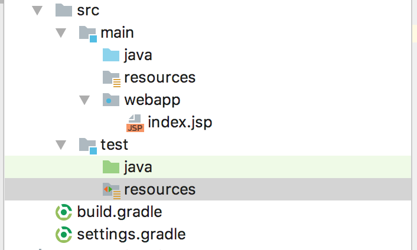  


2. build.gradle
```text
group 'caojx.learn'
version '1.0-SNAPSHOT'

//添加插件
apply plugin: 'java'
apply plugin: 'war'

sourceCompatibility = 1.7 //指定编译字节码的jdk版本

repositories {
    mavenCentral()
}

dependencies {
    testCompile group: 'junit', name: 'junit', version: '4.11'
}
```


### 2.2 构建脚本概要

**构建块**

Gradle构建中的两个基本概念是**项目**（project）和**任务**（task），每个构建至少包含一个项目，项目中包含一个或多个任务。在多项目构建中，一个项目可以依赖于其他项目；类似的，任务可以形成一个依赖关系图来确保她们的执行顺序。

**项目-任务 关系**

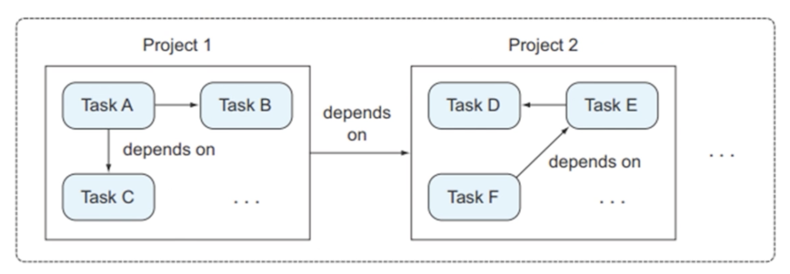  


**项目（project）**

一个项目代表一个正在构建的组件（比如一个jar文件），当构建启动后，Gradle会基于build.gradle实例化一个***org.gradle.api.Project***类，并且能够通过project变量使其隐式可用。 

项目几个重要的属性：  

-  group、name、version 组件的坐标，用于确定一个唯一的组件

项目中几个重要的方法：  

- apply 应用一个插件，是project上的一个方法

- dependencies 声明项目依赖于哪些jar或其它的项目

- repositories 声明仓库

- task 声明任务

属性的其他配置：  

- ext 这里定义的属性，之后我们可以直接引用
- gradle.properties 使用键值对的方式声明属性


**任务(task)**

任务对应***org.gradle.api.Task***类。主要包括任务的动作和任务依赖。任务定义了一个最小的工作单元。可以定义依赖于其他任务、动作序列和执行条件,任务是非必须的。

任务中的重要的方法：

- dependsOn 用于声明依赖
- doFirst 动作的最前编添加一个任务,可以存在多个
- doLast 动作的最后添加一个任务，可以存在多个
- << 追加数据


build.gradle案例：

```text
project.group 'caojx.learn'  //group属性在org.gradle.api.Project中所以隐式可用
version '1.0-SNAPSHOT'

//添加插件
apply plugin: 'java' //引入插件后，就可使用插件中的任务
apply plugin: 'war'

sourceCompatibility = 1.7 //指定编译字节码的jdk版本

repositories {
    mavenCentral()
}

dependencies {
    testCompile group: 'junit', name: 'junit', version: '4.11'
}
```


### 2.3 自定义任务

创建java目录结构

1. build.gradle

```groovy
project.group 'caojx.learn'  //group属性在org.gradle.api.Project中所以隐式可用
version '1.0-SNAPSHOT'

//添加插件
apply plugin: 'java' //引入插件后，就可使用插件中的任务
apply plugin: 'war'

sourceCompatibility = 1.7 //指定编译字节码的jdk版本

repositories {
    mavenCentral()
}

dependencies {
    testCompile group: 'junit', name: 'junit', version: '4.11'
}

//闭包，用于创建目录
def createDir = {
    path ->
        File dir = new File(path);
        if(!dir.exists()){
            dir.mkdirs();
        }
}

//自定义任务，创建Java目录结构
task makeJavaDir() {
    //定义java目录结构
    def paths = ['src/main/java','src/main/resources','src/test/java','src/test/resources'];

    //定义动作
    doFirst {
        paths.forEach(createDir);
    }
}

//自定义任务，创建web目录结构
task makeWebDir {
    dependsOn makeJavaDir
    //定义web的目录结构
    def paths = ['src/main/webapp','src/test/webapp'];

    //定义动作
    doLast {
        paths.forEach(createDir);
    }
}
```

创建自定义后,可以在IDEA的Gradle-Tasks中的**other**中看到我们自定义任务，执行对应的任务后就可以创建目录  

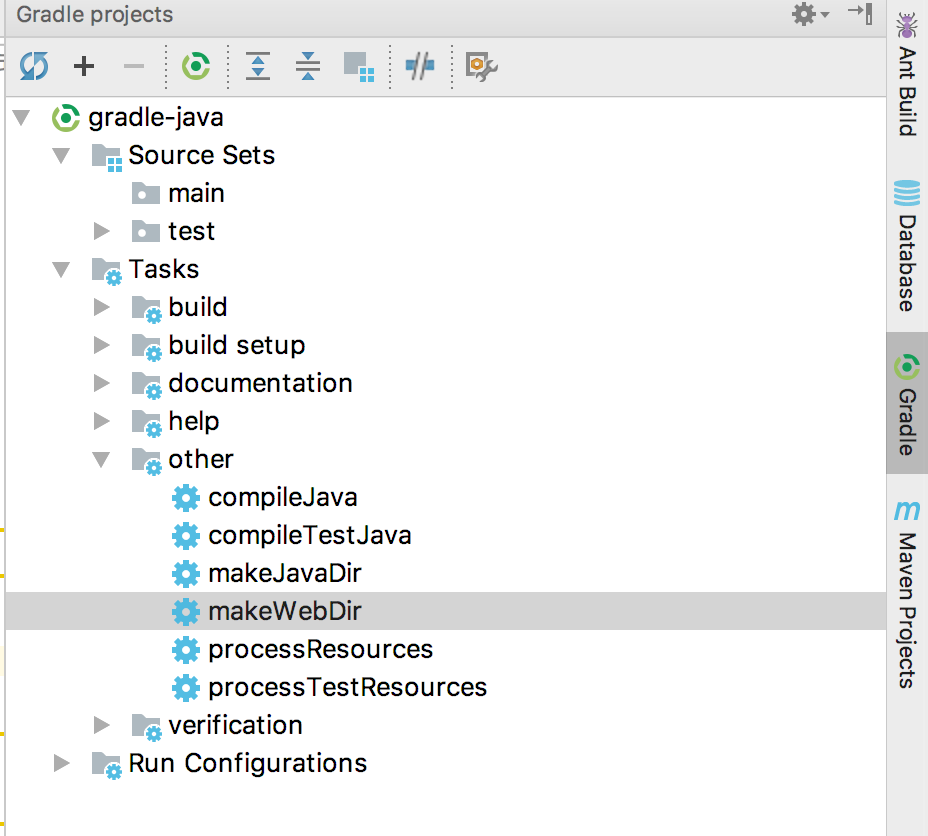  


### 2.4 构建生命周期

Gradle的构建主要分为三个阶段，初始化阶段->配置阶段->执行阶段

- 初始化阶段： Gradle会根据构建脚本创建一个项目（Project类）并且在构建脚本中隐式可用，在多项目构建中这个阶段同样很重要，其会初始化所有将要参与到构建中的项目。

- 配置阶段：生成Task的依赖顺序以及执行顺序，是根据配置代码来生成的。配置代码是除了动作代码之外都是配置代码，动作代码中不能编写配置代码。简单的理解，配置阶段主要是初始化任务。

- 执行阶段：主要就是执行动作代码，执行完成后一个构建就完成了。    

  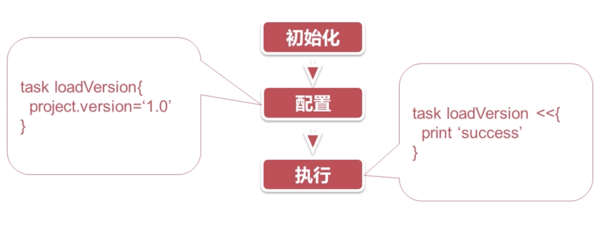       

gradle中还提供了Hook方法，我们可以在如下方法拦截到相应的执行阶段，由于平常使用的少，下边的这里不演示    

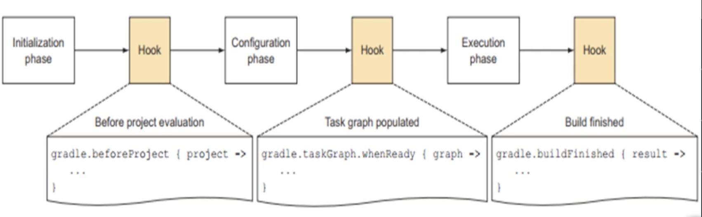    

### 2.5 依赖管理

**1. 概述**

几乎所有的基于JVM的软件项目都需要依赖外部类库来重用现有的功能。自动化的依赖管理可以明确依赖的版本，可以解决传递性依赖带来的版本冲突。  

**2. 坐标**

gradle底层使用的还是maven依赖仓库，同样使用

- group、name、version来确定唯一的一个jar包

**3. 仓库 **

仓库用于存放所需要jar，常用的仓库有

- mavenLocal  本地仓库
- mavenCentral/jcenter 公网仓库
- 自定义maven仓库，私服
- 文件仓库，本地机器上的路径也可以作为仓库，很少使用

**4. 依赖的传递性**

- B依赖A，如果C依赖B，那么C依赖A

**5. 依赖自动化管理**

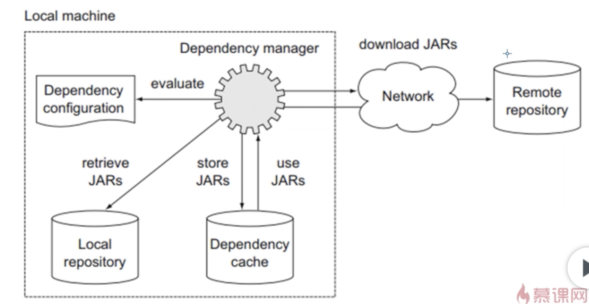  

**6. 依赖配置阶段**

源代码有两个阶段：   

- compile、runtime

测试代码的两个阶段：  

- testCompile、testRuntime

**7. 依赖阶段关系**

如下图可以看出：

运行时阶段都是扩展与编译时阶段。

- 也就是说编译阶段所依赖的jar包，在运行时都会依赖
- 如果在运行时依赖的，在编译时不会依赖
- 源代码依赖的测试代码都会依赖
- 测试代码依赖的，源代码不一定会依赖


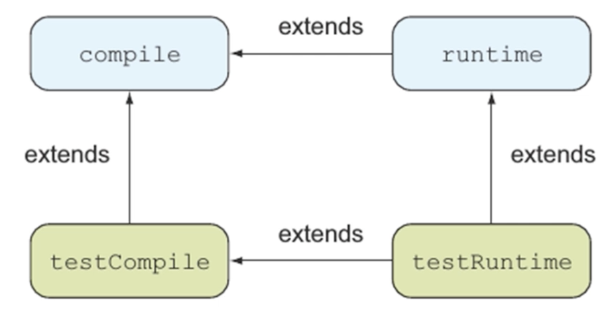  


gradle引入依赖：  

dependencies是org.aip.gradle.Project中的一个方法

maven引入依赖的写法有如下两种：

- 依赖范围 'group:name:version'
- 依赖范围 group: 'value', name:'value',version:'value'

```groovy
dependencies {
    compile 'ch.qos.logback:logback-classic:1.1.1'
    testCompile group: 'junit', name: 'junit', version: '4.11'
}
```


build.gralde文件：

```groovy
project.group 'caojx.learn'  //group属性在org.gradle.api.Project中所以隐式可用
version '1.0-SNAPSHOT'

//添加插件
apply plugin: 'java' //引入插件后，就可使用插件中的任务
apply plugin: 'war'

sourceCompatibility = 1.7 //指定编译字节码的jdk版本

//可以配置多个仓库，会按照配置顺序查找需要的jar，如果第一个仓库查找到了，就不会去第二个仓库查找
repositories {
/*    maven{
        url:'' //私服
    }*/
    mavenLocal()    //配置maven本地仓库
    mavenCentral()  //配置maven公共仓库

}

dependencies {
    compile 'ch.qos.logback:logback-classic:1.1.1' //写法一：'group:name:version',使用冒号分割协议
    testCompile group: 'junit', name: 'junit', version: '4.11' //写法二：group:'value',name:'value',version:'value' junit编译时依赖
}

//闭包，用于创建目录
def createDir = {
    path ->b
        File dir = new File(path);
        if(!dir.exists()){
            dir.mkdirs();
        }
}

//自定义任务，创建Java目录结构
task makeJavaDir() {
    //定义java目录结构
    def paths = ['src/main/java','src/main/resources','src/test/java','src/test/resources'];

    //定义动作
    doFirst {
        paths.forEach(createDir);
    }
}

//自定义任务，创建web目录结构
task makeWebDir {
    dependsOn makeJavaDir
    //定义web的目录结构
    def paths = ['src/main/webapp','src/test/webapp'];

    //定义动作
    doLast {
        paths.forEach(createDir);
    }
}
```

### 2.6 版本冲突解决

如2.5所示,我们引入了loback的1.1.1依赖，假如还有其他jar需要依赖logback，但是不是1.1.1版本的，就可能会出现依赖冲突。

```groovy
dependencies {
  compile group: 'org.hibernate', name: 'hibernate-core', version: '3.6.3.Final'
    testCompile group: 'junit', name: 'junit', version: '4.11'
}
```

在IDEA的Gradle窗口中执行Task->help->dependencies后可以看到依赖结构，org.hibernate:hibernate-core:3.6.3.Final依赖了org.slf4j:slf4j-api:1.5.8升级为1.6.1

```text
compile - Dependencies for source set 'main' (deprecated, use 'implementation ' instead).
\--- org.hibernate:hibernate-core:3.6.3.Final
     +--- antlr:antlr:2.7.6
     +--- commons-collections:commons-collections:3.1
     +--- dom4j:dom4j:1.6.1
     +--- org.hibernate:hibernate-commons-annotations:3.2.0.Final
     |    \--- org.slf4j:slf4j-api:1.5.8 -> 1.6.1
     +--- org.hibernate.javax.persistence:hibernate-jpa-2.0-api:1.0.0.Final
     +--- javax.transaction:jta:1.1
     \--- org.slf4j:slf4j-api:1.6.1
```

假如我们加入ch.qos.logback:logback-classic:1.1.1,由于其依赖的org.slf4j:slf4j-api是1.7.6,Gradle的默认解决方案是出现冲突使用最高版本。

```groovy
dependencies {
    compile group: 'org.hibernate', name: 'hibernate-core', version: '3.6.3.Final'
    compile 'ch.qos.logback:logback-classic:1.1.1'
    testCompile group: 'junit', name: 'junit', version: '4.11'
}
```

运行Task->help->dependencies后的依赖结构图：  

```text
compile - Dependencies for source set 'main' (deprecated, use 'implementation ' instead).
+--- org.hibernate:hibernate-core:3.6.3.Final
|    +--- antlr:antlr:2.7.6
|    +--- commons-collections:commons-collections:3.1
|    +--- dom4j:dom4j:1.6.1
|    +--- org.hibernate:hibernate-commons-annotations:3.2.0.Final
|    |    \--- org.slf4j:slf4j-api:1.5.8 -> 1.7.6
|    +--- org.hibernate.javax.persistence:hibernate-jpa-2.0-api:1.0.0.Final
|    +--- javax.transaction:jta:1.1
|    \--- org.slf4j:slf4j-api:1.6.1 -> 1.7.6
\--- ch.qos.logback:logback-classic:1.1.1
     +--- ch.qos.logback:logback-core:1.1.1
     \--- org.slf4j:slf4j-api:1.7.6
```

**手动解决冲突有两个方法**：

1. 排除传递性依赖
2. 强制指定一个版本

**解决冲突**

- 修改默认的解决策略

```groovy
//如果出现版本冲突则构建失败
configurations.all {
    resolutionStrategy {
        failOnVersionConflict()
    }
}
```

- 出现版本冲突后解决1

```groovy
//排除传递性依赖
dependencies {
  	//排除org.slf4j传递性依赖的时候module相当于name属性
    compile (group: 'org.hibernate', name: 'hibernate-core', version: '3.6.3.Final'){
        exclude group:'org.slf4j',module:'slf4j-api'
    }
    compile 'ch.qos.logback:logback-classic:1.1.1'
    testCompile group: 'junit', name: 'junit', version: '4.11'
}
```
依赖结构图：  
```text
compile - Dependencies for source set 'main' (deprecated, use 'implementation ' instead).
+--- org.hibernate:hibernate-core:3.6.3.Final
|    +--- antlr:antlr:2.7.6
|    +--- commons-collections:commons-collections:3.1
|    +--- dom4j:dom4j:1.6.1
|    +--- org.hibernate:hibernate-commons-annotations:3.2.0.Final
|    +--- org.hibernate.javax.persistence:hibernate-jpa-2.0-api:1.0.0.Final
|    \--- javax.transaction:jta:1.1
\--- ch.qos.logback:logback-classic:1.1.1
     +--- ch.qos.logback:logback-core:1.1.1
     \--- org.slf4j:slf4j-api:1.7.6
```

- 出现版本冲突后解决2

```groovy
//强制指定一个版本
configurations.all{
  resolutionStrategy {
    	force 'org.slf4j:slf4j-api:1.7.6'
  }
}
```

### 2.7 多项目构建

多项目构建是企业开发中经常使用的功能，下边我们开始了解多项目构建  

**项目模块化**

在企业项目中，包层次和类关系比较复杂，把代码查分成普通模块通常是最佳实践，这需要你清晰的划分功能边界，比如八业务逻辑和数据持久化拆分开来。项目符合高内聚低耦合是，模块化就变得很容易。

**配置需求**

- 1.所有项目应用Java插件
- 2.web子项目打包成war
- 3.所有项目添加logback日志功能
- 4.统一配置公共属性

根项目的build.gradle配置公共的属性，即可以配置满足1、3，对于第2点则在web模块中配置就可以，第4点配置公共属性需要在根项目中建立**gradle.properties**文件保存公共属性，文件名一定要为**gradle.properties**：

```groovy
project.group 'caojx.learn'  //group属性在org.gradle.api.Project中所以隐式可用
version '1.0-SNAPSHOT'

apply plugin: 'war'

//所有的项目包括子项目使用如下配置
allprojects {
    apply plugin: 'java'
    sourceCompatibility = 1.7
}

//所有子项目都使用的配置
subprojects {
    repositories {
        mavenCentral()  //配置maven公共仓库
    }
    dependencies{
        compile 'ch.qos.logback:logback-classic:1.1.1'
        testCompile group: 'junit', name: 'junit', version: '4.11'
    }
}
```

公共属性配置：

公共属性我们可以配置在ext属性中，也可以在根项目中建一个gradle.properties文件，将公共属性配置到文件中，然后根项目的build.gradle和子项目的build.gradle中都不用配置了

gradle.properties文件：

```properties
group='caojx.learn'
version='1.0-SNAPSHOT'
```

配置建议：

- 子项目可以依赖根项目的配置的配置就配置在根项目中

### 2.8 自动化测试

一些开源的测试框架比如JUnit，TestNG能够帮助你编写可以复用的结构化的测试，为了运行这些测试，你要先编译她们，就像编译源代码一样。测试代码的作用仅仅用于测试的情况，不应该被发布到生产环境中，需要把测试代码和源代码分开来。

**项目布局**

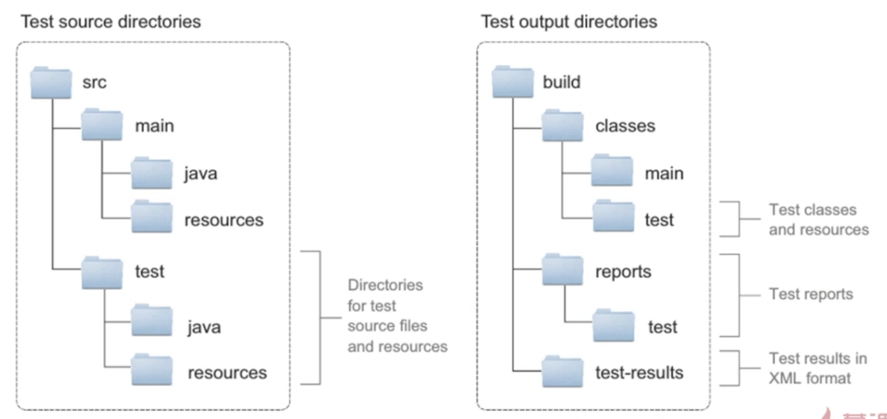  

**测试配置**

```groovy
    dependencies{
        testCompile group: 'junit', name: 'junit', version: '4.11'
    }
```

**测试任务流程**

如下测试流程大概是：编译源代码->编译测试代码->测试->校验->构建

```text
compileJava->processResources->classes->jar->compileTestJava->processTestResources->testClasses->test->check->build
```

**测试发现**

gradle可以自动发现测试代码，满足如下条件

- 任何继承自junit.framework.TestCase或groovy.util.GroovyTestCase的类
- 任何被@RunWith注解的类
- 任何一个类中包含@Test注解

TestGradle.java

如下类中包含@Test注解，测试的时候gradle会自动发现该测试类，会在构建之前执行

```java
public class TestGradle{
  @Test  
  public void test(){
    	System.out.println("Hello TestGradle");
  }
}
```

测试类在执行build之后会在build目录看到测试报告，有xml格式的TEST-TestGradle.xml和html格式的index.html

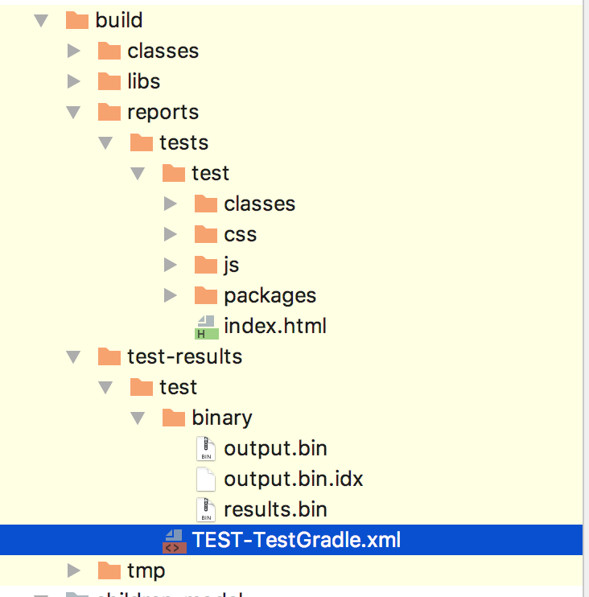  

index.html测试报告

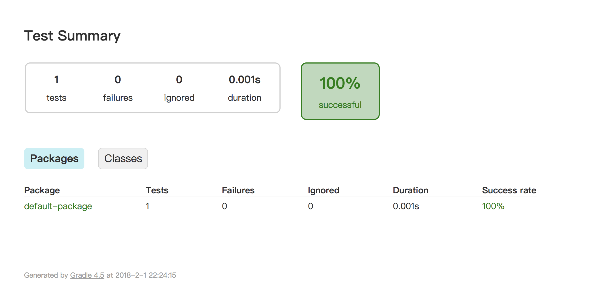  

### 2.9 发布

**发布到本地仓库和远程仓库流程**

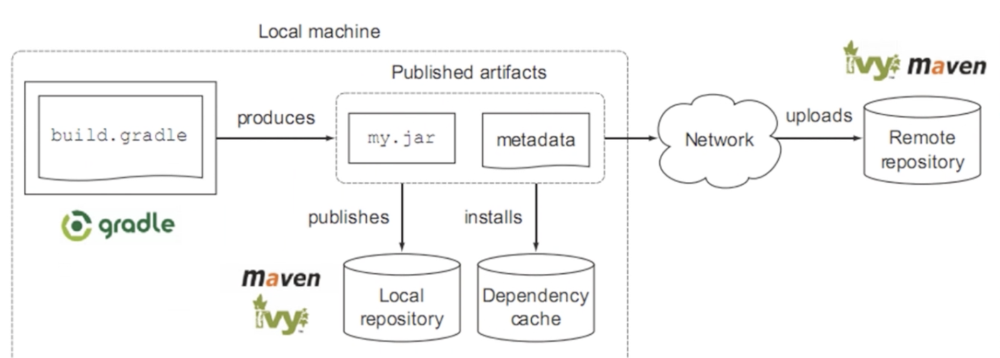  


gradle中的发布使用如下插件：

```groovy
apply plugin:'maven-publish' //使用该插件做发布
publishing{ //配置两个属性publications和repositories
  publications{
    maven(MavenPublication){//发布包maven可以所以指定其他名称
        groupId 'caojx.learn'//必须指定groupId
        artifactId 'gradle.java'
        version '1.0'
      	from components.java //指定将java产生的输出发布出去
    }
  }
  repositories{ //仓库
    maven{ //可以随意指定其他名称
      name 'myrepo'//仓库名称，可自定义
      url "" //仓库地址
    }
  }
}
```

 配置好发布配置后，就可以在IDEA的publishing中看到下图一样的内容，使用publishToMavenLocal可以将jar发布到本地仓库。

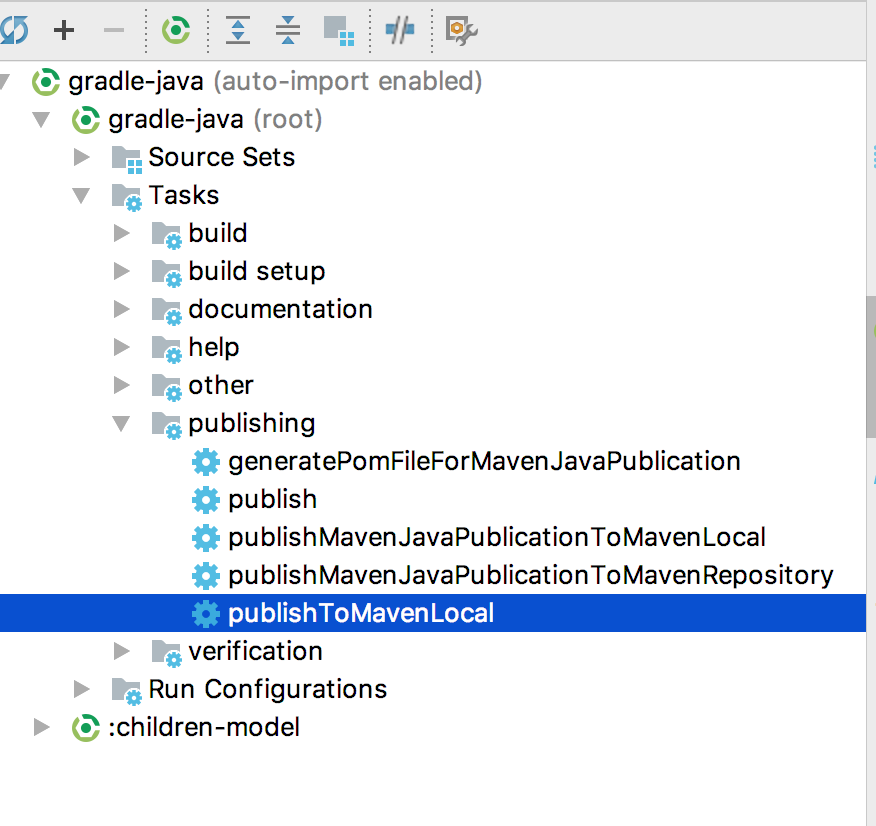  