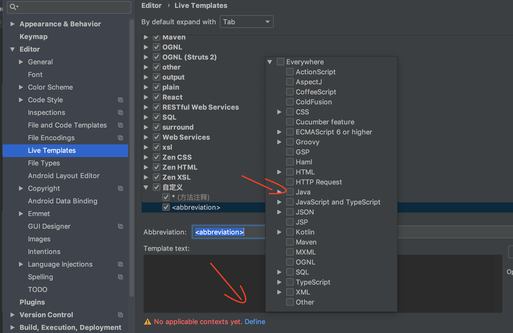
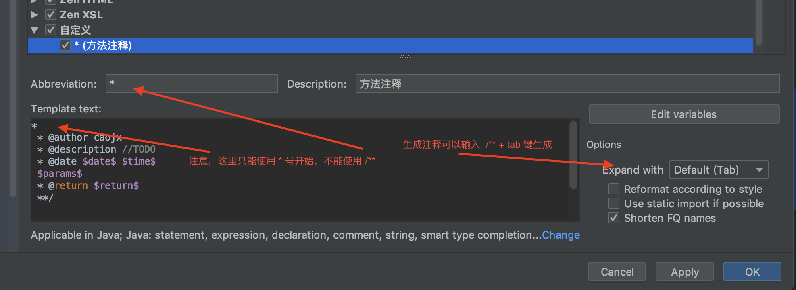
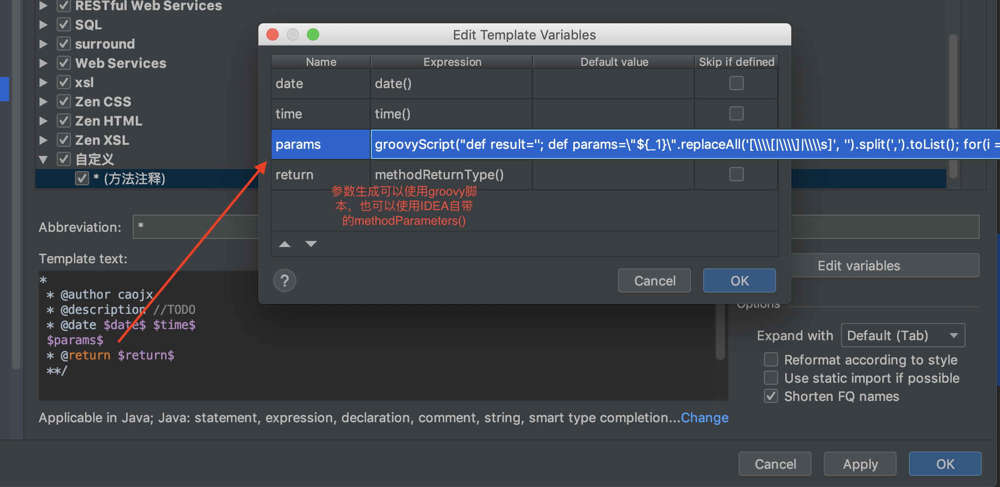
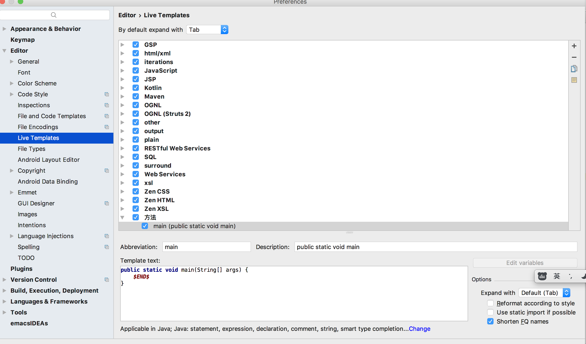
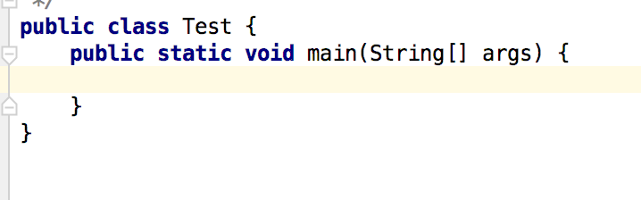
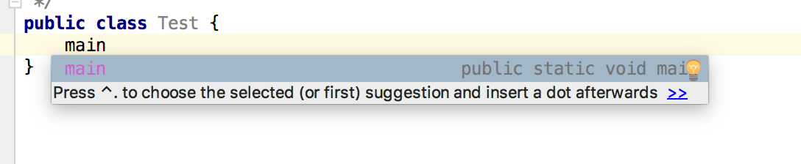
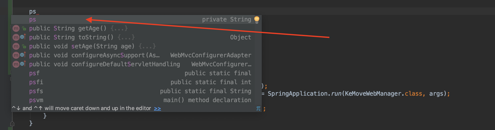

# IDEA自定义模板

[TOC]

IDEA可以自定义符合自己风格的模板注释，比如说 类模板注释、方法模板注释、属性模板注释或定制一些快捷生成代码操作等

## 一、IDEA类模板配置


### 1.1 Class代码模板设置 

File -> Setting -> Editor -> File and Code Templates -> Templates  Class 

```java
/**
 * \$Id: ${NAME}.java,v 1.0 ${DATE} ${TIME} caojx
 * 
 * @Copyright (c) ${DATE}, xxx All Rights Reserved.
 */
#if (${PACKAGE_NAME} && ${PACKAGE_NAME} != "")package ${PACKAGE_NAME};#end

/**
 * 类注释，描述 //TODO
 *
 * @author caojx
 * @version \$Id: ${NAME}.java,v 1.0 ${DATE} ${TIME} caojx
 * @date ${DATE} ${TIME}
 */
public class ${NAME} {
}
```

设置后新建Class的效果

```java
/**
 * $Id: Test.java,v 1.0 2018/7/13 下午3:22 caojx
 *
 * @Copyright (c) 2018/7/13,  xxx All Rights Reserved.
 */
package com.lianjia.cto.ke.model;

/**
 * 类注释，描述 //TODO
 * @author caojx
 * @version $Id: Test.java,v 1.0 2018/7/13 下午3:22 caojx
 * @date 2018/7/13 下午3:22
 */
public class Test {
}
```

### 1.2 Interface代码模板设置

```java
/**
 * \$Id: ${NAME}.java,v 1.0 ${DATE} ${TIME} caojx
 * 
 * @Copyright (c) ${DATE},  xxx All Rights Reserved.
 */
#if (${PACKAGE_NAME} && ${PACKAGE_NAME} != "")package ${PACKAGE_NAME};#end

/**
 * 类注释，描述 //TODO
 *
 * @author caojx
 * @version \$Id: ${NAME}.java,v 1.0 ${DATE} ${TIME} caojx
 * @date ${DATE} ${TIME}
 */
public interface ${NAME} {
}
```

### 1.3 Enum代码模板设置

```java
/**
 * \$Id: ${NAME}.java,v 1.0 ${DATE} ${TIME} caojx
 * 
 * @Copyright (c) ${DATE},  xxx All Rights Reserved.
 */
#if (${PACKAGE_NAME} && ${PACKAGE_NAME} != "")package ${PACKAGE_NAME};#end

/**
 * 类注释，描述 
 *
 * @author caojx
 * @version \$Id: ${NAME}.java,v 1.0 ${DATE} ${TIME} caojx
 * @date ${DATE} ${TIME}
 */
public enum ${NAME} {
}
```

#### 

## 二、IDEA方法模板配置

参考文章：

https://blog.csdn.net/weixin_42679529/article/details/81059598

https://blog.csdn.net/weixin_42230980/article/details/80757640

### 2. 1 配置注释模板

File-->Settings-->Editor-->Live Templates-->Template Group   		自定义

File-->Settings-->Editor-->Live Templates-->Template Group 			 Live Template

### 2.2 设置应用场景

**注意：应用场景要先设置，要先于 2.3   2.4**

  


### 2.3 编写自定义方法注释

**注意：** 注释只能以 \*  开头，不能以 /** 开头， 生成的时候可以使用 /**  + Tab  键生成

  


### 2.4 设置相关变量的表达式

对于方法参数的表达式IDEA提供了自带的methodParamters()，但是生成的效果可能不是我们想要的，我们可以换成Groovy脚本

```groovy
groovyScript("def result=''; def params=\"${_1}\".replaceAll('[\\\\[|\\\\]|\\\\s]', '').split(',').toList(); for(i = 1; i < params.size() +1; i++) {result+='* @param ' + params[i - 1] + ' ' + ((i < params.size()) ? '\\n ' : '')}; return result", methodParameters())
```





### 2.5 生成案例

groovy 脚本生成的参数风格

```java
/**
 * @author caojx
 * @description //TODO
 * @date 2018/11/7 11:52 AM
 * @param age 
 * @param name 
 * @return void
 **/
public void test(String age, String name) {

}
```

methodParamters() 自带模式生成的参数风格，自行尝试一下，风格大概如下

```java
/**
  * @author caojx
  * @description //TODO
  * @date 2018/11/7 12:49 PM
  * @params [age, name]
  * @return void
  **/
 public void test(String age, String name) {

 }
```


## 三、其他

### 3.1 添加main方法快捷模板

    
  
  

### 3.2 添加属性快捷模板


      