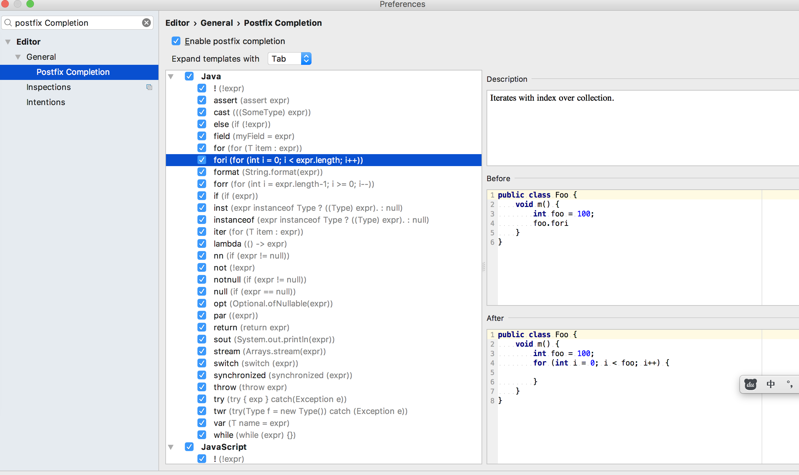
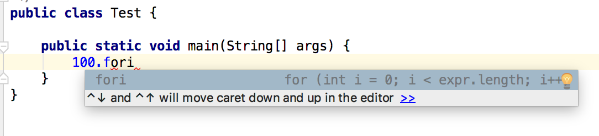
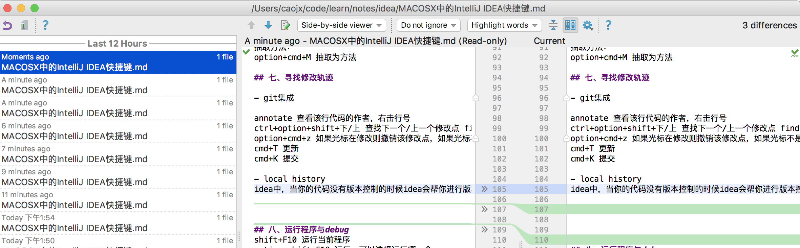
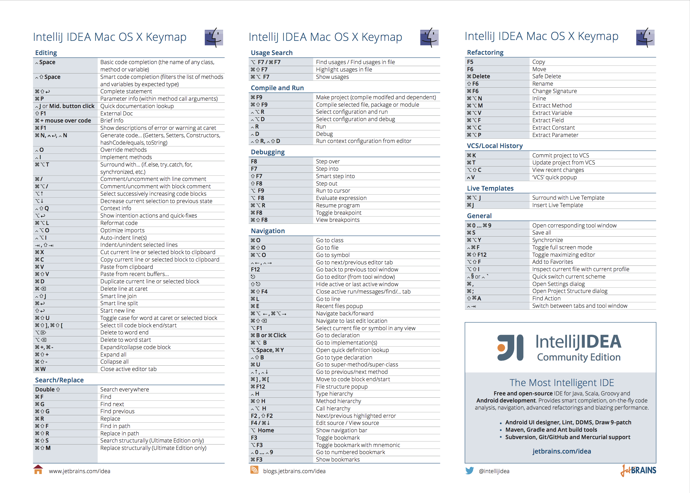

# Mac OS X中的IntelliJ IDEA快捷键

提示第一节到第十一节快捷键使用的KeyMap=Max OS X，第十二节的图的keyMap=Mac OS X 10.5+的快捷键

[toc]

## 一、无处不在的跳转  

- 项目之间的跳转     
option+cmd+] 跳转到下一个项目窗口  （Window）  
option+cmd+[ 跳转到上一个项目窗口   

- 视图切换  
cmd + 数字 视图区域对应的数字 各视图区域的切换    
esc 跳转回文件区  

- 文件之间的跳转    
cmd+E 查找最近打开过的文件  
cmd+shift+E 查找最近编辑过的文件     
shift+cmd+delete 跳回最近编辑过的地方  （Navigate）  
option+cmd+<- 跳转回上一个浏览的地方   （Navigate）  
option+cmd+-> 跳转回下一个浏览的地方   （Navigate）  

- 利用书签跳转  
shift+F11  显示书签  
F11 添加或移除书签  
cmd+F11 添加带标记的书签或移除书签  
ctrl+1 跳到书签1，同样ctrl+n跳到书签n  
ctrl+shift+n 取消或标记当前书签并带上数字  

- 收藏位置和文件  
cmd+2 打开Favorites  
option+shift+F 将文件或其它（class，method..）添加到Favorites  

## 二、精准搜索
cmd+N 查找类class,连续按两下可以查找jar包中的类    
cmd+shift+N 查找文件    
option+shift+cmd+N 查找方法    
ctrl+shift+F 查找字符串    

## 三、列操作

ctrl+cmd+G 定位光标所在处的单词的所有出现，可以一起编辑  

## 四、live template

使用Live Template定义一些常用的方法可以快速生成方法   
 
find action中搜索live templates,进入设置或在settings中查找   
Live Templates -> Template Group(添加组或使用原有组) -> Live Template      

如下添加main方法快捷模板  
  
  
  

## 五、postfix
使用该功能我们可以在某些地方敲击一个点就可以出现代码提示快速生成，该功能更live templates有点像，但是这个是系统自带的，不可以编辑  

find action 搜索postfix Completion或settings中查找    
  

foo.fori  
比如我们可以快速生成for循环：    
    
  

foo.sout输出  
"name".sout ==> System.out.println("name");  

其他：  
foo.filed 将局部变量升级为属性  
foo.return 返回  
foo.nn 判空   
  
其他的就不列举了，查看postfix Completion    

## 五、重构和抽取

- 重构  
shift+F6 重构变量    
cmd+F6 或alter+enter 重构方法    

- 抽取  
抽取变量：    
option+cmd+V 抽取为变量    
option+cmd+C 抽取为常量  
option+cmd+F 抽取为属性  
option+cmd+P 抽取为参数  

抽取方法：  
option+cmd+M 抽取为方法  

## 六、寻找修改轨迹

- git集成  

annotate 查看该行代码的作者，右击行号     
ctrl+option+shift+下/上 查找下一个/上一个修改点 find action 中搜索 Previous Change    
option+cmd+z 如果光标在修改则撤销该修改点，如果光标不是在修改点中可以撤销整个文件的修改，如果在文件夹上可以撤销整个文件夹的修改        
cmd+T 更新  
cmd+K 提交  

- local history    

idea中，当你的代码没有版本控制的时候idea会帮你进行版本控制    

show history 在find action中搜索show history，可以看到本地文件的修改历史      
  

put label 可以提交local history中提交一个本地修改标签  

## 七、运行程序与debug 
shift+F10 运行当前程序    
option+shift+F10 运行，可以选择运行哪一个       

shift+F9 调试当前程序  
option+shift+F9 调试,可以选择调试哪一个     
cmd+F2 停止  
ctrl+F5 重启  
   
F7 单步进入    
F8 单步跳过   
option+F9 运行到光标处    
F9 跳过本次debug    

cmd+F8 添加或取消断点  
option+F8 计算表达式    
shift+cmd+F8 查看所有的断点    

## 八、结构图
cmd+F12 查看当前field，method大纲，查看文件结构  

shift+option+cmd+U 查看maven依赖，类图，光标需要在pom.xml文件上生效，快捷键在类上使用可以查看类图大纲  
cmd+F 可以很快在复杂的maven依赖图中快速找到依赖  

ctrl+H 查看类集成结构  
ctrl+option+H 查看方法调用层次   

ctrl+上/下 上一个或下一个方法  
option+cmd+B 查看实现  
cmd+U super method/class  

## 十、文件操作

ctrl+option+N 在当前文件夹下新建文件   

F5 复制当前文件到指定目录  
F6 移动当前文件到指定目录  

cmd+C 复制文件名，光标需要到文件上    
cmd+shift+C 复制文件完整路径  
shift+cmd+v 一次性复制多个文件名或路径的时候，idea会将复制的文件名或路径方到剪切板，使用这个快捷键我们可以调出剪切板    

## 十一、其他

cmd+; 调出项目setting界面     
cmd+, 调出setting界面    
cmd+f4 关闭当前界面  
cmd+G 跳转到指定行列 行号:列号      

shift+option + -> 选中右边的单词      
shift+option + <- 选中左边边的单词      

option+cmd+L 格式化代码      
shift+cmd+A 查找设置help      

alter+enter 快速修复（导包，修复拼写错误，实现方法等）      

## 十二、查看IDEA默认的快捷键
上边使用的是Mac OS X的KeyMap,下图的KeyMap是Mac OS X10.5+的，该图可以在IDEA中的Find Action中搜索Keymap Reference中调出   
   
