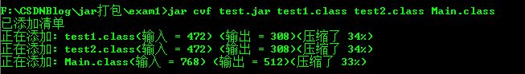
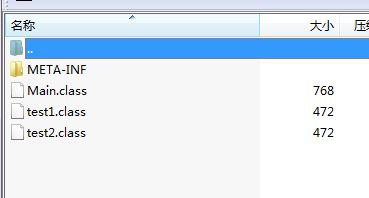
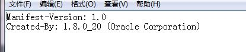
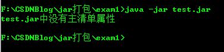
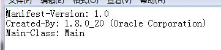
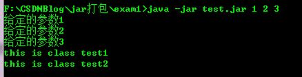
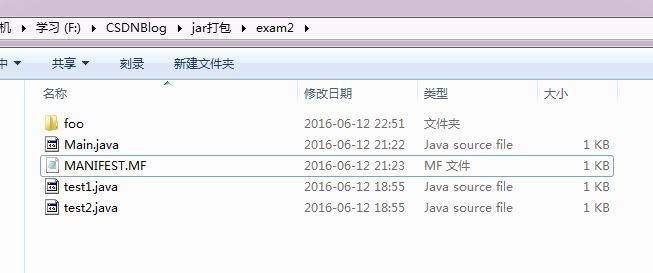
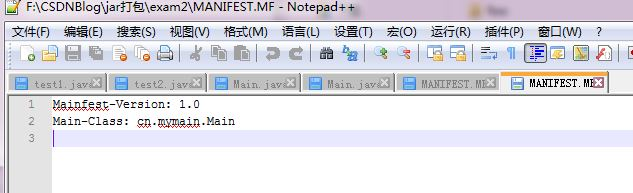
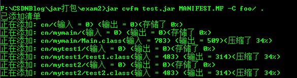
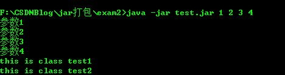

# Java打jar包

[TOC]

转载[http://blog.csdn.net/allocator/article/details/51704846](http://blog.csdn.net/allocator/article/details/51704846)

1. jar包打包实现
2. 第一种简单的打包方式
3. 第二种打包方式
4. MANIFEST文件介绍
5. 小结

## 一、jar包打包实现

jar包打包可以使用jar指令实现打包，在命令行中输入jar可以查看jar指令的内容   
jar指令    
```text
用法: jar {ctxui}[vfmn0PMe] [jar-file] [manifest-file] [entry-point] [-C dir] files ...
选项:
    -c  创建新档案
    -t  列出档案目录
    -x  从档案中提取指定的 (或所有) 文件
    -u  更新现有档案
    -v  在标准输出中生成详细输出
    -f  指定档案文件名
    -m  包含指定清单文件中的清单信息
    -n  创建新档案后执行 Pack200 规范化
    -e  为捆绑到可执行 jar 文件的独立应用程序
        指定应用程序入口点
    -0  仅存储; 不使用任何 ZIP 压缩
    -P  保留文件名中的前导 '/' (绝对路径) 和 ".." (父目录) 组件
    -M  不创建条目的清单文件
    -i  为指定的 jar 文件生成索引信息
    -C  更改为指定的目录并包含以下文件
如果任何文件为目录, 则对其进行递归处理。
清单文件名, 档案文件名和入口点名称的指定顺序
与 'm', 'f' 和 'e' 标记的指定顺序相同。

示例 1: 将两个类文件归档到一个名为 classes.jar 的档案中: 
       jar cvf classes.jar Foo.class Bar.class 
示例 2: 使用现有的清单文件 'mymanifest' 并
           将 foo/ 目录中的所有文件归档到 'classes.jar' 中: 
       jar cvfm classes.jar mymanifest -C foo/ .
```

从最后显示的两个示例看出存在两种打包的方法，两者的区别就是是否使用自己定义的MANIFEST清单文件。第一个示例没有使用MANIFEST文件进行打包，  
所以最终生成的jar包中MANIFEST文件为默认文件，这种方式适用于比较简单的jar包结构，不存在其他jar包依赖以及生成的jar包不需要可执行。  
这种方式生成的jar包不能使用java -jar XXX.jar命令执行，因为MANIFEST文件中未指定程序入口。而第二个实例是比较常用的打包方式，即是使用自定  
义的MANIFEST文件参与打包，这样能够实现往包中添加依赖，并且可以指定程序入口，实现java -jar XXX.jar 直接运行jar包。  

## 二、第一种简单的打包方式    

最简单的就是在当前文件夹下将编译的class字节码文件进行打包输出。示例如下:     
编写三个java文件，test1.java test2.java 以及Main.java    
test1.java
```java
public class test1
{
    public static void main(String[] args)
    {
    }
    public void display()
    {
        System.out.println("this is class test1");
    }
}
```

以及test2.java 文件  
```java
public class test2
{
    public static void main(String[] args)
    {
    }
    public void display()
    {
        System.out.println("this is class test2");
    }
}
```

Main.java    
```java
public class Main
{
    public static void main(String[] args)
    {
        for(String a:args)
        {
            System.out.println("给定的参数"+a);
        }
        test1 t1 = new test1();
        t1.display();
        test2 t2 = new test2();
        t2.display();
    }
}
```
命令行下将这三个文件进行编译，使用javac命令实现编译。     
  

用jar指令将编译的class文件打包   
    

打包过程中有显示已添加清单。用解压工具打开生成的test.jar包，可以看到如下的结构:     
  

除了编译的三个class文件外多了一个META-INF文件夹，里面有一个MANIFEST.MF(清单文件)的文件，这个文件的作用非常重要，后面说明。我们先看它里面的内容     
  

非常简单的清单，只包含清单版本与java版本。   
这个时候执行java -jar test.jar有如下效果:   
  

没有主清单属性报错。这是因为我们使用第一种方法生成jar使用了默认的清单，默认清单没有指定程序入口，所以出错。   
可以直接更改jar包中的MANIFEST文件(解压工具打开，更改后保存)，改成如下效果:   
  

再一次执行java -jar test.jar 后程序输入正确内容:   
  

在MANIFEST文件中添加了Main-Class属性指定了程序入口，实现了直接执行jar文件。   
所以说使用默认的MANIFEST是不能直接执行jar文件，要么使用自己定义的MANIFEST文件打包，要么更改包中的MANIFEST文件。  

## 三、第二种打包方式

第二种打包方式更加通用，一般情况下java文件第一行都是package XXX;即是包名，也决定了编译后的class文件存在的路径。当有多个java文件要编译    
打包并且他们存在不同的包名时，如果还是按照第一种方法打包时一个文件一个文件的写非常不现实，所以有了第二种方法。将所有要打包的class文件存在    
的目录以及依赖的jar包全部放在一个根文件夹里面(比如是foo)，然后编写MANIFEST清单文件，指定程序入口以及其他添加的依赖的jar包。在执行指令：     

  

注意 上面的指令中foo/ 文件夹后面有一个空格还有一个点   
下面看一个例子   
同样还是test1.java与test2.java以及Main.java 但是各自有自己的包名。  
```java
package cn.mytest1;
public class test1
{
    public static void main(String[] args)
    {
    }
    public void display()
    {
        System.out.println("this is class test1");
    }
}
```

```java
package cn.mytest2;
public class test2
{
    public static void main(String[] args)
    {
    }
    public void display()
    {
        System.out.println("this is class test2");
    }
}
```

```java
package cn.mymain;
import cn.mytest1.test1;
import cn.mytest2.test2;
public class Main
{
    public static void main(String[] args)
    {
        for(String item:args)
        {
            System.out.println("传递参数"+item);
        }
        test1 t1 = new test1();
        test2 t2 = new test2();
        t1.display();
        t2.display();
    }
}
```


同样使用javac 指令编译，三个class文件存在于不同的路径下，因为他们包名不一样。把编译号的含有class文件的文件夹全部放在foo文件夹下： 

  

然后在foo 外面写一个MANIFEST文件：   
  

MANIFEST内容如下:   
  

注意:MANIFEST 文件最后一行是空行。   
命令行下执行指令:jar cvfm test.jar MANIFEST.MF -C foo/ .   
  

在命令行下测试jar包是否能够直接运行了，使用指令java -jar test.jar   
  

正确打包，成功运行jar.  
MANIFEST文件介绍  

通过上面的两个例子，可以看到MANIFEST文件对于jar打包都是必须的。MANIFEST文件描述了打包后的jar文件的详细信息，存在于打包后的META-INF   
的文件夹.一个简单的MANIFEST文件主要内容如下：   
manifest实例  

主要就是Manifest-Version Main-Class Class-Path这三个属性在制作jar包时非常重要.Manifest-Version 是版本号，照着写就行。  
Main-Class则是jar包的入口程序，指定运行的类的全称(一定要包含包名)，这样可以使用java -jar name.jar直接运行jar包。  
第三个Class-Path是指的打包时需要依赖的其他jar包，打包的时候自己的程序中也可能含有其他的jar包所以要添加依赖。   
注意每个MANIFEST属性冒号与内容之间都有一个空格，并且写完后最后还要留有一行空行，不然运行时还是出现找不到主清单属性的错误  

##  四、jar包解压后再打成jar

如下边我

```shell
#ls -l newchnl-common-0.0.1-SNAPSHOT.jar 
-rw-r--r--  1 caojx  staff  739432  3  7 10:31 newchnl-common-0.0.1-SNAPSHOT.jar
#jar命令解压不能解压到指定目录，使用unzip可以将jar包解压到指定的目录
#unzip newchnl-common-0.0.1-SNAPSHOT.jar -d newchnl-common-0.0.1-SNAPSHOT

#解压后打包成jar
#cd newchnl-common-0.0.1-SNAPSHOT  #一定要进入解压后的目录里边再打jar包
#jar -cvf newchnl-common-0.0.1-SNAPSHOT.jar *
```

## 五、其他
解压jar
```text
jar -xvf test.jar
```
## 六、小结

jar文件打包容易出错的地方就是Manifest清单文件的编写，容易出一些格式上的错误比如属性的冒号和内容之间少空格，Class-Path中添加依赖之间没有空格，  
依赖文件过多，多行书写的时候每行开头没加空格，文件最后一行没有空行等等。写MANIFEST文件的时候注意这些关键的地方就不会在打包上面耗费太多的时间。

参考：  
1. [https://www.cnblogs.com/mq0036/p/3885399.html](https://www.cnblogs.com/mq0036/p/3885399.html)  
2. [http://blog.csdn.net/allocator/article/details/51704846](http://blog.csdn.net/allocator/article/details/51704846)
