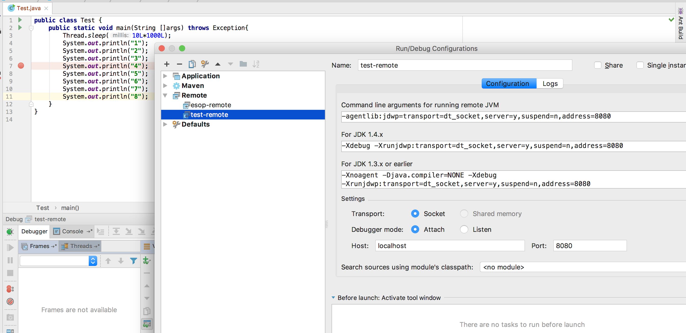
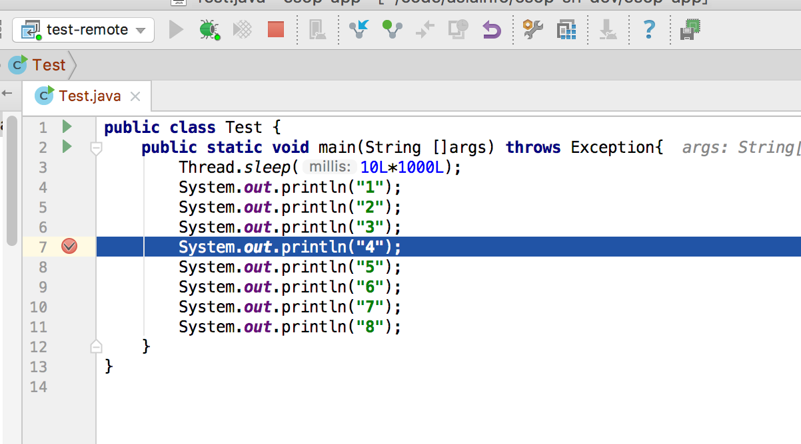

# Java远程debug调试
Java远程调试的原理是两个VM之间通过debug协议进行通信，然后以达到远程调试的目的。两者之间可以通过socket进行通信。  
首先被debug程序的虚拟机在启动时要开启debug模式，启动debug监听程序。jdwp是Java Debug Wire Protocol的缩写。  

在启动程序时，将以下参数选项添加到自定义的命令行中，程序就会以支持RemoteDeubg的方式启动。    
```text
-agentlib:jdwp=transport=dt_socket, address=8080,server=y,suspend=n  
```
dt_socket：使用的通信方式    
address：地址和端口，地址可以省略，两者用冒号分隔，这里我使用的远程调试的端口是8080    
server：是主动连接调试器还是作为服务器等待调试器连接    
suspend：是否在启动JVM时就暂停，并等待调试器连接  


## 一、Java代码远程调试

下边演示纯java方式启动的远程debug调试

### 1.1 Test.java

```java
public class Test {
    public static void main(String []args) throws Exception{
        Thread.sleep(10L*1000L);
        System.out.println("1");
        System.out.println("2");
        System.out.println("3");
        System.out.println("4");
        System.out.println("5");
        System.out.println("6");
        System.out.println("7");
        System.out.println("8");
    }
}
```

### 1.2 服务端启动
```text
javac Test.java //编译
java -agentlib:jdwp=transport=dt_socket,address=8080,server=y,suspend=n Test //启动远程debug模式
```

提示：
上边的启动方式是1.5之后的方式，如果是1.5之前的启动方式，如下：
```text
java -Xdebug -Xrunjdwp:transport=dt_socket,server=y,suspend=n,address=8080 Test 
```
### 1.3 本地配置

1.Test.java
```java
public class Test {
    public static void main(String []args) throws Exception{
        Thread.sleep(10L*1000L);
        System.out.println("1");
        System.out.println("2");
        System.out.println("3");
        System.out.println("4");
        System.out.println("5");
        System.out.println("6");
        System.out.println("7");
        System.out.println("8");
    }
}
```
注意：  
a. 本地代码和远程代码尽可能一致，可以有少量的差异。  
b. 本地代码与远程代码包名必须一致（我在测试过程中就是因为包不一致失败了）。  

2.IntelliJ IDEA  

这里使用的是IDEA，你也可以使用Eclipse  
a.添加Remote,配置好对应的host和port（这里对应的是address 8080）


b.debug方式启动remote  



总结：  
从上边的结果可以看出，我们启动服务端的代码，在本地成功的debug了，当然这里我都是在本机进行的，如果你的是远程服务器，将host跟port修改成服务器
的地址和端口就可以了。  

## 二、Tomcat启动远程调试

tomcat的catalina.sh文件中可以看到如下内容  
### 2.1 catalina.sh  

```text
# -----------------------------------------------------------------------------
# Control Script for the CATALINA Server
#
# Environment Variable Prerequisites
#
#   Do not set the variables in this script. Instead put them into a script
#   setenv.sh in CATALINA_BASE/bin to keep your customizations separate.
#
#   CATALINA_HOME   May point at your Catalina "build" directory.
#
#   CATALINA_BASE   (Optional) Base directory for resolving dynamic portions
#                   of a Catalina installation.  If not present, resolves to
#                   the same directory that CATALINA_HOME points to.
#
#   CATALINA_OUT    (Optional) Full path to a file where stdout and stderr
#                   will be redirected.
#                   Default is $CATALINA_BASE/logs/catalina.out
#
#   CATALINA_OPTS   (Optional) Java runtime options used when the "start",
#                   "run" or "debug" command is executed.
#                   Include here and not in JAVA_OPTS all options, that should
#                   only be used by Tomcat itself, not by the stop process,
#                   the version command etc.
#                   Examples are heap size, GC logging, JMX ports etc.
#
#   CATALINA_TMPDIR (Optional) Directory path location of temporary directory
#                   the JVM should use (java.io.tmpdir).  Defaults to
#                   $CATALINA_BASE/temp.
#
#   JAVA_HOME       Must point at your Java Development Kit installation.
#                   Required to run the with the "debug" argument.
#
#   JRE_HOME        Must point at your Java Runtime installation.
#                   Defaults to JAVA_HOME if empty. If JRE_HOME and JAVA_HOME
#                   are both set, JRE_HOME is used.
#
#   JAVA_OPTS       (Optional) Java runtime options used when any command
#                   is executed.
#                   Include here and not in CATALINA_OPTS all options, that
#                   should be used by Tomcat and also by the stop process,
#                   the version command etc.
#                   Most options should go into CATALINA_OPTS.
#
#   JAVA_ENDORSED_DIRS (Optional) Lists of of colon separated directories
#                   containing some jars in order to allow replacement of APIs
#                   created outside of the JCP (i.e. DOM and SAX from W3C).
#                   It can also be used to update the XML parser implementation.
#                   Defaults to $CATALINA_HOME/endorsed.
#
#   JPDA_TRANSPORT  (Optional) JPDA transport used when the "jpda start"
#                   command is executed. The default is "dt_socket".
#
#   JPDA_ADDRESS    (Optional) Java runtime options used when the "jpda start"
#                   command is executed. The default is 8000.
#
#   JPDA_SUSPEND    (Optional) Java runtime options used when the "jpda start"
#                   command is executed. Specifies whether JVM should suspend
#                   execution immediately after startup. Default is "n".
#
#   JPDA_OPTS       (Optional) Java runtime options used when the "jpda start"
#                   command is executed. If used, JPDA_TRANSPORT, JPDA_ADDRESS,
#                   and JPDA_SUSPEND are ignored. Thus, all required jpda
#                   options MUST be specified. The default is:
#
#                   -agentlib:jdwp=transport=$JPDA_TRANSPORT,
#                       address=$JPDA_ADDRESS,server=y,suspend=$JPDA_SUSPEND
#
#   JSSE_OPTS       (Optional) Java runtime options used to control the TLS
#                   implementation when JSSE is used. Default is:
#                   "-Djdk.tls.ephemeralDHKeySize=2048"
#
#   CATALINA_PID    (Optional) Path of the file which should contains the pid
#                   of the catalina startup java process, when start (fork) is
#                   used
#
#   LOGGING_CONFIG  (Optional) Override Tomcat's logging config file
#                   Example (all one line)
#                   LOGGING_CONFIG="-Djava.util.logging.config.file=$CATALINA_BASE/conf/logging.properties"
#
#   LOGGING_MANAGER (Optional) Override Tomcat's logging manager
#                   Example (all one line)
#                   LOGGING_MANAGER="-Djava.util.logging.manager=org.apache.juli.ClassLoaderLogManager"
#
#   USE_NOHUP       (Optional) If set to the string true the start command will
#                   use nohup so that the Tomcat process will ignore any hangup
#                   signals. Default is "false" unless running on HP-UX in which
#                   case the default is "true"
# -----------------------------------------------------------------------------
``` 

### 2.2 启动远程方式如下  
    
1.方式1  
```shell
../bin/catalina.sh jpda start
```
其中JPDA_OPTS的解释中，说到在启动catalina.sh脚本的时候加上jpda start参数就可以启动远程调试，这种方式会加上默认的远程调试参数，端口是8000，
即tomcat  


2.方式2    
linux系统，在catalina.sh中：  
在catalina.sh的开头加上如下内容，这时候可以直接执行catalina.sh脚本  
```shell
CATALINA_OPTS=-agentlib:jdwp=transport=dt_socket, address=8080,server=y,suspend=n
```

windows系统中,在catalina.bat中：  
```shell
SET CATALINA_OPTS=-agentlib:jdwp=transport=dt_socket, address=8080,server=y,suspend=n
```

提示：本地配置在IDEA或Eclipse中启动调试的方式同 章节"一、Java代码远程调试"


参考文章：  
1. [http://blog.csdn.net/wenqisun/article/details/52298551](http://blog.csdn.net/wenqisun/article/details/52298551)    
2. [https://www.cnblogs.com/lailailai/p/4560399.html](https://www.cnblogs.com/lailailai/p/4560399.html)  
3. [https://www.cnblogs.com/dyllove98/archive/2013/08/01/3230824.html](https://www.cnblogs.com/dyllove98/archive/2013/08/01/3230824.html)  
4. [http://www.blogjava.net/yongbing/articles/221179.html](http://www.blogjava.net/yongbing/articles/221179.html)  
5. [https://www.cnblogs.com/sky233/articles/6664024.html](https://www.cnblogs.com/sky233/articles/6664024.html)  