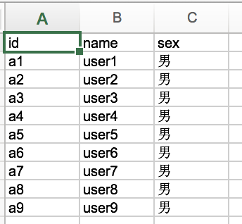
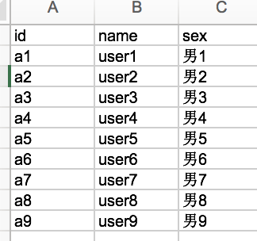

# Java实现Excel导入导出
[TOC]

## 一、Excel解析的集中实现方式
1. POI
2. JXL
3. FastExcel

提示：本节只介绍POI和JXL对Excel的读写  
源码： https://github.com/caojx-git/learn/tree/master/code/excel-java  

### 1.1 POI
Apache POI是Apache软件基金会的开放源码函式库，POI提供API给Java程序对Microsoft Office格式档案的度和写的功能，功能非常强大，我们使用其中的HSSF（Horrible SpreadSheet Format），即"讨厌的电子表格格式"。通过HSSF，你可以用纯Java代码来读取、写入、修改Excel文档。  

其中POI主要提供了如下功能：  
- **HSSF**  读写Microsoft Excel格式档案的功能,即（97~2003，结尾是.xls格式的excel）。  
- **XSSF** 读写Microsoft Excel OOXML格式档案的功能（2007以上excel的,结尾.xlsx）。  
- **HWPF** 读写Microsoft Word格式档案的功能。  
- **HSLF** 读写Microsoft PowerPoint格式档案的功能。  
- **HDFG** 读写Microsoft Visio格式档案的功能。  

### 1.2 iText
通过iText不仅可以生成PDF或rtf的文档，而且可以将XML、Html文件转化为PDF文件，使用起来相对简单，这点作为一个扩充，本文主要介绍Excel的读写。  

### 1.3 JXL
Java Excel是一个开放源码项目，可以读取Excel文件的内容，创建新的Excel文件，更新已经存在的Excel文件,包括常见格式的设置如：字体、颜色、背景、合并单元格等。  

### 1.4 POI与JXL对比
| POI                    | JXL                   |
| ---------------------- | --------------------- |
| 效率高                    | 效率低                   |
| 操作相对复杂                 | 操作简单                  |
| 支持公式，宏，图像图表一些企业应用上非常实用 | 部分支持                  |
| 能够修饰单元格属性              | 能够修饰单元格属性，格式支持不如POI强大 |
| 支持字体、数字、日期操作           | 支持字体、数字、日期操作          |

### 1.5 FastExcel
FastExcel是一个采用纯java开发的Excel文件读写的组件，支持Excel 97-2003文件格式。  
FastExcel只能读取单元格的字符信息，而其他属性入颜色，字体等就不怎么支持了，因此FastExcel只需要很小的内存。 

### 1.6 提要
在编码之前我们先知道如下知识点：  
- 工作薄：相当于Excel文件  
- 工作表：sheet,Excel文件中的sheet  
- 行记录：Row,即sheet中的一行  
- 单元格：Cell,即sheet中的一个单元格  

## 二、JXL读写Excel编码实现
### 2.1 maven依赖

```xml
<dependency>
  <groupId>net.sourceforge.jexcelapi</groupId>
  <artifactId>jxl</artifactId>
  <version>2.6.12</version>
</dependency>
```
### 2.2 JXL创建Excel  
目前，jxl对于excel的读写不支持07以上的Office Excel格式，即支持.xls格式不支持.xlsx格式，如果需要支持.xlsx格式需要使用POI。

1. JxlWriteExcel.java   
  JXL方式创建Excel

  ```java
  package excel.jxl;

  import jxl.Workbook;
  import jxl.write.Label;
  import jxl.write.WritableSheet;
  import jxl.write.WritableWorkbook;
  import jxl.write.WriteException;
  import jxl.write.biff.RowsExceededException;

  import java.io.File;
  import java.io.IOException;

  /**
   * POI创建Excel，格式是.xls，不支持2007+以上的Excel，即不支持.xlsx结尾的Excel
   */
  public class JxlWriteExcel {

      /**
       * JXL创建Excel文件
       * @param args
       */
      public static void main(String[] args) {
          //定义标题
          String[] title = {"id","name","sex"};
          //1.创建一个Excel文件
          File file = new File("jxl_test.xls");
          try {
              file.createNewFile();
              //2.创建工作薄
              WritableWorkbook workbook = Workbook.createWorkbook(file);
              //3.创建sheet
              WritableSheet sheet = workbook.createSheet("sheet1",0);

              //4.设置标题
              Label label = null;
              for (int i = 0; i < title.length; i++) {
                  label = new Label(i,0,title[i]); //三个参数分别为：所在列、所在行，数据值
                  //将标题设置到对应的sheet中的单元格
                  sheet.addCell(label);
              }
              //5.追加数据
              for (int i = 1; i < 10; i++) {
                  label = new Label(0, i,"a"+i);
                  sheet.addCell(label);
                  label = new Label(1, i,"user"+i);
                  sheet.addCell(label);
                  label = new Label(2, i,"男");
                  sheet.addCell(label);
              }

              //写入数据
              workbook.write();
              //关闭流资源
              workbook.close();

          } catch (IOException e) {
              e.printStackTrace();
          } catch (RowsExceededException e) {
              e.printStackTrace();
          } catch (WriteException e) {
              e.printStackTrace();
          }
      }
  }

  ```

jxl_test.xls生成结果  
  

### 2.3 JXL读取Excel
2. JxlReadExcel.java  
  JXL读取Excel  

  ```java
  package excel.jxl;

  import jxl.Cell;
  import jxl.Sheet;
  import jxl.Workbook;
  import jxl.read.biff.BiffException;

  import java.io.File;
  import java.io.IOException;

  /**
   * Jxl读取Excel，格式是.xls 不支持2007+以上的Excel，即不支持.xlsx结尾的Excel
   */
  public class JxlReadExcel {

      /**
       * JXL解析Excel文件
       * @param args
       */
      public static void main(String[] args) {
          try {
              //1.创建workbook
              Workbook workbook = Workbook.getWorkbook(new File("jxl_test.xls"));
              //2.获取第一个工作表sheet
              Sheet sheet = workbook.getSheet(0   );
              //获取数据
              for (int i = 0; i < sheet.getRows(); i++) {
                  for (int j = 0; j < sheet.getColumns(); j++) {
                      Cell cell = sheet.getCell(j,i); //列，行
                      //获取单元格的内容
                      System.out.print(cell.getContents()+" ");
                  }
                  System.out.println("");
              }
              workbook.close();
          } catch (IOException e) {
              e.printStackTrace();
          } catch (BiffException e) {
              e.printStackTrace();
          }

      }
  }

  ```


读取结果：  
```text
id name sex 
a1 user1 男 
a2 user2 男 
a3 user3 男 
a4 user4 男 
a5 user5 男 
a6 user6 男 
a7 user7 男 
a8 user8 男 
a9 user9 男 
```

## 三、POI读写Excel编码实现
POI可以支持.xls和.xlsx格式的Excel

**HSSF**  读写Microsoft Excel格式档案的功能,即（97~2003，结尾是.xls格式的excel）

**XSSF** 读写Microsoft Excel OOXML格式档案的功能（2007以上excel的,结尾.xlsx）

### 3.1 maven依赖

```xml
<!--poi-->
<!--支持.xls格式的excel-->
<dependency>
  <groupId>commons-io</groupId>
  <artifactId>commons-io</artifactId>
  <version>2.4</version>
</dependency>

<dependency>
  <groupId>org.apache.poi</groupId>
  <artifactId>poi</artifactId>
  <version>3.15</version>
</dependency>

<!--支持.xlsx格式的excel-->
<dependency>
  <groupId>org.apache.poi</groupId>
  <artifactId>poi-ooxml</artifactId>
  <version>3.15</version>
</dependency>

```


### 3.2 POI创建Excel

```java
package excel.poi;

import org.apache.commons.io.FileUtils;
import org.apache.poi.hssf.usermodel.HSSFCell;
import org.apache.poi.hssf.usermodel.HSSFRow;
import org.apache.poi.hssf.usermodel.HSSFSheet;
import org.apache.poi.hssf.usermodel.HSSFWorkbook;

import java.io.File;
import java.io.FileOutputStream;
import java.io.IOException;

/**
 * POI创建Excel，格式是.xls
 */
public class POIWriteExcel {

    /**
     * POI创建Excel文件
     * @param args
     */
    public static void main(String[] args) {
        //定义标题
        String[] title = {"id","name","sex"};
        //1.创建工作薄
        HSSFWorkbook workbook = new HSSFWorkbook();
        //2.创建工作表
        HSSFSheet sheet = workbook.createSheet();
        //设置标题
        HSSFRow row = sheet.createRow(0);
        HSSFCell cell = null;
        for (int i = 0; i < title.length; i++) {
            cell = row.createCell(i); //i所在列
            cell.setCellValue(title[i]); //设置列的内容
        }

        //追加数据
        for (int i = 1; i < 10; i++) {
            HSSFRow nextRow = sheet.createRow(i);
            HSSFCell cell2 = nextRow.createCell(0); //第一列
            cell2.setCellValue("a"+i);
            cell2 = nextRow.createCell(1); //第二列
            cell2.setCellValue("user"+i);
            cell2 = nextRow.createCell(2); //第三列
            cell2.setCellValue("男"+i);
        }

        //创建一个文件
        File file = new File("poi_test.xls");
        try {
            file.createNewFile();
            //将数据保存到excel文件中
            FileOutputStream outputStream = FileUtils.openOutputStream(file);
            workbook.write(outputStream);
            //关闭资源
            outputStream.close();
            workbook.close();
        } catch (IOException e) {
            e.printStackTrace();
        }
    }
}
```
poi_test.xls生成结果：  

  


### 3.3 POI读取Excel  

```java
package excel.poi;

import org.apache.commons.io.FileUtils;
import org.apache.poi.hssf.usermodel.HSSFCell;
import org.apache.poi.hssf.usermodel.HSSFRow;
import org.apache.poi.hssf.usermodel.HSSFSheet;
import org.apache.poi.hssf.usermodel.HSSFWorkbook;

import java.io.File;
import java.io.IOException;

/**
 * POI读取Excel，格式是.xls
 */
public class POIReadExcel {

    /**
     * POI解析Excel文件的内容
     * @param args
     */
    public static void main(String[] args) {
        //1.需要解析的Excel文件
        File file = new File("poi_test.xls");
        try {
            //2.创建工作薄,读取Excel文件内容
            HSSFWorkbook workbook = new HSSFWorkbook(FileUtils.openInputStream(file));
            //3.确定sheet
            //获取指定名称的sheet
            //HSSFSheet sheet = workbook.getSheet("Sheet0");
            //根据索引获取sheet
            HSSFSheet sheet = workbook.getSheetAt(0);
            int firstRowNum = 0;
            //获取sheet中最后一行行号
            int lastRowNum = sheet.getLastRowNum();
            for (int i = 0; i < lastRowNum; i++) {
                HSSFRow row = sheet.getRow(i);
                //获取当前最后单元格列号
                int lastCellNum = row.getLastCellNum();
                for (int j = 0; j < lastCellNum; j++) {
                    HSSFCell cell = row.getCell(j);
                    String value = cell.getStringCellValue();
                    System.out.print(value+" ");
                }
                System.out.println();
            }
        } catch (IOException e) {
            e.printStackTrace();
        }
    }
}
```
poi_test.xls读取结果：  

```text
id name sex 
a1 user1 男1 
a2 user2 男2 
a3 user3 男3 
a4 user4 男4 
a5 user5 男5 
a6 user6 男6 
a7 user7 男7 
a8 user8 男8 
```

### 3.4 POI创建高版本的Excel

3.2与3.3中的方式不支持2007+的office格式即.xlsx格式的excel文件读取，使用XSSF方式可以支持。

```java
package excel.poi;

import org.apache.commons.io.FileUtils;
import org.apache.poi.ss.usermodel.Cell;
import org.apache.poi.ss.usermodel.Row;
import org.apache.poi.ss.usermodel.Sheet;
import org.apache.poi.xssf.usermodel.XSSFWorkbook;

import java.io.File;
import java.io.FileOutputStream;
import java.io.IOException;

/**
 * .xlsx格式的创建,这是Office 2007+支持的Excel格式，不过我们不知道客户的Office是什么版本，所以我们一般在生产中不会使用.xlsx格式
 */
public class POIWriteExcel2 {

    /**
     * POI创建Excel文件 .xlsx格式
     * @param args
     */
    public static void main(String[] args) {
        //定义标题
        String[] title = {"id","name","sex"};
        //1.创建工作薄
        XSSFWorkbook workbook = new XSSFWorkbook();
        //2.创建工作表
        Sheet sheet = workbook.createSheet();
        //设置标题
        Row row = sheet.createRow(0);
        Cell cell = null;
        for (int i = 0; i < title.length; i++) {
            cell = row.createCell(i); //i所在列
            cell.setCellValue(title[i]); //设置列的内容
        }

        //追加数据
        for (int i = 1; i < 10; i++) {
            Row nextRow = sheet.createRow(i);
            Cell cell2 = nextRow.createCell(0); //第一列
            cell2.setCellValue("a"+i);
            cell2 = nextRow.createCell(1); //第二列
            cell2.setCellValue("user"+i);
            cell2 = nextRow.createCell(2); //第三列
            cell2.setCellValue("男"+i);
        }

        //创建一个文件
        File file = new File("poi_test2.xlsx");
        try {
            file.createNewFile();
            //将数据保存到excel文件中
            FileOutputStream outputStream = FileUtils.openOutputStream(file);
            workbook.write(outputStream);
            //关闭资源
            outputStream.close();
            workbook.close();
        } catch (IOException e) {
            e.printStackTrace();
        }
    }
}

```

poi_test2.xlsx生成结果：  

  

### 3.5 POI读取高版本的Excel

```java
package excel.poi;

import org.apache.commons.io.FileUtils;
import org.apache.poi.ss.usermodel.Cell;
import org.apache.poi.ss.usermodel.Row;
import org.apache.poi.ss.usermodel.Sheet;
import org.apache.poi.xssf.usermodel.XSSFWorkbook;

import java.io.File;
import java.io.FileOutputStream;
import java.io.IOException;

/**
 * .xlsx格式的创建,这是Office 2007+支持的Excel格式，不过我们不知道客户的Office是什么版本，所以我们一般在生产中不会使用.xlsx格式
 */
public class POIWriteExcel2 {

    /**
     * POI创建Excel文件 .xlsx格式
     * @param args
     */
    public static void main(String[] args) {
        //定义标题
        String[] title = {"id","name","sex"};
        //1.创建工作薄
        XSSFWorkbook workbook = new XSSFWorkbook();
        //2.创建工作表
        Sheet sheet = workbook.createSheet();
        //设置标题
        Row row = sheet.createRow(0);
        Cell cell = null;
        for (int i = 0; i < title.length; i++) {
            cell = row.createCell(i); //i所在列
            cell.setCellValue(title[i]); //设置列的内容
        }

        //追加数据
        for (int i = 1; i < 10; i++) {
            Row nextRow = sheet.createRow(i);
            Cell cell2 = nextRow.createCell(0); //第一列
            cell2.setCellValue("a"+i);
            cell2 = nextRow.createCell(1); //第二列
            cell2.setCellValue("user"+i);
            cell2 = nextRow.createCell(2); //第三列
            cell2.setCellValue("男"+i);
        }

        //创建一个文件
        File file = new File("poi_test2.xlsx");
        try {
            file.createNewFile();
            //将数据保存到excel文件中
            FileOutputStream outputStream = FileUtils.openOutputStream(file);
            workbook.write(outputStream);
            //关闭资源
            outputStream.close();
            workbook.close();
        } catch (IOException e) {
            e.printStackTrace();
        }
    }
}

```
poi_test2.xlsx读取结果：  

```text
id name sex 
a1 user1 男1 
a2 user2 男2 
a3 user3 男3 
a4 user4 男4 
a5 user5 男5 
a6 user6 男6 
a7 user7 男7 
a8 user8 男8 
```


## 四、JavaWeb项目导入导出excel思路  

### 4.1 导入

一般在web项目中我们会手动创建Excel模板文件文件，而不是通过代码创建Excel模板文件，在用户需要导入数据的时候，下载模板Excel，填写好数据后导入到我们系统中。  

### 4.2 导出

假如我们想导出前台页面的列表数据  

导出全部数据：前台列表的表头传递到后台，通过方法去数据库查询对应的数据数据，表头+数据生成Excel，用户下载Excel。

导出部分数据：前台列表的表头和查询条件传递到后台，后台通过方法查询数据生成Excel，用户下载。