# Jenkins使用

[TOC]

Jenkins官网：https://jenkins.io/
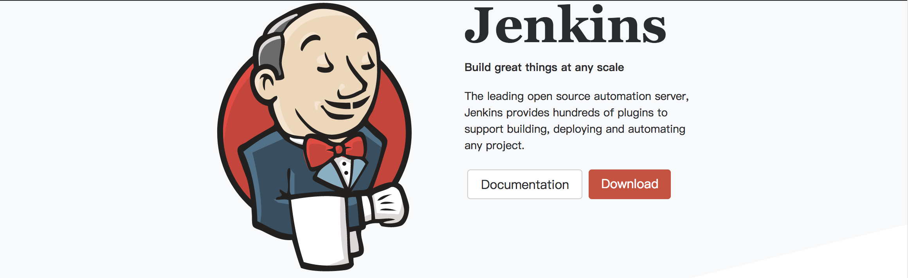  

本文根据**雷涛**jenkins视频以及资料释出，非常感谢老师的教程

[Jenkins 训练营：基础篇](https://ke.qq.com/course/265167)

[Jenkins 训练营: Pipeline](https://ke.qq.com/course/252785)

## 一、Jenkins基础使用

**基础使用主要了解如下内容**
- Jenkins介绍
- 下载，安装和运行
- Job 类型介绍
- 安全管理策略
- 分布式构建
- 最佳实践

### 1. 1 Jenkins介绍 

#### 1. 什么是Jenkins

- 基于JAVA的开源的自动化系统平台

   在servlet容器中运行，比如Apache Tomcat

- 提供CI, CD任务及流水线的服务

  所有类型的任务:构建，测试，部署等

  ​Apache Ant和Apache Maven项目以及任意shell脚本和Windows批处理命令

- 支持各种SCM源码控制工具

  Git, Subversion, CVS, Perforce, ClearCase, RTC等

- 丰富的插件生态系统支持功能扩展

   1400+ 插件，含SCM, 测试, 通知, 报告, Artifact, 触发, 外部集成等

- 基于Web的管理和使用界面

- 源于Hudson

  Hudson由Sun公司在2004年启动，第一个版本于2005年在java.net发布
  2010年11月期间，Oracle对Sun的收购，引起商标权之争 ü 2011年1月29日，项目名称从“Hudson”改为“Jenkins”

#### 2. 为什么选择Jenkins?

- Jenkins本身就是一个高度可配置的系统
- 由开发者主导、面向开发者，全开源
- 治理(独立的董事会)和社区
- 稳定性

  ​LTS长期支持发布线
  ​每三个月发布一次稳定版本

- 插件的平台

  ​1400多插件

#### 3. Jenkins的特点

- 免费且开源
- 与Jenkins共享了很多代码，安装还是挺简单的关键的环境变量可以安全存储
- 支持多个SCM，包括SVN, Mercurial, Git。
- 集成了GitHub和Bitbucket
- 高度可配置
- 资源和教程很多
- 安装运行简单
- 分布式的构建也能高效运行
- 可跨平台部署
- 很多高质量的插件
- 得奖无数
- 庞大的社区

#### 4. Jenkins的工作流程 

- 创建一个项目时，您可以使用以下选项:  
- 通用配置  
  工作空间管理，参数化设置，工具配置等全局管理  
- 源码管理  
  配置代码源  
- 构建触发器  
  与版本控制服务器集成，自动触发构建  
  或者基于其他项目生成轮询、定时构建  
- 构建环境  
- 构建  
- 运行Shell脚本，Python/Groovy等脚本，Ant/Maven/Gradle等等  
- 构建后操作
  制品归档  
  发布JUnit测试结果和Javadoc  
  直接部署到生产或测试环境  
  电子邮件(或即时工具IM等)通知相关人  
  触发其他的子任务或者下游任务  


#### 5. Jenkins的使用对象是谁?

- Jenkins是一个工具，任何人都可以很快学习和上手

- 建议以下团队或者个人掌握Jenkins:

  负责建设产品持续集成/交付流水线的人员(SCM, release/DevOps Engineer)

  领导敏捷团队的敏捷管理者，希望理解诸如持续集成/交付等概念

  在DevOps领域内探索的同学

  想要成为“Jenkins Developer” 的开发人员/管理人员

## 1.2 安装和运行

#### 1. Jenkins安装

- 支持以下平台和OS

  Docker
  WAR
  macOS
  Linux
  Windows
  Solaris, OmniOS, SmartOS, 等

安装准备  

- 最低硬件需求

  256 MB of内存
  1 GB磁盘空间(Docker安装方式需要至少10GB)

- 推荐硬件需求

  1GB+内存
  50 GB+ 磁盘空间

- 软件需求

  Java 8 – JRE/JDK均可
  注，Docker方式无需单独安装Java

#### 2. Docker方式

- macOS/Linux

  ```shell
  $ docker run -u root --rm -d -p 8080:8080 --name jenkinsci \
  -v jenkins-data:/var/jenkins_home \
  -v/var/run/docker.sock:/var/run/docker.sock jenkinsci/blueocean
  ```

- Windows

  ```sehll
  $ docker run -u root --rm -d -p 8080:8080 --name jenkinsci ^
  -v jenkins-data:/var/jenkins_home ^
  -v/var/run/docker.sock:/var/run/docker.sock jenkinsci/blueocean
  ```

- docker exec -it jenkinsci bash

- 打开浏览器 访问 http://localhost:8080

- 安装完成后根据向导进行初始化配置(稍后统一说明)

#### 3. WAR文件安装方式-推荐方式

- 本方式适用于任何支持java的操作系统或者平台
- 下载最新的Jenkins War包:

  ​http://mirrors.jenkins.io/war-stable/latest/jenkins.war

- 运行命令

```shell
java -jar jenkins.war #默认使用8080端口
java -jar jenkins.war --httpPort=49001 #指定使用49001端口
```

- 打开浏览器 访问 http://localhost:8080
- 安装完成后根据向导进行初始化配置(稍后统一说明)

#### 4. WAR文件安装方式-Java servlet containers

- 本方式适用于将Jenkins部署到已经存在的Java servlet containers内
- 可以运行Jenkins的Java servlet containers为  
  • Glassfish
  • Tomcat
  • JBoss
  • IBM WebSphere
  • Jetty
  • Jonas
  • Weblogic
  • Apache Geronimo 3.0
  • Liberty profile
- 打开浏览器 访问 http://localhost:8080
- 安装完成后根据向导进行初始化配置(稍后统一说明)

#### 5. macOS安装 

- 方式一:pkg安装方式

  下载最新osx安装包:http://mirrors.jenkins.io/osx/latest
  打开pkg文件根据指示进行安装

- 方式二:brew安装

  brew install jenkins #安装最新版
  brew install jenkins-lts #安装最新稳定版

- 打开浏览器 访问 http://localhost:8080

- 安装完成后根据向导进行初始化配置(稍后统说明)

#### 6. Debian/Ubuntu

- 下载apt源

  最新版:wget -q -O - https://pkg.jenkins.io/debian/jenkins.io.key | sudo apt-key add -

  最新LTS稳定版:wget -q -O - https://pkg.jenkins.io/debian-stable/jenkins.io.key | sudo apt-key add -

- 配置源

  ```shell
  sudo sh -c 'echo deb http://pkg.jenkins.io/debian-stable binary/>
  /etc/apt/sources.list.d/jenkins.list'
  ```

- 更新源

  ```shell
  sudo apt-get update
  ```

- 安装

  ```shell
  sudo apt-get install jenkins
  ```

- 打开浏览器 访问 http://localhost:8080

- 安装完成后根据向导进行初始化配置(稍后统一讲)


#### 7. Windows安装 

- 下载最新msi安装文件

  ​ http://mirrors.jenkins.io/windows/latest

- 解压zip文件，双击msi根据指示进行安装

- 打开浏览器 访问 http://localhost:8080

- 安装完成后根据向导进行初始化配置(稍后统一讲)

- 其他系统的安装可以参考这里

  支持Solaris, OmniOS, SmartOS等系统
  https://jenkins.io/doc/book/installing/


#### 8. 进行初始化配置向导 

- 在浏览器中打开 http://localhost:8080
- 首次访问Jenkins需要输入密码
- 根据提示，进入提示目录(下图橙色框)打开相应文件并复制密码，粘贴到管理员密码框内(Administrator password)，点击Continue

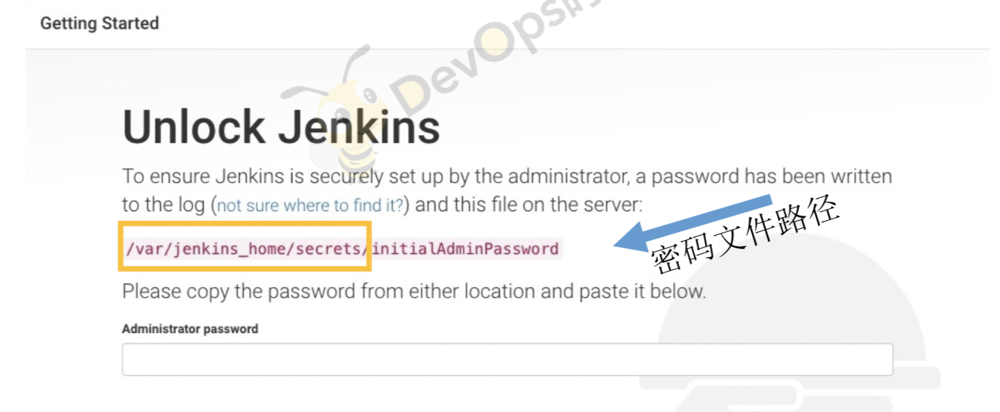  


#### 9.进行初始化配置向导 

- 输入正确密码后，进入插件安装界面，点击安装系统建议的插件(Install suggestedplugins)
- 系统出现Getting Started的安装进度条
- 插件安装完成之后，需要创建第一个用户(管理员用户)
- 创建用户之后，就可以使用Jenkins了

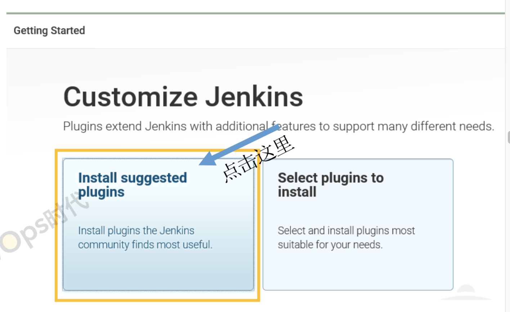  


## 1.3 如何安装插件 

- 系统管理-插件管理-可用插件
- 根据需要选择安装的插件
- 点击直接安装或者下载待重启后安装


##  1.4 Job使用

#### 1.主要的Job类型 

- Freestyle project

  自由风格项目，Jenkins最主要的项目类型

- Maven Project

  Maven项目专用，类似 Freestyle，更简单

- Multi-configuration project

  多配置项目，适合需要大量不同配置(环境，平台等)构建

- Pipeline

  流水线项目，适合使用pipeline(workflow)插件功能构建流水线任务，或者使用Freestyle project不容易实现的复杂任务

- Multibranch Pipeline

  ​多分支流水线项目，根据SCM仓库中的分支创建多个Pipeline项目

  ​	

#### 2. Freestyle 项目 

- General

  项目基本配置

  项目名字，描述，参数，禁用项目，并发构建，限制构建默认node等等

- Source code Management

  代码库信息，支持Git，Subversion等

- Build Trigger

  构建触发方式

  周期性构建，Poll SCM，远程脚本触发构建，其他项目构建结束后触发等

- Build Environment

  构建环境相关设置
  构建前删除workspace，向Console 输出添加时间戳，设置构建名称，插入 环境变量等

- Build

  项目构建任务

  添加 1个或者多个构建步骤

- Post-build Actions

  构建后行为

  Artifact 归档，邮件通知，发布单元测试报告，触发下游项目等等	

**Freestyle 项目- General***

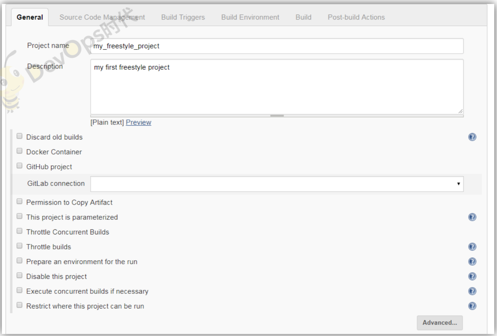  

**Freestyle 项目-SCM &&Triggers**

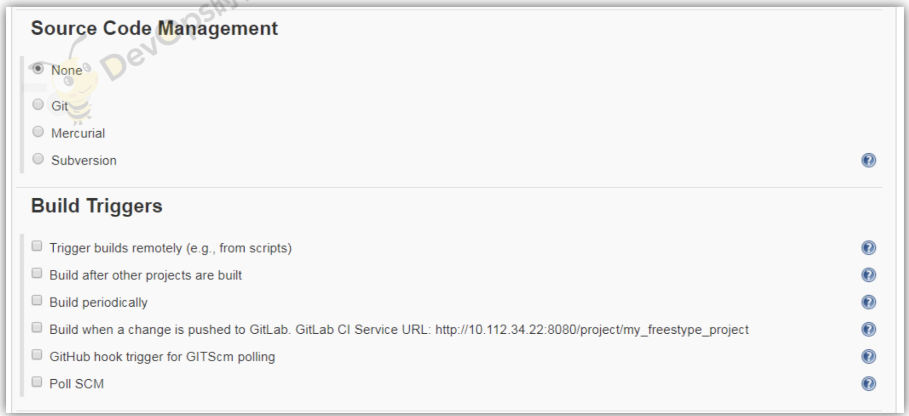  

​			
 **Freestyle 项目- Build Environment**

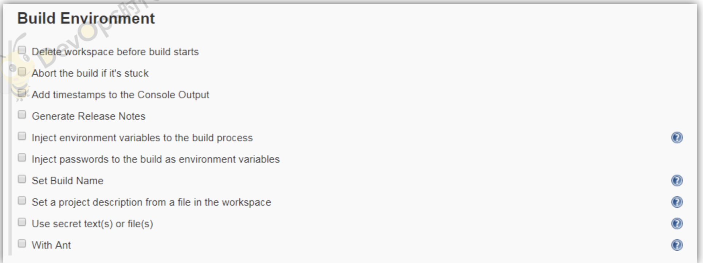  

 **Freestyle 项目- Build**

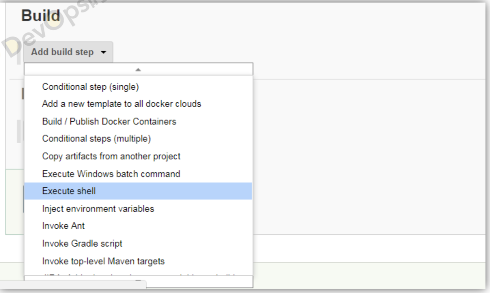  

 **Freestyle 项目- Post Build Actions**

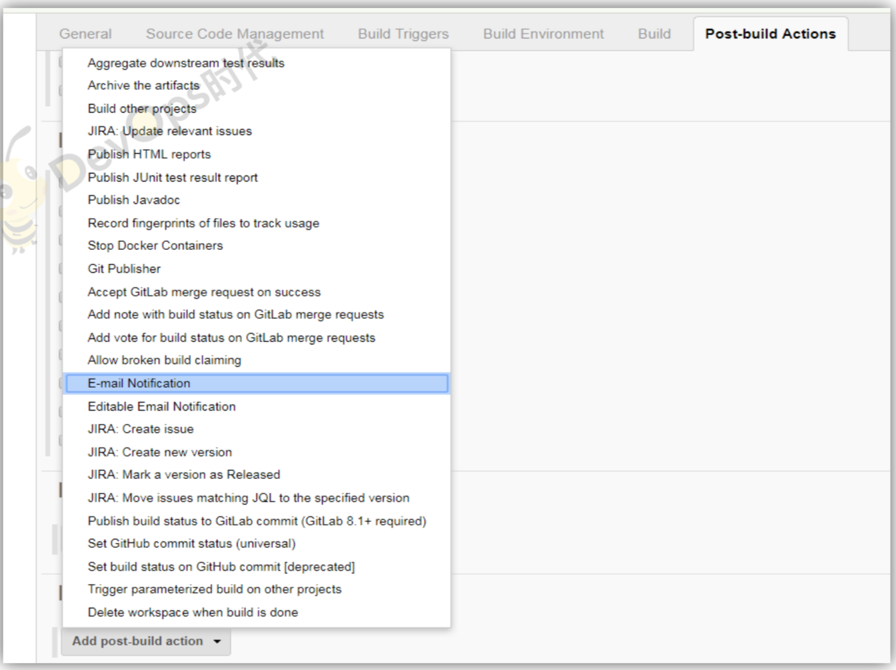  

 **Source Code Management**

- Git
- Subversion
- 其他 80+ 插件支持其他SCM系统

#### 3. Git配置

 **Git – 全局配置**

​	Build Node 上安装 Git tool 

​	Global Tool Configuration 配置

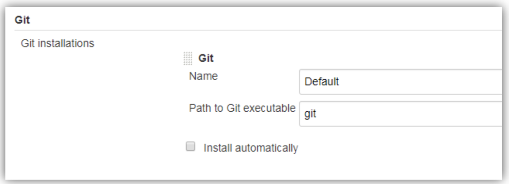  

 **Git – Job配置**

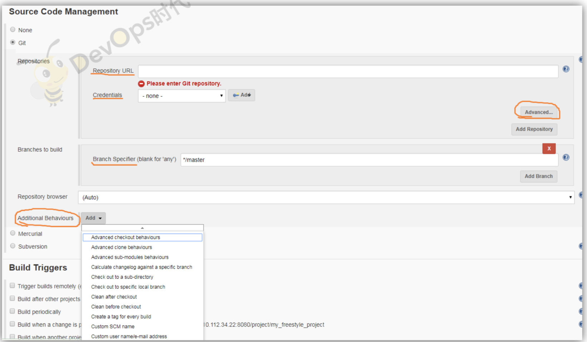  

#### 4. SVN配置

 **SVN-Job 配置**

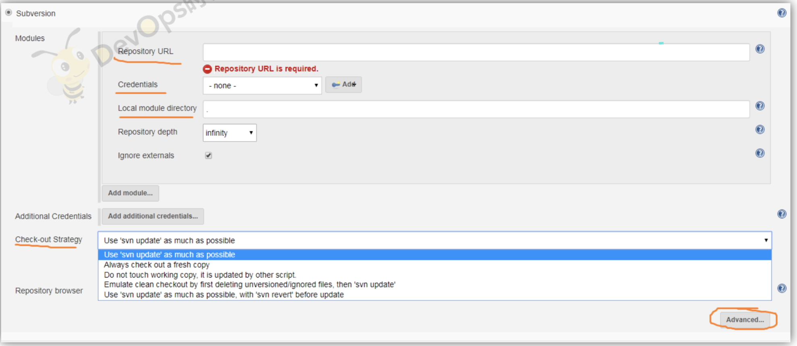  

#### 5. 常用的Triggers

- Build periodically 

  设定类似Cron 周期性时间触发构建

- Poll SCM

  设定类似Cron 周期性时间触发检查代码变化,只有当代码变动时才触发构建

- Hooks

  Gitlabhooks
  GitHubhooks

- Events

  Gerrit evnets

  ### 1.5 安全管理策略 	

#### 1. 安全概述

- 1.x -默认配置下，没有开启安全检查
- 2.x -默认开启安全检查

Jenkins 供了两种维度的安全策略:

-  用户认证

  Security Realm(安全域):决定用户名和密码，且指定用户属于的组。

- 权限控制

  AuthorizationStrategy(授权策略):分配用户执行某些操作的权限。

如何进入Jenkins安全控制界面:

​	系统管理(Manage Jenkins)->Configure Global Security->启用安全(Enable security)

​		

#### 2. 访问控制详述

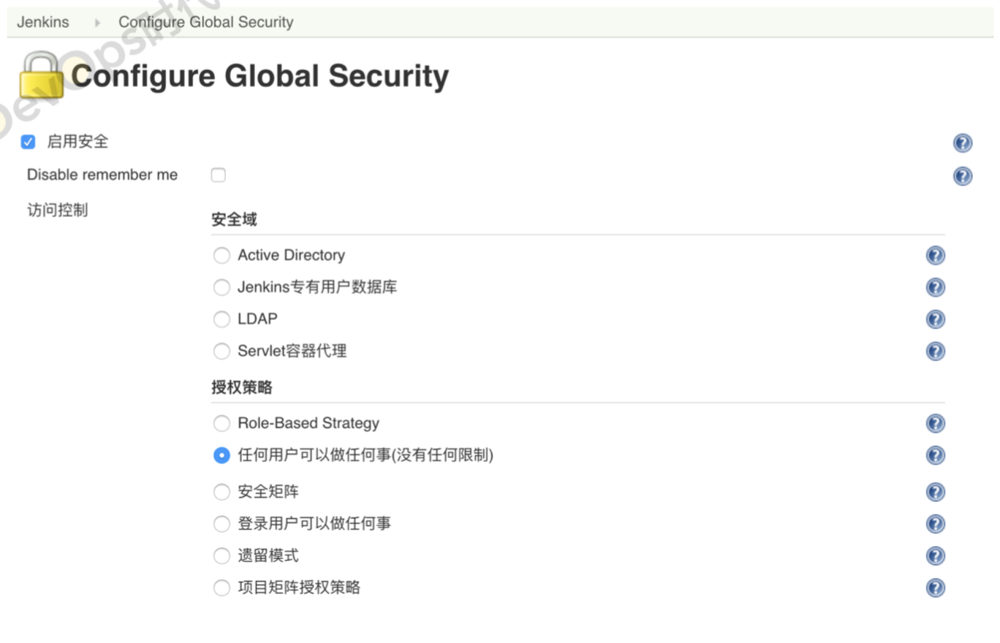  


#### 3. 忘记密码找回

如果权限设置错误，或者忘记密码，导致admin自己都无法登陆，Jenkins怎么办?

- 命令行停止Jenkins;
- 先备份$JENKINS_HOME中的config.xml;
- 用编辑器打开$JENKINS_HOME中的config.xml;
- 将<useSecurity>true</useSecurity>元素中的true改为false;
- 将<authorizationStrategy>和<securityRealm>元素的内容删掉;
- 命令行启动Jenkins。


### 1. 5 分布式构建

#### 1. Jenkins分布式构建架构

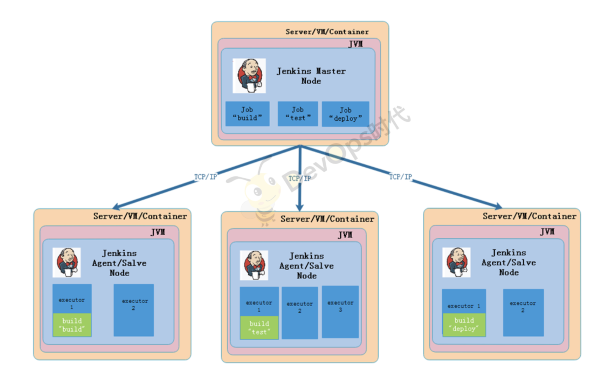  

#### 2. 配置分布式构建

1. 创建分布式构建的节点

  • 系统管理-管理节点-新建节点
  • 标签
  • 注意4中启动方法

2. 配置分布式构建
  • Job的配置页面-General
  • Restrict where this project can be run
  • 输入标签

**创建分布式构建的节点**

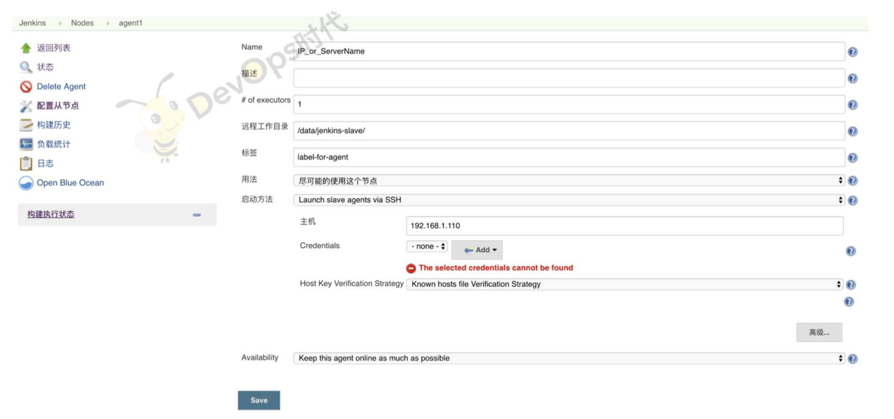  

**配置分布式构建**

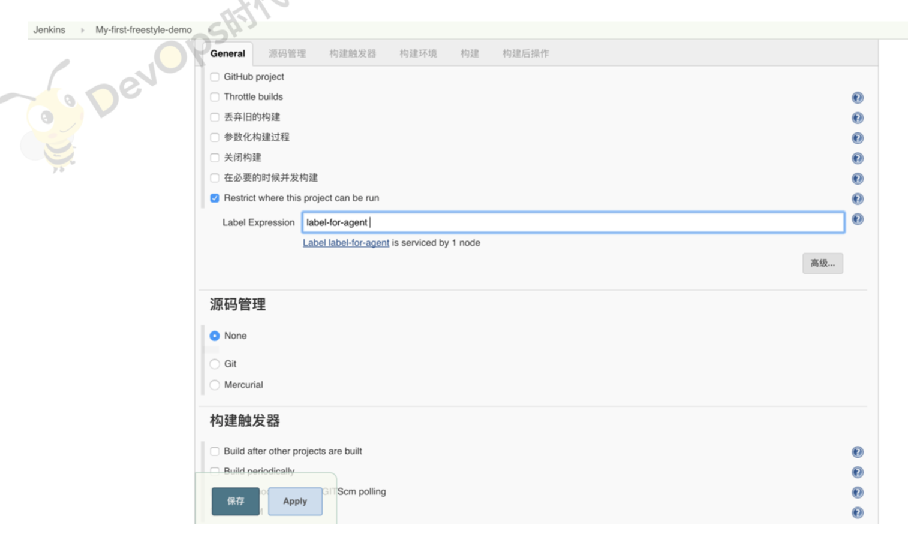  


### 1.6 最佳实践

• 规范项目必要配置
• 常用的插件
• 流水线

#### 1. 规范项目必要配置 

本规范尤其适用于较多项目共用同一Jenkins的场景
• 项目命名规范
• 设置项目 述
• 设置历史构建清理规则
• 设置构建节点Label
• 邮件通知​				

​			

####  2. 常用插件

• Jenkins定时的备份:ThinBackup
• 邮件发送插件: Email Extension Plugin
• 空间清理扩展插件: Distributed Workspace Clean plugin
• Android/iOS设备管理
• Android Device connector plugin
• IOS Device connector plugin
• Jenkins常用插件 – 网友总结

#### 3. Jenkins Pipeline

- Pipeline，简而言之，就是一套运行于Jenkins上的工作流框架，将原本独立运行于单个或者多个节点的任务连接起来，实现单个任务难以完成的复杂流程编排与可视化。
- Pipeline 是Jenkins2.X最核心的特性，帮助Jenkins实现从CI到CD与DevOps的转变
- 代码即管道，可持续性，停顿，多功能，可扩展

#### 4. 练习

- 任意方式安装一个Jenkins
- 安装插件 Timestamper
- 新建一个Freestyle类型的Job
  • General:项目名称:My-first-freestyle-demo
  • 构建环境:勾选 Add timestamps to the Console Output
  • 构建:屏幕打印出 "我是xxx这是我的第一个Jenkins Job, oops "
  • 构建后操作:无
- 点击立刻构建
- 找到控制台输出，如下图

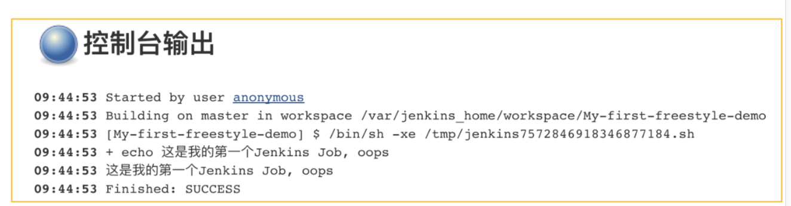  


## 二、Jenkins Pipeline

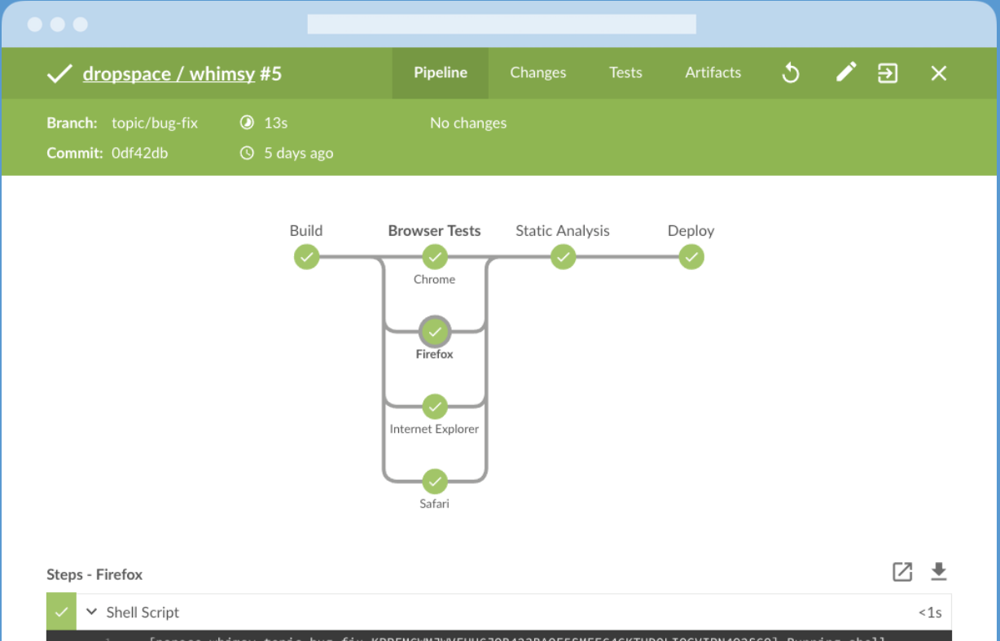    


**本节了解的大致流程**

  


### 2. 1 Jenkins Pipeline 总体介绍

1. Jenkins Pipeline核心概念 
2. 和传统Freestyle的区别


- Pipeline，简而言之，就是一套运行于Jenkins上的工作流框架，将原本独立运行于单个或者多个节点的任务连接起来，实现单个任务难以完成的复杂流程编排与可视化。

- Pipeline 是Jenkins2.X最核心的特性，帮助Jenkins实现从CI到CD与DevOps的转变

  • https://jenkins.io/2.0/

**Jenkins Pipeline示例**

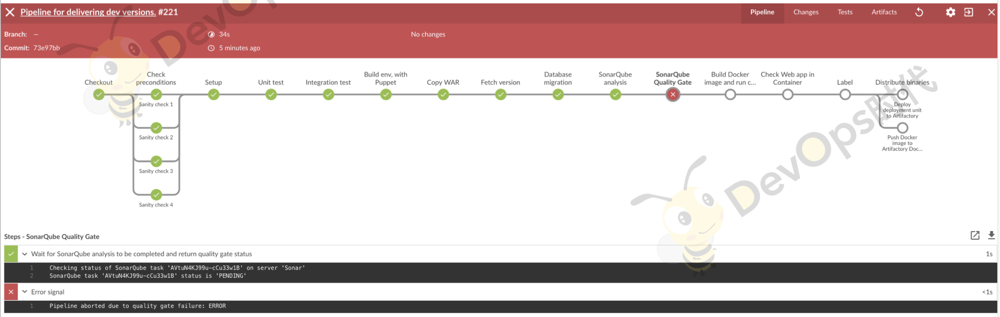  


#### 1. 什么是Jenkins Pipeline?

- Jenkins Pipeline是**一组插件**，让Jenkins可以**实现持续交付管道**的落地和实施。

- 持续交付管道(CD Pipeline)是将软件从**版本控制**阶段到**交付给用户或客户**的**完整过程的自动化表现**。

  – 软件的每一次更改(提交到源代码管理系统)都要经过一个复杂的过程才能被发布。

- Pipeline提供了一组可扩展的工具，通过Pipeline Domain Specific Language

  (DSL) syntax可以达到Pipeline as Code的目的

- Pipeline as Code:Jenkinsfile 存储在项目的源代码库

#### 2. Jenkins Pipeline核心概念

- Stage

  – **阶段**，一个Pipeline可以划分为若干个Stage，每个Stage代表一组操作，例如: "Build","Test", "Deploy" 。

  – 注意，Stage是一个逻辑分组的概念，可以跨多个Node。

- Node

  – **节点**，一个Node就是一个Jenkins节点，或者是Master，或者是Agent，是执行Step的具体运行环境。

- Step

  – **步骤**，Step是最基本的操作单元，小到创建一个目录，大到构建一个Docker镜像，由各类Jenkins Plugin提供，例如: sh 'make'

#### 3.为什么要用Pipeline?

- **代码**:Pipeline以代码的形式实现，通常被检入源代码控制，使团队能够编辑，

  审查和迭代其CD流程。

- **可持续性**:Jenkins重启或者中断后都不会影响Pipeline Job。

- **停顿**:Pipeline可以选择停止并等待人工输入或批准，然后再继续Pipeline运行。

- **多功能**:Pipeline支持现实世界的复杂CD要求，包括fork/join子进程，循环和并行执行工作的能力。

- **可扩展**:Pipeline插件支持其DSL的自定义扩展以及与其他插件集成的多个选项。


### 2.2 Pipeline和Freestyle的区别

- Freestyle:

  – 上游 / 下游Job调度，如

  BuildJob ->TestJob -> DeployJob

  – 在DSL Job里面调度多个子Job(利用Build Flow plugin)

- Pipeline:

  – 单个Job中完成所有的任务编排
  – 全局视图


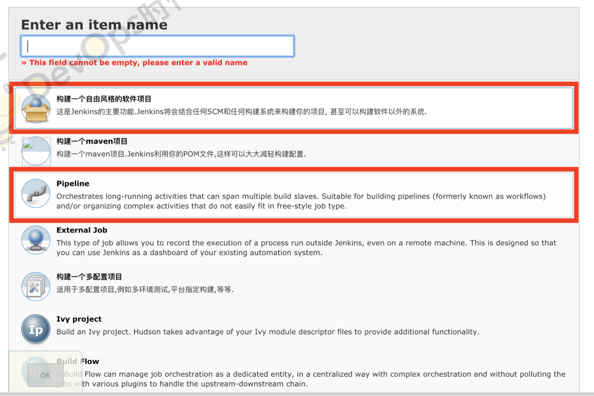  		
​			
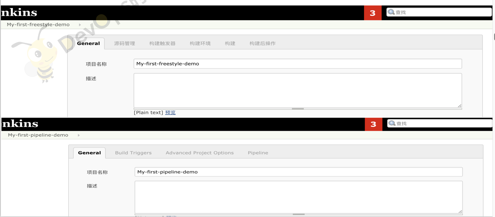  

### 2.3 Pipeline 会取代Freestyle么? 

- Pipeline一定会取代Build Flow插件
- 会，当你希望做到Pipeline as code的时候
- 会，当你独立运行一组Job没有特殊价值或者意义的时候
- 会，当你可以从Multibranch Pipeline受益的时候
- 会，当你希望获取类似于TravisCI风格的工作流的时候


### 2.4 Jenkins Pipeline 基础语法

    1. Jenkins Pipeline入门 
    2. 声明式语法
      3. 脚本式语法
      4. Groovy和DSL

#### 1. Jenkins Pipeline入门

- Pipeline脚本是由Groovy语言实现– 无需专门学习Groovy


- Pipeline支持两种语法

  –  Declarative 声明式(在Pipeline plugin 2.5中引入)

  –  Scripted Pipeline 脚本式

- 如何创建基本的Pipeline

  – 直接在Jenkins Web UI 网页界面中输入脚本
  – 通过创建一个Jenkinsfile可以检入项目的源代码管理库

- 最佳实践

  – 通常推荐在 Jenkins中直接从源代码控制(SCM)中载入Jenkinsfile Pipeline

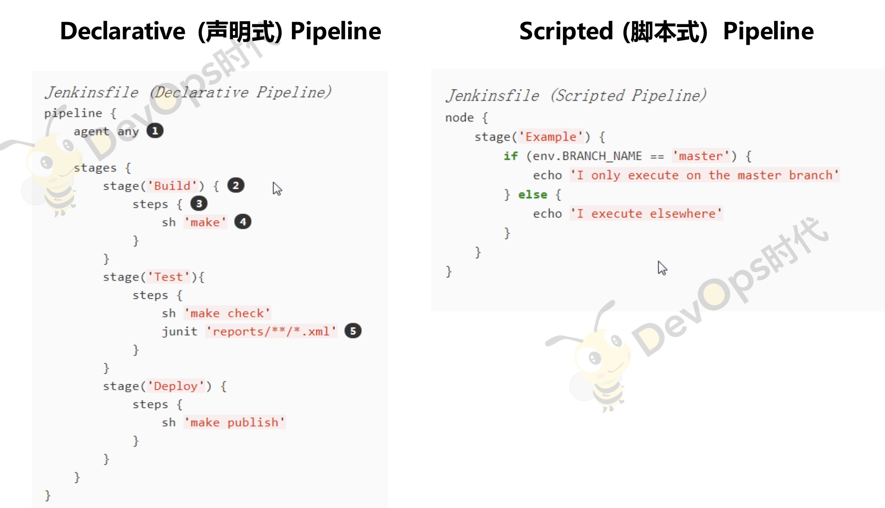  


#### 2. Declarative (声明式) Pipeline

- 声明式Pipeline的基本语法和表达式遵循与Groovy语法相同的规则 ，但有以下例外:

  –  声明式Pipeline必须包含在固定格式pipeline{}块内;

  –  每个声明语句必须独立一行，行尾无需使用分号;

  –  块(Blocks {})只能包含章节(Sections)， 指令(Directives)，步骤(Steps)或赋值语句;

  –  属性引用语句被视为无参数方法调用。所以例如，输入被视为input()


- 块(Blocks {})

  – 由大括号括起来的语句，如
  – Pipeline {}, Section {}, parameters {}, script {}

- 章节(Sections)

  – 通常包含一个或多个指令或步骤
  – agent, post, stages, steps

- 指令(Directives)

  – environment, options, parameters, triggers, stage, tools, when

- 步骤(Steps)

  – Pipeline Steps reference
  – 执行脚本式pipeline:使用 script{}


**agent:**

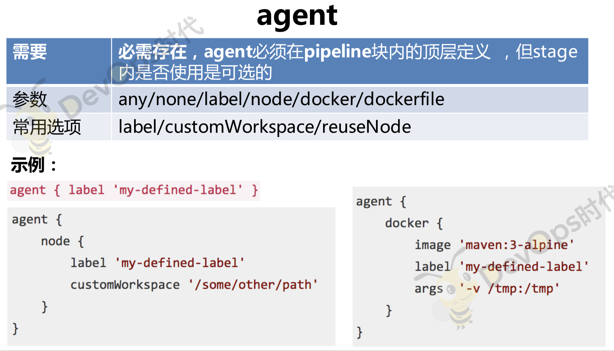  

**post:**

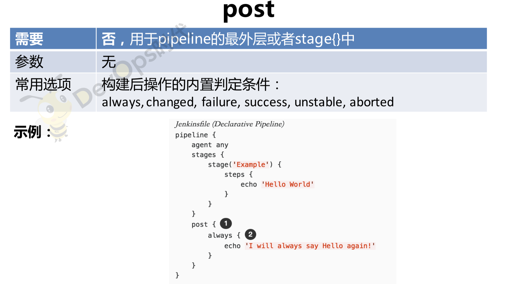  

**stages:**

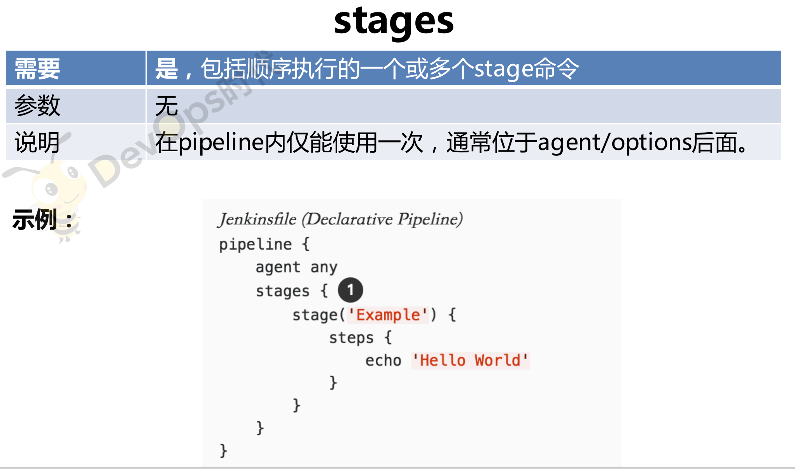

**steps:**

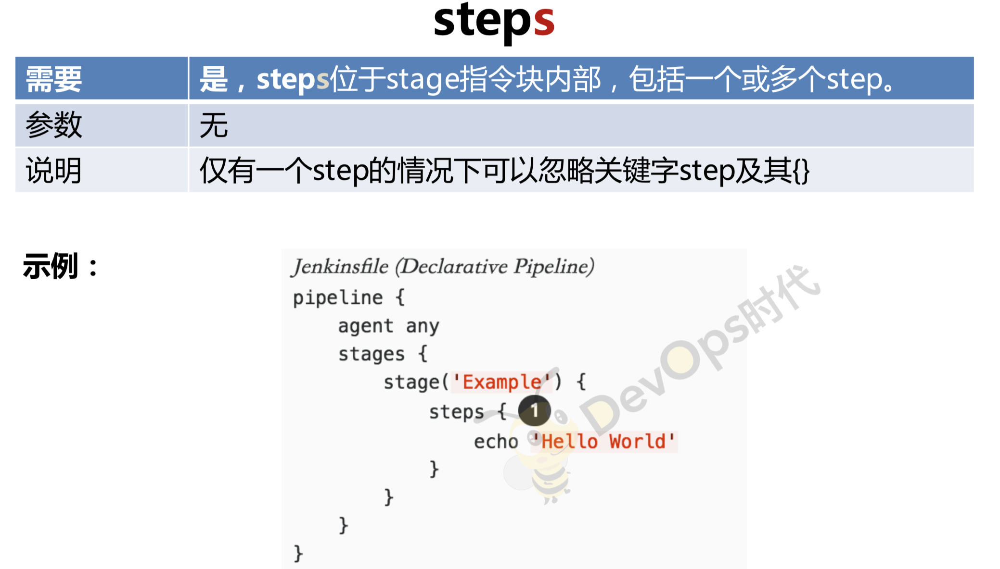  

**environment:**

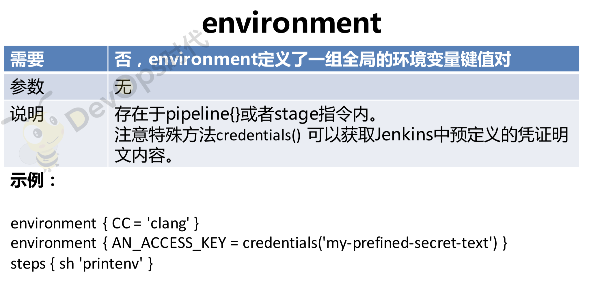  

**options:**

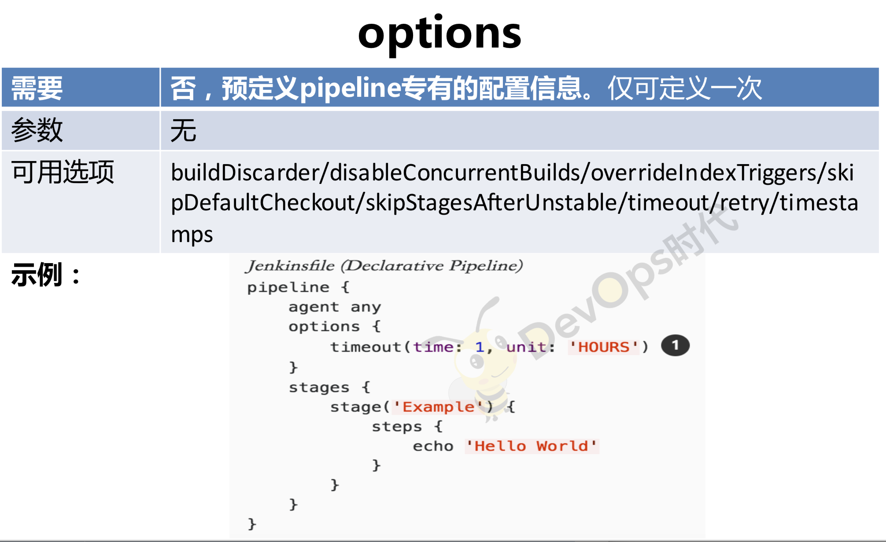  

**parameters:**

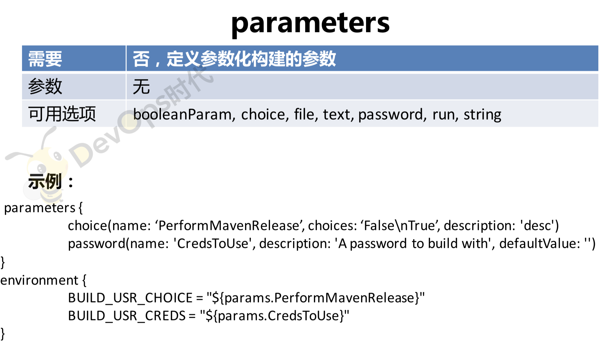  

**triggers:**

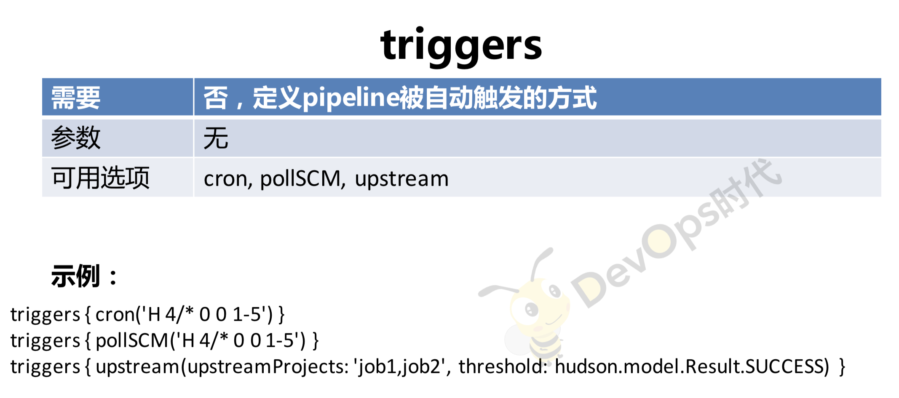   

#### 3. Scripted (脚本式) Pipeline 		

- Scripted Pipeline为Jenkins用户提供了极大的灵活性和可扩展性

  – 可以直接使用Groovy语言的大多数功能

- Groovy学习曲线通常不适用于给定团队的所有成员

- 创建声明性Pipeline是为了创作/编辑Jenkins Pipeline提供一个简单易用的语法。

- 流程控制

  – if/else条件支持，try/catch/finally异常处理

- 章节(Sections)

  – 通常包含一个或多个指令或步骤

  – agent, post, stages, steps

- 指令(Directives)

  – environment, options, parameters, triggers, stage, tools, when

- 步骤(Steps)

  –  同声明式Steps，详细请参考 Pipeline Steps reference

  –  执行脚本式pipeline:使用 script{}


#### 4. 两种Pipeline总结

- 相同之处

  –  都有“Pipeline即代码”的可持续性功能

  –  都能够使用Pipeline内置的插件或插件提供的功能

  –  都可以调用共享库(Shared Libraries)

- 不同之处


  –  语法和灵活性

  –  **声明式**要求严格使用预定义的固定结构，降低复杂度和出错的风险，使其成为**不擅长编程用户**或**相对简单的CD Pipeline的理想选择**。

  –  **脚本化**提供了极少的限制，因为Groovy本身只能对结构和语法进行限制，而不是任何Pipeline专用系统，使其成为**高级用户和具有更复杂要求的用户**的理想选择。

- 顾名思义

  – Declarative Pipeline鼓励声明式编程模型;Scripted Pipeline遵循更脚本化的编程模型。


### 2.5 案例				

#### 1. 场景:快速创建一个简单的Pipeline

1. 新建Job:Jenkins à 新建 à 输入Job名称:“ My-first-pipeline-demo”à选择 Pipelineà点击"OK"

2. 配置:在Pipeline à Script 文本输入框中输入下列语句，点击 ”保存”

3. 立即构建

   ```groovy
   pipeline {
   	agent any;
     	stages {
       	stage('Build') {
             steps {
               echo 'Build'
             }	
       	}
         	stage('Test') {
             steps {
              	echo 'Test' 
             }	
         	}
         	stage('Deploy') {
             steps {
               echo 'Deploy'
             }
         	}
     	}
   }
   ```


### 2.6 常用的辅助工具			 	

      1.  Snipper Generator

2. Replay Pipeline
3. DSL Reference 语法参考手册
4. 全局变量引用
5. Stage View
6. Pipeline神器:可视化编辑器
7. 命令行Pipeline调试工具


#### 1. Snipper Generator

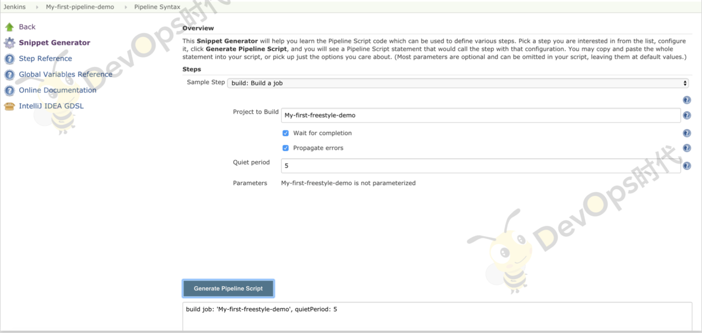  


#### 2.  Replay Pipeline

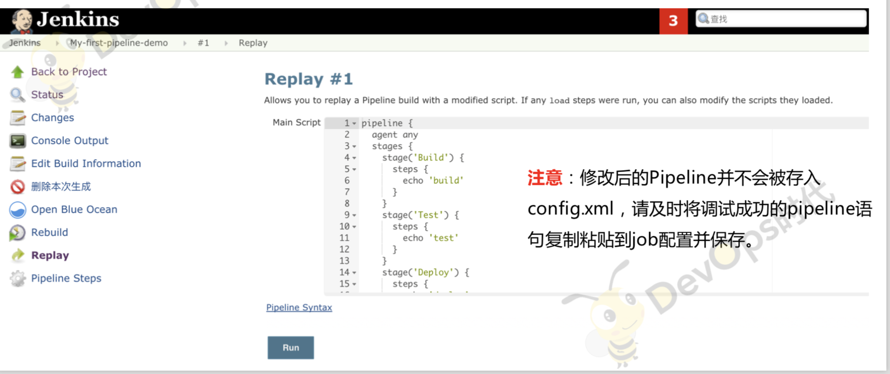  

### 2.6  Pipeline语法参考手册

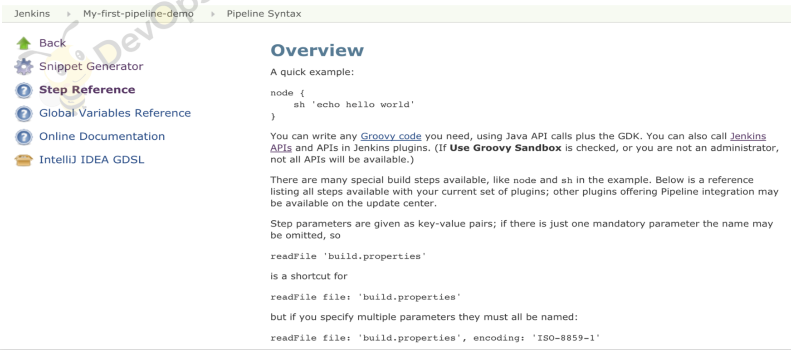  

### 2. 7 可视化-Stage View

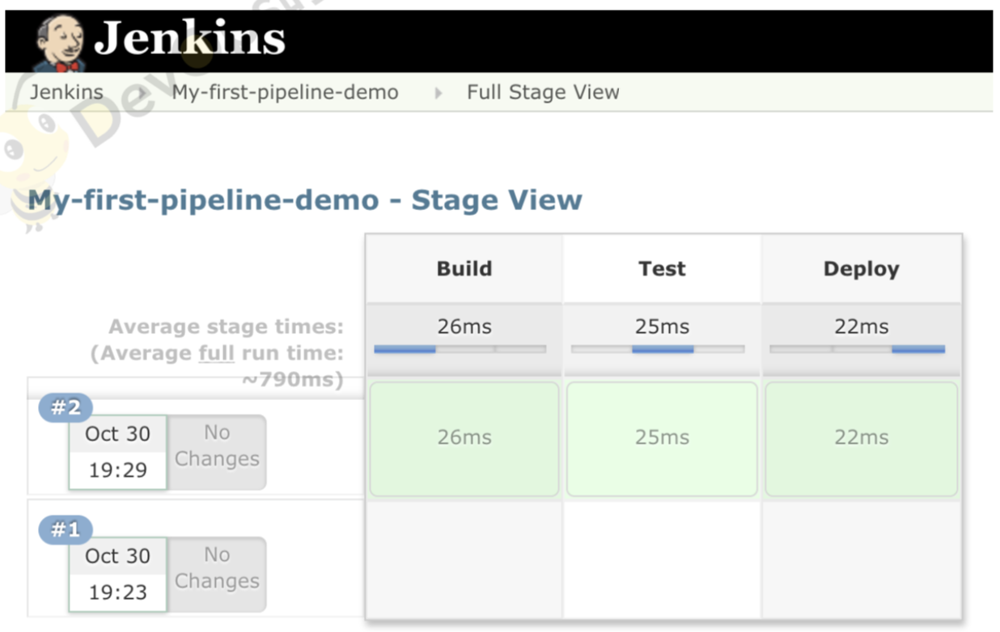  

### 2.8  可视化-BlueOcean

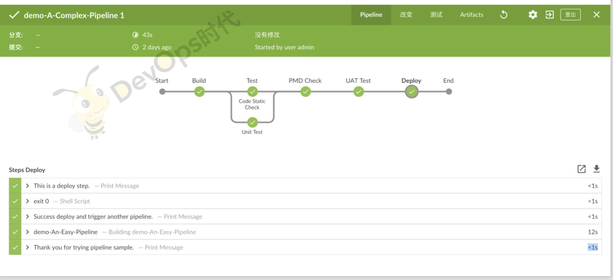    


### 2.8  Pipeline神器:可视化编辑器

- 可以自动生成pipeline代码噢 (由于时间关系，本次分享暂时忽略)

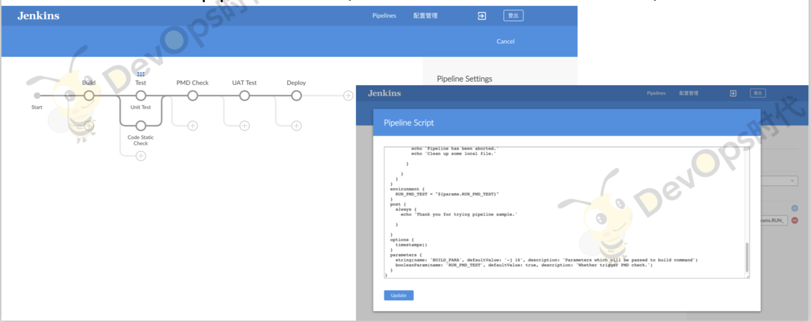

### 2.9  命令行Pipeline调试工具

- 由于时间关系，本次分享暂时忽略


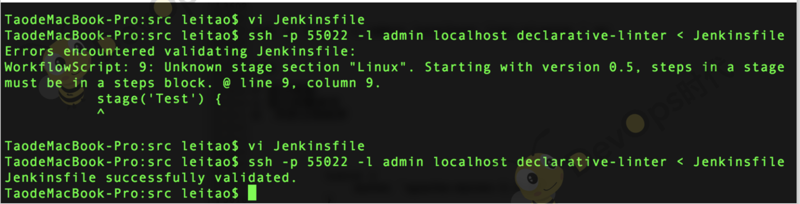  


### 2.10 复杂的Pipeline功能 		

1. 变量传递
2. 判断
3. 循环
4. 并发
5. 人工确认
6. 异常处理

#### 1. 变量传递

**1.自定义变量(局部)**

```Groovy
def username = 'Jenkins'
echo 'Hello Mr. ${username}'
echo "I said, Hello Mr. ${username}"
打印结果:
Hello Mr. ${username}
I said, Hello Mr. Jenkins
```

**2.环境变量(局部)**

```groovy
withEnv(['MYTOOL_HOME=/usr/local/mytool']) {
  sh '$MYTOOL_HOME/bin/start'
} // 此后$MYTOOL_HOME 失效
```
**3.环境变量(全局)** 
```groovy
environment {CC = 'clang' } 
echo “Compiler is ${env.CC}"
```
**4.参数化构建(全局)**
```groovy
parameters { 
  string(name: 'Greeting', 
         defaultValue: 'Hello', 
         description: 'How 	  should I greet the world?') 
}
echo "${params.Greeting} World!"
```


####  2. 判断

- when 仅用于stage内部

- when的内置条件为:

  – when { branch 'master' }

  –  when { environment name: 'DEPLOY_TO', value: 'production' }

  –  when { expression { return params.DEBUG_BUILD } }

  –  when { not { branch 'master' } }

  –  when { allOf { branch 'master'; environment name: 'DEPLOY_TO', value:'production' } }

  –  when { anyOf { branch ‘master’; branch ‘staging' } }

#### 3.  判断和异常处理

-  流程控制if/else条件
-  异常处理try/catch/finally

```groovy
Jenkinsfile(Scripted Pipeline)
node {
  stage('Example') {
    if (env.BRANCH_NAME == 'master') {
		echo 'I only execute on the master branch'
    } else {
      	echo 'I execute elsewhere'
    }
  }
}
```


```groovy
Jenkinsfile(Scripted Pipeline)
node {
  stage('Example') {
    try {
      sh 'exite 1'
    } catch (exc) {
      echo 'Something failed, I should sound the klaxons!'
      throw
    }
  }
}
```

#### 4. 循环

- for循环仅存在于脚本式pipeline中，但是可以通过在声明式pipeline中调用scriptstep来执行。

```groovy
Jenkinsfile(Declarative Pipeline)
pipeline {
  agent any
  stages {
    stage('Example') {
      steps {
        echo 'Hello World'
        script {
        	def browsers = ['chrome','firefox']
          	for (int i = 0; i < browsers.size(); ++i) {
              echo "Testing the ${browsers[i]} browser"
          	}
        }
      }
    }
  }
}
```

#### 5.并发

- Stages可以嵌套使用


- stage下的steps和parallel

  不能共存，二选一

- 使用了并发的stage不能再有agent/tools

- 强制所有并发任务退出，加参数

  **– failFast true**

```groovy
Jenkinsfile(Scripted Pipeline)
stage('Build'){
  /* .. snip ..*/
}
stage('Test'){
  parallel linux: {
    node('linux'){
      checkout scm
      try{
        unstash 'app'
        sh 'make check'
      }
      finally{
        junit '**/target/*.xml'
      }
    }
  },
  windows:{
    node('windows'){
      /* .. snip ..*/
    } 
  }
}
```

```groovy
Jenkinsfile(Declarative Pipeline)
pipeline {
  agent any
  stages{
    stage('Non-parallel Satage'){
      steps {
        echo 'This stage will be execute first.'
      }
    }
    stage('Parallel Stage'){
      when{
        branch 'master'
      }
      failFast true
      parallel {
        stage('Branch A'){
          agent {
            label 'for-branch-a'
          }
          steps{
            echo 'On Branch A'
          }
        }
        stage('Branch B'){
          agent{
            label 'for-branch-b'
          }
          steps{
            echo 'On Branch B'
          }
        }
      }
    }
  }
}
```

#### 6. 人工确认

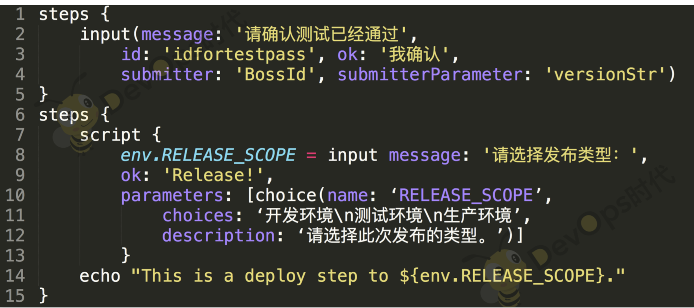  

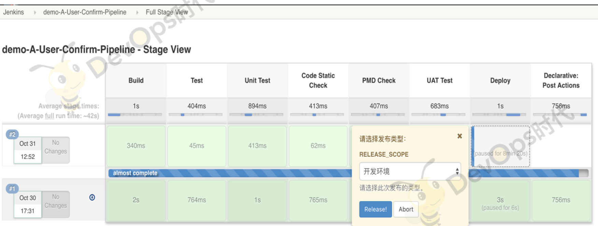  

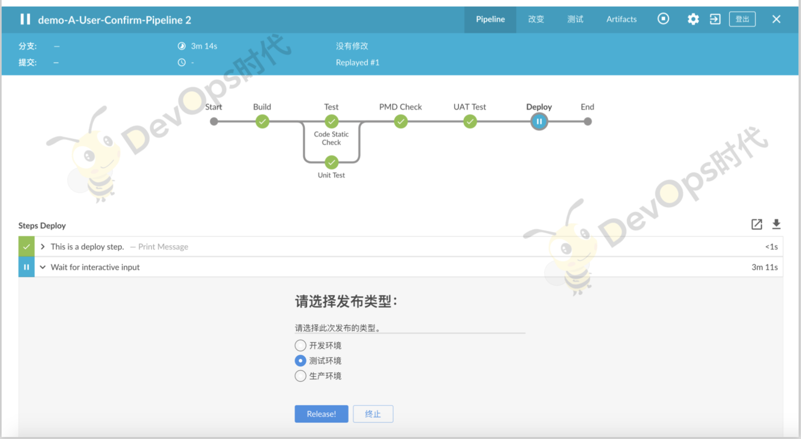  

### 2.11 案例

1. 场景:创建一个持续集成CI Pipeline
2. 场景:基于CI Pipeline，增加人工确，认等流程

**场景演示环境及说明**

- 建议使用docker 版本:>= 17.03.0-ce (其他版本未经测试验证)
- docker pull registry.cn-beijing.aliyuncs.com/jenkinsci/pipeline
- docker run -d --rm --name jenkinsci -p 8888:8080 registry.cn-beijing.aliyuncs.com/jenkinsci/pipeline
- 用户名密码:admin:admin
- 演示1[demo-An-Easy-Pipeline]:pipeline基础结构，stage/step
- 演示2[demo-A-Complex-Pipeline]:参数、并发、判断、循环、触发下游任务、异常处理
- 演示3[demo-A-User-Confirm-Pipeline]: 人工确认、变量传递、文件共享、测试结果归档

## 附:

### 参考内容

- PipelineasCodewithJenkins

  – https://jenkins.io/solutions/pipeline/
  – 官方一手资料，了解你想知道的一切

- 附:Pipeline语法参考手册摘录

  – 选自DZone Refcard

### 1. Jenkins 核心概念

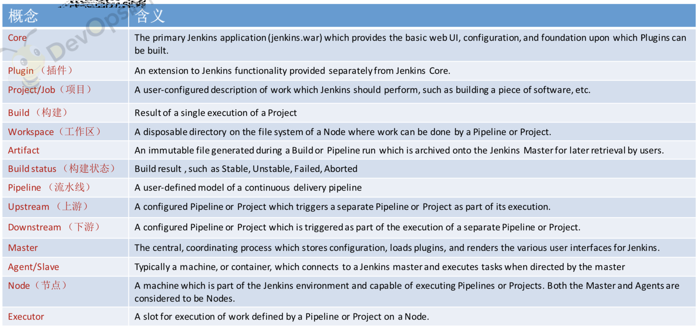  

### 2. Pipeline语法参考手册摘录 

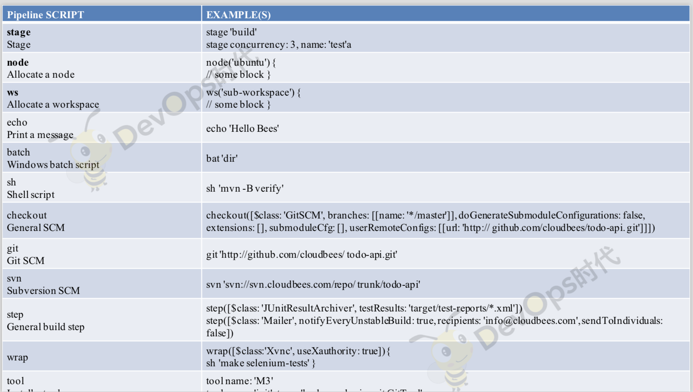  
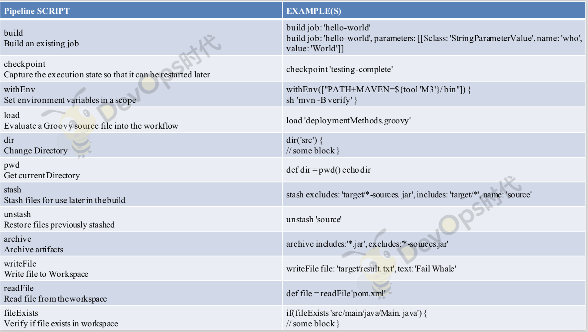  
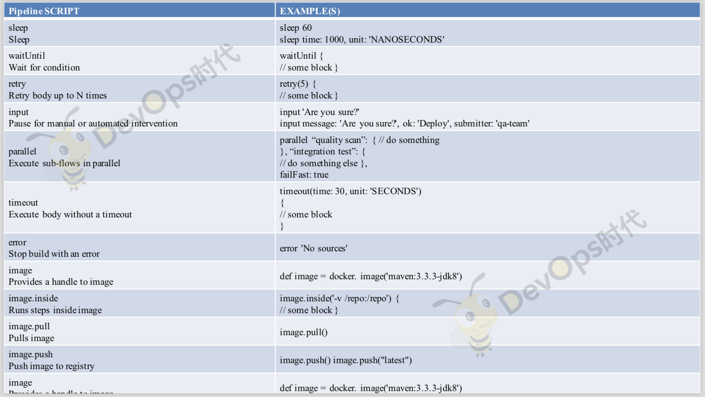  
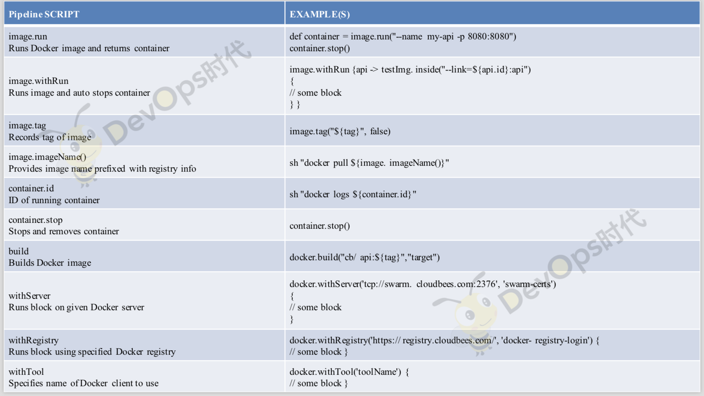 
