# Kafka-学习

[TOC]

kafka官网：http://kafka.apache.org/  
练习代码： https://github.com/caojx-git/learn/tree/master/code/kafka-java  

## 一、初识kafka

在实际的业务需求中，我们需要处理各种各样的消息，比如日志，请求，响应等，那么一个号的消息系统应该拥有哪些功能呢？

- 拥有消息发布和订阅功能，类似于消息队列或企业消息传送系统
- 能存储消息流，并具备容错性
- 能够实时的处理消息


目前主要的两种消息传递模式

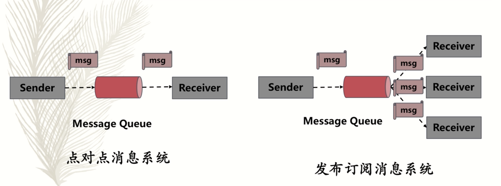  


### 1.1 Kafka Topic&&Partition

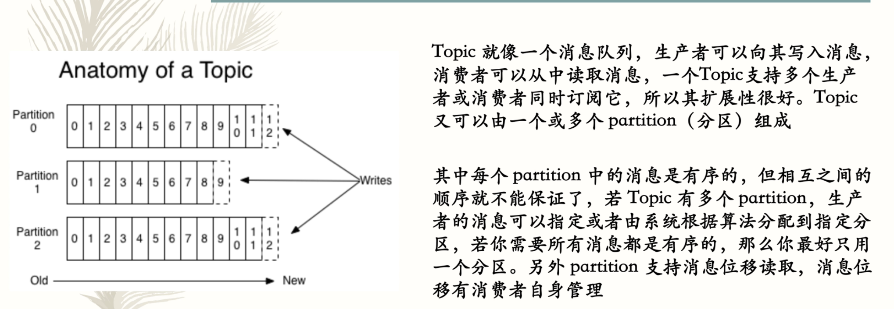   


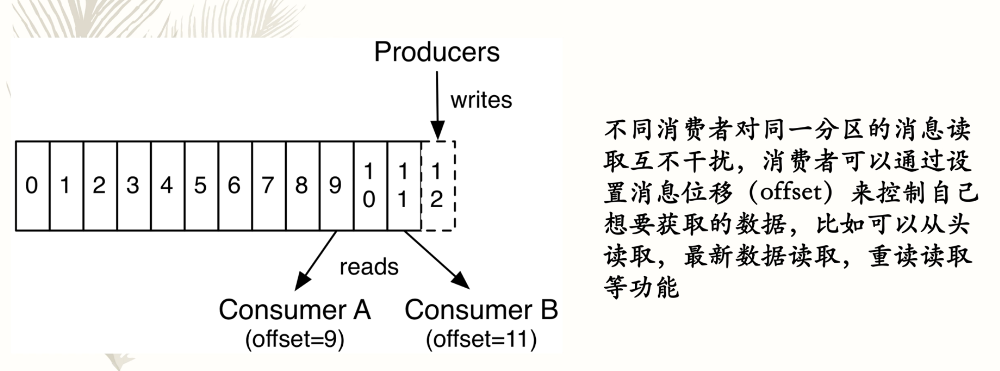    


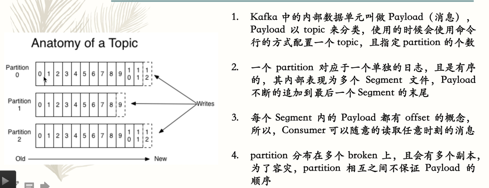    


### 1.2 初识Kafka Payload && 批量提交

     


### 1.3 初识Kafka Producer && Consumer

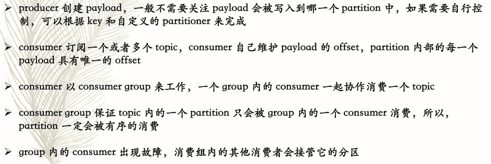   

### 1.4 初识Kafka 总体架构
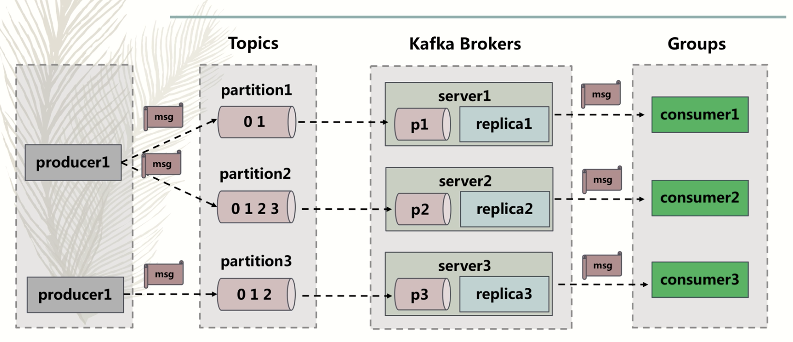   

### 1.5 初始Kafka Kafka优势

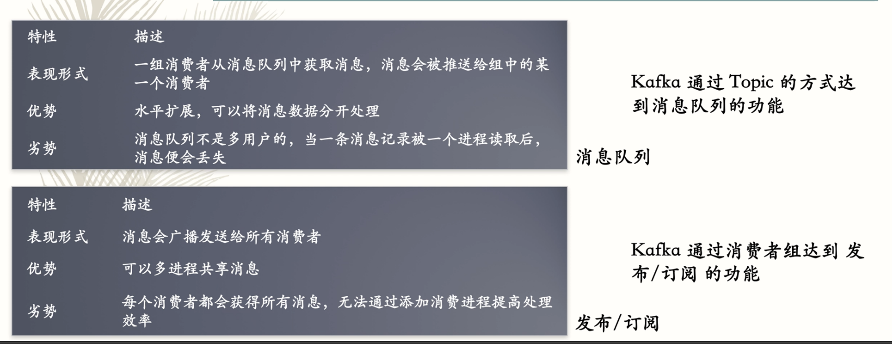     


### 1.6 初始Kafka 总结

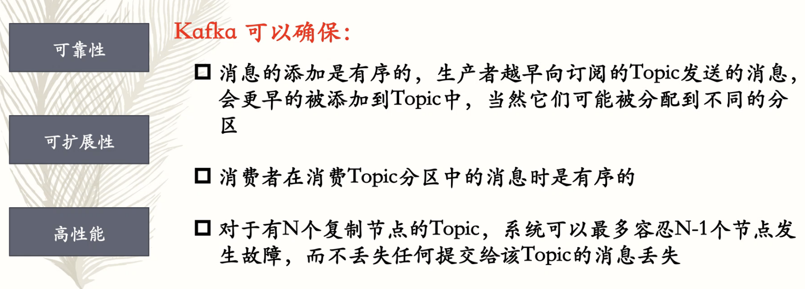    

### 1.7 Kafka安装与使用

kafka安装比较简单可以参见：[kafka的安装及使用](https://blog.csdn.net/gscsd_t/article/details/80089269)

总体步骤有：

1.安转zookeeper

2.安装kafka

## 二、Kafka配置

### 2.1 broker 配置

- broker.id kafka broker的标识信息
- port kafka 监听端口
- zookeeper.connect zookeeper的连接地址
- log.dirs kafka将消息持久化到磁盘，存在这个参数指定的路径下
- num.recovery.threads.per.data.dir 数据对应的目录的线程数
- auto.create.topics.enable 指定某些场景下broker会主动的创建topic

### 2.2 topic配置

- number.partitions topic创建是的partition个数，默认是1，partitions 只能增加不能减少
- log.segment.bytes 每个segment的最大数据容量
- log.segment.ms  segment强制关闭的最大时间
- message.max.bytes  broker对payload的最大数据量限制


## 三、Kafka Producer

### 3.1 发送消息的基本流程

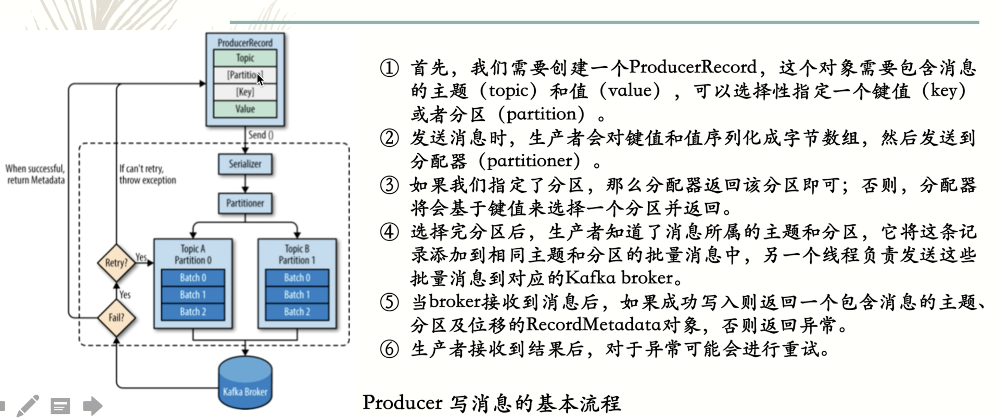  

### 3.2 基本属性与发送消息的方式

#### 1.Kafka producer 生产者基本属性

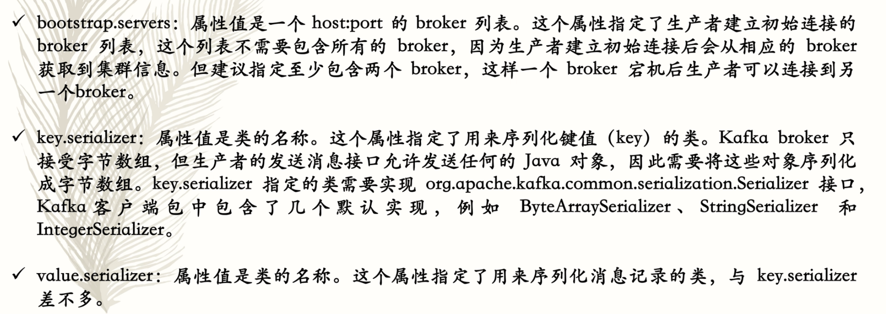  

#### 2. Kafka producer 发送消息方式

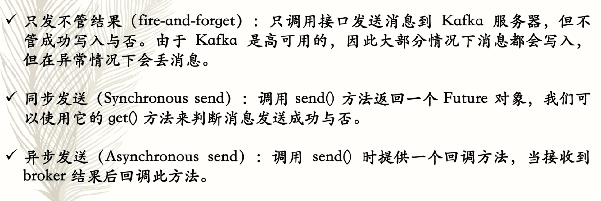  

#### 3. Kafka producer 消息发送代码案例

pom.xml 依赖

```xml
  <dependencies>
    <dependency>
      <groupId>junit</groupId>
      <artifactId>junit</artifactId>
      <version>4.11</version>
      <scope>test</scope>
    </dependency>

    <!--kafka_2.12 需要与本地的kafka对应-->
    <dependency>
      <groupId>org.apache.kafka</groupId>
      <artifactId>kafka_2.12</artifactId>
      <version>1.1.0</version>
    </dependency>

    <!-- fastjson -->
    <dependency>
      <groupId>com.alibaba</groupId>
      <artifactId>fastjson</artifactId>
      <version>1.2.47</version>
    </dependency>
  </dependencies>
```

代码案例：

```java
package caojx.learn.producer;

import org.apache.kafka.clients.producer.Callback;
import org.apache.kafka.clients.producer.KafkaProducer;
import org.apache.kafka.clients.producer.ProducerRecord;
import org.apache.kafka.clients.producer.RecordMetadata;

import java.util.Properties;

/**
 * Kafka Producer
 * 1.启动zookeeper: zkServer start (配置文件 kafka/zookeeper.properties)
 * 2.启动kafka: ./kafka-server-start.sh ../config/server.properties (配置文件 server.properties)
 * 3.创建topic: kafka-topics --create --zookeeper localhost:2181 --replication-factor 1 --partitions 2 --topic kafka-study-m
 * 4.kafka Producer: kafka-console-producer --broker-list localhost:9092 --topic kafka-study-m
 * 5.kafka Comsumer: kafka-console-consumer --bootstrap-server localhost:9092 --topic kafka-study-m --from-beginning
 */
public class MyProducer {

    private static KafkaProducer<String, String> producer;

    //静态代码块设置属性
    static {
        Properties kafkaProps = new Properties();
        kafkaProps.put("bootstrap.servers", "127.0.0.1:9092");
        kafkaProps.put("key.serializer", "org.apache.kafka.common.serialization.StringSerializer");
        kafkaProps.put("value.serializer", "org.apache.kafka.common.serialization.StringSerializer");

        producer = new KafkaProducer<String, String>(kafkaProps);
    }

    /**
     * producer 发送消息不考虑返回信息
     */
    private static void sendMessageForgetResult() {
        ProducerRecord<String, String> record = new ProducerRecord("kafka-study-m", "name", "ForgetResult");
        producer.send(record);
        producer.close();
    }

    /**
     * producer 发送消息同步等待返回信息
     * @throws Exception
     */
    private static void sedMessageSync() throws Exception {
        ProducerRecord<String, String> record = new ProducerRecord("kafka-study-m", "name", "sync");
        RecordMetadata result = producer.send(record).get();

        System.out.println(result.topic());
        System.out.println(result.partition());
        System.out.println(result.offset());

        producer.close();
    }

    /**
     * producer 发送消息异步回掉返回信息
     */
    public static void sendMessageCallback() {
        ProducerRecord<String, String> record = new ProducerRecord("kafka-study-m", "name", "callback");
        producer.send(record, new MyProducerCallback());
        producer.close();

    }

    private static class MyProducerCallback implements Callback{
        @Override
        public void onCompletion(RecordMetadata recordMetadata, Exception e) {
            if(e != null){
                e.printStackTrace();
                return;
            }
            System.out.println(recordMetadata.topic());
            System.out.println(recordMetadata.partition());
            System.out.println(recordMetadata.offset());
        }
    }
    
    public static void main(String[] args) throws Exception{
        sendMessageForgetResult();
        sedMessageSync();
        sendMessageCallback();
    }
}
```


### 3.3 生产者其他配置

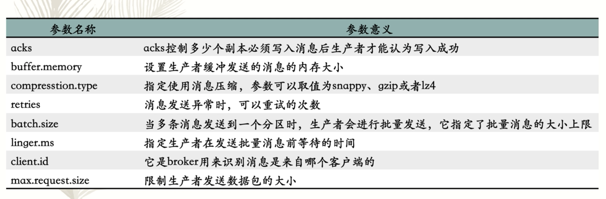   

### 3.4 消息分区

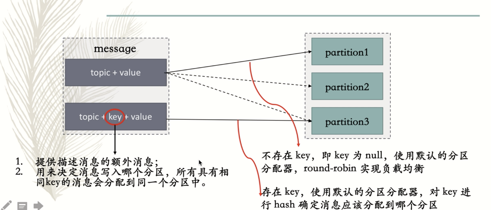z


#### 1. 自定义消息分配器

自定义消息分配器需要实现 Partitioner接口，然后实现partition方法，可以实现自定义消息分区分配

```java
package caojx.learn.partitioner;

import org.apache.kafka.clients.producer.Partitioner;
import org.apache.kafka.common.Cluster;
import org.apache.kafka.common.PartitionInfo;
import org.apache.kafka.common.record.InvalidRecordException;
import org.apache.kafka.common.utils.Utils;

import java.util.List;
import java.util.Map;

/**
 * @author caojx
 * @version 1.0
 * @description 自定义分区分配器
 * @Copyright (c) 2018, Lianjia Group All Rights Reserved.
 * @date 2018-07-09
 */
public class Custompartitioner implements Partitioner {

    @Override
    public int partition(String topic, Object key, byte[] keyBytes, Object value, byte[] valueBytes, Cluster cluster) {
        List<PartitionInfo> partitionInfoList = cluster.partitionsForTopic(topic);
        int numpatitions = partitionInfoList.size();
        System.out.println("current topic is: " + topic);
        System.out.println("current topic has: " + numpatitions + " patitions!");

        if (null == keyBytes || !(key instanceof String)) {
            throw new InvalidRecordException("kafka message must have key!");
        }

        if (numpatitions == 1) {
            return 0;
        }

        if (key.equals("name")) {
            return numpatitions - 1;
        }

        return Math.abs(Utils.murmur2(keyBytes)) % (numpatitions - 1);
    }

    @Override
    public void close() {

    }

    @Override
    public void configure(Map<String, ?> map) {

    }
}
```

使用：

```java
    //静态代码块设置属性
    static {
        Properties kafkaProps = new Properties();
        kafkaProps.put("bootstrap.servers", "127.0.0.1:9092");
        kafkaProps.put("key.serializer", "org.apache.kafka.common.serialization.StringSerializer");
        kafkaProps.put("value.serializer", "org.apache.kafka.common.serialization.StringSerializer");
        //自定义分区分配器，可选择配置
        kafkaProps.put("partitioner.class", "caojx.learn.partitioner.Custompartitioner");

        producer = new KafkaProducer<String, String>(kafkaProps);
    }
```


## 四、Kafka Consumer

### 4.1 提交与位移

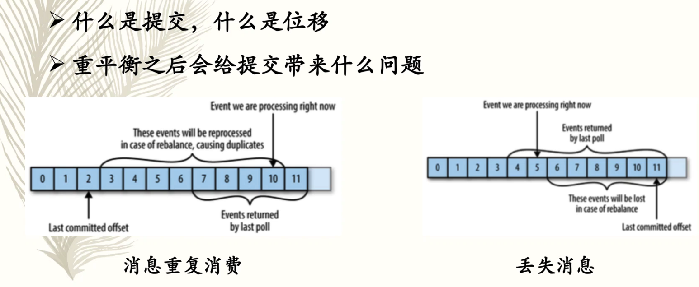  


### 4.2 提交位移的方式

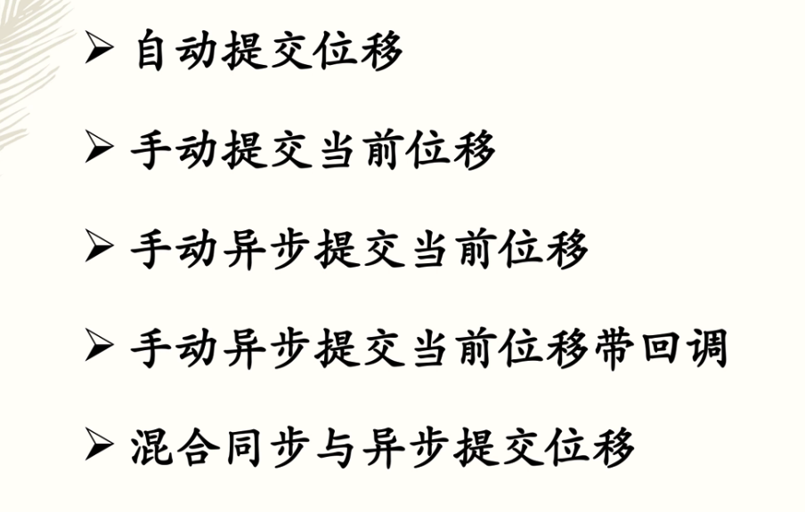    


```java
package caojx.learn.consumer;

import kafka.Kafka;
import org.apache.kafka.clients.consumer.CommitFailedException;
import org.apache.kafka.clients.consumer.ConsumerRecord;
import org.apache.kafka.clients.consumer.ConsumerRecords;
import org.apache.kafka.clients.consumer.KafkaConsumer;

import java.util.Collections;
import java.util.Properties;

/**
 * @author caojx
 * @version 1.0
 * @description Kafka Consumer
 * @date 2018-07-09
 */
public class MyConsumer {

    private static KafkaConsumer<String, String> consumer;

    private static Properties kafkaPro;

    static {
        kafkaPro = new Properties();
        kafkaPro.put("bootstrap.servers", "127.0.0.1:9092");
        kafkaPro.put("group.id", "kafkaStudy");
        kafkaPro.put("key.deserializer", "org.apache.kafka.serialization.StringDeserializer");
        kafkaPro.put("value.deserializer", "org.apache.kafka.serialization.StringDeserializer");
    }

    /**
     * 1.consumer 自动提交消息位移
     */
    private static void generalConsumerAutoCommit() {
        kafkaPro.put("enable.auto.commit", true);
        consumer = new KafkaConsumer<String, String>(kafkaPro);
        consumer.subscribe(Collections.singleton("kafka-study-m"));

        try {
            while (true) {
                boolean flag = true;
                //间隔100ms,拉取一次数据
                ConsumerRecords<String, String> records = consumer.poll(100);
                for (ConsumerRecord<String, String> record : records) {
                    System.out.println(String.format("topic = %s, partition = %s, key = %s", record.topic(), record.partition(), record.offset(), record.key(), record.value()));
                    if (record.value().equals("done")) {
                        flag = false;
                    }
                }
                if (!flag) {
                    break;
                }
            }
        } finally {
            consumer.close();
        }
    }

    /**
     * 2.consumer 手动同步提交消息位移
     */
    public static void generalConsumeMessageSyncCommit() {
        kafkaPro.put("auto.commit.offset", true);
        consumer = new KafkaConsumer<String, String>(kafkaPro);
        consumer.subscribe(Collections.singleton("kafka-study-m"));

        while (true) {
            boolean flag = true;
            //间隔100ms,拉取一次数据
            ConsumerRecords<String, String> records = consumer.poll(100);
            for (ConsumerRecord<String, String> record : records) {
                System.out.println(String.format("topic = %s, partition = %s, key = %s", record.topic(), record.partition(), record.offset(), record.key(), record.value()));
                if (record.value().equals("done")) {
                    flag = false;
                }
            }
            try {
                consumer.commitSync();
            } catch (CommitFailedException e) {
                System.out.println("commit fail error: " + e.getMessage());
            }
            if (!flag) {
                break;
            }
        }
    }

    /**
     * 3.consumer 手动异步提交消息位移
     */
    private static void generalConsumeMessageAsyncCommit() {
        kafkaPro.put("auto.commit.offset", true);
        consumer = new KafkaConsumer<String, String>(kafkaPro);
        consumer.subscribe(Collections.singleton("kafka-study-m"));

        while (true) {
            boolean flag = true;
            //间隔100ms,拉取一次数据
            ConsumerRecords<String, String> records = consumer.poll(100);
            for (ConsumerRecord<String, String> record : records) {
                System.out.println(String.format("topic = %s, partition = %s, key = %s", record.topic(), record.partition(), record.offset(), record.key(), record.value()));
                if (record.value().equals("done")) {
                    flag = false;
                }
            }
            consumer.commitAsync();
            if (!flag) {
                break;
            }
        }
    }

    /**
     * 4.consumer 手动异步提交消息位移带回调
     */
    public static void generalConsumeMessageAsyncCommitWithCallback() {
        kafkaPro.put("auto.commit.offset", true);
        consumer = new KafkaConsumer<String, String>(kafkaPro);
        consumer.subscribe(Collections.singleton("kafka-study-m"));

        while (true) {
            boolean flag = true;
            //间隔100ms,拉取一次数据
            ConsumerRecords<String, String> records = consumer.poll(100);
            for (ConsumerRecord<String, String> record : records) {
                System.out.println(String.format("topic = %s, partition = %s, key = %s", record.topic(), record.partition(), record.offset(), record.key(), record.value()));
                if (record.value().equals("done")) {
                    flag = false;
                }
            }
            consumer.commitAsync((offset, e) -> {
                if (null != e) {
                    System.out.println("commit async callback error: " + e.getMessage());
                }
            });
            if (!flag) {
                break;
            }
        }
    }

    /**
     * 5.consumer 混合同步与异步提交消息位移
     */
    public static void mixSyncAndsyncCommit() {
        kafkaPro.put("auto.commit.offset", true);
        consumer = new KafkaConsumer<String, String>(kafkaPro);
        consumer.subscribe(Collections.singleton("kafka-study-m"));
        try {
            while (true) {
                //间隔100ms,拉取一次数据
                ConsumerRecords<String, String> records = consumer.poll(100);
                for (ConsumerRecord<String, String> record : records) {
                    System.out.println(String.format("topic = %s, partition = %s, key = %s", record.topic(), record.partition(), record.offset(), record.key(), record.value()));
                }
                //异步提交
                consumer.commitAsync();
            }
        } catch (Exception e) {
            System.out.println("commit async error: " + e.getMessage());
        } finally {
            try {
                //同步提交
                consumer.commitSync();
            } finally {
                consumer.close();
            }
        }
    }
}
```


### 4.3 消费者配置

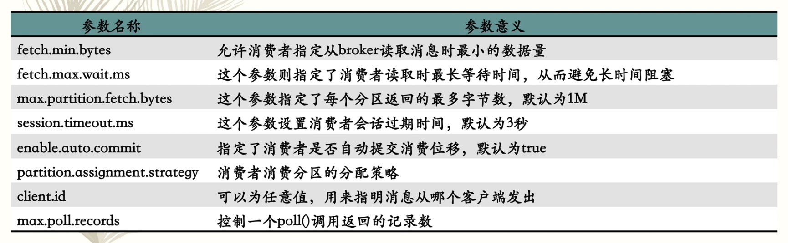      

### 4.4 消费者组的概念

假设我们从kafka中去读取消息，假如我们生产者写入的消息比消费者消费消息快，随着时间的增长消息堆积越来越严重，这时我们需要增加多个消费者来进行水平扩展，所以建议创建topic的时候创建比较多的分区数，这样可以在消费者负载比较高的情况下增加消费者组而增加消费者，提高消费性能，但是消费者的数量不应该比分区数多。


增加消费者进行水平扩张，提高消费能力

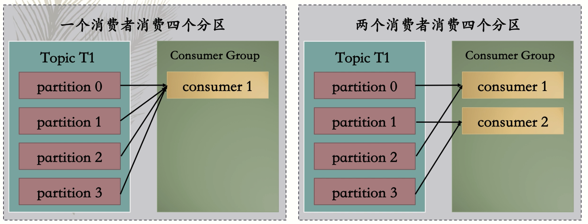   

消费者数量不应该比分区数多，容易造成资源浪费

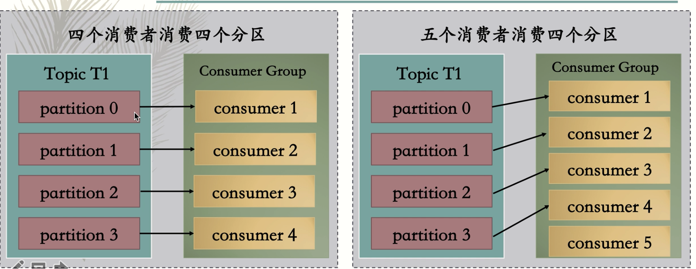     


## 五、Kafka的内部机制

### 5.1 集群成员

节点：

kafka使用zookeeper来管理集群成员的状态，每隔broker都有唯一的id(在配置文件中指定或是自动生成的)，当broker启动的时候会在zookeeper中注册相应的节点。如果集群中存在相同的id那么新的broker会启动失败，kafka的组件会监听broker节点的变化，broker加入或离开的时候会接收到通知，如果离开broker的节点会消失，但是id任然会在某些节点中存在，如果旧的broker离开，一个新broker且拥有离开broker相同的id的broker加入，那么新的broker这时就会替代之前broker并且会分配同样的topic和分区，这都是kafka自身帮我们完成的。


集群控制器：

Controller,控制器(controller/5)也是一个broker,控制器在承担broker作用之外还负责选举分区的主副本，集群中的第一个broker通过在zookeeper的controller路径下创建一个临时节点来成为一个控制器，当其他broker创建的时候也会试图创建一个临时节点，但是会收到一个节点已存在的异常，zookeeper会监听控制器临时节点，当控制器出现异常的时候，控制器临时节点会消失，其他broker节点会收到通知尝试去创建新的控制器临时节点，成为新的控制器。对于一个控制器来说，如果他发现集群中的一个broker离开的时候，他会检查该broker是否有分区的主副本如果有，则需要在其他broker中选举出新的主副本，并且发送请求给新的主副本和其他跟随着，这样新的主副本就知道需要处理的生产者和消费者的请求。而跟随着需要向新的主副本同步消息。最后每当选举出一个新的控制器的时候，就会产生一个新的更大的控制器的时间戳，这样集群中的broker接收到控制器的消息时检查时间戳，当发现消息来源于比较老的控制器的时候，她们就会忽略，避免脑裂。

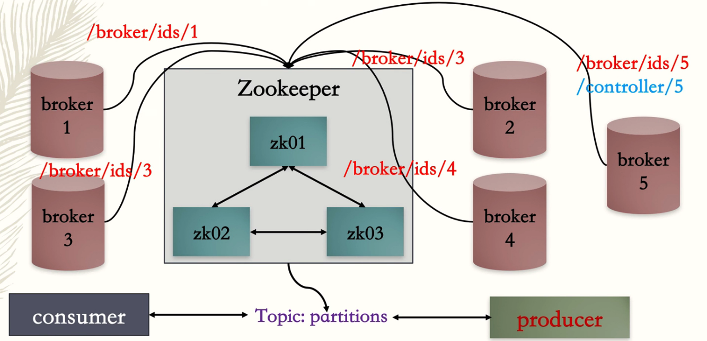   


### 5.2 partition 复制机制

kafka复制机制提供了高可用，即使有些节点出现了失败，producer依然可以继续发布消息，consumer也可以继续接收消息。kafka采用基于primary-backup的复制机制，等primary-backup都写入成功才算消息接收成功。在有n个节点的情况下，最多可以容忍n-1个节点失败。


kafka的复制是针对分区的，由下图可以看到有4个broker,有一个topic，两个分区，当producer发送消息的时候，他会选择一个分区，比如topic1会将消息发送给消息的leader 而broker 2和broker3则会拉取消息。

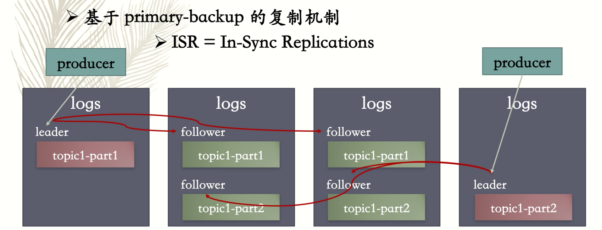   

### 5.3 请求处理原理

kafka的broker的主要工作是当作为分区的主副本的时候处理来自生产者和消费者，客户端或者跟随着副本以及控制器的请求。kafka使用的自定义的二进制协议来进行通信，请求头部包含如下图中的信息。

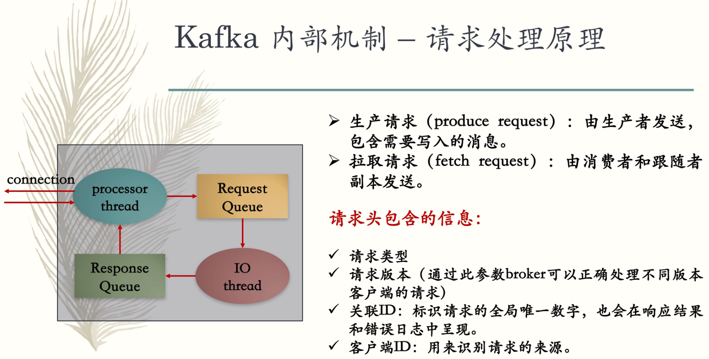 

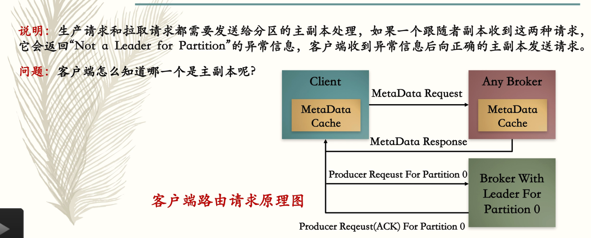 

### 5.4 生产请求&& 拉取请求


#### 1. 生产请求

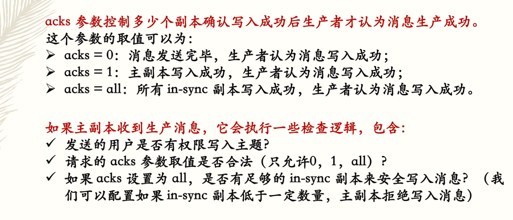 

#### 2. 拉取请求

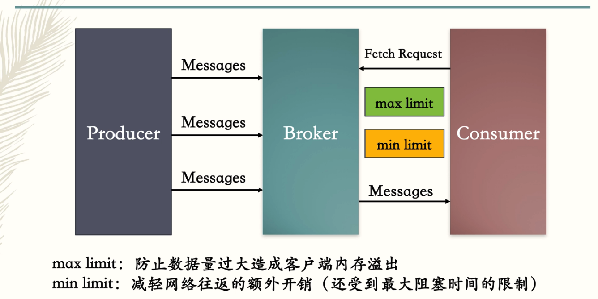 