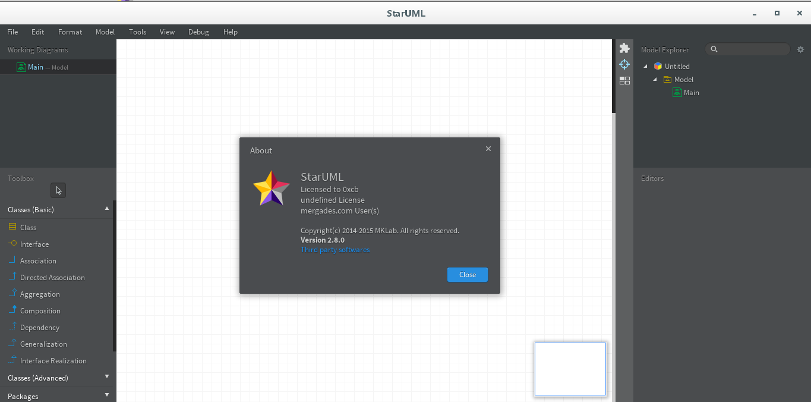
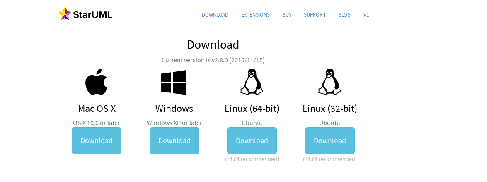
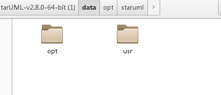
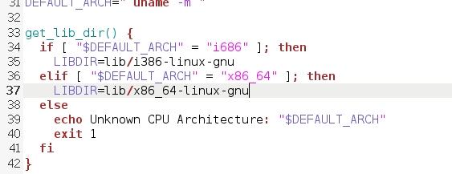
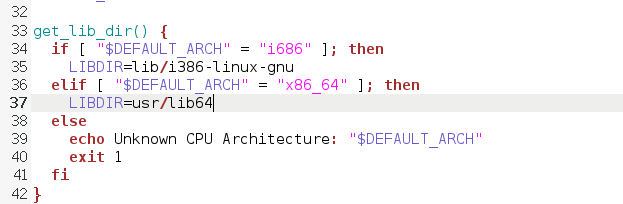
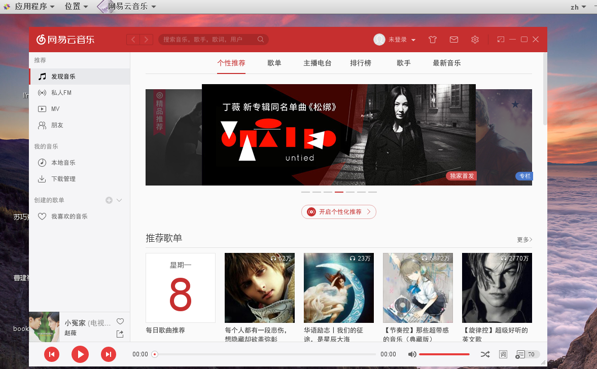

# CentOS7中安装StarUML工具
***

找了很久的UML工具，最终放弃了网友推荐的Dia，和umbrello，这两个工具都使用过，安装起来非常简单
可是使用起来非常难以接受，经过一段时间的折腾我想起了之前看过的XMind在CentOS7中的安装教程，
XMind没有rpm包,也是deb包，StarUML是一款很不错的UML工具，不过提供的安装包就是没有rpm包，
我们下边说一下怎么安装deb包。

## 一、下载安装包

1.1 先看安装后的结果

1.2 下载StarUML-v2.8.0-64-bit.deb  
官网：http://staruml.io/download  
这里我们下载Linux (64-bit) Ubuntu，下载后是StarUML-v2.8.0-64-bit.deb

## 二、安装

2.1 解压 StarUML-v2.8.0-64-bit.deb
使用如下命令解压:

>ar -vx StarUML-v2.8.0-64-bit.deb

参考：http://swordinhand.iteye.com/blog/1706326  

得到如下三个文件  
x - debian-binary  
x - control.tar.gz  
x - data.tar.xz  

2.2 继续解压data.tar.xz
>xz -dk data.tar.xz  
tar -xvf data.tar

参考：http://blog.csdn.net/rheostat/article/details/7614451

解压后得到如下内容：

  

2.3 将解压后对应的内容复制到对应的目录下

系统原先会存在opt目录，和usr目录，我们将下边的内容复制到对应的目录中

>[caojx@localhost data]$ pwd    
/home/caojx/下载/StarUML-v2.8.0-64-bit/data    
[caojx@localhost data]$ ls    
opt  usr    
[caojx@localhost data]$ sudo cp -r opt/* /opt/  ==》将opt下的内容复制到/opt/下    
[caojx@localhost data]$ sudo cp -r usr/* /usr/   ==》将usr下的内容复制到/usr/下    

2.4 解压 control.tar.gz  
>[caojx@localhost StarUML-v2.8.0-64-bit]$ tar -zxvf control.tar.gz  
[caojx@localhost StarUML-v2.8.0-64-bit]$ cd control/  
[caojx@localhost control]$ ls  
control  postinst  postrm  prerm  

2.5 安装  
>[caojx@localhost control]$ sudo ./postinst  

这里可能会报错，说找不到
>libnspr4.so.0d not found in /lib/x86_64-linux-gnu/libnspr4.so or /usr/lib/x86_64-linux-gnu/libnspr4.so.  

## 三、修改安装脚本

查找需要的文件所在的位置
>[caojx@localhost control]$  whereis libnspr4.so  
libnspr4: /usr/lib64/libnspr4.so  

修改 postinst脚本文件

修改为 --->

再次执行你可以发现安装成功了
>[caojx@localhost control]$ sudo ./postinst

注意：StarUML2是需要收费的，简单的破解参考    
http://blog.csdn.net/mergades/article/details/46662413

## 四、总结
很多dep包都可以在CentOS中通过这种方式安装，比如说还网易云音乐，也是通过这种方式安装的，
不过网易云音乐稍微麻烦点，需要安装很多依赖，这里就不演示了。

