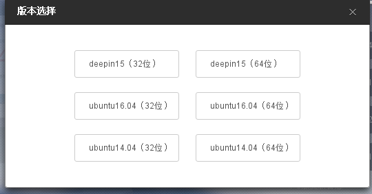
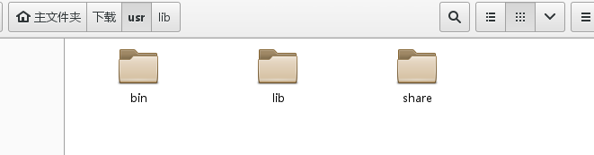
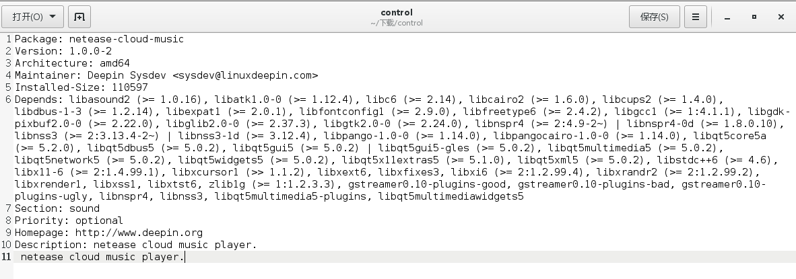
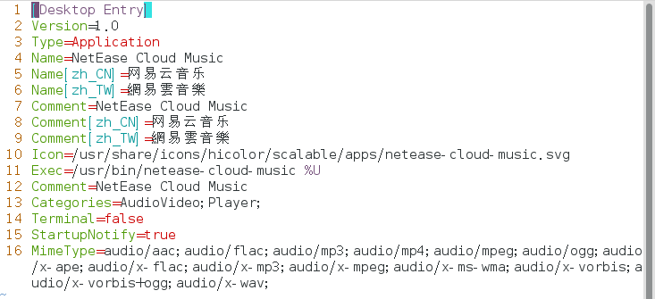

# CentOS7中安装网易云音乐
***

[TOC]

CentOS7中一直没有一个像样的音乐播放器，网易云音乐与深度科技团队在半年前就启动了“网易云音乐Linux版“，
但是只提供了Ubuntu（14.04&16.04）和deepin15版本，并不涉及CentOS7，不过花点时间还是可以在CentOS7中
安装上的。

## 一、下载安装包

1.1 下载ubuntu14.04版本
这里下载的是ubuntu14.04(64位)安装包，下载其他的版本有些依赖包找不到。

  

## 二、解压安装包

2.1 解压 netease-cloud-music_1.0.0-2_amd64_ubuntu14.04.deb

使用如下命令解压:

>ar -vx netease-cloud-music_1.0.0-2_amd64_ubuntu14.04.deb

得到如下三个文件  
x - debian-binary    
x - control.tar.gz    
x - data.tar.xz    

2.2 继续解压data.tar.xz
>xz -dk data.tar.xz    
>tar -xvf data.tar   

解压后得到的文件内容如下

将他们放入到CentOS7中对应的/usr目录下
>sudo cp -r usr/* /usr/

## 三、根据提示安装依赖

3.1 执行如下命令

> /usr/bin/netease-cloud-music

命令执行后会提示缺少某些依赖包，我们可以通过如下几个步骤解决。
1. 根据提示使用yum命令去仓库中查找是否有对应的安装包，有则安装上
2. 如果yum命令查询不到对应的安装包则手动去http://www.rpmfind.net/下载对应的rpm包安装。

提示：只有很少的包需要去http://www.rpmfind.net/中下载对应的CentOS7的rpm包安装，多数是通过yum命令安装上的，请耐心查询对应的依赖包，马上就要成功了。

## 四、运行后播放失败解决

3.1 在安装完成步骤三提示所需要的依赖后播放歌曲出现”加载失败，网络错误，可在设置中发送反馈“提示，如下

原因是还缺少对应的安装包，需要安装相关的插件

安装外部源epel
>sudo rpm -ivh http://dl.fedoraproject.org/pub/epel/7/x86_64/e/epel-release-7-9.noarch.rpm

然后通过yum安装Fusion软件仓库
>sudo yum localinstall --nogpgcheck http://download1.rpmfusion.org/free/el/updates/7/x86_64/r/rpmfusion-free-release-7-1.noarch.rpm http://download1.rpmfusion.org/nonfree/el/updates/7/x86_64/r/rpmfusion-nonfree-release-7-1.noarch.rpm  

安装需要的插件
>sudo yum -y install gstreamer-plugins-good.x86_64  
>sudo yum -y install gstreamer-plugins-bad.x86_64  

如果还是出现播放失败的提示，请参考netease-cloud-music_1.0.0-2_amd64_ubuntu14.04.deb中解压后的文件control.tar.gz中的
control文件是否缺少对应的包。

3.2 安装成功  
这时你可以在CentOS7中拥有一个像样的播放器了，安装原理很简单，将对应的内容放到对应的目录下，根据提示安装好依赖包，基本就可以运行，这中方式适用于在CentOS7中安装大多数dep包。

## 五、创建启动的快捷方式

5.1 修改netease-cloud-music.desktop
该文件在/usr/share/applications路径下，需要修改Icon图标路径，和Exec可执行命令路径，修改为如下。
>sudo vim netease-cloud-music.desktop

修改文件的权限
>sudo chmod u=rw,g=r,o=r netease-cloud-music.desktop

修改后可以在应用程序中看到启动图标  

