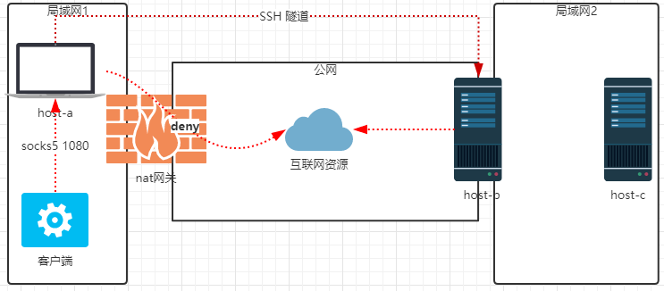
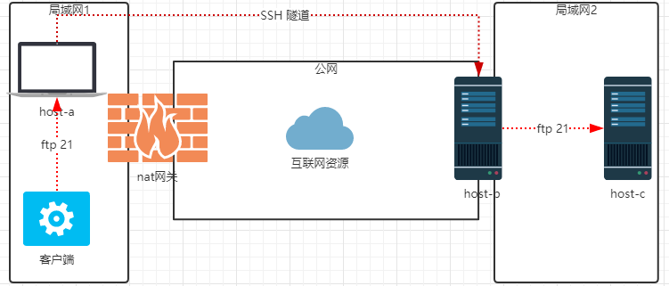
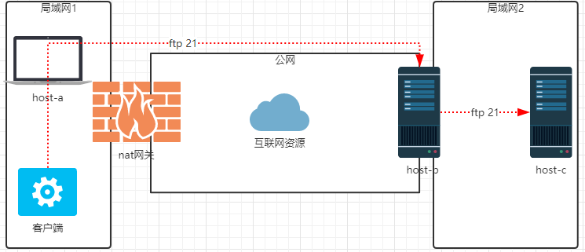
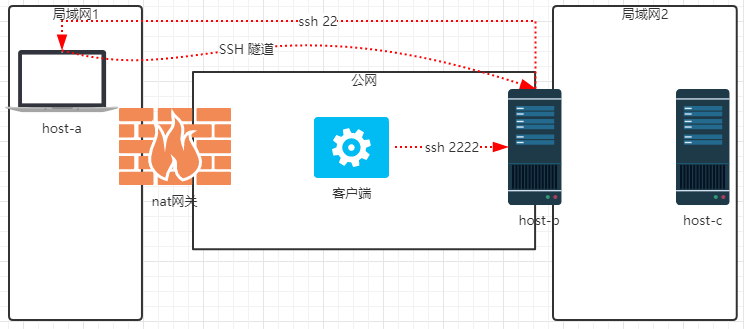

# ssh tunnel 三种模式

[TOC]

**说明：本文转自 **[ssh tunnel 三种模式](https://www.cnblogs.com/37yan/p/9003423.html)


## 一、前提知识

大家都知道SSH是一种安全的传输协议，用在连接服务器上比较多。不过其实除了这个功能，它的隧道转发功能更是吸引人。首先，认识下这三个非常强大的命令：

```shell
ssh -C -f -N -g -L listen_port:DST_Host:DST_port user@Tunnel_Host 
ssh -C -f -N -g -R listen_port:DST_Host:DST_port user@Tunnel_Host 
ssh -C -f -N -g -D listen_port user@Tunnel_Host
```

相关参数的解释： 

```shell
-C：压缩数据传输。
-f：后台认证用户/密码，通常和-N连用，不用登录到远程主机。
-N：不执行脚本或命令，通常与-f连用。
-g：在-L/-R/-D参数中，允许远程主机连接到建立的转发的端口，如果不加这个参数，只允许本地主机建立连接。
-D：动态转发，不用一个一个指定
```


## 二、环境介绍

| 主机   | 位置          | 公网 | 内网IP      | 角色       |
| ------ | ------------- | ---- | ----------- | ---------- |
| host-a | 局域网1       | 否   | 192.168.0.1 | ssh client |
| host-b | 局域网2、公网 | 是   | 192.168.1.1 | ssh server |
| host-c | 局域网2       | 否   | 192.168.1.2 | ftp server |

SSH Tunnel有三种，分别是本地Local（ssh -NfL），远程Remote（ssh -NfR），动态Dynamic（ssh -NfD）。（含义参考[man ssh](http://linux.die.net/man/1/ssh)）

## 三、3种转发方式

### 3.1 动态转发Dynamic（ssh -NfD）

如果我们需要借助一台中间服务器访问很多资源，一个个映射显然不是高明的办法。幸好，SSH客户端为我们提供了通过SSH隧道建立SOCKS服务器的功能。

- 场景1：host-a无法直接通过nat网关访问一些互联网资源

```shell
[root@host-a ~]# ssh -NfD *:1080 root@host-b
```


  

在host-a上面监听socks5端口代理数据，数据通过SSH隧道动态转发到host-c访问互联网资源， 常用于本地代理上网

### 3.2 本地转发Local（ssh -NfL）

将本地机(客户机)的某个端口转发到远端指定机器的指定端口。本地转发在本地这台机器上监听一个端口，然后所有访问这个端口的数据都会通过ssh 隧道传输到远端的对应端口上

如果说你在本地访问不了某个网络服务（host-c），而有一台机器（host-b）可以，那么你就可以通过(host-b)这台机器来访问。

```shell
ssh -L <local port>:<remote host>:<remote port> <SSH hostname>
```

-  场景1：host-a不允许直接访问host-c的ftp服务

```shell
[root@host-a ~]# ssh -NfL *:21:192.168.1.2:21 root@host-b
```

    在host-a上面监听21端口代理数据，通过SSH隧道安全与host-b传输数据，常用于正向一对一代理

 

### 3.3 远程转发Remote（ssh -NfR）

将远程主机(服务器)的某个端口转发到本地端指定机器的指定端口。

远程转发与本地转发正好相反，打开ssh隧道以后，在远端服务器监听一个端口，所有访问远端服务器指定端口都会通过隧道传输到本地的对应端口上。

```shell
ssh -R <local port>:<remote host>:<remote port> <SSH hostname>
```

- 场景1.：host-c要对外提供ftp服务

修改SSH server的配置文件(否则sshd只能监听127.0.0.1)

```shell
[root@host-b ~]# vim /etc/ssh/sshd_config
GatewayPorts yes
```

```shell
[root@host-a ~]# ssh -NfR *:21:192.168.1.2:21 root@host-b
```

    

 在host-b上面监听21端口，这样公网就可以通过host-b访问到host-c上面的ftp服务了，常用于反向代理


- 场景2：要从公网连接host-a ssh服务，但是nat网关无法映射端口

```shell
[root@host-a ~]# ssh -NfR *:2222:127.0.0.1:22 root@host-b
```

  

在host-b上面监听2222端口，数据通过SSH隧道穿透nat设备访问host-a的22端口，常用于内网穿透。