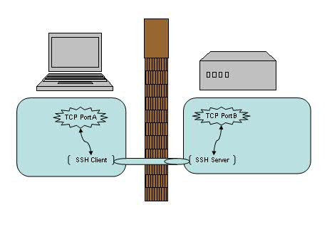
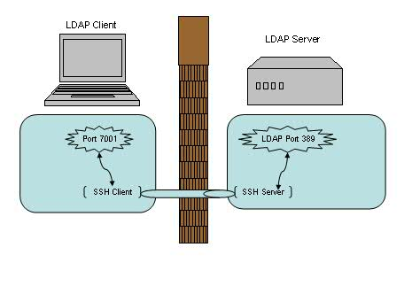
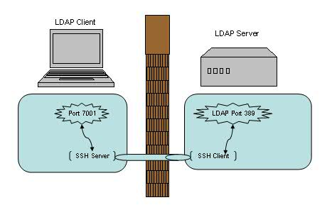
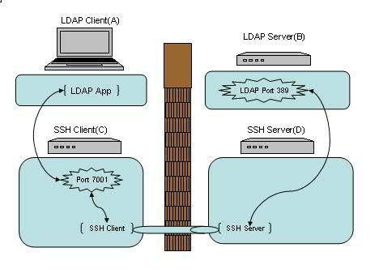
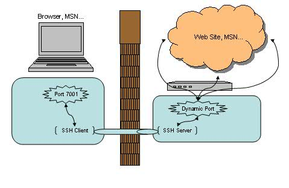
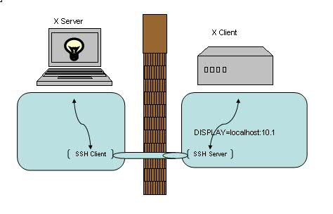

# 实战 SSH 端口转发

[TOC]

申 毅 和 邵 华 2009 年 10 月 31 日发布

原文：https://www.ibm.com/developerworks/cn/linux/l-cn-sshforward/

## 第一部分 概述

当你在咖啡馆享受免费 WiFi 的时候，有没有想到可能有人正在窃取你的密码及隐私信息？当你发现实验室的防火墙阻止了你的网络应用端口，是不是有苦难言？来看看 SSH 的端口转发功能能给我们带来什么好处吧！

### 端口转发概述

让我们先来了解一下端口转发的概念吧。我们知道，SSH 会自动加密和解密所有 SSH 客户端与服务端之间的网络数据。但是，SSH 还同时提供了一个非常有用的功能，这就是端口转发。它能够将其他 TCP 端口的网络数据通过 SSH 链接来转发，并且自动提供了相应的加密及解密服务。这一过程有时也被叫做“隧道”（tunneling），这是因为 SSH 为其他 TCP 链接提供了一个安全的通道来进行传输而得名。例如，Telnet，SMTP，LDAP 这些 TCP 应用均能够从中得益，避免了用户名，密码以及隐私信息的明文传输。而与此同时，如果您工作环境中的防火墙限制了一些网络端口的使用，但是允许 SSH 的连接，那么也是能够通过将 TCP 端口转发来使用 SSH 进行通讯。总的来说 SSH 端口转发能够提供两大功能：

1. 加密 SSH Client 端至 SSH Server 端之间的通讯数据。
2. 突破防火墙的限制完成一些之前无法建立的 TCP 连接。

**图 1. SSH 端口转发**

  

如上图所示，使用了端口转发之后，TCP 端口 A 与 B 之间现在并不直接通讯，而是转发到了 SSH 客户端及服务端来通讯，从而自动实现了数据加密并同时绕过了防火墙的限制。

## 第二部分 本地转发与远程转发

### 本地转发实例分析

我们先来看第一个例子，在实验室里有一台 LDAP 服务器（LdapServerHost），但是限制了只有本机上部署的应用才能直接连接此 LDAP 服务器。如果我们由于调试或者测试的需要想临时从远程机器（LdapClientHost）直接连接到这个 LDAP 服务器 , 有什么方法能够实现呢？

答案无疑是本地端口转发了，它的命令格式是：

> ssh -L <local port>:<remote host>:<remote port> <SSH hostname>

在 LdapClientHost 上执行如下命令即可建立一个 SSH 的本地端口转发，例如：

> $ ssh -L 7001:localhost:389 LdapServerHost

**图 2. 本地端口转发**

   

这里需要注意的是本例中我们选择了 7001 端口作为本地的监听端口，在选择端口号时要注意非管理员帐号是无权绑定 1-1023 端口的，所以一般是选用一个 1024-65535 之间的并且尚未使用的端口号即可。

然后我们可以将远程机器（LdapClientHost）上的应用直接配置到本机的 7001 端口上（而不是 LDAP 服务器的 389 端口上）。之后的数据流将会是下面这个样子：

- 我们在 LdapClientHost 上的应用将数据发送到本机的 7001 端口上，
- 而本机的 SSH Client 会将 7001 端口收到的数据加密并转发到 LdapServertHost 的 SSH Server 上。
- SSH Server 会解密收到的数据并将之转发到监听的 LDAP 389 端口上，
- 最后再将从 LDAP 返回的数据原路返回以完成整个流程。

我们可以看到，这整个流程应用并没有直接连接 LDAP 服务器，而是连接到了本地的一个监听端口，但是 SSH 端口转发完成了剩下的所有事情，加密，转发，解密，通讯。

这里有几个地方需要注意：

1. SSH 端口转发是通过 SSH 连接建立起来的，我们必须保持这个 SSH 连接以使端口转发保持生效。一旦关闭了此连接，相应的端口转发也会随之关闭。

2. 我们只能在建立 SSH 连接的同时创建端口转发，而不能给一个已经存在的 SSH 连接增加端口转发。

3. 你可能会疑惑上面命令中的 <remote host> 为什么用 localhost，它指向的是哪台机器呢？在本例中，它指向 LdapServertHost 。我们为什么用 localhost 而不是 IP 地址或者主机名呢？其实这个取决于我们之前是如何限制 LDAP 只有本机才能访问。如果只允许 lookback 接口访问的话，那么自然就只有 localhost 或者 IP 为 127.0.0.1 才能访问了，而不能用真实 IP 或者主机名。

4. 命令中的 <remote host> 和 <SSH hostname> 必须是同一台机器么？其实是不一定的，它们可以是两台不同的机器。我们在后面的例子里会详细阐述这点。

5. 好了，我们已经在 LdapClientHost 建立了端口转发，那么这个端口转发可以被其他机器使用么？比如能否新增加一台 LdapClientHost2 来直接连接 LdapClientHost 的 7001 端口？答案是不行的，在主流 SSH 实现中，本地端口转发绑定的是 lookback 接口，这意味着只有 localhost 或者 127.0.0.1 才能使用本机的端口转发 , 其他机器发起的连接只会得到“ connection refused. ”。好在 SSH 同时提供了 GatewayPorts 关键字，我们可以通过指定它与其他机器共享这个本地端口转发。

   ssh -g -L <local port>:<remote host>:<remote port> <SSH hostname>

   

### 远程转发实例分析

   我们来看第二个例子，这次假设由于网络或防火墙的原因我们不能用 SSH 直接从 LdapClientHost 连接到 LDAP 服务器（LdapServertHost），但是反向连接却是被允许的。那此时我们的选择自然就是远程端口转发了。

   它的命令格式是：
> ssh -R <local port>:<remote host>:<remote port> <SSH hostname>

例如在 LDAP 服务器（LdapServertHost）端执行如下命令：

> $ ssh -R 7001:localhost:389 LdapClientHost

**图 3. 远程端口转发**

 

和本地端口转发相比，这次的图里，SSH Server 和 SSH Client 的位置对调了一下，但是数据流依然是一样的。我们在 LdapClientHost 上的应用将数据发送到本机的 7001 端口上，而本机的 SSH Server 会将 7001 端口收到的数据加密并转发到 LdapServertHost 的 SSH Client 上。 SSH Client 会解密收到的数据并将之转发到监听的 LDAP 389 端口上，最后再将从 LDAP 返回的数据原路返回以完成整个流程。

看到这里，你是不是会有点糊涂了么？为什么叫本地转发，而有时又叫远程转发？这两者有什么区别？

### 本地转发与远程转发的对比与分析

不错，SSH Server，SSH Client，LdapServertHost，LdapClientHost，本地转发，远程转发，这么多的名词的确容易让人糊涂。让我们来分析一下其中的结构吧。首先，SSH 端口转发自然需要 SSH 连接，而 SSH 连接是有方向的，从 SSH Client 到 SSH Server 。而我们的应用也是有方向的，比如需要连接 LDAP Server 时，LDAP Server 自然就是 Server 端，我们应用连接的方向也是从应用的 Client 端连接到应用的 Server 端。如果这两个连接的方向一致，那我们就说它是本地转发。而如果两个方向不一致，我们就说它是远程转发。

我们可以回忆上面的两个例子来做个对照。

本地转发时：

LdapClientHost 同时是应用的客户端，也是 SSH Client，这两个连接都从它指向 LdapServertHost（既是 LDAP 服务端，也是 SSH Server）。

远程转发时：

LdapClientHost 是应用的客户端，但却是 SSH Server ；而 LdapServertHost 是 LDAP 的服务端，但却是 SSH Client 。这样两个连接的方向刚好相反。

另一个方便记忆的方法是，Server 端的端口都是预定义的固定端口（SSH Server 的端口 22，LDAP 的端口 389），而 Client 端的端口都是动态可供我们选择的端口（如上述例子中选用的 7001 端口）。如果 Server 端的两个端口都在同一台机器，Client 端的两个端口都在另一台机器上，那么这就是本地连接；如果这四个端口交叉分布在两个机器上，每台机器各有一个 Server 端端口，一个 Client 端端口，那就是远程连接。

弄清楚了两者的区别之后，再来看看两者的相同之处。如果你所在的环境下，既允许 LdapClientHost 发起 SSH 连接到 LdapServerHost，也允许 LdapServerHost 发起 SSH 连接到 LdapClientHost 。那么这时我们选择本地转发或远程转发都是可以的，能完成一样的功能。

接着让我们来看个进阶版的端口转发。我们之前涉及到的各种连接 / 转发都只涉及到了两台机器，还记得我们在本地转发中提到的一个问题么？本地转发命令中的 <remote host> 和 <SSH hostname> 可以是不同的机器么？

> ssh -L <local port>:<remote host>:<remote port> <SSH hostname>

答案是可以的！让我们来看一个涉及到四台机器 (A,B,C,D) 的例子。

**图 4. 多主机转发应用**

  

在 SSH Client(C) 执行下列命令来建立 SSH 连接以及端口转发：

> $ ssh -g -L 7001:<B>:389 <D>

然后在我们的应用客户端（A）上配置连接机器（C ）的 7001 端口即可。注意我们在命令中指定了“ -g ”参数以保证机器（A）能够使用机器（C）建立的本地端口转发。而另一个值得注意的地方是，在上述连接中，（A）<-> (C) 以及 (B)<->(D) 之间的连接并不是安全连接，它们之间没有经过 SSH 的加密及解密。如果他们之间的网络并不是值得信赖的网络连接，我们就需要谨慎使用这种连接方式了。

## 第三部分 其他类型的转发

### 动态转发实例分析

恩，动态转发，听上去很酷。当你看到这里时，有没有想过我们已经讨论过了本地转发，远程转发，但是前提都是要求有一个固定的应用服务端的端口号，例如前面例子中的 LDAP 服务端的 389 端口。那如果没有这个端口号怎么办？等等，什么样的应用会没有这个端口号呢？嗯，比如说用浏览器进行 Web 浏览，比如说 MSN 等等。

当我们在一个不安全的 WiFi 环境下上网，用 SSH 动态转发来保护我们的网页浏览及 MSN 信息无疑是十分必要的。让我们先来看一下动态转发的命令格式：

> $ ssh -D <local port> <SSH Server>

例如：

> $ ssh -D 7001 <SSH Server>

**图 5. 动态端口转发**

    

似乎很简单，我们依然选择了 7001 作为本地的端口号，其实在这里 SSH 是创建了一个 SOCKS 代理服务。来看看帮助文档中对 -D 参数的描述：

>-D port 
>This works by allocating a socket to listen to port on the local 
>side, and whenever a connection is made to this port, the con- 
>nection is forwarded over the secure channel, and the applica- 
>tion protocol is then used to determine where to connect to from 
>the remote machine.  Currently the SOCKS4 and SOCKS5 protocols 
>are supported, and ssh will act as a SOCKS server.  Only root 
>can forward privileged ports.  Dynamic port forwardings can also 
>be specified in the configuration file.

之后的使用就简单了，我们可以直接使用 localhost:7001 来作为正常的 SOCKS 代理来使用，直接在浏览器或 MSN 上设置即可。在 SSH Client 端无法访问的网站现在也都可以正常浏览。而这里需要值得注意的是，此时 SSH 所包护的范围只包括从浏览器端（SSH Client 端）到 SSH Server 端的连接，并不包含从 SSH Server 端 到目标网站的连接。如果后半截连接的安全不能得到充分的保证的话，这种方式仍不是合适的解决方案。

### X 协议转发实例分析

好了，让我们来看最后一个例子 - X 协议转发。

我们日常工作当中，可能会经常会远程登录到 Linux/Unix/Solaris/HP 等机器上去做一些开发或者维护，也经常需要以 GUI 方式运行一些程序，比如要求图形化界面来安装 DB2/WebSphere 等等。这时候通常有两种选择来实现：VNC 或者 X 窗口，让我们来看看后者。

使用 X 窗口通常需要分别安装：X Client 和 X Server 。在本例中我们的 X Client 就是所访问的远程 Linux/Unix/Solaris/HP，而我们的 X Server 则是发起访问的本地机器（例如你面前正在使用的笔记本或台式机）。把 X Client 端的 X 窗口显示在 X Server 端需要先行在 X Client 端指定 X Server 的位置，命令格式如下：

> export DISPLAY=<X Server IP>:<display #>.<virtual #>

例如：

> export DISPLAY=myDesktop:1.0

然后直接运行 X 应用即可，X 窗口就会自动在我们的本地端打开。

一切运行正常，但是，这时候 IT 部门突然在远程 Linux/Unix/Solaris/HP 前面加了一道防火墙。非常不幸的是，X 协议并不在允许通过的列表之内。怎么办？只能使用 VNC 了么？不，其实只要使用了 SSH 端口转发即可通过，同时也对 X 通讯数据做了加密，真是一举两得。（当然，使用此方法前最好先咨询相关 IT 部门是否符合相应的安全条例，以免造成违规操作。）

建立命令也很简单，直接从本地机器（X Server 端）发起一个如下的 SSH 连接即可：

> $ ssh -X <SSH Server>

**图 6. X 转发**

  

建立连接之后就可以直接运行远程的 X 应用。注意建立 X 转发之后会自动设置 DISPLAY 环境变量，通常会被设置成`localhost:10.0`，我们无需也不应该在连接之后再进行修改此环境变量。

一个比较常见的场景是，我们的本地机器是 Windows 操作系统，这时可以选择开源的 XMing 来作为我们的 XServer，而 SSH Client 则可以任意选择了，例如 PuTTY，Cygwin 均可以配置 访问 SSH 的同时建立 X 转发。

## 第四部分 总结

至此，我们已经完成了本地端口转发，远程端口转发，动态端口转发以及 X 转发的介绍。回顾起来，总的思路是通过将 TCP 连接转发到 SSH 通道上以解决数据加密以及突破防火墙的种种限制。对一些已知端口号的应用，例如 Telnet/LDAP/SMTP，我们可以使用本地端口转发或者远程端口转发来达到目的。动态端口转发则可以实现 SOCKS 代理从而加密以及突破防火墙对 Web 浏览的限制。对于 X 应用，无疑是 X 转发最为适用了。虽然每一部分我们都只是简单的介绍了一下，但如果能灵活应用这些技巧，相信对我们的日常生活 / 工作也是会有所帮助的。

### 相关主题

- [《 SSH 权威指南》](http://oreilly.com.cn/book.php?bn=7-5083-1085-3)（O'Reilly 图书）详细介绍了 SSH 相关的更多技术内幕及相关技巧。
- [在](http://www.ibm.com/developerworks/cn/linux/)[developerWorks](http://www.ibm.com/developerworks/cn/linux/)[中国网站](http://www.ibm.com/developerworks/cn/linux/)[Linux](http://www.ibm.com/developerworks/cn/linux/)[专区](http://www.ibm.com/developerworks/cn/linux/)中学习更多 Linux 方面的知识。