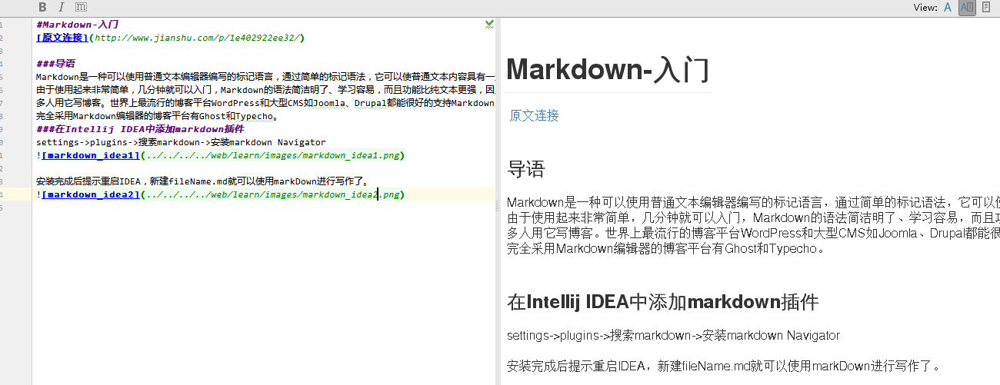

# Markdown-入门

### 导语
Markdown是一种可以使用普通文本编辑器编写的标记语言，通过简单的标记语法，它可以使普通文本内容具有一定的格式。
由于使用起来非常简单，几分钟就可以入门，Markdown的语法简洁明了、学习容易，而且功能比纯文本更强，因此有很
多人用它写博客。世界上最流行的博客平台WordPress和大型CMS如Joomla、Drupal都能很好的支持Markdown。
完全采用Markdown编辑器的博客平台有Ghost和Typecho。
### 在Intellij IDEA中添加markdown插件
settings->plugins->搜索markdown->安装markdown Navigator


安装完成后提示重启IDEA，新建fileName.md就可以使用markDown进行写作了。


### Markdown语法

>标题

markdown支持最高六级标题


H1 :# 一级标题<br/>
H2 :## 二级标题<br/>
H3 :### 三级标题<br/>
H4 :#### 四级标题<br/>
H5 :##### 五级标题<br/>
H6 :###### 六级标题<br/>
>>标题效果
# 一级标题
## 二级标题
### 三级标题
#### 四级标题
##### 五级标题
###### 六级标题

>列表

markdown列表分为有序列表和无序列表
有序列表开头为 +、-、* ，开头符号和文字之间有个空格
有序列表开头为 1. ,2. ,3. ，．．　或者字母a. ，ｂ. ，ｃ. ,．．开头，开头和文件之间有个空格
>>无序列表效果
* 1
* 2
* 3
>>有序列表效果

1. 1
2. 2
3. 3

>引用

引用使用 > 开始，和引用内容之间有空行。


>图片和链接

图片和链接之间的唯区别就在于一个!   
插入图片


提示：可以写文章的时候，可以考虑将图片存储在github上，引用图片路径。``````


插入链接
[链接描述](链接地址)


>粗体与斜体

粗体与斜体的区别也简单，粗体 **需要粗体的内容** ，斜体使用 *斜体*
即粗体两头使用两个*包裹，斜体两端使用一个\*包裹

>代码（HTML中所谓的Code）

实现方式有两种：
第一种：简单文字出现一行代码框。使用`<blockquote>`。（`不是单引号而是左上角的ESC下面~中的`）
第二种：大片文字需要实现代码框。使用Tab和四个空格。
第三中：显示制定那种代码 \```语言  \```

>脚注（footnote）

实现方式如下：
hello[^hello]

[^hello]: hi

>下划线

在空白行下方添加三条“-”横线 ---
---

>分割线

分割线只要另外起一行，输入连续的三个*开头就可以了
    
*** 


>表格

使用markdown画表格,默认靠左，”:“放在右边靠右显示，”：“在两边，居中显示


| Tables        | Are           | Cool  |
| ------------- |:-------------:| -----:|
| col 3 is      | right-aligned | $1600 |
| col 2 is      | centered      |   $12 |
| zebra stripes | are neat      |    $1 |


>显示目录结构

[toc]

>换行

换行在每行后边添加两个及以上的空格

第一行  
第二行  
第三行  

参考文章：
1. http://www.cnblogs.com/hnrainll/p/3514637.html
2. http://www.jianshu.com/p/1e402922ee32/
3. http://www.jianshu.com/p/sTeAbC
