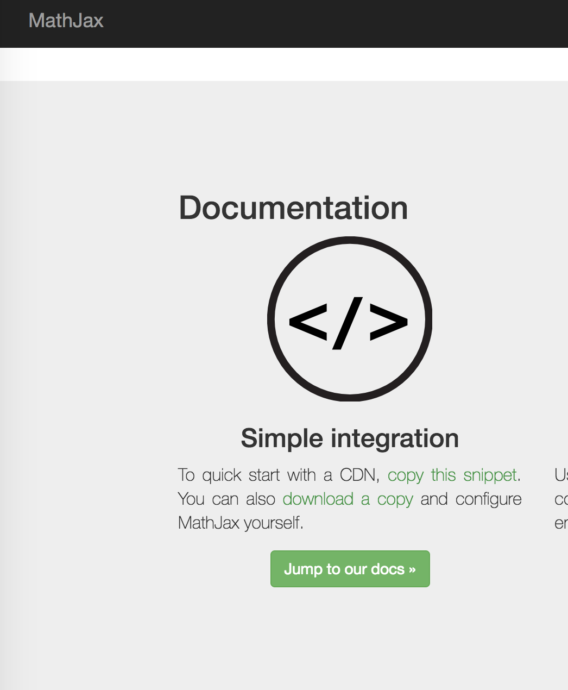
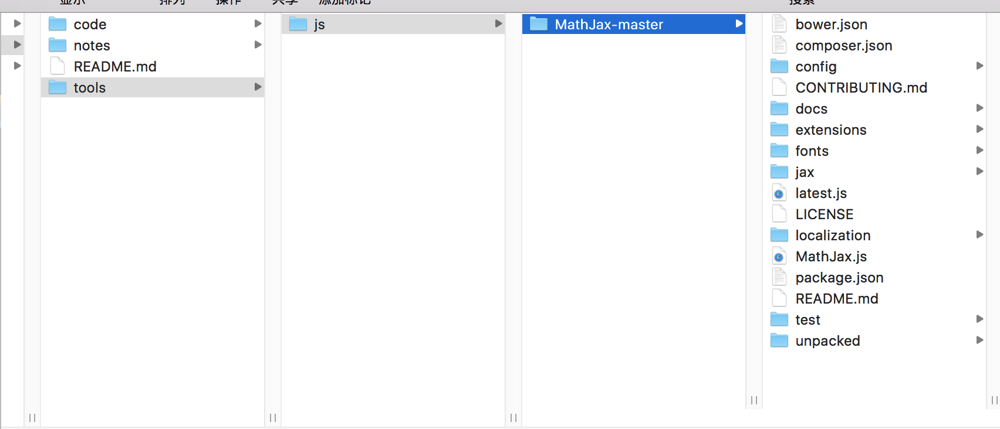
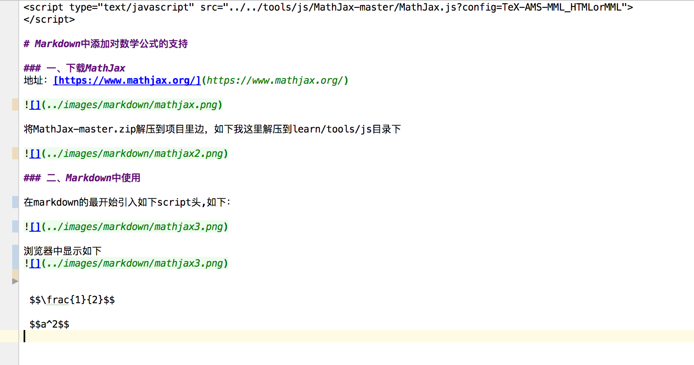
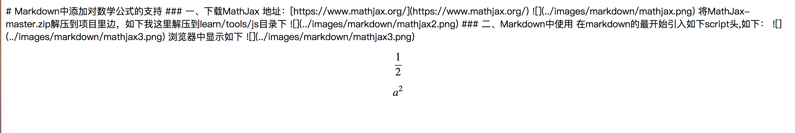

# Markdown中添加对数学公式的支持

### 一、下载MathJax  
地址：[https://www.mathjax.org/](https://www.mathjax.org/)  

    

将MathJax-master.zip解压到项目里边，如下我这里解压到learn/tools/js目录下    

    

### 二、Markdown中使用

在markdown的最开始引入如下script头,如下：

      

浏览器中显示如下
      

 $$\frac{1}{2}$$
 
 $$a^2$$

$$J(\theta) = \frac 1 2 \sum_{i=1}^m (h_\theta(x^{(i)})-y^{(i)})^2$$
