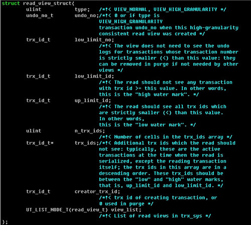

# InnoDB存储引擎MVCC的工作原理

本文转自：https://my.oschina.net/xinxingegeya/blog/505675

# InnoDB存储引擎的行结构

MySQL官方手册<https://dev.mysql.com/doc/refman/5.7/en/innodb-multi-versioning.html>

> Internally, **\*InnoDB adds three fields to each row stored in the database.*** A 6-byte **\*DB_TRX_ID***field indicates the transaction identifier for the last transaction that inserted or updated the row. Also, a deletion is treated internally as an update where a special bit in the row is set to mark it as deleted. Each row also contains a 7-byte **\*DB_ROLL_PTR*** field called the roll pointer. The roll pointer points to an undo log record written to the rollback segment. If the row was updated, the undo log record contains the information necessary to rebuild the content of the row before it was updated. A 6-byte **\*DB_ROW_ID*** field contains a row ID that increases monotonically as new rows are inserted. **\*If InnoDB generates a clustered index automatically, the index contains row ID values. Otherwise, the DB_ROW_ID column does not appear in any index.***

上面这段就是说InnoDB存储引擎在每行记录上存有三个字段

1. **\*DB_TRX_ID***
2. **\*DB_ROLL_PTR***
3. **\*DB_ROW_ID***

当然还有一个删除位。DB_TRX_ID表示最后一个事务的更新和插入。DB_ROLL_PTR指向当前记录项的undo log信息。DB_ROW_ID标识插入的新的数据行的id。

# read_view：行记录的可见性

这里有必要解释一下什么是行记录的可见性，经过上文介绍可知，MVCC实现了多个并发事务更新同一行记录会时产生多个记录版本，那问题来了，新开始的事务如果要查询这行记录，应该获取到哪个版本呢？**\*即哪个版本对这个事务是可见的。这个问题就是行记录的可见性问题。***

下图是read_view_struct的结构体：

  

其中和可见性相关的两个变量分别low_limit_id和up_limit_id，根据注释可知，前者表示事务id大于此值的行记录都不可见，后者表示事务id小于此值的行记录都可见。具体的解释见下文。

 

# 行记录的可见性实现

生成read_view：每个事务在开始的时候都会根据当前系统的活跃事务链表创建一个read_view。

在mysql客户端运行如下命令：删减后的重要信息如下，

```mysql
mysql> show engine innodb status \G
*************************** 1. row ***************************
  Type: InnoDB
  Name:
Status:
=====================================
2015-09-13 23:26:42 12cf39000 INNODB MONITOR OUTPUT
=====================================
------------
TRANSACTIONS
------------
Trx id counter 13099
Purge done for trx's n:o < 13097 undo n:o < 0 state: running but idle
History list length 380
LIST OF TRANSACTIONS FOR EACH SESSION:
---TRANSACTION 0, not started
MySQL thread id 15, OS thread handle 0x12cf39000, query id 940 localhost root init
show engine innodb status
---TRANSACTION 0, not started
MySQL thread id 14, OS thread handle 0x12cf7d000, query id 936 localhost root cleaning up
---TRANSACTION 13084, not started
MySQL thread id 3, OS thread handle 0x12ce71000, query id 837 localhost 127.0.0.1 root cleaning up
---TRANSACTION 0, not started
MySQL thread id 2, OS thread handle 0x12ce2d000, query id 863 localhost 127.0.0.1 root cleaning up
---TRANSACTION 13098, ACTIVE 19901 sec
MySQL thread id 13, OS thread handle 0x12cde9000, query id 937 localhost root cleaning up
Trx read view will not see trx with id >= 13099, sees < 13089
---TRANSACTION 13089, ACTIVE 20415 sec
MySQL thread id 12, OS thread handle 0x12cef5000, query id 938 localhost root cleaning up
Trx read view will not see trx with id >= 13090, sees < 13090
--------

1 row in set (0.00 sec)
```

可以看到有一个

```mysql
History list length 380
```

这就是当前活跃的事务列表。如下所示，

**\*ct-trx --> trx11 --> trx9 --> trx6 --> trx5 --> trx3;***

ct-trx 表示当前事务的id，对应上面的read_view数据结构如下，

> **\*read_view->creator_trx_id = ct-trx;***
>
> **\*read_view->up_limit_id = trx3;***
>
> **\*read_view->low_limit_id = trx11;***
>
> **\*read_view->trx_ids = [trx11, trx9, trx6, trx5, trx3];***
>
> read_view->m_trx_ids = 5;

根据以上的数据机构和行隐藏的列，还有undo log中相关的信息实现了行的可见性，具体如何实现行的可见性，如下分析

low_limit_id是“高水位”即当时活跃事务的最大id，如果读到row的db_trx_id>=low_limit_id，说明这些id在此之前的数据都没有提交，如注释中的描述，这些数据都不可见。

```c
if (trx_id >= view->low_limit_id) {
    return(FALSE);
}
```

**\*up_limit_id是“低水位”即当时活跃事务列表的最小事务id，如果row的db_trx_id<up_limit_id,说明这些数据在事务创建的id时都已经提交，如注释中的描述，这些数据均可见。***

```c
if (trx_id < view->up_limit_id) {
    return(TRUE);
}
```

在两个limit_id之间的我们需要从小到大逐个比较一下：

```c
n_ids = view->n_trx_ids;
for (i = 0; i < n_ids; i++) {
    trx_id_t view_trx_id = read_view_get_nth_trx_id(view, n_ids – i – 1);
    if (trx_id <= view_trx_id) {
        return(trx_id != view_trx_id);
    }
}
```

**\*这样我们在要在事务中获取数据行，我们就能根据数据行的row db_trx_id 和当前事务的read_view来判断此版本的数据在事务中是否可见。***

如果数据不可见我们需要去哪里找上版本的数据呢？

就是通过刚才提到过的7BIT的DB_ROLL_PTR去undo log信息中寻找，同时再判断下这个版本的数据是否可见，以此类推。

还比如我们在上文 show engine innodb status，有如下信息，

```mysql
---TRANSACTION 13098, ACTIVE 19901 sec
MySQL thread id 13, OS thread handle 0x12cde9000, query id 937 localhost root cleaning up
Trx read view will not see trx with id >= 13099, sees < 13089
```

will not see trx_id >= 13099 and sees <13089 

**\*就是说当前的事务ID＝13098 ，此时不会看到 trx_id >= 13099 （low_limit_id）的记录，而会看到 trx_id < 13089(up_limit_id) 的记录。***

还比如，

```mysql
---TRANSACTION 13089, ACTIVE 20415 sec
MySQL thread id 12, OS thread handle 0x12cef5000, query id 938 localhost root cleaning up
Trx read view will not see trx with id >= 13090, sees < 13090
```

都是一样的道理。现在做一个实例来推断一下

表结构

```mysql
create table t2(
    a int primary key,
    b int not null    
);
```

 

Session A

```mysql
mysql> begin;
Query OK, 0 rows affected (0.00 sec)

mysql> select * from t2;
+----+----+
| a  | b  |
+----+----+
| 10 | 10 |
| 20 | 20 |
| 30 | 30 |
+----+----+
3 rows in set (0.00 sec)
```

row trx_id < read_view -> up_limit_id 可见。 

 

Session B

read_view -> ct_trx = trx11

```mysql
mysql> begin;
Query OK, 0 rows affected (0.00 sec)

mysql> select * from t2;
+----+----+
| a  | b  |
+----+----+
| 10 | 10 |
| 20 | 20 |
| 30 | 30 |
+----+----+
3 rows in set (0.00 sec)

mysql> delete from t2 where a = 10;
Query OK, 1 row affected (0.01 sec)

mysql> commit;
Query OK, 0 rows affected (0.00 sec)

mysql> select * from t2;
+----+----+
| a  | b  |
+----+----+
| 20 | 20 |
| 30 | 30 |
+----+----+
2 rows in set (0.00 sec)
```

因为执行了delete 语句，这里只读出来两条数据。

row trx_id < read_view -> up_limit_id 可见。 

 

Session A

正如你所想的那样，如下

```mysql
mysql> select * from t2;
+----+----+
| a  | b  |
+----+----+
| 10 | 10 |
| 20 | 20 |
| 30 | 30 |
+----+----+
3 rows in set (0.00 sec)
```

**\*在Session a事务内，都是可重复读。这里的可重复读都是根据我们上文所说的 InnoDB 可见性规则来实现的。虽然在 session b删除了a ＝ 10的数据行，但会有一个DB_ROLL_PTR指针指向undo log中的数据行，这个数据行的 trx_id 符合可见性条件，所以在Session a中是可见的。***

参考资料：

<http://libisthanks.blog.163.com/blog/static/23527612320141016111027592/>

<http://www.xdata.me/?p=289>

<http://hedengcheng.com/?p=148>

[InnoDB存储引擎MVCC的工作原理](https://my.oschina.net/xinxingegeya/blog/505675)

[深度解析InnoDB多版本并发控制（MVCC）](https://blog.csdn.net/heroqiang/article/details/79024333)

=========END=========