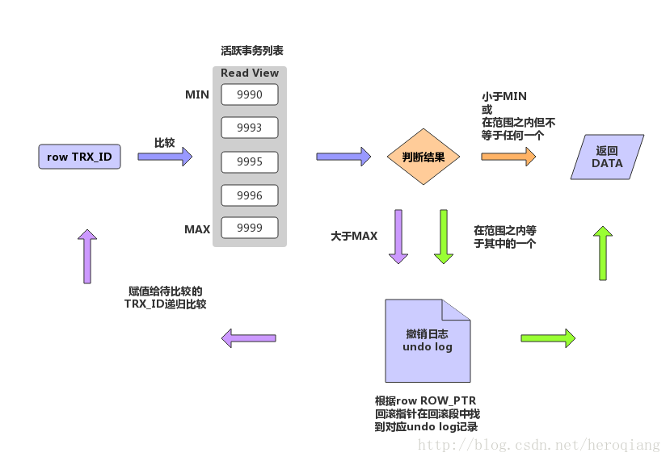

# MySQL数据库事务各隔离级别加锁情况--read committed && MVCC

本文转自：https://www.imooc.com/article/17290

**上节回顾**

------

> 上篇记录了我对MySQL 事务 隔离级别[read uncommitted](http://www.jianshu.com/p/d75fcdeb07a3)的理解。
> 这篇记录我对 MySQL 事务隔离级别 [read committed & MVCC](http://www.jianshu.com/p/fd51cb8dc03b) 的理解。

**前言**

------

> 可以很负责人的跟大家说，MySQL 中的此隔离级别**不单单是通过加锁实现的**，实际上还有repeatable read 隔离级别，其实这两个隔离级别效果的实现还需要一个辅助，这个辅助就是**MVCC**-多版本并发控制，但其实它又不是严格意义上的多版本并发控制，是不是很懵，没关系，我们一一剖析。

**目录**

------

> 1.单纯加锁是怎么实现 read committed 的?
> 2.真实的演示情况是什么样子的？
> 3.MVCC 实现原理？
> 4.对于InnoDB MVCC 实现原理的反思

**1.单纯加锁是怎么实现 read committed 的?**

------

从此隔离级别效果入手：事务只能读其他事务已提交的的记录。
数据库事务隔离级别的实现，InnoDB 支持行级锁，写时加的是行级排他锁(X lock)，那么当其他事务访问另一个事务正在update (除select操作外其他操作本质上都是写操作)的同一条记录时，事务的读操作会被阻塞。所以只能等到记录(**其实是索引上的锁**)上的排他锁释放后才能进行访问，也就是事务提交的时候。这样确实能实现read commited隔离级别效果。
数据库这样做确实可以实现 **事务只能读其他事务已提交的的记录** 的效果，但是这是很低效的一种做法，为什么呢？因为对于大部分应用来说，读操作是多于写操作的，当写操作加锁时，那么读操作全部被阻塞，这样会导致应用的相应能力受数据库的牵制。

**2.真实的演示情况是什么样子的？**

------

看如下操作：
1.开启两个客户端实例,设置事务隔离级别为read committed，并各自开启事务。

```mysql
  set transaction isolation level read committed;
  set autocommit = 0;
  begin；
```

2.客户端1做更新操作：

```mysql
update test set name = '测试' where id =32;
```

结果如下图所示：


3.客户端2做查询操作：

```mysql
select name from test where id = 32;
```

结果如下所示：


这时估计你有疑问了，正在 被客户端1 upate 的记录，客户端2还能无阻塞的读到，而且读到的是未更改之前的数据。
那就是 InnoDB 的辅助打得好，因为内部使用了 MVCC 机制，实现了一致性非阻塞读，大大提高了并发读写效率，写不影响读，且读到的事记录的镜像版本。

下面开始介绍 MVCC 原理。

**3.MVCC 实现原理**

------

网上对 MVCC 实现原理 的讲述五花八门，良莠不齐。
包括《高性能MySQL》对 MVCC 的讲解只是停留在表象，并没有结合源码去分析。当然绝大多数人还是相信这本书的，从来没有进行深剖，思考。
如下是 《高性能MySQL》对 MVCC实现原理 的描述：

```
"InnoDB的 MVCC ，是通过在每行记录的后面保存两个隐藏的列来实现的。这两个列，
一个保存了行的创建时间，一个保存了行的过期时间，
当然存储的并不是实际的时间值，而是系统版本号。"
```

**就是这本书，蒙蔽了真理，害人不浅。**

**我们还是看源码吧：**

------

**1.记录的隐藏列**
其实有三列

```
在Mysql中MVCC是在Innodb存储引擎中得到支持的，Innodb为每行记录都实现了三个隐藏字段：

6字节的事务ID（DB_TRX_ID）

7字节的回滚指针（DB_ROLL_PTR）

隐藏的ID

6字节的事物ID用来标识该行所述的事务，7字节的回滚指针需要了解下Innodb的事务模型。
```

**2.MVCC 实现的依赖项**
MVCC 在mysql 中的实现依赖的是 undo log 与 read view。

```
1.undo log: undo log中记录的是数据表记录行的多个版本，也就是事务执行过程中的回滚段,其实就是MVCC 中的一行原始数据的多个版本镜像数据。
2.read view: 主要用来判断当前版本数据的可见性。
```

**3.undo log**

> undo log是为回滚而用，具体内容就是copy事务前的数据库内容（行）到undo buffer，在适合的时间把undo buffer中的内容刷新到磁盘。undo buffer与redo buffer一样，也是环形缓冲，但当缓冲满的时候，undo buffer中的内容会也会被刷新到磁盘；与redo log不同的是，磁盘上不存在单独的undo log文件，所有的undo log均存放在主ibd数据文件中（表空间），即使客户端设置了每表一个数据文件也是如此。

我们通过行的更新过程来看下undo log 是如何形成的？

**3.1 行的更新过程**
下面演示下事务对某行记录的更新过程：

1. 初始数据行
   
   F1～F6是某行列的名字，1～6是其对应的数据。后面三个隐含字段分别对应该行的事务号和回滚指针，假如这条数据是刚INSERT的，可以认为ID为1，其他两个字段为空。
   2.事务1更改该行的各字段的值
   
   当事务1更改该行的值时，会进行如下操作：
   用排他锁锁定该行
   记录redo log
   把该行修改前的值Copy到undo log，即上图中下面的行
   修改当前行的值，填写事务编号，使回滚指针指向undo log中的修改前的行
   3.事务2修改该行的值
   
   与事务1相同，此时undo log，中有有两行记录，并且通过回滚指针连在一起。

**4.read view 判断当前版本数据项是否可见**

> 在innodb中，创建一个新事务的时候，innodb会将当前系统中的活跃事务列表（trx_sys->trx_list）创建一个副本（read view），副本中保存的是系统当前不应该被本事务看到的其他事务id列表。当用户在这个事务中要读取该行记录的时候，innodb会将该行当前的版本号与该read view进行比较。
> 具体的算法如下:
>
> 1. 设该行的当前事务id为trx_id_0，read view中最早的事务id为trx_id_1, 最迟的事务id为trx_id_2。
> 2. 如果trx_id_0< trx_id_1的话，那么表明该行记录所在的事务已经在本次新事务创建之前就提交了，所以该行记录的当前值是可见的。跳到步骤6.
> 3. 如果trx_id_0>trx_id_2的话，那么表明该行记录所在的事务在本次新事务创建之后才开启，所以该行记录的当前值不可见.跳到步骤5。
> 4. 如果trx_id_1<=trx_id_0<=trx_id_2, 那么表明该行记录所在事务在本次新事务创建的时候处于活动状态，从trx_id_1到trx_id_2进行遍历，如果trx_id_0等于他们之中的某个事务id的话，那么不可见。跳到步骤5.
> 5. 从该行记录的DB_ROLL_PTR指针所指向的回滚段中取出最新的undo-log的版本号，将它赋值该trx_id_0，然后跳到步骤2.
> 6. 将该可见行的值返回。

InnoDB如何实现MVCC，图来自于另外一片文章[深度解析InnoDB多版本并发控制（MVCC）](https://blog.csdn.net/heroqiang/article/details/79024333)

  


**需要注意的是，新建事务(当前事务)与正在内存中commit 的事务不在活跃事务链表中。**

对应代码如下：

> 函数：read_view_sees_trx_id。
> read_view中保存了当前全局的事务的范围：
> 【low_limit_id， up_limit_id】
> **1. 当行记录的事务ID小于当前系统的最小活动id，就是可见的。**
> 　　if (trx_id < view->up_limit_id) {
> 　　　　return(TRUE);
> 　　}
> **2. 当行记录的事务ID大于当前系统的最大活动id，就是不可见的。**
> 　　if (trx_id >= view->low_limit_id) {
> 　　　　return(FALSE);
> 　　}
> **3. 当行记录的事务ID在活动范围之中时，判断是否在活动链表中，如果在就不可见，如果不在就是可见的。**
> 　　for (i = 0; i < n_ids; i++) {
> 　　　　trx_id_t view_trx_id
> 　　　　　　= read_view_get_nth_trx_id(view, n_ids - i - 1);
> 　　　　if (trx_id <= view_trx_id) {
> 　　　　return(trx_id != view_trx_id);
> 　　　　}
> 　　}

**5 事务隔离级别的影响**

> 但是：对于两张不同的事务隔离级别
> 　　tx_isolation='READ-COMMITTED': 语句级别的一致性：只要当前语句执行前已经提交的数据都是可见的。
> 　　tx_isolation='REPEATABLE-READ'; 语句级别的一致性：只要是当前事务执行前已经提交的数据都是可见的。
> 针对这两张事务的隔离级别，使用相同的可见性判断逻辑是如何做到不同的可见性的呢？

**6.不同隔离级别下read view的生成原则**

> 这里就要看看read_view的生成机制：
> **1. read-commited:**
> 　　函数：ha_innobase::external_lock
> 　　if (trx->isolation_level <= TRX_ISO_READ_COMMITTED
> 　　　　&& trx->global_read_view) {
> 　　　　/ *At low transaction isolation levels we let　　　　each consistent read set its own snapshot* /
> 　　read_view_close_for_mysql(trx);
> 即：在每次语句执行的过程中，都关闭read_view, 重新在row_search_for_mysql函数中创建当前的一份read_view。
> 这样就可以根据当前的全局事务链表创建read_view的事务区间，实现read committed隔离级别。
> **2. repeatable read：**
> 　　在repeatable read的隔离级别下，创建事务trx结构的时候，就生成了当前的global read view。
> 　　使用trx_assign_read_view函数创建，一直维持到事务结束，这样就实现了repeatable read隔离级别。

**正是因为6中的read view 生成原则，导致在不同隔离级别()下,read committed 总是读最新一份快照数据，而repeatable read 读事务开始时的行数据版本。**

**4.InnoDB MVCC 实现原理的深刻反思**

------

> 上述更新前建立undo log，根据各种策略读取时非阻塞就是MVCC，undo log中的行就是MVCC中的多版本，这个可能与我们所理解的MVCC有较大的出入。

一般我们认为MVCC有下面几个特点：

> 每行数据都存在一个版本，每次数据更新时都更新该版本
> 修改时Copy出当前版本随意修改，个事务之间无干扰
> 保存时比较版本号，如果成功（commit），则覆盖原记录；失败则放弃copy（rollback）
> 就是每行都有版本号，保存时根据版本号决定是否成功，听起来含有乐观锁的味道。。。，而

Innodb的实现方式是：

> 事务以排他锁的形式修改原始数据
> 把修改前的数据存放于undo log，通过回滚指针与主数据关联
> 修改成功（commit）啥都不做，失败则恢复undo log中的数据（rollback）

**即 Innodb 中的MVCC 主要作用是实现多版本并发读，行锁，更新和删除还是会加排他锁**

二者最本质的区别是，当修改数据时是否要排他锁定，如果锁定了还算不算是MVCC？**

> **Innodb的实现真算不上MVCC**，因为并没有实现核心的多版本共存，undo
> log中的内容只是串行化的结果，记录了多个事务的过程，不属于多版本共存。但理想的MVCC是难以实现的，当事务仅修改一行记录使用理想的MVCC模式
> 是没有问题的，可以通过比较版本号进行回滚；但当事务影响到多行数据时，理想的MVCC据无能为力了。
>
> 比如，如果Transaciton1执行理想的MVCC，修改Row1成功，而修改Row2失败，此时需要回滚Row1，但因为Row1没有被
> 锁定，其数据可能又被Transaction2所修改，如果此时回滚Row1的内容，则会破坏Transaction2的修改结果，导致
> Transaction2违反ACID。
>
> 理想MVCC难以实现的根本原因在于企图通过乐观锁代替二段提交。修改两行数据，但为了保证其一致性，与修改两个分布式系统中的数据并无区别，
> 而二提交是目前这种场景保证一致性的唯一手段。二段提交的本质是锁定，乐观锁的本质是消除锁定，二者矛盾，故理想的MVCC难以真正在实际中被应
> 用，Innodb只是借了MVCC这个名字，提供了读的非阻塞而已。


**其他MVCC好文推荐**

[InnoDB存储引擎MVCC的工作原理](https://my.oschina.net/xinxingegeya/blog/505675)

[深度解析InnoDB多版本并发控制（MVCC）](https://blog.csdn.net/heroqiang/article/details/79024333)