# SQL优化

[TOC]

本笔记整理自：视频教程[SQL优化](https://ke.qq.com/course/322680)  作者：SQL优化-颜群

## 一、Linux下RPM版MYSQL安装、启停

**SQL优化，是一种概率层面的优化，至于是否实际使用了索引，按照我们的优化意愿执行SQL，我们需要看explain执行计划，原因是服务层中有SQL优化器，可能会影响我们的优化**

### 1.1 环境

MySQL 5.6 

Windows、CentOS

### 1.2 MySQL版本

5.x:
5.0-5.1：早期产品的延续，升级维护
5.4 - 5.x :  MySQL整合了三方公司的新存储引擎 （推荐5.5）

### 1.3 MySQL安装

```shell
CentOs安装MySQL：
rpm -ivh rpm软件名

如果安装时 与某个软件xxx冲突，则需要将冲突的软件卸载掉：yun -y remove xxx
安装时 有日志提示我们可以修改密码：/usr/bin/mysqladmin -u root password 'new-password'

注意： 
	如果提示“GPG keys...”安装失败，解决方案：
	rpm -ivh rpm软件名  --force --nodoeps
	
验证：
mysqladmin --version

启动mysql应用： service mysql start
关闭mysql应用： service mysql stop
重启mysql应用： service mysql restart

在计算机reboot后 登陆MySQL：mysql
可能会报错："/var/lib/mysql/mysql.sock不存在"  
原因：是Mysql服务没有启动
解决：启动服务 
	1.每次使用前 手动启动服务   /etc/init.d/mysql start
	2.开机自启   chkconfig mysql on , chkconfig mysql off    
	检查开机是否自动启动： ntsysv		
	
给mysql 的超级管理员root 增加密码：/usr/bin/mysqladmin -u root password root
			s	
登陆：
mysql -u root -p
```

## 二、MySQL启动问题、配置文件、编码问题

```shell
数据库存放目录：
ps -ef|grep mysql  可以看到：
	数据库目录：     datadir=/var/lib/mysql 
	pid文件目录： --pid-file=/var/lib/mysql/bigdata01.pid

MySQL核心目录：
	/var/lib/mysql :mysql 安装目录
	/usr/share/mysql:  配置文件
	/usr/bin：命令目录（mysqladmin、mysqldump等）
	/etc/init.d/mysql启停脚本
		
MySQL配置文件
	my-huge.cnf	高端服务器  1-2G内存
	my-large.cnf   中等规模
	my-medium.cnf  一般
	my-small.cnf   较小
	但是，以上配置文件mysql默认不能识别，默认只能识别 /etc/my.cnf
	例如采用 my-huge.cnf ：
	cp /usr/share/mysql/my-huge.cnf /etc/my.cnf
	注意：mysql5.5默认配置文件/etc/my.cnf；Mysql5.6 默认配置文件/etc/mysql-default.cnf
		
默认端口3306
mysql字符编码：
	sql:show variables like '%char%';
	可以发现部分编码是 latin,需要统一设置为utf-8
	
设置编码：
	vi /etc/my.cnf:
	[mysql]
	default-character-set=utf8
	[client]
	default-character-set=utf8
	
	[mysqld]
	character_set_server=utf8
	character_set_client=utf8
	collation_server=utf8_general_ci
	
注意：修改编码只对“之后”创建的数据库生效，因此建议在mysql安装完毕后，第一时间设置统一编码

重启 Mysql: service mysql restart
	sql:show variables like '%char%';
	
mysql: 清屏 ctrl+L, system clear
```


## 三、MySQL分层、存储引擎

### 3.1 MySQL逻辑分层 

MySQL逻辑分层可分为：连接层、服务层、引擎层、存储层

SQL的大致执行流程如下

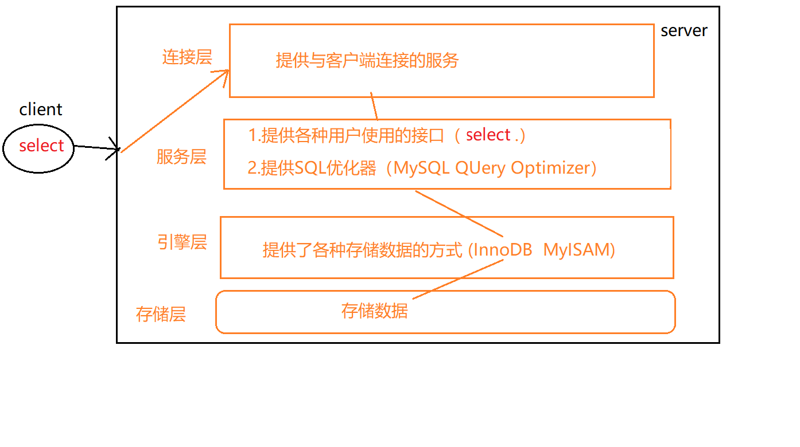

### 3.2 存储引擎

这里主要了解两种存储引擎：    

- InnoDB(默认) ：事务优先 （适合高并发操作，行锁）
- MyISAM ：性能优先  （表锁）

查询数据库支持哪些引擎？ 

```mysql
mysql>show engines;
```

查看当前使用的引擎?

```mysql
mysql>show variables like '%storage_engine%';
```

指定数据库对象的引擎：

```mysql
create table tb(
	id int(4) auto_increment,
	name varchar(5),
	dept varchar(5),
	primary key(id)
)ENGINE=MyISAM AUTO_INCREMENT=1 DEFAULT CHARSET=utf8;
```

## 四、SQL解析过程、索引、B树

本节可以结合：[步步深入：MySQL架构总览->查询执行流程->SQL解析顺序](https://www.cnblogs.com/annsshadow/p/5037667.html) 

### 4.1 SQL需要优化的原因

性能低、执行时间太长、等待时间太长、SQL语句欠佳（连接查询）、索引失效、服务器参数设置不合理（缓冲、线程数）

### 4.2 SQL的编写与解析过程

```mysql
a.编写过程：
	select dinstinct  ..from  ..join ..on ..where ..group by ...having ..order by ..limit ..
	
b.解析过程：
	from .. on.. join ..where ..group by ....having ...select dinstinct ..order by limit ...
```

### 4.3 索引的利弊

我们常说的SQL优化，主要就是优化索引

- 索引： 相当于书的目录

- 索引： index(索引)是帮助MySQL高效获取数据的数据结构，索引是数据结构（树：B树(默认)、Hash树...）


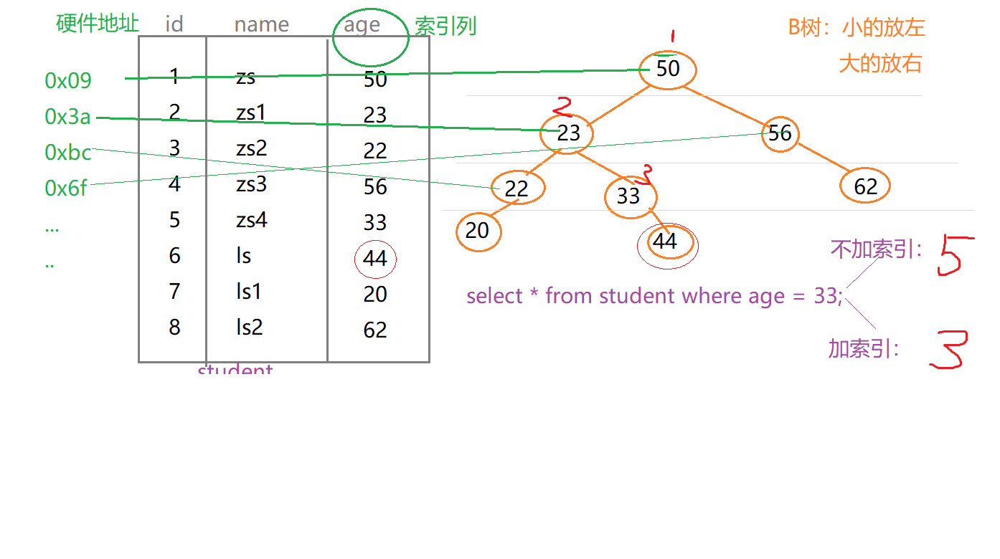  

**索引的弊端：**

1. 索引本身很大， 可以存放在内存/硬盘（通常为 硬盘）
2. 索引不是所有情况均适用：以下情况不建议建立索引 
   - 少量数据 
   -  频繁更新的字段  
   - 很少使用的字段
3. 索引会降低增删改的效率（增删改）

**索引的优势：**

1. 提高查询效率（降低IO使用率）
2. 降低CPU使用率 （...order by age desc，因为B树索引本身就是一个排好序的结构，因此在排序时可以直接使用）

## 五、B树与索引

### 5.1 B树

B树的定义先看百度百科吧，当前时间(2018/10)我对B树的结构理解也不是很深，后续补充，先上一张图

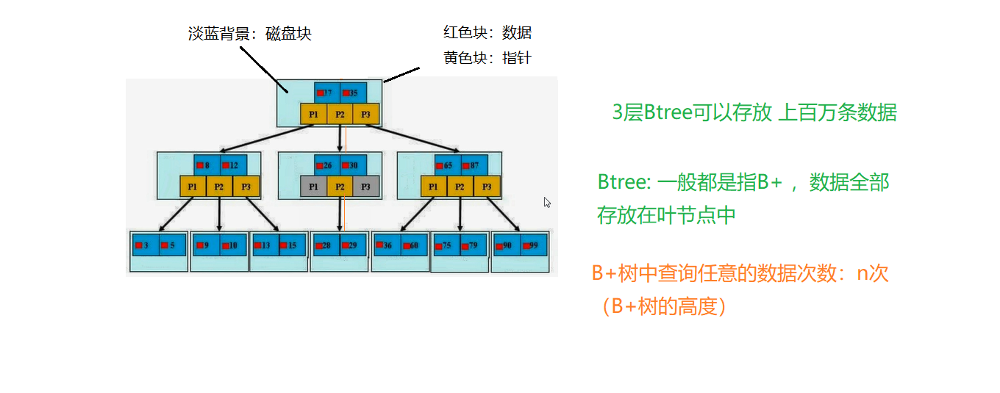  

### 5.2 索引
**索引分类**：
​	主键索引：不能重复。id    不能是null
​	唯一索引：不能重复。id    可以是null
​	单值索引：单列， age ;一个表可以多个单值索引,name。
​	复合索引：多个列构成的索引 （相当于 二级目录 ：  z: zhao）  (name,age)   (a,b,c,d,...,n)

**创建索引：**
方式一

```mysql
create 索引类型  索引名  on 表(字段)
单值：
create index idx_dept on tb(dept);
唯一：
create unique index idx_name on tb(name) ;
复合索引
create index idx_dept_name on tb(dept,name);
```

方式二
```mysql
alter table 表名 索引类型  索引名（字段）
单值：
alter table tb add index idx_dept(dept) ;
唯一：
alter table tb add unique index idx_name(name);
复合索引
alter table tb add index idx_dept_name(dept,name);

注意：如果一个字段是primary key，则改字段默认就是 主键索引	
```

方式三

```mysql
create table tb(
	id int(4) auto_increment,
	name varchar(5),
	dept varchar(5),
	primary key(id),
    KEY `idx_name` (`name`) USING BTREE COMMENT 'tb idx_name',s
    KEY `idx_dept` (`dept`) USING BTREE COMMENT 'tb idx_dept',
    unique index `idx_dept_name` (`dept,name`) USING BTREE COMMENT 'tb idx_dept_name'
)ENGINE=MyISAM AUTO_INCREMENT=1 DEFAULT CHARSET=utf8;
```


删除索引：


```mysql
drop index 索引名 on 表名;
drop index idx_name on tb;
```

查询索引：

```mysql
show index from 表名 ;
show index from 表名 \G
```

## 六、SQL优化准备
### 6.1 SQL性能优化explain

- 分析SQL的执行计划 : explain 可以模拟SQL优化器执行SQL语句，从而让开发人员 知道自己编写的SQL状
- MySQL查询优化其会干扰我们的优化，优化方法可以参见官网：https://dev.mysql.com/doc/refman/5.5/en/optimization.html

查询执行计划：  explain +SQL语句

```mysql

mysql> explain select * from tb \G;
*************************** 1. row ***************************
           id: 1
  select_type: SIMPLE
        table: NULL
   partitions: NULL
         type: NULL
possible_keys: NULL
          key: NULL
      key_len: NULL
          ref: NULL
         rows: NULL
     filtered: NULL
        Extra: no matching row in const table
1 row in set, 1 warning (0.00 sec)
```

 id：编号				
 select_type：查询类型
 table：表
 type：类型
 possible_keys ：预测用到的索引 
 key：实际使用的索引
 key_len：实际使用索引的长度
 ref：表之间的引用
 rows：通过索引查询到的数据量 
 Extra：额外的信息

### 6.2 准备数据
```mysql
create table course (
  cid   int(3),
  cname varchar(20),
  tid   int(3)
);

create table teacher (
  tid   int(3),
  tname varchar(20),
  tcid  int(3)
);

create table teacherCard (
  tcid   int(3),
  tcdesc varchar(200)
);

insert into course values (1, 'java', 1);
insert into course values (2, 'html', 1);
insert into course values (3, 'sql', 2);
insert into course values (4, 'web', 3);

insert into teacher values (1, 'tz', 1);
insert into teacher values (2, 'tw', 2);
insert into teacher values (3, 'tl', 3);

insert into teacherCard values (1, 'tzdesc');
insert into teacherCard values (2, 'twdesc');
insert into teacherCard values (3, 'tldesc');
```

### 6.3 explain中输出各字段含义

#### 1. Id 编号 

查询课程编号为2  或 教师证编号为3  的老师信息

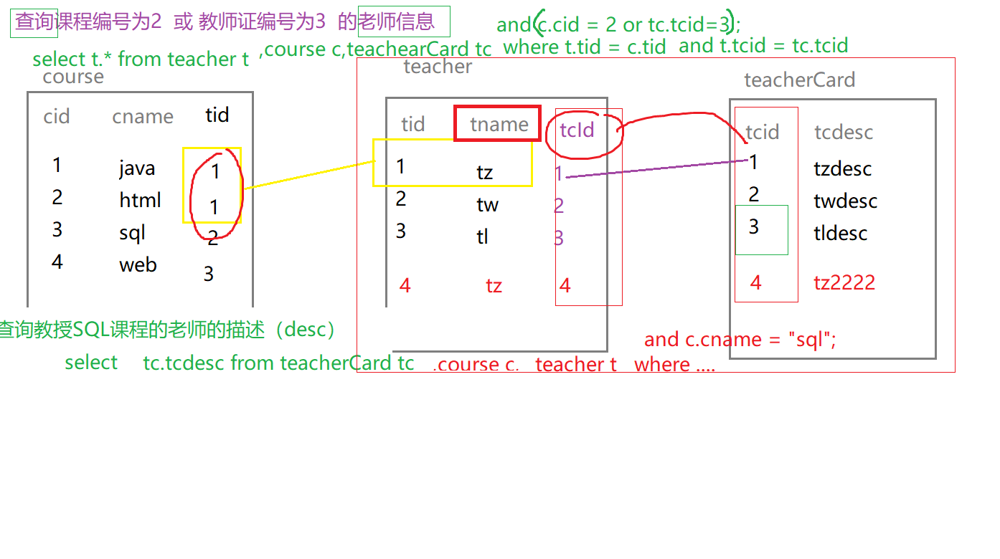  

```mysql
explain select t.* from teacher t, course c, teacherCard tc 
where t.tid = c.tid 
and t.tcid = tc.tcid 
and (c.cid = 2 or tc.tcid = 3 );
```

explain + sql:
(1)id: id值相同，从上往顺序执行，注意这里说的id指的是explain输出的ID

t3-tc3-c4

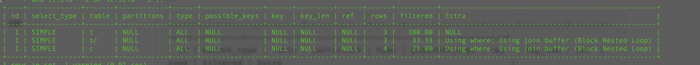  

往teacher表中加入2条数据后

```mysql
insert into teacher values (4, 'tl', 4);
insert into teacher values (5, 'tl', 5);
insert into teacher values (6, 'tl', 6);
insert into teacher values (7, 'tl', 7);
insert into teacher values (8, 'tl', 8);
```

执行顺序：tc3-c4-t6


表的执行顺序因数量的个数改变而改变的原因： 笛卡儿积

	a 	b  c
	4	3  2  =  2*3=6 * 4   =24
				 3*4=12* 2   =24
**数据小的表优先查询，执行SQL结果也有可能不一定是该结果，原因是服务层中有SQL优化器，可能会影响我们的的结果**


**ID值不同：ID值越大越优先查询 (本质：在嵌套子查询时，先查内层再查外层)，注意这里说的ID是explain出来的ID**

查询教授SQL课程的老师的描述（desc）

```mysql
explain select tc.tcdesc from teacherCard tc,course c,teacher t 
where c.tid = t.tid
and t.tcid = tc.tcid 
and c.cname = 'sql';
```

将以上多表查询转为子查询形式：

```mysql
explain select tc.tcdesc from teacherCard tc where tc.tcid = 
(select t.tcid from teacher t where t.tid =  
	(select c.tid from course c where c.cname = 'sql')
);
```

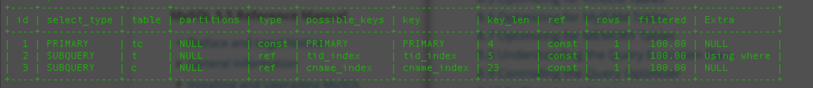  

子查询+多表： 

```mysql
explain select t.tname ,tc.tcdesc from teacher t,teacherCard tc
where t.tcid= tc.tcid
and t.tid = (select c.tid from course c where cname = 'sql') ;
```

**ID值有相同，又有不同： ID值越大越优先；ID值相同，从上往下 顺序执行**

#### 2. select_type 查询类型

select_type 是查询类型

- PRIMARY：包含子查询SQL中的主查询 （最外层）
- SUBQUERY：包含子查询SQL中的 子查询 （非最外层）
- simple：简单查询（不包含子查询、union）
- derived：衍生查询（使用到了临时表）
  ​	

a.在from子查询中只有一张表

```mysql
explain select  cr.cname from ( select * from course where tid in (1,2) ) cr;
```

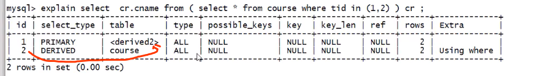  

b.在from子查询中， 如果有table1 union table2 ，则table1就是derived, table2就是union

```mysql
explain select cr.cname from (select * from course where tid = 1 union select * from course where tid = 2 ) cr;
```
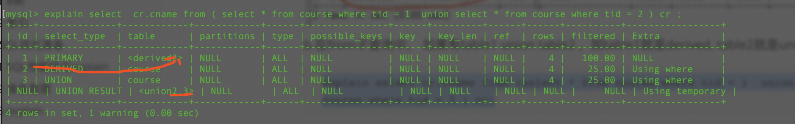  

union:上例
union result :告知开发人员，那些表之间存在union查询，即2和3存在union查询


#### 3. type 索引类型

type索引索引类型

> system > const > eq_ref > ref > fulltext > ref_or_null > index_merge > unique_subquery > index_subquery > range > index > ALL

我们常见的索引类型有情况有

> system>const>eq_ref>ref>range>index>all

**要对type进行优化的前提：有索引**，其中：system，const只是理想情况，我们优化常常实际能达到 ref > range


**system（忽略）: 只有一条数据的`系统表` ；或`衍生表`只有一条数据的主查询**

```mysql
create table test01(
    tid int(3),
    tname varchar(20)
);
insert into test01 values(1,'a');
```


增加索引

```mysql
alter table test01 add constraint tid_pk primary key(tid);
explain select * from (select * from test01)t where tid =1;
```

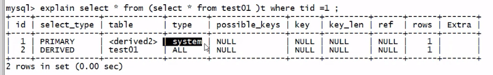    


**const：仅仅能查到一条数据的SQL ，用于Primary key 或unique索引  （类型与索引类型有关）**

```mysql
alter table test01 add constraint tid_pk primary key(tid);  #有主键忽略
explain select tid from test01 where tid =1;
```

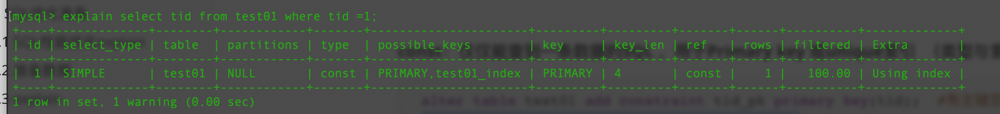  


**eq_ref：唯一性索引，对于每个索引键的查询，返回匹配唯一行数据（有且只有1个，不能多 、不能为0）**

```mysql
select ... from ..where name = ... .常见于唯一索引 和主键索引。
alter table teacherCard add constraint pk_tcid primary key(tcid);
alter table teacher add constraint uk_tcid unique index(tcid) ;
explain select t.tcid from teacher t,teacherCard tc where t.tcid = tc.tcid ;
```

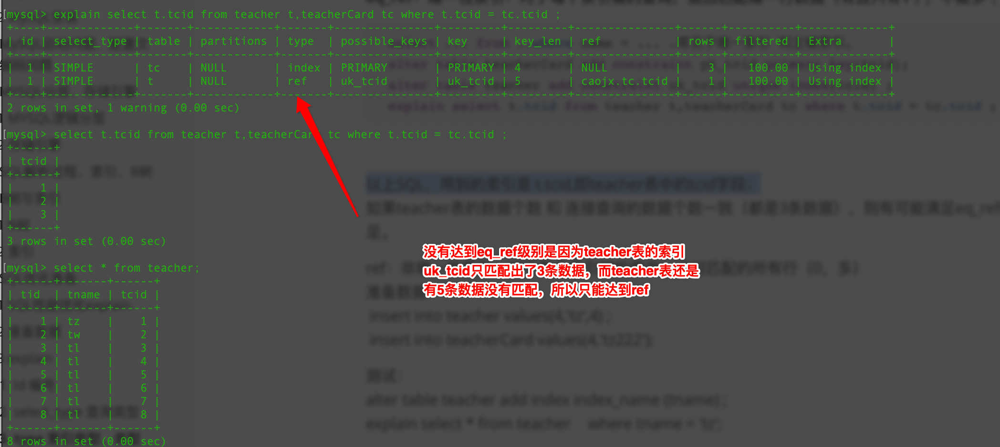 

以上SQL，用到的索引是 t.tcid,即teacher表中的tcid字段，如果teacher表的数据个数和连接查询的数据个数一致（都是3条数据），则有可能满足eq_ref级别；否则无法满足。


**ref：非唯一性索引，对于每个索引键的查询，返回匹配的所有行（0，多）**
准备数据：

```mysql
insert into teacher values(4,'tz',4) ;
insert into teacherCard values(4,'tz222');
```

测试：

```mysql
alter table teacher add index index_name (tname) ;
mysql> explain select * from teacher where tname = 'tz' \G;
*************************** 1. row ***************************
           id: 1
  select_type: SIMPLE
        table: teacher
   partitions: NULL
         type: ref
possible_keys: index_name
          key: index_name
      key_len: 23
          ref: const
         rows: 1
     filtered: 100.00
        Extra: NULL
1 row in set, 1 warning (0.00 sec)
```


**range：检索指定范围的行 ,where后面是一个范围查询(between   ,> < >=,     特殊:in有时候会失效 ，从而转为无索引all)**

```mysql
alter table teacher add index tid_index (tid) ;
mysql> explain select t.* from teacher t where t.tid in (1,2) \G;
*************************** 1. row ***************************
           id: 1
  select_type: SIMPLE
        table: t
   partitions: NULL
         type: range
possible_keys: tid_index
          key: tid_index
      key_len: 5
          ref: NULL
         rows: 2
     filtered: 100.00
        Extra: Using index condition
1 row in set, 1 warning (0.00 sec)

mysql> explain select t.* from teacher t where t.tid <3 \G;
*************************** 1. row ***************************
           id: 1
  select_type: SIMPLE
        table: t
   partitions: NULL
         type: range
possible_keys: tid_index
          key: tid_index
      key_len: 5
          ref: NULL
         rows: 2
     filtered: 100.00
        Extra: Using index condition
1 row in set, 1 warning (0.00 sec)

```


**index：查询全部索引中数据**
explain select tid from teacher ;  --tid 是索引，只需要扫描索引表，不需要所有表中的所有数据，这也称之为覆盖索引

如果一个索引包含(或覆盖)所有需要查询的字段的值，称为‘覆盖索引’。即只需扫描索引而无须回表。

```mysql
mysql> explain select tid from teacher \G;
*************************** 1. row ***************************
           id: 1
  select_type: SIMPLE
        table: teacher
   partitions: NULL
         type: index
possible_keys: NULL
          key: tid_index
      key_len: 5
          ref: NULL
         rows: 8
     filtered: 100.00
        Extra: Using index
1 row in set, 1 warning (0.01 sec)
```


**all：查询全部表中的数据**
explain select cid from course ;  --cid不是索引，需要全表所有，即需要所有表中的所有数据

```mysql
mysql> explain select cid from course \G;
*************************** 1. row ***************************
           id: 1
  select_type: SIMPLE
        table: course
   partitions: NULL
         type: ALL
possible_keys: NULL
          key: NULL
      key_len: NULL
          ref: NULL
         rows: 4
     filtered: 100.00
        Extra: NULL
1 row in set, 1 warning (0.00 sec)
```


**小结：**

system/const：结果只有一条数据
eq_ref：结果多条，但是每条数据是唯一的 ；
ref：结果多条，但是每条数据是是0或多条 ；

#### 4. possible_keys 可能用到的索引


possible_keys 指可能用到的索引，是一种预测，不准

```mysql
alter table  course add index cname_index (cname);
explain select t.tname ,tc.tcdesc from teacher t,teacherCard tc
where t.tcid= tc.tcid
and t.tid = (select c.tid from course c where cname = 'sql') ;
```


如果 possible_key/key是NULL，则说明没用索引

#### 5. key 实际使用到的索引

key 指的实际使用到的索引

#### 6. key_len 索引的长度 

utf8:1个字符3个字节
gbk:1个字符2个字节
latin:1个字符1个字节

key_len 指的是索引的长度 ，用于判断复合索引是否被完全使用  （a,b,c)

```mysql
create table test_kl(
    name char(20) not null default '' --name不可以为null
) DEFAULT CHARSET=utf8;

alter table test_kl add index index_name(name);
mysql> explain select * from test_kl where name ='' \G; # key_len=60
*************************** 1. row ***************************
           id: 1
  select_type: SIMPLE
        table: test_kl
   partitions: NULL
         type: ref
possible_keys: index_name
          key: index_name
      key_len: 60
          ref: const
         rows: 1
     filtered: 100.00
        Extra: Using index
1 row in set, 1 warning (0.00 sec)
```


```mysql
alter table test_kl add column name1 char(20);  --name1可以为null
alter table test_kl add index index_name1(name1);
#如果索引字段可以为Null,则会使用1个字节用于标识。
mysql> explain select * from test_kl where name1 ='' \G; # key_len=61
*************************** 1. row ***************************
           id: 1
  select_type: SIMPLE
        table: test_kl
   partitions: NULL
         type: ref
possible_keys: index_name1
          key: index_name1
      key_len: 61
          ref: const
         rows: 1
     filtered: 100.00
        Extra: NULL
1 row in set, 1 warning (0.00 sec)
```

--如果索引字段可以为Null,则会使用1个字节用于标识。

```mysql
drop index index_name on test_kl;
drop index index_name1 on test_kl;

增加一个复合索引 
alter table test_kl add index name_name1_index (name,name1); 
mysql> explain select * from test_kl where name1 = '' \G; # key_len=121
*************************** 1. row ***************************
           id: 1
  select_type: SIMPLE
        table: test_kl
   partitions: NULL
         type: index
possible_keys: NULL
          key: name_name1_index
      key_len: 121
          ref: NULL
         rows: 1
     filtered: 100.00
        Extra: Using where; Using index
1 row in set, 1 warning (0.00 sec)

mysql> explain select * from test_kl where name = '' \G; # key_len=60
*************************** 1. row ***************************
           id: 1
  select_type: SIMPLE
        table: test_kl
   partitions: NULL
         type: ref
possible_keys: name_name1_index
          key: name_name1_index
      key_len: 60
          ref: const
         rows: 1
     filtered: 100.00
        Extra: Using index
1 row in set, 1 warning (0.00 sec)
```


varchar(20)

```mysql
alter table test_kl add column name2 varchar(20); --可以为Null 
alter table test_kl add index name2_index (name2);
mysql> explain select * from test_kl where name2 = '' \G; # key_len=63
*************************** 1. row ***************************
           id: 1
  select_type: SIMPLE
        table: test_kl
   partitions: NULL
         type: ref
possible_keys: name2_index
          key: name2_index
      key_len: 63
          ref: const
         rows: 1
     filtered: 100.00
        Extra: NULL
1 row in set, 1 warning (0.00 sec)
```

20*3=60 +  1(null)  +2(用2个字节 标识可变长度)  =63


#### 7. ref  指明当前表所参照的字段

ref 注意与type中的ref值区分，指明当前表所参照的字段
select ....where a.c = b.x ;  (其中b.x可以是常量，const)

```mysql
alter table course add index tid_index (tid);
mysql> explain select * from course c,teacher t where c.tid = t.tid  and t.tname ='tw' \G;
*************************** 1. row ***************************
           id: 1
  select_type: SIMPLE
        table: t
   partitions: NULL
         type: ref
possible_keys: index_name,tid_index
          key: index_name
      key_len: 23
          ref: const
         rows: 1
     filtered: 100.00
        Extra: Using where
*************************** 2. row ***************************
           id: 1
  select_type: SIMPLE
        table: c
   partitions: NULL
         type: ref
possible_keys: tid_index
          key: tid_index
      key_len: 5
          ref: caojx.t.tid
         rows: 1
     filtered: 100.00
        Extra: NULL
2 rows in set, 1 warning (0.00 sec)

第一条记录ref: const，t.tname ='tw'，即当前表t参照了常量字段
第二条记录ref: caojx.t.tid，c.tid = t.tid，即当前表c参照了t.tid字段
```

#### 8. rows 索引优化查询的数据个数

rows指被索引优化查询的数据个数 (实际通过索引而查询到的数据个数)

```mysql
mysql> explain select * from course c,teacher t  where c.tid = t.tid and t.tname = 'tz' \G;
*************************** 1. row ***************************
           id: 1
  select_type: SIMPLE
        table: t
   partitions: NULL
         type: ref
possible_keys: index_name,tid_index
          key: index_name
      key_len: 23
          ref: const
         rows: 1
     filtered: 100.00
        Extra: Using where
*************************** 2. row ***************************
           id: 1
  select_type: SIMPLE
        table: c
   partitions: NULL
         type: ref
possible_keys: tid_index
          key: tid_index
      key_len: 5
          ref: caojx.t.tid
         rows: 1
     filtered: 100.00
        Extra: NULL
2 rows in set, 1 warning (0.00 sec)
```

#### 9. Extra 

Extra：
​	(i).using filesort：性能消耗大，需要“额外”的一次排序（查询），常见于 order by 语句中。


10个人根据年龄排序，a1:姓名  a2：年龄

```mysql
create table test02(
    a1 char(3),
    a2 char(3),
    a3 char(3),
    index idx_a1(a1),
    index idx_a2(a2),
    index idx_a3(a3)
);
mysql> explain select * from test02 where a1 ='' order by a1 \G;
*************************** 1. row ***************************
           id: 1
  select_type: SIMPLE
        table: test02
   partitions: NULL
         type: ref
possible_keys: idx_a1
          key: idx_a1
      key_len: 4
          ref: const
         rows: 1
     filtered: 100.00
        Extra: NULL
1 row in set, 1 warning (0.00 sec)
```


a1:姓名  a2：年龄

```mysql
mysql> explain select * from test02 where a1 ='' order by a2 \G;  --using filesort
*************************** 1. row ***************************
           id: 1
  select_type: SIMPLE
        table: test02
   partitions: NULL
         type: ref
possible_keys: idx_a1
          key: idx_a1
      key_len: 4
          ref: const
         rows: 1
     filtered: 100.00
        Extra: Using index condition; Using filesort
1 row in set, 1 warning (0.00 sec)
```

**小结：**

**对于单索引， 如果排序和查找是同一个字段，则不会出现using filesort，如果排序和查找不是同一个字段，则会出现using filesort**
**怎么避免： where哪些字段，就order by哪些字段**


复合索引：不能跨列（最佳左前缀）

```mysql
drop index idx_a1 on test02;
drop index idx_a2 on test02;
drop index idx_a3 on test02;

alter table test02 add index idx_a1_a2_a3 (a1,a2,a3) ;

explain select *from test02 where a1='' order by a3; --using filesort
explain select *from test02 where a2='' order by a3; --using filesort
explain select *from test02 where a1='' order by a2;
explain select *from test02 where a2='' order by a1; --using filesort
```

**小结：避免： where和order by 按照复合索引的顺序使用，不要跨列或无序使用，如果where中的使用到索引字段顺序+order by 字段顺序没有跨列，也算不跨列**


(ii). using temporary：性能损耗大 ，用到了临时表，一般出现在group by 语句中，表示已经有表了，但不适用，必须再来一张表

SQL解析过程：
from .. on.. join ..where ..group by ....having ...select dinstinct ..order by limit ...

```mysql
explain select a1 from test02 where a1 in ('1','2','3') group by a1;
explain select a1 from test02 where a1 in ('1','2','3') group by a2; --using temporary
```

**避免：查询那些列，就根据那些列 group by **

上边第二句会在MySQL5.7上报错

> ERROR 1055 (42000): Expression #1 of SELECT list is not in GROUP BY clause and contains nonaggregated column 'caojx.test02.a1' which is not functionally dependent on columns in GROUP BY clause; this is incompatible with sql_mode=only_full_group_by

主要是sql_mode 中有一个 only_full_group_by 的值，参考如下两篇文章解决一下

https://blog.csdn.net/jgj0129/article/details/53420574

https://www.cnblogs.com/zhangzhiqin/p/8507182.html


(iii). using index ：性能提升，索引覆盖（覆盖索引）

原因：不读取原文件，只从索引文件中获取数据 （不需要回表查询）

只要使用到的列全部都在索引中，就是索引覆盖using index

例如：test02表中有一个复合索引(a1,a2,a3)

```mysql
explain select a1,a2 from test02 where a1='' or a2= ''; --using index   

drop index idx_a1_a2_a3 on test02;
alter table test02 add index idx_a1_a2(a1,a2) ;

mysql> explain select a1,a3 from test02 where a1='' or a3= '' \G;
*************************** 1. row ***************************
           id: 1
  select_type: SIMPLE
        table: test02
   partitions: NULL
         type: ALL
possible_keys: idx_a1_a2
          key: NULL
      key_len: NULL
          ref: NULL
         rows: 1
     filtered: 100.00
        Extra: Using where
1 row in set, 1 warning (0.00 sec)
```

注意：如果用到了索引覆盖(using index时)，会对 possible_keys和key造成影响
a.如果没有where，则索引只出现在key中；
b.如果有where，则索引 出现在key和possible_keys中

```mysql
mysql> explain select a1,a2 from test02 where a1='' or a2= '' \G;
*************************** 1. row ***************************
           id: 1
  select_type: SIMPLE
        table: test02
   partitions: NULL
         type: index
possible_keys: idx_a1_a2
          key: idx_a1_a2
      key_len: 8
          ref: NULL
         rows: 1
     filtered: 100.00
        Extra: Using where; Using index
1 row in set, 1 warning (0.00 sec)

```


(iii).using where （需要回表查询）
假设age是索引列
但查询语句select age,name from ...where age =...，此语句中必须回原表查Name，因此会显示using where

```mysql
explain select a1,a3 from test02 where a3 = '' ; --a3需要回原表查询
```


(iv). impossible where ： where子句永远为false

```mysql
mysql> explain select * from test02 where a1='x' and a1='y' \G;
*************************** 1. row ***************************
           id: 1
  select_type: SIMPLE
        table: NULL
   partitions: NULL
         type: NULL
possible_keys: NULL
          key: NULL
      key_len: NULL
          ref: NULL
         rows: NULL
     filtered: NULL
        Extra: Impossible WHERE
1 row in set, 1 warning (0.00 sec)
```


(v).Using join buffer

​	extra中的一个选项，作用，Mysql引擎使用了连接缓存

## 七、优化案例


### 7.1 SQL优化示例

```mysql
create table test03
(
  a1 int(4) not null,
  a2 int(4) not null,
  a3 int(4) not null,
  a4 int(4) not null
);
alter table test03 add index idx_a1_a2_a3_4(a1,a2,a3,a4) ;

explain select a1,a2,a3,a4 from test03 where a1=1 and a2=2 and a3=3 and a4 =4; --推荐写法，因为索引的使用顺序（where后面的顺序）和复合索引的顺序一致

explain select a1,a2,a3,a4 from test03 where a4=1 and a3=2 and a2=3 and a1 =4; --虽然编写的顺序和索引顺序不一致，但是sql在真正执行前经过了SQL优化器的调整，结果与上条SQL是一致的。
--以上 2个SQL，使用了全部的复合索引

explain select a1,a2,a3,a4 from test03 where a1=1 and a2=2 and a4=4 order by a3; 
--以上SQL用到了a1 a2两个索引，该两个字段 不需要回表查询using index;而a4因为跨列使用，造成了该索引失效，需要回表查询 因此是using where；以上可以通过 key_len进行验证

explain select a1,a2,a3,a4 from test03 where a1=1 and a4=4 order by a3; 
--以上SQL出现了 using filesort(文件内排序，“多了一次额外的查找/排序”) ：不要跨列使用( where和order by 拼起来，不要跨列使用)


explain select a1,a2,a3,a4 from test03 where a1=1 and a4=4 order by a2 , a3;
--不会using filesort，由于 where 和order拼起来 a1, a4跨列失效不管，a2, a3 既where和order by 拼起来不跨列，所以不会有using filesort
```


下边我们了解一下单表优化、两表优化、三表优化

### 7.1 单表优化
```mysql
create table book(
    bid int(4) primary key,
    name varchar(20) not null,
    authorid int(4) not null,
    publicid int(4) not null,
    typeid int(4) not null 
) ENGINE=InnoDB DEFAULT CHARSET=utf8mb4

insert into book values(1,'tjava',1,1,2);
insert into book values(2,'tc',2,1,2);
insert into book values(3,'wx',3,2,1);
insert into book values(4,'math',4,2,3);
```

查询authorid=1且 typeid为2或3的bid

```mysql
explain select bid from book where typeid in(2,3) and authorid=1 order by typeid desc;
*************************** 1. row ***************************
           id: 1
  select_type: SIMPLE
        table: book
   partitions: NULL
         type: ALL
possible_keys: NULL
          key: NULL
      key_len: NULL
          ref: NULL
         rows: 4
     filtered: 25.00
        Extra: Using where; Using filesort
1 row in set, 1 warning (0.00 sec)


(a,b,c)
(a,b)

优化：加索引
alter table book add index idx_bta (bid,typeid,authorid);

索引一旦进行升级优化，需要将之前废弃的索引删掉，防止干扰。
drop index idx_bta on book;

根据SQL实际解析的顺序，调整索引的顺序：
alter table book add index idx_tab (typeid,authorid,bid); --虽然可以回表查询bid，但是将bid放到索引中 可以提升使用using index ;

再次优化（之前是index级别）：思路。因为in查询有时会变为范围查询，因此交换索引的顺序，将typeid in(2,3) 放到最后。
drop index idx_tab on book;
alter table book add index idx_atb (authorid,typeid,bid);
mysql> explain select bid from book where authorid=1 and typeid in(2,3) order by typeid desc \G;
*************************** 1. row ***************************
           id: 1
  select_type: SIMPLE
        table: book
   partitions: NULL
         type: ref
possible_keys: idx_atb
          key: idx_atb
      key_len: 4
          ref: const
         rows: 2
     filtered: 100.00
        Extra: Using where; Using index
1 row in set, 1 warning (0.00 sec)
```


本例中同时出现了Using where（需要回原表）、Using index（不需要回原表）

原因：where  authorid=1 and  typeid in(2,3) 中 authorid在索引(authorid,typeid,bid)中，因此不需要回原表（直接在索引表中能查到），而typeid虽然也在索引(authorid,typeid,bid)中，但是含in的范围查询已经使该typeid索引失效，因此相当于没有typeid这个索引，所以需要回原表（using where）

还可以通过key_len证明in可以使索引失效。

例如以下没有了in，则不会出现using where

```mysql
mysql> explain select bid from book where  authorid=1 and  typeid =3 order by typeid desc \G;
*************************** 1. row ***************************
           id: 1
  select_type: SIMPLE
        table: book
   partitions: NULL
         type: ref
possible_keys: idx_atb
          key: idx_atb
      key_len: 8
          ref: const,const
         rows: 1
     filtered: 100.00
        Extra: Using index
1 row in set, 1 warning (0.00 sec)
```


**小结：**

a.最佳左前缀，保持索引的定义和使用的顺序一致性 

b.索引需要逐步优化  

c.将含in的范围查询放到where条件的最后，防止失效


### 7.2 两表优化

```mysql
create table teacher2(
    tid int(4) primary key,
    cid int(4) not null
);
insert into teacher2 values(1,2);
insert into teacher2 values(2,1);
insert into teacher2 values(3,3);

create table course2(
    cid int(4),
    cname varchar(20)
);
insert into course2 values(1,'java');
insert into course2 values(2,'python');
insert into course2 values(3,'kotlin');
```

左连接：

```mysql
explain select * from teacher2 t left outer join course2 c
on t.cid=c.cid where c.cname='java';
```

索引往哪张表加？

- 小表驱动大表 
- 索引建立经常使用的字段上 （本题 t.cid=c.cid可知，t.cid字段使用频繁，因此给该字段加索引） [一般情况对于左外连接，给左表加索引；右外连接，给右表加索引]

例如：

小表：10
大表：300
where 	小表.x 10 = 大表.y 300;  --循环了几次？10
​		大表.y 300= 小表.x 10	 --循环了300次


```c
select ...where 小表.x10=大表.x300;
for(int i=0;i<小表.length10;i++)
{
	for(int j=0;j<大表.length300;j++)
	{
		...
	}
}
```


```c
select ...where 大表.x300=小表.x10 ;
for(int i=0;i<大表.length300;i++)
{
	for(int j=0;j<小表.length10;j++)
	{
		...
	}
}
```

以上2个FOR循环，最终都会循环3000次；但是对于双层循环来说：一般建议将数据小的循环放外层；数据大的循环放内存。

```mysql
--所以当编写 ..on t.cid=c.cid 时，将数据量小的表放左边（假设此时t表数据量小）
alter table teacher2 add index index_teacher2_cid(cid) ;
alter table course2 add index index_course2_cname(cname);
```

**小结：**

a.小表驱动大表  

b.索引建立在经常查询的字段上


### 7.3 三张表优化A B C

多表优化一下原则同样适用

a.小表驱动大表  

b.索引建立在经常查询的字段上


**小结：**

i.如果 (a,b,c,d)复合索引  和使用的顺序全部一致(且不跨列使用)，则复合索引全部使用。如果部分一致(且不跨列使用)，则使用部分索引。
​	select a,c where  a = and b= and d= 

ii.where和order by 拼起来，不要跨列使用 


iii.using temporary：需要额外再多使用一张表， 一般出现在group by语句中，已经有表了，但不适用，必须再来一张表。

解析过程：			
from .. on.. join ..where ..group by ....having ...select dinstinct ..order by limit ...

```mysql
explain select * from test03 where a2=2 and a4=4 group by a2,a4 ;--没有using temporary
explain select * from test03 where a2=2 and a4=4 group by a3 ;
```


## 八、避免索引失效的一些原则 

（1）复合索引
​	a.复合索引，不要跨列或无序使用（最佳左前缀）
​	b.复合索引，尽量使用全索引匹配
（2）不要在索引上进行任何操作（计算、函数、类型转换），否则索引失效

```mysql
select ..where A.x = .. ;  --假设A.x是索引
不要：select ..where A.x*3 = .. ;
explain select * from book where authorid = 1 and typeid = 2;--用到了2个索引
explain select * from book where authorid = 1 and typeid*2 = 2;--用到了1个索引
explain select * from book where authorid*2 = 1 and typeid*2 = 2;--用到了0个索引
explain select * from book where authorid*2 = 1 and typeid = 2;--用到了0个索引,原因：对于复合
索引，如果左边失效，右侧全部失效。(a,b,c)，例如如果 b失效，则b c同时失效。
```

（3）复合索引不能使用不等于（!=  <>）或is null (is not null)，否则自身以及右侧所有全部失效
​	复合索引中如果有>，则自身和右侧索引全部失效。

```mysql
explain select * from book where authorid = 1 and typeid =2; --使用索引 type=ref
explain select * from book where authorid != 1 and typeid =2; --不使用索引 type=all
explain select * from book where authorid != 1 and typeid !=2;--不使用索引 type=all
```

**注意：SQL优化，是一种概率层面的优化。至于是否实际使用了我们的优化，需要通过explain进行推测体验概率情况(< > =)：原因是服务层中有SQL优化器，可能会影响我们的优化**

```mysql
drop index idx_typeid on book;
drop index idx_authroid on book;
alter table book add index idx_book_at (authorid,typeid);
explain select * from book where authorid = 1 and typeid =2;--复合索引全部使用
explain select * from book where authorid > 1 and typeid =2;--复合索引中如果有>，则自身和右侧索引全部失效。
explain select * from book where authorid = 1 and typeid >2;--复合索引全部使用
----明显的概率问题---
explain select * from book where authorid < 1 and typeid =2;--复合索引只用到了1个索引
explain select * from book where authorid < 4 and typeid =2;--复合索引全部失效
```

我们学习索引优化 ，是一个大部分情况适用的结论，但由于SQL优化器等原因该结论不是100%正确。一般而言， 范围查询（> <  in），之后的索引失效。
​	

（4）补救。尽量使用索引覆盖（using index）（a,b,c）

```mysql
select a,b,c from xx..where a=  .. and b =.. ;
```

​
（5）like尽量以“常量”开头，不要以'%'开头，否则索引失效

```mysql
select * from xx where name like '%x%'; --name索引失效
explain select * from teacher  where tname like '%x%'; --tname索引失效
explain select * from teacher  where tna/me like 'x%';
explain select tname from teacher  where tname like '%x%'; --如果必须使用like '%x%'进行模糊查询，可以使用索引覆盖 挽救一部分。
```


（6）尽量不要使用类型转换（显示、隐式），否则索引失效


```mysql
explain select * from teacher where tname = 'abc' ;
explain select * from teacher where tname = 123 ;//程序底层将 123 -> '123'，即进行了类型转换，因此索引失效
```


（7）尽量不要使用or，否则索引失效

```mysql
explain select * from teacher where tname ='' or tcid >1 ; --将or左侧的tname 失效。
```


（8）一些其他的优化方法

- exist和in

```mysql
select ..from table where exist (子查询) ;
select ..from table where 字段 in  (子查询) ;
如果主查询的数据集大，则使用In,效率高。
如果子查询的数据集大，则使用exist,效率高。	

exist语法： 将主查询的结果，放到子查需结果中进行条件校验（看子查询是否有数据，如果有数据 则校验成功）  ，
	    如果 复合校验，则保留数据；

select tname from teacher where exists (select * from teacher) ; 
--等价于select tname from teacher
```

- order by 优化


	using filesort 有两种算法：双路排序、单路排序 （根据IO的次数）
	MySQL4.1之前默认使用双路排序
	双路：扫描2次磁盘
		1：从磁盘读取排序字段,对排序字段进行排序（在buffer中进行的排序）  
		2：扫描其他字段
	
	IO较消耗性能
	MySQL4.1之后默认使用单路排序
		只读取一次（全部字段），在buffer中进行排序。但单路排序会有一定的隐患 （不一定真的是“单路|1次IO”，有可能多次IO）。原因：如果数据量特别大，则无法将所有字段的数据一次性读取完毕，因此会进行“分片读取、多次读取”。
	
	注意：单路排序比双路排序会占用更多的buffer。
	
	单路排序在使用时，如果数据大可以考虑调大buffer的容量大小：set max_length_for_sort_data = 1024 单位byte
	
	如果max_length_for_sort_data值太低，则mysql会自动从 单路->双路 太低：需要排序的列的总大小超过了max_length_for_sort_data定义的字节数）

**提高order by查询的策略**
a.选择使用单路、双路 ，调整buffer的容量大小；
b.避免select * ... 
c.复合索引不要跨列使用 ，避免using filesort
d.保证全部的排序字段 排序的一致性（都是升序 或 降序）	

## 九、使用SQL日志排查慢SQL

慢查询SQL日志：MySQL提供的一种日志记录，用于记录MySQL种响应时间超过阀值的SQL语（long_query_time，默认10秒）
慢查询日志默认是关闭的，建议：开发调优是打开，而最终部署时关闭。
​	
检查是否开启了慢查询日志

```mysql
show variables like '%slow_query_log%';
```

临时开启

```mysql
set global slow_query_log = 1;  --在内存种开启
```

永久开启

```shell
/etc/my.cnf 中追加配置：
vi /etc/my.cnf 
[mysqld]
slow_query_log=1
slow_query_log_file=/var/lib/mysql/localhost-slow.log
```

慢查询阀值

```mysql
show variables like '%long_query_time%';
```


临时设置阀值

```mysql
exit--设置完毕后，重新登陆后起效 （不需要重启服务）
```

永久设置阀值：		

```shell
/etc/my.cnf 中追加配置：
vi /etc/my.cnf 
[mysqld]
long_query_time=3
```

查询超过阀值的SQL


```mysql
select sleep(4);
select sleep(5);
select sleep(3);
select sleep(3);
--查询超过阀值的SQL：
show global status like '%slow_queries%';
```

(1)慢查询的sql被记录在了日志中，因此可以通过日志 查看具体的慢SQL

```mysql
cat /var/lib/mysql/localhost-slow.log
```

(2)通过mysqldumpslow工具查看慢SQL，可以通过一些过滤条件 快速查找出需要定位的慢SQL

```mysql
mysqldumpslow --help
s：排序方式
r:逆序
l:锁定时间
g:正则匹配模式

--获取返回记录最多的3个SQL
	mysqldumpslow -s r -t 3  /var/lib/mysql/localhost-slow.log

--获取访问次数最多的3个SQL
	mysqldumpslow -s c -t 3 /var/lib/mysql/localhost-slow.log

--按照时间排序，前10条包含left join查询语句的SQL
	mysqldumpslow -s t -t 10 -g "left join" /var/lib/mysql/localhost-slow.log

语法：
	mysqldumpslow 各种参数  慢查询日志的文件
```


## 十、分析海量数据

a.模拟海量数据  存储过程（无return）/存储函数（有return）
​	

```mysql
create database testdata;
use testdata
create table dept(
    dno int(5) primary key default 0,
    dname varchar(20) not null default '',
    loc varchar(30) default ''
)engine=innodb default charset=utf8;

create table emp(
    eid int(5) primary key,
    ename varchar(20) not null default '',
    job varchar(20) not null default '',
    deptno int(5) not null default 0
)engine=innodb default charset=utf8;
```

通过存储函数 插入海量数据：


```mysql
--创建存储函数：randstring(6)  ->aXiayx  用于模拟员工名称
delimiter $
create function randstring(n int) returns varchar(255)
begin
	declare  all_str varchar(100) default 'abcdefghijklmnopqrstuvwxyzABCDEFGHIJKLMNOPQRSTUVWXYZ';
	declare return_str varchar(255) default '';
	declare i int default 0;
	while i<n
	do
		set return_str = concat(  return_str,      substring(all_str,   FLOOR(1+rand()*52)   ,1));
		set i=i+1;
	end while;
	return return_str;
end $
```


如果报错：You have an error in your SQL syntax，说明SQL语句语法有错，需要修改SQL语句；

 如果报错This function has none of DETERMINISTIC, NO SQL, or READS SQL DATA in its declaration and binary logging is enabled (you *might* want to use the less safe log_bin_trust_function_creators variable)
是因为 存储过程/存储函数在创建时与之前的开启慢查询日志冲突了 


解决冲突：
临时解决( 开启log_bin_trust_function_creators )
​	show variables like '%log_bin_trust_function_creators%';
​	set global log_bin_trust_function_creators = 1;
永久解决：
​	/etc/my.cnf 
​	[mysqld]
​	log_bin_trust_function_creators = 1


```mysql
--产生随机整数
create function ran_num() returns int(5)
begin
	declare i int default 0;
	set i =floor( rand()*100 ) ;
	return i ;
end $
```


```mysql
--通过存储过程插入海量数据：emp表中,10000,   100000
create procedure insert_emp( in eid_start int(10),in data_times int(10))
begin 
	declare i int default 0;
	set autocommit = 0 ;
	repeat
		insert into emp values(eid_start + i, randstring(5) ,'other' ,ran_num()) ;
		set i=i+1 ;
		until i=data_times
	end repeat ;
	commit ;
end $
```


```mysql
--通过存储过程插入海量数据：dept表中  
create procedure insert_dept(in dno_start int(10) ,in data_times int(10))
begin
	declare i int default 0;
	set autocommit = 0 ;
	repeat
	
		insert into dept values(dno_start+i ,randstring(6),randstring(8)) ;
		set i=i+1 ;
		until i=data_times
	end repeat ;
commit;
end$
```


```mysql
--插入数据
delimiter ; 
call insert_emp(1000,800000);
call insert_dept(10,30);
```

b.分析海量数据:
（1）profiles

```mysql
show profiles; --默认关闭
show variables like '%profiling%';
set profiling = on; 

mysql> show variables like '%profiling%';
+------------------------+-------+
| Variable_name          | Value |
+------------------------+-------+
| have_profiling         | YES   |
| profiling              | ON    |
| profiling_history_size | 15    |
+------------------------+-------+
3 rows in set (0.00 sec)

mysql> show profiles;
+----------+------------+-----------------------------------+
| Query_ID | Duration   | Query                             |
+----------+------------+-----------------------------------+
|        1 | 0.00174500 | show variables like '%profiling%' |
+----------+------------+-----------------------------------+
1 row in set, 1 warning (0.00 sec)
```

show profiles  ：会记录所有profiling打开之后的  全部SQL查询语句所花费的时间

缺点：不够精确，只能看到 总共消费的时间，不能看到各个硬件消费的时间（cpu  io ）
​	
(2)精确分析:sql诊断

```mysql
show profile all for query 上一步查询的的Query_Id
show profile cpu,block io for query 上一步查询的的Query_Id

例如：
show profile all for query 1
```

(3)全局查询日志 ：记录开启之后的全部SQL语句。 （这次全局的记录操作仅仅在调优、开发过程中打开即可，在最终的部署实施时 一定关闭）

```mysql
show variables like '%general_log%';
		
--执行的所有SQL记录在表中
set global general_log = 1 ;--开启全局日志
set global log_output='table' ; --设置 将全部的SQL 记录在表中
	
--执行的所有SQL记录在文件中
set global log_output='file' ;
set global general_log = on ;
set global general_log_file='/tmp/general.log';

开启后，会记录所有SQL：会被记录 mysql.general_log表中。
select * from  mysql.general_log ;
```


## 十一、锁机制 ：解决因资源共享而造成的并发问题

示例：买最后一件衣服X
A:  	X	买 ：  X加锁 ->试衣服...下单..付款..打包 ->X解锁
B:	X       买：发现X已被加锁，等待X解锁，   X已售空


**分类：**
操作类型：

- 读锁（共享锁）： 对同一个数据（衣服），多个读操作可以同时进行，互不干扰。
- 写锁（互斥锁）： 如果当前写操作没有完毕（买衣服的一系列操作），则无法进行其他的读操作、写操作

操作范围：

- 表锁 ：一次性对一张表整体加锁。如MyISAM存储引擎使用表锁，开销小、加锁快；无死锁；但锁的范围大，容易发生锁冲突、并发度低。
- 行锁 ：一次性对一条数据加锁。如InnoDB存储引擎使用行锁，开销大，加锁慢；容易出现死锁；锁的范围较小，不易发生锁冲突，并发度高（很小概率 发生高并发问题：脏读、幻读、不可重复度、丢失更新等问题）。
- 页锁		

### 11.1 MyISAM表锁

可以参考：[mysql查询更新时的锁表机制分析(只介绍了MYISAM)](https://blog.csdn.net/u010942020/article/details/51925653)


（1）表锁 

```mysql
 --自增操作 MYSQL/SQLSERVER 支持；oracle需要借助于序列来实现自增
create table tablelock(
	id int primary key auto_increment , 
	name varchar(20)
) engine=myisam;

insert into tablelock(name) values('a1');
insert into tablelock(name) values('a2');
insert into tablelock(name) values('a3');
insert into tablelock(name) values('a4');
insert into tablelock(name) values('a5');
commit;
```

增加锁
```mysql
locak table 表1  read/write ,表2  read/write ,...
```

查看锁表情况

```mysql
mysql> show status like 'Table%';
+----------------------------+--------+
| Variable_name              | Value  |
+----------------------------+--------+
| Table_locks_immediate      | 127    |
| Table_locks_waited         | 0      |
| Table_open_cache_hits      | 800081 |
| Table_open_cache_misses    | 27     |
| Table_open_cache_overflows | 0      |
+----------------------------+--------+
5 rows in set (0.00 sec)
```

Table_locks_immediate 指的是能够立即获得表级锁的次数 
Table_locks_waited 指的是不能立即获取表级锁而需要等待的次数，如果数量大，说明锁等待多，有锁争用情况


查看正在被锁定的的表 

```mysql
show open tables; 1有锁、0无锁
```


会话：session :每一个访问数据的dos命令行、数据库客户端工具  都是一个会话

> 加读锁

会话0

```mysql
lock table tablelock read;
select * from tablelock; --读（查），可以
delete from tablelock where id =1; --写（增删改），不可以
	
select * from emp; --读，不可以
delete from emp where eid = 1; --写，不可以
```

**结论1：**
如果某一个会话对A表加了read锁，则该会话可以对A表进行读操作、不能进行写操作； 且该会话不能对其他表进行读、写操作。
即如果给A表加了读锁，则当前会话只能对A表进行读操作。

会话1（其他会话）：

```mysql
select * from tablelock;   --读（查），可以
delete from tablelock where id =1; --写，会“等待”会话0将锁释放

select * from emp;  --读（查），可以
delete from emp where eno = 1; --写，可以	
```
**结论2：**
会话0给A表加了锁，其他会话的操作：
a.可以对其他表（A表以外的表）进行读、写操作
b.对A表：读-可以；写-需要等待释放锁。

释放锁: 

```mysql
unlock tables;
```


>加写锁

会话0：
```mysql
lock table tablelock write;
```
**结论3**
会话0（当前会话）:

 可以对加了写锁的表进行任何操作（增删改查)，但是不能操作（增删改查）其他表

```mysql
mysql> select * from tablelock;
+----+------+
| id | name |
+----+------+
|  1 | a1   |
|  2 | a2   |
|  3 | a3   |
|  4 | a4   |
|  5 | a5   |
+----+------+
5 rows in set (0.00 sec)

mysql> delete from tablelock where id =1;
Query OK, 1 row affected (0.00 sec)

mysql> select * from emp;
ERROR 1100 (HY000): Table 'emp' was not locked with LOCK TABLES
```

会话1（其他会话）：

a. 对会话0中加`写锁`的表，不可以进行`增删改查`，需要等待会话0释放写锁

b.可以增删查改`非会话0`中加写锁的表


**MySQL表级锁的锁模式**
`MyISAM`在执行查询语句（`SELECT`）前，**会自动给涉及的所有表加`读锁`**，在执行更新操作（`DML`）前，会自动给涉及的表加`写锁`。

所以对MyISAM表进行操作，会有以下情况：
a、对MyISAM表的读操作（加读锁），不会阻塞其他进程（会话）对同一表的读请求，但会阻塞对同一表的写请求。只有当读锁释放后，才会执行其它进程的写操作。
b、对MyISAM表的写操作（加写锁），会阻塞其他进程（会话）对同一表的读和写操作，只有当写锁释放后，才会执行其它进程的读写操作。


> 可以简单的理解为，一个人只有一把锁，用了一处就不能用在另外一处，读锁是共享锁（一处可以上多把锁），写锁是排他锁（一处只能上一把锁）


**分析表锁定**
查看哪些表加了锁：   show open tables ;  1代表被加了锁
分析表锁定的严重程度： show status like 'table%' ;
​			Table_locks_immediate :即可能获取到的锁数
​			Table_locks_waited：需要等待的表锁数(如果该值越大，说明存在越大的锁竞争)
一般建议：
​	Table_locks_immediate/Table_locks_waited > 5000， 建议采用InnoDB引擎，否则MyISAM引擎

### 11.2 InnoDB行锁

本节内容可以先参考：[MySQL共享锁与排他锁](https://blog.csdn.net/u014292162/article/details/83271299)

行表（InnoDB）

```mysql
create table linelock(
	id int(5) primary key auto_increment,
	name varchar(20)
)engine=innodb;

insert into linelock(name) values('1');
insert into linelock(name) values('2');
insert into linelock(name) values('3');
insert into linelock(name) values('4');
insert into linelock(name) values('5');
```


mysql默认自动commit；oracle默认不会自动commit ;

为了研究行锁，暂时将自动commit关闭;  set autocommit =0 ; 以后需要通过commit

```mysql
会话0： 写操作
	insert into linelock(name) values('6');
	
会话1： 写操作 同样的数据
	update linelock set name='ax' where id = 6;
	
对行锁情况：
	1.如果会话x对某条数据a进行DML操作（研究时：关闭了自动commit的情况下），则其他会话必须等待会话x结束事务(commit/rollback)后才能对数据a进行操作。
	2.表锁是通过unlock tables，也可以通过事务解锁; 行锁是通过事务解锁。

行锁，操作不同数据：
会话0： 写操作
	insert into linelock values(8,'a8') ;
会话1： 写操作，不同的数据
	update linelock set name='ax' where id = 5;
	行锁，一次锁一行数据；因此如果操作的是不同数据，则不干扰。
```

**行锁的注意事项：**

a.如果没有索引，则行锁会转为表锁

```mysql
--给name字段加一个索引
show index from linelock;
alter table linelock add index idx_linelock_name(name);

会话0： 写操作
	update linelock set name = 'ai' where name = '3';
会话1： 写操作， 不同的数据
	update linelock set name = 'aiX' where name = '4';

会话0： 写操作
	update linelock set name = 'ai' where name = 3;
		
会话1： 写操作， 不同的数据
	update linelock set name = 'aiX' where name = 4;
		
--可以发现，数据被阻塞了（加锁）
-- 原因：如果索引类发生了类型转换，则索引失效。 因此此次操作，会从行锁转为表锁。
```


b.行锁的一种特殊情况：间隙锁：值在范围内，但却不存在
```mysql
mysql> select * from linelock;
+----+------+
| id | name |
+----+------+
|  1 | 1    |
|  2 | 2    |
|  3 | 3    |
|  4 | 4    |
|  6 | 6    |
|  8 | a8   |
|  5 | ax   |
+----+------+
--此时linelock表中 没有id=7的数据
	 update linelock set name ='x' where id >1 and id<9;  --即在此where范围中，没有id=7的数据，则id=7的数据成为间隙。
	 
	  insert into linelock values(7,'a7');
间隙：Mysql会自动给 间隙 加索 ->间隙锁。即本题会自动给id=7的数据加间隙锁（行锁）。
行锁：如果有where，则实际加索的范围就是where后面的范围（不是实际的值）
```


**行锁：**
InnoDB默认采用行锁；
缺点： 比表锁性能损耗大。
优点：并发能力强，效率高。
因此建议，高并发用InnoDB，否则用MyISAM。	


**行锁分析：**

```mysql
show status like '%innodb_row_lock%';
Innodb_row_lock_current_waits :当前正在等待锁的数量  
Innodb_row_lock_time：等待总时长。从系统启到现在 一共等待的时间
Innodb_row_lock_time_avg  ：平均等待时长。从系统启到现在平均等待的时间
Innodb_row_lock_time_max  ：最大等待时长。从系统启到现在最大一次等待的时间
Innodb_row_lock_waits ：	等待次数。从系统启到现在一共等待的次数
```


如何仅仅是查询数据，能否加锁？ 可以   for update 研究学习时，将自动提交关闭

```mysql
set autocommit =0 ;
start transaction ;
begin;
select * from linelock where id =2 for update ;
```

通过for update对query语句进行加锁。


## 十二、主从复制  （集群在数据库的一种实现）

假如我们使用如下环境进行主从搭建

windows：mysql 主
linux：mysql从

### 12.1 安装windows版mysql
如果之前计算机中安装过Mysql，要重新再安装，则需要先卸载再安装
先卸载：
通过电脑自带卸载工具卸载Mysql (电脑管家也可以)
删除一个mysql缓存文件C:\ProgramData\MySQL
删除注册表regedit中所有mysql相关配置
重启计算机
​			
安装MYSQL：
安装时，如果出现未响应，则重新打开D:\MySQL\MySQLServer5.5\bin\MySQLInstanceConfig.exe
​	
图形化客户端： SQLyog，Navicat，DataGrip


### 12.2 主机授权远程访问

如果要远程连接数据库，则需要授权远程访问，授权远程访问 :(A->B,则再B计算机的Mysql中执行以下命令)


```mysql
GRANT ALL PRIVILEGES ON *.* TO 'root'@'%' IDENTIFIED BY 'root' WITH GRANT OPTION;
FLUSH PRIVILEGES;
```

如果仍然报错，可能是防火墙没关闭，关闭Linux防火墙  service iptables stop 


### 12.3 主从同步原理图

实现主从同步（主从复制）：图

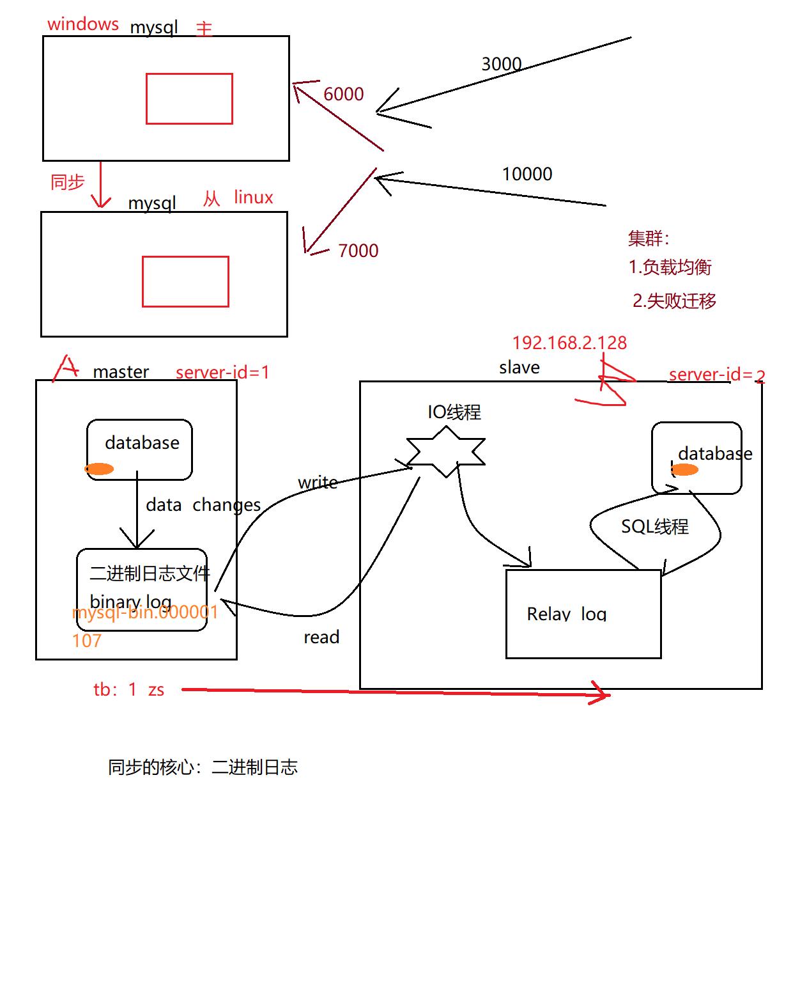

1.master将改变的数据记录在本地的 二进制日志中（binary log） ，该过程称之为：二进制日志件事
2.slave将master的binary log拷贝到自己的 relay log（中继日志文件）
3.中继日志事件，将数据读取到自己的数据库之中
注意：MYSQL主从复制 是异步的，串行化的， 有延迟  	

可以支持一个主多个从，即 master:slave = 1:n


### 12.4 配置主从同步

windows(mysql: my.ini)
linux(mysql: my.cnf)

配置前，为了无误，先将权限(远程访问)、防火墙等处理：

关闭windows/linux防火墙： windows：右键“网络” ，linux: service iptables stop

Mysql允许远程连接(windowos/linux)：

```mysql
GRANT ALL PRIVILEGES ON *.* TO 'root'@'%' IDENTIFIED BY 'root' WITH GRANT OPTION;
FLUSH PRIVILEGES;
```


主机（以下代码和操作全部在主机windows中操作-master）：
my.ini

```shell
[mysqld]
#id
server-id=1
#二进制日志文件（注意是/  不是\）
log-bin="D:/MySQL/MySQL Server 5.5/data/mysql-bin"
#错误记录文件
log-error="D:/MySQL/MySQL Server 5.5/data/mysql-error"
#主从同步时 忽略的数据库
binlog-ignore-db=mysql
#(可选)指定主从同步时，同步哪些数据库
binlog-do-db=test
```

windows中的数据库 授权哪台计算机中的数据库 是自己的从数据库：	
```mysql
GRANT REPLICATION slave,reload,super ON *.* TO 'root'@'192.168.2.%' IDENTIFIED BY 'root';
flush privileges ; 
```

查看主数据库的状态（每次在主从同步前，需要观察主机状态的最新值）
```mysql
show master status;  （mysql-bin.000001、 107）
```
文件存在D:/MySQL/MySQL Server 5.5/data/指定的目录中


从机（以下代码和操作 全部在从机linux中操作）：
my.cnf
```shell
[mysqld]
server-id=2
log-bin=mysql-bin
replicate-do-db=test
```

linux中的数据 授权哪台计算机中的数控 是自己的主计算机
```mysql
CHANGE MASTER TO 
MASTER_HOST = '192.168.2.2', 
MASTER_USER = 'root', 
MASTER_PASSWORD = 'root', 
MASTER_PORT = 3306,
master_log_file='mysql-bin.000001',
master_log_pos=107;
```

> 如果报错：This operation cannot be performed with a running slave; run STOP SLAVE first
> 解决：STOP SLAVE ;再次执行上条授权语句


### 12. 5 开启主从同步

```mysql
#从机linux：
start slave ;
#检验 
show slave status \G;	
```

> 主要观察： Slave_IO_Running和 Slave_SQL_Running，确保二者都是yes；如果不都是yes，则看下方的 Last_IO_Error。
> 本次 通过 Last_IO_Error发现错误的原因是 主从使用了相同的server-id， 检查：在主从中分别查看serverid:  show variables like 'server_id' ;
> 可以发现，在Linux中的my.cnf中设置了server-id=2，但实际执行时 确实server-id=1，原因：可能是 linux版Mysql的一个bug，也可能是 windows和Linux版本不一致造成的兼容性问题。


解决改bug：

```mysql
set global server_id =2 ;

stop slave;
set global server_id =2 ;
start slave ;
show slave status \G;
```


### 12. 6 演示主从同步
主windows =>从
​	
windows:
将表，插入数据  
观察从数据库中该表的数据