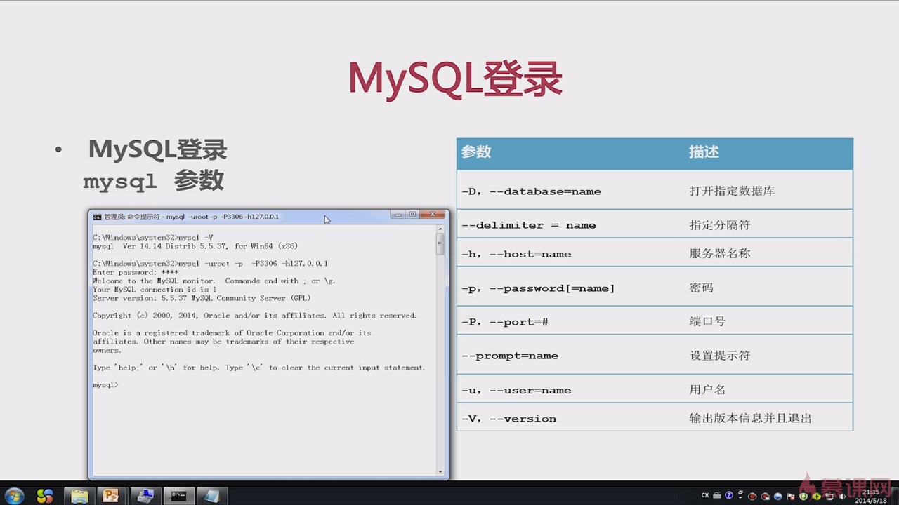
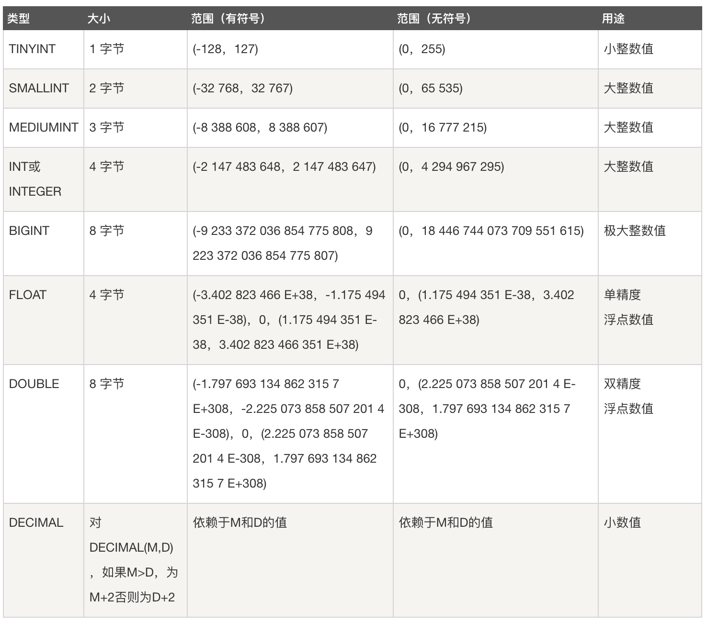
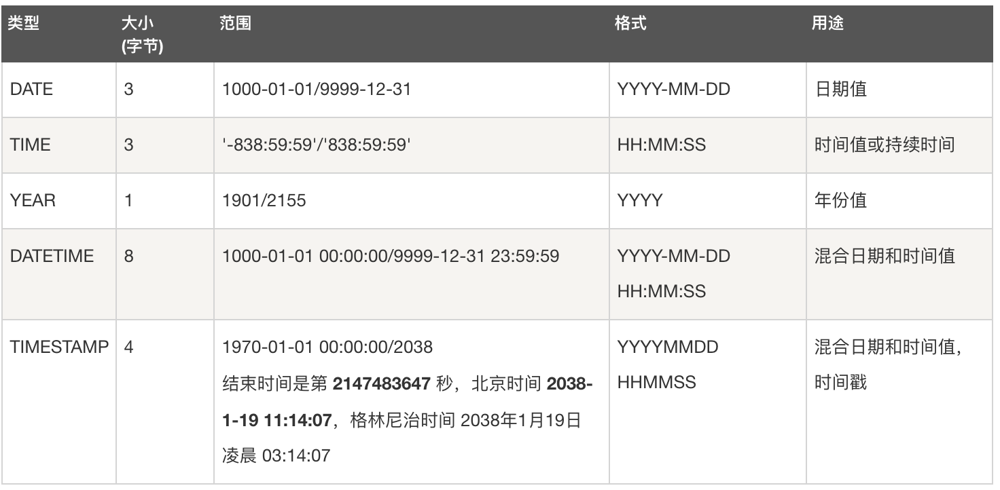
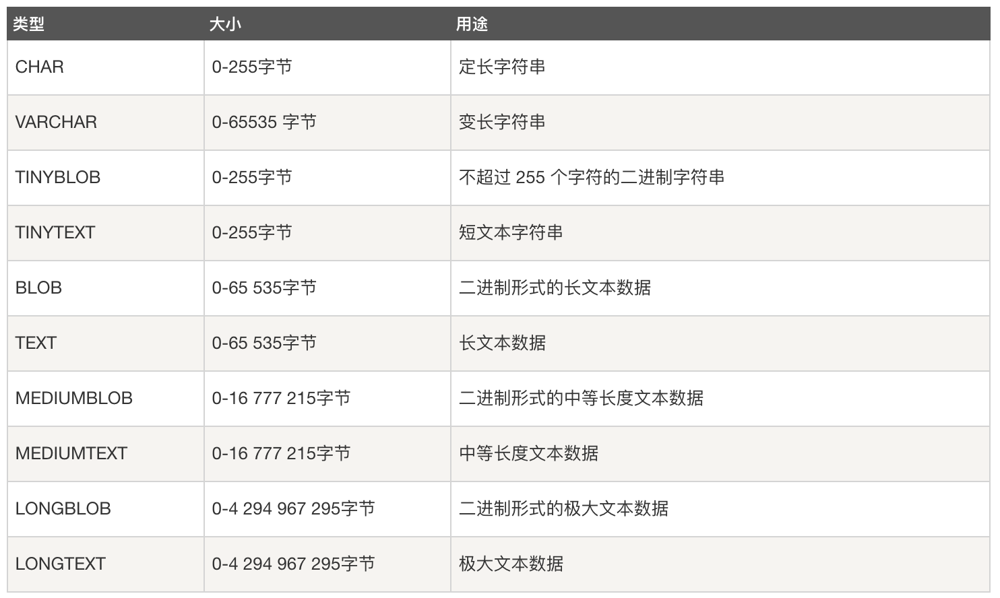
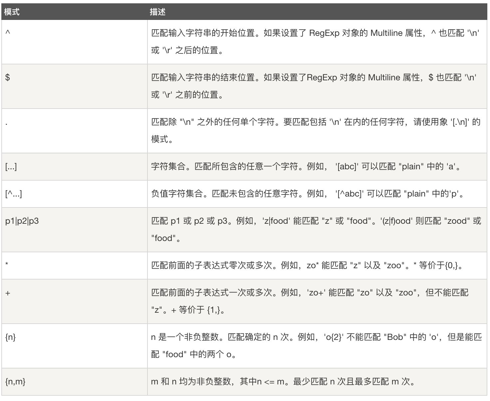
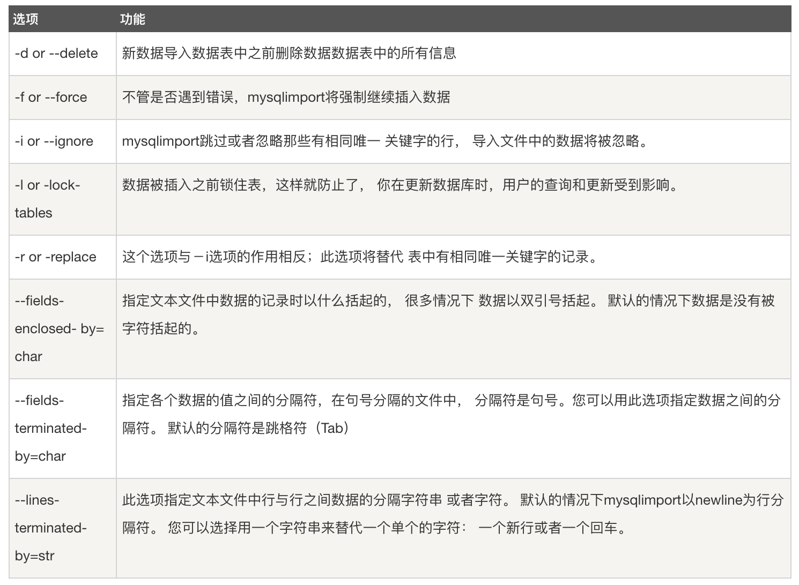

# MySQL入门学习

[TOC]

Mysql是最流行的关系型数据库管理系统，在WEB应用方面MySQL是最好的RDBMS(Relational Database Management System：关系数据库管理系统)应用软件之一  

本教程整理自原文：

http://www.runoob.com/mysql/mysql-tutorial.html

https://www.w3cschool.cn/mysql/

https://www.cnblogs.com/clsn/p/8047028.html#auto_id_14

## 一、MySQL 简介  

1. RDBMS 术语  
  在我们开始学习MySQL 数据库前，让我们先了解下RDBMS的一些术语：

- 数据库: 数据库是一些关联表的集合。.
- 数据表: 表是数据的矩阵。在一个数据库中的表看起来像一个简单的电子表格。
- 列: 一列(数据元素) 包含了相同的数据, 例如邮政编码的数据。
- 行：一行（=元组，或记录）是一组相关的数据，例如一条用户订阅的数据。
- 冗余：存储两倍数据，冗余降低了性能，但提高了数据的安全性。
- 主键：主键是唯一的。一个数据表中只能包含一个主键。你可以使用主键来查询数据。
- 外键：外键用于关联两个表。
- 复合键：复合键（组合键）将多个列作为一个索引键，一般用于复合索引。
- 索引：使用索引可快速访问数据库表中的特定信息。索引是对数据库表中一列或多列的值进行排序的一种结构。类似于书籍的目录。
- 参照完整性: 参照的完整性要求关系中不允许引用不存在的实体

2. Mysql数据库  
  MySQL是一个关系型数据库管理系统，由瑞典MySQL AB公司开发，目前属于Oracle公司。MySQL是一种关联数据库管理系统，关联数据库将数据保存在不同的表中，
  而不是将所有数据放在一个大仓库内，这样就增加了速度并提高了灵活性。

- Mysql是开源的，所以你不需要支付额外的费用。
- Mysql支持大型的数据库。可以处理拥有上千万条记录的大型数据库。
- MySQL使用标准的SQL数据语言形式。
- Mysql可以允许于多个系统上，并且支持多种语言。这些编程语言包括C、C++、Python、Java、Perl、PHP、Eiffel、Ruby和Tcl等。
- Mysql对PHP有很好的支持，PHP是目前最流行的Web开发语言。
- MySQL支持大型数据库，支持5000万条记录的数据仓库，32位系统表文件最大可支持4GB，64位系统支持最大的表文件为8TB。
- Mysql是可以定制的，采用了GPL协议，你可以修改源码来开发自己的Mysql系统。

## 二、MySQL 安装 
所有平台的Mysql下载地址为：https://www.mysql.com/downloads/  

### 2.1 Linux/UNIX上安装MySQL   

Linux平台上推荐使用RPM包来安装Mysql,MySQL AB提供了以下RPM包的下载地址：

- **MySQL** - MySQL服务器。你需要该选项，除非你只想连接运行在另一台机器上的MySQL服务器。
- **MySQL-client** - MySQL 客户端程序，用于连接并操作Mysql服务器。
- **MySQL-devel** - 库和包含文件，如果你想要编译其它MySQL客户端，例如Perl模块，则需要安装该RPM包。
- **MySQL-shared** - 该软件包包含某些语言和应用程序需要动态装载的共享库(libmysqlclient.so*)，使用MySQL。
- **MySQL-bench** - MySQL数据库服务器的基准和性能测试工具。

接下来我们在 Centos 系统下使用 yum 命令安装 MySQL

1. 安装  
```text
检测系统是否自带安装 mysql:  
rpm -qa | grep mysql
如果你系统有安装，那可以选择进行卸载:

rpm -e mysql　　// 普通删除模式
rpm -e --nodeps mysql　　// 强力删除模式，如果使用上面命令删除时，提示有依赖的其它文件，则用该命令可以对其进行强力删除
安装 mysql：

yum install mysql
yum install mysql-server
yum install mysql-devel
启动 mysql：

service mysqld start
```
注意：如果我们是第一次启动 mysql 服务，mysql 服务器首先会进行初始化的配置。  

>如果是 CentOS 7 版本，由于 MySQL数据库已从默认的程序列表中移除，可以使用 mariadb 代替：
```text
 yum install mariadb-server mariadb 
 mariadb数据库的相关命令是：
 
 systemctl start mariadb  #启动MariaDB
 systemctl stop mariadb  #停止MariaDB
 systemctl restart mariadb  #重启MariaDB
 systemctl enable mariadb  #设置开机启动
```

2. 验证Mysql安装    
  在成功安装Mysql后，一些基础表会表初始化，在服务器启动后，你可以通过简单的测试来验证Mysql是否工作正常    

使用 mysqladmin 工具来获取服务器状态:    
```sql
[root@host]# mysqladmin --version

mysqladmin  Ver 8.23 Distrib 5.0.9-0, for redhat-linux-gnu on i386 #linux上该命令将输出以下结果，该结果基于你的系统信息
```
提示：如果以上命令执行后未输入任何信息，说明你的Mysql未安装成功  

3. 使用 MySQL Client(Mysql客户端) 执行简单的SQL命令   
  你可以在 MySQL Client(Mysql客户端) 使用 mysql 命令连接到Mysql服务器上，默认情况下Mysql服务器的密码为空，所以本实例不需要输入密码。  
  命令如下：    
```text
[root@host]# mysql
```
以上命令执行后会输出 mysql>提示符，这说明你已经成功连接到Mysql服务器上，你可以在 mysql> 提示符执行SQL命令：  
```sql
mysql> SHOW DATABASES;
+----------+
| Database |
+----------+
| mysql    |
| test     |
+----------+
2 rows in set (0.13 sec)
```

4. 创建root用户的密码  
  Mysql安装成功后，默认的root用户密码为空，你可以使用以下命令来创建root用户的密码：  
```text
[root@host]# mysqladmin -u root password "new_password";
现在你可以通过以下命令来连接到Mysql服务器：

[root@host]# mysql -u root -p
Enter password:*******
注意：在输入密码时，密码是不会显示了，你正确输入即可。
```

### 2.2 Window 上安装MySQL
Window上安装Mysql相对来说会较为简单，你只需要在 MySQL 下载中下载window版本的mysql安装包，并解压安装包。  
双击 setup.exe 文件，接下来你只需要安装默认的配置点击"next"即可，默认情况下安装信息会在C:\mysql目录中。  
接下来你可以通过"开始" =》在搜索框中输入 " cmd" 命令 =》 在命令提示符上切换到 C:\mysql\bin 目录，并输入一下命令：  
```text
mysqld.exe --console
如果安装成功以上命令将输出一些mysql启动及InnoDB信息。
```
windows安转后MySQL目录结构：  
- bin目录，可以存储可执行文件
- data目录，存储数据文件
- docs目录，文档
- include目录，存储包含的头文件
- lib目录，存储库文件
- share目录，错误消息和字符集文件

### 2.3 MySQL 配置

windwos配置文件：在安装目录下有my.ini配置文件，里边可以配置客户、服务端端口和编码以及其他的配置
编码配置：  
```text
default-character-set=utf-8
character-set-server=utf-8
```

## 三、 MySQL 管理

### 3.1  MySQL 启动及关闭
linux:  
```text
首先，我们需要通过以下命令来检查MySQL服务器是否启动：
ps -ef | grep mysqld
如果MySql已经启动，以上命令将输出mysql进程列表， 如果mysql未启动，你可以使用以下命令来启动mysql服务器:

root@host# cd /usr/bin
./mysqld_safe &
如果你想关闭目前运行的 MySQL 服务器, 你可以执行以下命令:

root@host# cd /usr/bin
./mysqladmin -u root -p shutdown
Enter password: ******
```

Windwos:  
```text
Windows可以通过Windows的服务管理界面启动或停止MySQL服务或通过如下命令停止或启动MySQL服务。

启动Windwos服务：
net start mysql
关闭Windows服务：
net stop mysql
```
### 3.2 MySQL 登录退出  

登录：  

  

退出：  
```sql
mysql> exit;
mysql> quit;
mysql> \q;
```

### 3.3 MySQL 提示符号  

修改MySQL提示符 ：  
```text
方式一：连接客户端时通过参数指定  
shell>mysql -uroot -proot --prompt 提示符号
方式二：连接上客户端后，通过prompt 命令修改
mysql>prompt 提示符
```
常用提示符号：  
```text
\D  完整的日期
\d	当前数据库
\h 	服务器名称
\u 	当前用户
```
案例：  
```text
[root@localhost mysql]# mysql -uroot -p -P3306 -h127.0.0.1
Enter password: 
Welcome to the MariaDB monitor.  Commands end with ; or \g.
Your MariaDB connection id is 13
Server version: 5.5.56-MariaDB MariaDB Server

Copyright (c) 2000, 2017, Oracle, MariaDB Corporation Ab and others.

Type 'help;' or '\h' for help. Type '\c' to clear the current input statement.

MariaDB [(none)]> prompt \u@\h \d>
PROMPT set to '\u@\h \d>'
root@127.0.0.1 (none)>
```

### 3.4 MySQL 用户设置

如果你需要添加 MySQL 用户，你只需要在 mysql 数据库中的 user 表添加新用户即可。  

以下为添加用户的的实例，用户名为guest，密码为guest123，并授权用户可进行 SELECT, INSERT 和 UPDATE操作权限：  
```sql
root@host# mysql -u root -p
Enter password:*******
mysql> use mysql;
Database changed

mysql> INSERT INTO user 
          (host, user, password, 
           select_priv, insert_priv, update_priv) 
           VALUES ('localhost', 'guest', 
           PASSWORD('guest123'), 'Y', 'Y', 'Y');
Query OK, 1 row affected (0.20 sec)

mysql> FLUSH PRIVILEGES;
Query OK, 1 row affected (0.01 sec)

mysql> SELECT host, user, password FROM user WHERE user = 'guest';
+-----------+---------+------------------+
| host      | user    | password         |
+-----------+---------+------------------+
| localhost | guest | 6f8c114b58f2ce9e |
+-----------+---------+------------------+
1 row in set (0.00 sec)
```
在添加用户时，请注意使用MySQL提供的 PASSWORD() 函数来对密码进行加密。 你可以在以上实例看到用户密码加密后为： 6f8c114b58f2ce9e.  
注意：在 MySQL5.7 中 user 表的 password 已换成了authentication_string。  
注意：在注意需要执行 FLUSH PRIVILEGES 语句。 这个命令执行后会重新载入授权表。  
如果你不使用该命令，你就无法使用新创建的用户来连接mysql服务器，除非你重启mysql服务器。  
你可以在创建用户时，为用户指定权限，在对应的权限列中，在插入语句中设置为 'Y' 即可，用户权限列表如下：  
```text
Select_priv
Insert_priv
Update_priv
Delete_priv
Create_priv
Drop_priv
Reload_priv
Shutdown_priv
Process_priv
File_priv
Grant_priv
References_priv
Index_priv
Alter_priv
```

另外一种添加用户的方法为通过SQL的 GRANT 命令，你下命令会给指定数据库TUTORIALS添加用户 zara ，密码为 zara123 。  
```sql
root@host# mysql -u root -p password;
Enter password:*******
mysql> use mysql;
Database changed

mysql> GRANT SELECT,INSERT,UPDATE,DELETE,CREATE,DROP
    -> ON TUTORIALS.*
    -> TO 'zara'@'localhost'
    -> IDENTIFIED BY 'zara123';
```
以上命令会在mysql数据库中的user表创建一条用户信息记录。  
注意: MySQL 的SQL语句以分号 (;) 作为结束标识。  

### 3.5 /etc/my.cnf 文件配置
一般情况下，你不需要修改该配置文件，该文件默认配置如下：
```text
[mysqld]
datadir=/var/lib/mysql
socket=/var/lib/mysql/mysql.sock

[mysql.server]
user=mysql
basedir=/var/lib

[safe_mysqld]
err-log=/var/log/mysqld.log
pid-file=/var/run/mysqld/mysqld.pid
```
在配置文件中，你可以指定不同的错误日志文件存放的目录，一般你不需要改动这些配置。
### 3.6 MySQL 语句规范
- 关键字与函数名全部大写(建议，小写虽然也可以)
- 数据库名称、表名称、字段名成全部小写（建议）
- SQL语句必须以分号结尾
### 3.7 MySQL 管理命令
以下列出了使用Mysql数据库过程中常用的命令：  
1. USE 数据库名 :  
  选择要操作的Mysql数据库，使用该命令后所有Mysql命令都只针对该数据库。
```sql
mysql> use RUNOOB;
Database changed
```

2. SHOW DATABASES:   
  列出 MySQL 数据库管理系统的数据库列表。
```sql
mysql> SHOW DATABASES;
+--------------------+
| Database           |
+--------------------+
| information_schema |
| RUNOOB             |
| cdcol              |
| mysql              |
| onethink           |
| performance_schema |
| phpmyadmin         |
| test               |
| wecenter           |
| wordpress          |
+--------------------+
10 rows in set (0.02 sec)
```

3. SHOW TABLES:    
  显示指定数据库的所有表，使用该命令前需要使用 use 命令来选择要操作的数据库。    
```sql
mysql> use RUNOOB;
Database changed
mysql> SHOW TABLES;
+------------------+
| Tables_in_runoob |
+------------------+
| employee_tbl     |
| runoob_tbl       |
| tcount_tbl       |
+------------------+
3 rows in set (0.00 sec)
```

4. SHOW COLUMNS FROM 数据表:    
  显示数据表的属性，属性类型，主键信息 ，是否为 NULL，默认值等其他信息。  
```sql
mysql> SHOW COLUMNS FROM runoob_tbl;
+-----------------+--------------+------+-----+---------+-------+
| Field           | Type         | Null | Key | Default | Extra |
+-----------------+--------------+------+-----+---------+-------+
| runoob_id       | int(11)      | NO   | PRI | NULL    |       |
| runoob_title    | varchar(255) | YES  |     | NULL    |       |
| runoob_author   | varchar(255) | YES  |     | NULL    |       |
| submission_date | date         | YES  |     | NULL    |       |
+-----------------+--------------+------+-----+---------+-------+
4 rows in set (0.01 sec)
```

5. SHOW INDEX FROM 数据表:  
  显示数据表的详细索引信息，包括PRIMARY KEY（主键）。  
```sql
mysql> SHOW INDEX FROM runoob_tbl;
+------------+------------+----------+--------------+-------------+-----------+-------------+----------+--------+------+------------+---------+---------------+
| Table      | Non_unique | Key_name | Seq_in_index | Column_name | Collation | Cardinality | Sub_part | Packed | Null | Index_type | Comment | Index_comment |
+------------+------------+----------+--------------+-------------+-----------+-------------+----------+--------+------+------------+---------+---------------+
| runoob_tbl |          0 | PRIMARY  |            1 | runoob_id   | A         |           2 |     NULL | NULL   |      | BTREE      |         |               |
+------------+------------+----------+--------------+-------------+-----------+-------------+----------+--------+------+------------+---------+---------------+
1 row in set (0.00 sec)
```
6. SHOW TABLE STATUS LIKE [FROM db_name] [LIKE 'pattern'] \G:   
  该命令将输出Mysql数据库管理系统的性能及统计信息。  
```sql
mysql> SHOW TABLE STATUS  FROM RUNOOB;   # 显示数据库 RUNOOB 中所有表的信息

mysql> SHOW TABLE STATUS from RUNOOB LIKE 'runoob%';     # 表名以runoob开头的表的信息
mysql> SHOW TABLE STATUS from RUNOOB LIKE 'runoob%'\G;   # 加上 \G，查询结果按列打印
```

7. 其他操作  
```text
显示当前服务器版本  
SELECT VERSION();
显示当前日期时间
SELECT NOW();
显示当前用户
SELECT USER();
```

### 3.8 MySQL 客户端工具

**mysql**命令客户端

　　　　用于数据库连接管理

　　　　将 用户SQL 语句发送到服务器

**mysqladmin**命令 ：命令行管理工具

**mysqldump**命令 ：备份数据库和表的内容


**3.8.1  mysq命令客户端**

   作用：

   　用于连接数据库

   　用于管理数据库通过下列方式进行管理

   命令接口自带命令

   　　DDL：数据定义语言

   　　DCL：数据控制语言

   　　DML：数据操作语言

   **1.mysql命令接口自带命令说明**

| **命令**                     | **命令说明**                                 |
| -------------------------- | ---------------------------------------- |
| **\h **或 **help **或 **? ** | 获取帮助                                     |
| **\G**                     | 格式化输出（行转列）                               |
| **\T **或**tee**            | 记录操作日志  tee /tmp/mysql.log               |
| **\c **或 **CTRL+c**        | 退出mysql                                  |
| **\s **或 **status**        | 查看数据库状态信息                                |
| **\. **或 **source**        | mysql> source /tmp/world.sql             |
| **\!**                     | 使用shell中的命令 mysql> \! cat /etc/redhat-releaseCentOS release 6.9 (Final) |
| **\u **或**use   **         | use  worldshow databases  看当前所有数据库的名字show tables   查看当前use到的数据库所有的表show  tables from world   查看目标数据库下的表 |
| **快捷键**                    | 上下翻页、TAB键、ctrl +C 、ctrl +L               |

**2.mysql中help命令的使用**

　　在mysql命令行中输入mysql或 ?都可以查看帮助

```mysql
mysql> help
```

　　使用 help contents查看完整的sql类别列表帮助

```mysql
mysql> help contents
```

　　有关特定 SQL 类别或语句的帮助

```mysql
mysql> help Account Management
```

　　查看 grant 的帮助

```mysql
mysql> help GRANT
```

　　有关与状态相关的 SQL 语句的帮助

```mysql
mysql> help status
```

**3.source命令的使用**

在 mysql 中处理输入文件：

如果这些文件包含 SQL 语句，则称为“脚本文件”或“批处理文件”。

使用 SOURCE 命令：

```mysql
mysql> SOURCE /data/mysql/world.sql
```

　　或者使用非交互式：(尽量避免使用mysql 导入数据，会产生大量的无用日志)

```mysql
mysql</data/mysql/world.sql
```

**3.8.2 mysqladmin命令说明**

基本语法

```mysql
mysqladmin -u<name> -p<password> commands
```

**命令说明图表**

| **功能选项**                                 | **说明**            |
| ---------------------------------------- | ----------------- |
| **mysqladmin -u用户 -p密码 ping**            | “强制回应 (Ping)”服务器。 |
| **mysqladmin -u用户 -p密码 shutdown**        | 关闭服务器。            |
| **mysqladmin -u用户 -p密码 create databasename** | 创建数据库。            |
| **mysqladmin -u用户 -p密码drop databasename** | 删除数据库             |
| **mysqladmin -u用户 -p密码 version**         | 显示服务器和版本信息        |
| **mysqladmin -u用户 -p密码 status**          | 显示或重置服务器状态变量      |
| **mysqladmin -u用户 -p密码 password**        | 设置口令              |
| **mysqladmin -u用户 -p密码 flush-privileges** | 重新刷新授权表。          |
| **mysqladmin -u用户 -p密码 flush-logs**      | 刷新日志文件和高速缓存。      |
| **以上信息通过mysqladmin  --help 获得**          |                   |

**3.8.3 mysqldump简单说明**
　　mysqldump是一款数据库备份工具。  
命令帮助及基本语法：
```mysql
[root@db02 ~]# mysqldump --help
Dumping structure and contents of MySQL databases and tables.
Usage: mysqldump [OPTIONS] database [tables]
OR     mysqldump [OPTIONS] --databases [OPTIONS] DB1 [DB2 DB3...]
OR     mysqldump [OPTIONS] --all-databases [OPTIONS]
```

　　请参照mysqldump --help

### 3.9 MySQL 编码设置

1. 查看MySQL系统设置的编码详细

```mysql
MariaDB [(none)]> show variables like '%char%';
+--------------------------+----------------------------+
| Variable_name            | Value                      |
+--------------------------+----------------------------+
| character_set_client     | utf8                       |
| character_set_connection | utf8                       |
| character_set_database   | utf8                       |
| character_set_filesystem | binary                     |
| character_set_results    | utf8                       |
| character_set_server     | utf8                       |
| character_set_system     | utf8                       |
| character_sets_dir       | /usr/share/mysql/charsets/ |
+--------------------------+----------------------------+
```

2. 临时设置MySQL系统会话编码

```mysql
#设置当前窗口的数据库字符编码，即使基于会话session级别的，关闭此窗口，重新打开另外的窗口操作数据库依然是原来的字符编码
set character_set_database=utf8;
set character_set_server=utf8;
```

3. 设置全局MySQL系统会话字符编码

```mysql
#设置全局的数据库字符编码，不会改变现有存在数据的编码，在没有重启数据库的情况下，新建数据库时，就会变成我们设置的全局编码，因为设置全局的数据库编码是基于整个MySQL服务的，但是当重启MySQL服务的时候，编码就会变为原来的字符编码。
set global character_set_database=utf8;
set global character_set_server=utf8;
```

4. 永久设置MySQL系统编码

```txt
编辑 /etc/my.cnf，
　   在里面加入，已经有[XXX]的，在里面直接加入即可。 
　   
　　　　[mysqld]
　　　　character-set-server=utf8 
　　　　
　　　　[client]
　　　　default-character-set=utf8 
　　　　
　　　　[mysql]
　　　　default-character-set=utf8
　　然后重启数据库即可，service mysql restart.
```

5. 查看一个数据库的编码

```mysql
MariaDB [(none)]> show databases;
+--------------------+
| Database           |
+--------------------+
| information_schema |
| mysql              |
| performance_schema |
| test               |
+--------------------+
4 rows in set (0.00 sec)

MariaDB [(none)]> show create database mysql;
+----------+----------------------------------------------------------------+
| Database | Create Database                                                |
+----------+----------------------------------------------------------------+
| mysql    | CREATE DATABASE `mysql` /*!40100 DEFAULT CHARACTER SET utf8 */ |
+----------+----------------------------------------------------------------+
1 row in set (0.00 sec)
```

6. 修改数据库的编码格式

```mysql
mysql>alter database <数据库名> character set utf8;
```

7. 创建数据库时指定数据库的字符集

```mysql
mysql>create database <数据库名> character set utf8;
```

8. 查看数据指定表的编码格式

```mysql
mysql> show create table <表名>;
```

9. 查看数据库中所有表（tables）的字符集

```mysql
show table status from <数据库名>
```

10. 修改数据表的编码格式

```mysql
mysql>alter table <表名> character set utf8;
```

11. 创建数据表时指定数据表的编码格式

```mysql
create table tb_books (
	name varchar(45) not null,
	price double not null,
	bookCount int not null,
	author varchar(45) not null ) default charset = utf8;
```

12. 查看表中数据列（column）的字符集

```mysql
show full columns from <表名>;
```

## 四、MySQL 用户管理

### 4.1 用户的定义

用户的定义：用户名+主机域，密码

用户的作用：  
　1、用户登录
　2、用于管理数据库及数据

```mysql
MariaDB [(none)]> select user,host,password from mysql.user;
+------+-----------------------+-------------------------------------------+
| user | host                  | password                                  |
+------+-----------------------+-------------------------------------------+
| root | localhost             | *81F5E21E35407D884A6CD4A731AEBFB6AF209E1B |
| root | localhost.localdomain | *81F5E21E35407D884A6CD4A731AEBFB6AF209E1B |
| root | 127.0.0.1             | *81F5E21E35407D884A6CD4A731AEBFB6AF209E1B |
| root | ::1                   | *81F5E21E35407D884A6CD4A731AEBFB6AF209E1B |
|      | localhost             |                                           |
|      | localhost.localdomain |                                           |
| root | %                     | *81F5E21E35407D884A6CD4A731AEBFB6AF209E1B |
+------+-----------------------+-------------------------------------------+
7 rows in set (0.00 sec)
```

### 4.2 用户权限

 定义权限：对不同的对象进行权限(角色)定义

**命令:**

```mysql
grant 权限 on 权限范围  to 用户  identified  by '密码'
```

*权限*

```mysql
对数据库的读、写等操作
（insert update、select、delete、drop、create等）
```

*角色*

```mysql
数据库定义好的一组权限的定义
（all privileges、replication slave等）
```

*权限范围*

```mysql
全库级别： *.*
单库级别：clsn.*
单表级别：clsn.t1
```

*用户*

```mysql
'clsn'@'localhost'  本地
'clsn'@'192.168.66.149'
'clsn'@'192.168.66.%'÷
'clsn'@'192.168.66.14%'
```

**给用户授权**

```mysql
# 创建用户
create user 'clsn'@'localhost' identified by 'clsn123';
# 查看用户信息
 select user,host,password from mysql.user;
# 授权所有权限给clsn用户
GRANT ALL ON *.* TO 'clsn'@'localhost';
# 查看clsn用户的权限
SHOW GRANTS FOR 'clsn'@'localhost'\G
```

创建用户的同时授权

```mysql
grant all on *.* to clsn@'172.16.1.%' identified by 'clsn123';
# 刷新权限
flush privileges; #<==可以不用。
```

创建用户然后授权

```mysql
create user 'clsn'@'localhost' identified by 'clsn123';
GRANT ALL ON *.* TO 'clsn'@'localhost';
```

授权和root一样的权限

```mysql
grant all on *.* to system@'localhost' identified by 'clsn123' with grant option;
```

授权给用户select,create,insert,update 权限

```mysql
grant select,create,insert,update on clsn.* to 'clsn'@'10.0.0.%' identified by '123';
```

授权任何主机连接权限

```mysql
#为其他主机远程连接数据库开放访问权限
MariaDB [(none)]> select user,host,password from mysql.user;
+------+-----------------------+-------------------------------------------+
| user | host                  | password                                  |
+------+-----------------------+-------------------------------------------+
| root | localhost             | *81F5E21E35407D884A6CD4A731AEBFB6AF209E1B |
| root | localhost.localdomain | *81F5E21E35407D884A6CD4A731AEBFB6AF209E1B |
| root | 127.0.0.1             | *81F5E21E35407D884A6CD4A731AEBFB6AF209E1B |
| root | ::1                   | *81F5E21E35407D884A6CD4A731AEBFB6AF209E1B |
|      | localhost             |                                           |
|      | localhost.localdomain |                                           |
+------+-----------------------+-------------------------------------------+
#通过以上输出可以看出数据库默认只允许用户root在本地服务器（localhost）上登录，不允许其他主机远程连接
#下面这条语句将允许用户root使用密码(root)在任何主机上连接该数据库，并赋予该用户所有权限。
MariaDB [(none)]> use mysql;
MariaDB [(mysql)]> grant all privileges on *.* to root@"%" identified by "root";
Query OK, 0 rows affected (0.01 sec)
MariaDB [mysql]> flush privileges;
Query OK, 0 rows affected (0.00 sec)
#这样数据库的访问权限就设置好了。
MariaDB [(mysql)]> select user,host,password from mysql.user;
+------+-----------------------+-------------------------------------------+
| user | host                  | password                                  |
+------+-----------------------+-------------------------------------------+
| root | localhost             | *81F5E21E35407D884A6CD4A731AEBFB6AF209E1B |
| root | localhost.localdomain | *81F5E21E35407D884A6CD4A731AEBFB6AF209E1B |
| root | 127.0.0.1             | *81F5E21E35407D884A6CD4A731AEBFB6AF209E1B |
| root | ::1                   | *81F5E21E35407D884A6CD4A731AEBFB6AF209E1B |
|      | localhost             |                                           |
|      | localhost.localdomain |                                           |
| root | %                     | *81F5E21E35407D884A6CD4A731AEBFB6AF209E1B |
+------+-----------------------+-------------------------------------------+
7 rows in set (0.00 sec)
```

**回收权限**

```mysql
REVOKE INSERT ON *.* FROM clsn@localhost;
```

可以授权的用户权限

```mysql
INSERT,SELECT, UPDATE, DELETE, CREATE, DROP, RELOAD, SHUTDOWN, 
PROCESS, FILE, REFERENCES, INDEX, ALTER, SHOW DATABASES, SUPER, 
CREATE TEMPORARY TABLES, LOCK TABLES, EXECUTE, REPLICATION SLAVE, 
REPLICATION CLIENT, CREATE VIEW, SHOW VIEW, CREATE ROUTINE, ALTER 
ROUTINE, CREATE USER, EVENT, TRIGGER, CREATE TABLESPACE
```

【示例】博客授权收回示例

```mysql
grant select,insert,update,delete,create,drop on blog.* to 'blog'@'172.16.1.%' identified by 'blog123';  授权博客类的最多权限：select,insert,update,delete
revoke create,drop on blog.* from 'blog'@'172.16.1.%';
```

客类的最多权限：select,insert,update,delete

### 4.2 创建用户

**创建用户语法**

```mysql
CREATE USER '用户'@'主机' IDENTIFIED BY '密码';
```

*示例：*

```mysql
create user 'clsn'@'localhost' identified by 'clsn123'; 
```

注意这个样创建的用户只有连接权限

企业里创建用户一般是授权一个内网网段登录，最常见的网段写法有两种。

方法1：172.16.1.%（%为通配符，匹配所有内容）。

方法2：172.16.1.0/255.255.255.0，但是不能使用172.16.1.0/24，是个小遗憾。

查看当前存在的用户:

```mysql
select user,host from mysql.user;
```

**标准的建用户方法：**

```mysql
create user 'web'@'172.16.1.%' identified by 'web123';
```

**查看用户对应的权限**

```mysql
show grants for oldboy@localhost\G
```

案例：

按照如下要求设置用户：

用户只能通过10.0.0.0/24网段访问，用户名为clsn 密码为123

这个用户只能对clsn数据库下的对象进行增insert create、改update 、查select；

 授权命令：

```mysql
grant select,create,insert,update on clsn.* to 'clsn'@'10.0.0.%' identified by '123';
```

查看用户权限

```mysql
mysql>  show grants for clsn@'172.16.1.%'\G
*************************** 1. row ***************************
Grants for clsn@172.16.1.%: GRANT USAGE ON *.* TO 'clsn'@'172.16.1.%' IDENTIFIED BY PASSWORD '*23AE809DDACAF96AF0FD78ED04B6A265E05AA257'
1 row in set (0.00 sec)
```

### 4.4 删除用户

删除用户语法：

```mysql
drop user 'user'@'主机域'
```

特殊的删除方法:(慎用，尽量不要直接去修改表)

```mysql
mysql> delete from mysql.user where  user='clsn' and host='localhost'; 
Query OK, 1 row affected (0.00 sec)
mysql> flush privileges;
```

### 4.5 其他操作

```mysql
mysql> use  clsn;#切换到数据库clsn
mysql> select user(); #查看当前登录的用户
mysql> select database(); #查看当前所在的数据库
mysql> show tables;#查看库里边的表
```

## 五、 MySQL 数据库操作

### 5.1 查看数据库

查询所有的数据库

```mysql
MariaDB [(mysql)]> show databases;
+--------------------+
| Database           |
+--------------------+
| information_schema |
| activiti_learn     |
| mysql              |
| performance_schema |
| test               |
+--------------------+
5 rows in set (0.00 sec)
```

查看数据库--模糊匹配

```mysql
MariaDB [mysql]>  show databases like "%s%";
+--------------------+
| Database (%s%)     |
+--------------------+
| information_schema |
| mysql              |
| performance_schema |
| test               |
+--------------------+
4 rows in set (0.01 sec)
```

查看相关帮助

```mysql
MariaDB [mysql]> ? show databases;
Name: 'SHOW DATABASES'
Description:
Syntax:
SHOW {DATABASES | SCHEMAS}
    [LIKE 'pattern' | WHERE expr]
```

使用mysql数据库

```mysql
user mysql;
```

### 5.2 连接数据库

您可以使用MySQL二进制方式进入到mysql命令提示符下来连接MySQL数据库。    

以下是从命令行中连接mysql服务器的简单实例：  
```text
[root@host]# mysql -u root -p
Enter password:******
```
在登录成功后会出现 mysql> 命令提示窗口，你可以在上面执行任何 SQL 语句。  

以上命令执行后，登录成功输出结果如下:  
```text
Welcome to the MySQL monitor.  Commands end with ; or \g.
Your MySQL connection id is 2854760 to server version: 5.0.9

Type 'help;' or '\h' for help. Type '\c' to clear the buffer.
```

在以上实例中，我们使用了root用户登录到mysql服务器，当然你也可以使用其他mysql用户登录。  
如果用户权限足够，任何用户都可以在mysql的命令提示窗口中进行SQL操作。    
退出 mysql> 命令提示窗口可以使用 exit 命令，如下所示：  
```text
mysql> exit
Bye
```

### 5.3 创建数据库  
使用普通用户，你可能需要特定的权限来创建或者删除 MySQL 数据库。  
所以我们这边使用root用户登录，root用户拥有最高权限，可以使用 mysql mysqladmin 命令来创建数据库。  

语法：  
```sql
CREATE {database | schema} [IF NOT EXISTS] db_name [DEFAULT] CHARACTER SET [=] charset_name
```

以下命令简单的演示了创建数据库的过程，数据名为 RUNOOB:  

```text
[root@host]# mysqladmin -u root -p create RUNOOB
Enter password:******
```
以上命令执行成功后会创建 MySQL 数据库 RUNOOB。

显示可用数据库列表

```mysql
show databases
```

登录后创建数据库

```mysql
mysql> create database haha;
```

创建数据库时定义字符编码

```mysql
mysql> create database clsn charset utf8 ;
mysql> show create database clsn;     查询数据库定义信息。
```

存在的数据库修改字符编码：

```mysql
mysql> alter database clsn charset gbk;
```

### 5.4 删除数据库

在删除数据库过程中，务必要十分谨慎，因为在执行删除命令后，所有数据将会消失  
```mysql
[root@host]# mysqladmin -u root -p drop RUNOOB
Enter password:******
#执行以上删除数据库命令后，会出现一个提示框，来确认是否真的删除数据库：
```

```text
Dropping the database is potentially a very bad thing to do.
Any data stored in the database will be destroyed.

Do you really want to drop the 'RUNOOB' database [y/N] y
Database "RUNOOB" dropped
```

登录数据库后删除

```mysql
mysql> drop database haha;
Query OK, 0 rows affected (0.00 sec)

mysql> show databases;
+--------------------+
| Database           |
```

### 5.5 选择数据库  

在你连接到 MySQL 数据库后，可能有多个可以操作的数据库，所以你需要选择你要操作的数据库。
在 mysql> 提示窗口中可以很简单的选择特定的数据库。你可以使用SQL命令来选择指定的数据库。  

以下实例选取了数据库 RUNOOB:  
```mysql
[root@host]# mysql -u root -p
Enter password:******
mysql> use RUNOOB;
Database changed
mysql>
```
执行以上命令后，你就已经成功选择了 RUNOOB 数据库，在后续的操作中都会在 RUNOOB 数据库中执行。  

## 六、MySQL 数据类型  
MySQL中定义数据字段的类型对你数据库的优化是非常重要的。  
MySQL支持多种类型，大致可以分为三类：数值、日期/时间和字符串(字符)类型。  

### 6.1 数值类型  
MySQL支持所有标准SQL数值数据类型。  
这些类型包括严格数值数据类型(INTEGER、SMALLINT、DECIMAL和NUMERIC)，以及近似数值数据类型(FLOAT、REAL和DOUBLE PRECISION)。    
关键字INT是INTEGER的同义词，关键字DEC是DECIMAL的同义词。    
BIT数据类型保存位字段值，并且支持MyISAM、MEMORY、InnoDB和BDB表。  
作为SQL标准的扩展，MySQL也支持整数类型TINYINT、MEDIUMINT和BIGINT。下面的表显示了需要的每个整数类型的存储和范围。    
    

### 6.2 日期和时间类型
表示时间值的日期和时间类型为DATETIME、DATE、TIMESTAMP、TIME和YEAR。  
每个时间类型有一个有效值范围和一个"零"值，当指定不合法的MySQL不能表示的值时使用"零"值。  
TIMESTAMP类型有专有的自动更新特性，将在后面描述。   
    

### 6.3 字符串类型
字符串类型指CHAR、VARCHAR、BINARY、VARBINARY、BLOB、TEXT、ENUM和SET。该节描述了这些类型如何工作以及如何在查询中使用这些类型。    
  
CHAR和VARCHAR类型类似，但它们保存和检索的方式不同。它们的最大长度和是否尾部空格被保留等方面也不同。在存储或检索过程中不进行大小写转换。  
BINARY和VARBINARY类类似于CHAR和VARCHAR，不同的是它们包含二进制字符串而不要非二进制字符串。也就是说，它们包含字节字符串而不是字符字符串。这说明它们没有字符集，并且排序和比较基于列值字节的数值值。  
BLOB是一个二进制大对象，可以容纳可变数量的数据。有4种BLOB类型：TINYBLOB、BLOB、MEDIUMBLOB和LONGBLOB。它们只是可容纳值的最大长度不同。  
有4种TEXT类型：TINYTEXT、TEXT、MEDIUMTEXT和LONGTEXT。这些对应4种BLOB类型，有相同的最大长度和存储需求。    

## 七、MySQL 表操作

查询数据库中的所有表
```mysql
 show tables;
```

### 7.1 MySQL 创建数据表

创建MySQL数据表需要以下信息：  
- 表名
- 表字段名
- 定义每个表字段

>语法  

以下为创建MySQL数据表的SQL通用语法：
```sql
CREATE TABLE table_name (column_name column_type);
```

以下为创建数据表 runoob_tbl   
>实例  
```sql
root@host# mysql -u root -p
Enter password:*******
mysql> use RUNOOB;
Database changed
mysql> CREATE TABLE runoob_tbl(
   -> runoob_id INT NOT NULL AUTO_INCREMENT,
   -> runoob_title VARCHAR(100) NOT NULL,
   -> runoob_author VARCHAR(40) NOT NULL,
   -> submission_date DATE,
   -> PRIMARY KEY ( runoob_id )
   -> )ENGINE=InnoDB DEFAULT CHARSET=utf8;
Query OK, 0 rows affected (0.16 sec)
mysql>
mysql> CREATE TABLE runoob_tbl2(
   -> runoob_id INT  PRIMARY KEY NOT NULL AUTO_INCREMENT,
   -> runoob_title VARCHAR(100) NOT NULL,
   -> runoob_author VARCHAR(40) NOT NULL,
   -> submission_date DATE
   -> )ENGINE=InnoDB DEFAULT CHARSET=utf8;
Query OK, 0 rows affected (0.16 sec)
```
实例解析：  
- 如果你不想字段为 NULL 可以设置字段的属性为 NOT NULL， 在操作数据库时如果输入该字段的数据为NULL ，就会报错。  
- AUTO_INCREMENT定义列为自增的属性，一般用于主键，数值会自动加1。  
- PRIMARY KEY关键字用于定义列为主键。 您可以使用多列来定义主键，列间以逗号分隔。  
- ENGINE 设置存储引擎，CHARSET 设置编码。  

### 7.2 MySQL 删除数据表
MySQL中删除数据表是非常容易操作的， 但是你再进行删除表操作时要非常小心，因为执行删除命令后所有数据都会消失。  

>语法  

以下为删除MySQL数据表的通用语法：  
```sql
DROP TABLE table_name;
```

### 7.3 MySQL 查看数据表

1.查看表结构

```mysql
mysql>desc user; 
```

2.查看建表语句

```mysql
mysql> show create table user\G;
```

### 7.4 MySQL 修改数据表

1. 修改表名字

```mysql
#方法1
mysql> rename table t3 to haha;
mysql> show tables ;
+----------------+
| Tables_in_clsn |
+----------------+
| haha           |
#方法2
mysql> alter table haha rename to people;
mysql> show tables;
+----------------+
| Tables_in_clsn |
+----------------+
| people         |
```

2. 修改表结构

```mysql
mysql> alter table people  add addr char(40) NOT NULL;
mysql> desc people;
+-------+----------+------+-----+---------+-------+
| Field | Type     | Null | Key | Default | Extra |
+-------+----------+------+-----+---------+-------+
| id    | int(11)  | YES  |     | NULL    |       |
| addr  | char(40) | NO   |     | NULL    |       |
+-------+----------+------+-----+---------+-------+
2 rows in set (0.00 sec)
```

案例：

指定添加年龄列到name列后面的位置，示例如下:

```mysql
mysql> alter table people add age int(4) after name;
Query OK, 0 rows affected (0.05 sec)
Records: 0  Duplicates: 0  Warnings: 0

mysql> desc people;
+-------+----------+------+-----+---------+-------+
| Field | Type     | Null | Key | Default | Extra |
+-------+----------+------+-----+---------+-------+
| id    | int(11)  | YES  |     | NULL    |       |
| addr  | char(40) | NO   |     | NULL    |       |
| name  | int(40)  | YES  |     | NULL    |       |
| age   | int(4)   | YES  |     | NULL    |       |
+-------+----------+------+-----+---------+-------+
4 rows in set (0.00 sec)
```

通过下面的命令在第一列添加qq字段:

```mysql
mysql> alter table people add telnum  int  first;
Query OK, 0 rows affected (0.03 sec)
Records: 0  Duplicates: 0  Warnings: 0

mysql> desc people;
+--------+----------+------+-----+---------+-------+
| Field  | Type     | Null | Key | Default | Extra |
+--------+----------+------+-----+---------+-------+
| telnum | int(11)  | YES  |     | NULL    |       |
| id     | int(11)  | YES  |     | NULL    |       |
| addr   | char(40) | NO   |     | NULL    |       |
| name   | int(40)  | YES  |     | NULL    |       |
| age    | int(4)   | YES  |     | NULL    |       |
+--------+----------+------+-----+---------+-------+
5 rows in set (0.00 sec)
```

同时添加多个列定义:

```mysql
mysql> alter table people add id1 int first ,add sex char(4) after name ;
Query OK, 0 rows affected (0.06 sec)
Records: 0  Duplicates: 0  Warnings: 0

mysql> desc people;
+--------+----------+------+-----+---------+-------+
| Field  | Type     | Null | Key | Default | Extra |
+--------+----------+------+-----+---------+-------+
| id1    | int(11)  | YES  |     | NULL    |       |
| telnum | int(11)  | YES  |     | NULL    |       |
| id     | int(11)  | YES  |     | NULL    |       |
| addr   | char(40) | NO   |     | NULL    |       |
| name   | int(40)  | YES  |     | NULL    |       |
| sex    | char(4)  | YES  |     | NULL    |       |
| age    | int(4)   | YES  |     | NULL    |       |
+--------+----------+------+-----+---------+-------+
7 rows in set (0.00 sec)
```

3. 删除表结构

```mysql
mysql> alter table people  drop  sex;
Query OK, 0 rows affected (0.06 sec)
Records: 0  Duplicates: 0  Warnings: 0

mysql> desc  people;
+--------+----------+------+-----+---------+-------+
| Field  | Type     | Null | Key | Default | Extra |
+--------+----------+------+-----+---------+-------+
| id1    | int(11)  | YES  |     | NULL    |       |
| telnum | int(11)  | YES  |     | NULL    |       |
| id     | int(11)  | YES  |     | NULL    |       |
| addr   | char(40) | NO   |     | NULL    |       |
| name   | int(40)  | YES  |     | NULL    |       |
| age    | int(4)   | YES  |     | NULL    |       |
+--------+----------+------+-----+---------+-------+
6 rows in set (0.00 sec)
```

4. 修改表定义

```mysql
mysql> alter table people modify name char(20);
Query OK, 0 rows affected (0.11 sec)
Records: 0  Duplicates: 0  Warnings: 0

mysql> desc  people;
+--------+----------+------+-----+---------+-------+
| Field  | Type     | Null | Key | Default | Extra |
+--------+----------+------+-----+---------+-------+
| id1    | int(11)  | YES  |     | NULL    |       |
| telnum | int(11)  | YES  |     | NULL    |       |
| id     | int(11)  | YES  |     | NULL    |       |
| addr   | char(40) | NO   |     | NULL    |       |
| name   | char(20) | YES  |     | NULL    |       |
| age    | int(4)   | YES  |     | NULL    |       |
+--------+----------+------+-----+---------+-------+
6 rows in set (0.00 sec)
```

5. 修改列名

```mysql
mysql> alter table people change name people_name char(30) ; 
Query OK, 0 rows affected (0.04 sec)
Records: 0  Duplicates: 0  Warnings: 0

mysql> desc  people;
+-------------+----------+------+-----+---------+-------+
| Field       | Type     | Null | Key | Default | Extra |
+-------------+----------+------+-----+---------+-------+
| id1         | int(11)  | YES  |     | NULL    |       |
| telnum      | int(11)  | YES  |     | NULL    |       |
| id          | int(11)  | YES  |     | NULL    |       |
| addr        | char(40) | NO   |     | NULL    |       |
| people_name | char(30) | YES  |     | NULL    |       |
| age         | int(4)   | YES  |     | NULL    |       |
+-------------+----------+------+-----+---------+-------+
6 rows in set (0.00 sec)
```

### 7.5 MySQL 常见的建表选项及约束

https://www.cnblogs.com/geaozhang/p/6786105.html

## 八、MySQL增删改查

### 8.1 MySQL INSERT 语句
MySQL 表中使用 INSERT INTO SQL语句来插入数据。  
你可以通过 mysql> 命令提示窗口中向数据表中插入数据，或者通过PHP脚本来插入数据。  

>语法  

以下为向MySQL数据表插入数据通用的 INSERT INTO SQL语法：  
```sql
INSERT INTO table_name ( field1, field2,...fieldN )
                       VALUES
                       ( value1, value2,...valueN );
```
如果数据是字符型，必须使用单引号或者双引号，如："value"。  


以下我们将使用 SQL INSERT INTO 语句向 MySQL 数据表 runoob_tbl 插入数据  
> 实例  

以下实例中我们将向 runoob_tbl 表插入三条数据:  
```sql
root@host# mysql -u root -p password;
Enter password:*******
mysql> use RUNOOB;
Database changed
mysql> INSERT INTO runoob_tbl 
    -> (runoob_title, runoob_author, submission_date)
    -> VALUES
    -> ("学习 PHP", "菜鸟教程", NOW());
Query OK, 1 rows affected, 1 warnings (0.01 sec)
```

一次插入多行数据

```mysql
mysql> desc clsn;
+-------+-------------+------+-----+---------+-------+
| Field | Type        | Null | Key | Default | Extra |
+-------+-------------+------+-----+---------+-------+
| id    | int(11)     | YES  |     | NULL    |       |
| name  | varchar(20) | YES  |     | NULL    |       |
+-------+-------------+------+-----+---------+-------+
2 rows in set (0.00 sec)
#一次插入两行数据
mysql> insert into clsn values(1,'yougboy'),(2,'youggilr');
Query OK, 2 rows affected (0.00 sec)
Records: 2  Duplicates: 0  Warnings: 0

mysql> select * from clsn;
+------+----------+
| id   | name     |
+------+----------+
|    1 | yougboy  |
|    2 | youggilr |
+------+----------+
2 rows in set (0.00 sec)
```

使用子查询插入

```mysql
mysql> create table test2 like clsn;
Query OK, 0 rows affected (0.02 sec)

mysql> insert into test2 select * from clsn;
Query OK, 4 rows affected (0.01 sec)
Records: 4  Duplicates: 0  Warnings: 0

mysql> select  * from test2;
+------+----------+
| id   | name     |
+------+----------+
|    1 | clsn     |
|    2 | yougboy  |
|    3 | youggilr |
| NULL | xiaoming |
+------+----------+
4 rows in set (0.00 sec)
```


### 8.2 MySQL 查询数据

MySQL 数据库使用SQL SELECT语句来查询数据。  
你可以通过 mysql> 命令提示窗口中在数据库中查询数据，或者通过PHP脚本来查询数据。  
>语法

以下为在MySQL数据库中查询数据通用的 SELECT 语法：  
```sql
SELECT column_name,column_name
FROM table_name
[WHERE Clause]
[LIMIT N][ OFFSET M]
```

- 查询语句中你可以使用一个或者多个表，表之间使用逗号(,)分割，并使用WHERE语句来设定查询条件。  
- SELECT 命令可以读取一条或者多条记录。  
- 你可以使用星号（*）来代替其他字段，SELECT语句会返回表的所有字段数据
- 你可以使用 WHERE 语句来包含任何条件。
- 你可以使用 LIMIT 属性来设定返回的记录数。
- 你可以通过OFFSET指定SELECT语句开始查询的数据偏移量。默认情况下偏移量为0。

>实例

以下实例将返回数据表 runoob_tbl 的所有记录:  
```sql
读取数据表：
select * from runoob_tbl;
```

### 8.3 MySQL WHERE 子句
我们知道从 MySQL 表中使用 SQL SELECT 语句来读取数据。  
如需有条件地从表中选取数据，可将 WHERE 子句添加到 SELECT 语句中。  

>语法  

以下是 SQL SELECT 语句使用 WHERE 子句从数据表中读取数据的通用语法：  
```sql
SELECT field1, field2,...fieldN FROM table_name1, table_name2...
[WHERE condition1 [AND [OR]] condition2.....
```
- 查询语句中你可以使用一个或者多个表，表之间使用逗号, 分割，并使用WHERE语句来设定查询条件。
- 你可以在 WHERE 子句中指定任何条件。
- 你可以使用 AND 或者 OR 指定一个或多个条件。
- WHERE 子句也可以运用于 SQL 的 DELETE 或者 UPDATE 命令。
- WHERE 子句类似于程序语言中的 if 条件，根据 MySQL 表中的字段值来读取指定的数据。

以下为操作符列表，可用于 WHERE 子句中。 
下表中实例假定 A 为 10, B 为 20    
  

如果我们想再 MySQL 数据表中读取指定的数据，WHERE 子句是非常有用的。  
使用主键来作为 WHERE 子句的条件查询是非常快速的。   
如果给定的条件在表中没有任何匹配的记录，那么查询不会返回任何数据。  

MySQL 的 WHERE 子句的字符串比较是不区分大小写的。 你可以使用 BINARY 关键字来设定 WHERE 子句的字符串比较是区分大小写的。  

>如下实例:

BINARY 关键字  
````sql
mysql> SELECT * from runoob_tbl WHERE BINARY runoob_author='runoob.com';
Empty set (0.01 sec)
 
mysql> SELECT * from runoob_tbl WHERE BINARY runoob_author='RUNOOB.COM';
+-----------+---------------+---------------+-----------------+
| runoob_id | runoob_title  | runoob_author | submission_date |
+-----------+---------------+---------------+-----------------+
| 3         | JAVA 教程   | RUNOOB.COM    | 2016-05-06      |
| 4         | 学习 Python | RUNOOB.COM    | 2016-03-06      |
+-----------+---------------+---------------+-----------------+
2 rows in set (0.01 sec)
````
实例中使用了 BINARY 关键字，是区分大小写的，所以 runoob_author='runoob.com' 的查询条件是没有数据的。

### 8.4 MySQL UPDATE 语句

如果我们需要修改或更新 MySQL 中的数据，我们可以使用 SQL UPDATE 命令来操作。.

>语法 

以下是 UPDATE 命令修改 MySQL 数据表数据的通用 SQL 语法：
```sql
UPDATE table_name SET field1=new-value1, field2=new-value2
[WHERE Clause]
```
- 你可以同时更新一个或多个字段。
- 你可以在 WHERE 子句中指定任何条件。
- 你可以在一个单独表中同时更新数据。  
  当你需要更新数据表中指定行的数据时 WHERE 子句是非常有用的。  

以下我们将在 SQL UPDATE 命令使用 WHERE 子句来更新 runoob_tbl 表中指定的数据：  

>实例

以下实例将更新数据表中 runoob_id 为 3 的 runoob_title 字段值：  
```sql
SQL UPDATE 语句：
mysql> UPDATE runoob_tbl SET runoob_title='学习 C++' WHERE runoob_id=3;
Query OK, 1 rows affected (0.01 sec)
 
mysql> SELECT * from runoob_tbl WHERE runoob_id=3;
+-----------+--------------+---------------+-----------------+
| runoob_id | runoob_title | runoob_author | submission_date |
+-----------+--------------+---------------+-----------------+
| 3         | 学习 C++   | RUNOOB.COM    | 2016-05-06      |
+-----------+--------------+---------------+-----------------+
1 rows in set (0.01 sec)
```
从结果上看，runoob_id 为 3 的 runoob_title 已被修改。

### 8.5 MySQL DELETE 语句
你可以使用 SQL 的 DELETE FROM 命令来删除 MySQL 数据表中的记录。  
你可以在 mysql> 命令提示符或 PHP 脚本中执行该命令。  

>语法  
>以下是 SQL DELETE 语句从 MySQL 数据表中删除数据的通用语法：
```mysql
DELETE FROM table_name [WHERE Clause]
```
- 如果没有指定 WHERE 子句，MySQL 表中的所有记录将被删除。
- 你可以在 WHERE 子句中指定任何条件  
- 您可以在单个表中一次性删除记录。  
- 当你想删除数据表中指定的记录时 WHERE 子句是非常有用的。  

其他：

```mysql
delete from test;     #逻辑删除，一行一行删。
truncate table test;  #物理删除，pages(block)，效率高。
```

从命令行中删除数据
这里我们将在 SQL DELETE 命令中使用 WHERE 子句来删除 MySQL 数据表 runoob_tbl 所选的数据。

>实例  

以下实例将删除 runoob_tbl 表中 runoob_id 为3 的记录：
```sql
SQL DELETE 语句：
mysql> use RUNOOB;
Database changed
mysql> DELETE FROM runoob_tbl WHERE runoob_id=3;
Query OK, 1 row affected (0.23 sec)
```

### 8.6 MySQL LIKE 子句

>语法

以下是 SQL SELECT 语句使用 LIKE 子句从数据表中读取数据的通用语法：
```sql
SELECT field1, field2,...fieldN 
FROM table_name
WHERE field1 LIKE condition1 [AND [OR]] filed2 = 'somevalue'
```
- 你可以在 WHERE 子句中指定任何条件。
- 你可以在 WHERE 子句中使用LIKE子句。
- 你可以使用LIKE子句代替等号 =。
- LIKE 通常与 % 一同使用，类似于一个元字符的搜索。
- 你可以使用 AND 或者 OR 指定一个或多个条件。
- 你可以在 DELETE 或 UPDATE 命令中使用 WHERE...LIKE 子句来指定条件。

>实例

以下是我们将 runoob_tbl 表中获取 runoob_author 字段中以 COM 为结尾的的所有记录：
```sql
SQL LIKE 子语句：
mysql> use RUNOOB;
Database changed
mysql> SELECT * from runoob_tbl  WHERE runoob_author LIKE '%COM';
+-----------+---------------+---------------+-----------------+
| runoob_id | runoob_title  | runoob_author | submission_date |
+-----------+---------------+---------------+-----------------+
| 3         | 学习 Java   | RUNOOB.COM    | 2015-05-01      |
| 4         | 学习 Python | RUNOOB.COM    | 2016-03-06      |
+-----------+---------------+---------------+-----------------+
2 rows in set (0.01 sec)
```

### 8.7 MySQL UNION 操作符
本教程为大家介绍 MySQL UNION 操作符的语法和实例。  

描述  
MySQL UNION 操作符用于连接两个以上的 SELECT 语句的结果组合到一个结果集合中。多个 SELECT 语句会删除重复的数据。

>语法

MySQL UNION 操作符语法格式：
```sql
SELECT expression1, expression2, ... expression_n
FROM tables
[WHERE conditions]
UNION [ALL | DISTINCT]
SELECT expression1, expression2, ... expression_n
FROM tables
[WHERE conditions];
```
参数  
- expression1, expression2, ... expression_n: 要检索的列。
- tables: 要检索的数据表。
- WHERE conditions: 可选， 检索条件。
- DISTINCT: 可选，删除结果集中重复的数据。默认情况下 UNION 操作符已经删除了重复数据，所以 DISTINCT 修饰符对结果没啥影响。
- ALL: 可选，返回所有结果集，包含重复数据。

### 8.8 MySQL 排序
我们知道从 MySQL 表中使用 SQL SELECT 语句来读取数据。  
如果我们需要对读取的数据进行排序，我们就可以使用 MySQL 的 ORDER BY 子句来设定你想按哪个字段哪种方式来进行排序，再返回搜索结果。  

>语法

以下是 SQL SELECT 语句使用 ORDER BY 子句将查询数据排序后再返回数据：
```sql
SELECT field1, field2,...fieldN table_name1, table_name2...
ORDER BY field1, [field2...] [ASC [DESC]]
```
- 你可以使用任何字段来作为排序的条件，从而返回排序后的查询结果。
- 你可以设定多个字段来排序。
- 你可以使用 ASC 或 DESC 关键字来设置查询结果是按升序或降序排列。 默认情况下，它是按升序排列。
- 你可以添加 WHERE...LIKE 子句来设置条件。

### 8.9 MySQL GROUP BY 语句
GROUP BY 语句根据一个或多个列对结果集进行分组。  
在分组的列上我们可以使用 COUNT, SUM, AVG,等函数。  
>GROUP BY 语法
```sql
SELECT column_name, function(column_name)
FROM table_name
WHERE column_name operator value
GROUP BY column_name;
```

接下来我们使用 GROUP BY 语句 将数据表按名字进行分组，并统计每个人有多少条记录：
```sql
mysql> SELECT name, COUNT(*) FROM   employee_tbl GROUP BY name;
+--------+----------+
| name   | COUNT(*) |
+--------+----------+
| 小丽 |        1 |
| 小明 |        3 |
| 小王 |        2 |
+--------+----------+
3 rows in set (0.01 sec)
```

>使用 WITH ROLLUP

WITH ROLLUP 可以实现在分组统计数据基础上再进行相同的统计（SUM,AVG,COUNT…）。  
例如我们将以上的数据表按名字进行分组，再统计每个人登录的次数：  
```sql
mysql> SELECT name, SUM(singin) as singin_count FROM  employee_tbl GROUP BY name WITH ROLLUP;
+--------+--------------+
| name   | singin_count |
+--------+--------------+
| 小丽 |            2 |
| 小明 |            7 |
| 小王 |            7 |
| NULL   |           16 |
+--------+--------------+
4 rows in set (0.00 sec)
```
其中记录 NULL 表示所有人的登录次数。  
我们可以使用 coalesce 来设置一个可以取代 NUll 的名称，coalesce 语法：  
```sql
select coalesce(a,b,c);
```
参数说明：如果a==null,则选择b；如果b==null,则选择c；如果a!=null,则选择a；如果a b c 都为null ，则返回为null（没意义）。  
以下实例中如果名字为空我们使用总数代替：  
```sql
mysql> SELECT coalesce(name, '总数'), SUM(singin) as singin_count FROM  employee_tbl GROUP BY name WITH ROLLUP;
+--------------------------+--------------+
| coalesce(name, '总数') | singin_count |
+--------------------------+--------------+
| 小丽                   |            2 |
| 小明                   |            7 |
| 小王                   |            7 |
| 总数                   |           16 |
+--------------------------+--------------+
4 rows in set (0.01 sec)
```

### 8.10 MySQL 连接的使用
在前几章节中，我们已经学会了如何在一张表中读取数据，这是相对简单的，但是在真正的应用中经常需要从多个数据表中读取数据。  
本章节我们将向大家介绍如何使用 MySQL 的 JOIN 在两个或多个表中查询数据。  
你可以在 SELECT, UPDATE 和 DELETE 语句中使用 Mysql 的 JOIN 来联合多表查询。    
JOIN 按照功能大致分为如下三类：  

- INNER JOIN（内连接,或等值连接）：获取两个表中字段匹配关系的记录。  
- LEFT JOIN（左连接）：获取左表所有记录，即使右表没有对应匹配的记录。  
- RIGHT JOIN（右连接）： 与 LEFT JOIN 相反，用于获取右表所有记录，即使左表没有对应匹配的记录。  
  本章节使用的数据库结构及数据下载：runoob-mysql-join-test.sql。  

>在命令提示符中使用 INNER JOIN

我们在RUNOOB数据库中有两张表 tcount_tbl 和 runoob_tbl。两张数据表数据如下：  

实例   
尝试以下实例：    
测试实例数据  
```sql
mysql> use RUNOOB;
Database changed
mysql> SELECT * FROM tcount_tbl;
+---------------+--------------+
| runoob_author | runoob_count |
+---------------+--------------+
| 菜鸟教程  | 10           |
| RUNOOB.COM    | 20           |
| Google        | 22           |
+---------------+--------------+
3 rows in set (0.01 sec)
 
mysql> SELECT * from runoob_tbl;
+-----------+---------------+---------------+-----------------+
| runoob_id | runoob_title  | runoob_author | submission_date |
+-----------+---------------+---------------+-----------------+
| 1         | 学习 PHP    | 菜鸟教程  | 2017-04-12      |
| 2         | 学习 MySQL  | 菜鸟教程  | 2017-04-12      |
| 3         | 学习 Java   | RUNOOB.COM    | 2015-05-01      |
| 4         | 学习 Python | RUNOOB.COM    | 2016-03-06      |
| 5         | 学习 C      | FK            | 2017-04-05      |
+-----------+---------------+---------------+-----------------+
5 rows in set (0.01 sec)
```
接下来我们就使用MySQL的INNER JOIN(也可以省略 INNER 使用 JOIN，效果一样)来连接以上两张表来读取runoob_tbl表中所有runoob_author字段在tcount_tbl表对应的runoob_count字段值：  

INNER JOIN
```sql
mysql> SELECT a.runoob_id, a.runoob_author, b.runoob_count FROM runoob_tbl a INNER JOIN tcount_tbl b ON a.runoob_author = b.runoob_author;
+-------------+-----------------+----------------+
| a.runoob_id | a.runoob_author | b.runoob_count |
+-------------+-----------------+----------------+
| 1           | 菜鸟教程    | 10             |
| 2           | 菜鸟教程    | 10             |
| 3           | RUNOOB.COM      | 20             |
| 4           | RUNOOB.COM      | 20             |
+-------------+-----------------+----------------+
4 rows in set (0.00 sec)
```
以上 SQL 语句等价于：  
```sql
WHERE 子句
mysql> SELECT a.runoob_id, a.runoob_author, b.runoob_count FROM runoob_tbl a, tcount_tbl b WHERE a.runoob_author = b.runoob_author;
+-------------+-----------------+----------------+
| a.runoob_id | a.runoob_author | b.runoob_count |
+-------------+-----------------+----------------+
| 1           | 菜鸟教程    | 10             |
| 2           | 菜鸟教程    | 10             |
| 3           | RUNOOB.COM      | 20             |
| 4           | RUNOOB.COM      | 20             |
+-------------+-----------------+----------------+
4 rows in set (0.01 sec)
```

>MySQL LEFT JOIN

MySQL left join 与 join 有所不同。 MySQL LEFT JOIN 会读取左边数据表的全部数据，即便右边表无对应数据。    

实例  
尝试以下实例，以 runoob_tbl 为左表，tcount_tbl 为右表，理解 MySQL LEFT JOIN 的应用：  

LEFT JOIN
```sql
mysql> SELECT a.runoob_id, a.runoob_author, b.runoob_count FROM runoob_tbl a LEFT JOIN tcount_tbl b ON a.runoob_author = b.runoob_author;
+-------------+-----------------+----------------+
| a.runoob_id | a.runoob_author | b.runoob_count |
+-------------+-----------------+----------------+
| 1           | 菜鸟教程    | 10             |
| 2           | 菜鸟教程    | 10             |
| 3           | RUNOOB.COM      | 20             |
| 4           | RUNOOB.COM      | 20             |
| 5           | FK              | NULL           |
+-------------+-----------------+----------------+
5 rows in set (0.01 sec)
```
以上实例中使用了 LEFT JOIN，该语句会读取左边的数据表 runoob_tbl 的所有选取的字段数据，即便在右侧表 tcount_tbl中 没有对应的 runoob_author 字段值。


>MySQL RIGHT JOIN  

MySQL RIGHT JOIN 会读取右边数据表的全部数据，即便左边边表无对应数据。  

实例  
尝试以下实例，以 runoob_tbl 为左表，tcount_tbl 为右表，理解MySQL RIGHT JOIN的应用：  
```sql
RIGHT JOIN
mysql> SELECT a.runoob_id, a.runoob_author, b.runoob_count FROM runoob_tbl a RIGHT JOIN tcount_tbl b ON a.runoob_author = b.runoob_author;
+-------------+-----------------+----------------+
| a.runoob_id | a.runoob_author | b.runoob_count |
+-------------+-----------------+----------------+
| 1           | 菜鸟教程    | 10             |
| 2           | 菜鸟教程    | 10             |
| 3           | RUNOOB.COM      | 20             |
| 4           | RUNOOB.COM      | 20             |
| NULL        | NULL            | 22             |
+-------------+-----------------+----------------+
5 rows in set (0.01 sec)
```
以上实例中使用了 RIGHT JOIN，该语句会读取右边的数据表 tcount_tbl 的所有选取的字段数据，即便在左侧表 runoob_tbl 中没有对应的runoob_author 字段值。

### 8.11 MySQL NULL 值处理
我们已经知道 MySQL 使用 SQL SELECT 命令及 WHERE 子句来读取数据表中的数据,但是当提供的查询条件字段为 NULL 时，该命令可能就无法正常工作。  

为了处理这种情况，MySQL提供了三大运算符:  

- IS NULL: 当列的值是 NULL,此运算符返回 true。
- IS NOT NULL: 当列的值不为 NULL, 运算符返回 true。
- <=>: 比较操作符（不同于=运算符），当比较的的两个值为 NULL 时返回 true。  
  注意：关于 NULL 的条件比较运算是比较特殊的。你不能使用 = NULL 或 != NULL 在列中查找 NULL 值 。  
  在 MySQL 中，NULL 值与任何其它值的比较（即使是 NULL）永远返回 false，即 NULL = NULL 返回false 。    
  MySQL 中处理 NULL 使用 IS NULL 和 IS NOT NULL 运算符。  

### 8.12 MySQL 正则表达式
在前面的章节我们已经了解到MySQL可以通过 LIKE ...% 来进行模糊匹配。  
MySQL 同样也支持其他正则表达式的匹配， MySQL中使用 REGEXP 操作符来进行正则表达式匹配。  
如果您了解PHP或Perl，那么操作起来就非常简单，因为MySQL的正则表达式匹配与这些脚本的类似。    
下表中的正则模式可应用于 REGEXP 操作符中。    
  

实例  
了解以上的正则需求后，我们就可以更加自己的需求来编写带有正则表达式的SQL语句。以下我们将列出几个小实例(表名：person_tbl )来加深我们的理解：  

查找name字段中以'st'为开头的所有数据：  
```sql
mysql> SELECT name FROM person_tbl WHERE name REGEXP '^st';
```
查找name字段中以'ok'为结尾的所有数据：  
```sql
mysql> SELECT name FROM person_tbl WHERE name REGEXP 'ok$';
```
查找name字段中包含'mar'字符串的所有数据： 
```sql
mysql> SELECT name FROM person_tbl WHERE name REGEXP 'mar';
```
查找name字段中以元音字符开头或以'ok'字符串结尾的所有数据：  
```sql
mysql> SELECT name FROM person_tbl WHERE name REGEXP '^[aeiou]|ok$';
```

## 九、MySQL 事务
MySQL 事务主要用于处理操作量大，复杂度高的数据。比如说，在人员管理系统中，你删除一个人员，你即需要删除人员的基本资料，也要删除和该人员相关的信息，如信箱，文章等等，这样，这些数据库操作语句就构成一个事务！

- 在 MySQL 中只有使用了 Innodb 数据库引擎的数据库或表才支持事务。
- 事务处理可以用来维护数据库的完整性，保证成批的 SQL 语句要么全部执行，要么全部不执行。
- 事务用来管理 insert,update,delete 语句
  一般来说，事务是必须满足4个条件（ACID）： Atomicity（原子性）、Consistency（稳定性）、Isolation（隔离性）、Durability（可靠性）

- 1、事务的原子性：一组事务，要么成功；要么撤回。
- 2、稳定性 ：有非法数据（外键约束之类），事务撤回。
- 3、隔离性：事务独立运行。一个事务处理后的结果，影响了其他事务，那么其他事务会撤回。事务的100%隔离，需要牺牲速度。
- 4、可靠性：软、硬件崩溃后，InnoDB数据表驱动会利用日志文件重构修改。可靠性和高速度不可兼得， innodb_flush_log_at_trx_commit 选项 决定什么时候把事务保存到日志里。
```text
在 MySQL 命令行的默认设置下，事务都是自动提交的，即执行 SQL 语句后就会马上执行 COMMIT 操作。因此要显式地开启一个事务务须使用命令 
BEGIN 或 START TRANSACTION，或者执行命令 SET AUTOCOMMIT=0，用来禁止使用当前会话的自动提交。
```

>事务控制语句： 

- BEGIN或START TRANSACTION；显式地开启一个事务；
- COMMIT；也可以使用COMMIT WORK，不过二者是等价的。COMMIT会提交事务，并使已对数据库进行的所有修改称为永久性的；
- ROLLBACK；有可以使用ROLLBACK WORK，不过二者是等价的。回滚会结束用户的事务，并撤销正在进行的所有未提交的修改；
- SAVEPOINT identifier；SAVEPOINT允许在事务中创建一个保存点，一个事务中可以有多个SAVEPOINT；
- RELEASE SAVEPOINT identifier；删除一个事务的保存点，当没有指定的保存点时，执行该语句会抛出一个异常；
- ROLLBACK TO identifier；把事务回滚到标记点；
- SET TRANSACTION；用来设置事务的隔离级别。InnoDB存储引擎提供事务的隔离级别有READ UNCOMMITTED、READ COMMITTED、REPEATABLE READ和SERIALIZABLE。

>MYSQL 事务处理主要有两种方法：

1、用 BEGIN, ROLLBACK, COMMIT来实现

- BEGIN 开始一个事务
- ROLLBACK 事务回滚
- COMMIT 事务确认
  2、直接用 SET 来改变 MySQL 的自动提交模式:

- SET AUTOCOMMIT=0 禁止自动提交
- SET AUTOCOMMIT=1 开启自动提交

事务测试
```sql
mysql> use RUNOOB;
Database changed
mysql> CREATE TABLE runoob_transaction_test( id int(5)) engine=innodb;  # 创建数据表
Query OK, 0 rows affected (0.04 sec)
 
mysql> select * from runoob_transaction_test;
Empty set (0.01 sec)
 
mysql> begin;  # 开始事务
Query OK, 0 rows affected (0.00 sec)
 
mysql> insert into runoob_transaction_test value(5);
Query OK, 1 rows affected (0.01 sec)
 
mysql> insert into runoob_transaction_test value(6);
Query OK, 1 rows affected (0.00 sec)
 
mysql> commit; # 提交事务
Query OK, 0 rows affected (0.01 sec)
 
mysql>  select * from runoob_transaction_test;
+------+
| id   |
+------+
| 5    |
| 6    |
+------+
2 rows in set (0.01 sec)
 
mysql> begin;    # 开始事务
Query OK, 0 rows affected (0.00 sec)
 
mysql>  insert into runoob_transaction_test values(7);
Query OK, 1 rows affected (0.00 sec)
 
mysql> rollback;   # 回滚
Query OK, 0 rows affected (0.00 sec)
 
mysql>   select * from runoob_transaction_test;   # 因为回滚所以数据没有插入
+------+
| id   |
+------+
| 5    |
| 6    |
+------+
2 rows in set (0.01 sec)
 
mysql>
```

## 十、 MySQL ALTER命令
当我们需要修改数据表名或者修改数据表字段时，就需要使用到MySQL ALTER命令。  
开始本章教程前让我们先创建一张表，表名为：testalter_tbl。  
```sql
root@host# mysql -u root -p password;
Enter password:*******
mysql> use RUNOOB;
Database changed
mysql> create table testalter_tbl
    -> (
    -> i INT,
    -> c CHAR(1)
    -> );
Query OK, 0 rows affected (0.05 sec)
mysql> SHOW COLUMNS FROM testalter_tbl;
+-------+---------+------+-----+---------+-------+
| Field | Type    | Null | Key | Default | Extra |
+-------+---------+------+-----+---------+-------+
| i     | int(11) | YES  |     | NULL    |       |
| c     | char(1) | YES  |     | NULL    |       |
+-------+---------+------+-----+---------+-------+
2 rows in set (0.00 sec)
```
>删除，添加或修改表字段

如下命令使用了 ALTER 命令及 DROP 子句来删除以上创建表的 i 字段：
```sql
mysql> ALTER TABLE testalter_tbl  DROP i;
```
如果数据表中只剩余一个字段则无法使用DROP来删除字段。   
MySQL 中使用 ADD 子句来向数据表中添加列，如下实例在表 testalter_tbl 中添加 i 字段，并定义数据类型:  
```sql
mysql> ALTER TABLE testalter_tbl ADD i INT;
```
执行以上命令后，i 字段会自动添加到数据表字段的末尾。  
```sql
mysql> SHOW COLUMNS FROM testalter_tbl;
+-------+---------+------+-----+---------+-------+
| Field | Type    | Null | Key | Default | Extra |
+-------+---------+------+-----+---------+-------+
| c     | char(1) | YES  |     | NULL    |       |
| i     | int(11) | YES  |     | NULL    |       |
+-------+---------+------+-----+---------+-------+
2 rows in set (0.00 sec)
```
如果你需要指定新增字段的位置，可以使用MySQL提供的关键字 FIRST (设定位第一列)， AFTER 字段名（设定位于某个字段之后）。  
尝试以下 ALTER TABLE 语句, 在执行成功后，使用 SHOW  COLUMNS 查看表结构的变化： 
```sql
ALTER TABLE testalter_tbl DROP i;
ALTER TABLE testalter_tbl ADD i INT FIRST;
ALTER TABLE testalter_tbl DROP i;
ALTER TABLE testalter_tbl ADD i INT AFTER c;
```
FIRST 和 AFTER 关键字只占用于 ADD 子句，所以如果你想重置数据表字段的位置就需要先使用 DROP 删除字段然后使用 ADD 来添加字段并设置位置。

>修改字段类型及名称  

如果需要修改字段类型及名称, 你可以在ALTER命令中使用 MODIFY 或 CHANGE 子句 。  
例如，把字段 c 的类型从 CHAR(1) 改为 CHAR(10)，可以执行以下命令:  
```sql
mysql> ALTER TABLE testalter_tbl MODIFY c CHAR(10);
```
使用 CHANGE 子句, 语法有很大的不同。 在 CHANGE 关键字之后，紧跟着的是你要修改的字段名，然后指定新字段名及类型。尝试如下实例：  
```sql
mysql> ALTER TABLE testalter_tbl CHANGE i j BIGINT;
mysql> ALTER TABLE testalter_tbl CHANGE j j INT;
```
> ALTER TABLE 对 Null 值和默认值的影响 

当你修改字段时，你可以指定是否包含只或者是否设置默认值。   
以下实例，指定字段 j 为 NOT NULL 且默认值为100 。  
```sql
mysql> ALTER TABLE testalter_tbl 
    -> MODIFY j BIGINT NOT NULL DEFAULT 100;
```
如果你不设置默认值，MySQL会自动设置该字段默认为 NULL。

>修改字段默认值  

你可以使用 ALTER 来修改字段的默认值，尝试以下实例：
```sql
mysql> ALTER TABLE testalter_tbl ALTER i SET DEFAULT 1000;
mysql> SHOW COLUMNS FROM testalter_tbl;
+-------+---------+------+-----+---------+-------+
| Field | Type    | Null | Key | Default | Extra |
+-------+---------+------+-----+---------+-------+
| c     | char(1) | YES  |     | NULL    |       |
| i     | int(11) | YES  |     | 1000    |       |
+-------+---------+------+-----+---------+-------+
2 rows in set (0.00 sec)
```
你也可以使用 ALTER 命令及 DROP子句来删除字段的默认值，如下实例：
```sql
mysql> ALTER TABLE testalter_tbl ALTER i DROP DEFAULT;
mysql> SHOW COLUMNS FROM testalter_tbl;
+-------+---------+------+-----+---------+-------+
| Field | Type    | Null | Key | Default | Extra |
+-------+---------+------+-----+---------+-------+
| c     | char(1) | YES  |     | NULL    |       |
| i     | int(11) | YES  |     | NULL    |       |
+-------+---------+------+-----+---------+-------+
2 rows in set (0.00 sec)
Changing a Table Type:
```
修改数据表类型，可以使用 ALTER 命令及 TYPE 子句来完成。尝试以下实例，我们将表 testalter_tbl 的类型修改为 MYISAM ：  
注意：查看数据表类型可以使用 SHOW TABLE STATUS 语句。  
```sql
mysql> ALTER TABLE testalter_tbl ENGINE = MYISAM;
mysql>  SHOW TABLE STATUS LIKE 'testalter_tbl'\G
*************************** 1. row ****************
           Name: testalter_tbl
           Type: MyISAM
     Row_format: Fixed
           Rows: 0
 Avg_row_length: 0
    Data_length: 0
Max_data_length: 25769803775
   Index_length: 1024
      Data_free: 0
 Auto_increment: NULL
    Create_time: 2007-06-03 08:04:36
    Update_time: 2007-06-03 08:04:36
     Check_time: NULL
 Create_options:
        Comment:
1 row in set (0.00 sec)
```
> 修改表名  

如果需要修改数据表的名称，可以在 ALTER TABLE 语句中使用 RENAME 子句来实现。  
尝试以下实例将数据表 testalter_tbl 重命名为 alter_tbl：  
```sql
mysql> ALTER TABLE testalter_tbl RENAME TO alter_tbl;
```
ALTER 命令还可以用来创建及删除MySQL数据表的索引，该功能我们会在接下来的章节中介绍。

## 十一、MySQL 索引
MySQL索引的建立对于MySQL的高效运行是很重要的，索引可以大大提高MySQL的检索速度。  
打个比方，如果合理的设计且使用索引的MySQL是一辆兰博基尼的话，那么没有设计和使用索引的MySQL就是一个人力三轮车。  
索引分单列索引和组合索引。单列索引，即一个索引只包含单个列，一个表可以有多个单列索引，但这不是组合索引。组合索引，即一个索引包含多个列。  
创建索引时，你需要确保该索引是应用在	SQL 查询语句的条件(一般作为 WHERE 子句的条件)。    
实际上，索引也是一张表，该表保存了主键与索引字段，并指向实体表的记录。  
上面都在说使用索引的好处，但过多的使用索引将会造成滥用。因此索引也会有它的缺点：虽然索引大大提高了查询速度，同时却会降低更新表的速度，
如对表进行INSERT、UPDATE和DELETE。因为更新表时，MySQL不仅要保存数据，还要保存一下索引文件。    

建立索引会占用磁盘空间的索引文件。

> 普通索引
> 创建索引 

这是最基本的索引，它没有任何限制。它有以下几种创建方式：  
```sql
CREATE INDEX indexName ON mytable(username(length)); 
```
如果是CHAR，VARCHAR类型，length可以小于字段实际长度；如果是BLOB和TEXT类型，必须指定 length。

>修改表结构(添加索引)
```sql
ALTER table tableName ADD INDEX indexName(columnName)
```

>创建表的时候直接指定
```sql
CREATE TABLE mytable(  
 
ID INT NOT NULL,   
 
username VARCHAR(16) NOT NULL,  
 
INDEX [indexName] (username(length))  
 
);  
```
>删除索引的语法
```sql
DROP INDEX [indexName] ON mytable; 
```

>唯一索引
>它与前面的普通索引类似，不同的就是：索引列的值必须唯一，但允许有空值。如果是组合索引，则列值的组合必须唯一。它有以下几种创建方式：

>创建索引
```sql
CREATE UNIQUE INDEX indexName ON mytable(username(length)) 
```
>修改表结构
```sql
ALTER table mytable ADD UNIQUE [indexName] (username(length))
```
>创建表的时候直接指定
```sql
CREATE TABLE mytable(  
 
ID INT NOT NULL,   
 
username VARCHAR(16) NOT NULL,  
 
UNIQUE [indexName] (username(length))  
 
);  
```
>使用ALTER 命令添加和删除索引

有四种方式来添加数据表的索引：

- ALTER TABLE tbl_name ADD PRIMARY KEY (column_list): 该语句添加一个主键，这意味着索引值必须是唯一的，且不能为NULL。
- ALTER TABLE tbl_name ADD UNIQUE index_name (column_list): 这条语句创建索引的值必须是唯一的（除了NULL外，NULL可能会出现多次）。
- ALTER TABLE tbl_name ADD INDEX index_name (column_list): 添加普通索引，索引值可出现多次。
- ALTER TABLE tbl_name ADD FULLTEXT index_name (column_list):该语句指定了索引为 FULLTEXT ，用于全文索引。
  以下实例为在表中添加索引。  
```sql
mysql> ALTER TABLE testalter_tbl ADD INDEX (c);
```
你还可以在 ALTER 命令中使用 DROP 子句来删除索引。尝试以下实例删除索引:
```sql
mysql> ALTER TABLE testalter_tbl DROP INDEX c;
```
>使用 ALTER 命令添加和删除主键

主键只能作用于一个列上，添加主键索引时，你需要确保该主键默认不为空（NOT NULL）。实例如下：
```sql
mysql> ALTER TABLE testalter_tbl MODIFY i INT NOT NULL;
mysql> ALTER TABLE testalter_tbl ADD PRIMARY KEY (i);
```
你也可以使用 ALTER 命令删除主键：
```sql
mysql> ALTER TABLE testalter_tbl DROP PRIMARY KEY;
```
删除主键时只需指定PRIMARY KEY，但在删除索引时，你必须知道索引名。

>显示索引信息

你可以使用 SHOW INDEX 命令来列出表中的相关的索引信息。可以通过添加 \G 来格式化输出信息。  
尝试以下实例:  
```sql
mysql> SHOW INDEX FROM table_name; \G
........  
```

## 十二、MySQL 临时表
MySQL 临时表在我们需要保存一些临时数据时是非常有用的。临时表只在当前连接可见，当关闭连接时，Mysql会自动删除表并释放所有空间。  
临时表在MySQL 3.23版本中添加，如果你的MySQL版本低于 3.23版本就无法使用MySQL的临时表。不过现在一般很少有再使用这么低版本的MySQL数据库服务了。  
MySQL临时表只在当前连接可见，如果你使用PHP脚本来创建MySQL临时表，那每当PHP脚本执行完成后，该临时表也会自动销毁。  
如果你使用了其他MySQL客户端程序连接MySQL数据库服务器来创建临时表，那么只有在关闭客户端程序时才会销毁临时表，当然你也可以手动销毁。  
>实例

以下展示了使用MySQL 临时表的简单实例，以下的SQL代码可以适用于PHP脚本的mysql_query()函数。
```sql
mysql> CREATE TEMPORARY TABLE SalesSummary (
    -> product_name VARCHAR(50) NOT NULL
    -> , total_sales DECIMAL(12,2) NOT NULL DEFAULT 0.00
    -> , avg_unit_price DECIMAL(7,2) NOT NULL DEFAULT 0.00
    -> , total_units_sold INT UNSIGNED NOT NULL DEFAULT 0
);
Query OK, 0 rows affected (0.00 sec)

mysql> INSERT INTO SalesSummary
    -> (product_name, total_sales, avg_unit_price, total_units_sold)
    -> VALUES
    -> ('cucumber', 100.25, 90, 2);

mysql> SELECT * FROM SalesSummary;
+--------------+-------------+----------------+------------------+
| product_name | total_sales | avg_unit_price | total_units_sold |
+--------------+-------------+----------------+------------------+
| cucumber     |      100.25 |          90.00 |                2 |
+--------------+-------------+----------------+------------------+
1 row in set (0.00 sec)
```
当你使用 SHOW TABLES命令显示数据表列表时，你将无法看到 SalesSummary表。  
如果你退出当前MySQL会话，再使用 SELECT命令来读取原先创建的临时表数据，那你会发现数据库中没有该表的存在，因为在你退出时该临时表已经被销毁了。    
>删除MySQL 临时表

默认情况下，当你断开与数据库的连接后，临时表就会自动被销毁。当然你也可以在当前MySQL会话使用 DROP TABLE 命令来手动删除临时表。  
以下是手动删除临时表的实例：  
```sql
mysql> CREATE TEMPORARY TABLE SalesSummary (
    -> product_name VARCHAR(50) NOT NULL
    -> , total_sales DECIMAL(12,2) NOT NULL DEFAULT 0.00
    -> , avg_unit_price DECIMAL(7,2) NOT NULL DEFAULT 0.00
    -> , total_units_sold INT UNSIGNED NOT NULL DEFAULT 0
);
Query OK, 0 rows affected (0.00 sec)

mysql> INSERT INTO SalesSummary
    -> (product_name, total_sales, avg_unit_price, total_units_sold)
    -> VALUES
    -> ('cucumber', 100.25, 90, 2);

mysql> SELECT * FROM SalesSummary;
+--------------+-------------+----------------+------------------+
| product_name | total_sales | avg_unit_price | total_units_sold |
+--------------+-------------+----------------+------------------+
| cucumber     |      100.25 |          90.00 |                2 |
+--------------+-------------+----------------+------------------+
1 row in set (0.00 sec)
mysql> DROP TABLE SalesSummary;
mysql>  SELECT * FROM SalesSummary;
ERROR 1146: Table 'RUNOOB.SalesSummary' doesn't exist
```

## 十三、MySQL 复制表
如果我们需要完全的复制MySQL的数据表，包括表的结构，索引，默认值等。 如果仅仅使用CREATE TABLE ... SELECT 命令，是无法实现的。  
本章节将为大家介绍如何完整的复制MySQL数据表，步骤如下：  

- 使用 SHOW CREATE TABLE 命令获取创建数据表(CREATE TABLE) 语句，该语句包含了原数据表的结构，索引等。
- 复制以下命令显示的SQL语句，修改数据表名，并执行SQL语句，通过以上命令 将完全的复制数据表结构。
- 如果你想复制表的内容，你就可以使用 INSERT INTO ... SELECT 语句来实现。
>实例

尝试以下实例来复制表 runoob_tbl 。  
>步骤一： 

获取数据表的完整结构。
```sql
mysql> SHOW CREATE TABLE runoob_tbl \G;
*************************** 1. row ***************************
       Table: runoob_tbl
Create Table: CREATE TABLE `runoob_tbl` (
  `runoob_id` int(11) NOT NULL auto_increment,
  `runoob_title` varchar(100) NOT NULL default '',
  `runoob_author` varchar(40) NOT NULL default '',
  `submission_date` date default NULL,
  PRIMARY KEY  (`runoob_id`),
  UNIQUE KEY `AUTHOR_INDEX` (`runoob_author`)
) ENGINE=InnoDB 
1 row in set (0.00 sec)

ERROR:
No query specified
```
>步骤二：

修改SQL语句的数据表名，并执行SQL语句。
```sql
mysql> CREATE TABLE `clone_tbl` (
  -> `runoob_id` int(11) NOT NULL auto_increment,
  -> `runoob_title` varchar(100) NOT NULL default '',
  -> `runoob_author` varchar(40) NOT NULL default '',
  -> `submission_date` date default NULL,
  -> PRIMARY KEY  (`runoob_id`),
  -> UNIQUE KEY `AUTHOR_INDEX` (`runoob_author`)
-> ) ENGINE=InnoDB;
Query OK, 0 rows affected (1.80 sec)
```
>步骤三：

执行完第二步骤后，你将在数据库中创建新的克隆表 clone_tbl。 如果你想拷贝数据表的数据你可以使用 INSERT INTO... SELECT 语句来实现。  
```sql
mysql> INSERT INTO clone_tbl (runoob_id,
    ->                        runoob_title,
    ->                        runoob_author,
    ->                        submission_date)
    -> SELECT runoob_id,runoob_title,
    ->        runoob_author,submission_date
    -> FROM runoob_tbl;
Query OK, 3 rows affected (0.07 sec)
Records: 3  Duplicates: 0  Warnings: 0
```
执行以上步骤后，你将完整的复制表，包括表结构及表数据。

另一种完整复制表的方法:  

```sql
CREATE TABLE targetTable LIKE sourceTable;
INSERT INTO targetTable SELECT * FROM sourceTable;
```

## 十四、MySQL 元数据
你可能想知道MySQL以下三种信息：  

- 查询结果信息： SELECT, UPDATE 或 DELETE语句影响的记录数。
- 数据库和数据表的信息： 包含了数据库及数据表的结构信息。
- MySQL服务器信息： 包含了数据库服务器的当前状态，版本号等。
  在MySQL的命令提示符中，我们可以很容易的获取以上服务器信息。 

>获取服务器元数据

以下命令语句可以在 MySQL 的命令提示符使用，也可以在脚本中 使用，如PHP脚本。

| 命令               | 描述                      |
| ------------------ | ------------------------- |
| SELECT VERSION( )  | 服务器版本信息            |
| SELECT DATABASE( ) | 当前数据库名 (或者返回空) |
| SELECT USER( )     | 当前用户名                |
| SHOW STATUS        | 服务器状态                |
| SHOW VARIABLES     | 服务器配置变量            |

## 十五、MySQL 序列使用
MySQL序列是一组整数：1, 2, 3, ...，由于一张数据表只能有一个字段自增主键， 如果你想实现其他  字段也实现自动增加，就可以使用MySQL序列来实现。  
本章我们将介绍如何使用MySQL的序列。  

>使用AUTO_INCREMENT

MySQL中最简单使用序列的方法就是使用 MySQL AUTO_INCREMENT 来定义列。  
>实例  

以下实例中创建了数据表insect， insect中id无需指定值可实现自动增长。  
```sql
mysql> CREATE TABLE insect
    -> (
    -> id INT UNSIGNED NOT NULL AUTO_INCREMENT,
    -> PRIMARY KEY (id),
    -> name VARCHAR(30) NOT NULL, # type of insect
    -> date DATE NOT NULL, # date collected
    -> origin VARCHAR(30) NOT NULL # where collected
);
Query OK, 0 rows affected (0.02 sec)
mysql> INSERT INTO insect (id,name,date,origin) VALUES
    -> (NULL,'housefly','2001-09-10','kitchen'),
    -> (NULL,'millipede','2001-09-10','driveway'),
    -> (NULL,'grasshopper','2001-09-10','front yard');
Query OK, 3 rows affected (0.02 sec)
Records: 3  Duplicates: 0  Warnings: 0
mysql> SELECT * FROM insect ORDER BY id;
+----+-------------+------------+------------+
| id | name        | date       | origin     |
+----+-------------+------------+------------+
|  1 | housefly    | 2001-09-10 | kitchen    |
|  2 | millipede   | 2001-09-10 | driveway   |
|  3 | grasshopper | 2001-09-10 | front yard |
+----+-------------+------------+------------+
3 rows in set (0.00 sec)
```
>重置序列

如果你删除了数据表中的多条记录，并希望对剩下数据的AUTO_INCREMENT列进行重新排列，那么  你可以通过删除自增的列，然后重新添加来实现。 不过该操作要非常小心，如果在删除的同时又有    新记录添加，有可能会出现数据混乱。操作如下所示：  
```sql
mysql> ALTER TABLE insect DROP id;
mysql> ALTER TABLE insect
    -> ADD id INT UNSIGNED NOT NULL AUTO_INCREMENT FIRST,
    -> ADD PRIMARY KEY (id);
```
>设置序列的开始值

一般情况下序列的开始值为1，但如果你需要指定一个开始值100，那我们可以通过以下语句来实现：  
```sql
mysql> CREATE TABLE insect
    -> (
    -> id INT UNSIGNED NOT NULL AUTO_INCREMENT,
    -> PRIMARY KEY (id),
    -> name VARCHAR(30) NOT NULL, 
    -> date DATE NOT NULL,
    -> origin VARCHAR(30) NOT NULL
)engine=innodb auto_increment=100 charset=utf8;
```
或者你也可以在表创建成功后，通过以下语句来实现：  
```sql
mysql> ALTER TABLE t AUTO_INCREMENT = 100;
```

## 十六、MySQL 处理重复数据
有些 MySQL 数据表中可能存在重复的记录，有些情况我们允许重复数据的存在，但有时候我们也需  要删除这些重复的数据。  
本章节我们将为大家介绍如何防止数据表出现重复数据及如何删除数据表中的重复数据。  

>防止表中出现重复数据

你可以在MySQL数据表中设置指定的字段为 PRIMARY KEY（主键） 或者 UNIQUE（唯一） 索引来 保证数据的唯一性。  
让我们尝试一个实例：下表中无索引及主键，所以该表允许出现多条重复记录。  
```sql
CREATE TABLE person_tbl
(
    first_name CHAR(20),
    last_name CHAR(20),
    sex CHAR(10)
);
```
如果你想设置表中字段first_name，last_name数据不能重复，你可以设置双主键模式来设置数据的 唯一性， 如果你设置了双主键，那么那个键的默认值不能为NULL，可设置为NOT NULL。如下所 示：  
```sql
CREATE TABLE person_tbl
(
   first_name CHAR(20) NOT NULL,
   last_name CHAR(20) NOT NULL,
   sex CHAR(10),
   PRIMARY KEY (last_name, first_name)
);
```
如果我们设置了唯一索引，那么在插入重复数据时，SQL语句将无法执行成功,并抛出错。

INSERT IGNORE INTO与INSERT INTO的区别就是INSERT IGNORE会忽略数据库中已经存在的数 据，如果数据库没有数据，就插入新的数据，如果有数据的话就跳过这条数据。这样就可以保留数 据库中已经存在数据，达到在间隙中插入数据的目的。  

以下实例使用了INSERT IGNORE INTO，执行后不会出错，也不会向数据表中插入重复数据：  
```sql
mysql> INSERT IGNORE INTO person_tbl (last_name, first_name)
    -> VALUES( 'Jay', 'Thomas');
Query OK, 1 row affected (0.00 sec)
mysql> INSERT IGNORE INTO person_tbl (last_name, first_name)
    -> VALUES( 'Jay', 'Thomas');
Query OK, 0 rows affected (0.00 sec)
```
INSERT IGNORE INTO当插入数据时，在设置了记录的唯一性后，如果插入重复数据，将不返回错 误，只以警告形式返回。 而REPLACE INTO into如果存在primary 或 unique相同的记录，则先删除 掉。再插入新记录。  

另一种设置数据的唯一性方法是添加一个UNIQUE索引，如下所示：  
```sql
CREATE TABLE person_tbl
(
   first_name CHAR(20) NOT NULL,
   last_name CHAR(20) NOT NULL,
   sex CHAR(10)
   UNIQUE (last_name, first_name)
);
```
>统计重复数据

以下我们将统计表中 first_name 和 last_name的重复记录数：  
```sql
mysql> SELECT COUNT(*) as repetitions, last_name, first_name
    -> FROM person_tbl
    -> GROUP BY last_name, first_name
    -> HAVING repetitions > 1;
```
以上查询语句将返回 person_tbl 表中重复的记录数。 一般情况下，查询重复的值，请执行以下操作：

- 确定哪一列包含的值可能会重复。
- 在列选择列表使用COUNT(*)列出的那些列。
- 在GROUP BY子句中列出的列。
- HAVING子句设置重复数大于1。
>过滤重复数据

如果你需要读取不重复的数据可以在 SELECT 语句中使用 DISTINCT 关键字来过滤重复数据。
```sql
mysql> SELECT DISTINCT last_name, first_name
    -> FROM person_tbl;
```
你也可以使用 GROUP BY 来读取数据表中不重复的数据：
```sql
mysql> SELECT last_name, first_name
    -> FROM person_tbl
    -> GROUP BY (last_name, first_name);
```
>删除重复数据

如果你想删除数据表中的重复数据，你可以使用以下的SQL语句：
```sql
mysql> CREATE TABLE tmp SELECT last_name, first_name, sex
    ->                  FROM person_tbl;
    ->                  GROUP BY (last_name, first_name, sex);
mysql> DROP TABLE person_tbl;
mysql> ALTER TABLE tmp RENAME TO person_tbl;
```
当然你也可以在数据表中添加 INDEX（索引） 和 PRIMAY KEY（主键）这种简单的方法来删除表中的重复记录。方法如下：
```sql
mysql> ALTER IGNORE TABLE person_tbl
    -> ADD PRIMARY KEY (last_name, first_name);
```

## 十七、MySQL 导出数据
MySQL中你可以使用SELECT...INTO OUTFILE语句来简单的导出数据到文本文件上。  

>使用 SELECT ... INTO OUTFILE 语句导出数据

以下实例中我们将数据表 runoob_tbl 数据导出到 /tmp/tutorials.txt 文件中:
```sql
mysql> SELECT * FROM runoob_tbl 
    -> INTO OUTFILE '/tmp/tutorials.txt';
```
你可以通过命令选项来设置数据输出的指定格式，以下实例为导出 CSV 格式：
```sql
mysql> SELECT * FROM passwd INTO OUTFILE '/tmp/tutorials.txt'
    -> FIELDS TERMINATED BY ',' ENCLOSED BY '"'
    -> LINES TERMINATED BY '\r\n';
```
在下面的例子中，生成一个文件，各值用逗号隔开。这种格式可以被许多程序使用。
```sql
SELECT a,b,a+b INTO OUTFILE '/tmp/result.text'
FIELDS TERMINATED BY ',' OPTIONALLY ENCLOSED BY '"'
LINES TERMINATED BY '\n'
FROM test_table;
```
>SELECT ... INTO OUTFILE 语句有以下属性:

- LOAD DATA INFILE是SELECT ... INTO OUTFILE的逆操作，SELECT句法。为了将一个数据库的数据写入一个文件，使用SELECT ... INTO OUTFILE，为了将文件读回数据库，使用LOAD DATA INFILE。
- SELECT...INTO OUTFILE 'file_name'形式的SELECT可以把被选择的行写入一个文件中。该文件被创建到服务器主机上，因此您必须拥有FILE权限，才能使用此语法。
- 输出不能是一个已存在的文件。防止文件数据被篡改。
- 你需要有一个登陆服务器的账号来检索文件。否则 SELECT ... INTO OUTFILE 不会起任何作用。
- 在UNIX中，该文件被创建后是可读的，权限由MySQL服务器所拥有。这意味着，虽然你就可以读取该文件，但可能无法将其删除。
>导出表作为原始数据

mysqldump是mysql用于转存储数据库的实用程序。它主要产生一个SQL脚本，其中包含从头重新创建数据库所必需的命令CREATE TABLE INSERT等。  

使用mysqldump导出数据需要使用 --tab 选项来指定导出文件指定的目录，该目标必须是可写的。
以下实例将数据表 runoob_tbl 导出到 /tmp 目录中：
```sql
$ mysqldump -u root -p --no-create-info \
            --tab=/tmp RUNOOB runoob_tbl
password ******
```
>导出SQL格式的数据

导出SQL格式的数据到指定文件，如下所示：
```sql
$ mysqldump -u root -p RUNOOB runoob_tbl > dump.txt
password ******
```
以上命令创建的文件内容如下：
```sql
-- MySQL dump 8.23
--
-- Host: localhost    Database: RUNOOB
---------------------------------------------------------
-- Server version       3.23.58

--
-- Table structure for table `runoob_tbl`
--

CREATE TABLE runoob_tbl (
  runoob_id int(11) NOT NULL auto_increment,
  runoob_title varchar(100) NOT NULL default '',
  runoob_author varchar(40) NOT NULL default '',
  submission_date date default NULL,
  PRIMARY KEY  (runoob_id),
  UNIQUE KEY AUTHOR_INDEX (runoob_author)
) TYPE=MyISAM;

--
-- Dumping data for table `runoob_tbl`
--

INSERT INTO runoob_tbl 
       VALUES (1,'Learn PHP','John Poul','2007-05-24');
INSERT INTO runoob_tbl 
       VALUES (2,'Learn MySQL','Abdul S','2007-05-24');
INSERT INTO runoob_tbl 
       VALUES (3,'JAVA Tutorial','Sanjay','2007-05-06');
```
如果你需要导出整个数据库的数据，可以使用以下命令：
```sql
$ mysqldump -u root -p RUNOOB > database_dump.txt
password ******
```
如果需要备份所有数据库，可以使用以下命令：
```sql
$ mysqldump -u root -p --all-databases > database_dump.txt
password ******
```
--all-databases 选项在 MySQL 3.23.12 及以后版本加入。  
该方法可用于实现数据库的备份策略。  

>将数据表及数据库拷贝至其他主机  

如果你需要将数据拷贝至其他的 MySQL 服务器上, 你可以在 mysqldump 命令中指定数据库名及数据表。  

在源主机上执行以下命令，将数据备份至 dump.txt 文件中:
```sql
$ mysqldump -u root -p database_name table_name > dump.txt
password *****
```
如果完整备份数据库，则无需使用特定的表名称。  
如果你需要将备份的数据库导入到MySQL服务器中，可以使用以下命令，使用以下命令你需要确认数据库已经创建：  
```sql
$ mysql -u root -p database_name < dump.txt
password *****
```
```sql
你也可以使用以下命令将导出的数据直接导入到远程的服务器上，但请确保两台服务器是相通的，是可以相互访问的：</p>
$ mysqldump -u root -p database_name \
       | mysql -h other-host.com database_name
```
以上命令中使用了管道来将导出的数据导入到指定的远程主机上。

## 十八、MySQL 导入数据
MySQL中可以使用两种简单的方式来导入MySQL导出的数据。

>使用 LOAD DATA 导入数据

MySQL 中提供了LOAD DATA INFILE语句来插入数据。 以下实例中将从当前目录中读取文件 dump.txt ，将该文件中的数据插入到当前数据库的 mytbl 表中。
```sql
mysql> LOAD DATA LOCAL INFILE 'dump.txt' INTO TABLE mytbl;
```

如果指定LOCAL关键词，则表明从客户主机上按路径读取文件。如果没有指定，则文件在服务器上按路径读取文件。  

你能明确地在LOAD DATA语句中指出列值的分隔符和行尾标记，但是默认标记是定位符和换行符。 

两个命令的 FIELDS 和 LINES 子句的语法是一样的。两个子句都是可选的，但是如果两个同时被指定，FIELDS 子句必须出现在 LINES 子句之前。  

如果用户指定一个 FIELDS 子句，它的子句 （TERMINATED BY、[OPTIONALLY] ENCLOSED BY 和   ESCAPED BY) 也是可选的，不过，用户必须至少指定它们中的一个。
```sql
mysql> LOAD DATA LOCAL INFILE 'dump.txt' INTO TABLE mytbl
  -> FIELDS TERMINATED BY ':'
  -> LINES TERMINATED BY '\r\n';
```
LOAD DATA 默认情况下是按照数据文件中列的顺序插入数据的，如果数据文件中的列与插入表中的列不一致，则需要指定列的顺序。

如，在数据文件中的列顺序是 a,b,c，但在插入表的列顺序为b,c,a，则数据导入语法如下：
```sql
mysql> LOAD DATA LOCAL INFILE 'dump.txt' 
    -> INTO TABLE mytbl (b, c, a);
```
>使用 mysqlimport 导入数据

mysqlimport客户端提供了LOAD DATA INFILEQL语句的一个命令行接口。mysqlimport的大多数选项直接对应LOAD DATA INFILE子句。

从文件 dump.txt 中将数据导入到 mytbl 数据表中, 可以使用以下命令：
```sql
$ mysqlimport -u root -p --local database_name dump.txt
password *****
```
mysqlimport命令可以指定选项来设置指定格式,命令语句格式如下：
```sql
$ mysqlimport -u root -p --local --fields-terminated-by=":" \
   --lines-terminated-by="\r\n"  database_name dump.txt
password *****
```
mysqlimport 语句中使用 --columns 选项来设置列的顺序：
```sql
$ mysqlimport -u root -p --local --columns=b,c,a \
    database_name dump.txt
password *****
```
mysqlimport的常用选项介绍  
   
mysqlimport命令常用的选项还有-v 显示版本（version）， -p 提示输入密码（password）等。


**导入导出案例：**

https://www.2cto.com/database/201702/596873.html

```mysql
Linux下导出表方法如下：

1、导出数据和表结构：

mysqldump -u用户名 -p密码 数据库名 > 数据库名.sql

#/usr/local/mysql/bin/ mysqldump -uroot -p abc > abc.sql

敲回车后会提示输入密码，也可以将密码跟在-p后边，注意安全性问题。

2、只导出表结构

mysqldump -u用户名 -p密码 -d 数据库名 > 数据库名.sql

#/usr/local/mysql/bin/ mysqldump -uroot -p -d abc > abc.sql

注：/usr/local/mysql/bin/ ---> mysql的data目录

根据我的实践，下边接着讲解在Linux系统下如何向MySQL数据库中导入.sql文件。

导入数据库

1、首先建空数据库

mysql>create database abc;

2、导入数据库

方法一：

(1)选择数据库

mysql>use abc;

(2)设置数据库编码

mysql>set names utf8;

(3)导入数据(注意sql文件的路径)

mysql>source /home/abc/abc.sql;

方法二：

mysql -u用户名 -p密码 数据库名 < 数据库名.sql

#mysql -uabc_f -p abc < abc.sql

建议使用第二种方法导入。
```


## 十九、MySQL 函数

https://www.w3cschool.cn/mysql/func-date-add.html


## 参考

http://www.runoob.com/mysql/mysql-tutorial.html

https://www.w3cschool.cn/mysql/

https://www.cnblogs.com/clsn/p/8047028.html#auto_id_14