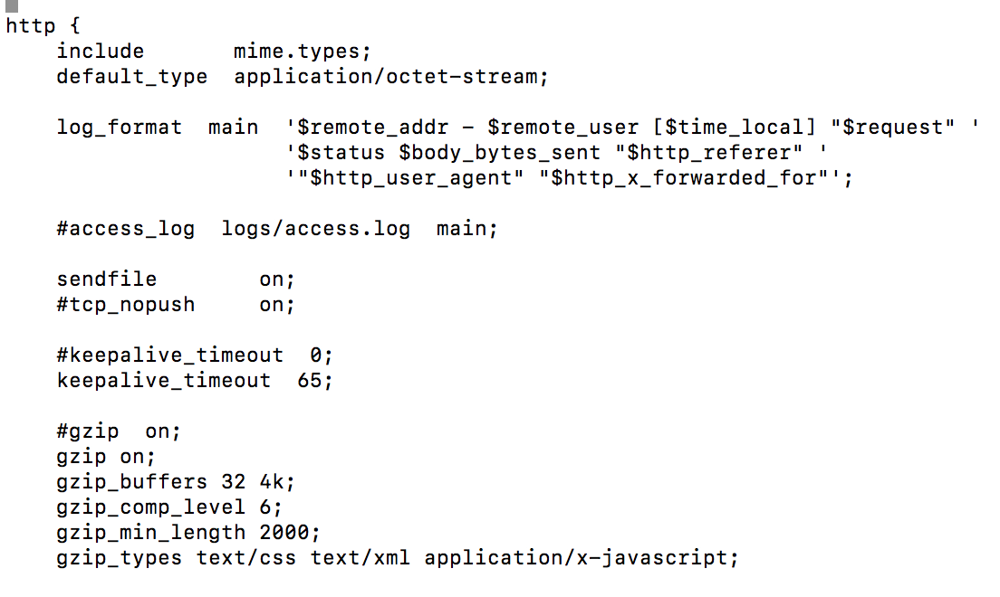
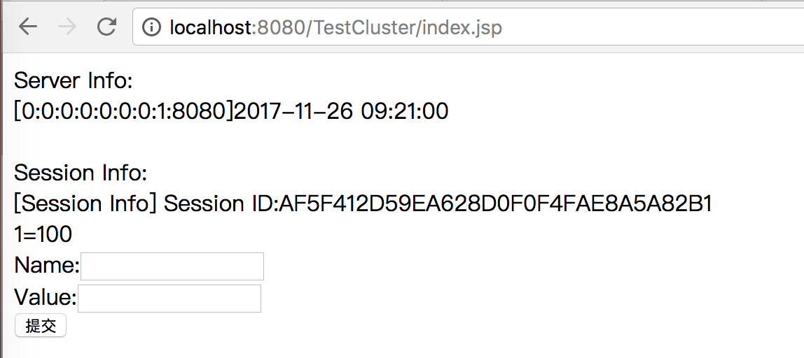
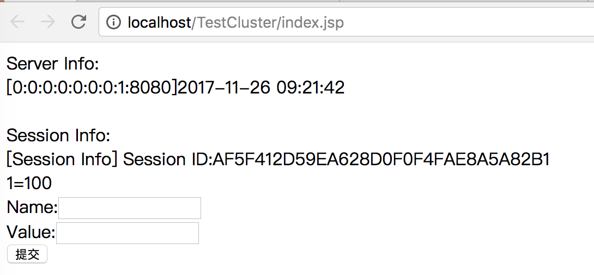
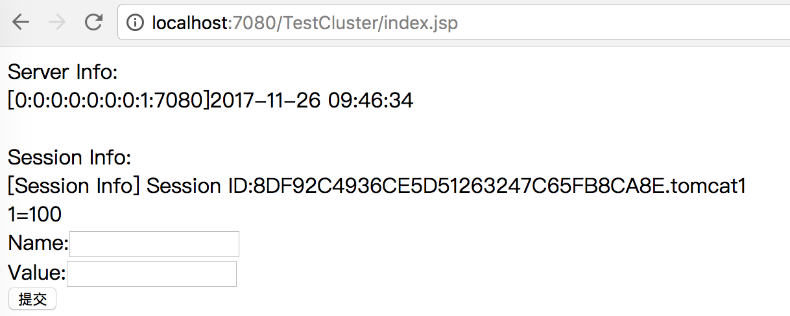
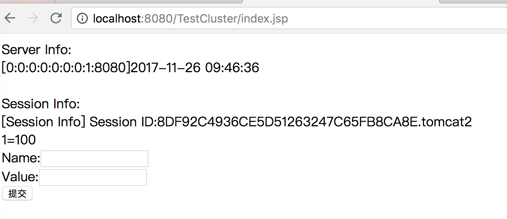
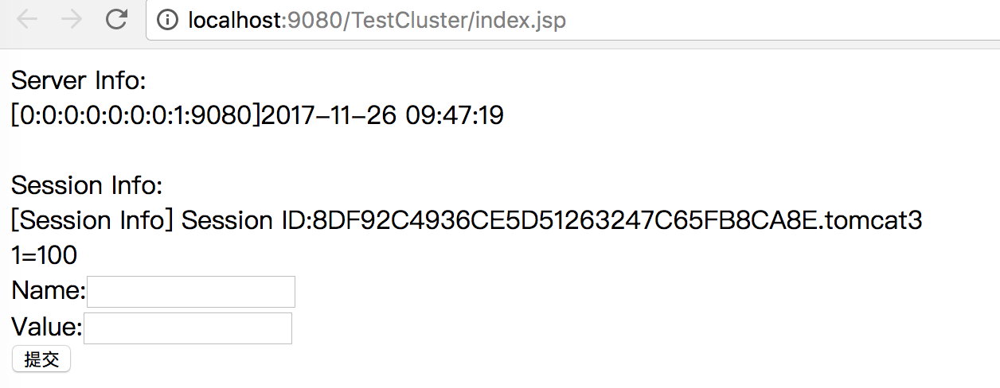
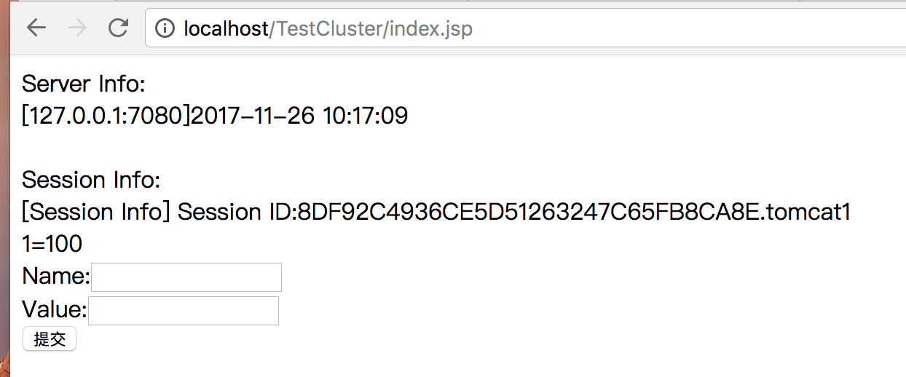

# nginx使用

## 一、Nginx简介
### 1.1 简介  
Nginx是一款轻量级的Web服务器/反向代理服务器以及电子邮件（IMAP/POP3/SMTP）代理服务器，最早由俄罗斯程序设计师Igor Sysoev所开发，为俄罗斯
访问量第二的Rambler.ru站点开发。并在BSD-like下发行。其特点是轻量级占有内存少，并发能力强，目前发展势头强劲，web领域最经典的lamp组合已经变成了lnmp组合。

### 1.2 谁在用nginx  
目前国内的一些门户网站，如网易、搜狐、腾讯，新浪以及大量的新兴网站，如自学it网，豆瓣等。

### 1.3 web服务器市场占有率  
https://news.netcraft.com/archives/category/web-server-survey/  


## 二、Nginx编译与启动

官网：http://nginx.org/
安装准备：nginx依赖于pcre库要先安转pcre，因为nginx要在rewrite时要解析正则表达式，pcre是正则解析库。


### 2.1 下载源码包
```text
a)  http://downloads.sourceforge.net/project/pcre/pcre/8.35/pcre-8.35.tar.gz
b) http://nginx.org/download/nginx-1.8.0.tar.gz
```

PCRE 作用是让 Ngnix 支持 Rewrite 功能,没有该包无法安装
     
### 2.2 准备    
安装nginx前，我们首先要确保系统安装了g++、gcc、openssl-devel、pcre-devel和zlib-devel软件
```shell
yum -y install pcre-devel
yum -y install pcre
yum -y install gcc-c++
yum -y install openssl-devel
yum -y install zlib-devel
```
 
除了使用上边的yum方式安装pcre，还可以使用下边的源码包安装方式，将下载好的源码包解压到/usr/local/src目录下，编译安装  
 
源码方式安装pcre  
```shell
[root@localhost local]# tar -zxvf pcre-8.31.tar.gz -C /usr/local/src
[root@localhost src]# cd pcre-8.31/
[root@localhost pcre-8.31]#./configure --prefix=/usr/local/pcre-8.31
[roott@localhost pcre-8.31]# make
[root@localhost pcre-8.31]# make install
[root@localhost pcre-8.31]# pcre-config --version
8.32
```
  
### 2.3 安装nginx  
```shell
[root@localhost local]# tar -zxvf nginx-1.8.0.tar.gz -C /usr/local/src/
[root@localhost src]# cd nginx-1.8.0/
[root@localhost nginx-1.8.0]#./configure --prefix=/usr/local/nginx-1.8.0
#[root@localhost nginx-1.8.0]#./configure --prefix=/usr/local/nginx-1.8.0 --with-pcre=/usr/local/src/pcre-8.31 源码包安装pcre可能需要指定pcre位置 

[roott@localhost nginx-1.8.0# make && make install
[root@localhost sbin]# /usr/local/nginx-1.8.0/sbin/nginx -v
nginx version: nginx/1.8.0
```
### 2.4 nginx相关文件夹
```shell
cd /usr/local/-1.8.0, 看到如下4个目录
./
 ....conf 配置文件  
 ... html 网页文件
 ...logs  日志文件 
 ...sbin  主要二进制程序
```

### 2.5 配置环境变量  
```shell
vi  /etc/profile
 
末尾添加：
#-------nginx环境变量设置-----------
NGINX_HOME=/usr/local/nginx-1.8.0
PATH=$NGINX_HOME/sbin:$PATH
export NGINX_HOME PATH 
```
source  /etc/profile 

### 2.6 相关操作   
```shell
启动操作
/usr/local/nginx-1.8.0/sbin/nginx (/usr/nginx/sbin/nginx -t 查看配置信息是否正确)
 
停止操作
停止操作是通过向nginx进程发送信号（什么是信号请参阅linux文 章）来进行的
步骤1：查询nginx主进程号
ps -ef | grep nginx
在进程列表里 面找master进程，它的编号就是主进程号了。
步骤2：发送信号
kill -QUIT 主进程号  #Graceful shutdown  优雅的关闭进程,即等请求结束后再关闭
kill -TERM 主进程号  #Quick shutdown 快速停止Nginx
pkill -9 nginx      #强制停止Nginx
kill -HUP 主进程号   #改变配置文件，平滑重读配置文件
kill -USER1 主进程号 #Reopen the log files 重读日志,在日志按月/日分割时有用
kill -USER2 主进程号 #Upgrade Executable on the fly 平滑的升级
kill -WINCH 主进程号 #Gracefully shutdown the worker processes 优雅关闭旧的进程(配合USR2来进行升级)

其他操作
nginx -t 测试配置是否正确
nginx -s reload 重新加载配置
nginx -s stop 立即停止
nginx -s quit 优雅停止
nginx -s reopen 重新打开日志

kill -USR1 `cat /xxx/path/log/nginx.pid`
```
commandLine可以参考：  
[https://www.nginx.com/resources/wiki/start/topics/tutorials/commandline/?highlight=commandline](https://www.nginx.com/resources/wiki/start/topics/tutorials/commandline/?highlight=commandline)

## 三、Nginx配置

### 3.1 nginx.conf
```text
// 全局区
worker_processes 1; // 有1个工作的子进程,可以自行修改,但太大无益,因为要争夺CPU,一般设置为 CPU数*核数

Event {
// 一般是配置nginx连接的特性
// 如1个worker能同时允许多少连接
 worker_connections  1024; // 这是指 一个子进程最大允许连1024个连接
}

http {  //这是配置http服务器的主要段
     server { // 这是虚拟主机段
       
            location {  //定位,把特殊的路径或文件再次定位 ,如image目录单独处理,如.php单独处理
            
            }     
     }

     Server {
     
     }
}
```
### 3.2 虚拟主机配置
案例：
```text
    server {
        listen 80;  #监听端口
        server_name localhsot; #监听域名或主机ip

        location / {
                root /var/www/html;   #根目录定位，如果使用相对路径其相对的是nginx安装目录的html文件夹
                index index.html index.htm; #默认打开的文件，
        }
    }
```
  

  

### 3.3 日志管理

```text
在nginx的server段,可以看到如下类似信息
 #access_log  logs/host.access.log  main;
这说明该server,它的访问日志的文件是logs/host.access.log

使用的格式”main”格式，当然除了main格式,你可以自定义其他格式.

main格式是什么?
log_format  main  '$remote_addr - $remote_user [$time_local] "$request" '
                       '$status $body_bytes_sent "$http_referer" '
                      '"$http_user_agent" "$http_x_forwarded_for"';
main格式是我们定义好一种日志的格式,并起个名字,便于引用.
以上面的例子, main类型的日志,记录的 remote_addr.... http_x_forwarded_for等选项.


1: 日志格式 是指记录哪些选项
默认的日志格式: main
log_format  main  '$remote_addr - $remote_user [$time_local] "$request" '
                  '$status $body_bytes_sent "$http_referer" '
                  '"$http_user_agent" "$http_x_forwarded_for"';

如默认的main日志格式,记录这么几项
$remote_addr 客户端的ip地址(代理服务器，显示代理服务ip)
$remote_user 用于记录远程客户端的用户名称（一般为“-”）
$time_local 用于记录访问时间和时区
$request 请求方法(如GET/POST),用于记录请求的url以及请求方法 
$status 请求状态,例如：200成功、404页面找不到等
$body_bytes_sent 客户端发送的文件主体内容字节数，给服务器发送的自己鞥 
$http_referer referer 以记录用户是从哪个链接访问过来的 
$http_user_agent 用户代理/蜘蛛,用户所使用的代理（一般为浏览器）
$http_x_forwarded_for 被转发的请求的原始IP，即客户端ip

http_x_forwarded_for:在经过代理时,代理把你的本来IP加在此头信息中,传输你的原始IP

2: 声明一个独特的log_format并命名
log_format  mylog '$remote_addr- "$request" '
                   '$status $body_bytes_sent "$http_referer" '
                    '"$http_user_agent" "$http_x_forwarded_for"';
在下面的server/location,我们就可以引用 mylog

nginx允许针对不同的server做不同的Log ,(有的web服务器不支持,如lighttp)
access_log logs/access_8080.log mylog;   
声明log   log位置 log格式;
```

案例：
```text
    server {
        listen       80;
        server_name  localhost;
    
        access_log /var/log/host.access.log main;
        
        location / {
          root /var/www/html;
          index index.html;
        }
    }

查看日志文件
$ cat /var/log/host.access.log 
127.0.0.1 - - [22/Nov/2017:23:42:41 +0800] "GET / HTTP/1.1" 304 0 "-" "Mozilla/5.0 (Macintosh; Intel Mac OS X 10_12_6) AppleWebKit/537.36 (KHTML, like Gecko) Chrome/62.0.3202.94 Safari/537.36" "-"
```

### 3.4 nginx日志切割  
```text
nginx 日志默认情况下统统写入到一个文件中，文件会变的越来越大，非常不方便查看分析。以日期来作为日志的切割 是比较好的，通常我们是以每日来做统计的。

nginx-log-rotate.sh
```shell
#假设nginx的日志文件位置为/usr/local/nginx/logs/host.access.log,为了演示我们每分钟生成一个新的日志文件进行演示
#!/bin/bash
LOGPATH=/usr/local/nginx/logs/host.zccess.log #定义nginx原始日志文件变量

BAK=$LOGPATH/$(date -d yesterday +%Y%m%d%H%M).access.log #日志格式

mv $LOGPATH $BAK #日重命名

touch $LOGPATH #新建原始日志文件

kill -USR1 'cat /usr/local/nginx/logs/nginx.pid' #重读日志，nginx将日志文件写入到新的host.access.log文件中
```

定时任务每分钟执行一次
```shell
crontab -e
*/1 * * * * /usr/local/nginx/logs/nginx-log-rotate.sh #定时任务每一分中执行一次，5个*号分别表示 分 时 天 月 星期

service crond reload #重新加载配置
```

## 3.5 location配置

location有"定位"的意思，根据uri来进行不同的定位，在虚拟主机的配置中，是必不可少的，location可以把网站的不同部分定位
到不同的处理方式上，一个server段中可以配置多个location。 

location语法
```text
location [=|~|~*|^~] patt {

}
```
= 表示精确匹配,这个优先级也是最高的  
^~ 表示 uri 以某个常规字符串开头，理解为匹配 url 路径即可 
~ 表示区分大小写的正则匹配  
~* 表示不区分大小写的正则匹配(和上面的唯一区别就是大小写)  
!~和!~*分别为区分大小写不匹配及不区分大小写不匹配的正则  
/ 通用匹配，任何请求都会匹配到，默认匹配  

其中，中括号中可以不写任何参数，此时称为一般匹配，也可以写参数，因此可以大致分为3种  
location = patt {} 精准匹配  
location patt {} 一般匹配  
location ~ patt {} 正则匹配  

多个 location 配置的情况下匹配顺序优先级
精准匹配 > 正则匹配 > 一般匹配

案例（下边的案例来自网络）：
```text
例子，有如下匹配规则:
location / {
    echo "/"; //需要安装 echo 模块才行,这边大家可以改成各自的规则
}
location = / {
    echo "=/"; 
}
location = /nginx {
   echo "=/nginx";
}
location ~ \.(gif|jpg|png|js|css)$ {
    echo "small-gif/jpg/png"; 
}
location ~* \.png$ {
   echo "all-png";
}
location ^~ /static/ {
   echo "static";
}

以下是各种的访问情况
访问 http://a.ttlsa.com/.因为/是完全匹配的
# curl http://a.ttlsa.com/
 =/
 
访问 http://a.ttlsa.com/nginx,因为完全匹配了”=/nginx”
# curl http://a.ttlsa.com/nginx
=/nginx

访问 http://a.ttlsa.com/nginx,从第一个开始尝试匹配,最后匹配到了~* \.png$ .
# curl http://a.ttlsa.com/xxx/1111.PNG (注意,这是大写)
all-png

访问 http://a.ttlsa.com/static/1111.png,虽然 static 放在最后面,但是因为有^的缘故,他是最匹配的. 
# curl http://a.ttlsa.com/static/1111.png
static

好了，最后给出我们先上环境的静态文件的匹配规则
location ~* .*\.(js|css)$ {
    expires 7d; //7 天过期 
    access_log off; //不保存日志
}

location ~* .*\.(png|jpg|gif|jpeg|bmp|ico)$ {
        expires 7d;
        access_log off;
}

location ~* .*\.(zip|rar|exe|msi|iso|gho|mp3|rmvb|mp4|wma|wmv|rm)$ {
    deny all; //禁止这些文件下载，大家可以根据自己的环境来配置
}
```

### 3.6 rewrite重写
nginx 的重写模块是一个简单的正则表达式匹配与一个虚拟堆叠机结合。依赖于 PCRE 库，因此需要安装 pcre。根 据相关变量重定向和选择不同的配置，
从一个 location 跳转到另一个 location，不过这样的循环最多可以执行 10 次，超过后 nginx 将返回 500 错误。同时，重写模块包含 set 指令，
来创建新的变量并设其值，这在有些情景 下非常有用的，如记录条件标识、传递参数到其他 location、记录做了什么等等。

```text
使用字段:server, location, if

常用指令
if (条件) {} 设定条件，再进行重写 
set #设置变量
return #返回状态码
break #跳出rewrite 
rewrite #重写
```
> if语法
```text
if 空格 (条件){
    重写模式
}
```
案例1：
如果客户地址是本机，返回403
```text
 location / {
          if ($remote_addr = 127.0.0.1) {
            return 403;
          }
          root /var/www/html;
          index index.html;
        }
```
结果：    

案例2：  
如果是如果是ie，则重定向到ie.html  
```text
if ($http_user_agent ~ MSIE) {
    rewrite ^.*$ /ie.htm;
    break; #(不break会循环重定向)
}
```
结果：  


案例3：  
```text
如下: 判断IE并重写,且不用break; 我们用set变量来达到目的
if ($http_user_agent ~* msie) {
     set $isie 1; #set变量值
}

if ($fastcgi_script_name = ie.html) {
     set $isie 0;
}

if ($isie = 1) {
    rewrite ^.*$ ie.html;
}
```

### 3.7 gzip压缩
```text
使用字段：http, server, location, if in location

我们观察news.163.com的头信息
请求:
Accept-Encoding:gzip,deflate,sdch
响应:
Content-Encoding:gzip
Content-Length:36093
再把页面另存下来,观察,约10W字节,实际传输的36093字节，原因就在于gzip压缩上.

原理：如果我们声明gzip压缩，浏览器请求内容的时候，服务器就会返回压缩内容给我，然后浏览器通过对应的解压算法解压压缩内容，这样可以大量节约网络请求带宽。

gzip配置的常用参数：
gzip on|off;  #是否开启gzip
gzip_buffers 32 4K| 16 8K #缓冲(压缩在内存中缓冲几块? 每块多大?)
gzip_comp_level [1-9] #推荐6 压缩级别(级别越高,压的越小,越浪费CPU计算资源)
gzip_disable #正则匹配UA 什么样的Uri不进行gzip
gzip_min_length 200 # 开始压缩的最小长度(再小就不要压缩了,意义不大)
gzip_http_version 1.0|1.1 # 开始压缩的http协议版本(可以不设置,目前几乎全是1.1协议)
gzip_proxied          # 设置请求者代理服务器,该如何缓存内容
gzip_types text/plain  application/xml # 对哪些类型的文件用压缩 如txt,xml,html ,css，提示，conf/mime.types文件中可以查看文件类型
gzip_vary on|off  # 是否传输gzip压缩标志

注意: 
图片/mp3这样的二进制文件,因为压缩率比较小, 比如100->80字节,而且压缩也是耗费CPU资源的.
比较小的文件不必压缩。
```
案例：
设置压缩2000个字节以上的css、xml、javascript    


### 3.8 expires 
对于网站的图片,尤其是新闻站, 图片一旦发布, 改动的可能是非常小的.我们希望 能否在用户访问一次后, 图片缓存在用户的浏览器端,且时间比较长的缓存.
可以, 用到 nginx_http_headers_module模块的expires设置

```text
配置段: http, server, location, if in location
语法: expires [modified] time;

nginx中设置过期时间,非常简单,在location或if段里,来写.
格式   expires 30s; #30s到期
      expires 30m; #30分钟到期
      expires 2h; #2小时到期
      expires 30d; #30天到期
```
案例:
```text
#对图片，flash 文件在浏览器本地缓存 30 天
location ~ .*\.(gif|jpg|jpeg|png|bmp|swf)$ {
expires 30d;
}
#对 js，css 文件在浏览器本地缓存 1 小时
location ~ .*\.(js|css)$
 {
expires 1h;
}
``` 

### 3.9 nginx反向代理和负载均衡

nginx做反向代理和负载均衡非常简单,通过使用proxy, upstream,分别用来做反向代理,和负载均衡，以反向代理为例, nginx不自己处理动态的服务请求,
而是把php/jsp的相关请求转发给apache/tomcat来处理。其实我们常听到的"动静分离"就是使用"反向代理"技术。

>反向代理

案例：
将所有的jsp请求，都转发给tomcat处理

server.xml配置,使用8080端口
```xml
    <Connector port="8080" protocol="HTTP/1.1"
               connectionTimeout="20000"
               redirectPort="8443" />
````
假设我的tomcat下边部署的一个简单的页面如下，访问8080端口如下  


nginx.conf反向代理配置  
如果是jsp请求，将请求转发给tomcat处理
```text
    server {
        listen       80;
        server_name  localhost;
        
        charset utf-8;
        
        access_log /var/log/host.access.log main;
        
        #如果是jsp请求，代理转向tomcat
        location ~ \.jsp$ {
            proxy_set_header X-Forwarded-For $remote_addr; #将真实的客户地址转发给服务端
            proxy_pass http://localhost:8080;
        }

        error_page  404              /404.html;
        # redirect server error pages to the static page /50x.html
        error_page   500 502 503 504  /50x.html;
    }
```
代理结果如下,可以访问80端口，让nginx转发给tomcat：  
  

通过如上的结果我们可以做到，静态的内容（图片，js，css）等交给nginx处理，动态的内容使用反向代理交给后台tomcat处理。

>负载均衡

反向代理后端如果有多台服务器集群，我们可以将后台服务器写在upstream中，然后proxy_pass指向upstream组就可以实现负载均衡。

upstream 语法：
```text
upstream name {
    server address [parameters];
    ....
}
使用字段：
paramters参考：http://nginx.org/en/docs/http/ngx_http_upstream_module.html
```

案例：
假如后台有3台tomcat服务器，端口分别是7080，8080，9080，都部署了同样的项目TestCluster，访问如下：  
    
    
  

nginx.conf中upstream配置：
```text
upstream backend {
    server localhost:7080 weight=1; #weight是权重，值越大转发到该服务器的请求就越多
    server localhost:8080 weight=1;
    server localhost:9080 weight=1;
}

server {
    listen       80;
    server_name  localhost;

    charset utf-8;
    
    access_log /var/log/host.access.log main;
    
    #location ~ \.jsp$ {
    #    proxy_pass http://localhost:8080;
    #}

    location ~ \.jsp$ {
        proxy_set_header X-Forwarded-For $remote_addr; #将真实的客户地址转发给服务端
        proxy_pass http://backend; #转发给upstream
    }
    
    error_page  404              /404.html;
    # redirect server error pages to the static page /50x.html
    error_page   500 502 503 504  /50x.html;
}
```
负载均衡访问结果：


通过浏览器访问80端口，我们可以看到访问后台的服务基本是均匀的。

### 四、nginx安装第三方模块

下边内容来自：WWW.TTLSA.COM 网站作品，作者:凉白开，漠北整理的<<nginx教程从入门到精通>>

nginx 文件非常小但是性能非常的高效,这方面完胜 apache,nginx 文件小的一个原因之一是 nginx 自带的功能相对较
少,好在 nginx 允许第三方模块,第三方模块使得 nginx 越发的强大. 在安装模块方面,nginx 显得没有 apache 安装模块
方便，当然也没有 php 安装扩展方便.在原生的 nginx,他不可以动态加载模块,所以当你安装第三方模块的时候需要
覆盖 nginx 文件.接下来看看如何安装 nginx 第三模块吧.
`
nginx 第三方模块安装方法:  
```text
./configure --prefix=/你的安装目录 --add-module=/第三方模块目录
```
以安装 pagespeed 模块实例
>在未安装 nginx 的情况下安装 nginx 第三方模块
```text
# ./configure --prefix=/usr/local/nginx-1.4.1 \
--with-http_stub_status_module \
--with-http_ssl_module \
--with-http_realip_module \ 
--with-http_image_filter_module \ 
--add-module=../ngx_pagespeed-master \ 
--add-module=/第三方模块目录
# make
```

>在已安装 nginx 情况下安装 nginx 模块
```text
# ./configure --prefix=/usr/local/nginx-1.4.1 \ 
--with-http_stub_status_module \ 
--with-http_ssl_module \
--with-http_realip_module \ 
--with-http_image_filter_module \ 
--add-module=../ngx_pagespeed-master
# make
# /usr/local/nginx-1.4.1/sbin/nginx -s stop 
# cp objs/nginx /usr/local/nginx/sbin/nginx 
# /usr/local/nginx-1.4.1/sbin/nginx
相比之下仅仅多了一步覆盖 nginx 文件.
```
 总结,安装 nginx 安装第三方模块实际上是使用–add-module 重新安装一次 nginx，不要 make install 而是直接把编译
 目录下 objs/nginx 文件直接覆盖老的 nginx 文件.如果你需要安装多个 nginx 第三方模块,你只需要多指定几个相应的
 –add-module 即可。

注意:重新编译的时候，记得一定要把以前编译过的模块一同加到 configure 参数里面.  
nginx 提供了非常多的 nginx 第三方模块提供安装,地址 http://wiki.nginx.org/3rdPartyModules  

