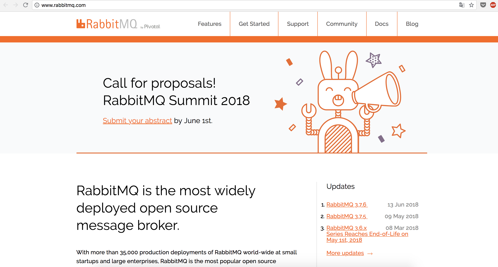
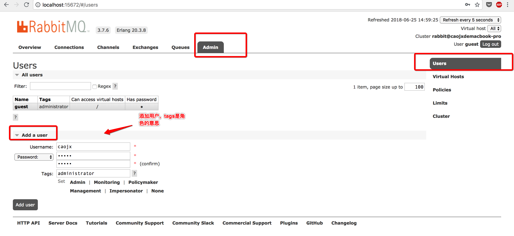
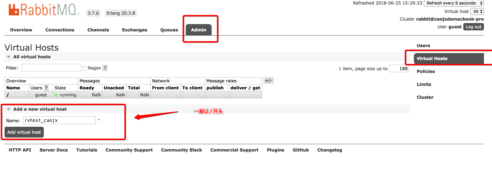
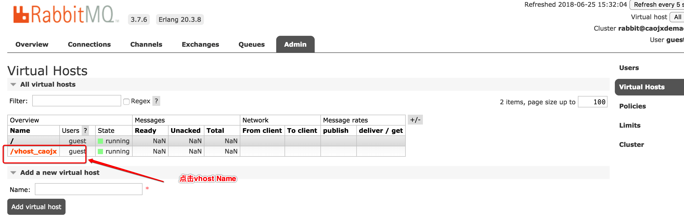
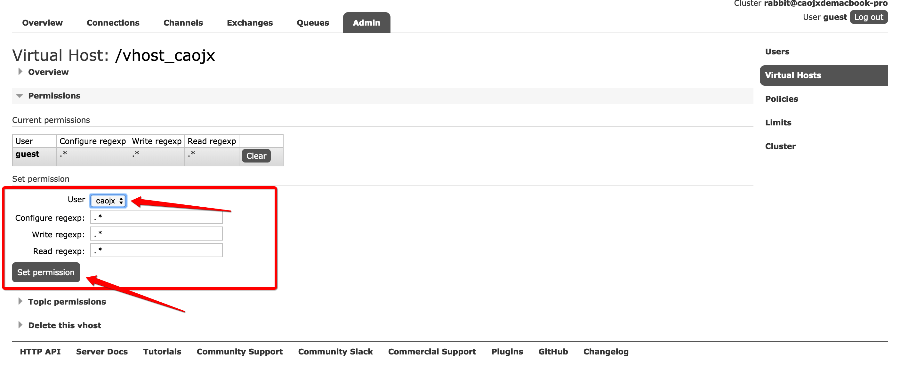
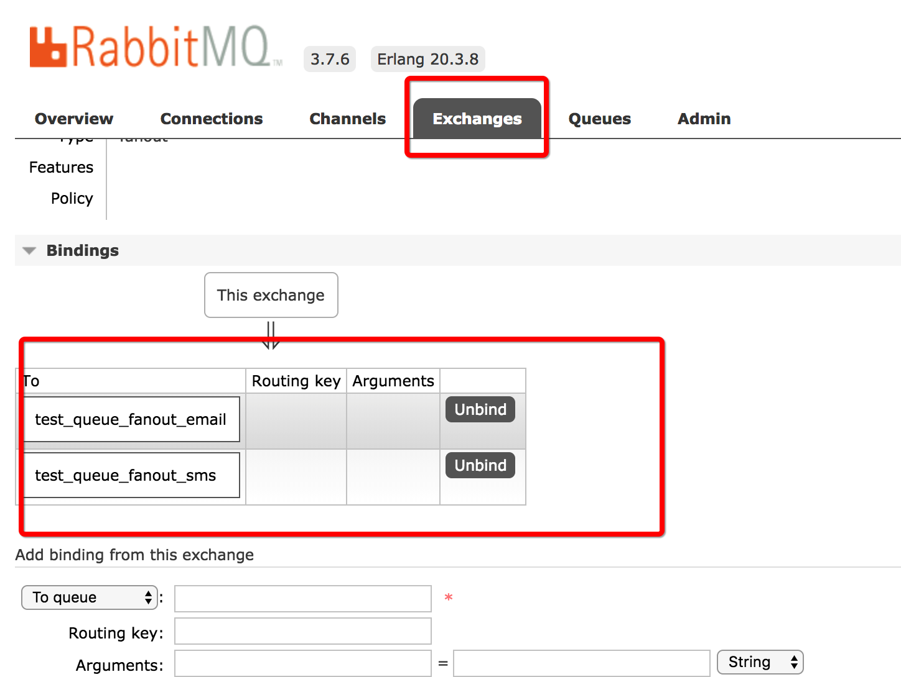
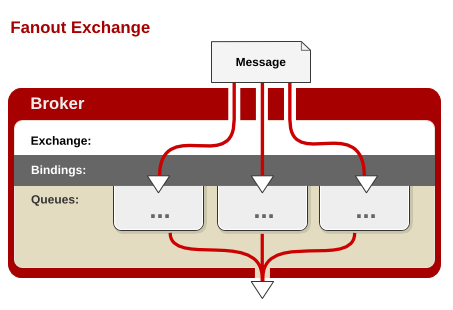

# RabbitMQ 

[TOC]

  


## 一、安装与配置

### 1.1 MacOS 安装RabbitMQ

```shell
#1.安装
$ brew install rabbitmq

#2.启动
$cd /usr/local/Cellar/rabbitmq/3.7.6_1/sbin
$ ./rabbitmq-server 

  ##  ##
  ##  ##      RabbitMQ 3.7.6. Copyright (C) 2007-2018 Pivotal Software, Inc.
  ##########  Licensed under the MPL.  See http://www.rabbitmq.com/
  ######  ##
  ##########  Logs: /usr/local/var/log/rabbitmq/rabbit@localhost.log
                    /usr/local/var/log/rabbitmq/rabbit@localhost_upgrade.log

              Starting broker...
 completed with 6 plugins.
```

访问：http://localhost:15672/  默认用户名/密码  guest/guest.

### 1.2 CentOS7 安装RabbitMQ

参考：https://www.linuxidc.com/Linux/2017-05/143765.htm

1.首先需要安装erlang

```shell
$rpm -Uvh http://download.Fedoraproject.org/pub/epel/7/x86_64/e/epel-release-7-8.noarch.rpm
$yum install erlang
```

2.下载安装rabbitmq

```shell
$wget https://dl.bintray.com/rabbitmq/all/rabbitmq-server/3.7.6/rabbitmq-server-3.7.6-1.el7.noarch.rpm
$yum install rabbitmq-server-3.7.6-1.el7.noarch.rpm
```

3.启动rabbitmq

```shell
#启动服务
$service rabbitmq-server start
#查看服务状态
$service rabbitmq-server status
#停止服务
$service rabbitmq-server stop
```


注意：Windows平台安装方式比较简单可以参见[RabbitMQ官网](http://www.rabbitmq.com/download.html ) 或自行参考其他网友的方案


## 二、用户以及vhost配置

### 2.1 添加用户

     


### 2.2 virtual hosts管理

#### 1. 添加 virtual host

Virtual hosts 相当于mysql的db
    

vhost一般以 /  开头

#### 2. 授权给用户

   

Permissions -> set permission

  

## 三、编码

RabbitMQ有6种队列方式，可参见官网 http://www.rabbitmq.com/getstarted.html

创建rabbitmq-java工程，引入依赖

```xml
<dependency>
    <groupId>com.rabbitmq</groupId>
    <artifactId>amqp-client</artifactId>
    <version>4.0.2</version>
</dependency>
```


### 3.1 简单队列

#### 1. 模型

    

P：Producer 消息生产者

红色：消息队列

C： Comsumer 消息消费者

#### 2. ConnectionUtils.java 

连接工具类

```java
package caojx.learn.utils;

import com.rabbitmq.client.Connection;
import com.rabbitmq.client.ConnectionFactory;

import java.io.IOException;
import java.util.concurrent.TimeoutException;

public class ConnectionUtils {

    /**
     * 获取RabbitMQ连接
     * @return
     * @throws IOException
     * @throws TimeoutException
     */
    public static Connection getConnection() throws IOException, TimeoutException {
        //1.定义一个连接工厂
        ConnectionFactory factory = new ConnectionFactory();
        //2.设置服务地址
        factory.setHost("127.0.0.1");
        //AMQP端口
        factory.setPort(5672);
        //vhost
        factory.setVirtualHost("/vhost_caojx");
        //用户名 密码
        factory.setUsername("caojx");
        factory.setPassword("caojx");
        return factory.newConnection();
    }
}
```

#### 3. Send.java

消息发送者

```java
package caojx.learn.simple;

import caojx.learn.utils.ConnectionUtils;
import com.rabbitmq.client.Channel;
import com.rabbitmq.client.Connection;

import java.io.IOException;
import java.util.concurrent.TimeoutException;

/**
 * 简单队列发送消息
 */
public class Send {

    private static final String QUEUE_NAME = "test_simple_queue";

    public static void main(String[] args) throws IOException, TimeoutException {

        //1.获取一个连接
        Connection connection = ConnectionUtils.getConnection();

        //2.从连接中获取一个通道 Channel是什么后边会专门进行说明
        Channel channel = connection.createChannel();

        //3.创建队列生名
        channel.queueDeclare(QUEUE_NAME, false, false, false, null);

        //4.发送消息
        String msg = "hello simple";

        channel.basicPublish("", QUEUE_NAME, null, msg.getBytes());

        System.out.println("--send msg:"+msg);

        channel.close();
        connection.close();
    }
}
```

#### 4. Reciver.java 

消息消费者，旧的消息接收方式

```java
package caojx.learn.simple;

import caojx.learn.utils.ConnectionUtils;
import com.rabbitmq.client.Channel;
import com.rabbitmq.client.Connection;
import com.rabbitmq.client.QueueingConsumer;

import java.io.IOException;
import java.util.concurrent.TimeoutException;

/**
 * 消费者获取消息 旧的接收消息方式
 */
public class Reciver {

    private static final String QUEUE_NAME = "test_simple_queue";

    public static void main(String[] args) throws IOException, TimeoutException, InterruptedException {

        //1.获取连接
        Connection connection = ConnectionUtils.getConnection();

        //2.创建频道
        Channel channel = connection.createChannel();

        //3.定义队列的消费者  旧的接收消息方式
        QueueingConsumer consumer = new QueueingConsumer(channel);

        //4.监听队列
        channel.basicConsume(QUEUE_NAME, true, consumer);

        while (true) {
            QueueingConsumer.Delivery delivery = consumer.nextDelivery();
            String msgString = new String(delivery.getBody());
            System.out.println("[recv] msg："+msgString);
        }
    }
}
```

#### 5. ReciverNew.java 

新的方式接收消息

```java
package caojx.learn.simple;

import caojx.learn.utils.ConnectionUtils;
import com.rabbitmq.client.*;

import java.io.IOException;
import java.util.concurrent.TimeoutException;

/**
 * 消费者获取消息 新的接收消息方式
 */
public class ReciverNew {

    private static final String QUEUE_NAME = "test_simple_queue";

    public static void main(String[] args) throws IOException, TimeoutException, InterruptedException {

        //1.获取连接
        Connection connection = ConnectionUtils.getConnection();

        //2.创建频道
        Channel channel = connection.createChannel();

        //3.队列声明
        channel.queueDeclare(QUEUE_NAME, false, false, false, null);

        //4.接收消息
       DefaultConsumer consumer =  new DefaultConsumer(channel) {
           //获取到达的消息
            @Override
            public void handleDelivery(String consumerTag, Envelope envelope, AMQP.BasicProperties properties, byte[] body) throws IOException {
                String msgString = new String(body, "utf-8");
                System.out.println("new api reciver:"+msgString);
            }
        };

       //5.监听队列
       channel.basicConsume(QUEUE_NAME, true, consumer);
    }
}
```

#### 6. 简单队列的不足

耦合性高，生产者一一对应消费者（如果我有多个消费者消费队列中的消息，这个时候就不行了），队列名变更，这个时候就需要同时变更。


### 3.2 Work Queues-轮询分发-工作队列

#### 1. 模型

  

为什么会出现工作队列?

Simple队列是一一对应的，而且我们实际开发，生产者发送消息是毫不费力的，而消费者一般需要跟业务相结合。消费者接收消息之后就需要处理，可能需要花费时间，这时候队列就会积压很多消息。


#### 2. 生产者

```JAVA
package caojx.learn.work.robin;

import caojx.learn.utils.ConnectionUtils;
import com.rabbitmq.client.Channel;
import com.rabbitmq.client.Connection;

import java.io.IOException;
import java.util.concurrent.TimeoutException;

/**
 * 工作队列，发送消息 --轮询分发round-robin
 */
public class Send {


    /**
     *                          |---c1
     * p --------Queue----------|
     *                          |---c2
     */
    private static final String QUEUE_NAME = "test_work_queue";


    public static void main(String[] args) throws IOException, TimeoutException {

        //1.获取连接
        Connection connection = ConnectionUtils.getConnection();

        //2获取channel
        Channel channel = connection.createChannel();

        //3.声明队列
        channel.queueDeclare(QUEUE_NAME, false, false, false, null);

        //4.发送消息
        for (int i = 0; i < 50; i++) {
            String msg = "hello"+i;
            channel.basicPublish("",QUEUE_NAME, null, msg.getBytes());
        }
        System.out.println("消息发送完毕");
        channel.close();
        connection.close();
    }
}
```

#### 3. 消费者1

```java
package caojx.learn.work.robin;

import caojx.learn.utils.ConnectionUtils;
import com.rabbitmq.client.*;

import java.io.IOException;
import java.util.concurrent.TimeoutException;

/**
 * 工作队列--消息消费者1
 */
public class Reciver1 {

    private static final String QUEUE_NAME = "test_work_queue";

    public static void main(String[] args) throws IOException, TimeoutException {

        //1.获取连接
        Connection connection = ConnectionUtils.getConnection();

        //2获取channel
        Channel channel = connection.createChannel();

        //3.队列声明
        channel.queueDeclare(QUEUE_NAME, false, false, false, null);

        //4.定义消费者
        DefaultConsumer consumer = new DefaultConsumer(channel) {
            @Override
            public void handleDelivery(String consumerTag, Envelope envelope, AMQP.BasicProperties properties, byte[] body) throws IOException {
                String msgString = new String(body, "utf-8");
                System.out.println("reciver done:"+msgString);
            }
        };

        boolean autoAck = true;
        channel.basicConsume(QUEUE_NAME, autoAck, consumer);
    }
}
```

#### 4. 消费者2 

```java
package caojx.learn.work.robin;

import caojx.learn.utils.ConnectionUtils;
import com.rabbitmq.client.*;

import java.io.IOException;
import java.util.concurrent.TimeoutException;

/**
 * 工作队列--消息消费者2
 */
public class Reciver2 {

    private static final String QUEUE_NAME = "test_work_queue";

    public static void main(String[] args) throws IOException, TimeoutException {

        //1.获取连接
        Connection connection = ConnectionUtils.getConnection();

        //2获取channel
        Channel channel = connection.createChannel();

        //3.队列声明
        channel.queueDeclare(QUEUE_NAME, false, false, false, null);

        //4.定义消费者
        DefaultConsumer consumer = new DefaultConsumer(channel) {
            @Override
            public void handleDelivery(String consumerTag, Envelope envelope, AMQP.BasicProperties properties, byte[] body) throws IOException {
                String msgString = new String(body, "utf-8");
                System.out.println("reciver done:"+msgString);

                try {
                    Thread.sleep(2000);
                } catch (InterruptedException e) {
                    e.printStackTrace();
                } 
            }
        };

        boolean autoAck = true;
        channel.basicConsume(QUEUE_NAME, autoAck, consumer);
    }
}
```

#### 5. 现象

reciver1:

```text
reciver done:hello0
reciver done:hello2
reciver done:hello4
reciver done:hello6
reciver done:hello8
reciver done:hello10
reciver done:hello12
reciver done:hello14
reciver done:hello16
reciver done:hello18
reciver done:hello20
reciver done:hello22
reciver done:hello24
reciver done:hello26
reciver done:hello28
reciver done:hello30
reciver done:hello32
reciver done:hello34
reciver done:hello36
reciver done:hello38
reciver done:hello40
reciver done:hello42
reciver done:hello44
reciver done:hello46
reciver done:hello48
```

reciver2:

```text
reciver done:hello1
reciver done:hello3
reciver done:hello5
reciver done:hello7
reciver done:hello9
reciver done:hello11
reciver done:hello13
reciver done:hello15
reciver done:hello17
reciver done:hello19
reciver done:hello21
reciver done:hello23
reciver done:hello25
reciver done:hello27
reciver done:hello29
reciver done:hello31
reciver done:hello33
reciver done:hello35
reciver done:hello37
reciver done:hello39
reciver done:hello41
reciver done:hello43
reciver done:hello45
reciver done:hello47
reciver done:hello49
```

消费者1和消费者2处理的消息都是一样的

消费者1：偶数

消费者2：奇数

这种方式叫做轮询分发（Round-robin dispatching）,结果就是不管谁忙活或清闲，都不会给多发送一个消息给消费者

### 3.3 Work Queues-公平分发-工作队列

轮询分发的时候，消费者1虽然比消费者2消费消息处理耗时短，但是处理的消息数量还是一样的，这样不是太好，我们需要处理快的多处理一些消息，即能者多劳需要修改成公平分发。使用公平分发（Fair dispatch）。消费者必须关闭自动应答ack，改成手动。

#### 1. 生产者

```java
package caojx.learn.work.fair;

import caojx.learn.utils.ConnectionUtils;
import com.rabbitmq.client.Channel;
import com.rabbitmq.client.Connection;

import java.io.IOException;
import java.util.concurrent.TimeoutException;

/**
 * 工作队列，发送消息 --公平分发
 */
public class Send {


    /**
     *                          |---c1
     * p --------Queue----------|
     *                          |---c2
     */
    private static final String QUEUE_NAME = "test_work_queue";


    public static void main(String[] args) throws IOException, TimeoutException {

        //1.获取连接
        Connection connection = ConnectionUtils.getConnection();

        //2获取channel
        Channel channel = connection.createChannel();

        //3.声明队列
        channel.queueDeclare(QUEUE_NAME, false, false, false, null);

        
        /**
         * 每个消费者发送确认消息之前，消息队列不会发送下一个消息到消费者，一次只处理一个消息
         */
        int prefetchCount = 1;
        channel.basicQos(prefetchCount);
        

        //4.发送消息
        for (int i = 0; i < 50; i++) {
            String msg = "hello"+i;
            channel.basicPublish("",QUEUE_NAME, null, msg.getBytes());
        }
        System.out.println("消息发送完毕");
        channel.close();
        connection.close();
    }
}
```


#### 2. 消费者1

```java
package caojx.learn.work.fair;

import caojx.learn.utils.ConnectionUtils;
import com.rabbitmq.client.*;

import java.io.IOException;
import java.util.concurrent.TimeoutException;

/**
 * 工作队列--消息消费者1
 */
public class Reciver1 {

    private static final String QUEUE_NAME = "test_work_queue";

    public static void main(String[] args) throws IOException, TimeoutException {

        //1.获取连接
        Connection connection = ConnectionUtils.getConnection();

        //2获取channel
        final Channel channel = connection.createChannel();

        //3.队列声明
        channel.queueDeclare(QUEUE_NAME, false, false, false, null);

        channel.basicQos(1); //保证每次都只分发到一个


        //4.定义消费者
        DefaultConsumer consumer = new DefaultConsumer(channel) {
            @Override
            public void handleDelivery(String consumerTag, Envelope envelope, AMQP.BasicProperties properties, byte[] body) throws IOException {
                String msgString = new String(body, "utf-8");
                System.out.println("reciver done:"+msgString);

                //发送手动的回执
                channel.basicAck(envelope.getDeliveryTag(), false);
            }
        };

        //自动应答改成false
        boolean autoAck = false;
        channel.basicConsume(QUEUE_NAME, autoAck, consumer);
    }
}

```

#### 3. 消费者2

```java
package caojx.learn.work.fair;

import caojx.learn.utils.ConnectionUtils;
import com.rabbitmq.client.*;

import java.io.IOException;
import java.util.concurrent.TimeoutException;

/**
 * 工作队列--消息消费者2
 */
public class Reciver2 {

    private static final String QUEUE_NAME = "test_work_queue";

    public static void main(String[] args) throws IOException, TimeoutException {

        //1.获取连接
        Connection connection = ConnectionUtils.getConnection();

        //2获取channel
        final Channel channel = connection.createChannel();

        //3.队列声明
        channel.queueDeclare(QUEUE_NAME, false, false, false, null);

        channel.basicQos(1); //保证每次都只分发到一个

        //4.定义消费者
        DefaultConsumer consumer = new DefaultConsumer(channel) {
            @Override
            public void handleDelivery(String consumerTag, Envelope envelope, AMQP.BasicProperties properties, byte[] body) throws IOException {
                String msgString = new String(body, "utf-8");
                System.out.println("reciver done:"+msgString);

                try {
                    Thread.sleep(2000);
                } catch (InterruptedException e) {
                    e.printStackTrace();
                } finally {
                    ////发送手动的回执
                    channel.basicAck(envelope.getDeliveryTag(), false);
                }
            }
        };

        //自动应答改成false
        boolean autoAck = false;
        channel.basicConsume(QUEUE_NAME, autoAck, consumer);
    }
}
```

#### 4. 现象

reciver1:

```text
reciver done:hello0
reciver done:hello2
reciver done:hello3
reciver done:hello4
reciver done:hello5
reciver done:hello6
reciver done:hello7
reciver done:hello8
reciver done:hello9
reciver done:hello10
reciver done:hello11
reciver done:hello12
reciver done:hello13
reciver done:hello14
reciver done:hello15
reciver done:hello16
reciver done:hello17
reciver done:hello18
reciver done:hello19
reciver done:hello20
reciver done:hello21
reciver done:hello22
reciver done:hello23
reciver done:hello24
reciver done:hello25
reciver done:hello26
reciver done:hello27
reciver done:hello28
reciver done:hello29
reciver done:hello30
reciver done:hello31
reciver done:hello32
reciver done:hello33
reciver done:hello34
reciver done:hello35
reciver done:hello36
reciver done:hello37
reciver done:hello38
reciver done:hello39
reciver done:hello40
reciver done:hello41
reciver done:hello42
reciver done:hello43
reciver done:hello44
reciver done:hello45
reciver done:hello46
reciver done:hello47
reciver done:hello48
reciver done:hello49
```

reciver2:

```text
reciver done:hello1
```

消费者1处理的消息比消费者2多，能者多劳。


### 3.4 消息应答与持久化

#### 1. 消息应答 autoAck

```java
//自动应答改成false
boolean autoAck = false;
channel.basicConsume(QUEUE_NAME, autoAck, consumer);
```

boolean autoAck = true; （自动确认模式） //自动确认模式，如果设置为true，一旦RabbitMQ发送消息给消费者，RabbitMQ就会将消息从内存中删除。这种情况下如果杀死正在执行的消费者，就会丢失正在处理的消息。

Boolean autoAck = false;(手动模式) //如果有一个消费者挂掉了，就会交付给其他消费者，RabbitMQ支持消息应答，消费者告诉RabbitMQ这个消息已经处理完成了，你可以删除了，然后RabbitMQ就会删除内存中的消息。

消息应答默认(false)是自动打开的。

#### 2. 消息的持久化

注意：如果RabbitMQ挂了，我们的消息任然会丢失，我们可以将消息持久化到硬盘。

```java
//3.声明队列
boolean durable = false;
channel.queueDeclare(QUEUE_NAME, durable, false, false, null);
```

注意：我们将程序中的boolean durable = false;改成true是不可以的，尽管代码是正确的，他也不会运行成功，应为我们已经定义了一个叫 「test_work_queue」的queue是为持久化的，不允许重新定义一个已经存在的队列，可以换一个新的队列名或控制台中删除。

### 3.5 publish_subscribe发布订阅模式

#### 1. 模型

  

**特点：**

1. 一个生产者多个消费者
2. 每个消费者都有自己的队列
3. 生产者没有直接将消息发送到队列而是发送到交换机（转发器）
4. 每个队列都要绑定到交换机上
5. 生产者发送的消息经过交换机到达队列就实现了一个消息被多个消费者消费。


#### 2. 消息发布者 

```java
package caojx.learn.ps;

import caojx.learn.utils.ConnectionUtils;
import com.rabbitmq.client.Channel;
import com.rabbitmq.client.Connection;

import java.io.IOException;
import java.util.concurrent.TimeoutException;

/**
 * 发布订阅-消息发布者
 */
public class Send {

    private static final String EXCHANGE_NAME = "test_exchange_fanout";


    public static void main(String[] args) throws IOException, TimeoutException {

        //1.获取连接
        Connection connection = ConnectionUtils.getConnection();

        //2获取channel
        Channel channel = connection.createChannel();

        //3.声明交换机
        channel.exchangeDeclare(EXCHANGE_NAME, "fanout"); //分发

        //4.发送消息
        String msg = "hello ps";
        channel.basicPublish(EXCHANGE_NAME, "", null, msg.getBytes());

        //5.关闭资源
        channel.close();
        connection.close();
        System.out.println("发送完毕");
    }
}
```

消息发布完成后可以在控制台的Exchanges下边看到如下内容  
  

消息哪里去了？丢失了，因为交换机没有存储能力，因为RabbitMQ里边只有队列有存储能力，因为这个时候还没有队列绑定到这个交换机，所以数据丢失了，所以需要有消费者。


#### 3. 消费者1

```java
package caojx.learn.ps;

import caojx.learn.utils.ConnectionUtils;
import com.rabbitmq.client.*;

import java.io.IOException;
import java.util.concurrent.TimeoutException;

/**
 * 发布订阅模式-消息订阅者
 */
public class Reciver1 {

    //队列名称
    private static final String QUEUE_NAME = "test_queue_fanout_email";
    //交换机名称
    private static final String EXCHANGE_NAME = "test_exchange_fanout";

    public static void main(String[] args) throws IOException, TimeoutException {
        //1.获取连接
        Connection connection = ConnectionUtils.getConnection();

        //2获取channel
        Channel channel = connection.createChannel();

        //3.队列声明
        channel.queueDeclare(QUEUE_NAME, false, false, false, null);

        //4.绑定到交换机
        channel.queueBind(QUEUE_NAME, EXCHANGE_NAME, "");


        //5.接收消息
        DefaultConsumer consumer =  new DefaultConsumer(channel) {
            //获取到达的消息
            @Override
            public void handleDelivery(String consumerTag, Envelope envelope, AMQP.BasicProperties properties, byte[] body) throws IOException {
                String msgString = new String(body, "utf-8");
                System.out.println("reciver:"+msgString);
            }
        };

        //6.监听队列
        channel.basicConsume(QUEUE_NAME, true, consumer);

    }
}
```


#### 4. 消费者2

```java
package caojx.learn.ps;

import caojx.learn.utils.ConnectionUtils;
import com.rabbitmq.client.*;

import java.io.IOException;
import java.util.concurrent.TimeoutException;

/**
 * 发布订阅模式-消息订阅者
 */
public class Reciver2 {

    //队列名称
    private static final String QUEUE_NAME = "test_queue_fanout_sms";
    //交换机名称
    private static final String EXCHANGE_NAME = "test_exchange_fanout";

    public static void main(String[] args) throws IOException, TimeoutException {
        //1.获取连接
        Connection connection = ConnectionUtils.getConnection();

        //2获取channel
        Channel channel = connection.createChannel();

        //3.队列声明
        channel.queueDeclare(QUEUE_NAME, false, false, false, null);

        //4.绑定到交换机
        channel.queueBind(QUEUE_NAME, EXCHANGE_NAME, "");


        //5.接收消息
        DefaultConsumer consumer =  new DefaultConsumer(channel) {
            //获取到达的消息
            @Override
            public void handleDelivery(String consumerTag, Envelope envelope, AMQP.BasicProperties properties, byte[] body) throws IOException {
                String msgString = new String(body, "utf-8");
                System.out.println("reciver:"+msgString);
            }
        };
        //6.监听队列
        channel.basicConsume(QUEUE_NAME, true, consumer);

    }
}
```

#### 5. 现象

reciver1:

```text
reciver:hello ps
reciver:hello ps
```


reciver2:

```text
reciver:hello ps
reciver:hello ps
```

一个消息可以发送给多个消费者

   


###3.6 Exchange (交换机，转发器)

作用：一方面接收生产中的消息，另一方面是向队列推送消息。


第一个参数为空表示匿名转发

```java
channel.basicPublish("", QUEUE_NAME, null, msg.getBytes());
```

#### 1. fanout exchange

fanout表示不处理路由键，只需要将队列绑定到对应的交换机，发送消息到交换机，消息就会转发到与交换机绑定的所有队列

```java
channel.exchangeDeclare(EXCHANGE_NAME, "fanout"); //分发
```

     


#### 2. direct exchange

Direct(处理路由键)：

  


路由模式就会使用到这种模式

### 3.7 routing路由模式

#### 1. 模型

  


error info  warning 表示routingKey

#### 2. 生产者

```java
package caojx.learn.routing;

import caojx.learn.utils.ConnectionUtils;
import com.rabbitmq.client.Channel;
import com.rabbitmq.client.Connection;

import java.io.IOException;
import java.util.concurrent.TimeoutException;

/**
 * 路由模式
 */
public class Send {

    private static final String EXCHANGE_NAME = "test_exchange_direct";

    public static void main(String[] args) throws IOException, TimeoutException {

        //1.获取连接
        Connection connection = ConnectionUtils.getConnection();

        //2.获取channel
        Channel channel = connection.createChannel();

        //3.声明exchange
        channel.exchangeDeclare(EXCHANGE_NAME, "direct");

        //4.发送消息
        String msg ="hello direct";
        String routingKey = "error";

        //设置routingKey，只有绑定了对应routingKey的队列才可以接收到消息
        channel.basicPublish(EXCHANGE_NAME, routingKey, null, msg.getBytes());

        System.out.println("消息发送完毕："+msg);

        //5.关闭资源
        channel.close();
        connection.close();
    }
}
```


#### 3. 消费者1

绑定一个routingKey

```java
package caojx.learn.routing;

import caojx.learn.utils.ConnectionUtils;
import com.rabbitmq.client.*;

import java.io.IOException;
import java.util.concurrent.TimeoutException;

public class Reciver1 {

    private static final String EXCHANGE_NAME = "test_exchange_direct";
    private static final String QUEUE_NAME = "test_queue_direct_1";


    public static void main(String[] args) throws IOException, TimeoutException {

        //1.获取连接
        Connection connection = ConnectionUtils.getConnection();

        //2.获取channel
        final Channel channel = connection.createChannel();

        //3.声明队列
        channel.queueDeclare(QUEUE_NAME, false, false, false, null);
        channel.basicQos(1);

        //4.绑定交换机和routingKey
        channel.queueBind(QUEUE_NAME, EXCHANGE_NAME,  "error");


        //5.接收消息
        DefaultConsumer consumer =  new DefaultConsumer(channel) {
            //获取到达的消息
            @Override
            public void handleDelivery(String consumerTag, Envelope envelope, AMQP.BasicProperties properties, byte[] body) throws IOException {
                String msgString = new String(body, "utf-8");
                System.out.println("reciver:"+msgString);
                ////发送手动的回执
                channel.basicAck(envelope.getDeliveryTag(), false);
            }
        };

        //自动应答改成false
        boolean autoAck = false;
        channel.basicConsume(QUEUE_NAME, autoAck, consumer);

    }
}
```

#### 4. 消费者2

绑定多个routingKey

```java
package caojx.learn.routing;

import caojx.learn.utils.ConnectionUtils;
import com.rabbitmq.client.*;

import java.io.IOException;
import java.util.concurrent.TimeoutException;

public class Reciver2 {

    private static final String EXCHANGE_NAME = "test_exchange_direct";
    private static final String QUEUE_NAME = "test_queue_direct_2";


    public static void main(String[] args) throws IOException, TimeoutException {

        //1.获取连接
        Connection connection = ConnectionUtils.getConnection();

        //2.获取channel
        final Channel channel = connection.createChannel();

        //3.声明队列
        channel.queueDeclare(QUEUE_NAME, false, false, false, null);
        channel.basicQos(1);

        //4.绑定交换机和routingKey,绑定多个routingKey
        channel.queueBind(QUEUE_NAME,EXCHANGE_NAME,  "error");
        channel.queueBind(QUEUE_NAME,EXCHANGE_NAME,  "info");
        channel.queueBind(QUEUE_NAME,EXCHANGE_NAME,  "warning");

        //5.接收消息
        DefaultConsumer consumer =  new DefaultConsumer(channel) {
            //获取到达的消息
            @Override
            public void handleDelivery(String consumerTag, Envelope envelope, AMQP.BasicProperties properties, byte[] body) throws IOException {
                String msgString = new String(body, "utf-8");
                System.out.println("reciver:"+msgString);
                ////发送手动的回执
                channel.basicAck(envelope.getDeliveryTag(), false);
            }
        };
        //自动应答改成false
        boolean autoAck = false;
        channel.basicConsume(QUEUE_NAME, autoAck, consumer);

    }
}
```

#### 4. 现象

消费者只能接收到绑定了对应的routingKey的队列中的消息。


### 3.8 Topics 主题模式

#### 1. 模型

  


将路由键和某模式匹配，与routing模式，路由模式不同的就是可以使用通配符。

\# 匹配一个或多个

\* 匹配一个


#### 2. Topic exchange

      


#### 3. 生产者

使用主题模式

```java
package caojx.learn.topic;

import caojx.learn.utils.ConnectionUtils;
import com.rabbitmq.client.Channel;
import com.rabbitmq.client.Connection;

import java.io.IOException;
import java.util.concurrent.TimeoutException;

/**
 * 主题模式-发送消息
 */
public class Send {

    private static final String EXCHANGE_NAME = "test_exchange_topic";

    public static void main(String[] args) throws IOException, TimeoutException {

        //1.获取连接
        Connection connection = ConnectionUtils.getConnection();

        //2.获取channel
        Channel channel = connection.createChannel();

        //3.声明exchange
        channel.exchangeDeclare(EXCHANGE_NAME, "topic");

        //4.发送消息
        String msg ="商品。。。";
        String routingKey = "goods.delete";

        //设置routingKey，只有绑定了对应routingKey的队列才可以接收到消息
        channel.basicPublish(EXCHANGE_NAME, routingKey, null, msg.getBytes());

        System.out.println("消息发送完毕："+msg);

        //5.关闭资源
        channel.close();
        connection.close();
    }
}
```

#### 4.消费者1

```java
package caojx.learn.topic;

import caojx.learn.utils.ConnectionUtils;
import com.rabbitmq.client.*;

import java.io.IOException;
import java.util.concurrent.TimeoutException;

/**
 * 发布订阅模式-消息订阅者
 */
public class Reciver1 {

    //队列名称
    private static final String QUEUE_NAME = "test_queue_topic_1";
    //交换机名称
    private static final String EXCHANGE_NAME = "test_exchange_topic";

    public static void main(String[] args) throws IOException, TimeoutException {
        //1.获取连接
        Connection connection = ConnectionUtils.getConnection();

        //2获取channel
        Channel channel = connection.createChannel();

        //3.队列声明
        channel.queueDeclare(QUEUE_NAME, false, false, false, null);

        //4.绑定到交换机 routingKey使用通配符使用指定值
        channel.queueBind(QUEUE_NAME, EXCHANGE_NAME, "goods.add");

        //5.接收消息
        DefaultConsumer consumer =  new DefaultConsumer(channel) {
            //获取到达的消息
            @Override
            public void handleDelivery(String consumerTag, Envelope envelope, AMQP.BasicProperties properties, byte[] body) throws IOException {
                String msgString = new String(body, "utf-8");
                System.out.println("reciver1:"+msgString);
            }
        };
        //6.监听队列
        channel.basicConsume(QUEUE_NAME, true, consumer);
    }
}
```


#### 5. 消费者2 

```java
package caojx.learn.topic;

import caojx.learn.utils.ConnectionUtils;
import com.rabbitmq.client.*;

import java.io.IOException;
import java.util.concurrent.TimeoutException;

/**
 * 发布订阅模式-消息订阅者
 */
public class Reciver2 {

    //队列名称
    private static final String QUEUE_NAME = "test_queue_topic_2";
    //交换机名称
    private static final String EXCHANGE_NAME = "test_exchange_topic";

    public static void main(String[] args) throws IOException, TimeoutException {
        //1.获取连接
        Connection connection = ConnectionUtils.getConnection();

        //2获取channel
        Channel channel = connection.createChannel();

        //3.队列声明
        channel.queueDeclare(QUEUE_NAME, false, false, false, null);

        //4.绑定到交换机, routingKey使用通配符
        channel.queueBind(QUEUE_NAME, EXCHANGE_NAME, "goods.#");


        //5.接收消息
        DefaultConsumer consumer =  new DefaultConsumer(channel) {
            //获取到达的消息
            @Override
            public void handleDelivery(String consumerTag, Envelope envelope, AMQP.BasicProperties properties, byte[] body) throws IOException {
                String msgString = new String(body, "utf-8");
                System.out.println("reciver2:"+msgString);
            }
        };
        //6.监听队列
        channel.basicConsume(QUEUE_NAME, true, consumer);
    }
}
```


#### 6.现象

消费者2接收到了消息，即主题模式可以通过通配符的方式将消息发送给消费者。


### 3.8 rabbitmq消息确认机制之事务机制

在rabbitmq中，我们可以通过持久化数据解决rabbitmq服务器异常的数据丢失问题。

问题：生产者将消息发送出去后消息是否有到达rabbitmq服务器？默认情况是不知道的。

我们有两种方式知道消息到达了rabbitmq:

1. AMQP实现了事务机制
2. Confirm模式


#### 1. 事务机制

txselect : 用于将当前channel设置成transation模式

txCommit：用于提交事务

txRollback：用于回滚事务


##### 1. 生产者

```java
package caojx.learn.tx;

import caojx.learn.utils.ConnectionUtils;
import com.rabbitmq.client.Channel;
import com.rabbitmq.client.Connection;

import java.io.IOException;
import java.util.concurrent.TimeoutException;

/**
 * 事务模式
 */
public class TxSend {

    private static final String QUEUE_NAME = "test_queue_tx";
    public static void main(String[] args) throws IOException, TimeoutException {

        //1.获取连接
        Connection connection = ConnectionUtils.getConnection();

        //2获取channel
        Channel channel = connection.createChannel();

        //3.声明队列
        channel.queueDeclare(QUEUE_NAME, false, false, false, null);
        String msgString = "hello tx message!";
        try{
            //4.开启事务模式
            channel.txSelect();

            channel.basicPublish("", QUEUE_NAME, null, msgString.getBytes());

            //异常回滚
            //int xx = 1/0;

            System.out.println("send message:"+msgString);
            channel.txCommit();
        }catch (Exception e){
            channel.txRollback();
            System.out.println("send message rollback!");
        }

        channel.close();
        connection.close();

    }
}
```


##### 2. 消费者

```java
package caojx.learn.tx;

import caojx.learn.utils.ConnectionUtils;
import com.rabbitmq.client.*;

import java.io.IOException;
import java.util.concurrent.TimeoutException;

public class TxReciver {


    private static final String QUEUE_NAME = "test_queue_tx";

    public static void main(String[] args) throws IOException, TimeoutException {

        //1.获取连接
        Connection connection = ConnectionUtils.getConnection();

        //2获取channel
        Channel channel = connection.createChannel();

        //3.声明队列
        channel.queueDeclare(QUEUE_NAME, false, false, false, null);

        //4.接收消息
        DefaultConsumer consumer =  new DefaultConsumer(channel) {
            //获取到达的消息
            @Override
            public void handleDelivery(String consumerTag, Envelope envelope, AMQP.BasicProperties properties, byte[] body) throws IOException {
                String msgString = new String(body, "utf-8");
                System.out.println("reciver:"+msgString);
            }
        };

        //5.监听队列
        channel.basicConsume(QUEUE_NAME, true, consumer);
    }
}
```

由于使用了事务，这种模式还是很消耗时间的，降低了rabbitmq的消息吞吐量，我们可以有更好的解决模式Confirm模式


#### 2. Confirm 模式

生产者将信道设置成confirm模式，一但信道进入confirm模式，所有在该信道上发布的消息都会被指派一个唯一的ID（从1开始），一但消息被投递到所匹配的队列之后，broker就会发送一个确认给生产者（包含消息的唯一ID）,这就使得生产者知道消息已经正确的达到目的队列了，如果消息和队列是可以持久化的，那么确认消息会将消息写入磁盘后发出，broker回传给生产者的确认消息中deliver-tag域包含了确认消息的序列号，此broker也可以设置basic.ack的multiple域，表示这个序列号之前的所有消息都已经得到了处理。


Confirm模式最大的好处在于他是异步的。

开启Confirm模式：

channel.confirmSelect();

编程模式：

1.普通 发一条 waitForConfirms();

2.批量的 发一批 waitForConfirms();

3.异步confirm模式提供一个回调方法


##### 1. confirm单条发送

```java
package caojx.learn.confirm;

import caojx.learn.utils.ConnectionUtils;
import com.rabbitmq.client.Channel;
import com.rabbitmq.client.Connection;

import java.io.IOException;
import java.util.concurrent.TimeoutException;

/**
 * confirm 普通模式 单条发送
 */
public class Send1 {

    //队列名称
    private static final String QUEUE_NAME = "test_queue_confirm1";

    public static void main(String[] args) throws IOException, TimeoutException, InterruptedException {


        //1.获取连接
        Connection connection = ConnectionUtils.getConnection();

        //2获取channel
        Channel channel = connection.createChannel();

        //3.声明队列
        channel.queueDeclare(QUEUE_NAME, false, false, false, null);

        //生产者调用confirmSelect将channel设置为confirm模式
        channel.confirmSelect();

        //4.发送数据 单条发送
        String msgString = "hello confirm message!";

        channel.basicPublish("", QUEUE_NAME, null, msgString.getBytes());

        //确认
        if(!channel.waitForConfirms()){
            System.out.println("message send failed!");
        }else{
            System.out.println("message send ok");
        }

        channel.close();
        connection.close();
    }
}
```

##### 2. confirms多条发送

```java
package caojx.learn.confirm;

import caojx.learn.utils.ConnectionUtils;
import com.rabbitmq.client.Channel;
import com.rabbitmq.client.Connection;

import java.io.IOException;
import java.util.concurrent.TimeoutException;

/**
 * confirm 普通模式 批量发送
 */
public class Send2 {

    //队列名称
    private static final String QUEUE_NAME = "test_queue_confirm2";

    public static void main(String[] args) throws IOException, TimeoutException, InterruptedException {


        //1.获取连接
        Connection connection = ConnectionUtils.getConnection();

        //2获取channel
        Channel channel = connection.createChannel();

        //3.声明队列
        channel.queueDeclare(QUEUE_NAME, false, false, false, null);

        //生产者调用confirmSelect将channel设置为confirm模式
        channel.confirmSelect();

        //4.发送批量数据
        for (int i = 0; i < 10; i++) {
            String msgString = "hello confirm batch message"+i;
            channel.basicPublish("", QUEUE_NAME, null, msgString.getBytes());
        }

        //确认
        if(!channel.waitForConfirms()){
            System.out.println("message batch send failed!");
        }else{
            System.out.println("message batch send ok");
        }

        channel.close();
        connection.close();
    }
}
```

##### 3. 异步模式

Channel对象提供的confirmListener()回调方法只包含deliveryTag（当前Channel发出的消息序号）我们需要自己为每一个Channel维护一个unconfirm的消息序号集合，每publish一条数据，集合中元素加1， 每回调一次handleAck方法，unconfirm集合删掉相应的一条（multiple=false）或多条（multiple=true）记录。从程序运行效率上看，这个unconfirm集合最好采用有序集合SortendSet存储结构。

```java
package caojx.learn.confirm;

import caojx.learn.utils.ConnectionUtils;
import com.rabbitmq.client.Channel;
import com.rabbitmq.client.ConfirmListener;
import com.rabbitmq.client.Connection;

import java.io.IOException;
import java.util.Collection;
import java.util.Collections;
import java.util.SortedSet;
import java.util.TreeSet;
import java.util.concurrent.TimeoutException;

/**
 * confirm 异步模式
 */
public class Send3 {

    //队列名称
    private static final String QUEUE_NAME = "test_queue_confirm3";

    public static void main(String[] args) throws IOException, TimeoutException, InterruptedException {


        //1.获取连接
        Connection connection = ConnectionUtils.getConnection();

        //2获取channel
        Channel channel = connection.createChannel();

        //3.声明队列
        channel.queueDeclare(QUEUE_NAME, false, false, false, null);

        //生产者调用confirmSelect将channel设置为confirm模式
        channel.confirmSelect();

        //用于存放未确认的消息
        final SortedSet<Long> confirmSet = Collections.synchronizedSortedSet(new TreeSet<Long>());

        //通道添加监听
        channel.addConfirmListener(new ConfirmListener() {
            //没有问题handleAck
            @Override
            public void handleAck(long deliveryTag, boolean multiple) throws IOException {
                if (multiple) {
                    System.out.println("---handleAck------multiple");
                    confirmSet.headSet(deliveryTag + 1).clear();
                } else {
                    System.out.println("---handleAck------multiple false");
                    confirmSet.remove(deliveryTag);
                }
            }

            //handleNack 回执有问题
            @Override
            public void handleNack(long deliveryTag, boolean multiple) throws IOException {
                if (multiple) {
                    System.out.println("---handleNack------multiple");
                    confirmSet.headSet(deliveryTag + 1).clear();
                } else {
                    System.out.println("---handleNack------multiple false");
                    confirmSet.remove(deliveryTag);
                }
            }
        });

        String msgString = "ssssssss";
        while (true){
            long seqNo = channel.getNextPublishSeqNo();
            channel.basicPublish("", QUEUE_NAME, null, msgString.getBytes());
            confirmSet.add(seqNo);
        }
    }
}
```


#### 3.消息接收者

注意：现象自行测试一下

```java
package caojx.learn.confirm;

import caojx.learn.utils.ConnectionUtils;
import com.rabbitmq.client.*;

import java.io.IOException;
import java.util.concurrent.TimeoutException;

/**
 * 消息接收者
 */
public class Reciver {


    private static final String QUEUE_NAME = "test_queue_confirm3";

    public static void main(String[] args) throws IOException, TimeoutException {

        //1.获取连接
        Connection connection = ConnectionUtils.getConnection();

        //2获取channel
        Channel channel = connection.createChannel();

        //3.声明队列
        channel.queueDeclare(QUEUE_NAME, false, false, false, null);

        //4.接收消息
        DefaultConsumer consumer =  new DefaultConsumer(channel) {
            //获取到达的消息
            @Override
            public void handleDelivery(String consumerTag, Envelope envelope, AMQP.BasicProperties properties, byte[] body) throws IOException {
                String msgString = new String(body, "utf-8");
                System.out.println("reciver confirm msg:"+msgString);
            }
        };

        //5.监听队列
        channel.basicConsume(QUEUE_NAME, true, consumer);

    }
}
```


### 四、Spring集成RabbitMQ

Spring官网：http://spring.io/projects/spring-amqp


#### 1.pom.xml

```xml
<?xml version="1.0" encoding="UTF-8"?>

<project xmlns="http://maven.apache.org/POM/4.0.0" xmlns:xsi="http://www.w3.org/2001/XMLSchema-instance"
         xsi:schemaLocation="http://maven.apache.org/POM/4.0.0 http://maven.apache.org/xsd/maven-4.0.0.xsd">
    <modelVersion>4.0.0</modelVersion>

    <groupId>caojx.learn</groupId>
    <artifactId>rabbitmq-java</artifactId>
    <version>1.0-SNAPSHOT</version>

    <name>rabbitmq-java</name>
    <!-- FIXME change it to the project's website -->
    <url>http://www.example.com</url>

    <properties>
        <project.build.sourceEncoding>UTF-8</project.build.sourceEncoding>
        <maven.compiler.source>1.7</maven.compiler.source>
        <maven.compiler.target>1.7</maven.compiler.target>
    </properties>

    <dependencies>

        <dependency>
            <groupId>com.rabbitmq</groupId>
            <artifactId>amqp-client</artifactId>
            <version>4.0.2</version>
        </dependency>

        <dependency>
            <groupId>org.slf4j</groupId>
            <artifactId>slf4j-log4j12</artifactId>
            <version>1.7.12</version>
        </dependency>

        <dependency>
            <groupId>log4j</groupId>
            <artifactId>log4j</artifactId>
            <version>1.2.17</version>
        </dependency>

        <dependency>
            <groupId>junit</groupId>
            <artifactId>junit</artifactId>
            <version>4.11</version>
            <scope>test</scope>
        </dependency>

        <!--spring-rabbit-->
        <dependency>
            <groupId>org.springframework.amqp</groupId>
            <artifactId>spring-rabbit</artifactId>
            <version>2.0.1.RELEASE</version>
        </dependency>
        <dependency>
            <groupId>org.springframework</groupId>
            <artifactId>spring-context</artifactId>
            <version>4.3.14.RELEASE</version>
        </dependency>
        <dependency>
            <groupId>org.springframework</groupId>
            <artifactId>spring-core</artifactId>
            <version>4.3.14.RELEASE</version>
        </dependency>
        <dependency>
            <groupId>org.springframework</groupId>
            <artifactId>spring-beans</artifactId>
            <version>4.3.14.RELEASE</version>
        </dependency>

    </dependencies>
</project>
```

####2.content.xml

```xml
<?xml version="1.0" encoding="UTF-8"?>
<beans xmlns="http://www.springframework.org/schema/beans"
       xmlns:xsi="http://www.w3.org/2001/XMLSchema-instance"
       xmlns:context="http://www.springframework.org/schema/context"
       xmlns:rabbit="http://www.springframework.org/schema/rabbit"
       xsi:schemaLocation="http://www.springframework.org/schema/beans http://www.springframework.org/schema/beans/spring-beans.xsd http://www.springframework.org/schema/context http://www.springframework.org/schema/context/spring-context.xsd http://www.springframework.org/schema/rabbit http://www.springframework.org/schema/rabbit/spring-rabbit.xsd">

    <!--1.定义RabbitMQ的连接工厂-->
    <rabbit:connection-factory id="connectionFactory" host="127.0.0.1" port="5672" username="caojx" password="caojx" virtual-host="/vhost_caojx"/>

    <!--2.定义rabbit模板， 指定连接工厂以及定义exchange-->
    <rabbit:template id="amqpTemplate" connection-factory="connectionFactory" exchange="fanoutExchange"></rabbit:template>

    <!--3.MQ的管理，包括队列，交换器声明等-->
    <rabbit:admin connection-factory="connectionFactory"></rabbit:admin>

    <!--定义队列，自动声明-->
    <rabbit:queue name="myqueue" auto-declare="true" durable="true"></rabbit:queue>

    <!--定义交换器， 自动声明-->
    <rabbit:fanout-exchange name="fanoutExchange" auto-declare="true">
        <rabbit:bindings>
            <rabbit:binding queue="myqueue"></rabbit:binding>
        </rabbit:bindings>
    </rabbit:fanout-exchange>

    <!--监听队列-->
    <rabbit:listener-container connection-factory="connectionFactory">
        <rabbit:listener ref="foo" method="listen" queue-names="myqueue"></rabbit:listener>
    </rabbit:listener-container>

    <!--消费者-->
    <bean id="foo" class="caojx.learn.spring.MyConsumer"></bean>
</beans>
```


#### 3.生产者

```java
package caojx.learn.spring;

import org.springframework.amqp.rabbit.core.RabbitTemplate;
import org.springframework.context.support.AbstractApplicationContext;
import org.springframework.context.support.ClassPathXmlApplicationContext;

import javax.annotation.Resource;

public class SpringMain {

    public static void main(String[] args) throws InterruptedException {
      AbstractApplicationContext ctx = new ClassPathXmlApplicationContext("classpath:content.xml");

      //RabbitMQ模板
      RabbitTemplate template = ctx.getBean(RabbitTemplate.class);
      //发送消息
      template.convertAndSend("hello world");
      Thread.sleep(1000);//休眠1s
      ctx.destroy();

    }
}
```

#### 4.消费者

```java
package caojx.learn.spring;

public class MyConsumer {

    //执行具体的业务方法
    public void listen(String foo) {
        System.out.println("消费者："+foo);
    }
}
```

执行SpringMain中的main方法运行结果

```text
消费者：hello world
```

