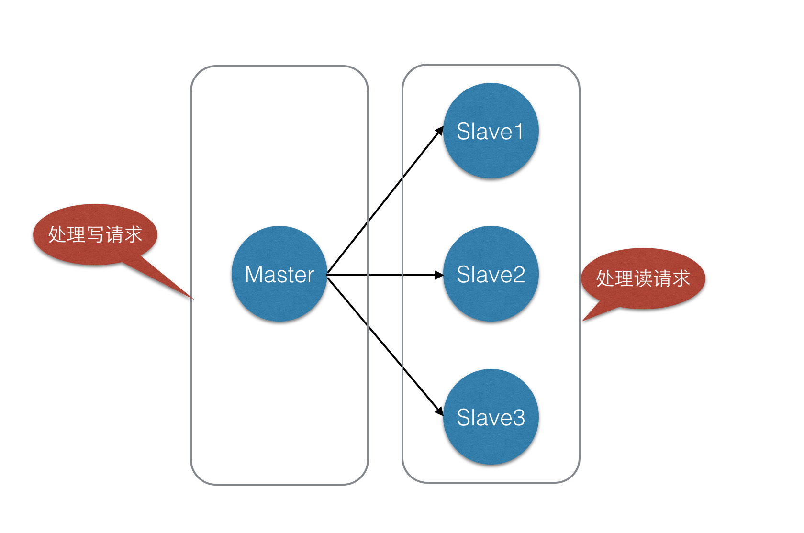

# Redis主从配置

[TOC]

参考：http://blog.csdn.net/hechurui/article/details/49508813

​	    https://www.cnblogs.com/jager/p/6349860.html

## 1 Redis 主从同步

1. **原理**

如果设置了一个从服务器，在连接时它发送了一个SYNC命令，不管它是第一次连接还是再次连接都没有关系。

然后主服务器开始后台存储，并且开始缓存新连接进来的修改数据的命令。当后台存储完成后，主服务器把数据文件发送到从服务器，
从服务器将其保存在磁盘上，然后加载到内存中。然后主服务器把刚才缓存的命令发送到从服务器。这是作为命令流来完成的，并且
和Redis协议本身格式相同。

你可以通过telnet自己尝试一下。在Redis服务器工作时连接到Redis端口，发送SYNC命令，会看到一个批量的传输，并且主服务器接收
的每一个命令都会通过telnet会话重新发送一遍。

当主从服务器之间的连接由于某些原因断开时，从服务器可以自动进行重连接。当有多个从服务器同时请求同步时，主服务器只进行一个后台存储。

当连接断开又重新连上之后，一般都会进行一个完整的重新同步，但是从Redis2.8开始，只重新同步一部分也可以。

1. **案例**

> 电子商务网站上的商品，一般都是一次上传，无数次浏览的，说专业点也就是”多读少写”

对于这种场景，我们可以使如下这种架构：

  

如图中所示，我们将一台Redis服务器作主库(Matser)，其他三台作为从库(Slave)，主库只负责写数据，每次有数据更新都将更新的数据同步到它所有的从库，而从库只负责读数据。这样一来，就有了两个好处：

- 读写分离，不仅可以提高服务器的负载能力，并且可以根据读请求的规模自由增加或者减少从库的数量，棒极了；
- 数据被复制成了了好几份，就算有一台机器出现故障，也可以使用其他机器的数据快速恢复。

需要注意的是：在Redis主从模式中，一台主库可以拥有多个从库，但是一个从库只能隶属于一个主库。

2.**安装**

```shell
#mkdir /home/caojx/redis
#mkdir /home/caojx/redis/redis_master 	   #创建reids安装目录
#mkdir /home/caojx/redis/redis_master/conf #用来存放redis配置文件
#mkdir /home/caojx/redis/redis_slave1
#mkdir /home/caojx/redis/redis_slave1/conf
#mkdir /home/caojx/redis/redis_slave2
#mkdir /home/caojx/redis/redis_slave2/conf
#mkdir /home/caojx/redis/redis_slave3
#mkdir /home/caojx/redis/redis_slave3/conf
#cd /home/caojx/redis
#yum install yum install gcc-c++
#wget http://download.redis.io/releases/redis-4.0.8.tar.gz
#cd redis-4.0.8
#make
#make PREFIX=/home/caojx/redis/redis_master install #redis安装
#make PREFIX=/home/caojx/redis/redis_slave1 install
#make PREFIX=/home/caojx/redis/redis_slave2 install
#make PREFIX=/home/caojx/redis/redis_slave3 install
#cp /home/caojx/redis/redis-4.0.8/redis.conf /home/caojx/redis/redis_master/conf #将redis配置文件复制到对应的安装目录
#cp /home/caojx/redis/redis-4.0.8/redis.conf /home/caojx/redis/redis_slave1/conf
#cp /home/caojx/redis/redis-4.0.8/redis.conf /home/caojx/redis/redis_slave2/conf
#cp /home/caojx/redis/redis-4.0.8/redis.conf /home/caojx/redis/redis_slave3/conf
#cp /home/caojx/redis/redis-4.0.8/sentinel.conf /home/caojx/redis/redis_slave3/conf
#cp /home/caojx/redis/redis-4.0.8/sentinel.conf /home/caojx/redis/redis_slave2/conf
#cp /home/caojx/redis/redis-4.0.8/sentinel.conf /home/caojx/redis/redis_slave1/conf
#cp /home/caojx/redis/redis-4.0.8/sentinel.conf /home/caojx/redis/redis_master/conf
```

3.**配置**

主节点（master）:127.0.0.1:6376
从节点（slave1）:127.0.0.1:6377
从节点（slave2）:127.0.0.1:6378
从节点（slave3）:127.0.0.1:6379

在Redis中，要实现主从复制架构非常简单，只需要在从数据库的(redis.conf)配置文件中加上如下命令即可,主数据库不用配置：

> 方式1：在从数据的redis.conf配置主数据库的ip/port

```shell
slaveof 主数据库地址  主数据库端口
```

> 方式2：在启动从数据库的时候指定主数据库的ip/port

```shell
# ./redis-server --slaveof 主数据库地址 主数据库端口
```

**master的redis.conf配置**

主数据库master的不需要要配置什么，这里主要配置一下端口和密码

```shell
#vim /home/caojx/redis/redis_master/conf/redis.conf
port 6376 #设置主数据库的启动端口
requirepass 123456 #设置主数据库的密码
daemonize yes #支持后端启动
```

**slave1的redis.conf配置**

```shell
port 6377 #slave1的启动端口
slaveof 127.0.0.1 6376 #主数据库的ip 主数据库的port
masterauth 123456 #主数据库的认证密码
requirepass 123456 #从数据库密码
daemonize yes #支持后端启动
```

**slave2的redis.conf配置**

```shell
port 6378
slaveof 127.0.0.1 6376
masterauth 123456
requirepass 123456
daemonize yes
```

**slave3的redis.conf配置**

```shell
port 6379
slaveof 127.0.0.1 6376
masterauth 123456
requirepass 123456
daemonize yes
```

注意： requirepass：是认证密码，应该之后要作主从切换，所以建议所有的密码都一致。masterauth是从机对主机验证时，所需的密码(即主机的requirepass)。

1. **启动**

```shell
#启动master
#cd /home/caojx/redis/redis_master/bin
#./redis-server ../conf/redis.conf 
#启动slave1
#cd /home/caojx/redis/redis_slave1/bin
#./redis-server ../conf/redis.conf 
#启动slave2
#cd /home/caojx/redis/redis_slave2/bin
#./redis-server ../conf/redis.conf 
#启动slave3
#cd /home/caojx/redis/redis_slave3/bin
#./redis-server ../conf/redis.conf 

#ps -ef | grep -i redis #查看是否启动
caojx      5024      1  0 04:00 ?        00:00:00 ./redis-server 127.0.0.1:6376
caojx      5029      1  0 04:00 ?        00:00:00 ./redis-server 127.0.0.1:6377
caojx      5035      1  0 04:00 ?        00:00:00 ./redis-server 127.0.0.1:6378
caojx      5041      1  0 04:00 ?        00:00:00 ./redis-server 127.0.0.1:6379

#连接master
#/home/caojx/redis/redis_master/bin/redis-cli -p 6376
127.0.0.1:6376> auth 123456
OK
127.0.0.1:6376> info replication
# Replication #检查启动结果
role:master #显示未主数据库
connected_slaves:3
slave0:ip=127.0.0.1,port=6377,state=online,offset=630,lag=0
slave1:ip=127.0.0.1,port=6378,state=online,offset=630,lag=1
slave2:ip=127.0.0.1,port=6379,state=online,offset=630,lag=0
master_replid:164ccc098cc0a663b443d0ca4c81f44800380e5a
master_replid2:0000000000000000000000000000000000000000
master_repl_offset:630
second_repl_offset:-1
repl_backlog_active:1
repl_backlog_size:1048576
repl_backlog_first_byte_offset:1
repl_backlog_histlen:630
127.0.0.1:6376> exit

#连接slave1
[caojx@localhost bin]$ /home/caojx/redis/redis_slave1/bin/redis-cli -p 6377
127.0.0.1:6377> auth 123456
OK
127.0.0.1:6377> info replication
# Replication
role:slave #现实为从数据库
master_host:127.0.0.1
master_port:6376
master_link_status:up
master_last_io_seconds_ago:2
master_sync_in_progress:0
slave_repl_offset:798
slave_priority:100
slave_read_only:1
connected_slaves:0
master_replid:164ccc098cc0a663b443d0ca4c81f44800380e5a
master_replid2:0000000000000000000000000000000000000000
master_repl_offset:798
second_repl_offset:-1
repl_backlog_active:1
repl_backlog_size:1048576
repl_backlog_first_byte_offset:1
repl_backlog_histlen:798
```

1. **主从同步验证**

我们在主数据库127.0.0.1:6376中设置值，查看是否会同步到从数据库中，如果同步则配置成功。

```shell
#连接主数据库，并设置test-sync的值为helloredis
#/home/caojx/redis/redis_master/bin/redis-cli -p 6376
127.0.0.1:6376> auth 123456
OK
127.0.0.1:6376> set test-sync helloredis
OK
127.0.0.1:6376> get test-sync
"helloredis"
127.0.0.1:6376> exit

#测试slave1是否可以取得test-sync的值
#/home/caojx/redis/redis_slave1/bin/redis-cli -p 6377
127.0.0.1:6377> auth 123456
OK
127.0.0.1:6377> get test-sync
"helloredis"
127.0.0.1:6377> exit

#测试slave2是否可以取得test-sync的值
#/home/caojx/redis/redis_slave2/bin/redis-cli -p 6378
127.0.0.1:6378> auth 123456
OK
127.0.0.1:6378> get test-sync
"helloredis"
127.0.0.1:6378> exit

#测试slave3是否可以取得test-sync的值
#/home/caojx/redis/redis_slave3/bin/redis-cli -p 6379
127.0.0.1:6379> auth 123456
OK
127.0.0.1:6379> get test-sync
"helloredis"

#测试从数据库是否可写
127.0.0.1:6379> set x y
(error) READONLY You can't write against a read only slave.
127.0.0.1:6379> 
```

由上边的结果可以看到，数据确实从主库同步到了从库，但是从数据库不可写，主从复制，读写分离就实现了。

可以在从库的配置文件中加上如下的配置项允许从库写数据：

```shell
slave-read-only no
```

但是，因为从库中修改的数据不会被同步到任何其他数据库，并且一旦主库修改了数据，从库的数据就会因为自动同步被覆盖，所以一般情况下，不建议将从库设置为可写。

有至少同步给指定数量的数据库时，主数据库才是可写的：

```shell
min-slaves-to-write 3
min-slave2-max-lag 10
```

第一个参数表示只有当3个或3个以上的从数据库连接到主库时，主数据库才是可写的，否则返回错误。
第二个参数表示允许从数据库失去连接的最长时间，该选项默认是关闭的，在分布式系统中，打开并合理配置该选项可以降低主从架构因为网络分区导致的数据不一致问题。

## 2 Redis 主从切换

上边实现类主从同步，但是万一主机挂了怎么办，这是个麻烦事情，所以redis提供了一个sentinel（哨兵），以此来实现主从切换的功能，类似与zookeeper。

1. **手动切换(不建议使用)**

Redis的主从架构，如果没有设置哨兵，那么如果master出现故障，需要手动将slave切换成master继续服务。下面先说明如何进行手动切换：

```shell
#在新的master上执行：
SLAVEOF NO ONE #从数据库还可以通过运行命令,来停止接受来自其他数据库的同步而升级成为主库。
#在其他的slave上执行：
SLAVEOF <新的masterip> <新的masterport>
```

原来的主redis恢复正常了，要重新切换回去。重新切回的步骤如下：

```shell
1 将现在的主redis的数据进行保存（save指令）
2 将现在的主redis根目录下dump.rdb文件拷贝覆盖到原来主redis的根目录
3 启动原来的主redis
4 在现在的主redis中切换 SLAVEOF <旧的masterip> <旧的masterport>
5 在其他的slave节点切换 SLAVEOF <旧的masterip> <旧的masterport>
6 完毕
```

1. **自动切换（高可用方案）**

手动的方式容易造成失误，容易导致数据丢失，而且如果主从节点很多，切换起来也很麻烦。自动切换一般通过设置哨兵实现。哨兵可以对master和slave进行监控，并在master出现故障的时候，能自动将slave切换成master。

**Redis哨兵（Redis Sentinel）**的启动和redis实例的启动没有关系。所以可以在任何机器上启动redis哨兵。Redis Sentinel 是一个分布式系统，可以在整个redis主从架构中运行多个 Sentinel 进程（progress）。建议至少要保证有两个哨兵在运行，要不然物理机宕机后哨兵进程也不存在了，就无法进行主从切换。

注意：主服务器判断为失效至少需要 2 个 Sentinel 同意

1. **配置**

我们这里有4台redis服务器（1主3从），我这里启动4个哨兵（至少2启动2个）。每个哨兵的配置如下

配置sentinel.conf文件

```shell
#vi /home/caojx/redis/redis_master/conf/sentinel.conf

# 指名哨兵启动端口
port 26376
# 指明日志文件名
#logfile "/home/caojx/redis/log/sentinel_master_log.log"
# 是否支持后端启动
#daemonize yes
# 哨兵监控的master，主从配置一样，这里只用输入redis主节点的ip/port和法定人数。
sentinel monitor mymaster 127.0.0.1 6376 2#这个2代表，当集群中有2个sentinel认为master挂了时，才能真正认为该master已经不可用了 
# master或slave多长时间（默认30秒）不能使用后标记为s_down状态。
sentinel down-after-milliseconds mymaster 5000
# 若sentinel在该配置值内未能完成failover操作（即故障时master/slave自动切换），则认为本次failover失败。
sentinel failover-timeout mymaster 18000
# 设置master和slaves验证密码
sentinel auth-pass mymaster 123456 
# 指定了在执行故障转移时， 最多可以有多少个从服务器同时对新的主服务器进行同步
sentinel parallel-syncs mymaster 1

#vi /home/caojx/redis/redis_slave1/conf/sentinel.conf

# 指名哨兵启动端口
port 26377
# 指明日志文件名
#logfile "/home/caojx/redis/log/sentinel_slave1_log.log"
# 是否支持后端启动
#daemonize yes
# 哨兵监控的master，主从配置一样，这里只用输入redis主节点的ip/port和法定人数。
sentinel monitor mymaster 127.0.0.1 6376 2#这个2代表，当集群中有2个sentinel认为master挂了时，才能真正认为该master已经不可用了 
# master或slave多长时间（默认30秒）不能使用后标记为s_down状态。
sentinel down-after-milliseconds mymaster 5000
# 若sentinel在该配置值内未能完成failover操作（即故障时master/slave自动切换），则认为本次failover失败。
sentinel failover-timeout mymaster 18000
# 设置master和slaves验证密码
sentinel auth-pass mymaster 123456 
# 指定了在执行故障转移时， 最多可以有多少个从服务器同时对新的主服务器进行同步
sentinel parallel-syncs mymaster 1


#vi /home/caojx/redis/redis_slave2/conf/sentinel.conf

# 指名哨兵启动端口
port 26378
# 指明日志文件名
logfile "/home/caojx/redis/log/sentinel_slave2_log.log"
# 哨兵监控的master，主从配置一样，这里只用输入redis主节点的ip/port和法定人数。
sentinel monitor mymaster 127.0.0.1 6376 2#这个2代表，当集群中有2个sentinel认为master挂了时，才能真正认为该master已经不可用了 
# master或slave多长时间（默认30秒）不能使用后标记为s_down状态。
sentinel down-after-milliseconds mymaster 5000
# 若sentinel在该配置值内未能完成failover操作（即故障时master/slave自动切换），则认为本次failover失败。
sentinel failover-timeout mymaster 18000
# 设置master和slaves验证密码
sentinel auth-pass mymaster 123456 
# 指定了在执行故障转移时， 最多可以有多少个从服务器同时对新的主服务器进行同步
sentinel parallel-syncs mymaster 1

#vi /home/caojx/redis/redis_slave3/conf/sentinel.conf

# 指名哨兵启动端口
port 26379
# 指明日志文件名
#logfile "/home/caojx/redis/log/sentinel_slave3_log.log"
# 是否支持后端启动
#daemonize yes
# 哨兵监控的master，主从配置一样，这里只用输入redis主节点的ip/port和法定人数。
sentinel monitor mymaster 127.0.0.1 6376 2#这个2代表，当集群中有2个sentinel认为master挂了时，才能真正认为该master已经不可用了 
# master或slave多长时间（默认30秒）不能使用后标记为s_down状态。
sentinel down-after-milliseconds mymaster 5000
# 若sentinel在该配置值内未能完成failover操作（即故障时master/slave自动切换），则认为本次failover失败。
sentinel failover-timeout mymaster 18000
# 设置master和slaves验证密码
sentinel auth-pass mymaster 123456 
# 指定了在执行故障转移时， 最多可以有多少个从服务器同时对新的主服务器进行同步
sentinel parallel-syncs mymaster 1
```

1. **启动sentinel**

```shell
#启动master
#/home/caojx/redis/redis_master/bin/redis-server /home/caojx/redis/redis_master/conf/sentinel.conf --sentinel

#/home/caojx/redis/redis_slave1/bin/redis-server /home/caojx/redis/redis_slave1/conf/sentinel.conf --sentinel

#/home/caojx/redis/redis_slave2/bin/redis-server /home/caojx/redis/redis_slave2/conf/sentinel.conf --sentinel

#/home/caojx/redis/redis_slave3/bin/redis-server /home/caojx/redis/redis_slave3/conf/sentinel.conf --sentinel

#ps -ef | grep redis
caojx  1116  1  0 04:01 ?  00:00:02 /home/caojx/redis/redis_slave1/bin/redis-server 127.0.0.1:6377
caojx  1122  1  0 04:02 ?  00:00:02 /home/caojx/redis/redis_slave2/bin/redis-server 127.0.0.1:6378
caojx  1127  1  0 04:02 ?  00:00:02 /home/caojx/redis/redis_slave3/bin/redis-server 127.0.0.1:6379
caojx  1958  1  0 04:46 ?  00:00:00 ./redis-server 127.0.0.1:6376

caojx  1936  1068  0 04:44 pts/0 00:00:00 /home/caojx/redis/redis_master/bin/redis-server *:26376 [sentinel]
caojx  1940  1168  0 04:45 pts/1    00:00:00 ./redis-server *:26377 [sentinel]
caojx  1944  1200  0 04:45 pts/2    00:00:00 ./redis-server *:26378 [sentinel]
caojx  1949  1255  0 04:45 pts/4    00:00:00 ./redis-server *:26379 [sentinel]
```

1. **测试**

杀死master（6376）看是否自动切换到其中的一台slave

```shell
#kill -9 1958
#在setinel日志信息中可以看到如下信息，即master从6376切换到了6379
1940:X 27 Feb 04:47:09.779 # +switch-master mymaster 127.0.0.1 6376 127.0.0.1 6379
1940:X 27 Feb 04:47:09.779 * +slave slave 127.0.0.1:6378 127.0.0.1 6378 @ mymaster 127.0.0.1 6379
#登录6379验证
# ../../redis_slave3/bin/redis-cli -p 6379
127.0.0.1:6379> auth 123456
OK
127.0.0.1:6379> info replication
# Replication
role:master #现实6379变成了master,实现了自动切换
connected_slaves:2
slave0:ip=127.0.0.1,port=6378,state=online,offset=31212,lag=0
slave1:ip=127.0.0.1,port=6377,state=online,offset=31079,lag=1
master_replid:edd3fa87e36e165ba811052fab54bf5c1797ecd9
master_replid2:ce6109ff57ca0183044ee0e22d2a02a997320672
master_repl_offset:31478
second_repl_offset:9665
repl_backlog_active:1
repl_backlog_size:1048576
repl_backlog_first_byte_offset:290
repl_backlog_histlen:31189
```

1. **其他**

通过哨兵查看集群的信息：

```shell
#redis-cli -p 26379
sentinel master mymaster//查看master的状态 
SENTINEL slaves mymaster //查看salves的状态
SENTINEL sentinels mymaster //查看哨兵的状态
SENTINEL get-master-addr-by-name mymaster//获取当前master的地址
info sentinel//查看哨兵信息
```

## 3 Jedis 代码测试

```java
public static void main(String[] args) {
        Set<String> sentinels = new HashSet<String>();
        sentinels.add(new HostAndPort("127.0.0.1", 26376).toString());
        sentinels.add(new HostAndPort("127.0.0.1", 26377).toString());
        sentinels.add(new HostAndPort("127.0.0.1", 26378).toString());
        sentinels.add(new HostAndPort("127.0.0.1", 26379).toString());
        JedisSentinelPool sentinelPool = new JedisSentinelPool("mymaster", sentinels);

        System.out.println("Current master: " + sentinelPool.getCurrentHostMaster().toString());

        Jedis master = sentinelPool.getResource();
        //master.set("username","jager");

        System.out.println(master.get("username"));

        sentinelPool.close();
        sentinelPool.destroy();
    }
```

## 