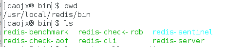
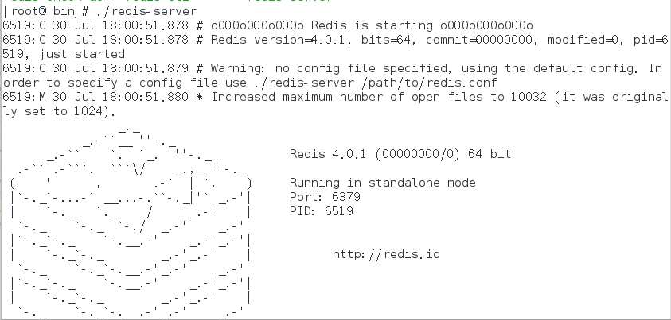
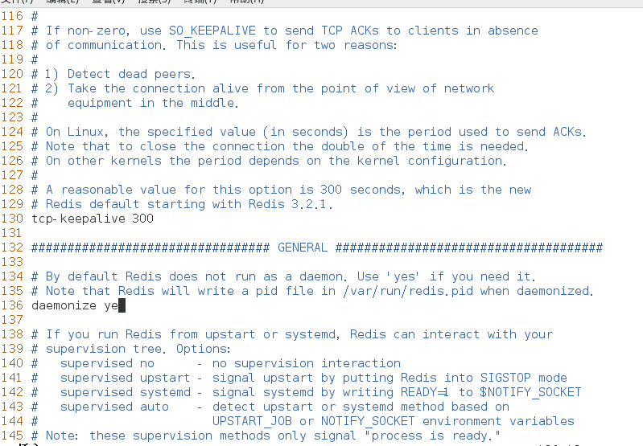
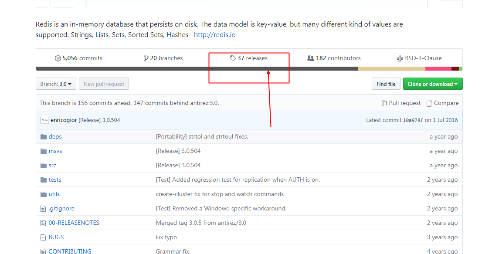
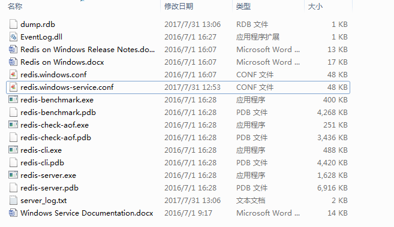
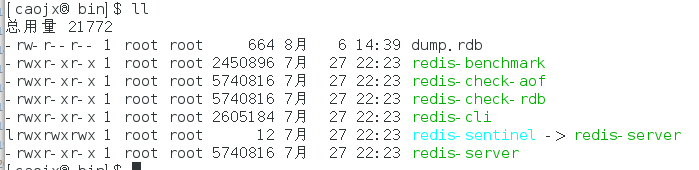
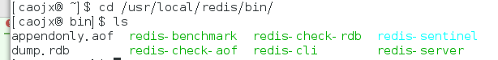

# Redis入门
***
主要介绍：
1. NoSQL的概述
2. Redis的概述
3. Redis的安装和使用
4. Jedis的入门
5. Redis的数据类型
6. Keys的特性
7. Redis的特性
8. Redis的持久化


## 一、NoSQL概述
什么是NoSQL？  
>NoSQL(Not Only SQL)，是一种非关系型数据库。
  
为什么需要使用NoSQL？
>随着互联网的发展，互联网经历了1.0和2.0两个阶段。1.0指的就是类似于新浪，网易早期的时候，
我们只能打开浏览器去浏览里边的新闻，不能进行相应的互动。进入到Web2.0的时候，我们可以进行
之间的互动，就像你的朋友圈，你的新浪微博，都可以互动，我们可以进行评论，点赞等。随着Web2.0
的兴起，非关系型数据库已经成为了一个热门的新的领域。非关系型数据库的发展也是非常迅速的，关系型
数据库在处理Web2.0这种网站的时候，特别时超大规模的网站的时候，和一些高并发的SNS类型的Web2.0动态
类型的网站的时候，已经力不从心，暴露出很多问题，比如：
高并发读写问题、海量数据的高效率存储和访问、高可扩展性和高可用性等问题

NoSQL相关产品    
  

NoSQL数据库的四大分类    
键值对（Key-Value）存储  （优点：快速查询。劣势：存储数据缺少结构化。例如：Redis）
列储存  （优点：查询速度快，扩展性强。劣势：功能相对局限。例如：HBase）
文档数据库  (优点：数据结构要求不是特别严格。劣势：查询性能不是特别的高,缺少统一查询语法。例如：mongoDB )
图形数据库  (优点：利用图结构的算法。劣势：需要对整个图作计算才能得出结果，不容易做分布式的集群方案。例如：GridInfo)

四类NoSQL数据库的比较  
  

NoSQL的特点  
总的来说，NoSQL有如下特点  
易扩展：去掉了关系型数据库中的关系，很容易扩展，数据只之间没有关系。  
灵活的数据类型：无需事先定义字段。  
大量数据，高性能：具有非常高的读写性能。  
高可用：NoSQL可以在不影响性能的情况下就可以很方便的事先一些高可用的框架。  

## 二、Redis概述
### 2.1Redis的由来
2008年意大利的一家创业公司推出的一款基于MySql的网站时时的统计系统，然后没过多久，公司的创始人对MySql的性能感觉非常失望，
于是为网站时时统计系统量身定做了一个数据库，与2009年开发完成。这个数据库就是Redis，不过创始人并不满足只将Redis用于这个
产品，而是希望能有更多的人一起使用他，于是在同一年他将Redis开源，然后开始和另一名Redis的代码主要贡献者一起进行Redis的开发
直到现在，创始人自己也没有想到在短短的几年时间，Redis就拥有了相当大的用户群体。之前在2012年在一个权威的网站上发布过一个
调查的情况，全球约有12%在使用Redis，国内的如新浪、知乎等，国外如GitHub、stackoverflow等。

### 2.2什么是Redis
Redis是用C语言开发的一个开源的高性能键值对的数据库，他通过提供多种键值的数据类型来适应不同场景下的存储需求，目前为止Redis
支持的数据类型有很多种比如说字符串类型、列表类型、有序集合类型、散列类型、集合类型等。官方还提供了对Redis的测试数据，
由50个并发程序来执行10万次请求，Redis读的速度每秒可以达到11万次，写的速度每秒能达到8万1千次，速度数据是相当惊人的。

### 2.3Redis的应用场景
缓存  
任务队列（秒杀，抢购）  
网站访问统计  
数据过期的处理（可以精确到毫秒）  
应用排行榜  
分布式的集群架构中的session分离  

## 三、Redis的安装
参考：https://redis.io/download
### 3.1Linux安装
安装
```shell
# yum install gcc-c++  
# wget http://download.redis.io/releases/redis-4.0.1.tar.gz  
# cp redis-4.0.1.tar.gz /usr/loca/src/
# tar -zxvf redis-4.0.1.tar.gz  
# cd redis-4.0.1  
# make  
# make PREFIX=/usr/local/redis install
```
安装完成后  
  

复制redis.conf配置文件到安装目录  
```shell
# cp /usr/local/src/redis-4.0.1/redis.conf /usr/local/redis/
```
启动redis  
```shell
# cd /usr/local/redis/
# ./redis-server
```
  

上边的这中方式所有前端启动，关闭命令终端后就redis也就关闭了，下边我们需要修改redis.conf
该为后端启动。  
将daemonize no修改为daemonize yes  
  

使用后端启动，注意要指定加载的配置文件redis.conf,不然启动方式依然是前端启动。  
```shell
[root@ bin]# ./redis-server ../redis.conf  --启动redis服务
7381:C 30 Jul 18:42:38.012 # oO0OoO0OoO0Oo Redis is starting oO0OoO0OoO0Oo
7381:C 30 Jul 18:42:38.012 # Redis version=4.0.1, bits=64, commit=00000000, modified=0, pid=7381, just started
7381:C 30 Jul 18:42:38.012 # Configuration loaded
[root@ bin]# ps -ef | grep -i redis  --查看是否启动
root      7382     1  0 18:42 ?        00:00:00 ./redis-server 127.0.0.1:6379 （默认端口6379）
root      7403  6226  0 18:43 pts/0    00:00:00 grep --color=auto -i redis
```
停止redis
```shell
[root@ bin]# ./redis-cli shutdown
[root@ bin]# ps -ef | grep -i redis
root      7964  6226  0 18:47 pts/0    00:00:00 grep --color=auto -i redis
```
简单使用redis
```shell
[root@ bin]# ./redis-server ../redis.conf 
8024:C 30 Jul 18:49:57.562 # oO0OoO0OoO0Oo Redis is starting oO0OoO0OoO0Oo
8024:C 30 Jul 18:49:57.562 # Redis version=4.0.1, bits=64, commit=00000000, modified=0, pid=8024, just started
8024:C 30 Jul 18:49:57.562 # Configuration loaded
[root@ bin]# ./redis-cli 
127.0.0.1:6379> ping
PONG
127.0.0.1:6379> set name redis
OK
127.0.0.1:6379> get name
"redis"
127.0.0.1:6379> keys n*
1) "name"
127.0.0.1:6379> keys *
1) "name"
127.0.0.1:6379> del name
(integer) 1
127.0.0.1:6379> 
```
### 3.2Windows安装
Redis官方是不支持Windows的，但是Microsoft Open Tech group 在 GitHub上开发了一个Win64的版本  
地址是https://github.com/MicrosoftArchive/redis，在 Release 页面中，有 msi 安装文件以及 .zip 文件。    
  

安装redis的msi安装文件  
  

  
启动redis   
```text 
redis-server.exe redis.windows.conf 
```
但是问题又来了，关闭cmd窗口就会关闭Redis，难道服务器上要一直开着吗？这显然是不科学的，下面看怎么在服务器上部署。    
redis部署  
其实Redis是可以安装成windows服务的，开机自启动，命令如下：  
```text
redis-server --service-install redis.windows.conf
```
报错   
```text
[4600] 31 Jul 13:36:49.181 # HandleServiceCommands: system error caught. error code=1073, message = CreateService failed: unknown error
```
原因：系统服务中已经存在    
解决办法：    
先卸载服务再安装：    
```text
redis-server --service-uninstall
```
然后在：    
```text
redis-server --service-install redis.windows.conf  
```
安装完之后，就可看到Redis已经作为windows服务了   
        

但是安装好之后，Redis并没有启动，启动命令如下：  
```text
redis-server --service-start
```
redis停止：  
```text
redis-server --service-stop
```
还可以安装多个实例  
```text
redis-server --service-install –service-name redisService1 –port 10001
redis-server --service-start –service-name redisService1
redis-server --service-install –service-name redisService2 –port 10002
redis-server --service-start –service-name redisService2
redis-server --service-install –service-name redisService3 –port 10003
redis-server --service-start –service-name redisService3
```
卸载命令：  
```text
redis-server --service-uninstall
```

## 四、Jedis入门

- Jedis是Redis官方首选的Java客户端开发包,Redis的各种语言客户端列表，请参见[Redis Client](https://redis.io/clients)。  
- [Jedis地址](https://github.com/xetorthio/jedis)

使用Jedis依赖的Jar包,引入Maven依赖
```xml
<dependency>
    <groupId>org.apache.commons</groupId>
    <artifactId>commons-pool2</artifactId>
    <version>2.4.2</version>
</dependency>
<dependency>
    <groupId>redis.clients</groupId>
    <artifactId>jedis</artifactId>
    <version>2.9.0</version>
    <type>jar</type>
    <scope>compile</scope>
</dependency>
```

JedisDemo.java Jedis简单使用测试
```java
package personal.caojx;

import org.junit.Test;
import redis.clients.jedis.Jedis;
import redis.clients.jedis.JedisPool;
import redis.clients.jedis.JedisPoolConfig;

/**
 * @ClassName: JedisDemo
 * @Description: Jedis的测试
 * @version: v1.0.0
 * @author: caojx
 * @date: 17-7-30 下午7:18
 */
public class JedisDemo {

    /**
     * 单实例的测试
     */
    @Test
    public void jedisTest(){
        //1.设置IP地址和端口
        Jedis jedis = new Jedis("127.0.0.1",6379);
        //2.保存数据
        jedis.set("name", "tom");
        //3.获取数据
        String name = jedis.get("name");
        System.out.println(name);
        //4.释放资源
        jedis.close();
    }

    /**
     * 连接池方式连接
     * 注意Jedis对象并不是线程安全的，在多线程下使用同一个Jedis对象会出现并发问题。
     * 为了避免每次使用Jedis对象时都需要重新构建，Jedis提供了JedisPool。
     * JedisPool是基于Commons Pool 2实现的一个线程安全的连接池。
     */
    @Test
    public void jedisPoolTest(){
        //1.获取连接池对象
        JedisPoolConfig config = new JedisPoolConfig();
        //2.设置对大连接数
        config.setMaxTotal(30);
        //3.设置最大空闲连接数
        config.setMaxIdle(10);
        //4.获得连接池
        JedisPool jedisPool = new JedisPool(config,"127.0.0.1",6379);

        //5获取核心对象
        Jedis jedis = null;
        try{
            //通过连接池获得连接
            jedis = jedisPool.getResource();
            //设置数据
            jedis.set("name","张三");
            //获取数据
            String name = jedis.get("name");
            System.out.println(name);
        }catch (Exception e){
            e.printStackTrace();
        }finally {
            //6.释放资源
            if(jedis!= null){
                jedis.close();
            }
            if(jedisPool != null){
                jedisPool.close();
            }
        }
    }
  }
```

## 五、Redis的数据结构
- 字符串(String)
- 字符串列表(list)
- 有序字符串集合(sorted set)
- 哈希(hash)
- 字符串集合(set)

### 5.1存储String
二进制安全的，存入和获取的数据相同  
Value最多可以容纳的数据长度是512M  

存储String常用命令
- 赋值
- 删除
- 扩展命令
- 取值

```text
set key value
[root@ bin]# ./redis-cli 
127.0.0.1:6379> set name tom  --设置值set key value
OK
127.0.0.1:6379> get name --取值get key
"tom"
127.0.0.1:6379> getset company baidu --先取值在设置值，nil表示没有取到值
(nil)
127.0.0.1:6379> get company
"baidu"
127.0.0.1:6379> del company --删除值 del key
(integer) 1
127.0.0.1:6379> get company
(nil)
127.0.0.1:6379> incr num --数值的自增，如果这个值原来不存在，先初始化为0再加1，注意自增的值必须可以转成整形，不能转成整形的值是不能使用incr的
(integer) 1
127.0.0.1:6379> get num
"1"
127.0.0.1:6379> incr num
"2"
127.0.0.1:6379> set company baidu
OK
127.0.0.1:6379> incr company --company不能转成整形，所以不能自增
(error) ERR value is not an integer or out of range
127.0.0.1:6379> decr num --数值的自减，如果值原来不存在，先初始化为0再减1，注意自减的值必须可以转成整形，否则会报错
(integer) 1
127.0.0.1:6379> get num
"1"
127.0.0.1:6379> decr num2
(integer) -1
127.0.0.1:6379> get num2
"-1"
127.0.0.1:6379> incrby num 5 --指定自增值，指定自增5
(integer) 6
127.0.0.1:6379> incrby num3 5 --指定自增值，如果这个值原来不存在，初始化为0再增加指定值，注意这个值必须可以转化成整形
(integer) 5
127.0.0.1:6379> decrby num3 3 --指定自减值，如果这个值原来不存在，初始化为0再减少指定值，注意这个值必须可以转化成整形
(integer) 2
127.0.0.1:6379> decrby num4 3
(integer) -3
127.0.0.1:6379> append num4 5 --字符串追加
(integer) 3
127.0.0.1:6379> get num4
"-35"
127.0.0.1:6379> append num5 123
(integer) 3
127.0.0.1:6379> get num5
"123"
```
### 5.2存储Hash
Redis中的hash可以看成具有String的key，String的value的map容器。这个容器非常是和存储值对象的信息，例如用户名、密码、年龄等。

- 存储Hash常用命令
  - 赋值
  - 删除
  - 取值
  - 增加数字

```text
127.0.0.1:6379> hset myhash username jack --设置hash值，容器名为myhash，你可以将myhash当成一个map容器或集合
(integer) 1
127.0.0.1:6379> hset myhash age 18
(integer) 1
127.0.0.1:6379> hmset myhash2 username rose age 21--批量设置hash值
OK
127.0.0.1:6379> hget myhash username --获取hash值
"jack"
127.0.0.1:6379> hget myhash age
"18"
127.0.0.1:6379> hmget myhash2 username age --批量获取hash值
1) "rose"
2) "21"
127.0.0.1:6379> hgetall myhash --或取所有的hash值
1) "username"
2) "jack"
3) "age"
4) "18"
127.0.0.1:6379> hdel mysh2 username age --删除hash值，不存在返回长度0
(integer) 0
127.0.0.1:6379> hgetall myhash2
1) "username"
2) "rose"
3) "age"
4) "21"
127.0.0.1:6379> hdel myhash2 username age
(integer) 2
127.0.0.1:6379> hmset myhash2 username rose age 21
OK
127.0.0.1:6379> hgetall myhash2
1) "username"
2) "rose"
3) "age"
4) "21"
127.0.0.1:6379> del myhash2 --删除整个hash，即删除增个容器
(integer) 1
127.0.0.1:6379> hget myhash2 username
(nil)
127.0.0.1:6379> hget myhash age --hash值自增
"18"
127.0.0.1:6379> hincrby myhash age 5
(integer) 23
127.0.0.1:6379> hget myhash age
"23"
127.0.0.1:6379> hexists myhash username --判断hash中的某个属性是否存在，存在返回>1的值，不存在返回0
(integer) 1
127.0.0.1:6379> hexists myhash password
(integer) 0
127.0.0.1:6379> hgetall myhash
1) "username"
2) "jack"
3) "age"
4) "23"
127.0.0.1:6379> hlen myhash --判断hash的大小
(integer) 2
127.0.0.1:6379> hkeys myhash --获取hash中的所有属性的key值
1) "username"
2) "age"
127.0.0.1:6379> hvals myhash --获取hash中的所有属性的值
1) "jack"
2) "23"
```

### 5.3 存储list
- ArrayList使用数组方式
- LinkedList使用双向连接方式
- 双向链表中增加数据
- 双向俩链表中删除数据

- 存储list的常用命令
  - 两端添加
  - 查看列表
  - 两端弹出
  - 获取列表元素个数
```text
127.0.0.1:6379> lpush mylist a b c --依次向左边插入元素 a b c
(integer) 3
127.0.0.1:6379> lpush mylist 1 2 3 --依次向左边插入元素 1 2 3
(integer) 6
127.0.0.1:6379> rpush mylist2 a b c --依次向右边插入元素 a b c
(integer) 3
127.0.0.1:6379> rpush mylist2 1 2 3 --依次向右边插入元素 1 2 3
(integer) 6
127.0.0.1:6379> lrange mylist 0 5 --查看list的中的元素lrange listKey start(开始索引0开始) stop(结束索引，如果是负数表示从最后开始取，-1表示最后一个元素，-2表示到数第二个，类推)
1) "3"
2) "2"
3) "1"
4) "c"
5) "b"
6) "a"
127.0.0.1:6379> lrange mylist2 0 -1
1) "a"
2) "b"
3) "c"
4) "1"
5) "2"
6) "3"
127.0.0.1:6379> lrange mylist2 0 -2
1) "a"
2) "b"
3) "c"
4) "1"
5) "2"
127.0.0.1:6379> lpop mylist  --弹出mylist左边的元素
"3"
127.0.0.1:6379> lrange mylist 0 -1
1) "2"
2) "1"
3) "c"
4) "b"
5) "a"
127.0.0.1:6379> rpop mylist --弹出mylist右边的元素
"a"
127.0.0.1:6379> lrange mylist 0 -1
1) "2"
2) "1"
3) "c"
4) "b"
127.0.0.1:6379> llen mylist --查看mylist的长度
(integer) 4
127.0.0.1:6379> lpushx mylist u --仅当mylist存在的时候，在左边插入元素u
(integer) 5
127.0.0.1:6379> lpushx mylist3 u --mylist不存在不会插入
(integer) 0
127.0.0.1:6379> rpushx mylist y --仅当mylist存在的时候，在右边插入元素y
(integer) 6
127.0.0.1:6379> lrange mylist 0 -1
1) "u"
2) "2"
3) "1"
4) "c"
5) "b"
6) "y"
127.0.0.1:6379> lpush mylist3 1 2 3
(integer) 3
127.0.0.1:6379> lpush mylist3 1 2 3
(integer) 6
127.0.0.1:6379> lpush mylist3 1 2 3
(integer) 9
127.0.0.1:6379> lrange mylist3 0 -1
1) "3"
2) "2"
3) "1"
4) "3"
5) "2"
6) "1"
7) "3"
8) "2"
9) "1"
127.0.0.1:6379> lrem mylist3 2 3  --lrem key count value 从左向右便利key依次删除2个值为3的元素
                                    如果：count > 0 从前往后删除count个值为value的元素
                                    如果：count < 0 从后往前删除count个值为value的元素
                                    如果: count = 0 删除所有值为value的元素
127.0.0.1:6379> lrange mylist3 0 -1
1) "2"
2) "1"
3) "2"
4) "1"
5) "3"
6) "2"
7) "1"
127.0.0.1:6379> lrem mylist3 0 2  --删除所有等于2的元素
(integer) 3
127.0.0.1:6379> lrange mylist3 0 -1
1) "1"
2) "1"
3) "3"
4) "1"
127.0.0.1:6379> lset mylist 3 mmm --在指定的索引为值插入元素
OK
127.0.0.1:6379> lrange mylist 0 -1
1) "u"
2) "2"
3) "1"
4) "mmm"
5) "b"
6) "y"
127.0.0.1:6379> linsert mylist4 before b 11 --在指定的元素之前插入元素,即在第一个b之前插入11
(integer) 7
127.0.0.1:6379> linsert mylist4 after b 11 --在指定的元素之后插入元素，即在第一个b之后插入11
(integer) 8
127.0.0.1:6379> lrange mylist4 0 -1
1) "c"
2) "11"
3) "b"
4) "11"
5) "a"
6) "c"
7) "b"
8) "a"
127.0.0.1:6379> lrange mylist5 0 -1
1) "3"
2) "2"
3) "1"
127.0.0.1:6379> lrange mylist6 0 -1
1) "c"
2) "b"
3) "a"
127.0.0.1:6379> rpoplpush mylist5 mylist6--rpoplpush source destination 将source中的元素弹出，push到destination中
"1"
127.0.0.1:6379> lrange mylist6 0 -1
1) "1"
2) "c"
3) "b"
4) "a"                 
```

### 5.4存储Set
Redis中可以将Set看成没有排序的字符集合，和List类型不同的是，Set集合中不允许出现重复的元素，
Set中可以包含的最大元素数量是4294967295个

- 存储Set的使用场景
 - 跟踪一些唯一性数据
 - 用于维护数据对象之间的关联关系

- 存储Set的常用命令
  - 添加/删除元素
  - 获得集合中的元素
  - 集合中的差集运算
  - 集合中的交集运算
  - 集合中的并集运算
  - 扩展命令

```text
127.0.0.1:6379> sadd myset a b c  --set中添加元素
(integer) 3
127.0.0.1:6379> sadd myset a  --set中不能添加重复的元素
(integer) 0
127.0.0.1:6379> sadd myset 1 2 3
(integer) 3
127.0.0.1:6379> srem myset 1 2 --set中删除元素
(integer) 2
127.0.0.1:6379> smembers myset --查看set中的所有元素
1) "c"
2) "b"
3) "3"
4) "a"
127.0.0.1:6379> scard myset --查看set的长度
(integer) 4
127.0.0.1:6379> sismember myset a --判断set中是否存在元素a，存在返回1，不存在返回0
(integer) 1
127.0.0.1:6379> sismember myset q
(integer) 0
127.0.0.1:6379> sadd mya1 a b c  
(integer) 3
127.0.0.1:6379> sadd myb1 a c 1 2
(integer) 4
127.0.0.1:6379> sdiff mya1 myb1 --set的差集运算，运算结果与key的顺序有关
1) "b"
127.0.0.1:6379> sdiff myb1 mya1
1) "1"
2) "2"
127.0.0.1:6379> sadd mya2 a b c
(integer) 3
127.0.0.1:6379> sadd myb2 a c 1 2
(integer) 4
127.0.0.1:6379> sinter mya2 myb2 --set的交集运算
1) "c"
2) "a"
127.0.0.1:6379> sadd mya3 a b c
(integer) 3
127.0.0.1:6379> sadd myb3 a c 1 2
(integer) 4
127.0.0.1:6379> sunion mya3 myb3 --set的并集运算，会去掉重复的元素
1) "a"
2) "c"
3) "b"
4) "2"
5) "1"
127.0.0.1:6379> srandmember myset --从set中随即取出一个元素
"c"
127.0.0.1:6379> sdiffstore my1 mya1 myb1 --将多个set集合的差值存放到my1集合上
(integer) 1
127.0.0.1:6379> smembers my1
1) "b"
127.0.0.1:6379> sinterstore my2 mya2 myb2 --将多个set集合的交集存放到my2集合上
(integer) 2
127.0.0.1:6379> smembers my2
1) "a"
2) "c"
127.0.0.1:6379> sunion mya3 myb3
1) "a"
2) "c"
3) "b"
4) "2"
5) "1"
127.0.0.1:6379> sunionstore my3 mya3 myb3 --将多个set集合的并集存放到my3上
(integer) 5
127.0.0.1:6379> smembers my3
1) "a"
2) "c"
3) "b"
4) "2"
5) "1" 
```

### 5.5存储Sorted-Set
- Sorted-Set和Set的区别
  1. Sorted-Set与Set很相似，都是存储字符串类型的集合，都不允许出现重复的元素在集合当中，
  2. Sorted-Set与Set的区别就是Sorted-Set中的每个元素都会有一个分数与之关联，那么Redis
  就会利用这个分数对Sorted-Set中的元素进行从小到大的排序，尽管Sorted-Set中的元素必须是
  唯一的，但是分数是可以重复的。
  3. Sorted-Set中的成员在集合中都是有序的
  
- 使用场景
  - 游戏的排名
  - 微博的热门话题
   
- 存储Sorted-Set常用命令
  - 添加元素
  - 获得元素
  - 删除元素
  - 范围查询
  - 扩展命令
```text
127.0.0.1:6379> zadd mysort 70 zs 80 ls 90 ww --添加元素，每个元素需要与一个分数对应
(integer) 3
127.0.0.1:6379> zadd mysort 100 zs --zs的分数会覆盖成为100，但是元素智能存在一个，所以返回0
(integer) 0
127.0.0.1:6379> zadd mysort 60 tom
(integer) 1
127.0.0.1:6379> zscore mysort zs --查看zs的分数
"100"
127.0.0.1:6379> zcard mysort  --查看Sorted-Set的大小
(integer) 4
127.0.0.1:6379> zrem mysort tom ww --删除tom和ww
(integer) 2
127.0.0.1:6379> zcard mysort
(integer) 2
127.0.0.1:6379> zadd mysort 85 jack 95 rose
(integer) 2
127.0.0.1:6379> zrange mysort 0 -1 --通过索引查看某个范围的值，0表示开始，-1表示结尾
1) "ls"
2) "jack"
3) "rose"
4) "zs"
127.0.0.1:6379> zrange mysort 0 -1 withscores --查看范围值同时显示分数，默认从小到大排序
1) "ls"
2) "80"
3) "jack"
4) "85"
5) "rose"
6) "95"
7) "zs"
8) "100"
127.0.0.1:6379> zrevrange mysort 0 -1 withscores --从大到小排序
1) "zs"
2) "100"
3) "rose"
4) "95"
5) "jack"
6) "85"
7) "ls"
8) "80"
127.0.0.1:6379> zremrangebyrank mysort 0 4 --按照范围进行删除
(integer) 4
127.0.0.1:6379> zadd mysort 80 zs 90 ls 100 ws
(integer) 3
127.0.0.1:6379> zremrangebyscore mysort 80 100 --按照分数范围排序
(integer) 3
127.0.0.1:6379> zrange mysort 0 -1
(empty list or set)
127.0.0.1:6379> zadd mysort 70 zs 80 li 90 ww
(integer) 3
127.0.0.1:6379> zrangebyscore mysort 0 100 withscores
1) "zs"
2) "70"
3) "li"
4) "80"
5) "ww"
6) "90"
127.0.0.1:6379> zrangebyscore mysort 0 100 withscores limit 0 2 --查看某个分数在某个范围的元素，并指定查看个数
1) "zs"
2) "70"
3) "li"
4) "80"
127.0.0.1:6379> zincrby mysort 3 li --某个元素的分数自增3
"83"
127.0.0.1:6379> zscore mysort li
"83"
127.0.0.1:6379> zcount mysort 80 90 --查看分数在某个范围内的个数
(integer) 2
```
## 六、Keys的通用操作

```text
127.0.0.1:6379> keys * --keys pattern 查看Redis中的key，可以使用通配符
 1) "myb2"
 2) "mylist4"
 3) "mya3"
 4) "mylist5"
 5) "mya2"
 6) "my2"
.....
 127.0.0.1:6379> del myb2 mylist4 mya3 --删除key
 (integer) 3
 127.0.0.1:6379> exists myb2 --判断key是否存在，0表示不存在，1表示存在
 (integer) 0
 127.0.0.1:6379> exists my2
 (integer) 1
127.0.0.1:6379> get company
"baidu"
127.0.0.1:6379> rename company newcompany --对key进行重命名
OK
127.0.0.1:6379> get company
(nil)
127.0.0.1:6379> get newcompany
"baidu"
127.0.0.1:6379> expire newcompany 1000 --设置key值过期的时间，单位是s(秒)
(integer) 1
127.0.0.1:6379> ttl newcompany --查看key值剩余的过期时间
(integer) 992
127.0.0.1:6379> type newcompany --查看key的类型
string
127.0.0.1:6379> type mylist
list
127.0.0.1:6379> type myset
set
127.0.0.1:6379> type myhash
hash
127.0.0.1:6379> type mysort
zset
127.0.0.1:6379> flushall --清空所有的key
```

## 七、Redis的特性

- 相关特性
  - 多数据库
  - 事物特性
  
- 多数据库  
一个Redis实例，可以包含多个数据库，一个客户端可以指定连接Redis实例的那个数据库。  
一个Redis实例，最多可提供16个数据库，下标是0～15，客户端默认连接的是第0号数据库，可以通过select选择具体连接那个数据库。  
```text
127.0.0.1:6379> select 1 --1号数据库没有任何key
OK
127.0.0.1:6379[1]> keys * 
(empty list or set)
127.0.0.1:6379[1]> select 0 --Redis默认连接0号数据库
OK
127.0.0.1:6379> keys *
 1) "name"
 2) "newcompany"
 3) "myb1"
 4) "num"
....
127.0.0.1:6379> move myset 1 --将key=myset移动到1号数据库
(integer) 1
127.0.0.1:6379> select 1
OK
127.0.0.1:6379[1]> keys *
1) "myset"
127.0.0.1:6379[1]> select 0
OK
127.0.0.1:6379> keys myset
(empty list or set)
```

--事物特性
Redis和其他众多的数据库一样，Redis也提供了事物的操作，在Redis中可以使用multi、exec、discard三个命令
来实现事物。Redis在事物中所有的命令都将顺序化，串行化执行，在事物进行期间，Redis不会为其他的客户端提供
任何的服务，从而保证事物中的所有命令都被原子化执行。和关系型数据库相比，如果Redis总某个命令执行失败，后边
的命令还会执行。其中multi相当与开启事物，在开启事物之后，没有提交之前，所有的操作都在这个事物中。exec相当
于提交事物，discard相当与事物会滚。如果在事物开启之前，如果客户端和服务器之间出现通讯故障，被导致网络断开，
那么他所执行的这些语句都将不会被提交。然而如果网络中断事件发生在执行exec之后的那么这个事物的所有命令都会被
服务器执行。

multi命令：相当于开启事物，执行该命令后会将multi之后的所有命令存放到一个队列中，待执行exec后才会将队列中的执行到服务器中
exec：提交事物，将队列中的命令执行到服务器中
discard：事物会滚

下边对三个命令进行演示，我们会开启两个命令窗口，都连接到0号数据库
窗口1：
```text
127.0.0.1:6379> select 0
OK
127.0.0.1:6379> get num
"1"
127.0.0.1:6379> incr num
(integer) 2
127.0.0.1:6379> get num
"2"
```
窗口2：
```text
127.0.0.1:6379> select 0
OK
127.0.0.1:6379> get num
"2"
```
上边可以看到，两个窗口的数据是一致的，下边我们开启事物

窗口1：
```text
127.0.0.1:6379> select 0
OK
127.0.0.1:6379> get num
"1"
127.0.0.1:6379> incr num
(integer) 2
127.0.0.1:6379> get num
"2"
127.0.0.1:6379> multi  --开启事物
OK
127.0.0.1:6379> incr num
QUEUED
```

窗口2：
```text
127.0.0.1:6379> select 0
OK
127.0.0.1:6379> get num
"2"
127.0.0.1:6379> get num --由于事物没有提交，依然是2
"2"
```
下边进行事物的提交
窗口1：
```text
127.0.0.1:6379> select 0
OK
127.0.0.1:6379> get num
"1"
127.0.0.1:6379> incr num
(integer) 2
127.0.0.1:6379> get num
"2"
127.0.0.1:6379> multi  --开启事物
OK
127.0.0.1:6379> incr num
QUEUED
127.0.0.1:6379> exec --提交事物
1) (integer) 3
2) "3"

```

窗口2：
```text
127.0.0.1:6379> select 0
OK
127.0.0.1:6379> get num
"2"
127.0.0.1:6379> get num --由于事物没有提交，依然是2
"2"
127.0.0.1:6379> get num --事物提交后，结果变成了3
"3"
```

事物的回滚演示
```text
127.0.0.1:6379> set user tom
OK
127.0.0.1:6379> get user
"tom"
127.0.0.1:6379> multi --开启事物
OK
127.0.0.1:6379> set user jerry
QUEUED
127.0.0.1:6379> discard --会滚事物
OK
127.0.0.1:6379> get user
"tom"
```

## 八、Redis持久化
Redis的高性能是由于他所有的数据都存放在内存中，那怎么能保证Redis在重启之后数据不丢失，那么就需要将数据
从内存中同步到我们的硬盘上，那么这个过程我们将之称为持久化操作，Redis的持久化有两种方式。
- RDB方式
- AOF方式

- 持久化使用方式
  - RDB持久化，Redis默认使用的方式，即在指定的时间内，将内存中的数据或快照写入到硬盘的文件中。
  - AOF持久化，这种机制将以日志的方式记录服务器处理的每一个操作，在Redis启动之初，他会读取该配置文件
  然后重新构建我们的数据库，这个的话来保证我们数据库中的数据是完整的。
  - 无持久话，我们可以通过配置来禁用Redis的持久化功能，这样我们就可以任务Redis就是一个缓存的功能
  - 同时使用RDB和AOF来进行持久化
  
### 8.1RDB方式持久化
优势：
如果使用这种方式，那么整个Redis数据库将会只包含一个文件，那么这对于我们文件备份而言是非常完美的。比如说你可能每个小时
归档一次最近24小时的数据，同时还要每天归档依次最近30天的数据，那么可以通过这样的策略，一旦系统出现灾难性的故障我们可以
非常容易进行数据恢复，即优势如下。
- 对于灾难的恢复对于我们而言是非常不错的选择，我们可以非常容易的将一个单独文件压缩后再将它转移到
其他的存储介质上。
- 性能最大化，对于Redis的服务进程而言，在开始进行持久化的时候，唯一需要做的就是分岔出一些进程，之后再由子进程完成这些持久化的操作，
这样就可以极大的避免服务器进行IO的操作。
- 相比AOF那种操作，如果数据集很大，RDB这种启动的效率会更高。
劣势：
- 如果想要保证数据的高可用性，最大限度的避免数据丢失，那么RDB将不是一个很好的选择，因为系统一般会在数据库持久化时间之前出现一些宕机的情况，
这就会出现Redis还没有来的及往硬盘上写，数据就丢失了。
- 由于RDB是通过Fork子进程的方式进行持久化，在数据量非常大的时候，可能会导致整个服务器停止几秒甚至几百毫秒情况

redis.conf配置：
```text
save 900 1  #   after 900 sec (15 min) if at least 1 key changed（每900秒即15分钟，至少由一个key发生改变往硬盘上写一次)
save 300 10 #   after 300 sec (5 min) if at least 10 keys changed(每300秒即5分钟，至少有10个key发生改变往硬盘上写一次）
save 60 10000 #   after 60 sec if at least 10000 keys changed（每60秒，至少由10000个key发生改变往硬盘上写一次）
.....
# The filename where to dump the DB
dbfilename dump.rdb --数据库RDB备份文件名

# The working directory.
#
# The DB will be written inside this directory, with the filename specified
# above using the 'dbfilename' configuration directive.
# The Append Only File will also be created inside this directory.
# Note that you must specify a directory here, not a file name.
dir ./  --数据库RDB文件的存放路径，默认是当前目录
```


### 8.2AOF持久化机制
优势：
- 这种方式可以带来更安全的持久化机制，Redis中提供了三种同步策略(每秒同步、每修改同步、不同步)
每秒同步：事实上每秒同步也是异步完成的，但是他的效率也是非常高的，所差的是一旦系统出现宕机的现象，那么这一秒中之内修改的数据就会出现丢失。
每修改同步：我们可以将其视为同步持久化，每一次数据发生变化都会被立即记录到磁盘当中，当然这种效率比较底，但是他是最安全的。
不同步：不持久化

- 由于这种机制对日志文件的写入操作采用的是append追加方式，所以即使出现宕机的情况也不会破坏日志文件里边原有的内容，然而如果我们只写入了
一半的数据就出现了系统崩溃问题，这种方式也不用当心，在Redis下一次启动之前我们可以通过redis -check -aof 这个工具来帮助我们解决数据一致性的问题

- 如果日志过大，Redis可以启动自动重写机制，那么Redis以append这个模式，不断将修改的数据写入到老的磁盘文件中，同时Redis还会创建一个新的文件用于记录
此期间来产生的那些修改命令被执行了，那么因此在进行重写切换的时候可以更好的取保证数据的安全性。

- AOF包含一个格式清晰，易于理解的文件，用于记录所有的修改操作，我们可以通过这个文件来完成数据的重建工作。

劣势：
- 对于我们一个相同数量的数据集而言，AOF文件要比RDB的文件要大一些
- 根据同步策略的不同，AOF在运行效率上往往会底与RDB

redis.conf配置：
```text
appendonly no #aof这个方式默认是关闭的，如果需要打开则需要将no修改为yes

# The name of the append only file (default: "appendonly.aof")

appendfilename "appendonly.aof" #aof日志文件存放路径

appendfsync always #同步策略，总是同步
# appendfsync everysec
# appendfsync no
```

重启Redis之后我们执行如下命令
```text
127.0.0.1:6379> set name jack
OK
127.0.0.1:6379> set num 10
OK
127.0.0.1:6379> set n1 10
OK
127.0.0.1:6379> set n2 10
OK
127.0.0.1:6379> keys *
1) "name"
2) "n1"
3) "num"
4) "n2"
127.0.0.1:6379> flushall --清空所有的key
OK
127.0.0.1:6379> keys *
(empty list or set)
```

关闭redis之后我们可以看到生成了appendonly.aof文件  

去掉appendonly.aof中最后一行,保存
```text
vim appendonly.aof

$2
10
*1
$8
flushall --去掉该行
```
重启redis之后，可以看到redis中的所有数据都恢复了
```text
[caojx@ bin]$ sudo ./redis-server ../redis.conf 
[caojx@ bin]$ ./redis-cli
127.0.0.1:6379> keys *
1) "name"
2) "n2"
3) "n1"
4) "num"
```

## 参考文章
- http://www.jianshu.com/p/7913f9984765
