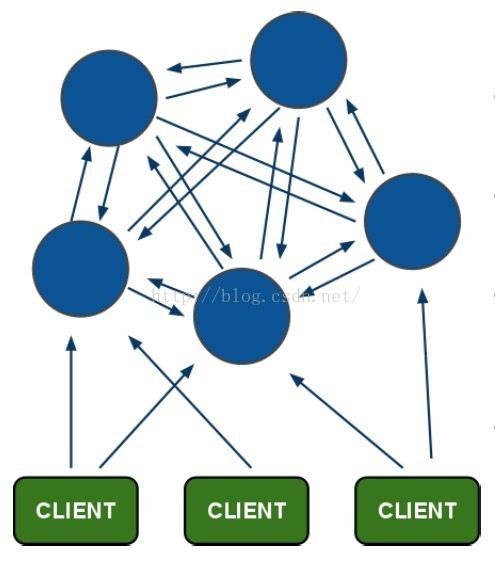

# Redis 集群

[TOC]

# 一、Redis集群简介

第一节原文来自：http://www.redis.cn/topics/cluster-tutorial.html

本文档是Redis集群的一般介绍，没有涉及复杂难懂的分布式概念的赘述，只是提供了从用户角度来如何搭建测试以及使用的方法，如果你打算使用并深入了解Redis集群，推荐阅读完本章节后,仔细阅读 [Redis 集群规范](http://www.redis.cn/topics/cluster-spec.html) 一章。

本教程试图提供最终用户一个简单的关于集群和一致性特征的描述

请注意，本教程使用于Redis3.0（包括3.0）以上版本

如果你计划部署集群，那么我们建议你从阅读这个文档开始。

## 1.1 Redis 集群介绍

Redis 集群是一个提供在**多个Redis间节点间共享数据**的程序集。

Redis集群并不支持处理多个keys的命令,因为这需要在不同的节点间移动数据,从而达不到像Redis那样的性能,在高负载的情况下可能会导致不可预料的错误.

Redis 集群通过分区来提供**一定程度的可用性**,在实际环境中当某个节点宕机或者不可达的情况下继续处理命令. Redis 集群的优势:

- 自动分割数据到不同的节点上。
- 整个集群的部分节点失败或者不可达的情况下能够继续处理命令。

## 1.2 Redis 集群的数据分片

Redis 集群没有使用一致性hash, 而是引入了 **哈希槽**的概念.

Redis 集群有16384个哈希槽,每个key通过CRC16校验后对16384取模来决定放置哪个槽.集群的每个节点负责一部分hash槽,举个例子,比如当前集群有3个节点,那么:

- 节点 A 包含 0 到 5500号哈希槽.
- 节点 B 包含5501 到 11000 号哈希槽.
- 节点 C 包含11001 到 16384号哈希槽.

这种结构很容易添加或者删除节点. 比如如果我想新添加个节点D, 我需要从节点 A, B, C中得部分槽到D上. 如果我想移除节点A,需要将A中的槽移到B和C节点上,然后将没有任何槽的A节点从集群中移除即可. 由于从一个节点将哈希槽移动到另一个节点并不会停止服务,所以无论添加删除或者改变某个节点的哈希槽的数量都不会造成集群不可用的状态.

## 1.3 Redis 集群的主从复制模型

为了使在部分节点失败或者大部分节点无法通信的情况下集群仍然可用，所以集群使用了主从复制模型,每个节点都会有N-1个复制品.

在我们例子中具有A，B，C三个节点的集群,在没有复制模型的情况下,如果节点B失败了，那么整个集群就会以为缺少5501-11000这个范围的槽而不可用.

然而如果在集群创建的时候（或者过一段时间）我们为每个节点添加一个从节点A1，B1，C1,那么整个集群便有三个master节点和三个slave节点组成，这样在节点B失败后，集群便会选举B1为新的主节点继续服务，整个集群便不会因为槽找不到而不可用了

不过当B和B1 都失败后，集群是不可用的.

## 1.4 Redis 一致性保证

Redis 并不能保证数据的**强一致性**. 这意味这在实际中集群在特定的条件下可能会丢失写操作.

第一个原因是因为集群是用了异步复制. 写操作过程:

- 客户端向主节点B写入一条命令.
- 主节点B向客户端回复命令状态.
- 主节点将写操作复制给他得从节点 B1, B2 和 B3.

主节点对命令的复制工作发生在返回命令回复之后， 因为如果每次处理命令请求都需要等待复制操作完成的话， 那么主节点处理命令请求的速度将极大地降低 —— 我们必须在性能和一致性之间做出权衡。 注意：Redis 集群可能会在将来提供同步写的方法。 Redis 集群另外一种可能会丢失命令的情况是集群出现了网络分区， 并且一个客户端与至少包括一个主节点在内的少数实例被孤立。

举个例子 假设集群包含 A 、 B 、 C 、 A1 、 B1 、 C1 六个节点， 其中 A 、B 、C 为主节点， A1 、B1 、C1 为A，B，C的从节点， 还有一个客户端 Z1 假设集群中发生网络分区，那么集群可能会分为两方，大部分的一方包含节点 A 、C 、A1 、B1 和 C1 ，小部分的一方则包含节点 B 和客户端 Z1 .

Z1仍然能够向主节点B中写入, 如果网络分区发生时间较短,那么集群将会继续正常运作,如果分区的时间足够让大部分的一方将B1选举为新的master，那么Z1写入B中得数据便丢失了.

注意， 在网络分裂出现期间， 客户端 Z1 可以向主节点 B 发送写命令的最大时间是有限制的， 这一时间限制称为节点超时时间（node timeout）， 是 Redis 集群的一个重要的配置选项：

# 二、Redis Cluster集群搭建

原文：https://www.cnblogs.com/yingchen/p/6763524.html

## 2.1 Redis Cluster 设计

[Redis](http://lib.csdn.net/base/redis)集群搭建的方式有多种，例如使用zookeeper等，但从redis 3.0之后版本支持redis-cluster集群，Redis-Cluster采用无中心结构，每个节点保存数据和整个集群状态,每个节点都和其他所有节点连接。其redis-cluster[架构](http://lib.csdn.net/base/architecture)图如下：

  

其结构特点：

1. 所有的redis节点彼此互联(PING-PONG机制),内部使用二进制协议优化传输速度和带宽。
2. 节点的fail是通过集群中超过半数的节点检测失效时才生效。
3. 客户端与redis节点直连,不需要中间proxy层.客户端不需要连接集群所有节点,连接集群中任何一个可用节点即可。
4. redis-cluster把所有的物理节点映射到[0-16383]slot上（不一定是平均分配）,cluster 负责维护node<->slot<->value。
5. Redis集群预分好16384个桶，当需要在 Redis 集群中放置一个 key-value 时，根据 CRC16(key) mod 16384的值，决定将一个key放到哪个桶中。


##2.2 Redis Cluster 节点分配

   现在我们是三个主节点分别是：A, B, C 三个节点，它们可以是一台机器上的三个端口，也可以是三台不同的服务器。那么，采用哈希槽 (hash slot)的方式来分配16384个slot 的话，它们三个节点分别承担的slot 区间是：
​      节点A覆盖0－5460;
​      节点B覆盖5461－10922;
​      节点C覆盖10923－16383.

**获取数据**：

​      如果存入一个值，按照redis cluster哈希槽的[算法](http://lib.csdn.net/base/datastructure)： CRC16('key')384 = 6782。 那么就会把这个key 的存储分配到 B 上了。同样，当我连接(A,B,C)任何一个节点想获取'key'这个key时，也会这样的算法，然后内部跳转到B节点上获取数据 


**新增一个主节点：**

​      新增一个节点D，redis cluster的这种做法是从各个节点的前面各拿取一部分slot到D上，我会在接下来的实践中实验。大致就会变成这样：

​    节点A覆盖1365-5460
​    节点B覆盖6827-10922
​    节点C覆盖12288-16383
​    节点D覆盖0-1364,5461-6826,10923-12287
​    同样删除一个节点也是类似，移动完成后就可以删除这个节点了。

## 2.3 Redis Cluster 主从模式

​	redis cluster 为了保证数据的高可用性，加入了主从模式，一个主节点对应一个或多个从节点，主节点提供数据存取，从节点则是从主节点拉取数据备份，当这个主节点挂掉后，就会有这个从节点选取一个来充当主节点，从而保证集群不会挂掉。

​	上面那个例子里, 集群有ABC三个主节点, 如果这3个节点都没有加入从节点，如果B挂掉了，我们就无法访问整个集群了。A和C的slot也无法访问。

​     	所以我们在集群建立的时候，一定要为每个主节点都添加了从节点, 比如像这样, 集群包含主节点A、B、C, 以及从节点A1、B1、C1, 那么即使B挂掉系统也可以继续正确工作。

​     	B1节点替代了B节点，所以Redis集群将会选择B1节点作为新的主节点，集群将会继续正确地提供服务。 当B重新开启后，它就会变成B1的从节点。

​	不过需要注意，如果节点B和B1同时挂了，Redis集群就无法继续正确地提供服务了。

## 2.4 Redis Cluster 集群的搭建

要让集群正常运作至少需要三个主节点，不过在刚开始试用集群功能时， 强烈建议使用六个节点： 其中三个为主节点， 而其余三个则是各个主节点的从节点。

### 1. 安装Redis节点指定端口

```shell
#mkdir redis-cluster/
#cd redis-cluster
#cp redis-4.0.8.tar.gz ../redis-cluster/
#ls
redis-4.0.8.tar.gz

#安装redis
#mkdir -p redis01 redis02 redis03 redis04 redis05 redis06 #创建6个redis目录
#tar -zxvf redis-4.0.8.tar.gz 
#make
#make install PREFIX=/home/caojx/redis-cluster #安装redis

#安装成功后将bin文件夹复制6份
#cp -rf bin ../redis01/
#cp -rf bin ../redis02/
#cp -rf bin ../redis03/
#cp -rf bin ../redis04/
#cp -rf bin ../redis05/
#cp -rf bin ../redis06/

#安装成功后配置redis-cluster下的redis.conf文件

#文件中的 cluster-enabled 选项用于开实例的集群模式， 而 cluster-conf-file 选项则设定了保存节点配置文#件的路径， 默认值为 nodes.conf节点配置文件无须人为修改， 它由 Redis 集群在启动时创建， 并在有需要时自动#进行更新。
	port 7001 #端从7001到70006
	cluster-enabled yes #开启集群
	cluster-config-file nodes.conf
	cluster-node-timeout 15000
	appendonly yes
	
# 复制六份配置文件，修改对应的端口号
#cp redis.conf ../redis01/
#cp redis.conf ../redis02/
#cp redis.conf ../redis03/
#cp redis.conf ../redis04/
#cp redis.conf ../redis05/
#cp redis.conf ../redis06/
```

创建启动start.all脚本，启动6个redis实例

```shell
#vi start-all.sh
cd /home/caojx/redis-cluster/redis01/bin
./redis-server ../redis.conf 
cd /home/caojx/redis-cluster/redis02/bin
./redis-server ../redis.conf 
cd /home/caojx/redis-cluster/redis03/bin
./redis-server ../redis.conf 
cd /home/caojx/redis-cluster/redis04/bin
./redis-server ../redis.conf 
cd /home/caojx/redis-cluster/redis05/bin
./redis-server ../redis.conf 
cd /home/caojx/redis-cluster/redis06/bin
./redis-server ../redis.conf 

#chmod +x start-all.sh
#./start-all.sh
#ps -ef | grep redis
# ps -ef | grep redis
caojx     16663      1  0 23:22 ?        00:00:01 ./redis-server *:7001 [cluster]
caojx     16788      1  0 23:24 ?        00:00:01 ./redis-server *:7002 [cluster]
caojx     16904      1  0 23:25 ?        00:00:00 ./redis-server *:7003 [cluster]
caojx     17710      1  0 23:41 ?        00:00:00 ./redis-server *:7004 [cluster]
caojx     17715      1  0 23:41 ?        00:00:00 ./redis-server *:7005 [cluster]
caojx     17720      1  0 23:41 ?        00:00:00 ./redis-server *:7006 [cluster]
caojx     17741   1117  0 23:41 pts/0    00:00:00 grep --color=auto redis
```

### 2. 搭建集群

现在我们已经有了六个正在运行中的 Redis 实例， 接下来我们需要使用这些实例来创建集群， 并为每个节点编写配置文件。

通过使用 Redis 集群命令行工具 redis-trib ， 编写节点配置文件的工作可以非常容易地完成： redis-trib 位于 Redis 源码的 src 文件夹中， 它是一个 Ruby 程序， 这个程序通过向实例发送特殊命令来完成创建新集群， 检查集群， 或者对集群进行重新分片（reshared）等工作。

1. **安装redis-trib所需的 ruby脚本**
  ​

  ```shell
  #复制redis解压文件src下的redis-trib.rb文件到redis-cluster目录
  #cp ~/redis-cluster/redis-4.0.8/src/redis-trib.rb ../

  # 安装ruby环境
  #yum install ruby  
  #yum install rubygems  

  #安装redis-trib.rb运行依赖的ruby的包redis
  #gem install redis
  ```

  如果gem install redis 安装出错可以参考 https://www.cnblogs.com/carryping/p/7447823.html，升级redis版本，再运行gem install redis 

2. **启动集群**


注意，启动集群前需要先启动6个redis实例，运行start-all.sh即可

```shell
./redis-trib.rb create --replicas 1 127.0.0.1:7001 127.0.0.1:7002 127.0.0.1:7003 127.0.0.1:7004 127.0.0.1:7005 127.0.0.1:7006 
```

这个命令在这里用于创建一个新的集群, 选项–replicas 1 表示我们希望为集群中的每个主节点创建一个从节点。

之后跟着的其他参数则是这个集群实例的地址列表,3个master3个slave redis-trib 会打印出一份预想中的配置给你看， 如果你觉得没问题的话， 就可以输入 yes ， redis-trib 就会将这份配置应用到集群当中,让各个节点开始互相通讯,最后可以得到如下信息：

```shell
[caojx@localhost redis-cluster]$ ./redis-trib.rb create --replicas 1 127.0.0.1:7001 127.0.0.1:7002 127.0.0.1:7003 127.0.0.1:7004 127.0.0.1:7005 127.0.0.1:7006
>>> Creating cluster
>>> Performing hash slots allocation on 6 nodes...
Using 3 masters:
127.0.0.1:7001
127.0.0.1:7002
127.0.0.1:7003
Adding replica 127.0.0.1:7005 to 127.0.0.1:7001
Adding replica 127.0.0.1:7006 to 127.0.0.1:7002
Adding replica 127.0.0.1:7004 to 127.0.0.1:7003
>>> Trying to optimize slaves allocation for anti-affinity
[WARNING] Some slaves are in the same host as their master
M: c1eaf4b0267674c95d78b6cf1c1d91f37bfd91ea 127.0.0.1:7001
   slots:0-5460 (5461 slots) master
M: 19615b40d6494564a729caa3b0c0995391df4ec3 127.0.0.1:7002
   slots:5461-10922 (5462 slots) master
M: 53626c1c77f210e57ac7c20181a689350a828d2a 127.0.0.1:7003
   slots:10923-16383 (5461 slots) master
S: d16f3f8adbdb809eb6871f49a0233bceef12118f 127.0.0.1:7004
   replicates 19615b40d6494564a729caa3b0c0995391df4ec3
S: 8526763d0ad16fa49d80a8694dfdadb25ca98eee 127.0.0.1:7005
   replicates 53626c1c77f210e57ac7c20181a689350a828d2a
S: a61ba9dfdc361915832fbd9e6a4d2109c16a40ef 127.0.0.1:7006
   replicates c1eaf4b0267674c95d78b6cf1c1d91f37bfd91ea
Can I set the above configuration? (type 'yes' to accept): yes
>>> Nodes configuration updated
>>> Assign a different config epoch to each node
>>> Sending CLUSTER MEET messages to join the cluster
Waiting for the cluster to join.....
>>> Performing Cluster Check (using node 127.0.0.1:7001)
M: c1eaf4b0267674c95d78b6cf1c1d91f37bfd91ea 127.0.0.1:7001
   slots:0-5460 (5461 slots) master
   1 additional replica(s)
M: 53626c1c77f210e57ac7c20181a689350a828d2a 127.0.0.1:7003
   slots:10923-16383 (5461 slots) master
   1 additional replica(s)
M: 19615b40d6494564a729caa3b0c0995391df4ec3 127.0.0.1:7002
   slots:5461-10922 (5462 slots) master
   1 additional replica(s)
S: a61ba9dfdc361915832fbd9e6a4d2109c16a40ef 127.0.0.1:7006
   slots: (0 slots) slave
   replicates c1eaf4b0267674c95d78b6cf1c1d91f37bfd91ea
S: d16f3f8adbdb809eb6871f49a0233bceef12118f 127.0.0.1:7004
   slots: (0 slots) slave
   replicates 19615b40d6494564a729caa3b0c0995391df4ec3
S: 8526763d0ad16fa49d80a8694dfdadb25ca98eee 127.0.0.1:7005
   slots: (0 slots) slave
   replicates 53626c1c77f210e57ac7c20181a689350a828d2a
[OK] All nodes agree about slots configuration.
>>> Check for open slots...
>>> Check slots coverage...
[OK] All 16384 slots covered.
```

上面显示创建成功，有3个主节点，3个从节点，每个节点都是成功连接状态。


3个主节点[M]以及分配的哈希卡槽如下

```shell
M: c1eaf4b0267674c95d78b6cf1c1d91f37bfd91ea 127.0.0.1:7001
   slots:0-5460 (5461 slots) master
M: 19615b40d6494564a729caa3b0c0995391df4ec3 127.0.0.1:7002
   slots:5461-10922 (5462 slots) master
M: 53626c1c77f210e57ac7c20181a689350a828d2a 127.0.0.1:7003
   slots:10923-16383 (5461 slots) master

```


3个从节点[S]以及附属的主节点如下

```shell
S: d16f3f8adbdb809eb6871f49a0233bceef12118f 127.0.0.1:7004
   replicates 19615b40d6494564a729caa3b0c0995391df4ec3
S: 8526763d0ad16fa49d80a8694dfdadb25ca98eee 127.0.0.1:7005
   replicates 53626c1c77f210e57ac7c20181a689350a828d2a
S: a61ba9dfdc361915832fbd9e6a4d2109c16a40ef 127.0.0.1:7006
   replicates c1eaf4b0267674c95d78b6cf1c1d91f37bfd91ea
```


以上集群安装成功了，如果安装未成功报如下错误

```shell
>>> Creating cluster
[ERR] Sorry, can't connect to node  ....
```


### 3. 安装集群出错常见问题

参考:http://blog.csdn.net/ownfire/article/details/46624005

1. 集群搭建报错如下

```shell
/home/caojx/.rvm/gems/ruby-2.3.3/gems/redis-4.0.1/lib/redis/client.rb:119:in `call': ERR Slot 0 is already busy (Redis::CommandError)
	from /home/caojx/.rvm/gems/ruby-2.3.3/gems/redis-4.0.1/lib/redis.rb:2764:in `block in method_missing'
	from /home/caojx/.rvm/gems/ruby-2.3.3/gems/redis-4.0.1/lib/redis.rb:45:in `block in synchronize'
	from /home/caojx/.rvm/rubies/ruby-2.3.3/lib/ruby/2.3.0/monitor.rb:214:in `mon_synchronize'
	from /home/caojx/.rvm/gems/ruby-2.3.3/gems/redis-4.0.1/lib/redis.rb:45:in `synchronize'
	from /home/caojx/.rvm/gems/ruby-2.3.3/gems/redis-4.0.1/lib/redis.rb:2763:in `method_missing'
	from ./redis-trib.rb:212:in `flush_node_config'
	from ./redis-trib.rb:906:in `block in flush_nodes_config'
	from ./redis-trib.rb:905:in `each'
	from ./redis-trib.rb:905:in `flush_nodes_config'
	from ./redis-trib.rb:1426:in `create_cluster_cmd'
	from ./redis-trib.rb:1830:in `<main>'
```

​	经检查，这是由于上一次配置集群失败时留下的配置信息导致的。 只要把redis.conf中定义的 cluster-config-file 所在的文件删除，重新启动redis-server及运行redis-trib即可。

2. 创建集群时一直处于"Waiting for the cluster to join...................................."的状态

   这个问题原因不知,但解决方法是在redis.conf文件中把bind 127.0.0.1本地环回口改为物理接口.

3. 安装ruby redis时长时间没响应

   这是由于天朝网络,解决办法是改ruby源(请自行baidu)或手动安装

# 三、Redis Cluster集群的测试

###   3.1 测试存取值

​         客户端连接集群redis-cli需要带上 -c ，redis-cli -c -p 端口号

```shell
[caojx@localhost bin]$ ./redis-cli -c -p 7001 
127.0.0.1:7001> set name tom
-> Redirected to slot [5798] located at 127.0.0.1:7002
OK
127.0.0.1:7002> get name
"tom"
127.0.0.1:7002>   
```

​         根据redis-cluster的key值分配，name应该分配到节点7002[5461-10922]上，上面显示redis cluster自动从7001跳转到了7002节点。

​       我们可以测试一下7006从节点获取name值

```shell
[caojx@localhost bin]$ ./redis-cli -c -p 7006
127.0.0.1:7006> get name
-> Redirected to slot [5798] located at 127.0.0.1:7002
"tom"
127.0.0.1:7002> 
```

7006位7003的从节点，从上面也是自动跳转至7002获取值，这也是redis cluster的特点，它是去中心化，每个节点都是对等的，连接哪个节点都可以获取和设置数据。

###3.2 集群节点选举

 现在模拟将7002节点挂掉，按照redis-cluster原理会选举会将 7002的从节点7005选举为主节点。

```shell
[caojx@localhost redis-cluster]$ ps -ef | grep redis
caojx      1908      1  0 01:54 ?        00:00:00 ./redis-server *:7001 [cluster]
caojx      1910      1  0 01:54 ?        00:00:00 ./redis-server *:7002 [cluster]
caojx      1915      1  0 01:54 ?        00:00:00 ./redis-server *:7003 [cluster]
caojx      1920      1  0 01:54 ?        00:00:00 ./redis-server *:7004 [cluster]
caojx      1925      1  0 01:54 ?        00:00:00 ./redis-server *:7005 [cluster]
caojx      1927      1  0 01:54 ?        00:00:00 ./redis-server *:7006 [cluster]
caojx      2609   2314  0 02:04 pts/1    00:00:00 grep --color=auto redis
[caojx@localhost redis-cluster]$ kill -9 1910
```

查看集群中的7002节点

```shell
[caojx@localhost redis-cluster]$ ./redis-trib.rb check 127.0.0.1:7002
[ERR] Sorry, can't connect to node 127.0.0.1:7002
[caojx@localhost redis-cluster]$ ./redis-trib.rb check 127.0.0.1:7004
>>> Performing Cluster Check (using node 127.0.0.1:7004)
M: d16f3f8adbdb809eb6871f49a0233bceef12118f 127.0.0.1:7004
   slots:5461-10922 (5462 slots) master
   0 additional replica(s)
M: 53626c1c77f210e57ac7c20181a689350a828d2a 127.0.0.1:7003
   slots:10923-16383 (5461 slots) master
   1 additional replica(s)
S: 8526763d0ad16fa49d80a8694dfdadb25ca98eee 127.0.0.1:7005
   slots: (0 slots) slave
   replicates 53626c1c77f210e57ac7c20181a689350a828d2a
S: a61ba9dfdc361915832fbd9e6a4d2109c16a40ef 127.0.0.1:7006
   slots: (0 slots) slave
   replicates c1eaf4b0267674c95d78b6cf1c1d91f37bfd91ea
M: c1eaf4b0267674c95d78b6cf1c1d91f37bfd91ea 127.0.0.1:7001
   slots:0-5460 (5461 slots) master
   1 additional replica(s)
[OK] All nodes agree about slots configuration.
>>> Check for open slots...
>>> Check slots coverage...
[OK] All 16384 slots covered.
[caojx@localhost redis-cluster]$ 
```

可以看到集群连接不了7002节点，而7004有原来的S转换为M节点，代替了原来的7002节点


现在我们将7002节点恢复，看是否会自动加入集群中以及充当的M还是S节点。

```shell
[caojx@localhost redis-cluster]$ cd redis02/bin
[caojx@localhost bin]$ ./redis-server ../redis.conf 
```

check一下7002节点，查看时master还是slave

```shell
[caojx@localhost redis-cluster]$ ./redis-trib.rb check 127.0.0.1:7002
>>> Performing Cluster Check (using node 127.0.0.1:7002)
S: 19615b40d6494564a729caa3b0c0995391df4ec3 127.0.0.1:7002
   slots: (0 slots) slave
   replicates d16f3f8adbdb809eb6871f49a0233bceef12118f
S: a61ba9dfdc361915832fbd9e6a4d2109c16a40ef 127.0.0.1:7006
   slots: (0 slots) slave
   replicates c1eaf4b0267674c95d78b6cf1c1d91f37bfd91ea
M: c1eaf4b0267674c95d78b6cf1c1d91f37bfd91ea 127.0.0.1:7001
   slots:0-5460 (5461 slots) master
   1 additional replica(s)
S: 8526763d0ad16fa49d80a8694dfdadb25ca98eee 127.0.0.1:7005
   slots: (0 slots) slave
   replicates 53626c1c77f210e57ac7c20181a689350a828d2a
M: d16f3f8adbdb809eb6871f49a0233bceef12118f 127.0.0.1:7004
   slots:5461-10922 (5462 slots) master
   1 additional replica(s)
M: 53626c1c77f210e57ac7c20181a689350a828d2a 127.0.0.1:7003
   slots:10923-16383 (5461 slots) master
   1 additional replica(s)
[OK] All nodes agree about slots configuration.
>>> Check for open slots...
>>> Check slots coverage...
[OK] All 16384 slots covered.
```

可以看到7002节点变成了 7004的从节点。


参考：

http://www.redis.cn/topics/cluster-tutorial.html

https://www.cnblogs.com/yingchen/p/6763524.html

 https://www.cnblogs.com/carryping/p/7447823.html

http://blog.csdn.net/ownfire/article/details/46624005