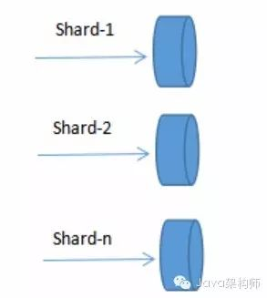

# Redis集群方案

[TOC]

Redis集群方案应该怎么做？ - 知乎

知乎原文：https://www.zhihu.com/question/21419897/answer/89771396

作者：[小钢蹦儿](https://www.zhihu.com/people/yang-shuai-83-7) [编辑于 2017-06-12](https://www.zhihu.com/question/21419897/answer/89771396)

## 1. 为什么集群？

通常，为了提高网站响应速度，总是把热点数据保存在内存中而不是直接从后端数据库中读取。Redis是一个很好的Cache工具。大型网站应用，热点数据量往往巨大，几十G上百G是很正常的事儿，在这种情况下，如何正确架构Redis呢？

首先，无论我们是使用自己的物理主机，还是使用云服务主机，内存资源往往是有限制的，scale up不是一个好办法，我们需要scale out横向可伸缩扩展，这需要由多台主机协同提供服务，即分布式多个Redis实例协同运行。

其次，目前硬件资源成本降低，多核CPU，几十G内存的主机很普遍，对于主进程是单线程工作的Redis，只运行一个实例就显得有些浪费。同时，管理一个巨大内存不如管理相对较小的内存高效。因此，实际使用中，通常一台机器上同时跑多个Redis实例。

**集群方案**

## 2. Redis官方集群方案 Redis Cluster

Redis Cluster是一种服务器Sharding技术，3.0版本开始正式提供。

Redis Cluster中，Sharding采用slot(槽)的概念，一共分成16384个槽，这有点儿类pre sharding思路。对于每个进入Redis的键值对，根据key进行散列，分配到这16384个slot中的某一个中。使用的hash算法也比较简单，就是CRC16后16384取模。

Redis集群中的每个node(节点)负责分摊这16384个slot中的一部分，也就是说，每个slot都对应一个node负责处理。当动态添加或减少node节点时，需要将16384个槽做个再分配，槽中的键值也要迁移。当然，这一过程，在目前实现中，还处于半自动状态，需要人工介入。

Redis集群，要保证16384个槽对应的node都正常工作，如果某个node发生故障，那它负责的slots也就失效，整个集群将不能工作。

为了增加集群的可访问性，官方推荐的方案是将node配置成主从结构，即一个master主节点，挂n个slave从节点。这时，如果主节点失效，Redis Cluster会根据选举算法从slave节点中选择一个上升为主节点，整个集群继续对外提供服务。这非常类似前篇文章提到的Redis Sharding场景下服务器节点通过Sentinel监控架构成主从结构，只是Redis Cluster本身提供了故障转移容错的能力。

Redis Cluster的新节点识别能力、故障判断及故障转移能力是通过集群中的每个node都在和其它nodes进行通信，这被称为集群总线(cluster bus)。它们使用特殊的端口号，即对外服务端口号加10000。例如如果某个node的端口号是6379，那么它与其它nodes通信的端口号是16379。nodes之间的通信采用特殊的二进制协议。

对客户端来说，整个cluster被看做是一个整体，客户端可以连接任意一个node进行操作，就像操作单一Redis实例一样，当客户端操作的key没有分配到该node上时，Redis会返回转向指令，指向正确的node，这有点儿像浏览器页面的302 redirect跳转。

**Redis Cluster是Redis 3.0以后才正式推出，时间较晚，目前能证明在大规模生产环境下成功的案例还不是很多，需要时间检验。**

## 3. Redis Sharding集群

Redis 3正式推出了官方集群技术，解决了多Redis实例协同服务问题。Redis Cluster可以说是服务端Sharding分片技术的体现，即将键值按照一定算法合理分配到各个实例分片上，同时各个实例节点协调沟通，共同对外承担一致服务。

多Redis实例服务，比单Redis实例要复杂的多，这涉及到定位、协同、容错、扩容等技术难题。这里，我们介绍一种轻量级的客户端Redis Sharding技术。

Redis Sharding可以说是Redis Cluster出来之前，业界普遍使用的多Redis实例集群方法。其主要思想是采用哈希算法将Redis数据的key进行散列，通过hash函数，特定的key会映射到特定的Redis节点上。这样，客户端就知道该向哪个Redis节点操作数据。Sharding架构如图：

  

庆幸的是，java redis客户端驱动jedis，已支持Redis Sharding功能，即ShardedJedis以及结合缓存池的ShardedJedisPool。

Jedis的Redis Sharding实现具有如下特点：

1. 采用一致性哈希算法(consistent hashing)，将key和节点name同时hashing，然后进行映射匹配，采用的算法是MURMUR_HASH。采用一致性哈希而不是采用简单类似哈希求模映射的主要原因是当增加或减少节点时，不会产生由于重新匹配造成的rehashing。一致性哈希只影响相邻节点key分配，影响量小。
2. 为了避免一致性哈希只影响相邻节点造成节点分配压力，ShardedJedis会对每个Redis节点根据名字(没有，Jedis会赋予缺省名字)会虚拟化出160个虚拟节点进行散列。根据权重weight，也可虚拟化出160倍数的虚拟节点。用虚拟节点做映射匹配，可以在增加或减少Redis节点时，key在各Redis节点移动再分配更均匀，而不是只有相邻节点受影响。
3. ShardedJedis支持keyTagPattern模式，即抽取key的一部分keyTag做sharding，这样通过合理命名key，可以将一组相关联的key放入同一个Redis节点，这在避免跨节点访问相关数据时很重要。

> **扩容问题**

Redis Sharding采用客户端Sharding方式，服务端Redis还是一个个相对独立的Redis实例节点，没有做任何变动。同时，我们也不需要增加额外的中间处理组件，这是一种非常轻量、灵活的Redis多实例集群方法。

当然，Redis Sharding这种轻量灵活方式必然在集群其它能力方面做出妥协。比如扩容，当想要增加Redis节点时，尽管采用一致性哈希，毕竟还是会有key匹配不到而丢失，这时需要键值迁移。

作为轻量级客户端sharding，处理Redis键值迁移是不现实的，这就要求应用层面允许Redis中数据丢失或从后端数据库重新加载数据。但有些时候，击穿缓存层，直接访问数据库层，会对系统访问造成很大压力。有没有其它手段改善这种情况？

Redis作者给出了一个比较讨巧的办法--presharding，即预先根据系统规模尽量部署好多个Redis实例，这些实例占用系统资源很小，一台物理机可部署多个，让他们都参与sharding，当需要扩容时，选中一个实例作为主节点，新加入的Redis节点作为从节点进行数据复制。数据同步后，修改sharding配置，让指向原实例的Shard指向新机器上扩容后的Redis节点，同时调整新Redis节点为主节点，原实例可不再使用。

presharding是预先分配好足够的分片，扩容时只是将属于某一分片的原Redis实例替换成新的容量更大的Redis实例。参与sharding的分片没有改变，所以也就不存在key值从一个区转移到另一个分片区的现象，只是将属于同分片区的键值从原Redis实例同步到新Redis实例。 并不是只有增删Redis节点引起键值丢失问题，更大的障碍来自Redis节点突然宕机。在《Redis持久化》一文中已提到，为不影响Redis性能，尽量不开启AOF和RDB文件保存功能，可架构Redis主备模式，主Redis宕机，数据不会丢失，备Redis留有备份。

这样，我们的架构模式变成一个Redis节点切片包含一个主Redis和一个备Redis。在主Redis宕机时，备Redis接管过来，上升为主Redis，继续提供服务。主备共同组成一个Redis节点，通过自动故障转移，保证了节点的高可用性。则Sharding架构演变成： Redis Sentinel提供了主备模式下Redis监控、故障转移功能达到系统的高可用性。

高访问量下，即使采用Sharding分片，一个单独节点还是承担了很大的访问压力，这时我们还需要进一步分解。通常情况下，应用访问Redis读操作量和写操作量差异很大，读常常是写的数倍，这时我们可以将读写分离，而且读提供更多的实例数。

可以利用主从模式实现读写分离，主负责写，从负责只读，同时一主挂多个从。在Sentinel监控下，还可以保障节点故障的自动监测。

## 4. 利用代理中间件实现大规模Redis集群

上面分别介绍了多Redis服务器集群的两种方式，它们是基于客户端sharding的Redis Sharding和基于服务端sharding的Redis Cluster。

客户端sharding技术其优势在于服务端的Redis实例彼此独立，相互无关联，每个Redis实例像单服务器一样运行，非常容易线性扩展，系统的灵活性很强。其不足之处在于：

1. 由于sharding处理放到客户端，规模进步扩大时给运维带来挑战。
2. 服务端Redis实例群拓扑结构有变化时，每个客户端都需要更新调整。
3. 连接不能共享，当应用规模增大时，资源浪费制约优化。

服务端sharding的Redis Cluster其优势在于服务端Redis集群拓扑结构变化时，客户端不需要感知，客户端像使用单Redis服务器一样使用Redis集群，运维管理也比较方便。

不过Redis Cluster正式版推出时间不长，系统稳定性、性能等都需要时间检验，尤其在大规模使用场合。

能不能结合二者优势？即能使服务端各实例彼此独立，支持线性可伸缩，同时sharding又能集中处理，方便统一管理？本篇介绍的Redis代理中间件twemproxy就是这样一种利用中间件做sharding的技术。

twemproxy处于客户端和服务器的中间，将客户端发来的请求，进行一定的处理后(如sharding)，再转发给后端真正的Redis服务器。也就是说，客户端不直接访问Redis服务器，而是通过twemproxy代理中间件间接访问。

参照Redis Sharding架构，增加代理中间件的Redis集群架构如下：

twemproxy中间件的内部处理是无状态的，它本身可以很轻松地集群，这样可避免单点压力或故障。

twemproxy又叫nutcracker，起源于twitter系统中redis/memcached集群开发实践，运行效果良好，后代码奉献给开源社区。其轻量高效，采用C语言开发，工程网址是：[GitHub - twitter/twemproxy: A fast, light-weight proxy for memcached and redis](https://link.zhihu.com/?target=https%3A//github.com/twitter/twemproxy)

twemproxy后端不仅支持redis，同时也支持memcached，这是twitter系统具体环境造成的。

由于使用了中间件，twemproxy可以通过共享与后端系统的连接，降低客户端直接连接后端服务器的连接数量。同时，它也提供sharding功能，支持后端服务器集群水平扩展。统一运维管理也带来了方便。

当然，也是由于使用了中间件代理，相比客户端直连服务器方式，性能上会有所损耗，实测结果大约降低了20%左右。