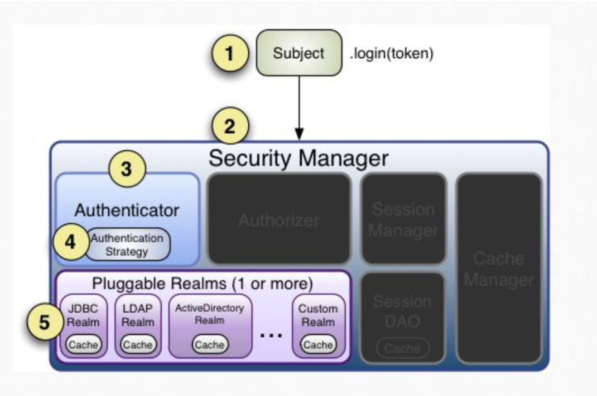
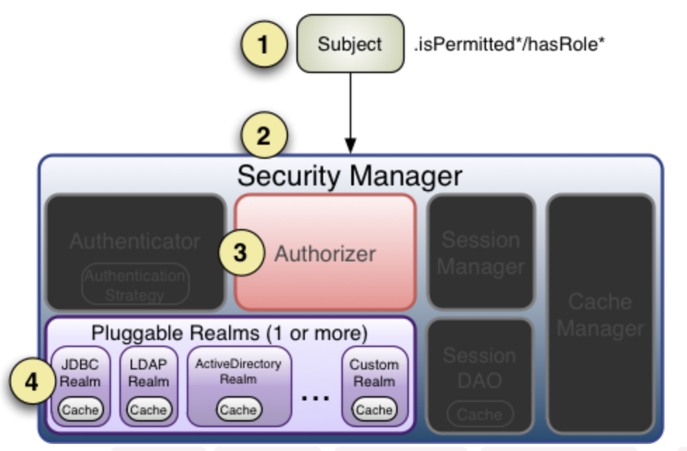
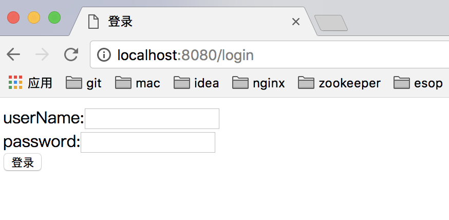
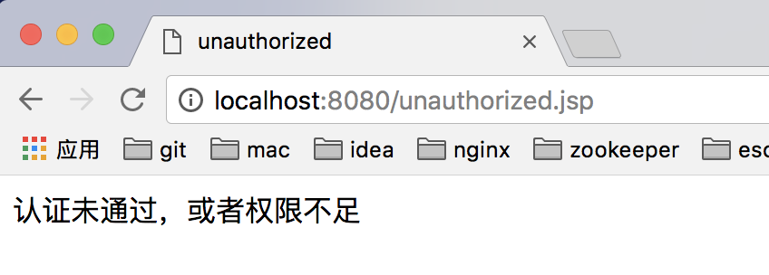
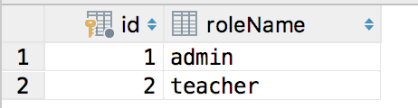
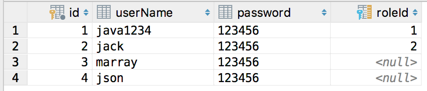
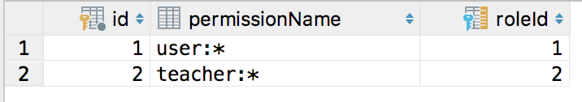
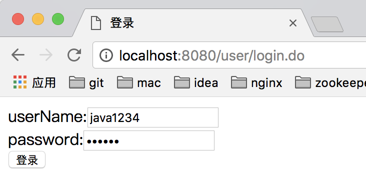
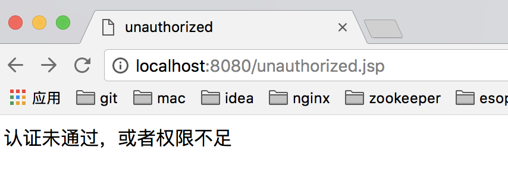

# shiro安全框架入门

[TOC]

学习源码：https://github.com/caojx-git/learn/tree/master/code/shiro-java

​		   https://github.com/caojx-git/learn/tree/master/code/shiro-spring

shiro官网：http://shiro.apache.org/

shiro官方文档：http://shiro.apache.org/reference.html

提示：本文章只了解基本使用

Apache Shiro是一个强大且易用的Java安全框架,执行身份验证、授权、密码学和会话管理。使用Shiro的易于理解的API,您可以快速、轻松地获得任何应用程序,从最小的移动应用程序到最大的网络和企业应用程序。

**主要功能**

三个核心组件：Subject, SecurityManager 和 Realms.

1、Subject ：当前用户的操作  
2、SecurityManager：用于管理所有的Subject  
3、Realms：用于进行权限信息的验证  

**Subject：**即“当前操作用户”。但是，在Shiro中，Subject这一概念并不仅仅指人，也可以是第三方进程、后台帐户（Daemon Account）或其他类似事物。它仅仅意味着“当前跟软件交互的东西”。但考虑到大多数目的和用途，你可以把它认为是Shiro的“用户”概念。
　　Subject代表了当前用户的安全操作，SecurityManager则管理所有用户的安全操作。
**SecurityManager：**它是Shiro框架的核心，典型的Facade模式，Shiro通过SecurityManager来管理内部组件实例，并通过它来提供安全管理的各种服务。
**Realm：** Realm充当了Shiro与应用安全数据间的“桥梁”或者“连接器”。也就是说，当对用户执行认证（登录）和授权（访问控制）验证时，Shiro会从应用配置的Realm中查找用户及其权限信息。
　　从这个意义上讲，Realm实质上是一个安全相关的DAO：它封装了数据源的连接细节，并在需要时将相关数据提供给Shiro。当配置Shiro时，你必须至少指定一个Realm，用于认证和（或）授权。配置多个Realm是可以的，但是至少需要一个。
　　Shiro内置了可以连接大量安全数据源（又名目录）的Realm，如LDAP、关系数据库（JDBC）、类似INI的文本配置资源以及属性文件等。如果缺省的Realm不能满足需求，你还可以插入代表自定义数据源的自己的Realm实现。


## 一、Shiro HelloWorld

### 1.1 shiro.ini配置文件

ini配置中主要配置有四大类：main，users，roles，urls

```ini
[main]  
#提供了对根对象 securityManager 及其依赖的配置  
securityManager=org.apache.shiro.mgt.DefaultSecurityManager  
…………  
securityManager.realms=$jdbcRealm  
  
[users]  
#提供了对用户/密码及其角色的配置，用户名=密码，角色 1，角色 2  
username=password,role1,role2  
  
  
[roles]  
#提供了角色及权限之间关系的配置，角色=权限 1，权限 2  
role1=permission1,permission2  
  
  
[urls]  
#用于 web，提供了对 web url 拦截相关的配置，url=拦截器[参数]，拦截器  
/index.html = anon  
/admin/** = authc, roles[admin], perms["permission1"]  
```

shiro.ini

```ini
#用户组
#用户名=密码
[users]
tom=12345
jack=12345
```

### 1.2 maven依赖

```xml
<!-- https://mvnrepository.com/artifact/org.apache.shiro/shiro-core -->
<dependency>
    <groupId>org.apache.shiro</groupId>
    <artifactId>shiro-core</artifactId>
    <version>1.4.0</version>
</dependency>

<!-- https://mvnrepository.com/artifact/commons-logging/commons-logging -->
<dependency>
    <groupId>commons-logging</groupId>
    <artifactId>commons-logging</artifactId>
    <version>1.2</version>
</dependency>

<!-- https://mvnrepository.com/artifact/org.slf4j/slf4j-log4j12 -->
<dependency>
    <groupId>org.slf4j</groupId>
    <artifactId>slf4j-log4j12</artifactId>
    <version>1.7.25</version>
</dependency>
```

### 1.3 log4j.properties

```properties
log4j.rootLogger=INFO, stdout

log4j.appender.stdout=org.apache.log4j.ConsoleAppender
log4j.appender.stdout.layout=org.apache.log4j.PatternLayout
log4j.appender.stdout.layout.ConversionPattern=%d %p [%c] - %m %n

# General Apache libraries
log4j.logger.org.apache=WARN

# Spring
log4j.logger.org.springframework=WARN

# Default Shiro logging
log4j.logger.org.apache.shiro=TRACE

# Disable verbose logging
log4j.logger.org.apache.shiro.util.ThreadContext=WARN
log4j.logger.org.apache.shiro.cache.ehcache.EhCache=WARN
```

### 1.4 HelloWorld.java

```java
import org.apache.shiro.SecurityUtils;
import org.apache.shiro.authc.AuthenticationException;
import org.apache.shiro.authc.UsernamePasswordToken;
import org.apache.shiro.config.IniSecurityManagerFactory;
import org.apache.shiro.mgt.SecurityManager;
import org.apache.shiro.subject.Subject;
import org.apache.shiro.util.Factory;

/**
 * @author caojx
 * Created on 2018/2/18 下午10:17
 */
public class HelloWorld {

    public static void main(String[] args) {
        //1.读取配置文件，初始化SecurityManager工厂
        Factory<SecurityManager> factory = new IniSecurityManagerFactory("classpath:shiro.ini");
        //2.获取SecurityManager实例
        SecurityManager securityManager = factory.getInstance();
        //把SecurityManager实例绑定到SecurityUtils
        SecurityUtils.setSecurityManager(securityManager);

        //得到当前执行的用户
        Subject currentUser = SecurityUtils.getSubject();
        //创建token令牌， 用户名/密码
        UsernamePasswordToken token = new UsernamePasswordToken("tom","12345");

        try{
            //身份认证
            currentUser.login(token);
            System.out.println("身份认证成功");
        }catch (AuthenticationException e){
            System.out.println("身份认证失败");
            e.printStackTrace();
        }

        currentUser.logout();
    }
}
```


结果：

```txt
2018-02-18 22:53:37,763 DEBUG [org.apache.shiro.io.ResourceUtils] - Opening resource from class path [shiro.ini] 
2018-02-18 22:53:37,797 DEBUG [org.apache.shiro.config.Ini] - Parsing [users] 
2018-02-18 22:53:37,798 TRACE [org.apache.shiro.config.Ini] - Discovered key/value pair: tom = 12345 
2018-02-18 22:53:37,798 TRACE [org.apache.shiro.config.Ini] - Discovered key/value pair: jack = 12345 
2018-02-18 22:53:37,898 TRACE [org.apache.shiro.util.ClassUtils] - Unable to load clazz named [org.apache.commons.configuration2.interpol.ConfigurationInterpolator] from class loader [sun.misc.Launcher$AppClassLoader@18b4aac2] 
2018-02-18 22:53:37,898 TRACE [org.apache.shiro.util.ClassUtils] - Unable to load class named [org.apache.commons.configuration2.interpol.ConfigurationInterpolator] from the thread context ClassLoader.  Trying the current ClassLoader... 
2018-02-18 22:53:37,899 TRACE [org.apache.shiro.util.ClassUtils] - Unable to load clazz named [org.apache.commons.configuration2.interpol.ConfigurationInterpolator] from class loader [sun.misc.Launcher$AppClassLoader@18b4aac2] 
2018-02-18 22:53:37,899 TRACE [org.apache.shiro.util.ClassUtils] - Unable to load class named [org.apache.commons.configuration2.interpol.ConfigurationInterpolator] from the current ClassLoader.  Trying the system/application ClassLoader... 
2018-02-18 22:53:37,900 TRACE [org.apache.shiro.util.ClassUtils] - Unable to load clazz named [org.apache.commons.configuration2.interpol.ConfigurationInterpolator] from class loader [sun.misc.Launcher$AppClassLoader@18b4aac2] 
2018-02-18 22:53:37,910 DEBUG [org.apache.shiro.config.IniFactorySupport] - Creating instance from Ini [sections=users] 
2018-02-18 22:53:37,911 TRACE [org.apache.shiro.config.Ini] - Specified name was null or empty.  Defaulting to the default section (name = "") 
2018-02-18 22:53:37,950 DEBUG [org.apache.shiro.realm.text.IniRealm] - Discovered the [users] section.  Processing... 
2018-02-18 22:53:37,957 TRACE [org.apache.shiro.mgt.DefaultSecurityManager] - Context already contains a SecurityManager instance.  Returning. 
2018-02-18 22:53:37,957 TRACE [org.apache.shiro.mgt.DefaultSecurityManager] - No identity (PrincipalCollection) found in the context.  Looking for a remembered identity. 
2018-02-18 22:53:37,957 TRACE [org.apache.shiro.mgt.DefaultSecurityManager] - No remembered identity found.  Returning original context. 
2018-02-18 22:53:37,960 TRACE [org.apache.shiro.subject.support.DelegatingSubject] - attempting to get session; create = false; session is null = true; session has id = false 
2018-02-18 22:53:37,960 TRACE [org.apache.shiro.subject.support.DelegatingSubject] - attempting to get session; create = false; session is null = true; session has id = false 
2018-02-18 22:53:37,960 TRACE [org.apache.shiro.subject.support.DelegatingSubject] - attempting to get session; create = false; session is null = true; session has id = false 
2018-02-18 22:53:37,960 TRACE [org.apache.shiro.subject.support.DelegatingSubject] - attempting to get session; create = false; session is null = true; session has id = false 
2018-02-18 22:53:37,960 TRACE [org.apache.shiro.subject.support.DelegatingSubject] - attempting to get session; create = false; session is null = true; session has id = false 
2018-02-18 22:53:37,960 TRACE [org.apache.shiro.subject.support.DelegatingSubject] - attempting to get session; create = false; session is null = true; session has id = false 
2018-02-18 22:53:37,960 TRACE [org.apache.shiro.authc.AbstractAuthenticator] - Authentication attempt received for token [org.apache.shiro.authc.UsernamePasswordToken - tom, rememberMe=false] 
2018-02-18 22:53:37,961 DEBUG [org.apache.shiro.realm.AuthenticatingRealm] - Looked up AuthenticationInfo [tom] from doGetAuthenticationInfo 
2018-02-18 22:53:37,961 DEBUG [org.apache.shiro.realm.AuthenticatingRealm] - AuthenticationInfo caching is disabled for info [tom].  Submitted token: [org.apache.shiro.authc.UsernamePasswordToken - tom, rememberMe=false]. 
2018-02-18 22:53:37,961 DEBUG [org.apache.shiro.authc.credential.SimpleCredentialsMatcher] - Performing credentials equality check for tokenCredentials of type [[C and accountCredentials of type [java.lang.String] 
2018-02-18 22:53:37,961 DEBUG [org.apache.shiro.authc.credential.SimpleCredentialsMatcher] - Both credentials arguments can be easily converted to byte arrays.  Performing array equals comparison 
2018-02-18 22:53:37,962 DEBUG [org.apache.shiro.authc.AbstractAuthenticator] - Authentication successful for token [org.apache.shiro.authc.UsernamePasswordToken - tom, rememberMe=false].  Returned account [tom] 
2018-02-18 22:53:37,962 DEBUG [org.apache.shiro.subject.support.DefaultSubjectContext] - No SecurityManager available in subject context map.  Falling back to SecurityUtils.getSecurityManager() lookup. 
2018-02-18 22:53:37,962 TRACE [org.apache.shiro.mgt.DefaultSecurityManager] - Context already contains a SecurityManager instance.  Returning. 
2018-02-18 22:53:37,962 TRACE [org.apache.shiro.subject.support.DelegatingSubject] - attempting to get session; create = false; session is null = true; session has id = false 
2018-02-18 22:53:37,962 DEBUG [org.apache.shiro.subject.support.DefaultSubjectContext] - No SecurityManager available in subject context map.  Falling back to SecurityUtils.getSecurityManager() lookup. 
2018-02-18 22:53:37,962 TRACE [org.apache.shiro.subject.support.DelegatingSubject] - attempting to get session; create = false; session is null = true; session has id = false 
2018-02-18 22:53:37,962 TRACE [org.apache.shiro.subject.support.DelegatingSubject] - attempting to get session; create = false; session is null = true; session has id = false 
2018-02-18 22:53:37,962 TRACE [org.apache.shiro.subject.support.DelegatingSubject] - attempting to get session; create = false; session is null = true; session has id = false 
2018-02-18 22:53:37,962 TRACE [org.apache.shiro.subject.support.DelegatingSubject] - attempting to get session; create = false; session is null = true; session has id = false 
2018-02-18 22:53:37,962 TRACE [org.apache.shiro.subject.support.DelegatingSubject] - attempting to get session; create = false; session is null = true; session has id = false 
2018-02-18 22:53:37,962 TRACE [org.apache.shiro.subject.support.DelegatingSubject] - attempting to get session; create = false; session is null = true; session has id = false 
2018-02-18 22:53:37,962 TRACE [org.apache.shiro.subject.support.DelegatingSubject] - attempting to get session; create = true; session is null = true; session has id = false 
2018-02-18 22:53:37,962 TRACE [org.apache.shiro.subject.support.DelegatingSubject] - Starting session for host null 
2018-02-18 22:53:37,963 DEBUG [org.apache.shiro.session.mgt.AbstractValidatingSessionManager] - No sessionValidationScheduler set.  Attempting to create default instance. 
2018-02-18 22:53:37,964 TRACE [org.apache.shiro.session.mgt.AbstractValidatingSessionManager] - Created default SessionValidationScheduler instance of type [org.apache.shiro.session.mgt.ExecutorServiceSessionValidationScheduler]. 
2018-02-18 22:53:37,964 INFO [org.apache.shiro.session.mgt.AbstractValidatingSessionManager] - Enabling session validation scheduler... 
2018-02-18 22:53:37,972 TRACE [org.apache.shiro.session.mgt.DefaultSessionManager] - Creating session for host null 
2018-02-18 22:53:37,972 DEBUG [org.apache.shiro.session.mgt.DefaultSessionManager] - Creating new EIS record for new session instance [org.apache.shiro.session.mgt.SimpleSession,id=null] 
2018-02-18 22:53:37,986 TRACE [org.apache.shiro.session.mgt.AbstractValidatingSessionManager] - Attempting to retrieve session with key org.apache.shiro.session.mgt.DefaultSessionKey@6108b2d7 
2018-02-18 22:53:37,986 TRACE [org.apache.shiro.subject.support.DelegatingSubject] - attempting to get session; create = false; session is null = false; session has id = true 
2018-02-18 22:53:37,987 TRACE [org.apache.shiro.session.mgt.AbstractValidatingSessionManager] - Attempting to retrieve session with key org.apache.shiro.session.mgt.DefaultSessionKey@6108b2d7 
2018-02-18 22:53:37,987 TRACE [org.apache.shiro.session.mgt.AbstractValidatingSessionManager] - Attempting to retrieve session with key org.apache.shiro.session.mgt.DefaultSessionKey@6108b2d7 
2018-02-18 22:53:37,987 TRACE [org.apache.shiro.mgt.DefaultSecurityManager] - This org.apache.shiro.mgt.DefaultSecurityManager instance does not have a [org.apache.shiro.mgt.RememberMeManager] instance configured.  RememberMe services will not be performed for account [tom]. 
2018-02-18 22:53:37,987 TRACE [org.apache.shiro.subject.support.DelegatingSubject] - attempting to get session; create = false; session is null = false; session has id = true 
身份认证成功
2018-02-18 22:53:37,987 TRACE [org.apache.shiro.subject.support.DelegatingSubject] - attempting to get session; create = false; session is null = false; session has id = true 
2018-02-18 22:53:37,987 TRACE [org.apache.shiro.session.mgt.AbstractValidatingSessionManager] - Attempting to retrieve session with key org.apache.shiro.session.mgt.DefaultSessionKey@6108b2d7 
2018-02-18 22:53:37,987 TRACE [org.apache.shiro.subject.support.DelegatingSubject] - attempting to get session; create = false; session is null = false; session has id = true 
2018-02-18 22:53:37,987 TRACE [org.apache.shiro.session.mgt.AbstractValidatingSessionManager] - Attempting to retrieve session with key org.apache.shiro.session.mgt.DefaultSessionKey@6108b2d7 
2018-02-18 22:53:37,987 DEBUG [org.apache.shiro.mgt.DefaultSecurityManager] - Logging out subject with primary principal tom 
2018-02-18 22:53:37,988 TRACE [org.apache.shiro.realm.CachingRealm] - Cleared cache entries for account with principals [tom] 
2018-02-18 22:53:37,988 TRACE [org.apache.shiro.subject.support.DelegatingSubject] - attempting to get session; create = false; session is null = false; session has id = true 
2018-02-18 22:53:37,988 TRACE [org.apache.shiro.session.mgt.AbstractValidatingSessionManager] - Attempting to retrieve session with key org.apache.shiro.session.mgt.DefaultSessionKey@6108b2d7 
2018-02-18 22:53:37,988 TRACE [org.apache.shiro.session.mgt.AbstractValidatingSessionManager] - Attempting to retrieve session with key org.apache.shiro.session.mgt.DefaultSessionKey@6108b2d7 
2018-02-18 22:53:37,988 TRACE [org.apache.shiro.subject.support.DelegatingSubject] - attempting to get session; create = false; session is null = false; session has id = true 
2018-02-18 22:53:37,988 TRACE [org.apache.shiro.session.mgt.AbstractValidatingSessionManager] - Attempting to retrieve session with key org.apache.shiro.session.mgt.DefaultSessionKey@6108b2d7 
2018-02-18 22:53:37,988 DEBUG [org.apache.shiro.session.mgt.AbstractSessionManager] - Stopping session with id [b413cd13-c270-4bbe-91b5-3a7d7af16587] 

```

## 二、身份认证

### 2.1 Subject 认证主体

Subject 认证主体包含两个信息:
Principals:身份，可以是用户名，邮件，手机号码等等，用来标识一个登录主体身份;
Credentials:凭证，常见有密码，数字证书等等;

### 2.2 身份认证流程

http://shiro.apache.org/authentication.html#authentication-sequence

  

推荐：

http://shiro.apache.org/authentication.html

http://blog.csdn.net/daybreak1209/article/details/51193855

### 2.3 Realm&JDBC Reaml

Realm充当了Shiro与应用安全数据间的“桥梁”或者“连接器”。也就是说，当对用户执行认证（登录）和授权（访问控制）验证时，Shiro会从应用配置的Realm中查找用户及其权限信息。

Realm:意思是域，Shiro 从 Realm 中获取验证数据;

Realm 有很多种类，例如常见的 jdbc realm，jndi realm，text realm。

### 2.4 JDBC Reaml 案例演示

1. 创建数据库db_shiro

   ```mysql
   create database db_shiro charset utf8;
   ```

2. 创建表users

   注意，表名必须为users，结构必须如下，因为shiro需要读取该表中的数据。

   ```mysql
   CREATE TABLE `users` (
     `id` int(11) NOT NULL AUTO_INCREMENT,
     `userName` varchar(20) DEFAULT NULL,
     `password` varchar(20) DEFAULT NULL,
     PRIMARY KEY (`id`)
   ) ENGINE=InnoDB AUTO_INCREMENT=2 DEFAULT CHARSET=utf8;
   ```

3. 插入用户

   ```mysql
   insert  into `users`(`id`,`userName`,`password`) values (1,'java1234','123456');
   ```

4. pom.xml配置

   ```xml
   <project xmlns="http://maven.apache.org/POM/4.0.0" xmlns:xsi="http://www.w3.org/2001/XMLSchema-instance"
            xsi:schemaLocation="http://maven.apache.org/POM/4.0.0 http://maven.apache.org/maven-v4_0_0.xsd">
       <modelVersion>4.0.0</modelVersion>
       <groupId>caojx.learn</groupId>
       <artifactId>shiro-java</artifactId>
       <packaging>war</packaging>
       <version>1.0-SNAPSHOT</version>
       <name>shiro-java Maven Webapp</name>
       <url>http://maven.apache.org</url>
       <dependencies>
           <dependency>
               <groupId>junit</groupId>
               <artifactId>junit</artifactId>
               <version>4.12</version>
               <scope>compile</scope>
           </dependency>

           <!-- https://mvnrepository.com/artifact/org.apache.shiro/shiro-core -->
           <dependency>
               <groupId>org.apache.shiro</groupId>
               <artifactId>shiro-core</artifactId>
               <version>1.4.0</version>
           </dependency>

           <!-- https://mvnrepository.com/artifact/commons-logging/commons-logging -->
           <dependency>
               <groupId>commons-logging</groupId>
               <artifactId>commons-logging</artifactId>
               <version>1.2</version>
           </dependency>

           <!-- https://mvnrepository.com/artifact/org.slf4j/slf4j-log4j12 -->
           <dependency>
               <groupId>org.slf4j</groupId>
               <artifactId>slf4j-log4j12</artifactId>
               <version>1.7.25</version>
           </dependency>

           <!-- https://mvnrepository.com/artifact/c3p0/c3p0 -->
           <dependency>
               <groupId>c3p0</groupId>
               <artifactId>c3p0</artifactId>
               <version>0.9.1.2</version>
           </dependency>

           <!-- https://mvnrepository.com/artifact/org.mariadb.jdbc/mariadb-java-client -->
           <dependency>
               <groupId>org.mariadb.jdbc</groupId>
               <artifactId>mariadb-java-client</artifactId>
               <version>2.2.0</version>
           </dependency>

       </dependencies>
       <build>
           <finalName>shiro-java</finalName>
       </build>
   </project>
   ```

   5. jdbc_realm.ini

   ```ini
   #代码配置
   [main]
   #jdbcRealm实例
   jdbcRealm=org.apache.shiro.realm.jdbc.JdbcRealm
   #数据源实例配置
   dataSource=com.mchange.v2.c3p0.ComboPooledDataSource
   dataSource.driverClass=org.mariadb.jdbc.Driver
   dataSource.jdbcUrl=jdbc:mariadb://192.168.46.131:3306/db_shiro
   dataSource.user=root
   dataSource.password=root
   #shiro引用数据源和jdbcRealm
   jdbcRealm.dataSource=$dataSource
   securityManager.realms=$jdbcRealm
   ```

   6. JdbcRealmTest.java

   ```java
   package jdbcRealm;

   import org.apache.shiro.SecurityUtils;
   import org.apache.shiro.authc.AuthenticationException;
   import org.apache.shiro.authc.UsernamePasswordToken;
   import org.apache.shiro.config.IniSecurityManagerFactory;
   import org.apache.shiro.mgt.SecurityManager;
   import org.apache.shiro.subject.Subject;
   import org.apache.shiro.util.Factory;

   /**
    * @author caojx
    * Created on 2018/2/20 下午9:31
    */
   public class JdbcRealmTest {

       public static void main(String[] args) {
           //1.读取配置文件，初始化SecurityManager工厂,引用jdbc_realm.ini
           Factory<SecurityManager> factory = new IniSecurityManagerFactory("classpath:jdbc_realm.ini");
           //2.获取SecurityManager实例
           SecurityManager securityManager = factory.getInstance();
           //把SecurityManager实例绑定到SecurityUtils
           SecurityUtils.setSecurityManager(securityManager);

           //得到当前执行的用户
           Subject currentUser = SecurityUtils.getSubject();
           //创建token令牌， 用户名/密码
           UsernamePasswordToken token = new UsernamePasswordToken("java1234","123456");
           try{
               //身份认证
               currentUser.login(token);
               System.out.println("身份认证成功");
           }catch (AuthenticationException e){
               System.out.println("身份认证失败");
               e.printStackTrace();
           }
           currentUser.logout();
       }
   }
   ```

## 三、权限认证(授权)

### 3.1 权限认证核心要素

权限认证，也就是访问控制，即在应用中控制谁能访问哪些资源。 

在权限认证中，最核心的三个要素是:权限，角色和用户; 

**权限**，即操作资源的权利，比如访问某个页面，以及对某个模块的数据的添加，修改，删除，查看的权利;   
**角色**，是权限的集合，一中角色可以包含多种权限;  
**用户**，在 Shiro 中，代表访问系统的用户，即 Subject;  

### 3.2 授权
- 编程式授权（本节讲解）
  - 基于角色的访问控制
  - 基于权限的访问控制

- 注解式授权（后边整合spring讲解）

  http://shiro.apache.org/authorization.html#Authorization-AnnotationbasedAuthorization

  - @RequiresAuthentication 要求当前 Subject 已经在当前的 session 中被验证通过才能被访问或调用。
  - @RequiresGuest 要求当前的 Subject 是一个"guest"，也就是说，他们必须是在之前的 session 中没有被验证或被记住才 能被访问或调用。
  - @RequiresPermissions("account:create") 要求当前的 Subject 被允许一个或多个权限，以便执行注解的方法。 
  - @RequiresRoles("administrator") 要求当前的 Subject 拥有所有指定的角色。如果他们没有，则该方法将不会被执行，而 且 AuthorizationException 异常将会被抛出。
  - @RequiresUser RequiresUser 注解需要当前的 Subject 是一个应用程序用户才能被注解的类/实例/方法访问或调用。一个“应 用程序用户”被定义为一个拥有已知身份，或在当前 session 中由于通过验证被确认，或者在之前 session 中的'RememberMe' 服务被记住。

- Jsp 标签授权（后边讲解）

  http://shiro.apache.org/web.html#Web-taglibrary

  <%@ taglib prefix="shiro" uri="http://shiro.apache.org/tags" %>

  - Guest 标签:用户没有身份验证时显示相应信息，即游客访问信息;
  - User 标签:用户已经身份验证/记住我登录后显示相应的信息;
  - Authenticated 标签:用户已经身份验证通过，即 Subject.login 登录成功，不是记住我登录的。 
  - notAuthenticated 标签:用户没有身份验证通过，即没有调用 Subject.login 进行登录，包括记住我自动登录 的也属于未进行身份验证。
  - principal 标签 显示用户身份信息，默认调用 Subject.getPrincipal()获取，即 Primary Principal。 hasRole标签 如果当前Subject有角色将显示body体内容。
  - lacksRole标签 如果当前Subject没有角色将显示body体内容。
  - hasAnyRoles 标签 如果当前 Subject 有任意一个角色(或的关系)将显示 body 体内容。
  - hasPermission 标签 如果当前 Subject 有权限将显示 body 体内容。
  - lacksPermission 标签 如果当前 Subject 没有权限将显示 body 体内容。


下边了解编程式授权

1. 基于角色的访问控制

**shiro_role.ini**

```ini
#基于角色的访问控制

#配置用户和角色
[users]
#用户名=密码，角色1，角色2，。。。
java1234=123456,role1,role2
jack=123456,role1
```

**ShiroUtil.java**

```java
package authorization;

import org.apache.shiro.SecurityUtils;
import org.apache.shiro.authc.AuthenticationException;
import org.apache.shiro.authc.UsernamePasswordToken;
import org.apache.shiro.config.IniSecurityManagerFactory;
import org.apache.shiro.mgt.SecurityManager;
import org.apache.shiro.subject.Subject;
import org.apache.shiro.util.Factory;

/**
 * @author caojx
 * Created on 2018/2/20 下午10:00
 * 工具类
 */
public class ShiroUtil {

    public static Subject login(String configFile, String userName,String password){
        //1.读取配置文件，初始化SecurityManager工厂,引用jdbc_realm.ini
        Factory<SecurityManager> factory = new IniSecurityManagerFactory(configFile);
        //2.获取SecurityManager实例
        SecurityManager securityManager = factory.getInstance();
        //把SecurityManager实例绑定到SecurityUtils
        SecurityUtils.setSecurityManager(securityManager);

        //得到当前执行的用户
        Subject currentUser = SecurityUtils.getSubject();
        //创建token令牌， 用户名/密码
        UsernamePasswordToken token = new UsernamePasswordToken(userName,password);

        try{
            //身份认证
            currentUser.login(token);
            System.out.println("身份认证成功");
        }catch (AuthenticationException e){
            System.out.println("身份认证失败");
            e.printStackTrace();
        }
        return currentUser;
    }
}
```

**RoleTest.java**

```java
package authorization;

import org.apache.shiro.subject.Subject;
import org.junit.Test;

import java.util.Arrays;

/**
 * @author caojx
 * Created on 2018/2/20 下午10:06
 * 基于角色的访问控制,验证用户角色
 */
public class RoleTest {

    /**
     * 角色验证，返回boolean类型
     */
    @Test
    public void hasRoleTest() {
        Subject currentUser = ShiroUtil.login("classpath:shiro_role.ini", "jack", "123456");
        //hasRole判断用户是否有某个角色
        if (currentUser.hasRole("role2")) {
            System.out.println("有role2这个角色");
        } else {
            System.out.println("没有role2这个角色");
        }

        //hasRoles判断用户是否有某个角色
        boolean[] results = currentUser.hasRoles(Arrays.asList("role1", "role2"));
        System.out.println(results[0] ? "有role1这个角色" : "没有role1这个角色");
        System.out.println(results[1] ? "有role2这个角色" : "没有role2这个角色");

        //hasAllRoles 判断是否都有某些权限
        System.out.println(currentUser.hasAllRoles(Arrays.asList("role1", "role2")) ? "role1,role2这两个角色都有" : "role1,role2这两个角色不全有");

        currentUser.logout();
    }

    /**
     * 角色验证不通过抛出异常
     */
    @Test
    public void testCheckRole() {
        Subject currentUser=ShiroUtil.login("classpath:shiro_role.ini", "java1234", "123456");
        // Subject currentUser=ShiroUtil.login("classpath:shiro_role.ini", "jack", "123");
        //是否有某个权限
        currentUser.checkRole("role1");

        //是否有某些权限,集合
        currentUser.checkRoles(Arrays.asList("role1","role2"));
        //是否有某些权限，多参数
        currentUser.checkRoles("role1","role2","role3");

        currentUser.logout();
    }
}
```

2. 基于权限的访问控制

**shiro_permission.ini**

```ini
#基于权限的访问控制

#配置用户和角色
[users]
java1234=123456,role1,role2
jack=123,role1

#配置角色的权限
[roles]
role1=user:select
role2=user:add,user:update,user:delete
```

**PermissionTest.java**

```java
package authorization;

import org.apache.shiro.subject.Subject;
import org.junit.Test;

/**
 * @author caojx
 * Created on 2018/2/20 下午10:30
 * 基于权限的访问控制，验证用户权限
 */
public class PermissionTest {

    /**
     * 判断是否有某些权限，返回boolean类型
     */
    @Test
    public void testIsPermitted() {

        Subject currentUser=ShiroUtil.login("classpath:shiro_permission.ini", "java1234", "123456");
        // Subject currentUser=ShiroUtil.login("classpath:shiro_permission.ini", "jack", "123");
        System.out.println(currentUser.isPermitted("user:select")?"有user:select这个权限":"没有user:select这个权限");
        System.out.println(currentUser.isPermitted("user:update")?"有user:update这个权限":"没有user:update这个权限");
        boolean results[]=currentUser.isPermitted("user:select","user:update","user:delete");
        System.out.println(results[0]?"有user:select这个权限":"没有user:select这个权限");
        System.out.println(results[1]?"有user:update这个权限":"没有user:update这个权限");
        System.out.println(results[2]?"有user:delete这个权限":"没有user:delete这个权限");
        System.out.println(currentUser.isPermittedAll("user:select","user:update")?"有user:select,update这两个权限":"user:select,update这两个权限不全有");

        currentUser.logout();
    }

    /**
     * 检查权限，验证不通过抛出异常
     */
    @Test
    public void testCheckPermitted() {
        Subject currentUser=ShiroUtil.login("classpath:shiro_permission.ini", "java1234", "123456");
        // Subject currentUser=ShiroUtil.login("classpath:shiro_permission.ini", "jack", "123");
        currentUser.checkPermission("user:select");
        currentUser.checkPermissions("user:select","user:update","user:delete");
        currentUser.logout();
    }
}
```

### 3.3 Permissions 对权限深入理解

单个权限 query
单个资源多个权限 user:query user:add 多值 user:query,add 
单个资源所有权限 user:query,add,update,delete user:* 
所有资源某个权限 *:view

实例级别的权限控制
单个实例的单个权限 printer:query:lp7200 printer:print:epsoncolor
所有实例的单个权限 printer:print:*
所有实例的所有权限 printer:*:*
单个实例的所有权限 printer:*:*
单个实例的多个权限 printer:query,print:lp7200

提示：实际开发的时候很少会使用到实例级别的权限控制

### 3.4 授权流程

http://shiro.apache.org/authorization.html#authorization-sequence

  


## 四、集成Web

http://shiro.apache.org/web.html

### 4.1 maven依赖

```xml
    <dependencies>
        <!--测试-->
        <dependency>
            <groupId>junit</groupId>
            <artifactId>junit</artifactId>
            <version>4.12</version>
            <scope>compile</scope>
        </dependency>

        <!--shiro-->
        <dependency>
            <groupId>org.apache.shiro</groupId>
            <artifactId>shiro-core</artifactId>
            <version>1.4.0</version>
        </dependency>

        <dependency>
            <groupId>org.apache.shiro</groupId>
            <artifactId>shiro-web</artifactId>
            <version>1.4.0</version>
        </dependency>


        <!--日志-->
        <dependency>
            <groupId>commons-logging</groupId>
            <artifactId>commons-logging</artifactId>
            <version>1.2</version>
        </dependency>

        <dependency>
            <groupId>org.slf4j</groupId>
            <artifactId>slf4j-log4j12</artifactId>
            <version>1.7.25</version>
        </dependency>

        <!-- log4j -->
        <dependency>
            <groupId>log4j</groupId>
            <artifactId>log4j</artifactId>
            <version>1.2.17</version>
        </dependency>


        <!--数据源配置-->
        <dependency>
            <groupId>c3p0</groupId>
            <artifactId>c3p0</artifactId>
            <version>0.9.1.2</version>
        </dependency>

        <dependency>
            <groupId>org.mariadb.jdbc</groupId>
            <artifactId>mariadb-java-client</artifactId>
            <version>2.2.0</version>
        </dependency>


        <!--servlet-->
        <dependency>
            <groupId>javax.servlet</groupId>
            <artifactId>javax.servlet-api</artifactId>
            <version>3.1.0</version>
            <scope>provided</scope>
        </dependency>

        <!--jstl-->
        <dependency>
            <groupId>javax.servlet</groupId>
            <artifactId>jstl</artifactId>
            <version>1.2</version>
        </dependency>
    </dependencies>
```

### 4.2 用户身份认证

1. web.xml

```xml
<!DOCTYPE web-app PUBLIC
        "-//Sun Microsystems, Inc.//DTD Web Application 2.3//EN"
        "http://java.sun.com/dtd/web-app_2_3.dtd" >

<web-app>
    <display-name>Archetype Created Web Application</display-name>

    <!--shiro过滤器配置,所有的请求都会经过shiro过滤-->
    <filter>
        <filter-name>ShiroFilter</filter-name>
        <filter-class>org.apache.shiro.web.servlet.ShiroFilter</filter-class>
        <!--默认路径，不用配置也没事-->
        <init-param>
            <param-name>configPath</param-name>
            <param-value>/WEB-INF/shiro.ini</param-value>
        </init-param>
    </filter>

    <filter-mapping>
        <filter-name>ShiroFilter</filter-name>
        <url-pattern>/*</url-pattern>
    </filter-mapping>
    
    <!--shiro监听器-->
    <listener>
        <listener-class>org.apache.shiro.web.env.EnvironmentLoaderListener</listener-class>
    </listener>
    
     <servlet>
        <servlet-name>loginServet</servlet-name>
        <servlet-class>web.LoginServlet</servlet-class>
    </servlet>
    
    <servlet-mapping>
        <servlet-name>loginServet</servlet-name>
        <url-pattern>/login</url-pattern>
    </servlet-mapping>
    
    <welcome-file-list>
        <welcome-file>index.html</welcome-file>
        <welcome-file>index.htm</welcome-file>
        <welcome-file>index.jsp</welcome-file>
    </welcome-file-list>

</web-app>
```

2. shiro.ini

```ini
[main]
#加入身份验证不通过跳转到登录页面
authc.loginUrl=/login

#用户
[users]
java1234=123456,admin
jack=123456,teacher
marray=123456
json=123456

#urls访问权限配置,参考http://shiro.apache.org/web.html#default-filters
[urls]
#可以匿名访问，/login
/login=anon
#需要身份认证，认证不通过跳转到登录页面
/admin=authc
```

3. LoginServlet.java

```java
package web;

import org.apache.shiro.SecurityUtils;
import org.apache.shiro.authc.UsernamePasswordToken;
import org.apache.shiro.subject.Subject;

import javax.servlet.ServletException;
import javax.servlet.http.HttpServlet;
import javax.servlet.http.HttpServletRequest;
import javax.servlet.http.HttpServletResponse;
import java.io.IOException;

/**
 * @author caojx
 * Created on 2018/2/21 下午7:30
 */
public class LoginServlet extends HttpServlet {


    @Override
    protected void doGet(HttpServletRequest req, HttpServletResponse resp) throws ServletException, IOException {
        System.out.println("login doGet");
        req.getRequestDispatcher("login.jsp").forward(req, resp);
    }

    @Override
    protected void doPost(HttpServletRequest req, HttpServletResponse resp) throws ServletException, IOException {
        System.out.println("login doPost");
        String userName = req.getParameter("userName");
        String password = req.getParameter("password");
        System.out.println("userName:"+userName+" password:"+password);

        Subject subject = SecurityUtils.getSubject();
        UsernamePasswordToken token = new UsernamePasswordToken(userName,password);
        try{
            subject.login(token);
            //登录成功跳转到success.jsp
            resp.sendRedirect("success.jsp");
        } catch (Exception e){
            e.printStackTrace();
            //登录失败跳转到登录页面
            req.setAttribute("errorInfo","用户名或密码错误");
            req.getRequestDispatcher("login.jsp").forward(req,resp);
        }
    }
}
```

4. AdminServlet.java

```java
package web;

import javax.servlet.ServletException;
import javax.servlet.http.HttpServlet;
import javax.servlet.http.HttpServletRequest;
import javax.servlet.http.HttpServletResponse;
import java.io.IOException;

/**
 * @author caojx
 * Created on 2018/2/21 下午7:54
 */
public class AdminServlet extends HttpServlet {
    @Override
    protected void doGet(HttpServletRequest req, HttpServletResponse resp) throws ServletException, IOException {
        System.out.println("admin doGet");
    }

    @Override
    protected void doPost(HttpServletRequest req, HttpServletResponse resp) throws ServletException, IOException {
        System.out.println("admin doPost");
    }
}
```

5. login.jsp

```jsp
<%@ page contentType="text/html;charset=UTF-8" language="java" %>
<html>
<head>
    <title>登录</title>
</head>
<body>
<form action="login" method="post">
    userName:<input type="text" name="userName"><br>
    password:<input type="password" name="password"><br>
    <input type="submit" value="登录">
</form>
</body>
</html>
```

6. success.jsp

```jsp
<%@ page contentType="text/html;charset=UTF-8" language="java" %>
<html>
<head>
    <title>登录成功</title>
</head>
<body>
登录成功，欢迎
</body>
</html>
```

7. 测试

没有登录时，直接访问http://localhost:8080/admin由于需要身份认证会自动跳转到登录页面，如果登录后再次访问http://localhost:8080/admin则不会再跳转到登录页面



登录成功跳转到success.jsp  


### 4.3 角色认证

角色认证之前需要进行身份认证，所以需要先登录，登录后再进行角色认证

1. shiro.ini

```ini
[main]
#加入身份验证不通过跳转到登录页面
authc.loginUrl=/login
#角色认证不通过，跳转到指定的url
roles.unauthorizedUrl=/unauthorized.jsp

#用户
[users]
java1234=123456,admin
jack=123456,teacher
marray=123456
json=123456

#角色,权限配置
#[roles]
admin=user:*
teacher=student:*

#urls访问权限配置,参考http://shiro.apache.org/web.html#default-filters
[urls]
#可以匿名访问
/login=anon
#需要身份认证，认证不通过跳转到登录页面
/admin=authc

#假设访问/student需要teacher角色
/student=roles[teacher]
```

2. unauthorized.jsp

```jsp
<%@ page contentType="text/html;charset=UTF-8" language="java" %>
<html>
<head>
    <title>unauthorized</title>
</head>
<body>
认证未通过，或者权限不足
</body>
</html>
```

3. 测试

使用用户java1234，密码123456进行登录后访问http://localhost:8080/sutdent,显示角色认证不通过，如果使用用户jack，密码123456登录后访问http://localhost:8080/sutdent则会通过

  

### 4.4 权限认证

1. shiro.ini

```ini
[main]
#加入身份验证不通过跳转到登录页面
authc.loginUrl=/login
#角色认证不通过，跳转到指定的url
roles.unauthorizedUrl=/unauthorized.jsp
#权限认证
perms.unauthorizedUrl=/unauthorized.jsp


#用户
[users]
java1234=123456,admin
jack=123456,teacher
marray=123456
json=123456

#角色,权限配置
[roles]
admin=user:*
teacher=student:*

#urls访问权限配置,参考http://shiro.apache.org/web.html#default-filters
[urls]
#可以匿名访问
/login=anon
#需要身份认证，认证不通过跳转到登录页面
/admin=authc

#假设访问/student需要teacher角色
/student=roles[teacher]
#假设访问/teacher需要如下权限
/teacher=perms["user:create"]
```

2. 测试

使用用户java1234，密码123456进行登录后访问http://localhost:8080/teacher可以访问，其他用户由于没有该角色不能访问。


### 4.5 URL匹配方式 

```txt
? 匹配一个字符 /admin? 可以匹配/admin1 /admin2 但是不能匹配/admin12 /admin
* 匹配零个或者一个或者多个字符 /admin* 可以匹配 /admin /admin1 /admin12 但是不能匹配/admin/abc 
** 匹配零个或者多个路径 /admin/** 可以匹配/admin /admin/a /admin/a/b
```

### 4.6 Shiro 标签使用

1. success.jsp

```jsp
<%@ page contentType="text/html;charset=UTF-8" language="java" %>
<%--使用Shiro标签--%>
<%@ taglib prefix="shiro" uri="http://shiro.apache.org/tags" %>
<html>
<head>
    <title>登录成功</title>
</head>
<body>
登录成功，欢迎

<%--测试shiro标签--%>

<%--hasRole标签 如果当前Subject有角色将显示body体内容--%>
<shiro:hasRole name="admin">
    hasRole标签 如果当前Subject有角色将显示body体内容<br>
    欢迎有admin角色的用户！<shiro:principal/>
</shiro:hasRole>

<%--hasPermission标签 如果当前 Subject 有权限将显示 body 体内容--%>
<shiro:hasPermission name="student:create">
    hasPermission标签 如果当前 Subject 有权限将显示 body 体内容<br>
    欢迎有student:create权限的用户！<shiro:principal/>
</shiro:hasPermission>

</body>
</html>
```

2. shiro.ini

```ini
[main]
#加入身份验证不通过跳转到登录页面
authc.loginUrl=/login
#角色认证不通过，跳转到指定的url
roles.unauthorizedUrl=/unauthorized.jsp
#权限认证
perms.unauthorizedUrl=/unauthorized.jsp


#用户
[users]
java1234=123456,admin
jack=123456,teacher
marray=123456
json=123456

#角色,权限配置
[roles]
admin=user:*
teacher=student:*

#urls访问权限配置,参考http://shiro.apache.org/web.html#default-filters
[urls]
#可以匿名访问
/login=anon
#需要身份认证，认证不通过跳转到登录页面
/admin=authc

#假设访问/student需要teacher角色
/student=roles[teacher]
#假设访问/teacher需要如下权限
/teacher=perms["user:create"]
```

3. 测试

使用用户java1234,密码123456登录测试

  


### 4.7 Shiro会话机制

了解即可：http://shiro.apache.org/web.html#Web-sessionManagement

```java
package web;

import org.apache.shiro.SecurityUtils;
import org.apache.shiro.authc.UsernamePasswordToken;
import org.apache.shiro.session.Session;
import org.apache.shiro.subject.Subject;

import javax.servlet.ServletException;
import javax.servlet.http.HttpServlet;
import javax.servlet.http.HttpServletRequest;
import javax.servlet.http.HttpServletResponse;
import java.io.IOException;

/**
 * @author caojx
 * Created on 2018/2/21 下午7:30
 */
public class LoginServlet extends HttpServlet {


    @Override
    protected void doGet(HttpServletRequest req, HttpServletResponse resp) throws ServletException, IOException {
        System.out.println("login doGet");
        req.getRequestDispatcher("login.jsp").forward(req, resp);
    }

    @Override
    protected void doPost(HttpServletRequest req, HttpServletResponse resp) throws ServletException, IOException {
        System.out.println("login doPost");
        String userName = req.getParameter("userName");
        String password = req.getParameter("password");
        System.out.println("userName:"+userName+" password:"+password);

        Subject subject = SecurityUtils.getSubject();
        UsernamePasswordToken token = new UsernamePasswordToken(userName,password);

        //shiro 会话机制，了解即可
        Session session=subject.getSession();
        System.out.println("sessionId:"+session.getId());
        System.out.println("sessionHost:"+session.getHost());
        System.out.println("sessionTimeout:"+session.getTimeout());
        session.setAttribute("info", "session的数据");

        try{
            subject.login(token);
            //登录成功跳转到success.jsp
            resp.sendRedirect("success.jsp");
        } catch (Exception e){
            e.printStackTrace();
            //登录失败跳转到登录页面
            req.setAttribute("errorInfo","用户名或密码错误");
            req.getRequestDispatcher("login.jsp").forward(req,resp);
        }
    }
}
```


## 五、自定义Realm

前边说的都是将用户，角色，权限等写死在配置文件中，在实际开发中一般不会这么做，一般我们的做法时放在数据库中维护，即需要用到自定义Realm。 


### 5.1 建表

1. 创建数据库

```mysql
create database db_shiro charset utf8;
```

2. 建表

> 角色表
```mysql
#建表
CREATE TABLE `t_role` (
  `id` int(11)  PRIMARY KEY NOT NULL AUTO_INCREMENT,
  `roleName` varchar(20) DEFAULT NULL
) ENGINE=InnoDB AUTO_INCREMENT=1 DEFAULT CHARSET=utf8;

#插入数据
insert  into `t_role`(`id`,`roleName`) values (1,'admin');
insert  into `t_role`(`id`,`roleName`) values (2,'teacher');
```

> 用户表

```mysql
#建表
CREATE TABLE `t_user` (
  `id` int(11)  PRIMARY KEY NOT NULL AUTO_INCREMENT,
  `userName` varchar(20) DEFAULT NULL,
  `password` varchar(20) DEFAULT NULL,
  `roleId` int(11) DEFAULT NULL,
   foreign key(roleId) references t_role(id)
) ENGINE=InnoDB AUTO_INCREMENT=1 DEFAULT CHARSET=utf8;
#插入数据
insert  into `t_user`(`id`,`userName`,`password`,`roleId`) values (1,'java1234','123456',1);
insert  into `t_user`(`id`,`userName`,`password`,`roleId`) values (2,'jack','123456',2);
insert  into `t_user`(`id`,`userName`,`password`) values (3,'marray','123456');
insert  into `t_user`(`id`,`userName`,`password`) values (4,'json','123456');
```

权限表

```mysql
CREATE TABLE `t_permission` (
  `id` int(11)  PRIMARY KEY NOT NULL AUTO_INCREMENT,
  `permissionName` varchar(50) DEFAULT NULL,
  `roleId` int(11) DEFAULT NULL,
   foreign key(roleId) references t_role(id)
) ENGINE=InnoDB AUTO_INCREMENT=1 DEFAULT CHARSET=utf8;
#插入数据
insert  into `t_permission`(`id`,`permissionName`,`roleId`) values (1,'user:*',1);
insert  into `t_permission`(`id`,`permissionName`,`roleId`) values (2,'teacher:*',2);
```

### 5.2 编码实现

1. MyRealm.java

自定义Realm

```java
package web;

import java.sql.Connection;

import org.apache.shiro.authc.AuthenticationException;
import org.apache.shiro.authc.AuthenticationInfo;
import org.apache.shiro.authc.AuthenticationToken;
import org.apache.shiro.authc.SimpleAuthenticationInfo;
import org.apache.shiro.authz.AuthorizationInfo;
import org.apache.shiro.authz.SimpleAuthorizationInfo;
import org.apache.shiro.realm.AuthorizingRealm;
import org.apache.shiro.subject.PrincipalCollection;
import web.dao.UserDao;
import web.entity.User;


/**
 * @author caojx
 * Created on 2018/2/21 下午11:18
 * 自定义Realm
 */
public class MyRealm extends AuthorizingRealm {

    private UserDao userDao = new UserDao();
    private DbUtil dbUtil = new DbUtil();

    /**
     * 为当前登录的用户授予角色和权限
     */
    @Override
    protected AuthorizationInfo doGetAuthorizationInfo(PrincipalCollection principals) {
        String userName = (String) principals.getPrimaryPrincipal();
        SimpleAuthorizationInfo authorizationInfo = new SimpleAuthorizationInfo();
        Connection con = null;
        try {
            con = dbUtil.getCon();
            authorizationInfo.setRoles(userDao.getRoles(con, userName));
            authorizationInfo.setStringPermissions(userDao.getPermissions(con, userName));
        } catch (Exception e) {
            e.printStackTrace();
        } finally {
            try {
                dbUtil.closeCon(con);
            } catch (Exception e) {
                e.printStackTrace();
            }
        }
        return authorizationInfo;
    }

    /**
     * 验证当前登录的用户
     * subject.login(token)时候调用验证
     */
    @Override
    protected AuthenticationInfo doGetAuthenticationInfo(AuthenticationToken token) throws AuthenticationException {
        //获取用户名
        String userName = (String) token.getPrincipal();
        Connection con = null;
        try {
            //查找数据库中用户信息
            con = dbUtil.getCon();
            User user = userDao.getByUserName(con, userName);
            if (user != null) {
                //第三个realm参数随便
                AuthenticationInfo authcInfo = new SimpleAuthenticationInfo(user.getUserName(), user.getPassword(), "xx");
                return authcInfo;
            } else {
                return null;
            }
        } catch (Exception e) {
            e.printStackTrace();
        } finally {
            try {
                dbUtil.closeCon(con);
            } catch (Exception e) {
                e.printStackTrace();
            }
        }
        return null;
    }
}
```

2. DbUtil.java

```java
package web;
import java.sql.Connection;
import java.sql.DriverManager;

/**
 * 数据库工具类
 * @author
 *
 */
public class DbUtil {

	/**
	 * 获取数据库连接
	 * @return
	 * @throws Exception
	 */
	public Connection getCon() throws Exception{
		Class.forName("org.mariadb.jdbc.Driver");
		Connection con=DriverManager.getConnection("jdbc:mariadb://192.168.46.131:3306/db_shiro", "root", "root");
		return con;
	}

	/**
	 * 关闭数据库连接
	 * @param con
	 * @throws Exception
	 */
	public void closeCon(Connection con)throws Exception{
		if(con!=null){
			con.close();
		}
	}

	public static void main(String[] args) {
		DbUtil dbUtil=new DbUtil();
		try {
			dbUtil.getCon();
			System.out.println("数据库连接成功");
		} catch (Exception e) {
			// TODO Auto-generated catch block
			e.printStackTrace();
			System.out.println("数据库连接失败");
		}
	}
}
```

3. UserDao.java

```java
package web.dao;

import web.entity.User;

import java.sql.Connection;
import java.sql.PreparedStatement;
import java.sql.ResultSet;
import java.util.HashSet;
import java.util.Set;


public class UserDao {

	/**
	 * 通过用户名查找用户
	 * @param con
	 * @param userName
	 * @return
	 * @throws Exception
	 */
	public User getByUserName(Connection con, String userName)throws Exception{
		User resultUser=null;
		String sql="select * from t_user where userName=?";
		PreparedStatement pstmt=con.prepareStatement(sql);
		pstmt.setString(1, userName);
		ResultSet rs=pstmt.executeQuery();
		if(rs.next()){
			resultUser=new User();
			resultUser.setId(rs.getInt("id"));
			resultUser.setUserName(rs.getString("userName"));
			resultUser.setPassword(rs.getString("password"));
		}
		return resultUser;
	}

	/**
	 * 通过用户名查找用户权限
	 * @param con
	 * @param userName
	 * @return
	 * @throws Exception
	 */
	public Set<String> getRoles(Connection con, String userName) throws Exception{
		Set<String> roles=new HashSet<String>();
		String sql="select * from t_user u,t_role r where u.roleId=r.id and u.userName=?";
		PreparedStatement pstmt=con.prepareStatement(sql);
		pstmt.setString(1, userName);
		ResultSet rs=pstmt.executeQuery();
		while(rs.next()){
			roles.add(rs.getString("roleName"));
		}
		return roles;
	}

	/**
	 * 通用用户名查找权限
	 * @param con
	 * @param userName
	 * @return
	 * @throws Exception
	 */
	public Set<String> getPermissions(Connection con, String userName)throws Exception {
		Set<String> permissions=new HashSet<String>();
		String sql="select * from t_user u,t_role r,t_permission p where u.roleId=r.id and p.roleId=r.id and u.userName=?";
		PreparedStatement pstmt=con.prepareStatement(sql);
		pstmt.setString(1, userName);
		ResultSet rs=pstmt.executeQuery();
		while(rs.next()){
			permissions.add(rs.getString("permissionName"));
		}
		return permissions;
	}
}
```

4. User.java

用户实体

```java
package web.entity;

public class User {

	private Integer id;
	private String userName;
	private String password;
	
	public Integer getId() {
		return id;
	}
	public void setId(Integer id) {
		this.id = id;
	}
	public String getUserName() {
		return userName;
	}
	public void setUserName(String userName) {
		this.userName = userName;
	}
	public String getPassword() {
		return password;
	}
	public void setPassword(String password) {
		this.password = password;
	}
}
```

5. shiro.ini

```ini
#自定义realm，用户和权限从数据库中获取

[main]
#加入身份验证不通过跳转到登录页面
authc.loginUrl=/login
#角色认证不通过，跳转到指定的url
roles.unauthorizedUrl=/unauthorized.jsp
#权限认证
perms.unauthorizedUrl=/unauthorized.jsp

#使用自定义Realm,不用在此配置用户和权限组
myRealm=web.MyRealm
securityManager.realms=$myRealm

#urls访问权限配置,参考http://shiro.apache.org/web.html#default-filters
[urls]
#可以匿名访问
/login=anon
#需要身份认证，认证不通过跳转到登录页面
/admin=authc

#假设访问/student需要teacher角色
/student=roles[teacher]
#假设访问/teacher需要如下权限
/teacher=perms["user:create"]
```

6. web.xml

```xml
    <filter>
        <filter-name>ShiroFilter</filter-name>
        <filter-class>org.apache.shiro.web.servlet.ShiroFilter</filter-class>
        <!--默认路径，不用配置也没事-->
        <init-param>
            <param-name>configPath</param-name>
           <!-- <param-value>/WEB-INF/shiro.ini</param-value>-->
            <param-value>/WEB-INF/shiro.ini</param-value>
        </init-param>
    </filter>

    <filter-mapping>
        <filter-name>ShiroFilter</filter-name>
        <url-pattern>/*</url-pattern>
    </filter-mapping>
```

7. 测试

使用用户java1234,密码123456登录成功后，可以访问http://localhost:8080/teacher。

## 六、Shiro加密解密

1. CryptographyUtil.java

```java
package encrypt;

import org.apache.shiro.codec.Base64;
import org.apache.shiro.crypto.hash.Md5Hash;

/**
 * @author caojx
 * Created on 2018/2/22 下午12:26
 * shiro加密解密测试
 */
public class CryptographyUtil {

    /**
     * base64加密
     * @param str
     * @return
     */
    public static String encBase64(String str){
        return Base64.encodeToString(str.getBytes());
    }

    /**
     * base64解密
     * @param str
     * @return
     */
    public static String decBase64(String str){
        return Base64.decodeToString(str);
    }

    /**
     * Md5加密
     * @param str
     * @param salt
     * @return
     */
    public static String md5(String str,String salt){
        return new Md5Hash(str,salt).toString();
    }

    public static void main(String[] args) {
        String password="123456";
        System.out.println("Base64加密："+CryptographyUtil.encBase64(password));
        System.out.println("Base64解密："+CryptographyUtil.decBase64(CryptographyUtil.encBase64(password)));

        //MD5没有解密，只有加密
        System.out.println("Md5加密："+CryptographyUtil.md5(password, "java1234"));
    }
}
```


项目中使用思路：

用户注册的时候，密码提交到后台进行加密，将加密过的密码存放到数据库中。

登录的时候，获取到前台用户输入的密码，加密后与数据库的密码进行比对。


## 七、Shiro支持特性

了解即可：  
1.  Web支持
2. 缓存支持
3. 并发支持
4. 测试支持
5. Run As 支持
6. Remember Me 支持

参考：http://shiro.apache.org/reference.html  -》4. Auxiliary Support


1. Remember Me 简单使用

   Shiro提供了记住我（RememberMe）的功能，比如访问如淘宝等一些网站时，关闭了浏览器下次再打开时还是能记住你是谁，下次访问时无需再登录即可访问

```java
@Override
    protected void doPost(HttpServletRequest req, HttpServletResponse resp) throws ServletException, IOException {
        System.out.println("login doPost");
        String userName = req.getParameter("userName");
        String password = req.getParameter("password");
        System.out.println("userName:"+userName+" password:"+password);

        Subject subject = SecurityUtils.getSubject();
        UsernamePasswordToken token = new UsernamePasswordToken(userName,password);

        //shiro 会话机制，了解即可
        Session session=subject.getSession();
        System.out.println("sessionId:"+session.getId());
        System.out.println("sessionHost:"+session.getHost());
        System.out.println("sessionTimeout:"+session.getTimeout());
        session.setAttribute("info", "session的数据");

        try{
/*
Shiro提供了记住我（RememberMe）的功能，比如访问如淘宝等一些网站时，关闭了浏览器下次再打开时还是能记住你是谁，下次访问时无需再登录即可访问
            if(subject.isRememberMe()){
                System.out.println("isRememberMe yes");
            }else{
                subject.setRememberMe(true);
            }*/

            subject.login(token);
            //登录成功跳转到success.jsp
            resp.sendRedirect("success.jsp");
        } catch (Exception e){
            //登录失败跳转到登录页面
            req.setAttribute("errorInfo","用户名或密码错误");
            req.getRequestDispatcher("login.jsp").forward(req,resp);
            e.printStackTrace();
        }
    }
```


## 八、Shiro整合Spring

参考：http://shiro.apache.org/spring.html

源码：https://github.com/caojx-git/learn/tree/master/code/shiro-spring

源码文件：

### 8.1 数据表

> 角色表

select * from t_role;

  

> 用户表

select * from t_user;

  

> 权限表

select * from t_permission; 

  

### 8.2 编码实现

这里只贴出web.xml配置和spring整合配置，其他的参考源码

1. web.xml

```xml
<?xml version="1.0" encoding="UTF-8"?>
<web-app xmlns:xsi="http://www.w3.org/2001/XMLSchema-instance" xmlns="http://java.sun.com/xml/ns/javaee"
         xsi:schemaLocation="http://java.sun.com/xml/ns/javaee http://java.sun.com/xml/ns/javaee/web-app_3_0.xsd"
         id="WebApp_ID" version="3.0">
    <display-name>ShiroWeb2</display-name>
    <welcome-file-list>
        <welcome-file>index.jsp</welcome-file>
    </welcome-file-list>

    <!-- shiro过滤器定义 -->
    <filter>
        <filter-name>shiroFilter</filter-name>
        <filter-class>org.springframework.web.filter.DelegatingFilterProxy</filter-class>
        <init-param>
            <!-- 该值缺省为false,表示生命周期由SpringApplicationContext管理,设置为true则表示由ServletContainer管理 -->
            <param-name>targetFilterLifecycle</param-name>
            <param-value>true</param-value>
        </init-param>
    </filter>
    <filter-mapping>
        <filter-name>shiroFilter</filter-name>
        <url-pattern>/*</url-pattern>
    </filter-mapping>


    <!-- Spring配置文件 -->
    <context-param>
        <param-name>contextConfigLocation</param-name>
        <param-value>classpath:applicationContext.xml</param-value>
    </context-param>


    <!-- 编码过滤器 -->
    <filter>
        <filter-name>encodingFilter</filter-name>
        <filter-class>org.springframework.web.filter.CharacterEncodingFilter</filter-class>
        <async-supported>true</async-supported>
        <init-param>
            <param-name>encoding</param-name>
            <param-value>UTF-8</param-value>
        </init-param>
    </filter>
    <filter-mapping>
        <filter-name>encodingFilter</filter-name>
        <url-pattern>/*</url-pattern>
    </filter-mapping>


    <!-- Spring监听器 -->
    <listener>
        <listener-class>org.springframework.web.context.ContextLoaderListener</listener-class>
    </listener>

    <!-- 添加对springmvc的支持 -->
    <servlet>
        <servlet-name>springMVC</servlet-name>
        <servlet-class>org.springframework.web.servlet.DispatcherServlet</servlet-class>
        <init-param>
            <param-name>contextConfigLocation</param-name>
            <param-value>classpath:spring-mvc.xml</param-value>
        </init-param>
        <load-on-startup>1</load-on-startup>
        <async-supported>true</async-supported>
    </servlet>
    <servlet-mapping>
        <servlet-name>springMVC</servlet-name>
        <url-pattern>*.do</url-pattern>
    </servlet-mapping>
</web-app>
```

2. applicationContext.xml

```xml
<?xml version="1.0" encoding="UTF-8"?>    
<beans xmlns="http://www.springframework.org/schema/beans"    
    xmlns:xsi="http://www.w3.org/2001/XMLSchema-instance"   
    xmlns:p="http://www.springframework.org/schema/p"  
    xmlns:aop="http://www.springframework.org/schema/aop"   
    xmlns:context="http://www.springframework.org/schema/context"  
    xmlns:jee="http://www.springframework.org/schema/jee"  
    xmlns:tx="http://www.springframework.org/schema/tx"  
    xsi:schemaLocation="    
        http://www.springframework.org/schema/aop http://www.springframework.org/schema/aop/spring-aop-4.0.xsd  
        http://www.springframework.org/schema/beans http://www.springframework.org/schema/beans/spring-beans-4.0.xsd  
        http://www.springframework.org/schema/context http://www.springframework.org/schema/context/spring-context-4.0.xsd  
        http://www.springframework.org/schema/jee http://www.springframework.org/schema/jee/spring-jee-4.0.xsd  
        http://www.springframework.org/schema/tx http://www.springframework.org/schema/tx/spring-tx-4.0.xsd">    
        
	<!-- 自动扫描 -->
	<context:component-scan base-package="service" />
	
	<!-- 配置数据源 -->
	<bean id="dataSource"
		class="org.springframework.jdbc.datasource.DriverManagerDataSource">
		<property name="driverClassName" value="org.mariadb.jdbc.Driver"/>
		<property name="url" value="jdbc:mariadb://192.168.46.131:3306/db_shiro"/>
		<property name="username" value="root"/>
		<property name="password" value="root"/>
	</bean>

	<!-- 配置mybatis的sqlSessionFactory -->
	<bean id="sqlSessionFactory" class="org.mybatis.spring.SqlSessionFactoryBean">
		<property name="dataSource" ref="dataSource" />
		<!-- 自动扫描mappers.xml文件 -->
		<property name="mapperLocations" value="classpath:mapper/*.xml"></property>
		<!-- mybatis配置文件 -->
		<property name="configLocation" value="classpath:mybatis-config.xml"></property>
	</bean>

	<!-- DAO接口所在包名，Spring会自动查找其下的类 -->
	<bean class="org.mybatis.spring.mapper.MapperScannerConfigurer">
		<property name="basePackage" value="dao" />
		<property name="sqlSessionFactoryBeanName" value="sqlSessionFactory"></property>
	</bean>

	<!-- (事务管理)transaction manager, use JtaTransactionManager for global tx -->
	<bean id="transactionManager"
		class="org.springframework.jdbc.datasource.DataSourceTransactionManager">
		<property name="dataSource" ref="dataSource" />
	</bean>
	
	<!-- 自定义Realm -->
	<bean id="myRealm" class="realm.MyRealm"/>
	
	<!-- 安全管理器 -->
	<bean id="securityManager" class="org.apache.shiro.web.mgt.DefaultWebSecurityManager">  
  	  <property name="realm" ref="myRealm"/>  
	</bean>  
	
	<!-- Shiro过滤器,相当于我们之前在ini文件中配置的内容 -->
	<bean id="shiroFilter" class="org.apache.shiro.spring.web.ShiroFilterFactoryBean">  
	    <!-- Shiro的核心安全接口,这个属性是必须的 -->  
	    <property name="securityManager" ref="securityManager"/>
	    <!-- 身份认证失败，则跳转到登录页面的配置 -->  
	    <property name="loginUrl" value="/login.jsp"/>
	    <!-- 权限认证失败，则跳转到指定页面 -->  
	    <property name="unauthorizedUrl" value="/unauthorized.jsp"/>
	    <!-- Shiro连接约束配置,即过滤链的定义 -->  
	    <property name="filterChainDefinitions">  
	        <value>  
	             /login=anon
				/admin*=authc
				/student=roles[teacher]
				/teacher=perms["user:create"]
	        </value>  
	    </property>
	</bean>  
	
	<!-- 保证实现了Shiro内部lifecycle函数的bean执行 -->  
	<bean id="lifecycleBeanPostProcessor" class="org.apache.shiro.spring.LifecycleBeanPostProcessor"/>  
	
	<!-- 开启Shiro注解 -->
	<bean class="org.springframework.aop.framework.autoproxy.DefaultAdvisorAutoProxyCreator" depends-on="lifecycleBeanPostProcessor"/>  
  		<bean class="org.apache.shiro.spring.security.interceptor.AuthorizationAttributeSourceAdvisor">  
  	  <property name="securityManager" ref="securityManager"/>  
    </bean>  
  
	<!-- 配置事务通知属性 -->  
    <tx:advice id="txAdvice" transaction-manager="transactionManager">  
        <!-- 定义事务传播属性 -->  
        <tx:attributes>  
            <tx:method name="insert*" propagation="REQUIRED" />  
            <tx:method name="update*" propagation="REQUIRED" />  
            <tx:method name="edit*" propagation="REQUIRED" />  
            <tx:method name="save*" propagation="REQUIRED" />  
            <tx:method name="add*" propagation="REQUIRED" />  
            <tx:method name="new*" propagation="REQUIRED" />  
            <tx:method name="set*" propagation="REQUIRED" />  
            <tx:method name="remove*" propagation="REQUIRED" />  
            <tx:method name="delete*" propagation="REQUIRED" />  
            <tx:method name="change*" propagation="REQUIRED" />  
            <tx:method name="check*" propagation="REQUIRED" />  
            <tx:method name="get*" propagation="REQUIRED" read-only="true" />  
            <tx:method name="find*" propagation="REQUIRED" read-only="true" />  
            <tx:method name="load*" propagation="REQUIRED" read-only="true" />  
            <tx:method name="*" propagation="REQUIRED" read-only="true" />  
        </tx:attributes>  
    </tx:advice>  
  
    <!-- 配置事务切面 -->  
    <aop:config>  
        <aop:pointcut id="serviceOperation"  
            expression="execution(* service.*.*(..))" />
        <aop:advisor advice-ref="txAdvice" pointcut-ref="serviceOperation" />  
    </aop:config>  
</beans>
```


3. 登录测试



    

使用java1234，密码123456登录后有权限访问http://localhost:8080/teacher，没有权限访问http://localhost:8080/student。


## 九、推荐文章

[Shiro配置文件ini详解](http://blog.csdn.net/u011781521/article/details/74892074)

[视频教程](http://www.java1234.com/a/yuanchuang/shiro/2015/1102/5171.html)

[Shiro身份认证](http://blog.csdn.net/daybreak1209/article/details/51193855)

[Shiro系列教程](http://jinnianshilongnian.iteye.com/category/305053)


