# Spring Boot入门

[TOC]

参考原文：http://blog.java1234.com/blog/articles/329.html

SprintBoot学习代码：https://github.com/caojx-git/learn/tree/master/code/springboot-learn/springboot-helloword

Spring Boot 官网：https://projects.spring.io/spring-boot/


## 一、简介

> 现如今，互联网的热点已经成为微服务了，如果你到现在还没有听说过微服务，或者还不了解，那表示你已经out了，需要开始作准备了。现在主流的微服务框架包括早期阿里的Dubbo，以及现在热门的SpringCloud，所以我们开始要准备开始学习SpringCloud了，扯远了，因为SpringCloud是基于SpringBoot结构上去进行开发，所以我们也要学习SpringBoot，平时我们使用SSM，SSH等，是不是配置文件一大堆，而且经常不知道哪里配置错了，导致问题很多。SpringBoot就是为了解决这个问题的。使用起来非常简单。

### 1.1 SpringBoot简介

Spring Boot是由Pivotal团队提供的全新框架，其设计目的是用来简化新Spring应用的初始搭建以及开发过程。该框架使用了特定的方式来进行配置，从而使开发人员不再需要定义样板化的配置。通过这种方式，Spring Boot致力于在蓬勃发展的快速应用开发领域(rapid application development)成为领导者。

Spring Boot特点：

1. 创建独立的Spring应用程序
2. 嵌入的Tomcat，无需部署WAR文件
3. 简化Maven配置
4. 自动配置Spring
5. 提供生产就绪型功能，如指标，健康检查和外部配置
6. 绝对没有代码生成和对XML没有要求配置


## 二、 Hello World

本节内容主要参见：http://blog.java1234.com/blog/articles/330.html

###2.1 建立Spring Boot工程

Eclipse建立Spring Boot工程，可以参考：http://blog.java1234.com/blog/articles/330.html

下边演示Intellij IDEA创建SpringBoot项目

1. 选择Spring Initializr，选择一个jdk版本，这里我们选择1.8，Initializr Service URL地址默认就可以

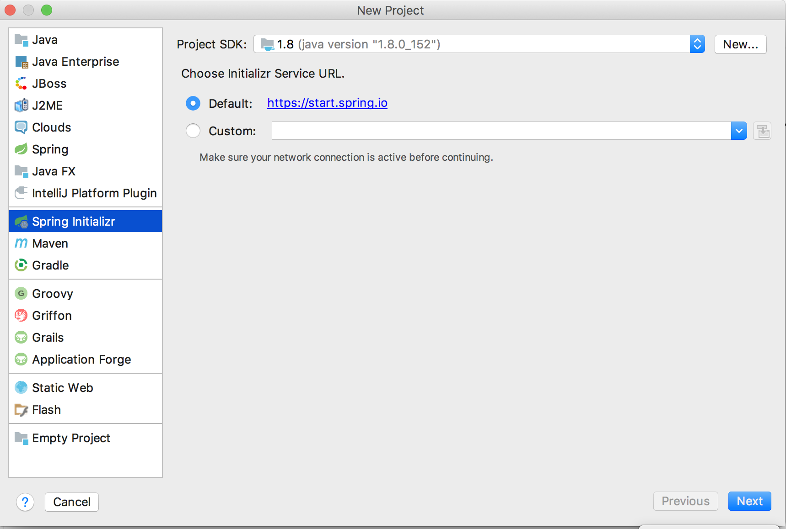  

2. 如图页面，按照需要输入修改即可，Group，Artifact，Package等信息

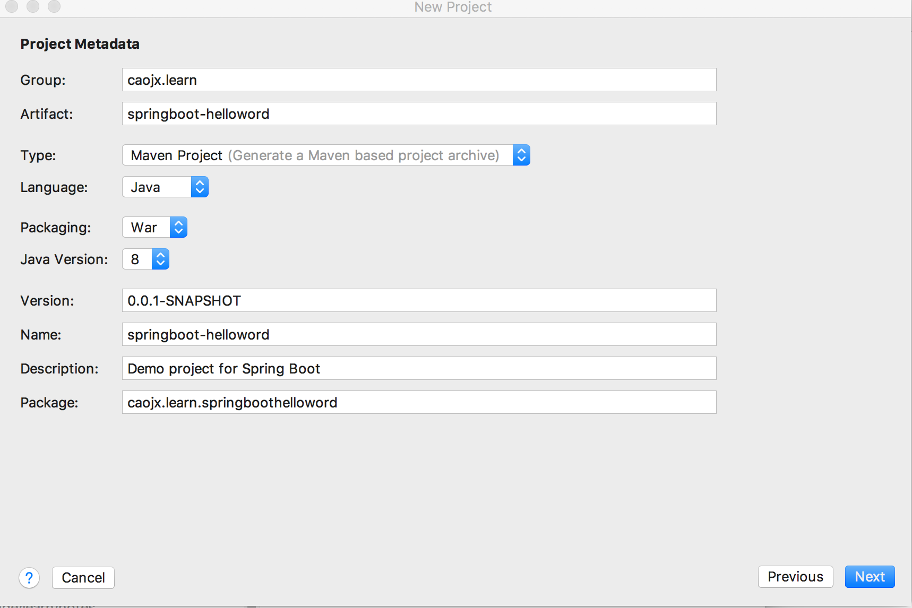  

3. 这个页面选择的是项目依赖，这个是spring-boot集成其它框架的选项，可以勾选多个，spring-boot就会帮我们集成到项目里，非常简单方便,这里我就简单使用web。

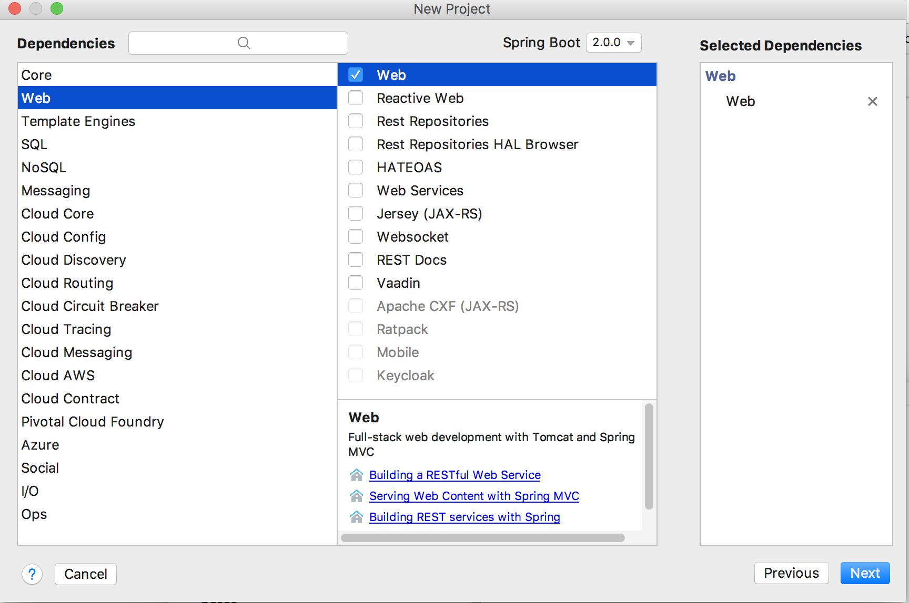  

4. 输入项目名称，选择项目存放的路径，下面的模块名称一般会随着上方的输入自动变化，如果只有一个模块保持默认即可。

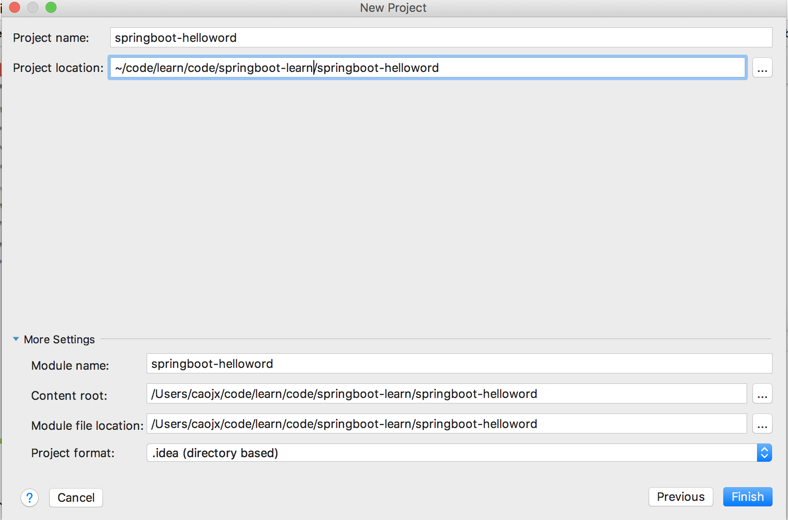  

5. 创建完成之后，需要等待一段时间，等待spring-boot为我们创建项目和下载依赖包，构建完成之后，如图所示的目录结构帮我们生成好了。还会生成一个SpringbootHellowordApplication类，这个类里面有个main方法，就是启动项目的入口文件。

	意：启动前需要修改一下pom.xml文件	去掉\<scope>provided\</scope>，不然无法启动

```xml
<dependency>
	<groupId>org.springframework.boot</groupId>
	<artifactId>spring-boot-starter-tomcat</artifactId>
	<scope>provided</scope>
</dependency>
改为
<dependency>
	<groupId>org.springframework.boot</groupId>
	<artifactId>spring-boot-starter-tomcat</artifactId>
</dependency>
```
假如不去掉\<scope>provided\</scope>，会出现如下错误，无法启动

```text
2018-03-21 13:53:33.484  INFO 5251 --- [       Thread-5] o.s.j.e.a.AnnotationMBeanExporter        : Unregistering JMX-exposed beans on shutdown
```

6. 我们右击Run As 选择 Spring Boot app，这里我们不需要Tomcat 因为SpringBoot把Tomcat集成了，默认端口8080

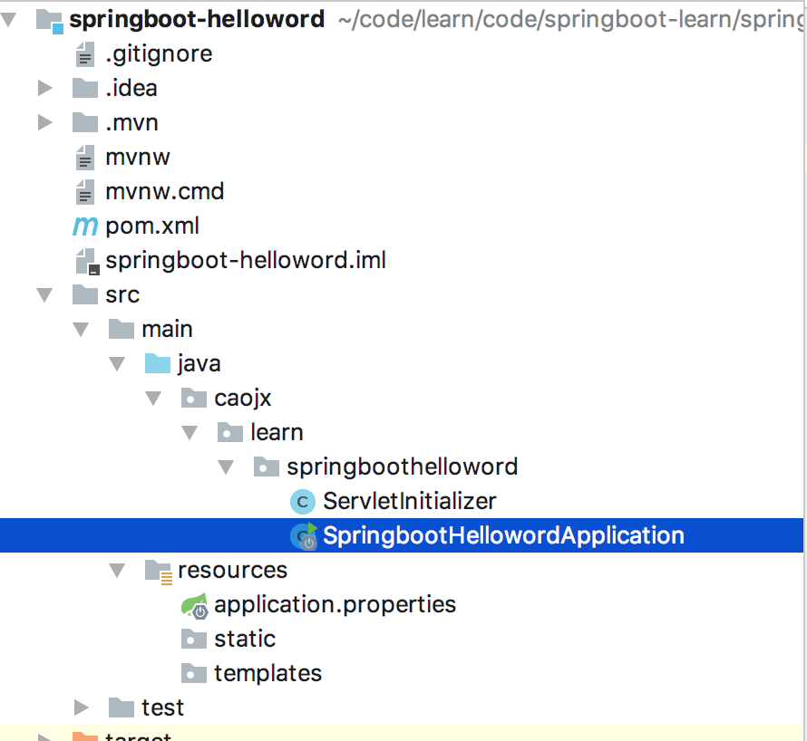

我们浏览器输入：<http://localhost:8080/>

出现这个 说明项目启动成功

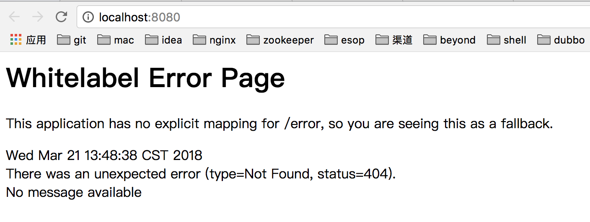  

### 2.2 编码

我们现在配置一个HelloWorld请求,在caojx.learn.springboothelloword包下，新建一个HelloWorldController类

```java
package caojx.learn.springboothelloword.controller;

import org.springframework.web.bind.annotation.RequestMapping;
import org.springframework.web.bind.annotation.RestController;

@RestController
public class HelloWorldController {

	@RequestMapping("/hello")
	public String say(){
		return "spring boot hello world";
	}
}
```

注意，新建的类一定要在caojx.learn.springboothelloword包下，即所有新建的包需要在SpringBoot的启动类（SpringbootHellowordApplication）下，不然无法识别，会出现如下错误

```html
Whitelabel Error Page
 

This application has no explicit mapping for /error, so you are seeing this as a fallback.

Wed Dec 14 16:35:25 CST 2016
There was an unexpected error (type=Not Found, status=404).
No message available
```

问题很像是没有访问地址不对，第一感觉以为url写的不对。

其实不是，真正的原因是【Application启动类放的位置不对】要将Application放在最外层，也就是要包含所有子包。springboot会自动加载启动类所在包下及其子包下的所有组件。


然后我们重新启动SpringbootHellowordApplication类

请求 <http://localhost:8080/hello>

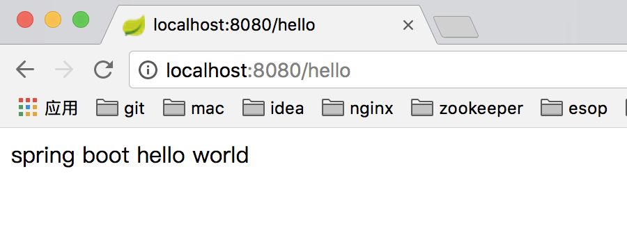  

## 三、SpringBoot项目属性配置

本节内容主要参见：http://blog.java1234.com/blog/articles/331.html

其他文章推荐：https://blog.csdn.net/saytime/article/details/74781708

SpringBoot项目中有个application.properties项目配置文件，打开是空白 里面可以配置项目相关的一些配置，编辑的时候IDEA会自动提示，Eclipse可能需要按alt+/ 提示出来。配置属性有很多，我这里只使用了部分属性

### 3.1 修改tomcat端口和访问路径

上一讲tomcat默认端口8080 默认路径是根目录/

我们现在改成 端口8080 以及上下文路径/HelloWorld

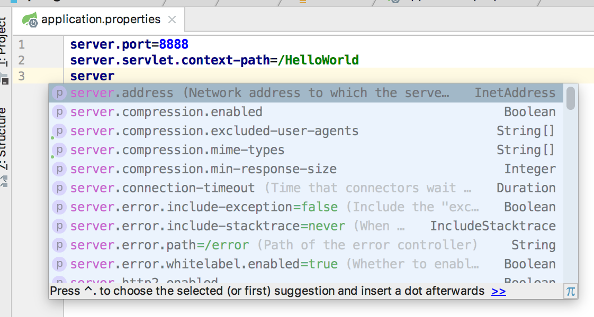


改完后保存，启动HelloWorldApplication类

页面输入：http://localhost:8888/HelloWorld/hello

结果出来了

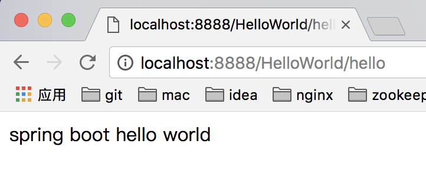  

### 3.2 SpringBoot支持自定义属性

上边我们使用的是SpringBoot提供的一些属性配置，我们也可以自定义一些属性

我们在application.properties中加一个helloWorld属性，属性值spring Boot大爷你好

```properties
server.port=8888
server.context-path=/HelloWorld
helloWorld=Spring Boot hello world
```

当然对中文字节编码处理了

```java
package caojx.learn.springboothelloword.controller;

import org.springframework.beans.factory.annotation.Value;
import org.springframework.web.bind.annotation.RequestMapping;
import org.springframework.web.bind.annotation.RestController;

/**
 * 使用自定义属性
 */
@RestController
public class HelloWorldController2 {

	//注入 application.properties中定义的属性
	@Value("${helloWorld}")
	private String helloWorld;

	@RequestMapping("/hello2")
	public String say(){
		return helloWorld;
	}
}
```


我们重启HelloWorldApplication类，

页面输入：<http://localhost:8888/HelloWorld/hello2>

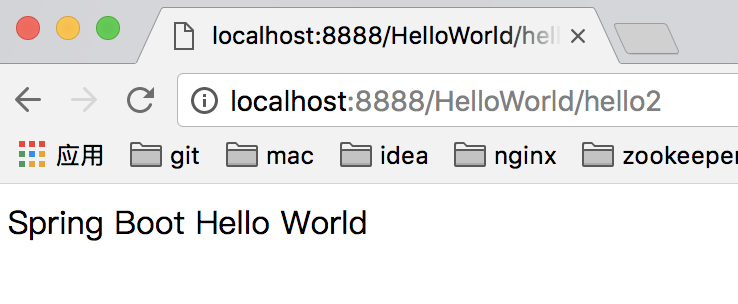  


**假如我们要配置一个类别下的多个属性，**

比如mysql的jdbc连接配置

mysql.jdbcName=com.mysql.jdbc.Driver

mysql.dbUrl=jdbc:mysql://localhost:3306/db_diary

mysql.userName=root

mysql.password=123456

我们贴到application.properties

然后按照前面的方案，我们在Controller里写四个属性；

```java
package caojx.learn.springboothelloword.controller;

import org.springframework.beans.factory.annotation.Value;
import org.springframework.web.bind.annotation.RequestMapping;
import org.springframework.web.bind.annotation.RestController;

/**
 * 使用自定义属性
 */
@RestController
public class HelloWorldController3 {

	@Value("${helloWorld}")
	private String helloWorld;

	@Value("${mysql.jdbcName}")
	private String jdbcName;

	@Value("${mysql.dbUrl}")
	private String dbUrl;

	@Value("${mysql.userName}")
	private String userName;

	@Value("${mysql.password}")
	private String password;
	
	@RequestMapping("/showJdbc")
	public String showJdbc(){
		return "mysql.jdbcName:"+jdbcName+"<br/>"
				+"mysql.dbUrl:"+dbUrl+"<br/>"
				+"mysql.userName:"+userName+"<br/>"
				+"mysql.password:"+password;

	}
}
```


重启启动类，

页面输入：<http://localhost:8888/HelloWorld/showJdbc>

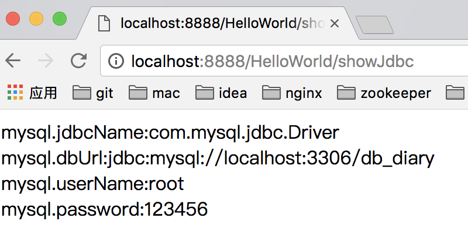  


上面那种 假如属性很多 要写一大串 假如多个地方使用 每个地方都得写这么多 不可取 

下面我们介绍ConfigurationProperties配置方式

新建一个MysqlProperties类 把所有属性都配置上去

执行前缀msyql

以及加上@Component作为组件 方便其他地方注入

```java
package caojx.learn.springboothelloword.controller;

import org.springframework.boot.context.properties.ConfigurationProperties;
import org.springframework.stereotype.Component;

/**
 * Mysql属性配置文件,
 * 将上面application.properties文件中的mysql配置注入到该实体类，注意这里的prefix指定的是mysql，对应
 * 配置文件中的结构
 * @author caojx
 * Created on 2018/3/22 下午下午5:00
 */
@Component
@ConfigurationProperties(prefix="mysql")
 class MysqlProperties {

    private String jdbcName;

    private String dbUrl;

    private String userName;

    private String password;

    public String getJdbcName() {
        return jdbcName;
    }

    public void setJdbcName(String jdbcName) {
        this.jdbcName = jdbcName;
    }

    public String getDbUrl() {
        return dbUrl;
    }

    public void setDbUrl(String dbUrl) {
        this.dbUrl = dbUrl;
    }

    public String getUserName() {
        return userName;
    }

    public void setUserName(String userName) {
        this.userName = userName;
    }

    public String getPassword() {
        return password;
    }

    public void setPassword(String password) {
        this.password = password;
    }
}
```

需要引入依赖到pom.xml

```xml
<dependency>
	<groupId>org.springframework.boot</groupId>
	<artifactId>spring-boot-configuration-processor</artifactId>
	<optional>true</optional>
</dependency>
```

使用

```java
package caojx.learn.springboothelloword.controller;

import org.springframework.beans.factory.annotation.Autowired;
import org.springframework.beans.factory.annotation.Value;
import org.springframework.web.bind.annotation.RequestMapping;
import org.springframework.web.bind.annotation.RestController;

/**
 * 使用自定义属性
 */
@RestController
public class HelloWorldController4 {

	@Autowired
	private MysqlProperties mysqlProperties;

	@RequestMapping("/showJdbc2")
	public String showJdbc(){
		return "mysql.jdbcName:"+mysqlProperties.getJdbcName()+"<br/>"
				+"mysql.dbUrl:"+mysqlProperties.getDbUrl()+"<br/>"
				+"mysql.userName:"+mysqlProperties.getUserName()+"<br/>"
				+"mysql.password:"+mysqlProperties.getPassword();

	}
}
```

只需要定义MysqlProperties即可 方便很多 运行结果和之前一样

http://localhost:8888/HelloWorld/showJdbc2

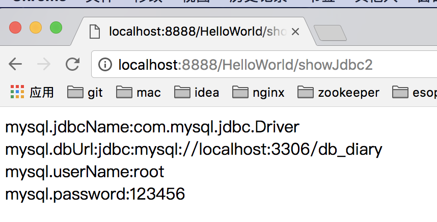  


## 四、SpringBoot之Controller使用

本节内容主要参见：http://blog.java1234.com/blog/articles/332.html

本节主要了解如下注解

@Controller	处理http请求
@RestController	Spring4之后新加的注解，原来返回json需要@ResponseBody配合@Controller
@RequestMapping	配置url映射
@PathVariable	获取url中的数据
@RequestParam	获取请求参数中的值


### 4.1 前言

项目前后台交互的话 无非两种方式

- 一种普通整体页面提交，比如form提交；
- 还有一种局部刷新，或者叫做异步刷新，ajax提交；

@Controller就是整体页面刷新提交的处理注解

@RestController就是ajax提交，一般返回json格式，相当于我们经常使用的@ResponseBody配合@Controller组合

各有用处的；

### 4.2 编码

这里我们分别来演示上面两种交互。请求后台，必须返回一个视图，以前我们一般用Jsp，但是SpringBoot不推荐我们实用jsp，主要是强调前后台分离；官方推荐的是这几种模版视图引擎，我一般推荐Freemarker和Velocity；


添加freemarker支持，在pom.xml文件添加对应的依赖

```xml
<dependency>
    <groupId>org.springframework.boot</groupId>
    <artifactId>spring-boot-starter-freemarker</artifactId>
</dependency>
```

然后我们新建一个新的Controller类 HelloWorldFreemakerController

```java
package caojx.learn.springboothelloword.controller;

import org.springframework.stereotype.Controller;
import org.springframework.web.bind.annotation.RequestMapping;
import org.springframework.web.servlet.ModelAndView;

/**
 * 返回到freemaker视图
 * @author caojx
 * Created on 2018/3/22 下午下午5:29
 */
@Controller
@RequestMapping("/freemarker")
public class HelloWorldFreemakerController {

    /**
     * 设置数据，返回到freemarker视图
     * @return
     */
    @RequestMapping("/say")
    public ModelAndView say(){
        ModelAndView mav=new ModelAndView();
        mav.addObject("message", "SpringBoot 大爷你好！");
        mav.setViewName("helloWorld");
        return mav;
    }
}
```

对应的，我们在templates下新建一个helloWorld.ftl模版文件

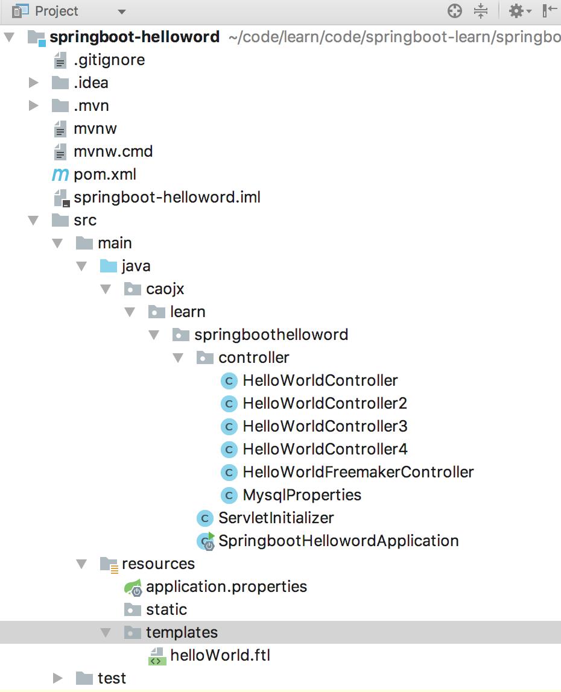  


helloWorld.ftl模版文件内容：

```html
<!DOCTYPE html>
<html>
<head>
<meta charset="UTF-8">
<title>Insert title here</title>
</head>
<body>
show:${message}
</body>
</html>
```

我们测试下，启动HelloWorldApplication

然后浏览器输入：<http://localhost:8888/HelloWorld/freemarker/say>

页面显示结果：

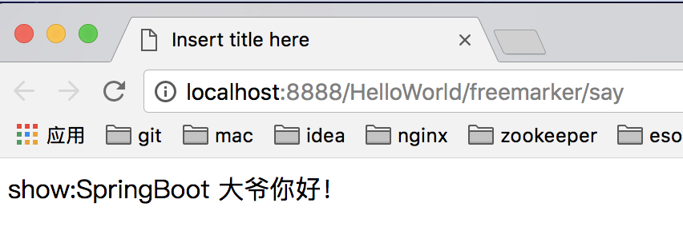  


我们在演示下@RestController，ajax方式

我们新建一个HelloWorldAjaxController类

```java
package caojx.learn.springboothelloword.controller;
 
import org.springframework.web.bind.annotation.RequestMapping;
import org.springframework.web.bind.annotation.RestController;
 
 
/**
 * 返回ajax json格式
 * @author user
 *
 */
@RestController
@RequestMapping("/ajax")
public class HelloWorldAjaxController {
 
    @RequestMapping("/hello")
    public String say(){
        return "{'message1': 'SpringBoot你大爷','message2','SpringBoot你大爷2'}";
    }
}
```

返回json串


这里我们用的是jquery，随便找个jquery.js

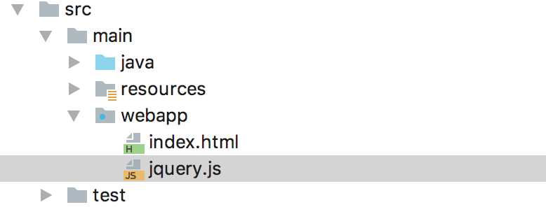  


index.html代码，一个ajax请求

```html

<!DOCTYPE html>
<html>
<head>
<meta charset="UTF-8">
<title>Insert title here</title>
<script src="jQuery.js"></script>
<script type="text/javascript">
    function show(){
        $.post("ajax/hello",{},
                function(result){
                    alert(result);
                }
            );
    }
     
</script>
</head>
<body>
<button onclick="show()">你大爷</button>
</body>
</html>
```

启动HelloWorldApplication类

页面先请求index.html

浏览器输入：<http://localhost:8888/HelloWorld/>

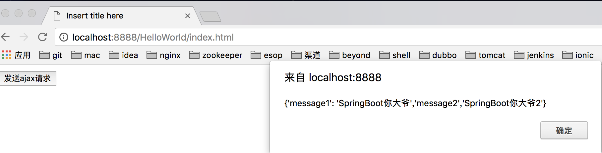  

当然这里的json比较简单，所以我直接返回； 实际项目Json格式复杂，要借助于一些json框架，比如Json-lib，gson等；


当然还有一些比如

@PathVariable 获取url中的数据，获取路径中的值

@RequestParam 获取请求参数中的值

```java
package caojx.learn.springboothelloword.controller;

import org.springframework.stereotype.Controller;
import org.springframework.web.bind.annotation.PathVariable;
import org.springframework.web.bind.annotation.RequestMapping;
import org.springframework.web.bind.annotation.RequestParam;
import org.springframework.web.servlet.ModelAndView;

@Controller
@RequestMapping("/blog")
public class BlogController {

	/**
	 * @PathVariable 配合 @RequestMapping使用可以获取到路径中的参数
	 * http://localhost:8888/HelloWorld/blog/21  则 id=21
	 * @param id
	 * @return
	 */
	@RequestMapping("/{id}")
	public ModelAndView show(@PathVariable("id") Integer id){
		ModelAndView mav=new ModelAndView();
		mav.addObject("id", id);
		mav.setViewName("blog");
		return mav;
	}

	/**
	 * RequestParam 获取提交的参数
	 * 
	 * http://localhost:8888/HelloWorld/blog/query?q=123456 则q = 123456
	 * @param q
	 * @return
	 */
	@RequestMapping("/query")
	public ModelAndView query(@RequestParam(value="q",required=false)String q){
		ModelAndView mav=new ModelAndView();
		mav.addObject("q", q);
		mav.setViewName("query");
		return mav;
	}
}
```

## 五、SpringBoot操作之Spring-Data-Jpa

本节内容主要参见：http://blog.java1234.com/blog/articles/333.html

SprintBoot整合MyBatis参考：https://blog.csdn.net/saytime/article/details/74783296

**Spring-Data-Jpa** JPA(Java Persistence API)定义了一系列对象持久化的标准，目前实现这一规范的产品有Hibernate、TopLink等。

Spring Data JPA 框架，主要针对的就是 Spring 唯一没有简化到的业务逻辑代码，至此，开发者连仅剩的实现持久层业务逻辑的工作都省了，唯一要做的，就只是声明持久层的接口，其他都交给 Spring Data JPA 来帮你完成！

### 5.1 准备

我这里使用的数据是mariadb与mysql用法一致，引入对应的依赖

```xml
<!--mariadb-->
<dependency>
    <groupId>org.mariadb.jdbc</groupId>
    <artifactId>mariadb-java-client</artifactId>
</dependency>

<!--spring jpa支持-->
<dependency>
    <groupId>org.springframework.boot</groupId>
    <artifactId>spring-boot-starter-data-jpa</artifactId>
</dependency>
```

接下来配置application.properties

```properties
spring.datasource.driver-class-name=org.mariadb.jdbc.Driver
spring.datasource.url=jdbc:mariadb://192.168.46.134:3306/db_book？createDatabaseIfNotExist=true&useUnicode=true&characterEncoding=utf8
spring.datasource.username=root
spring.datasource.password=root

spring.jpa.hibernate.ddl-auto=update
spring.jpa.show-sql=true
```

上面是配置数据源

下面是配置比如ddl-auto 学过hibernate的都知道 我们一般用update 更新操作

show-sql 是显示sql语句

注意：上面我们会发现 这种properties形式的配置有点冗余，后面一一帖我们改成主流的yml形式


### 5.2 编码

使用Spring-Data-Jpa来实现CRUD操作，视图层采用Freemarker

1.新建一个Book实体

```java
package caojx.learn.springboothelloword.jpa;

import javax.persistence.*;

/**
 * @author caojx
 * Created on 2018/3/22 下午下午7:58
 */

@Entity
@Table(name="t_book")
public class Book {

    @Id
    @GeneratedValue
    private Integer id;

    @Column(length=100)
    private String bookName;

    @Column(length = 100)
    private String author;

    public Integer getId() {
        return id;
    }
    public void setId(Integer id) {
        this.id = id;
    }

    public String getBookName() {

        return bookName;
    }
    public void setBookName(String bookName) {
        this.bookName = bookName;
    }

    public String getAuthor() {
        return author;
    }

    public void setAuthor(String author) {
        this.author = author;
    }
}
```


2.这里我们先把application.properties修改成application.yml 主流格式

 在 spring boot 中，有两种配置文件，一种是application.properties,另一种是application.yml,两种都可以配置spring boot 项目中的一些变量的定义，参数的设置等，yml 文件在写的时候层次感强，而且少写了代码。所以现在很多人都使用yml配置文件。

可以参考：https://www.cnblogs.com/baoyi/p/SpringBoot_YML.html

application.yml

```yml
server:
  port: 8888
  servlet:
    context-path: /HelloWorld

helloWorld: Spring Boot Hello World

mysql:
     jdbcName: com.mysql.jdbc.Driver
     dbUrl: jdbc:mysql://localhost:3306/db_diary
     userName: root
     password: 123456

spring:
   datasource:
      driver-class-name: org.mariadb.jdbc.Driver
      url: jdbc:mariadb://192.168.46.134:3306/db_book?createDatabaseIfNotExist=true&useUnicode=true&characterEncoding=utf8
      username: root
      password: root
   jpa:
     hibernate.ddl-auto: update
     show-sql: true
```

**yml格式有个注意点 冒号后面一定要加个空格,还有我们把context-path改成/方便开发应用**

3. 图书Dao接口，要求实现JpaRepository,和JpaSpecificationExecutor接口

```java
package caojx.learn.springboothelloword.jpa;

import org.springframework.data.jpa.repository.JpaRepository;
import org.springframework.data.jpa.repository.JpaSpecificationExecutor;
import org.springframework.data.jpa.repository.Query;

import java.util.List;

/**
 * 图书Dao接口，要求实现JpaRepository
 * @author caojx
 * Created on 2018/3/22 下午下午8:19
 */
public interface BookDao extends JpaRepository<Book,Integer>, JpaSpecificationExecutor<Book> {

    /**
     * 使用SQL查询
     * @param name
     * @return
     */
    @Query("select b from Book b where b.bookName like %?1%")
    public List<Book> findByName(String name);

    /**
     * 使用SQL查询
     * @param n
     * @return
     */
    @Query(value="select * from t_book order by RAND() limit ?1",nativeQuery=true)
    public List<Book> randomList(Integer n);
}
```

4. BookController,我们这里就不编写Service了，直接在这里操作Dao实现CRUD，当然真实企业开发不会这样做。

```java
package caojx.learn.springboothelloword.jpa;

import org.springframework.beans.factory.annotation.Autowired;
import org.springframework.stereotype.Controller;
import org.springframework.web.bind.annotation.*;
import org.springframework.web.servlet.ModelAndView;

/**
 * Book控制类
 * @author caojx
 * Created on 2018/3/22 下午下午8:23
 */
@Controller
@RequestMapping("/book")
public class BookController {

   @Resource
	private BookDao bookDao;
	
	/**
	 * 查询所有图书
	 * @return
	 */
	@RequestMapping("/list")
	public ModelAndView list(){
		ModelAndView mav=new ModelAndView();
		mav.addObject("bookList", bookDao.findAll());
		mav.setViewName("bookList");
		return mav;
	}
	
	/**
	 * 根据条件动态查询
	 * @param book
	 * @return
	 */
	@RequestMapping("/list2")
	public ModelAndView list2(Book book){
		ModelAndView mav=new ModelAndView();
		List<Book> bookList=bookDao.findAll(new Specification<Book>() {
			@Override
			public Predicate toPredicate(Root<Book> root, CriteriaQuery<?> query, CriteriaBuilder cb) {
				Predicate predicate=cb.conjunction();
				if(book!=null){
					if(book.getBookName()!=null && !"".equals(book.getBookName())){
						predicate.getExpressions().add(cb.like(root.get("bookName"), "%"+book.getBookName()+"%"));
					}
					if(book.getAuthor()!=null && !"".equals(book.getAuthor())){
						predicate.getExpressions().add(cb.like(root.get("author"), "%"+book.getAuthor()+"%"));
					}
				}
				return predicate;
			}
		});
		mav.addObject("bookList", bookList);
		mav.setViewName("bookList");
		return mav;
	}
	
	/**
	 * 添加图书
	 * @param book
	 * @return
	 */
	@RequestMapping(value="/add",method=RequestMethod.POST)
	public String add(Book book){
		bookDao.save(book);
		return "forward:/book/list";
	}
	
	/**
	 * 根据id查询book实体
	 * @param id
	 * @return
	 */
	@RequestMapping("/preUpdate/{id}")
	public ModelAndView preUpdate(@PathVariable("id")Integer id){
		ModelAndView mav=new ModelAndView();
		mav.addObject("book", bookDao.getOne(id));
		mav.setViewName("bookUpdate");
		return mav;
	}
	
	/**
	 * 修改图书
	 * @param book
	 * @return
	 */
	@PostMapping(value="/update")
	public String update(Book book){
		bookDao.save(book);
		return "forward:/book/list";
	}
	
	@GetMapping("/delete")
	public String delete(Integer id){
		bookDao.deleteById(id);
		return "forward:/book/list";
	}
	
	@ResponseBody
	@GetMapping("/queryByName")
	public List<Book> queryByName(){
		return bookDao.findByName("编程");
	}
	
	@ResponseBody
	@GetMapping("/randomList")
	public List<Book> randomList(){
		return bookDao.randomList(2);
	}
}
```

这里的@GetMapping(value="xxx") 类似  @RequestMapping(value="xxx",method=RequestMethod.GET)

以及@PostMapping(value="xxx") 类似  @RequestMapping(value="xxx",method=RequestMethod.POST)

5. bookList.ftl 展示数据

```html
<!DOCTYPE html>
<html>
<head>
<meta charset="UTF-8">
<title>图书管理</title>
</head>
<body>
<a href="/bookAdd.html">添加</a><br/>
<form method="post" action="/book/list2">
	图书名称：<input type="text" name="bookName" />&nbsp;
	图书作者：<input type="text" name="author" />&nbsp;
	<input type="submit" value="搜索"/>
</form>
<table>
	<tr>
		<th>编号</th>
		<th>图书名称</th>
		<th>图书作者</th>
		<th>操作</th>
	</tr>
	<#list bookList as book>
		<tr>
			<td>${book.id}</td>
			<td>${book.bookName}</td>
            <td>${book.author}</td>
			<td>
				<a href="/book/preUpdate/${book.id}">修改</a>
				<a href="/book/delete?id=${book.id}">删除</a>
			</td>
		</tr>
	</#list>
</table>
</body>
</html>
```


6. bookAdd.html 图书添加页面

```html
<!DOCTYPE html>
<html>
<head>
    <meta charset="UTF-8">
    <title>图书添加页面</title>
</head>
<body>
<form action="book/add" method="post">
    图书名称：<input type="text" name="bookName"/><br/>
    图书作者：<input type="text" name="author"/><br/>
    <input type="submit" value="提交"/>
</form>
</body>
</html>
```


7. bookUpdate.ftl图书修改页面

```html
<!DOCTYPE html>
<html>
<head>
<meta charset="UTF-8">
<title>图书修改</title>
</head>
<body>
<form action="/book/update" method="post">
	<input type="hidden" name="id" value="${book.id}"/>
	图书名称：<input type="text" name="bookName" value="${book.bookName}"/><br/>
    图书作者：<input type="text" name="author" value="${book.author}"/><br/>
    <input type="submit" value="提交"/>
</form>
</body>
</html>
```

结果：

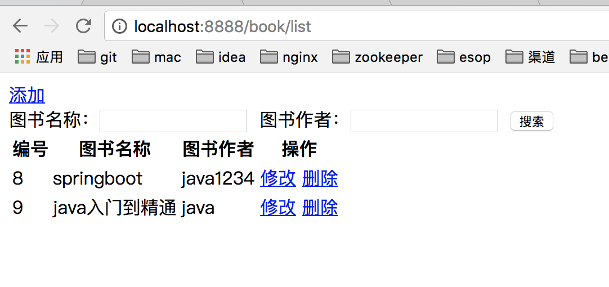  


## 六、SpringBoot之事务管理@Transactional

本节内容主要参见：http://blog.java1234.com/blog/articles/335.html

### 6.1 前言

以前学ssh ssm都有事务管理service层通过applicationContext.xml配置，在service类或所有service方法都加上事务操作；

用来保证一致性，即service方法里的多个dao操作，要么同时成功，要么同时失败；

springboot下的话 搞一个@Transactional即可

### 6.1 编码

我们这里搞一个实例，转账实例，A用户转账给B用户xx元


1. Account类

```java
package caojx.learn.springboothelloword.transactional;

import javax.persistence.*;

/**
 * @author caojx
 * Created on 2018/3/22 下午下午10:14
 */
@Entity
@Table(name="t_account")
public class Account {

    /**
     * id 编号
     */
    @Id
    @GeneratedValue
    private Integer id;

    /**
     * 用户名
     */
    @Column(length=50)
    private String userName;

    /**
     * 余额
     */
    private float balance;

    public Integer getId() {
        return id;
    }

    public void setId(Integer id) {
        this.id = id;
    }

    public String getUserName() {
        return userName;
    }

    public void setUserName(String userName) {
        this.userName = userName;
    }

    public float getBalance() {
        return balance;
    }

    public void setBalance(float balance) {
        this.balance = balance;
    }
}
```

2. 启动启动类，会自动创建表t_account，我们插入两条数据（这里我练习还是使用之前 db_book 库，可以自己切换其他库）


```mysql
insert into t_account values(1,700,'zhangsan');
insert into t_account values(2,300,'lisi');
```

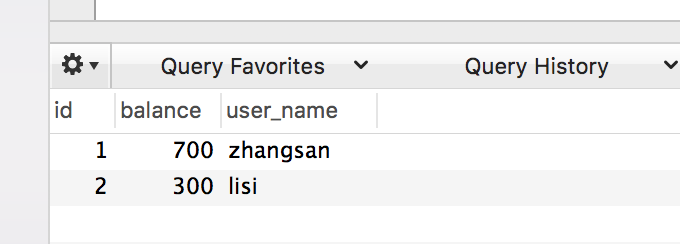  

3. 新建AccountDao接口

```java
package caojx.learn.springboothelloword.transactional;

import org.springframework.data.jpa.repository.JpaRepository;

/**
 * 账户Dao接口
 * @author caojx
 * Created on 2018/3/22 下午下午10:17
 */
public interface AccountDao extends JpaRepository<Account, Integer> {
}
```

4. AccountService接口

```java
package caojx.learn.springboothelloword.transactional;

/**
 * 帐号Service接口
 * @author caojx
 * Created on 2018/3/22 下午下午10:18
 */
public interface AccountService {

    /**
     * 转账
     * @param fromUserId
     * @param toUserId
     * @param account
     */
    public void transferAccounts(int fromUserId,int toUserId,float account);
}
```

5. AccountServiceImpl接口实现类

```java
package caojx.learn.springboothelloword.transactional;

import org.springframework.stereotype.Service;

import javax.annotation.Resource;
import javax.transaction.Transactional;

/**
 * 帐号Service实现类
 * @author caojx
 * Created on 2018/3/22 下午下午10:19
 */
//@Transactional
@Service("accountService")
public class AccountServiceImpl implements AccountService {

    @Resource
    private AccountDao accountDao;

    /**
     * 转账
     *
     * @param fromUserId
     * @param toUserId
     * @param account
     */
    @Override
    public void transferAccounts(int fromUserId, int toUserId, float account) {
        Account fromUserAccount=accountDao.getOne(fromUserId);
        fromUserAccount.setBalance(fromUserAccount.getBalance()-account);
        accountDao.save(fromUserAccount); // fromUser扣钱

        Account toUserAccount=accountDao.getOne(toUserId);
        toUserAccount.setBalance(toUserAccount.getBalance()+account);

        //假设转账的时候假如出现异常，业务类或业务方法中没有使用@Transactional控制事务，则会出现钱转出了，收钱人没有收到的情况
        //int zero = 1/0;
        accountDao.save(toUserAccount); // toUser加钱
    }
}
```

6. AccountController类

```java
package caojx.learn.springboothelloword.transactional;

import org.springframework.web.bind.annotation.RequestMapping;
import org.springframework.web.bind.annotation.RestController;

import javax.annotation.Resource;

/**
 * 账户Controoler类
 * @author caojx
 * Created on 2018/3/22 下午下午10:21
 */
@RestController
@RequestMapping("/account")
public class AccountController {

    @Resource
    private AccountService accountService;

    @RequestMapping("/transfer")
    public String transferAccounts(){
        try{
            accountService.transferAccounts(1, 2, 200);
            return "ok";
        }catch(Exception e){
            return "no";
        }
    }
}
```


7. 我们执行启动类

   浏览器输入：<http://localhost:8888/account/transfer>

   运行OK,没有事务控制的时候，没有异常的时候，转出的前与入账的钱是一致的，没有出现丢失的情况。

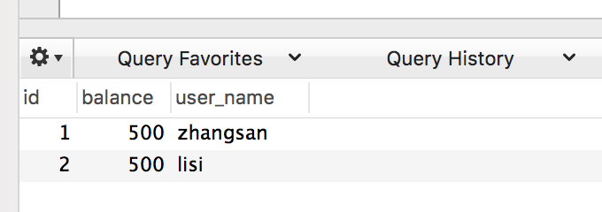  


OK 我们先把数据恢复到700  300

现在我们把service层方法改下,抛出一个异常

```java
package caojx.learn.springboothelloword.transactional;

import org.springframework.stereotype.Service;

import javax.annotation.Resource;
import javax.transaction.Transactional;

/**
 * 帐号Service实现类
 * @author caojx
 * Created on 2018/3/22 下午下午10:19
 */
@Service("accountService")
public class AccountServiceImpl implements AccountService {

    @Resource
    private AccountDao accountDao;

    /**
     * 转账
     *
     * @param fromUserId
     * @param toUserId
     * @param account
     */
    @Override

    public void transferAccounts(int fromUserId, int toUserId, float account) {
        Account fromUserAccount=accountDao.getOne(fromUserId);
        fromUserAccount.setBalance(fromUserAccount.getBalance()-account);
        accountDao.save(fromUserAccount); // fromUser扣钱

        Account toUserAccount=accountDao.getOne(toUserId);
        toUserAccount.setBalance(toUserAccount.getBalance()+account);

        //假设转账的时候假如出现异常，业务类或业务方法中没有使用@Transactional控制事务，则会出现钱转出了，收钱人没有收到的情况
        int zero = 1/0;
        accountDao.save(toUserAccount); // toUser加钱
    }
}
```

这时候 扣钱dao能执行成功  加钱操作执行不了了 因为前面会报错。

我们重启启动类

浏览器输入：<http://localhost:8888/account/transfer>

运行NO

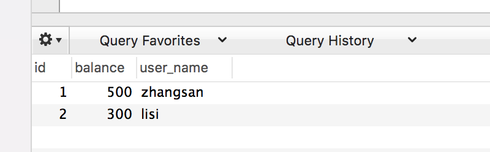  

这时候 钱扣了 但是 没加钱  导致了数据不一致性


这时候 我们需要用上事务

在service类或方法上加上@Transactional即可

```java
package caojx.learn.springboothelloword.transactional;

import org.springframework.stereotype.Service;

import javax.annotation.Resource;
import javax.transaction.Transactional;

/**
 * 帐号Service实现类
 * @author caojx
 * Created on 2018/3/22 下午下午10:19
 */
//添加事务注解，异常的时候能保证事务的一致性
@Transactional
@Service("accountService")
public class AccountServiceImpl implements AccountService {

    @Resource
    private AccountDao accountDao;

    /**
     * 转账
     *
     * @param fromUserId
     * @param toUserId
     * @param account
     */
    @Override
    public void transferAccounts(int fromUserId, int toUserId, float account) {
        Account fromUserAccount=accountDao.getOne(fromUserId);
        fromUserAccount.setBalance(fromUserAccount.getBalance()-account);
        accountDao.save(fromUserAccount); // fromUser扣钱

        Account toUserAccount=accountDao.getOne(toUserId);
        toUserAccount.setBalance(toUserAccount.getBalance()+account);

        //假设转账的时候假如出现异常，业务类或业务方法中没有使用@Transactional控制事务，则会出现钱转出了，收钱人没有收到的情况
        int zero = 1/0;
        accountDao.save(toUserAccount); // toUser加钱
    }
}
```

我们恢复下数据700  300

然后再重启启动类，

浏览器输入：<http://localhost:8888/account/transfer>

运行NO

但是数据库数据没变化 说明启动作用了。


## 七、 SpringBoot之表单验证@Valid

本节内容主要参见：http://blog.java1234.com/blog/articles/336.html

SpringBoot提供了强大的表单验证功能实现，给我们省去了写验证的麻烦；

### 7.1 常见表单验证注解

| 限制                      | 说明                                                         |
| ------------------------- | ------------------------------------------------------------ |
| @Null                     | 限制只能为null                                               |
| @NotNull                  | 限制必须不为null                                             |
| @AssertFalse              | 限制必须为false                                              |
| @AssertTrue               | 限制必须为true                                               |
| @DecimalMax(value)        | 限制必须为一个不大于指定值的数字                             |
| @DecimalMin(value)        | 限制必须为一个不小于指定值的数字                             |
| @Digits(integer,fraction) | 限制必须为一个小数，且整数部分的位数不能超过integer，小数部分的位数不能超过fraction |
| @Future                   | 限制必须是一个将来的日期                                     |
| @Max(value)               | 限制必须为一个不大于指定值的数字                             |
| @Min(value)               | 限制必须为一个不小于指定值的数字                             |
| @Past                     | 限制必须是一个过去的日期                                     |
| @Pattern(value)           | 限制必须符合指定的正则表达式                                 |
| @Size(max,min)            | 限制字符长度必须在min到max之间                               |
| @Past                     | 验证注解的元素值（日期类型）比当前时间早                     |
| @NotEmpty                 | 验证注解的元素值不为null且不为空（字符串长度不为0、集合大小不为0） |
| @NotBlank                 | 验证注解的元素值不为空（不为null、去除首位空格后长度为0），不同于@NotEmpty，@NotBlank只应用于字符串且在比较时会去除字符串的空格 |
| @Email                    | 验证注解的元素值是Email，也可以通过正则表达式和flag指定自定义的email格式 |

### 7.2 编码

这里我们给下实例，提交一个有姓名和年龄的表单添加功能，

要求姓名不能为空，年龄必须是不小于18 ；

1. 我们先新建一个Student实体，这里只用了两个注解

```java
package caojx.learn.springboothelloword.valid;

import javax.persistence.*;
import javax.validation.constraints.Min;
import javax.validation.constraints.NotEmpty;
import javax.validation.constraints.NotNull;

/**
 * @author caojx
 * Created on 2018/3/23 下午上午11:06
 */
@Entity
@Table(name="t_student")
public class Student {
    @Id
    @GeneratedValue
    private Integer id;

    @NotEmpty(message="姓名不能为空！")
    @Column(length=50)
    private String name;

    @NotNull(message="年龄不能为空！")
    @Min(value=18,message="年龄必须大于18岁！")
    @Column(length=50)
    private Integer age;

    public Integer getId() {
        return id;
    }

    public void setId(Integer id) {
        this.id = id;
    }

    public String getName() {
        return name;
    }

    public void setName(String name) {
        this.name = name;
    }

    public Integer getAge() {
        return age;
    }

    public void setAge(Integer age) {
        this.age = age;
    }
}
```

2. dao接口

```java
package caojx.learn.springboothelloword.valid;

import org.springframework.data.jpa.repository.JpaRepository;

/**
 * 学生Dao接口
 * @author caojx
 * Created on 2018/3/23 下午上午11:10
 */
public interface StudentDao extends JpaRepository<Student, Integer> {
}
```

3. service接口

```java
package caojx.learn.springboothelloword.valid;

/**
 * 学生Service接口
 * @author caojx
 * Created on 2018/3/23 下午上午11:11
 */
public interface StudentService {

    /**
     * 添加学生
     */
    public void add(Student student);
}
```


4. service业务实现类

```java
package caojx.learn.springboothelloword.valid;

import org.springframework.stereotype.Service;

import javax.annotation.Resource;
import javax.transaction.Transactional;

/**
 * 学生Service实现类
 * @author caojx
 * Created on 2018/3/23 下午上午11:11
 */
@Transactional
@Service
public class StudentServiceImpl implements StudentService {

    @Resource
    private StudentDao studentDao;

    @Override
    public void add(Student student) {
        studentDao.save(student);
    }
}
```

5. controller

```java
package caojx.learn.springboothelloword.valid;

import org.springframework.validation.BindingResult;
import org.springframework.web.bind.annotation.PostMapping;
import org.springframework.web.bind.annotation.RequestMapping;
import org.springframework.web.bind.annotation.ResponseBody;
import org.springframework.web.bind.annotation.RestController;

import javax.annotation.Resource;
import javax.validation.Valid;

/**
 * 学生控制类
 * @author caojx
 * Created on 2018/3/23 下午上午11:13
 */
@RestController
@RequestMapping("/student")
public class StudentController {

    @Resource
    private StudentService studentService;

    /**
     * 添加学生
     *
     * add方法里 实体前要加@Valid 假如字段验证不通过，信息绑定到后面定义的BindingResult；
     * @param student
     * @param bindingResult
     * @return
     */
    @ResponseBody
    @PostMapping(value="/add")
    public String add(@Valid Student student, BindingResult bindingResult){
        if(bindingResult.hasErrors()){
            return bindingResult.getFieldError().getDefaultMessage();
        }else{
            studentService.add(student);
            return "添加成功！";
        }
    }
}
```

6. student添加页面studentAdd.html

```java

<!DOCTYPE html>
<html>
<head>
    <meta charset="UTF-8">
    <title>学生信息添加页面</title>
    <script src="jquery.js"></script>
    <script type="text/javascript">
        function submitData(){
            $.post("/student/add",{name:$("#name").val(),age:$("#age").val()},
                function(result){
                    alert(result);
                }
            );
        }
    </script>
</head>
<body>
姓名：<input type="text" id="name" name="name"/>
年龄：<input type="text" id="age" name="age"/>
<input type="button" value="提交" onclick="submitData()"/>
</body>
</html>
```

浏览器请求：<http://localhost:8888/studentAdd.html>

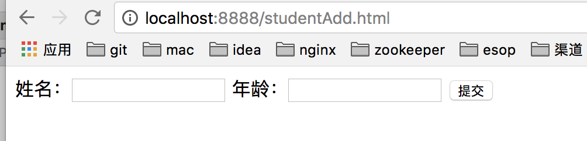  

直接点击提交

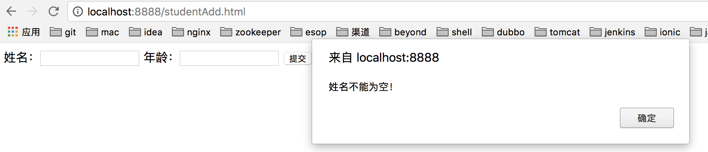  


输入都符合条件的数据

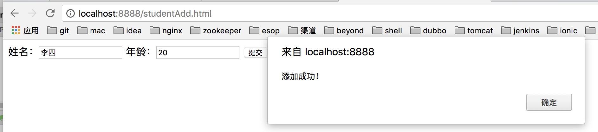  

其他效果几个验证，请自己测试一下。


### 7.3 表单验证总结

对于这种数据验证，我们一般会先在前端验证，比如js先验证信息，再提交到后台验证。


## 八、 SpringBoot之切面AOP

本节内容主要参见：http://blog.java1234.com/blog/articles/337.html

### 8.1 前言

SpringBoot提供了强大AOP支持，我们前面讲解过AOP面向切面，所以这里具体AOP原理就补具体介绍；

AOP切面主要是切方法，我们一般搞一些日志分析和事务操作，要用到切面，类似拦截器；

**下边是AOP中常见的切面注解：**

- @Aspect注解是切面注解类
- @Pointcut切点定义
- @Before是方法执行前调用
- @After是方法执行后调用
- @AfterReturning方法执行返回值调用


### 8.2 编码

下边简单使用一下切面，在指定的方法中切入动作

1. 定义一个切面类：RequestAspect

```java
package caojx.learn.springboothelloword.aop;

import caojx.learn.springboothelloword.valid.Student;
import org.apache.log4j.Logger;
import org.aspectj.lang.JoinPoint;
import org.aspectj.lang.annotation.*;
import org.springframework.stereotype.Component;
import org.springframework.web.context.request.RequestContextHolder;
import org.springframework.web.context.request.ServletRequestAttributes;

import javax.servlet.http.HttpServletRequest;

/**
 * @author caojx
 * Created on 2018/3/23 下午上午11:27
 */
@Aspect
@Component
public class RequestAspect {


    private Logger logger = Logger.getLogger(RequestAspect.class);

    @Pointcut("execution(public * caojx.learn.springboothelloword.valid.*.*(..))")
    public void log() {
    }

    @Before("log()")
    public void doBefore(JoinPoint joinPoint) {
        logger.info("方法执行前...");
        ServletRequestAttributes sra = (ServletRequestAttributes) RequestContextHolder.getRequestAttributes();
        HttpServletRequest request = sra.getRequest();
        logger.info("url:" + request.getRequestURI());
        logger.info("ip:" + request.getRemoteHost());
        logger.info("method:" + request.getMethod());
        logger.info("class_method:" + joinPoint.getSignature().getDeclaringTypeName() + "." + joinPoint.getSignature().getName());
        logger.info("args:" + joinPoint.getArgs());
        Student student = (Student) joinPoint.getArgs()[0];
        System.out.println(student);
    }

    @After("log()")
    public void doAfter(JoinPoint joinPoint) {
        logger.info("方法执行后...");
    }

    @AfterReturning(returning = "result", pointcut = "log()")
    public void doAfterReturning(Object result) {
        logger.info("方法返回值：" + result);
    }
}
```

execution(public * caojx.learn.springboothelloword.valid.\*.*(..)) 这个定义 意思是 对  caojx.learn.springboothelloword.valid包下的任意类，任意方法，任意参数，任意返回值的方法都进行切入

2. 引入Log4j依赖

```xml
<dependency>
    <groupId>log4j</groupId>
    <artifactId>log4j</artifactId>
    <version>1.2.16</version>
</dependency>
```

3. 在resources文件夹下新建log4j.properties

```properties
log4j.rootLogger=info,CONSOLE

log4j.appender.CONSOLE=org.apache.log4j.ConsoleAppender
log4j.appender.CONSOLE.layout=org.apache.log4j.PatternLayout
log4j.appender.CONSOLE.layout.ConversionPattern=%d{yyyy-MM-dd-HH-mm} [%t] [%c] [%p] - %m%n
```

4. 测试

我们测试 StudentController

请求：<http://localhost:8888/studentAdd.html>

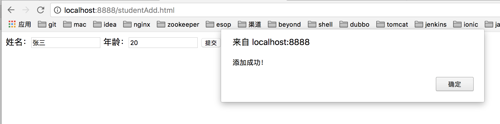  


输出日志：

```txt
2018-03-23-12-55 [http-nio-8888-exec-5] [caojx.learn.springboothelloword.aop.RequestAspect] [INFO] - 方法执行前...
2018-03-23-12-55 [http-nio-8888-exec-5] [caojx.learn.springboothelloword.aop.RequestAspect] [INFO] - url:/student/add
2018-03-23-12-55 [http-nio-8888-exec-5] [caojx.learn.springboothelloword.aop.RequestAspect] [INFO] - ip:0:0:0:0:0:0:0:1
2018-03-23-12-55 [http-nio-8888-exec-5] [caojx.learn.springboothelloword.aop.RequestAspect] [INFO] - method:POST
2018-03-23-12-55 [http-nio-8888-exec-5] [caojx.learn.springboothelloword.aop.RequestAspect] [INFO] - class_method:caojx.learn.springboothelloword.valid.StudentController.add
2018-03-23-12-55 [http-nio-8888-exec-5] [caojx.learn.springboothelloword.aop.RequestAspect] [INFO] - args:[Ljava.lang.Object;@267392f5
caojx.learn.springboothelloword.valid.Student@16167bdf
2018-03-23-12-55 [http-nio-8888-exec-5] [caojx.learn.springboothelloword.aop.RequestAspect] [INFO] - 方法执行前...
2018-03-23-12-55 [http-nio-8888-exec-5] [caojx.learn.springboothelloword.aop.RequestAspect] [INFO] - url:/student/add
2018-03-23-12-55 [http-nio-8888-exec-5] [caojx.learn.springboothelloword.aop.RequestAspect] [INFO] - ip:0:0:0:0:0:0:0:1
2018-03-23-12-55 [http-nio-8888-exec-5] [caojx.learn.springboothelloword.aop.RequestAspect] [INFO] - method:POST
2018-03-23-12-55 [http-nio-8888-exec-5] [caojx.learn.springboothelloword.aop.RequestAspect] [INFO] - class_method:caojx.learn.springboothelloword.valid.StudentServiceImpl.add
2018-03-23-12-55 [http-nio-8888-exec-5] [caojx.learn.springboothelloword.aop.RequestAspect] [INFO] - args:[Ljava.lang.Object;@7b91beb3
caojx.learn.springboothelloword.valid.Student@16167bdf
2018-03-23-12-55 [http-nio-8888-exec-5] [caojx.learn.springboothelloword.aop.RequestAspect] [INFO] - 方法执行前...
2018-03-23-12-55 [http-nio-8888-exec-5] [caojx.learn.springboothelloword.aop.RequestAspect] [INFO] - url:/student/add
2018-03-23-12-55 [http-nio-8888-exec-5] [caojx.learn.springboothelloword.aop.RequestAspect] [INFO] - ip:0:0:0:0:0:0:0:1
2018-03-23-12-55 [http-nio-8888-exec-5] [caojx.learn.springboothelloword.aop.RequestAspect] [INFO] - method:POST
2018-03-23-12-55 [http-nio-8888-exec-5] [caojx.learn.springboothelloword.aop.RequestAspect] [INFO] - class_method:org.springframework.data.repository.CrudRepository.save
2018-03-23-12-55 [http-nio-8888-exec-5] [caojx.learn.springboothelloword.aop.RequestAspect] [INFO] - args:[Ljava.lang.Object;@31433908
caojx.learn.springboothelloword.valid.Student@16167bdf
Hibernate: select next_val as id_val from hibernate_sequence for update
Hibernate: update hibernate_sequence set next_val= ? where next_val=?
2018-03-23-12-55 [http-nio-8888-exec-5] [caojx.learn.springboothelloword.aop.RequestAspect] [INFO] - 方法执行后...
2018-03-23-12-55 [http-nio-8888-exec-5] [caojx.learn.springboothelloword.aop.RequestAspect] [INFO] - 方法返回值：caojx.learn.springboothelloword.valid.Student@16167bdf
2018-03-23-12-55 [http-nio-8888-exec-5] [caojx.learn.springboothelloword.aop.RequestAspect] [INFO] - 方法执行后...
2018-03-23-12-55 [http-nio-8888-exec-5] [caojx.learn.springboothelloword.aop.RequestAspect] [INFO] - 方法返回值：null
Hibernate: insert into t_student (age, name, id) values (?, ?, ?)
2018-03-23-12-55 [http-nio-8888-exec-5] [caojx.learn.springboothelloword.aop.RequestAspect] [INFO] - 方法执行后...
2018-03-23-12-55 [http-nio-8888-exec-5] [caojx.learn.springboothelloword.aop.RequestAspect] [INFO] - 方法返回值：添加成功！
```


## 九、其他文章推荐

sprintboot系列教程1：https://blog.csdn.net/saytime/article/category/6990863

sprintboot系列教程2：https://blog.csdn.net/winter_chen001/article/details/77249029