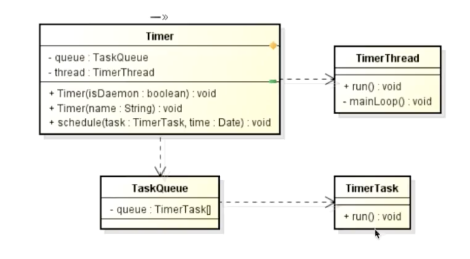

# Java定时任务之Timer的使用

定时任务就是基于给定的时间点，给定的时间间隔或者给定的执行次数自动执行的任务。  

Java中的定时任务调度工具主要有
- Timer
- Quartz
两者的不同点：  
1. Timer是JDK直接提供的，Quartz是OpenSymphony的开源项目。
2. Timer可以实现一些简单的定时任务，Quartz适用于更加复杂的定时任务场景。
3. Timer由一个后台线程去执行定时任务，而拥有后台线程池的Quartz能够使用多个子线程去执行定时任务。

提示:本文主要了解Timer的使用

## 一、Timer简介

### 1.1 Timer定义
class:java.util.Timer
有且仅有一个后台线程对多个业务线程进行定时频率的调度

### 1.2 主要构件
Timer
TimerTask

Timer的主要构建是Timer和TimerTask，Timer通过定时调用TimerTask来实现对任务的定时调度。   

  

Timer类里边有两个属性TaskQueue和TimerThread，TimerThread通过定期的调用队列TaskQueue里边的TimerTask里边的run方法，来实现对任务的定时
定频率的调度，这里我们主要关注的是Timer和TimerTask。

## 二、Timer的综合应用

### 2.1 Timer的简单使用

1. MyTimerTask
相当于需要定时的业务逻辑，然后使用Timer对TimerTask进行定时定频率的调用  
```java
package learn.caojx.timer;

import java.util.TimerTask;

/**
 * @description:
 * @version: v1.0.0
 * @author: caojx
 * @date: 2017/12/2 下午10:08
 */
public class MyTimerTask extends TimerTask{

    private String name;

    public MyTimerTask(String name) {
        this.name = name;
    }

    public String getName() {
        return name;
    }

    public void setName(String name) {
        this.name = name;
    }

    /**
     * The action to be performed by this timer task.
     */
    public void run() {
        //打印当前name的内容
        System.out.println("current exec name is: "+name);
    }
}
```
2. MyTimer.java
```java
package learn.caojx.timer;

import java.util.Timer;

/**
 * @description:
 * @version: v1.0.0
 * @author: caojx
 * @date: 2017/12/2 下午10:16
 */
public class MyTimer {

    public static void main(String[] args){
        //1.创建一个Timer实例
        Timer timer = new Timer();
        //2.创建一个MyTimerTask实例
        MyTimerTask myTimerTask = new MyTimerTask("No.1");
        //3.通过Timer定时定频率的调用MyTimerTask业务逻辑
        //实现第一次执行是在当前时间2秒钟之后，之后每个1s执行一次
        timer.schedule(myTimerTask, 2000L, 1000L);
    }
}
```
3. 结果  
当前2s执行第一次后，以后每一秒执行一次
```text
current exec name is: No.1
current exec name is: No.1
current exec name is: No.1
current exec name is: No.1
current exec name is: No.1
current exec name is: No.1
....
```

### 2.2 Timer的定时调度函数

本节内容主要了解  
- schedule的四种用法
- scheduleAtFixedRate的两种用法

schedule的四种用法：  

> 用法1：schedule（task，time）

参数： 
- taks：所要安排的任务  
- time: 执行任务的时间   
作用：  
在时间等于或超过time的时候执行且仅执行一次task。

1. MyTimerTask.java
```java
package learn.caojx.timer;

import java.text.SimpleDateFormat;
import java.util.Calendar;
import java.util.TimerTask;

/**
 * @description:
 * @version: v1.0.0
 * @author: caojx
 * @date: 2017/12/2 下午10:08
 */
public class MyTimerTask extends TimerTask{

    private String name;

    public MyTimerTask(String name) {
        this.name = name;
    }

    public String getName() {
        return name;
    }

    public void setName(String name) {
        this.name = name;
    }

    /**
     * The action to be performed by this timer task.
     */
    public void run() {
        //打印当前name的内容
        System.out.println("current exec name is: "+name);

        //以yyyy-MM-dd HH:mm:ss的格式打印当前执行时间
        Calendar calendar = Calendar.getInstance();
        SimpleDateFormat simpleDateFormat = new SimpleDateFormat("yyyy-MM-dd HH:mm:ss");
        System.out.println("Current exec time is: "+simpleDateFormat.format(calendar.getTime()));
    }
}
```

2. MyTimer.java
```java
package learn.caojx.timer;

import java.text.SimpleDateFormat;
import java.util.Calendar;
import java.util.Timer;

/**
 * @description:
 * @version: v1.0.0
 * @author: caojx
 * @date: 2017/12/2 下午10:16
 */
public class MyTimer {

    public static void main(String[] args) {
        //1.创建一个Timer实例
        Timer timer = new Timer();
        //2.创建一个MyTimerTask实例
        MyTimerTask myTimerTask = new MyTimerTask("schedule1");
        //------schedule用法1---------

        /**
         * 获取当前时间，并设置成距离当前时间三秒之后的时间
         * 如当前是2017-12-03 16:10:16
         * 则设置后的时间则为2017-12-03 16:10:19
         */
        Calendar calendar = Calendar.getInstance();
        SimpleDateFormat simpleDateFormat = new SimpleDateFormat("yyyy-MM-dd HH:mm:ss");
        System.out.println("Current exec time is: " + simpleDateFormat.format(calendar.getTime()));
        calendar.add(Calendar.SECOND, 3);
        /**
         * 1.在时间等于或超过time的时候执行且仅执行一次task
         * 如在2017-12-03 16:10:19执行一次task：打印任务名字
         */
        timer.schedule(myTimerTask, calendar.getTime());
    }
}
```

3.结果
```text
Current exec time is: 2017-12-03 16:10:16
current exec name is: schedule1
Current exec time is: 2017-12-03 16:10:19
```

> 用法2：schedule（taks，time, period）

参数：  
- task：所安排的任务  
- time：首次执行的时间  
- period： 执行一次task的时间间隔，单位是毫秒  
作用：  
时间等于或超过time时首次执行task，之后每隔period毫秒重复执行task。  

1. MyTimer.java
```java
package learn.caojx.timer;

import java.text.SimpleDateFormat;
import java.util.Calendar;
import java.util.Timer;

/**
 * @description:
 * @version: v1.0.0
 * @author: caojx
 * @date: 2017/12/2 下午10:16
 */
public class MyTimer {

    public static void main(String[] args) {
        //1.创建一个Timer实例
        Timer timer = new Timer();
        //2.创建一个MyTimerTask实例
        MyTimerTask myTimerTask = new MyTimerTask("schedule2");
        
        /**
         * 获取当前时间，并设置成距离当前时间三秒之后的时间
         */
        Calendar calendar = Calendar.getInstance();
        SimpleDateFormat simpleDateFormat = new SimpleDateFormat("yyyy-MM-dd HH:mm:ss");
        System.out.println("Current exec time is: " + simpleDateFormat.format(calendar.getTime()));
        calendar.add(Calendar.SECOND, 3);
       
        //-------schedule用法2------
        /**
         * 2.时间等于或超过time首次执行task之后，每隔period毫秒重复执行一次task
         */
        myTimerTask.setName("schedule2");
        timer.schedule(myTimerTask, calendar.getTime(), 2000L);
    }
}
```

2. 结果
```text
Current exec time is: 2017-12-03 16:21:14
current exec name is: schedule2
Current exec time is: 2017-12-03 16:21:17
current exec name is: schedule2
Current exec time is: 2017-12-03 16:21:19
current exec name is: schedule2
Current exec time is: 2017-12-03 16:21:21
.......
```

> 用法3：schedule(task, delay)

参数：  
- task：所安排的任务  
- delay：执行任务前的延迟时间，单位是毫秒
作用：  
等待delay毫秒后执行且仅仅执行一次task


1. MyTimer.java
```java
package learn.caojx.timer;

import java.text.SimpleDateFormat;
import java.util.Calendar;
import java.util.Timer;

/**
 * @description:
 * @version: v1.0.0
 * @author: caojx
 * @date: 2017/12/2 下午10:16
 */
public class MyTimer {

    public static void main(String[] args) {
        //1.创建一个Timer实例
        Timer timer = new Timer();
        //2.创建一个MyTimerTask实例
        MyTimerTask myTimerTask = new MyTimerTask("schedule3");
       
        //-------schedule用法3------
        /**
        * 3.等待delay毫秒后执行且仅执行一次task
        */
        timer.schedule(myTimerTask, 2000L);
    }
}
```

2.结果
```text
current exec name is: schedule3
Current exec time is: 2017-12-03 16:27:58
```

> 用法4：schedule（task， delay， period）

参数：  
- task：所要安排的任务
- delay：执行任务前的延迟时间，单位默认是毫秒
- period：执行一次task的时间间隔，单位默认是毫秒
作用：  
等待delay毫秒后首次执行task，之后每隔period毫秒重复执行task

提示：这里不再举例

scheduleAtFixedRate的两种用法：

> 用法1：scheduleAtFixedRate（task，time，period）

参数：  
- task：所要安排的任务    
- time：首次执行任务的时间    
- period:执行一次task的时间间隔，单位是毫秒 
作用：  
时间等于或超过time时首次执行task，之后每隔period毫秒重复执行一次task
    
1. MyTimer.java
```java
package learn.caojx.timer;

import java.text.SimpleDateFormat;
import java.util.Calendar;
import java.util.Timer;

/**
 * @description:
 * @version: v1.0.0
 * @author: caojx
 * @date: 2017/12/2 下午10:16
 */
public class MyTimer {

    public static void main(String[] args) {
        //1.创建一个Timer实例
        Timer timer = new Timer();
        //2.创建一个MyTimerTask实例
        MyTimerTask myTimerTask = new MyTimerTask("scheduleAtFixedRate1");
        /**
         * 获取当前时间，并设置成距离当前时间三秒之后的时间
         */
        Calendar calendar = Calendar.getInstance();
        SimpleDateFormat simpleDateFormat = new SimpleDateFormat("yyyy-MM-dd HH:mm:ss");
        System.out.println("Current exec time is: " + simpleDateFormat.format(calendar.getTime()));
        calendar.add(Calendar.SECOND, 3);
        //-----scheduleAtFixedRate用法1-----
        /**
         * 时间等于或超过time时首次执行task，之后每隔period毫秒重复执行一次task
         */
        timer.scheduleAtFixedRate(myTimerTask,calendar.getTime(),2000L);
    }
}

```

2. 结果  
```text
Current exec time is: 2017-12-03 16:44:53
current exec name is: scheduleAtFixedRate1
Current exec time is: 2017-12-03 16:44:56
current exec name is: scheduleAtFixedRate1
Current exec time is: 2017-12-03 16:44:58
current exec name is: scheduleAtFixedRate1
Current exec time is: 2017-12-03 16:45:00
.......
```
    
    
> 用法2：scheduleAtFixedRate（task，delay，period）
参数：  
- task：所要安排的任务    
- delay：首次执行任务的延迟时间，单位是毫秒    
- period:执行一次task的时间间隔，单位是毫秒 
作用：  
等待delay毫秒后首次执行task，之后每隔period毫秒重复执行一次task

1. MyTimer.java
```java
package learn.caojx.timer;

import java.text.SimpleDateFormat;
import java.util.Calendar;
import java.util.Timer;

/**
 * @description:
 * @version: v1.0.0
 * @author: caojx
 * @date: 2017/12/2 下午10:16
 */
public class MyTimer {

    public static void main(String[] args) {
        //1.创建一个Timer实例
        Timer timer = new Timer();
        //2.创建一个MyTimerTask实例
        MyTimerTask myTimerTask = new MyTimerTask("scheduleAtFixedRate2");
        /**
         * 获取当前时间，并设置成距离当前时间三秒之后的时间
         */
        Calendar calendar = Calendar.getInstance();
        SimpleDateFormat simpleDateFormat = new SimpleDateFormat("yyyy-MM-dd HH:mm:ss");
        System.out.println("Current exec time is: " + simpleDateFormat.format(calendar.getTime()));
        calendar.add(Calendar.SECOND, 3);
        //-----scheduleAtFixedRate用法2----
        /**
         * 等待delay毫秒后首次执行task，之后每隔period毫秒重复执行一次task
         */
        timer.scheduleAtFixedRate(myTimerTask,2000L,2000L);
    }
}
```

2. 结果  
```text
Current exec time is: 2017-12-03 16:50:39
current exec name is: scheduleAtFixedRate2
Current exec time is: 2017-12-03 16:50:41
current exec name is: scheduleAtFixedRate2
Current exec time is: 2017-12-03 16:50:43
current exec name is: scheduleAtFixedRate2
Current exec time is: 2017-12-03 16:50:4 5
.......
```

### 2.3 其他重要函数

本节内容主要了解
- TimerTask的cancel(), scheduledExecutionTime()
- Timer的cancel(), purge() 

TimerTask:

> cancel()

作用：取消当前的TimerTask里边的任务。

1. MyTimerTask.java  
超过3次取消当前TimerTask里边的任务
```java
package learn.caojx.timer;

import java.text.SimpleDateFormat;
import java.util.Calendar;
import java.util.TimerTask;

/**
 * @description:
 * @version: v1.0.0
 * @author: caojx
 * @date: 2017/12/2 下午10:08
 */
public class MyTimerTask extends TimerTask {

    private String name;
    private Integer count = 0;

    public MyTimerTask(String name) {
        this.name = name;
    }

    public String getName() {
        return name;
    }

    public void setName(String name) {
        this.name = name;
    }

    /**
     * The action to be performed by this timer task.
     */
    public void run() {
        if (count < 3) {
            //打印当前name的内容
            System.out.println("current exec name is: " + name);

            //以yyyy-MM-dd HH:mm:ss的格式打印当前执行时间
            Calendar calendar = Calendar.getInstance();
            SimpleDateFormat simpleDateFormat = new SimpleDateFormat("yyyy-MM-dd HH:mm:ss");
            System.out.println("Current exec time is: " + simpleDateFormat.format(calendar.getTime()));
            count++;
        } else {
            this.cancel();
            System.out.println("Task cancel()!");
        }
    }
}

```

2. MyTimer.java
```java
package learn.caojx.timer;

import java.text.SimpleDateFormat;
import java.util.Calendar;
import java.util.Timer;

/**
 * @description:
 * @version: v1.0.0
 * @author: caojx
 * @date: 2017/12/2 下午10:16
 */
public class MyTimer {

    public static void main(String[] args) {
        //1.创建一个Timer实例
        Timer timer = new Timer();
        //2.创建一个MyTimerTask实例
        MyTimerTask myTimerTask = new MyTimerTask("schedule");
        /**
         * 获取当前时间，并设置成距离当前时间三秒之后的时间
         */
        Calendar calendar = Calendar.getInstance();
        SimpleDateFormat simpleDateFormat = new SimpleDateFormat("yyyy-MM-dd HH:mm:ss");
        System.out.println("Current exec time is: " + simpleDateFormat.format(calendar.getTime()));
        calendar.add(Calendar.SECOND, 3);
        //----TimerTask的cancel()-----
        /**
         * 作用：取消当前的TimerTask里边的任务。
         */
        timer.schedule(myTimerTask, 3000L, 2000L);
    }
}
```

3. 结果
```text
Current exec time is: 2017-12-03 17:16:04
current exec name is: schedule
Current exec time is: 2017-12-03 17:16:07
current exec name is: schedule
Current exec time is: 2017-12-03 17:16:09
current exec name is: schedule
Current exec time is: 2017-12-03 17:16:11
Task cancel()!
```
> scheduledExecutionTime()

作用：返回此任务最近实际执行的已安排执行的时间，返回值为long型。  

1. MyTimer.java
```java
package learn.caojx.timer;

import java.text.SimpleDateFormat;
import java.util.Calendar;
import java.util.Timer;

/**
 * @description:
 * @version: v1.0.0
 * @author: caojx
 * @date: 2017/12/2 下午10:16
 */
public class MyTimer {

    public static void main(String[] args) {
        //1.创建一个Timer实例
        Timer timer = new Timer();
        //2.创建一个MyTimerTask实例
        MyTimerTask myTimerTask = new MyTimerTask("schedule");
        /**
         * 获取当前时间，并设置成距离当前时间三秒之后的时间
         */
        Calendar calendar = Calendar.getInstance();
        SimpleDateFormat simpleDateFormat = new SimpleDateFormat("yyyy-MM-dd HH:mm:ss");
        System.out.println("Current exec time is: " + simpleDateFormat.format(calendar.getTime()));
        calendar.add(Calendar.SECOND, 3);

        //---TimerTask的scheduledExecutionTime-----
        /**
         * 作用：返回此任务最近实际执行的已安排执行的时间，返回值为long型。
         */
        timer.schedule(myTimerTask,3000L);
        System.out.println("schedule time is " + simpleDateFormat.format(myTimerTask.scheduledExecutionTime()));
    }
}
```

2. 结果
```text
Current exec time is: 2017-12-03 17:25:04
schedule time is 2017-12-03 17:25:07
current exec name is: schedule
Current exec time is: 2017-12-03 17:25:07
``` 

Timer:

> cancel()

作用：终止此计时器，丢弃所有的当前已经安排的任务。

1. CancelTest.java
```java
package learn.caojx.timer;

import java.text.SimpleDateFormat;
import java.util.Date;
import java.util.Timer;

/**
 * @description:
 * @version: v1.0.0
 * @author: caojx
 * @date: 2017/12/3 下午5:28
 */
public class CancelTest {

    public static void main(String[] args) throws InterruptedException {
        //创建Timer实例
        Timer timer = new Timer();
        //创建TimerTask实例
        MyTimerTask task1 = new MyTimerTask("task1");
        MyTimerTask task2 = new MyTimerTask("task2");
        //获取当前的执行时间并打印
        Date startTime = new Date();
        SimpleDateFormat simpleDateFormat = new SimpleDateFormat("yyyy-MM-dd HH:mm:ss");
        System.out.println("start time is: "+simpleDateFormat.format(startTime.getTime()));
        //task1首次执行是距离现在时间的3s之后执行，之后每隔2s执行一次
        //task2首次执行是距离现在时间的1s之后执行，之后每隔2s执行一次
        timer.schedule(task1, 3000L, 2000L);
        timer.schedule(task2, 1000L, 2000L);

        //休眠5s
        Thread.sleep(5000L);

        //获取当前的执行时间并打印
        Date cancelTime = new Date();
        System.out.println("cancel time is: "+ simpleDateFormat.format(cancelTime.getTime()));
        //取消所有任务
        timer.cancel();
        System.out.println("Tasks all canceled!");
    }
}
```

2. 结果
```text
start time is: 2017-12-03 17:36:41
current exec name is: task2
Current exec time is: 2017-12-03 17:36:42
current exec name is: task1
Current exec time is: 2017-12-03 17:36:44
current exec name is: task2
Current exec time is: 2017-12-03 17:36:44
cancel time is: 2017-12-03 17:36:46
Tasks all canceled!
```
从结果可以看出，5s之后所有的任务都被取消了。

> purge()

作用：从此计时器的任务队列中移除所有的已取消的任务，返回队列中移除的任务数。

1. PurgeTest.java
```java
package learn.caojx.timer;

import java.text.SimpleDateFormat;
import java.util.Date;
import java.util.Timer;

/**
 * @description:
 * @version: v1.0.0
 * @author: caojx
 * @date: 2017/12/3 下午5:40
 */
public class PurgeTest {

    public static void main(String[] args) throws InterruptedException {
        //创建Timer实例
        Timer timer = new Timer();
        //创建TimerTask实例
        MyTimerTask task1 = new MyTimerTask("task1");
        MyTimerTask task2 = new MyTimerTask("task2");
        //获取当前的执行时间并打印
        Date startTime = new Date();
        SimpleDateFormat simpleDateFormat = new SimpleDateFormat("yyyy-MM-dd HH:mm:ss");
        System.out.println("start time is: "+simpleDateFormat.format(startTime.getTime()));
        //task1首次执行是距离现在时间的3s之后执行，之后每隔2s执行一次
        //task2首次执行是距离现在时间的1s之后执行，之后每隔2s执行一次
        timer.schedule(task1, 3000L, 2000L);
        timer.schedule(task2, 1000L, 2000L);
        System.out.println("current canceled task number is: "+ timer.purge());
        //休眠5s
        Thread.sleep(2000L);

        //获取当前的执行时间并打印
        Date cancelTime = new Date();
        System.out.println("cancel time is: "+ simpleDateFormat.format(cancelTime.getTime()));
        //取消task2任务
        task2.cancel();
        System.out.println("current canceled task number is: "+ timer.purge());
    }
}
```

2. 结果
```text
start time is: 2017-12-03 17:43:16
current canceled task number is: 0
current exec name is: task2
Current exec time is: 2017-12-03 17:43:17
cancel time is: 2017-12-03 17:43:18
current canceled task number is: 1
....
```
从结果可以看出2s后，task2被取消了

### 2.4 schedule和scheduleAtFixedRate的区别

前边我们了解这两种方式的时候，他们的结果大致是相同的，不过也有一定的区别，我们可以从如下两种情况来对比两者的区别。

- 首次计划执行时间早于当前时间。
- 任务所需要的时间超出任务的执行周期时间。   
  比如说我们的任务需要每隔2s执行一次，但是单次完成任务需要3s，那么这就超出了我们的任务执行周期间隔了。
  
情况1：首次计划执行时间早于当前时间

> 1.schedule方法  

"fixed-delay",如果第一次执行时间被delay了，随后的执行时间按照上一次实际执行完成的时间点进行计算。

即：比如说双十一的00:00:00被计划上去了，但是现在时间到了00:00:06才开始schedule去执行这个函数，那么当前scheduledExecutionTime即被计划上
去的时间就变成了双十一的00:00:06。

1. DifferenceTest.java

```java
package learn.caojx.timer;

import java.text.SimpleDateFormat;
import java.util.Calendar;
import java.util.Timer;
import java.util.TimerTask;

/**
 * @description:
 * @version: v1.0.0
 * @author: caojx
 * @date: 2017/12/3 下午6:01
 */
public class DifferenceTest {

    public static void main(String[] args) {
        //规定时间格式
        final SimpleDateFormat sf = new SimpleDateFormat("yyyy-MM-dd HH:mm:ss");
        //获取当前的具体时间
        Calendar calendar = Calendar.getInstance();
        System.out.println("Current time is :" + sf.format(calendar.getTime()));

        //设置成6s前的时间
        calendar.add(Calendar.SECOND, -6);
        Timer timer = new Timer();
        //第一次执行的时间为6s前，之后每隔2s执行一次
        timer.schedule(new TimerTask() {
            @Override
            public void run() {
                //打印当前的计划执行时间
                System.out.println("Schedule exec time is :"+sf.format(scheduledExecutionTime()));
                System.out.println("Task is beging executed!");
            }
        }, calendar.getTime(), 2000L);
    }
}
```

2. 结果
```text
Current time is :2017-12-03 18:08:51
Schedule exec time is :2017-12-03 18:08:51
Task is beging executed!
Schedule exec time is :2017-12-03 18:08:53
Task is beging executed!
Schedule exec time is :2017-12-03 18:08:55
Task is beging executed!
Schedule exec time is :2017-12-03 18:08:57
Task is beging executed!
.....
```
从结果可以看出，尽管我们第一次执行的时间提前了6s，但是第一次执行时间还是以当前时间为准

> 2.scheduleAtFixedRate方法

"fixed-rate"，如果第一次执行时间被delay了，随后的执行时间按照上一次开始的时间点进行计算，并且为了赶上进度或多次执行任务，因此TimerTask中
的具体执行需要考虑同步。

即：比如说双十一的00:00:00被计划上去了，但是现在时间到了00:00:06，并且执行周期是2s，那么相对于当前时间（00:00:06）来讲，对于schedule来说
会按照当前时间为第一次执行时间执行task，而对于scheduleAtFixedRate来说，为了赶上这6s的时间，会连续执行3次task。

1. DifferenceTest.java
```java
package learn.caojx.timer;

import java.text.SimpleDateFormat;
import java.util.Calendar;
import java.util.Timer;
import java.util.TimerTask;

/**
 * @description:
 * @version: v1.0.0
 * @author: caojx
 * @date: 2017/12/3 下午6:01
 */
public class DifferenceTest {

    public static void main(String[] args) {
        //规定时间格式
        final SimpleDateFormat sf = new SimpleDateFormat("yyyy-MM-dd HH:mm:ss");
        //获取当前的具体时间
        Calendar calendar = Calendar.getInstance();
        System.out.println("Current time is :" + sf.format(calendar.getTime()));

        //设置成6s前的时间
        calendar.add(Calendar.SECOND, -6);
        Timer timer = new Timer();
        //第一次执行的时间为6s前，之后每隔2s执行一次
        /**
         *对于scheduleAtFixedRate来说，为了赶上这6s的时间，会连续执行3次task
         */
        timer.scheduleAtFixedRate(new TimerTask() {
            @Override
            public void run() {
                //打印当前的计划执行时间
                System.out.println("Schedule exec time is :"+sf.format(scheduledExecutionTime()));
                System.out.println("Task is beging executed!");
            }
        }, calendar.getTime(), 2000L);
    }
}

```

2. 结果
```text
Current time is :2017-12-03 18:20:23
Schedule exec time is :2017-12-03 18:20:17
Task is beging executed!
Schedule exec time is :2017-12-03 18:20:19
Task is beging executed!
Schedule exec time is :2017-12-03 18:20:21
Task is beging executed!
Schedule exec time is :2017-12-03 18:20:23
Task is beging executed!
Schedule exec time is :2017-12-03 18:20:25
Task is beging executed!
Schedule exec time is :2017-12-03 18:20:27
Task is beging executed!
Schedule exec time is :2017-12-03 18:20:29
Task is beging executed!
Schedule exec time is :2017-12-03 18:20:31
Task is beging executed!
....
```
从上边的结果，数字上看不出什么，通过运行才可以看出会一次性执行3次task，之后每隔2s中执行。  

情况2：任务执行时间超出执行周期间隔  

> 1.schedule方法

下一次执行的时间相对于上一次实际执行完成点，因此执行时间会不断延后，即会待上次执行后才会执行下一次task。

1. DifferenceTest.java

```java
package learn.caojx.timer;

import java.text.SimpleDateFormat;
import java.util.Calendar;
import java.util.Timer;
import java.util.TimerTask;

/**
 * @description:
 * @version: v1.0.0
 * @author: caojx
 * @date: 2017/12/3 下午6:01
 */
public class DifferenceTest2 {

    public static void main(String[] args) {
        //规定时间格式
        final SimpleDateFormat sf = new SimpleDateFormat("yyyy-MM-dd HH:mm:ss");
        //获取当前的具体时间
        Calendar calendar = Calendar.getInstance();
        System.out.println("Current time is :" + sf.format(calendar.getTime()));
        Timer timer = new Timer();
        /**
         * Task执行时间超过，周期时间，下一次执行时间会接着上一次Task执行完成后执行
         */
        timer.schedule(new TimerTask() {
            @Override
            public void run() {
                try {
                    Thread.sleep(3000L);
                } catch (InterruptedException e) {
                    e.printStackTrace();
                }
                //打印当前的计划执行时间
                System.out.println("Schedule exec time is :"+sf.format(scheduledExecutionTime()));
                System.out.println("Task is beging executed!");
            }
        }, calendar.getTime(), 2000L);
    }
}

```

2. 结果
```text
Current time is :2017-12-03 18:29:18
Schedule exec time is :2017-12-03 18:29:18
Task is beging executed!
Schedule exec time is :2017-12-03 18:29:21
Task is beging executed!
Schedule exec time is :2017-12-03 18:29:24
...
```
从执行结果可以看，本来执行周期是2s，但是完成单个的task所需要的时间是3s>2s，这时，下一次task执行时间会按照上一次task执行完成的时间为准，即
下一次执行时间会延后。

> 2.scheduleAtFixedRate方法

下一次执行时间相对于上一次开始的时间点，因此执行时间一般不会延后，执行时间不会延后。

```java
package learn.caojx.timer;

import java.text.SimpleDateFormat;
import java.util.Calendar;
import java.util.Timer;
import java.util.TimerTask;

/**
 * @description:
 * @version: v1.0.0
 * @author: caojx
 * @date: 2017/12/3 下午6:01
 */
public class DifferenceTest2 {

    public static void main(String[] args) {
        //规定时间格式
        final SimpleDateFormat sf = new SimpleDateFormat("yyyy-MM-dd HH:mm:ss");
        //获取当前的具体时间
        Calendar calendar = Calendar.getInstance();
        System.out.println("Current time is :" + sf.format(calendar.getTime()));
        Timer timer = new Timer();
        /**
         *对于scheduleAtFixedRate来说，下一次执行时间相对于上一次开始的时间点，因此执行时间一般不会延后。
         */
        timer.scheduleAtFixedRate(new TimerTask() {
            @Override
            public void run() {
                try {
                    Thread.sleep(3000L);
                } catch (InterruptedException e) {
                    e.printStackTrace();
                }
                //打印当前的计划执行时间
                System.out.println("Schedule exec time is :"+sf.format(scheduledExecutionTime()));
                System.out.println("Task is beging executed!");
            }
        }, calendar.getTime(), 2000L);
    }
}
```
2. 结果
```text
Current time is :2017-12-03 18:33:42
Schedule exec time is :2017-12-03 18:33:42
Task is beging executed!
Schedule exec time is :2017-12-03 18:33:44
Task is beging executed!
Schedule exec time is :2017-12-03 18:33:46
Task is beging executed!
....
```
从上边的结果可以看出，下一次task的执行时间，还是按照2s一周期，并不会延后。

## 三、Timer的缺陷

Timer简单易用，你只需要编写短短的几行代码便能够轻松的实现对任务的定时定频率的调度，但是Timer有两种天生的缺陷。
- 管理并发任务的缺陷
    由于Timer仅仅有一个后台线程，去对任务进行定时定频率的调度，因此对于多任务来说，并不支持任务与任务之间的并发。
    如果存在多个任务，且任务时间过长，会导致执行效果与预期不符。
- 当任务抛出异常时的缺陷
    Timer对RunTimeException的支持力度不够
    
### 3.1 管理并发任务的缺陷

1. MyTimerTask2.java
```java
package learn.caojx.timer;

import java.text.SimpleDateFormat;
import java.util.Calendar;
import java.util.TimerTask;

/**
 * @description:
 * @version: v1.0.0
 * @author: caojx
 * @date: 2017/12/3 下午9:02
 */
public class MyTimerTask2 extends TimerTask {

    private String name; //当前task的名称
    private Long costTime; //当前task需要花费的时间

    public MyTimerTask2(String inputName, Long inputCostTime) {
        this.name = inputName;
        this.costTime = inputCostTime;
    }

    /**
     * The action to be performed by this timer task.
     */
    public void run() {
        //以yyyy-MM-dd HH:mm:ss的格式打印当前执行时间
        Calendar calendar = Calendar.getInstance();
        SimpleDateFormat simpleDateFormat = new SimpleDateFormat("yyyy-MM-dd HH:mm:ss");
        System.out.println(this.name + "'s current exec time is: " + simpleDateFormat.format(calendar.getTime()));
        try {
            Thread.sleep(costTime);
        } catch (InterruptedException e) {
            e.printStackTrace();
        }
        //获取costTime之后的时间
        calendar = Calendar.getInstance();
        System.out.println(this.name + "'s finish time is: " + simpleDateFormat.format(calendar.getTime()));

    }
}
```

2. MyTimer2.java

```java
package learn.caojx.timer;

import java.text.SimpleDateFormat;
import java.util.Calendar;
import java.util.Timer;

/**
 * @description:
 * @version: v1.0.0
 * @author: caojx
 * @date: 2017/12/2 下午10:16
 */
public class MyTimer2 {

    public static void main(String[] args) {
        //1.创建一个Timer实例
        Timer timer = new Timer();
        //2.创建一个MyTimerTask2实例
        MyTimerTask2 myTimerTask1 = new MyTimerTask2("No.1",2000L);
        MyTimerTask2 myTimerTask2 = new MyTimerTask2("No.2",2000L);

        Calendar calendar = Calendar.getInstance();
        SimpleDateFormat simpleDateFormat = new SimpleDateFormat("yyyy-MM-dd HH:mm:ss");
        System.out.println("current time is "+ simpleDateFormat.format(calendar.getTime()));
        timer.schedule(myTimerTask1,calendar.getTime());
        timer.schedule(myTimerTask2,calendar.getTime());
    }
}
```

3. 结果
```text
current time is 2017-12-03 21:12:02
No.1's current exec time is: 2017-12-03 21:12:02
No.1's finish time is: 2017-12-03 21:12:04
No.2's current exec time is: 2017-12-03 21:12:04
No.2's finish time is: 2017-12-03 21:12:06
```
从上边的结果可以看出，同时执行两个任务，并没有同一时间执行，由于Timer的单线程机制，两个任务是顺序执行的，如果遇到多任务的情况下，并不能很好
的管理这些并发任务。

### 3.2 当任务抛出异常时的缺陷

如果TimerTask抛出RuntimeException, Timer会停止所有任务的运行。

1. MyTimerTask2.java
在执行的时候抛出RuntimeException
```java
package learn.caojx.timer;

import java.text.SimpleDateFormat;
import java.util.Calendar;
import java.util.TimerTask;

/**
 * @description:
 * @version: v1.0.0
 * @author: caojx
 * @date: 2017/12/3 下午9:02
 */
public class MyTimerTask2 extends TimerTask {

    private String name; //当前task的名称
    private Long costTime; //当前task需要花费的时间

    public MyTimerTask2(String inputName, Long inputCostTime) {
        this.name = inputName;
        this.costTime = inputCostTime;
    }

    /**
     * The action to be performed by this timer task.
     */
    public void run() {
        //以yyyy-MM-dd HH:mm:ss的格式打印当前执行时间
        Calendar calendar = Calendar.getInstance();
        SimpleDateFormat simpleDateFormat = new SimpleDateFormat("yyyy-MM-dd HH:mm:ss");
        System.out.println(this.name + "'s current exec time is: " + simpleDateFormat.format(calendar.getTime()));
        try {
            Thread.sleep(costTime);
        } catch (InterruptedException e) {
            e.printStackTrace();
        }
        //获取costTime之后的时间
        calendar = Calendar.getInstance();
        System.out.println(this.name + "'s finish time is: " + simpleDateFormat.format(calendar.getTime()));
        //抛出RunTimeException
        throw new RuntimeException();
    }
}
```

2. 结果
```text
current time is 2017-12-03 21:24:52
No.1's current exec time is: 2017-12-03 21:24:52
No.1's finish time is: 2017-12-03 21:24:54
Exception in thread "Timer-0" java.lang.RuntimeException
	at learn.caojx.timer.MyTimerTask2.run(MyTimerTask2.java:39)
	at java.util.TimerThread.mainLoop(Timer.java:555)
	at java.util.TimerThread.run(Timer.java:505)
```
从结果可以看出，第一个Task执行完后，抛出RuntimeException，第二个Task就没有执行了，Timer会停止所有任务的运行。

### 3.3 Timer的使用禁区

- 对时效性要求较高的多并发作业，不建议使用Timer，行为Timer是单线程的，执行任务是串行的。
- 对复杂的任务调度，不建议使用Timer，包括任务可能会抛出异常，也不支持每周三执行一次定时任务这种场景。

简单的任务，我们使用Timer，复杂一点的业务我们使用Quartz。

参考：
[https://www.imooc.com/learn/841](https://www.imooc.com/learn/841)