# Web服务器集群和负载均衡配置（apache+tomcat）
[TOC]

本笔记主要了解一下内容

- 集群、分布式
- 负载均衡
- Aache+Tomcat负载均衡集群配置演示

目标：
1. 理解集群、分布式、负载均衡基本概念
2. 负载均衡集群（LBC）运行方式和策略
3. 独立搭建Aache+Tomcat负载均衡集群

## 一、集群、分布式、负载均衡介绍

### 1.1 什么是集群技术（cluster)
定义：
集群是一种计算机系统，它通过一组松散集成的计算机软件和/或硬件连接起来高度紧密的协作完成计算工作。在某种意义上它可以看做是一台计算机。集群系
统中的单个计算机通常被称为节点，通常通过局域网连接，但也有其他的可能连接方式。集群计算机通常用来改善单个计算机的计算速度和可靠性。一般情况下，
集群计算机比单个计算机，比如工作站或超级计算机性能价格比要高的多。


案例1：网上火车票订票系统
1700万人登录，1天点击15.1亿次，1小时最高售30万张票！1秒钟最高售出255张票！这是12306购票网站1月15日的点击、出票流量。当天，全国铁路共出
售客票695.1万张，其中网站出售265.2万张。平均猛击570次网站，才能买到一张火车票。这样就容易出现访问量达到一定程度的时候，系统已经不堪重负，
出现了服务器拒绝服务甚至崩溃的问题。解决这种问题，
常见的技术有如下：
1. 升级网络服务器，采用更快的CPU，增加更多的内存，使其具有更强的性能；但日益增长的服务请求又会使服务器再次过载，
  需要再次升级，这样就会陷入升级的怪圈，还有，升级的时候还得考虑到服务如何接续，能否终止。
2. 增加更多的服务器，让多台服务器来完成相同的服务。

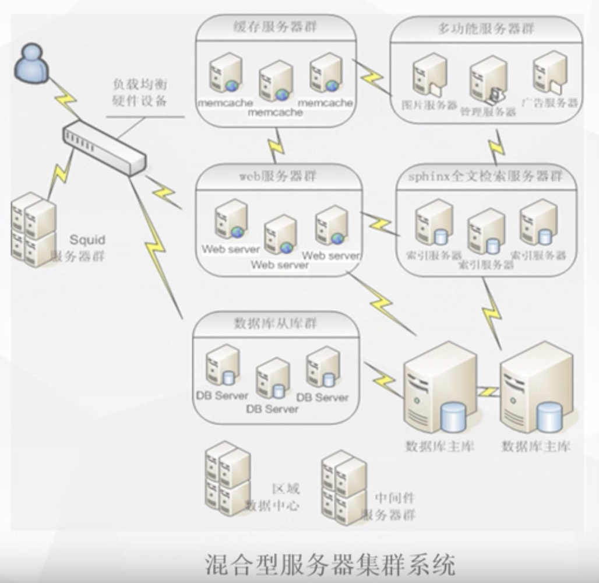

### 1.2 集群技术的目的
1. 增强可靠性

集群技术使系统在故障发生时任可以继续工作，将系统停运时间减到最小，集群系统在提高系统的可靠性的同时，也大大减小了故障损失。

2. 提高性能

一些计算密集型应用，如：科学研究、天气预报、核试验模拟等，需要计算机具有很强的运算处理能力，现有的技术，及时普通的大型计算也很难胜任，这时，
一般都是用计算机集群技术，集中几十台设置上百台计算机的运算能力来满足要求。提高处理性能一直是集群技术研究的一个重要目标之一。

3. 提高可扩展性

用户若想扩展系统能力，不得不购买更高性能的服务器，才能获得额外所需要的CPU和存储器。如果采用集群技术，则只需要将新的服务器加入到集群中即可，
对于客户来看，是完全透明的，服务无论从连续性还是性能上几乎没有变化，好像系统在不知觉中完成了升级。

4. 降低成本

通常一套较好的集群配置，其软硬件开销要超过10W美元。但与价值上百万美元的专用超级计算机相比已属相当便宜。在达到同样性能的条件下，采用计算机集群
比采用同等运算能力的大型计算机具有更高的性价比。

### 1.3 集群系统的分类
1. 高性能计算集群（HPC High-Performance Cluster）

也叫科学集群，充分利用集群系统中的每一台计算机资源，实现负载运算的并行计算，以解决复杂的科学问题。通常用于科学计算领域，比如基因分析，化学
分析等。

2. 高可用性集群（HAC High-Availability Cluster）

高可用性集群的主要目的是为了使集群的整体服务尽可能继续可用，当主服务器故障时，备份服务器能够主动接管主服务器的工作，并及时切换过去，以实现对
用户的不间断、不停机服务。

3. 负载均衡集群（LBC LoadBalancing Cluster）

负载均衡集群的每个节点都可以承担一定处理负载，并且可以实现处理负载在节点之间的动态分配，以实现负载均衡。集中所有的节点都处于活动状态。他们分
摊系统的工作负荷（将大量的并发请求分担到多个处理节点。由于单个处理节点的故障不影响整个服务，负载均衡集群同时也实现了高可用性）。


### 1.4 分布式集群系统
分布式是指将不同的业务分布在不同的地方。而集群指的是将几台服务器集中在一起，实现同一业务。分布式中的每一个节点，都可以做集群。而集群并不一定
就是分布式。  

举例：比如新浪网，访问的人多了，他可以做一个集群，前边放一个响应服务器，后边几台服务器完成同一业务，如果有业务访问的时候，响应服务器看那台服
务器的负载压力小，就将给哪一台去完成。  

而分布式，从窄意义上理解，也跟集群差不多，但是它的组织比较松散；不像集群，有一个组织性，一台服务器垮了，其他的服务器就可以顶上来。分布式的每
一个节点，都完成不同的业务，一个节点垮了，哪这个业务就不可访问了。

- 分布式：一个业务分拆多个子业务，部署在不同的服务器上
- 集群：同一个业务，部署在多个服务器上。  
- 分布式系统是一缩短单个任务的执行时间来提升效率的。
- 而集群系统则是通过提高单位时间内执行的任务数来提升效率的。

### 1.5 服务器集群系统
服务器集群系统就是指通过集群技术将很多服务器集中起来一起进行同一种服务，在客户端看来就像只有一个服务器。  

现在在中大型企业都采用了服务器集群系统，比如：百度、新浪、网易、腾讯、淘宝、京东等。  

然而，对于服务器集群系统来说，用户访问的域名网址都是一样的，那么用户的具体访问请求会交给集群中的那个服务器来处理？如果海量的访问请求，那么
集群系统到底怎么分配这些请求任务给集群系统中的每台服务器?并保证等待时间在用户承受的范围完成响应?同时也要保证服务器能够承受这么大的处理量？

### 1.6 为什么需要负载均衡  
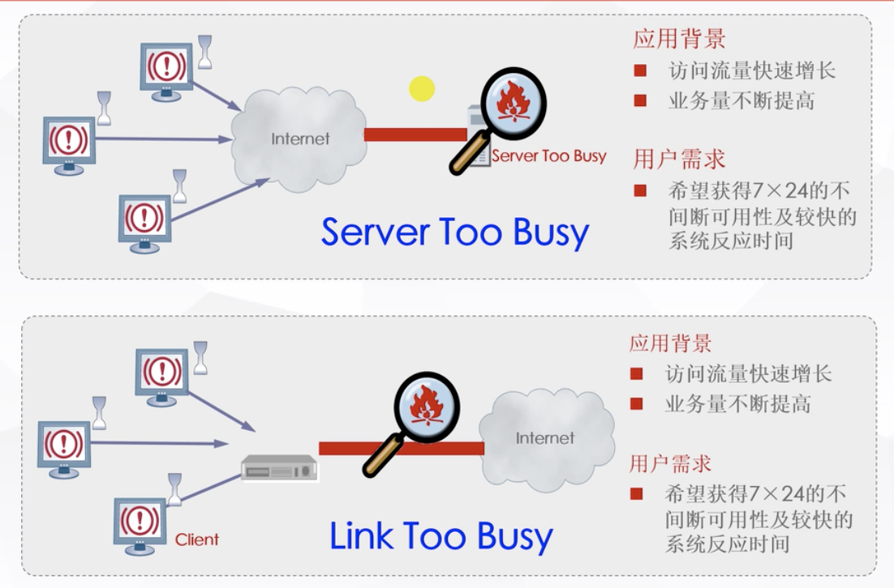

什么是负载均衡：  
当一台服务器的单位时间的访问量越大的时候，服务器的压力会越大。当一台服务器压力大的超过自生承受能力的时候，服务器会崩溃。为了避免服务器的崩溃，
让用户获得更好的体验，我们通常通过负载均衡的方式来分担服务器的压力。那么什么是负载均衡呢？当用户访问我们的网站的时候，先访问一个中间服务器，
再让这个中间服务器在服务集群中选择一个压力较小的服务器，然后讲访问请求引入该选择的服务器。这样，用户的每次访问，都会保证服务器集群中的每个
服务器的压力趋于平衡，分担了服务器的总体压力，避免了服务器崩溃的情况。

解决方案：
1. 服务器负载均衡  
  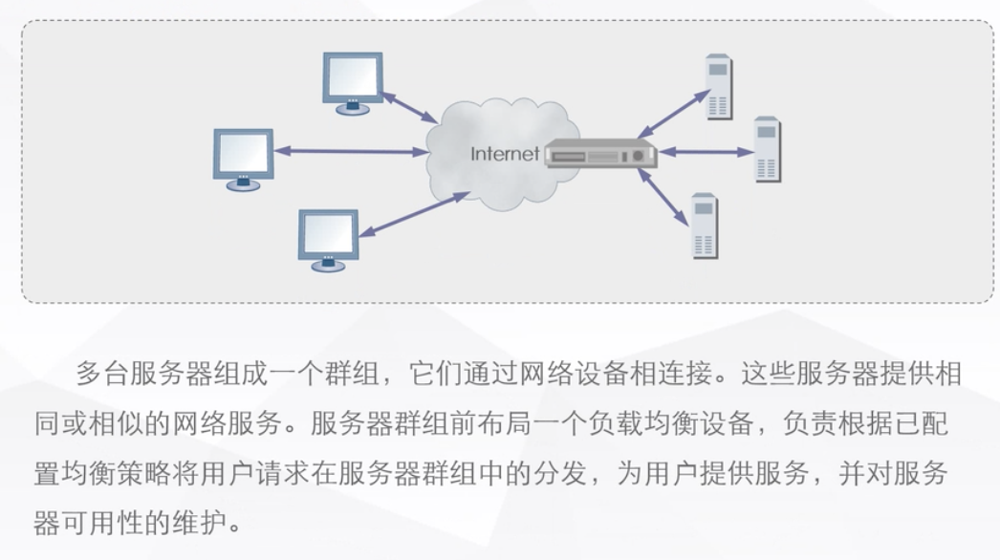  
2. 链路负载均衡  
  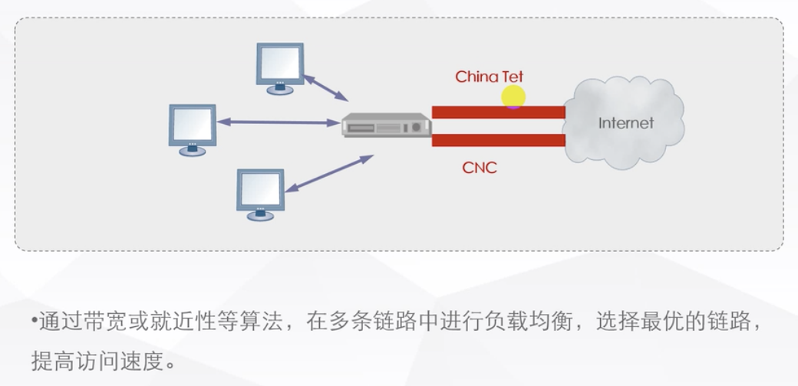  

基本原理：      
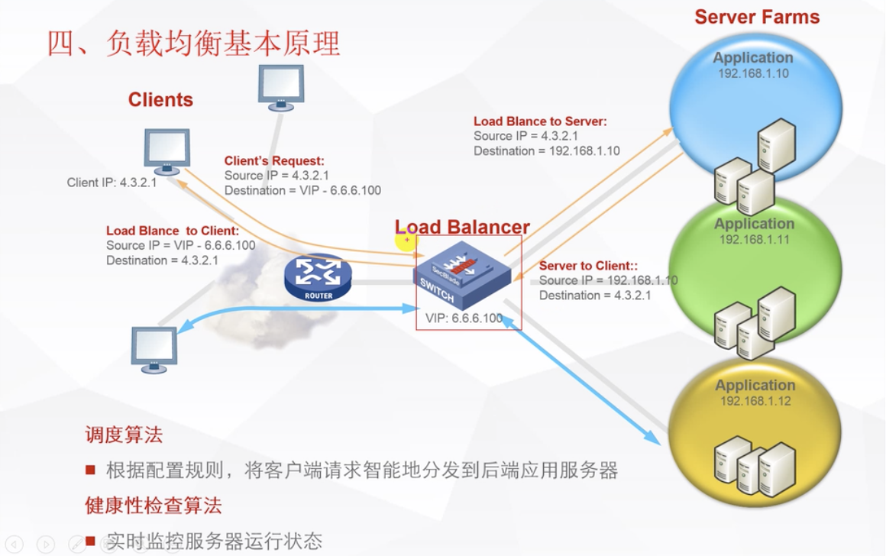  

### 1.7 负载均衡的分类（地理结构）
1. 本地负载均衡技术  
  本地负载均衡技术是本地服务器集群进行负载均处理。该技术通过服务器进行优化，使用浏览能够平均分配在服务器群众的各个服务器上，其能有效的解决数据
  流量过大、网络负荷过重的问题，并且不需要花费昂贵开支购置性能卓越的服务器，充分利用现有设备，避免服务器单点故障造成数据流量的损失。

2. 全局负载均衡技术（广域负载均衡）  
  全局负载均衡技术适用于拥有多个地域的服务器集群的大型网站系统。全局负载均衡技术是对分布在全国各个地区的多个服务器进行负载均衡处理，该技术可以
  通过对访问用户的IP地理位置判定，自动转向地域最近点的服务器集群。也可用于子公司分散站点分布广的大公司通过Intranet（企业内部互联网）来达到资
  源统一合理分配的目的。
  ）

### 1.8 负载均衡的实现方式
1. 软件负载均衡技术    
  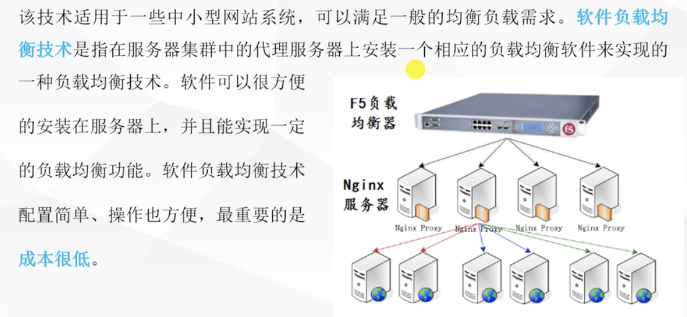  

2. 硬件负载均衡技术    
  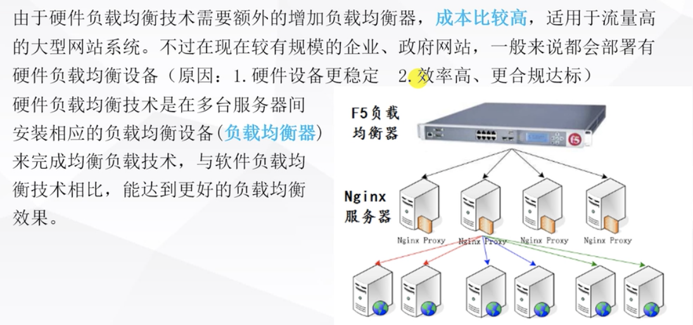  

### 1.9 负载均衡常用算法  
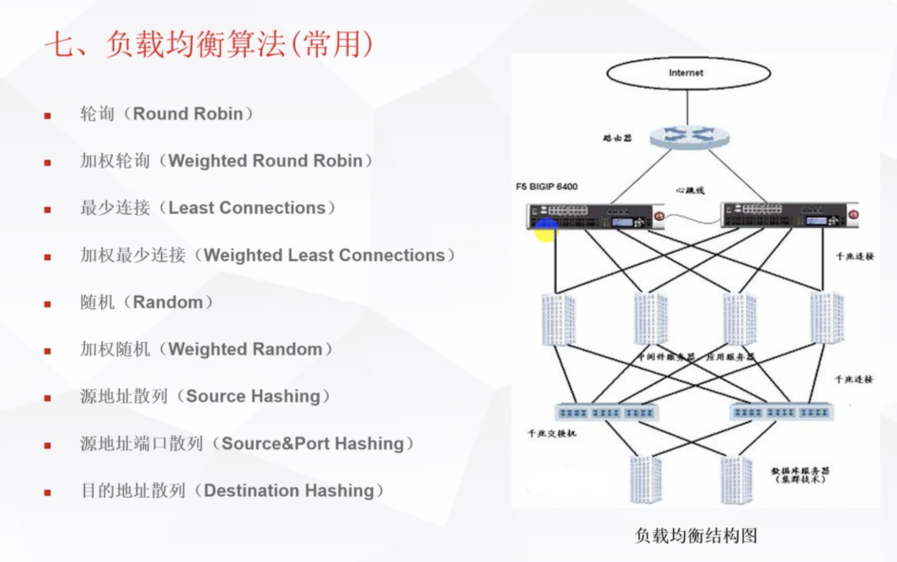

### 1.10 实现机制
任何的负载均衡技术都要想办法简历某种一对多的映射机制：一个请求入口映射到多个处理请求的节点，从而实现分而治之，这种映射机制使得多个物理存在
对外体现为一个虚拟的整体，对服务的请求者屏蔽了内部结构。  
采用不同的机制建立映射关系，可以形成不同的负载均衡技术，常见的包括：

1. 基于DNS的负载均衡   
  通过DNS服务中的随机名字解析来实现负载均衡，在DNS服务器中，可以为多个不同的地址配置同一个名字，而最终查询这个名字的客户机将在解析这个名字时
  得到其中一个地址。因此，对于同一个名字，不同的客户机会得到不同的地址，他们也就访问不同地址上的Web服务器，从而达到负载均衡的目的。

2. 基于CDN的负载均衡    
  待补充
3. 反向代理负载均衡 （如Apache+JK2+Tomcat这种组合）  
  使用代理服务器可以将请求转发给内部的Web服务器，让代理服务器将请求均匀地转发给多台内部Web服务器之一上，从而达到负载均衡的目的。
  这种代理方式 与普通的代理方式有所不同，标准代理方式是客户使用代理访问多个外部Web服务器，而这种代理方式是多个客户使用它访问内部Web服务器，
  因此也被称为反 向代理模式。

4. IP负载均衡    
  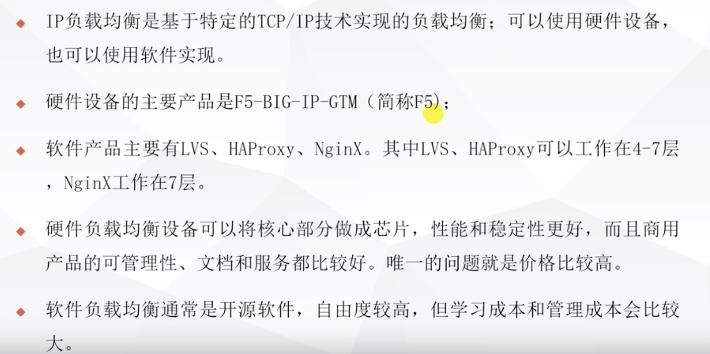

5. 基于NAT（Network Address Translation）的负载均衡技术 （如Linux Virtual Server，简称LVS  
    

## 二、Apache2.4+Tomcat8负载均衡集群配置演示

### 2.1 Apache+Tomcat环境介绍和准备

- Apache+Tomcat集群
- 基于HTTP重定向web服务系统
- Apache+JK+Tomcat

集群前后效果图：  
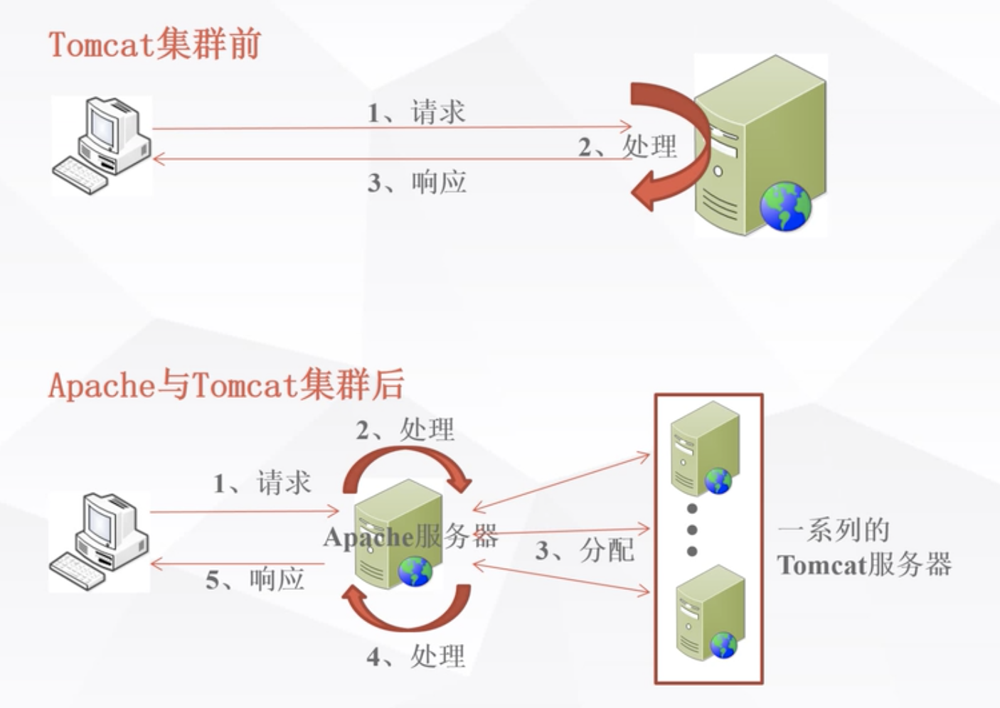

服务请求过程:  
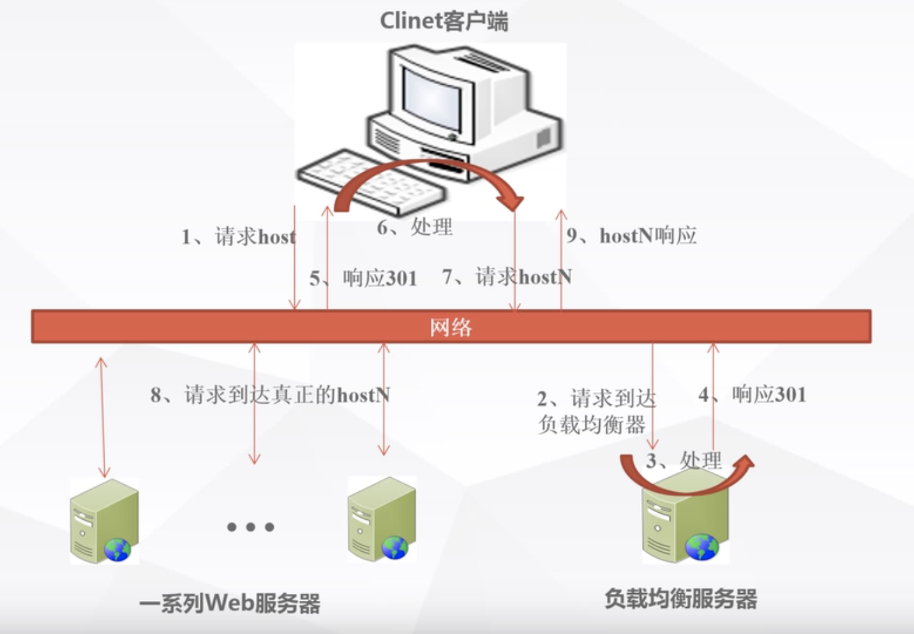  

结构图：  
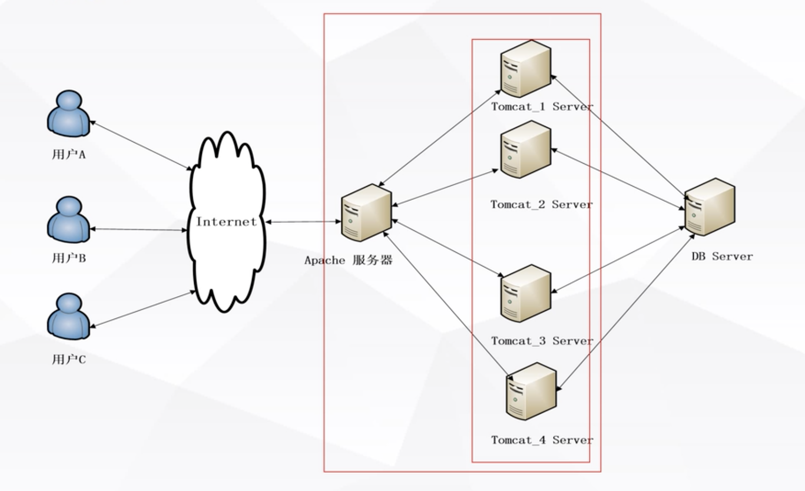

### 2.2 工作原理  
两种访问方式：  
1. 一种是HTTP直连方式  
2. 另一种是使用Apache的jK插件方式   
  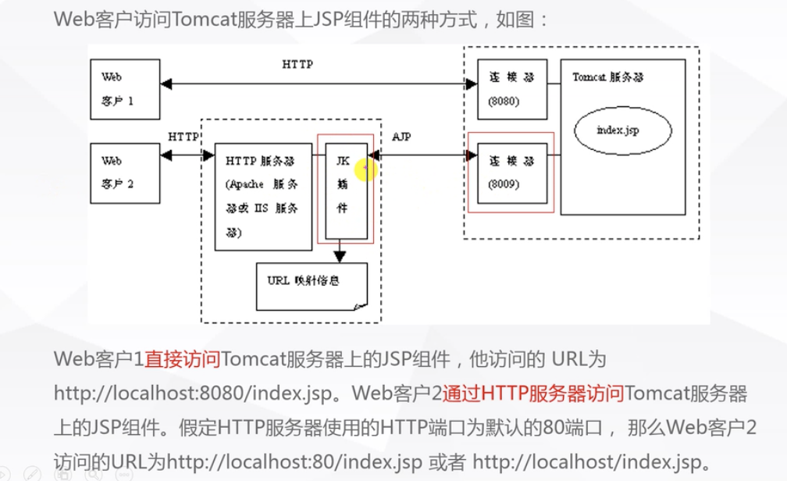
  两种方式中tomcat配置:    
  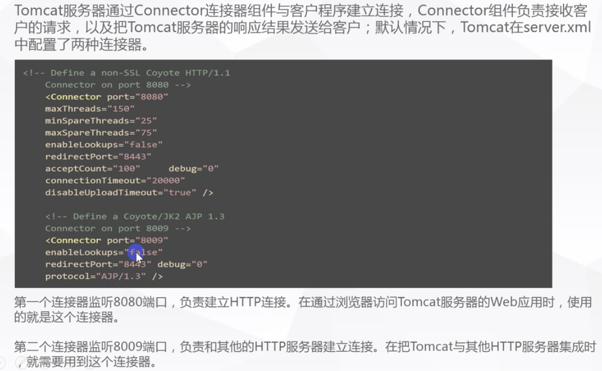

### 2.3 结构图
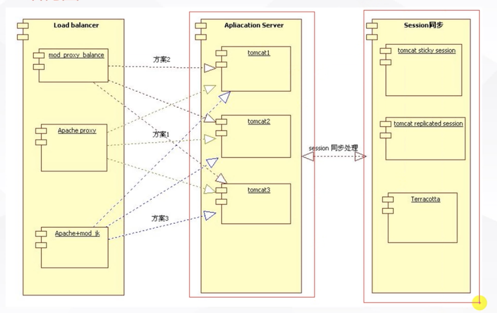

1. Load balancer：三种负载均衡实现方式  
- mod proxy balance    
  代理进行均衡  
- Apache proxy      
  一般不用这种方式，这种方式只是简单做了一个代理的作用，将客户端过来的请求分给配好的几个tomcat服务器，直接的转发过去。  
- Apache+mod jk     
   使用AJP协议进行负载均衡，jk配置灵活，我们主要使用这种方式  

2. Apliacation Server：应用服务器，Tomcat集群  

3. Session的三种同步机制  

- tomcat sticky session    
  一个用户上来之后，他会通过后台的tomcat应用服务器建立一个session，而这个session会与用户进行绑定，同时这个
  session也会与某一个tomcat进行绑定，也就是跟一个服务器进行绑定。那这个用户所有的操作都会自动的分配到这个tomcat里边，不会去其他tomcat里边，
  即该tomcat中的session在其他tomcat中是没有的。这样容易出现一旦某一台tomcat宕机，其他服务器因为没有其session无法服务。

- tomcat replicated session    
  tomcat默认使用的session同步机制，使用这种session同步机制，每个集群中的tomcat服务器会复制其他tomcat服务
  中的session，即集群中的每一个tomcat都有其他tomcat中的session，任何一台服务器宕机，其他服务器会接管下来，不会影响用户的操作。但是当服务器多
  的时候，所有的session都进行共享，每个tomcat都保存这几百个甚至几千个session，那么tomcat就会忙于tomcat之间的数据拷贝，严重影响带宽。
  提示：演示的时候我们使用这种session同步机制

- Terracotta    
  这时一个第三方的支持，他会将所有的tomcat中的session放到一个公共的缓存区里边，优势就是当其中的某台tomcat的数据发生变化的时候，他不是进行
  所有的广播，他能监控到时那个tomcat服务器发生了变化，然后将这个信息发给需要的tomcat，这样就具有针对性。

### 2.4 AJP协议工作原理
这里我主要使用的是Apache的JK插件进行负载均衡演示，其中JK插件通过AJP协议与Tomcat服务器进行通信  
JK插件的负载均衡器根据在worker.properties中配置的lbfactor（负载平衡因数），负责为集群系统中的tomcat服务器分配工作负荷，以实现负载平衡。
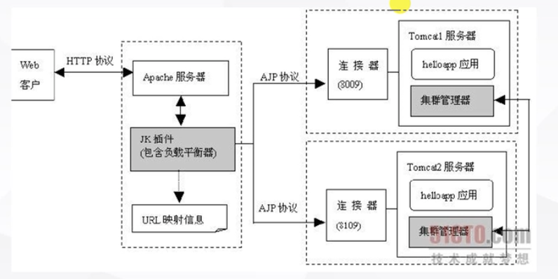  
AJP(Apache Jserv Protocol)是定向协议包。因为性能原因，使用二进制格式来传输可读性文本。web服务器通过tcp连接和servlet容器连接。

- AJP的优点  
1. AJP使用二进制格式来传输可读性文本，在连接上发送的基本请求信息是高度压缩的，Web Server通过TCP连接Application Server,较HTTP性能更高。
2. 为了减少socket的开销，Web Server和Application Server之间尝试保持持久性的TCP连接，对多个request/response循环重用一个链接（ajp建立
  的连接都处于keepalive的状态）
3. 一旦连接分配给一个特定的request，在该request完成之前不会再分配给其他request。因此，request在一个连接上市独占的，这使连接两段的编码变得简洁。
- AJP的缺点：
1. 某一时刻的链接数可能比较多。
2. HTTP Connector可以在Server.xml设置有效时间，而AJP Connector是永久有效的。


## 三、Apahce服务器的配置

### 3.1准备软件
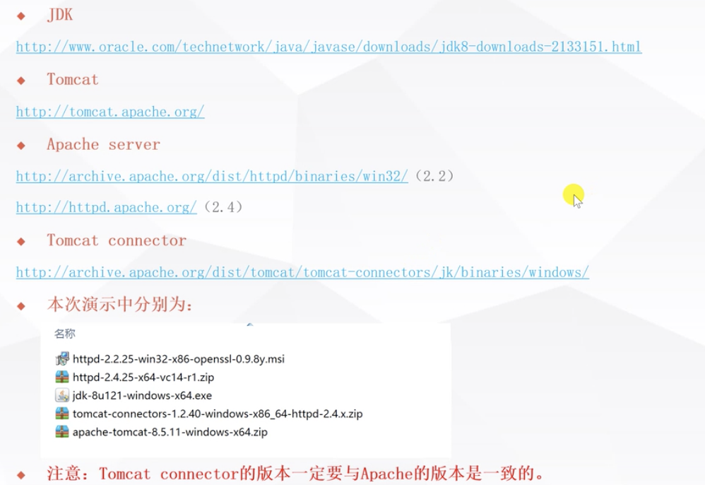

### 3.2 windows中安装apche
1. 修改httpd.conf文件  
  解压后将Define SRVROOT修改为本机的路径  
  

2. 安装
  在控制台终端输入命令
```xml
httpd -k install
```
3. 启动
```xml
httpd -k start
```
4. 访问
  地址栏输入：http://127.0.0.1出现IT WORKS界面，说明安装成功了
  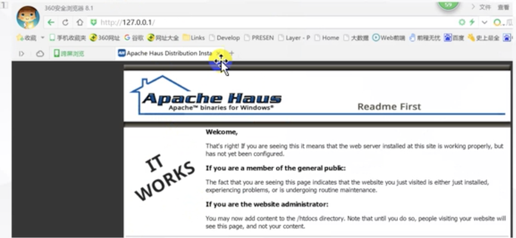

5. 安装windows中安装apche可能出现的错误  
  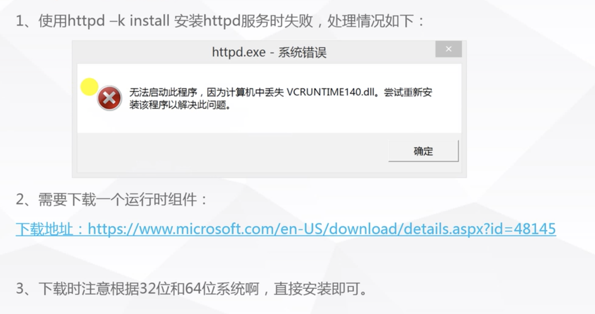

### 3.3 macos中安装apche

1. macos中自带了apche2
```text
hellox:etc root# ls -a /private/etc/apache2/
.			httpd.conf.pre-update	other
..			magic			users
extra			mime.types
httpd.conf		original
```

2. 启用/重启/停止apche
```text
root# apachectl start/restart/stop
```


## 四、Tomcat服务器集群配置

1. 将tomcat分别解压到三个目录，做3台服务器
```text
hellox:~ caojx$ mkdir cluster #新建目录
hellox:~ caojx$ cp Downloads/apache-tomcat-8.5.23.zip cluster/
hellox:~ caojx$ cd cluster/
hellox:cluster caojx$ mkdir cluster-tomcat-1 cluster-tomcat-2 cluster-tomcat-3 #新建三个tomcat目录，后边将tomcat分别解压到3个目录，做3台tomcat服务器
hellox:cluster caojx$ unzip apache-tomcat-8.5.23.zip -d cluster-tomcat-1 #将tomcat解压到指定的目录
hellox:cluster caojx$ unzip apache-tomcat-8.5.23.zip -d cluster-tomcat-2
hellox:cluster caojx$ unzip apache-tomcat-8.5.23.zip -d cluster-tomcat-3
```

2. cluster-tomcat1中修改server.xml
  修改Server中的port端口：  
  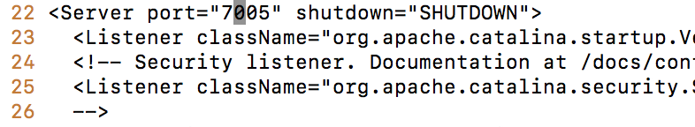  
  修改连接器中的端口:  
    
  修改AJP连接端口：  
  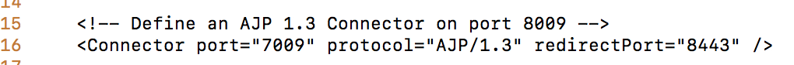  
  解开注释使用集群标签：  
  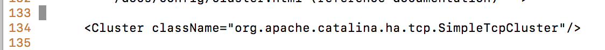  
  jvmRoute给tomcat取一个集群中的名称:    
  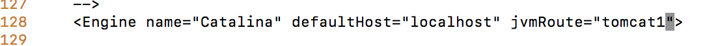  

同样cluster-tomcat2中的server.xml可以修改为
修改Server中的port端口：  
  
修改连接器中的端口:  
  
修改AJP连接端口：  
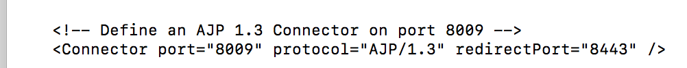  
解开注释使用集群标签和tomcat名称：
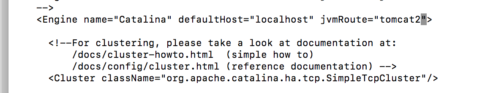  

同理cluster-tomcat3中的server.xml将响应的端口递增一下即可。

3. cluster-tomcat1配置
- 在cluster/cluster-tomcat1/apache-tomcat-8.5.23/webapps下，创建TestCluster文件夹；
- 然后将ROOT文件夹下的WEB-INF文件夹拷贝到TestCluster下
- 打开TestCluster/WEB-INF\web.xml修改，在</web-app>上面添加 \<distributable/> (设置 \<distributable/>,即表明集群下某一个节点生成或发
  生改变的session，将广播到该集群中的其他节点实现session共享),web.xml内容如下：
```xml
<?xml version="1.0" encoding="UTF-8"?>

<web-app xmlns="http://xmlns.jcp.org/xml/ns/javaee"
  xmlns:xsi="http://www.w3.org/2001/XMLSchema-instance"
  xsi:schemaLocation="http://xmlns.jcp.org/xml/ns/javaee
                      http://xmlns.jcp.org/xml/ns/javaee/web-app_3_1.xsd"
  version="3.1"
  metadata-complete="true">

  <display-name>Welcome to Tomcat</display-name>
  <description>
     Welcome to Tomcat
  </description>

  <distributable/>
</web-app>

```
- 在TestCluster文件夹下新建index.jsp，内容如下：
```jsp
<%--
  Created by IntelliJ IDEA.
  User: caojx
  Date: 2017/10/8
  Time: 下午10:05
  To change this template use File | Settings | File Templates.
--%>
<%@ page contentType="text/html;charset=UTF-8" language="java" %>
<%@ page language="java" import="java.util.*" %>
<%@ page import="java.text.SimpleDateFormat" %>
<%@ page import="java.util.Date" %>
<%@ page import="java.awt.*" %>
<html>
<head>
    <title>TestCluster</title>
</head>
<body>

    <%
    //如果有新的Session属性设置
        String dataName = request.getParameter("dataName");
        if(dataName != null && dataName.length() > 0){
            String dataValue = request.getParameter("dataValue");
            session.setAttribute(dataName,dataValue);
        }
    %>
    Server Info:

    <%
        String date = new SimpleDateFormat("yyyy-MM-dd hh:mm:ss").format(new Date());
        System.out.println("["+request.getLocalAddr()+":"+request.getLocalPort()+"]"+date);
        out.println("<br>["+request.getLocalAddr()+":"+request.getLocalPort()+"]"+date+"<br><br>");
    %>


   Session Info:

   <%
       out.println("<br>[Session Info] Session ID:"+session.getId()+"<br>");
       System.out.println("<br>[Session Info] Session ID:"+session.getId());
       Enumeration e = session.getAttributeNames();
       while (e.hasMoreElements()){
           String name = (String) e.nextElement();
           String value = session.getAttribute(name).toString();
           System.out.println(name+"="+value);
           out.println(name+"="+value+"<br>");
       }
   %>


    <form action="index.jsp" method="post">
        Name:<input type="text" size="20" name="dataName"><br>
        Value:<input type="text" size="20" name="dataValue"><br>
        <input type="submit">
    </form>

</body>
</html>
```

同样，将TestCluster拷贝到cluster-tomcat-2/apache-tomcat-8.5.23/webapps和cluster-tomcat-3/apache-tomcat-8.5.23/webapps下。

4. 启动3台tomcat
```shell
caojx$ /Users/caojx/cluster/cluster-tomcat-1/apache-tomcat-8.5.23/bin/startup.sh
caojx$ /Users/caojx/cluster/cluster-tomcat-2/apache-tomcat-8.5.23/bin/startup.sh
caojx$ /Users/caojx/cluster/cluster-tomcat-3/apache-tomcat-8.5.23/bin/startup.sh
```
启动后可以看到3台服务器的session是共享的  
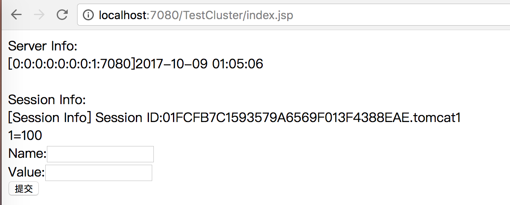
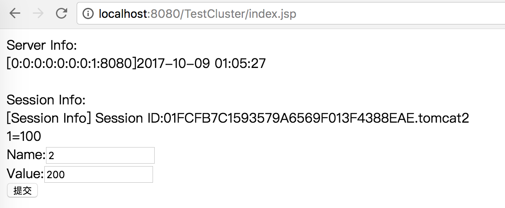
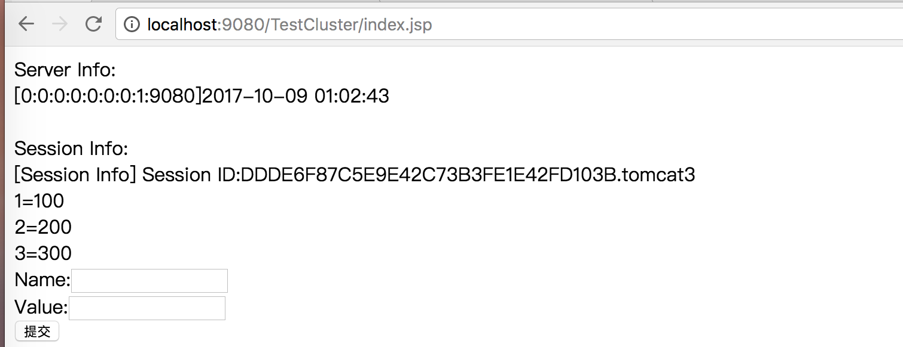

## 五、负载均衡配置

Tomcat配置不做变动，下边是对Apache进行配置：  

1. 配置mod_jk.so  
  下载对应版本的mod_jk-1.2.24-httpd-2.2.4.so，如mac版本的下载地址  
  [https://archive.apache.org/dist/tomcat/tomcat-connectors/jk/binaries/macosx/jk-1.2.24/x86/](https://archive.apache.org/dist/tomcat/tomcat-connectors/jk/binaries/macosx/jk-1.2.24/x86/)

2. 将mod_jk.so 拷贝到%APCHE_HOME%\modules目录下  
  提示：如果没有modules目录可以手动建立  

3. 在%APACHE_HOME%\conf目录下新建文件workers.properties
```properties
#声明所有jk管理的tomcat服务器节点，其中tomcat1，tomcat2，tomcat3名称对应tomcat中server.xml配置文件中的jvmRoute的值
#controller可以看做是不在均衡器
worker.list=controller,tomcat1,tomcat3

#=======tomcat1==========
#tomcat服务器中ajp协议连接端口
worker.tomcat1.port=7009
#tomcat服务器主机地址
worker.tomcat1.host=127.0.0.1
#tomcat中ajp连接协议
worker.tomcat1.type=ajp13
#权重，权重越大访问量越多
worker.tomcat1.lbfactor=1

#======tomcat2===========
worker.tomcat2.port=8009
worker.tomcat2.host=127.0.0.1
worker.tomcat2.type=ajp13
worker.tomcat2.lbfactor=1

#======tomcat3==========
worker.tomcat3.port=9009
worker.tomcat3.host=127.0.0.1
worker.tomcat3.type=ajp13
worker.tomcat3.lbfactor=1

#======controller=======
#lb(load balance )负载均衡
worker.controller.type=lb
#负载均衡的节点列表
worker.controller.balanced_workers=tomcat1,tomcat2,tomcat3
#session同步的方式，不使用sticky_sessoin
worker.controller.sticky_session=false
```

4. 新建mod_jk.conf文件  
  在%APACHE_HOME%\conf目录下新建mod_jk.conf,内容如下
```text
LoadModule jk_module /private/etc/apache2/modules/mod_jk-1.2.24-httpd-2.2.4.so
JkWorkersFile /private/etc/apache2/conf/workers.properties
JkMount /* controller
```
说明： 
LoadModule - mod_jk-1.2.24-httpd-2.2.4.so 的位置  
JKWorkersFile - workers.properties的位置    
JKMount - Apache将http://localhost/下的所有请求转发给controller处理  

5. 修改%APACHE_HOME%\conf\httpd.conf，在末尾添加如下内容  
```text
Include /private/etc/apache2/conf/mod_jk.conf
```

6. 修改http.conf中的apache的端口
```text
Listen 80
```

7. 启动apache访问
```text
apachectl start
```
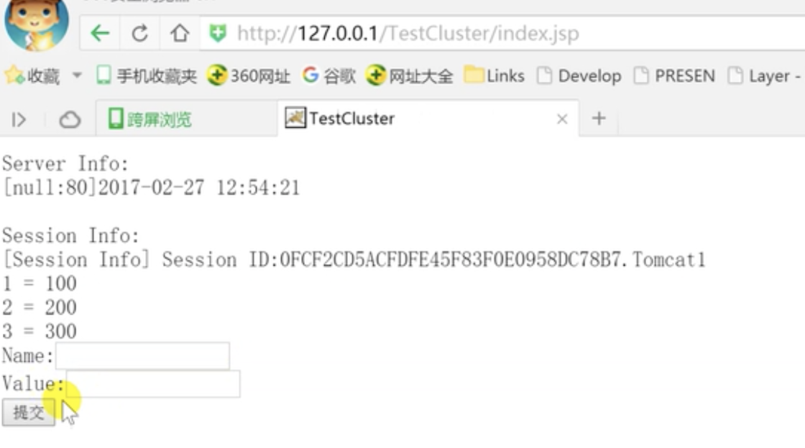

8. 并发测试  
```text
ab -n 10000 -c 20 http://127.0.0.1/TestCluster/index.jsp

n：代表总请求数量
c: 代表并发请求数
url： 为压力测试的地址，不支持https协议
```

参考：  
[http://tomcat.apache.org/tomcat-3.3-doc/mod_jk-howto.html#s64](http://tomcat.apache.org/tomcat-3.3-doc/mod_jk-howto.html#s64)  
[https://ke.qq.com/course/189120](https://ke.qq.com/course/189120)  
[http://www.cnblogs.com/litubin/articles/4795248.html](http://www.cnblogs.com/litubin/articles/4795248.html)  
[http://www.cnblogs.com/leslies2/archive/2012/07/23/2603617.html](http://www.cnblogs.com/leslies2/archive/2012/07/23/2603617.html)