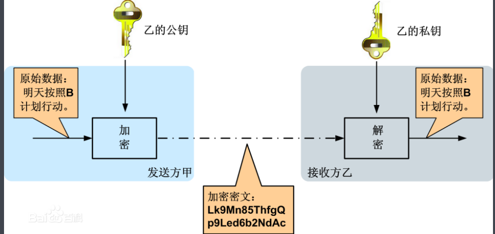

[toc]

## 一、tomcat中配置https


HTTPS（全称：Hyper Text Transfer Protocol over Secure Socket Layer），是以安全为目标的HTTP通道，简单讲是HTTP的安全版。即HTTP下加入SSL层，HTTPS的安全基础是SSL（即https是http+ssl协议组成的），因此加密的详细内容就需要SSL。 它是一个URI scheme（抽象标识符体系），句法类同http:体系。用于安全的HTTP数据传输。https:URL表明它使用了HTTP，但HTTPS存在不同于HTTP的默认端口及一个加密/身份验证层（在HTTP与TCP之间）。这个系统的最初研发由网景公司(Netscape)进行，并内置于其浏览器Netscape Navigator中，提供了身份验证与加密通讯方法。现在它被广泛用于万维网上安全敏感的通讯，例如交易支付方面。

与http区别:  
* 一、https协议需要到ca申请证书，一般免费证书很少，需要交费。    
* 二、http是超文本传输协议，信息是明文传输，https 则是具有安全性的ssl加密传输协议。    
* 三、http和https使用的是完全不同的连接方式，用的端口也不一样，前者是80，后者是443。        
* 四、http的连接很简单，是无状态的；HTTPS协议是由SSL+HTTP协议构建的可进行加密传输、身份认证的网络协议，比http协议安全。  

SSL协议:  
　　SSL安全套接层协议(Secure Socket Layer)  
　　为Netscape所研发，用以保障在Internet上数据传输之安全，利用数据加密(Encryption)技术，可确保数据在网络上之传输过程中不会被截取及窃听。目前一般通用之规格为40 bit之安全标准，美国则已推出128 bit之更高安全标准，但限制出境。只要3.0版本以上之IE.或Netscape浏览器即可支持SSL。  
　　当前版本为3.0。它已被广泛地用于Web浏览器与服务器之间的身份认证和加密数据传输。  
SSL协议位于TCP/IP协议与各种应用层协议之间，是一种国际标准的加密及身份认证通信协议,为TCP提供一个可靠的端到端的安全服务，为两个通讯个体之间提供保密性和完整性(身份鉴别)。SSL协议可分为两层：SSL记录协议（SSL Record Protocol）：它建立在可靠的传输协议（如TCP）之上，为高层协议提供数据封装、压缩、加密等基本功能的支持。SSL握手协议（SSL Handshake Protocol）：它建立在SSL记录协议之上，用于在实际的数据传输开始前，通讯双方进行身份认证、协商加密算法、交换加密密钥等。  

### 1.1非对称加密



比如说：A需要给B发送数据，A会产生一个公钥和一个私钥（公钥私钥有个特点，公钥加密的数据只能私钥解，私钥加密的数据只能公钥解），A将会拿到B的公钥对需要发送给A的数据进行加密，这样B是使用自己私钥就可对数据进行解密，发送数据的时候，使用的就是加密后的数据。  


如图：  
（B的公钥对数据进行加密）        （B接受到数据后，使用B的私钥对数据进行解密）

A  ----------------------------------------------------------------> B
（B公钥）  
（B私钥）  
  
漏洞  
对于上边的案例，是有漏洞的。如果A和之间有第三者C在A获取到B的公钥之前获取了B的公钥，这里假如C是一个坏人。截获到B的公钥后，没有将B的公钥发送到A那里转而将C自己的公钥发送给A，而A却并不知道使用C的公钥对发送的数据进行加密，C再次截获到B发回的数据后可以使用C的私钥进行解密，从而造成数据泄露。  

>数字证书验证：  
对于上边这种安全的问题，互联网是这样解决的，通过CA这样的第三方机构，这里假如A还是给B发送数据，B会将自己的公钥交给CA机构对其公钥进行担保，CA机构根据B的公钥会生成一份数字证书（数字证书中包含B的公钥，以及其他信息），这里A给B发送数据时候，获取的是CA对B的公钥生成的数字证书，A可以对数字证书进行验证是否真的是CA颁发的，如果是，则使用数字证书中B的公钥对数据进行加密，并且使用自己的私钥对数据再进行加密（数据签名），同时将自己的公钥发送给B，再将加密数据发送给B，B是自己的私钥和B的公钥对数据进行解密，则证明这个数据一定是A发出的，因为A的私钥只有A有，我可以使用B的公钥对数据解密，则可以说明是A发送出来的数据。  

### 1.2生成服务器证书  
这里使用JDK中自带的工具java/jdk1.7.0_80/bin/keytool  

创建数字证书命令：
>keytool -genkeypair -alias “tomcat” -keyalg “RSA” -keystore “/home/caojx/temp/tomcat.keystore” -validity 36500

参数:
-genkeypair生成密钥对  
-alias “别名”  
-keyalg “RSA”，RSA为加密算法  
-keystore “生成的数字证书的保存路径” ，之后可以在这里找到生成的数字证书文件  
-validity 36500 含义是证书有效期，36500表示100年，默认值是90天  

注意事项：  
（1）    生成证书的时间，如果IE客户端所在机器的时间早于证书生效时间，或者晚于有效时间，IE会提示“该安全证书已到期或还未生效”  
（2）    如果IE提示“安全证书上的名称无效或者与站点名称不匹配”，则是由生成证书时填写的服务器所在主机的域名“您的名字与姓氏是什么？”/“What is your first and last name?”不正确引起的  


>注意：其中秘钥库口令（即密码）至少6为，这里不会显示，我输入了123456
您的名字与姓氏是什么?，这里不是填写你的名字或姓名，而是说你为那个网站生成数字证书。

您的组织单位名称是什么?，您的组织名称是什么?您所在的城市或区域名称是什么?您所的省/市/自治区名称是什么?该单位的双字母国家/地区代码是什么?，这些都可以不填写。

## 二、tomcat中配置https,加密连接器

### 2.1环境
Windows
JDK1.7
Tomcat7.0

### 2.2将数字证书复制到
>cp /home/caojx/temp/tomcat.keystore /usr/local/apache-tomcat-7.0.67/conf/


### 2.3 在tomcat安装目录的server.xml文件中添加

```xml
<Connector port="8443" connectionTimeout="20000" protocol="org.apache.coyote.http11.Http11Protocol"  maxThreads="150" SSLEnabled="true" scheme="https" secure="true" clientAuth="false" sslProtocol="TLS" keystoreFile="/usr/local/apache-tomcat-7.0.67/conf/tomcat.keystore" keystorePass="123456"/>
```

keystoreFile 证书文件的位置  
keystorePass 证书的主密码  

下边server.xml文件  
```xml
<?xml version='1.0' encoding='utf-8'?>
<!--
  Licensed to the Apache Software Foundation (ASF) under one or more
  contributor license agreements.  See the NOTICE file distributed with
  this work for additional information regarding copyright ownership.
  The ASF licenses this file to You under the Apache License, Version 2.0
  (the "License"); you may not use this file except in compliance with
  the License.  You may obtain a copy of the License at

      http://www.apache.org/licenses/LICENSE-2.0

  Unless required by applicable law or agreed to in writing, software
  distributed under the License is distributed on an "AS IS" BASIS,
  WITHOUT WARRANTIES OR CONDITIONS OF ANY KIND, either express or implied.
  See the License for the specific language governing permissions and
  limitations under the License.
-->
<!-- Note:  A "Server" is not itself a "Container", so you may not
     define subcomponents such as "Valves" at this level.
     Documentation at /docs/config/server.html
 -->
<Server port="8005" shutdown="SHUTDOWN">
  <Listener className="org.apache.catalina.startup.VersionLoggerListener" />
  <!-- Security listener. Documentation at /docs/config/listeners.html
  <Listener className="org.apache.catalina.security.SecurityListener" />
  -->
  <!--APR library loader. Documentation at /docs/apr.html -->
  <Listener className="org.apache.catalina.core.AprLifecycleListener" SSLEngine="on" />
  <!--Initialize Jasper prior to webapps are loaded. Documentation at /docs/jasper-howto.html -->
  <Listener className="org.apache.catalina.core.JasperListener" />
  <!-- Prevent memory leaks due to use of particular java/javax APIs-->
  <Listener className="org.apache.catalina.core.JreMemoryLeakPreventionListener" />
  <Listener className="org.apache.catalina.mbeans.GlobalResourcesLifecycleListener" />
  <Listener className="org.apache.catalina.core.ThreadLocalLeakPreventionListener" />

  <!-- Global JNDI resources
       Documentation at /docs/jndi-resources-howto.html
  -->
  <GlobalNamingResources>
    <!-- Editable user database that can also be used by
         UserDatabaseRealm to authenticate users
    -->
    <Resource name="UserDatabase" auth="Container"
              type="org.apache.catalina.UserDatabase"
              description="User database that can be updated and saved"
              factory="org.apache.catalina.users.MemoryUserDatabaseFactory"
              pathname="conf/tomcat-users.xml" />
  </GlobalNamingResources>

  <!-- A "Service" is a collection of one or more "Connectors" that share
       a single "Container" Note:  A "Service" is not itself a "Container",
       so you may not define subcomponents such as "Valves" at this level.
       Documentation at /docs/config/service.html
   -->
  <Service name="Catalina">

    <!--The connectors can use a shared executor, you can define one or more named thread pools-->
    <!--
    <Executor name="tomcatThreadPool" namePrefix="catalina-exec-"
        maxThreads="150" minSpareThreads="4"/>
    -->


    <!-- A "Connector" represents an endpoint by which requests are received
         and responses are returned. Documentation at :
         Java HTTP Connector: /docs/config/http.html (blocking & non-blocking)
         Java AJP  Connector: /docs/config/ajp.html
         APR (HTTP/AJP) Connector: /docs/apr.html
         Define a non-SSL HTTP/1.1 Connector on port 8080
    -->
    <!-- 配置https的时候，这个可以不用配置，http和https同时配置的话
    	可以同时使用https和http访问
    -->
    <Connector port="8888" protocol="HTTP/1.1"
               connectionTimeout="20000"
               redirectPort="8443" />
    <!-- A "Connector" using the shared thread pool-->
    <!--
    <Connector executor="tomcatThreadPool"
               port="8080" protocol="HTTP/1.1"
               connectionTimeout="20000"
               redirectPort="8443" />
    -->
    <!-- Define a SSL HTTP/1.1 Connector on port 8443
         This connector uses the BIO implementation that requires the JSSE
         style configuration. When using the APR/native implementation, the
         OpenSSL style configuration is required as described in the APR/native
         documentation -->
    <!--
    <Connector port="8443" protocol="org.apache.coyote.http11.Http11Protocol"
               maxThreads="150" SSLEnabled="true" scheme="https" secure="true"
               clientAuth="false" sslProtocol="TLS" />
    -->
	<Connector port="8443" protocol="org.apache.coyote.http11.Http11Protocol"
               maxThreads="150" SSLEnabled="true" scheme="https" secure="true"
               clientAuth="false" sslProtocol="TLS" keystoreFile="/usr/local/apache-tomcat-7.0.67/conf/tomcat.keystore" keystorePass="123456"
	/>

    <!-- Define an AJP 1.3 Connector on port 8009 -->
    <Connector port="8009" protocol="AJP/1.3" redirectPort="8443" />


    <!-- An Engine represents the entry point (within Catalina) that processes
         every request.  The Engine implementation for Tomcat stand alone
         analyzes the HTTP headers included with the request, and passes them
         on to the appropriate Host (virtual host).
         Documentation at /docs/config/engine.html -->

    <!-- You should set jvmRoute to support load-balancing via AJP ie :
    <Engine name="Catalina" defaultHost="localhost" jvmRoute="jvm1">
    -->
    <Engine name="Catalina" defaultHost="localhost">

      <!--For clustering, please take a look at documentation at:
          /docs/cluster-howto.html  (simple how to)
          /docs/config/cluster.html (reference documentation) -->
      <!--
      <Cluster className="org.apache.catalina.ha.tcp.SimpleTcpCluster"/>
      -->

      <!-- Use the LockOutRealm to prevent attempts to guess user passwords
           via a brute-force attack -->
      <Realm className="org.apache.catalina.realm.LockOutRealm">
        <!-- This Realm uses the UserDatabase configured in the global JNDI
             resources under the key "UserDatabase".  Any edits
             that are performed against this UserDatabase are immediately
             available for use by the Realm.  -->
        <Realm className="org.apache.catalina.realm.UserDatabaseRealm"
               resourceName="UserDatabase"/>
      </Realm>

      <Host name="localhost"  appBase="webapps"
            unpackWARs="true" autoDeploy="true">

        <!-- SingleSignOn valve, share authentication between web applications
             Documentation at: /docs/config/valve.html -->
        <!--
        <Valve className="org.apache.catalina.authenticator.SingleSignOn" />
        -->

        <!-- Access log processes all example.
             Documentation at: /docs/config/valve.html
             Note: The pattern used is equivalent to using pattern="common" -->
        <Valve className="org.apache.catalina.valves.AccessLogValve" directory="logs"
               prefix="localhost_access_log." suffix=".txt"
               pattern="%h %l %u %t &quot;%r&quot; %s %b" />

      </Host>
    </Engine>
  </Service>
</Server>
```
### 2.3 启动tomcat

点击继续前往localhost


提示：http://localhost:8888同样是可以访问的，因为我们同时配置了http和https连接  
如果使用linux的话，https是不能直接开启的，还需要手动配置  

## 三、配置访问http的时候，自动跳转到https

3.1注意server.xml中的如下2处配置  
1.http配置
```xml
 <Connector port="8888" protocol="HTTP/1.1"
               connectionTimeout="20000"
               redirectPort="8443" />
```

2.https配置
```xml
<Connector port="8443" protocol="org.apache.coyote.http11.Http11Protocol"
maxThreads="150" SSLEnabled="true" scheme="https" secure="true" clientAuth="false" sslProtocol="TLS" keystoreFile="/usr/local/apache-tomcat-7.0.67/conf/tomcat.keystore" keystorePass="123456"/>
```
3.2 编辑web.xml
/usr/local/apache-tomcat-7.0.67/conf/web.xml

在 welcome-file-list后边添加
```xml
<login-config>
<!-- Authorization setting for SSL -->
	<auth-method>CLIENT-CERT</auth-method>
	<realm-name>Client Cert Users-only Area</realm-name>
</login-config>
<security-constraint>
 	<!-- Authorization setting for SSL -->
	<web-resource-collection >
		<web-resource-name >SSL</web-resource-name>
		<url-pattern>/*</url-pattern>
	</web-resource-collection>
	<user-data-constraint>
		<transport-guarantee>CONFIDENTIAL</transport-guarantee>
	</user-data-constraint>
</security-constraint>
```
再次启动tomcat，输入http://localhost:8888 就会自动跳转到https://localhost:8443


## 四、为客户端生成证书

以下内容没有测试，来自http://licg1234.blog.163.com/blog/static/13908233320121165356868/

 
为浏览器生成证书，以便让服务器来验证它。为了能将证书顺利导入至IE和Firefox，证书格式应该是PKCS12，因此，使用如下命令生成：
 
>keytool -genkey -v -alias mykey -keyalg RSA -storetype PKCS12 -keystore D:\home\mykey.p12
 
对应的证书库存放在“D:\home\mykey.p12”，客户端的CN可以是任意值。双击mykey.p12文件，即可将证书导入至浏览器（客户端）。
 
## 五、让服务器信任客户端证书
 
由于是双向SSL认证，服务器必须要信任客户端证书，因此，必须把客户端证书添加为服务器的信任认证。由于不能直接将PKCS12格式的证书库导入，必须先把客户端证书导出为一个单独的CER文件，使用如下命令：
 
>keytool -export -alias mykey -keystore D:\home\mykey.p12 -storetype PKCS12 -storepass password -rfc -file D:\home\mykey.cer
 
通过以上命令，客户端证书就被我们导出到“D:\home\mykey.cer”文件了。下一步，是将该文件导入到服务器的证书库，添加为一个信任证书：
 
>keytool -import -v -file D:\home\mykey.cer -keystore D:\home\tomcat.keystore
 
通过list命令查看服务器的证书库，可以看到两个证书，一个是服务器证书，一个是受信任的客户端证书：
 
>keytool -list -keystore D:\home\tomcat.keystore
 
## 六、让客户端信任服务器证书
 
由于是双向SSL认证，客户端也要验证服务器证书，因此，必须把服务器证书添加到浏览的“受信任的根证书颁发机构”。由于不能直接将keystore格式的证书库导入，必须先把服务器证书导出为一个单独的CER文件，使用如下命令：
 
>keytool -keystore D:\home\tomcat.keystore -export -alias tomcat -file D:\home\tomcat.cer
 
 
通过以上命令，服务器证书就被我们导出到“D:\home\tomcat.cer”文件了。双击tomcat.cer文件，按照提示安装证书，将证书填入到“受信任的根证书颁发机构”。

## 七、配置Tomcat服务器
 
打开Tomcat根目录下的/conf/server.xml，找到如下配置段，修改如下：
```xml
<Connector port="8443" protocol="org.apache.coyote.http11.Http11NioProtocol"
SSLEnabled="true" maxThreads="150" scheme="https"
secure="true" clientAuth="true" sslProtocol="TLS"
keystoreFile="D:\\home\\test.keystore" keystorePass="123456"
truststoreFile="D:\\home\\test.keystore" truststorePass="123456" />
```
属性说明：  
clientAuth:设置是否双向验证，默认为false，设置为true代表双向验证  
keystoreFile:服务器证书文件路径  
keystorePass:服务器证书密码  
truststoreFile:用来验证客户端证书的根证书，此例中就是服务器证书  
truststorePass:根证书密码  
## 八、测试
 
在浏览器中输入:https://localhost:8443/，会弹出选择客户端证书界面，点击“确定”，会进入tomcat主页，地址栏后会有“锁”图标，表示本次会话已经通过HTTPS双向验证，接下来的会话过程中所传输的信息都已经过SSL信息加密。  


注意事项：貌似导入证书的时候，最好导入到“个人”那一栏里面，貌似客户端的用户名不填写也是可以的，或者随便填写。  

参考文章：http://blog.sina.com.cn/s/blog_618592ea01012q40.html


