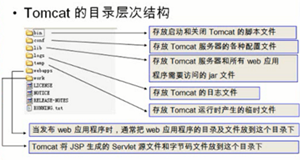
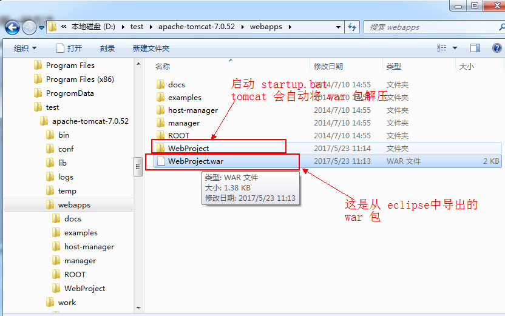
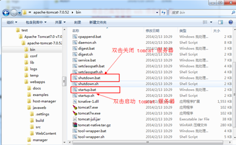
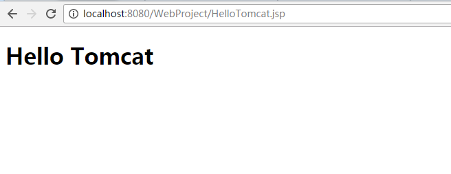
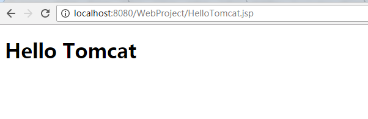
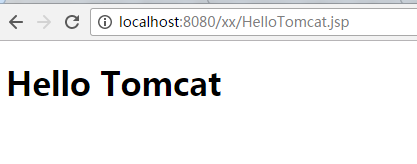
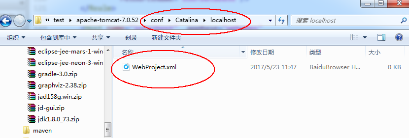
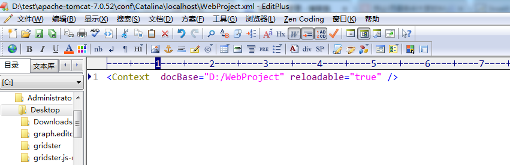
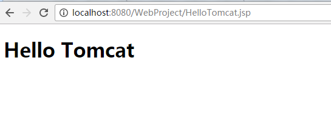

#  Tomcat 部署项目的三种方式

*转载*  2017-06-01   作者：YSOcean http://www.jb51.net/article/115084.htm#comments

本篇文章主要介绍了Tomcat 部署项目的三种方法详解，小编觉得挺不错的，现在分享给大家，也给大家做个参考。一起跟随小编过来看看吧

##  一、Tomcat安装

**1、下载 Tomcat 服务器**

　　①、官网下载地址：<http://tomcat.apache.org/>

　　②、Tomcat 8.5.11 32位/64位 官方免费版下载地址：<http://www.jb51.net/softs/537911.html>

**2、启动并部署 Tomcat 服务器**

　　①、解压 tomcat 安装包到一个非中文目录下

　　②、配置环境变量。JAVA_HOME(指向 JDK 安装的根目录)

　　③、双击 apache-tomcat-6.0.16\bin 目录下的 startup.bat，启动服务器(如果一闪而过，那就是没有配置 JAVA_HOME 的环境变量)

　　④、在浏览器中输入 [http://localhost:8080](http://localhost:8080/)

注意：Tomcat 启动不了的时候注意配置 JAVA_HOME:C:\Program Files\Java\jdk1.6.0_43这是安装 JDK的根目录

**3、Tomcat 的目录结构**

　    
　
##  二、部署方式一
**4、部署项目的第一种方法（项目直接放入 webapps 目录中）**

1、将编写并编译好的web项目(注意要是编译好的，如果是 eclipse，可以将项目打成 war 包放入)，放入到 webapps 中

　  

2、启动tomcat服务器（双击 apache-tomcat-6.0.16\bin 目录下的 startup.bat，启动服务器）

　  

3、在浏览器输入：<http://localhost:8080/>项目名/访问的文件名

　   

##  三、部署方式二
**5、部署项目的第二种方法（修改 conf/server.xml 文件 ）**

　　①、打开tomcat下conf/server.xml，在<Host> </Host>标签之间输入项目配置信息

```
<Context path="/WebProject" docBase="D:/WebProject" reloadable="true" />
```

-  path:浏览器访问时的路径名

-  docBase:web项目的WebRoot所在的路径，注意是WebRoot的路径，不是项目的路径。其实也就是编译后的项目

-  reloadble:设定项目有改动时，tomcat是否重新加载该项目*

　　②、双击 startup.bat，启动 tomcat 服务器，然后在浏览器输入访问的项目名称路径

　  

注意：如果你配置的 path="/xx",那么访问的时候就是这样：  

　    

##  三、部署方式三
**6、部署项目的第三种方法（apache-tomcat-7.0.52\conf\Catalina\localhost ）**

　　①、进入到apache-tomcat-7.0.52\conf\Catalina\localhost 目录，新建一个 项目名.xml 文件

　    

　　②、在 那个新建的 xml 文件中，增加下面配置语句（和上面的是一样的,但是不需要 path 配置，加上也没什么用）

```
<Context docBase="D:/WebProject" reloadable="true" />
```

　    

　　③、在浏览器输入路径：localhost:8080/xml文件名/访问的文件名

　    

**总结：**

①、第一种方法比较普通，但是我们需要将编译好的项目重新 copy 到 webapps 目录下，多出了两步操作

②、第二种方法直接在 server.xml 文件中配置，但是从 tomcat5.0版本开始后，server.xml 文件作为 tomcat 启动的主要配置文件，一旦 tomcat 启动后，便不会再读取这个文件，因此无法再 tomcat 服务启动后发布 web 项目

③、第三种方法是最好的，每个项目分开配置，tomcat 将以\conf\Catalina\localhost 目录下的 xml 文件的文件名作为 web 应用的上下文路径，而不再理会 <Context>中配置的 path 路径，因此在配置的时候，可以不写 path。

通常我们使用第三种方法