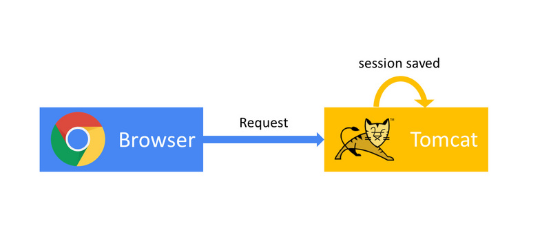
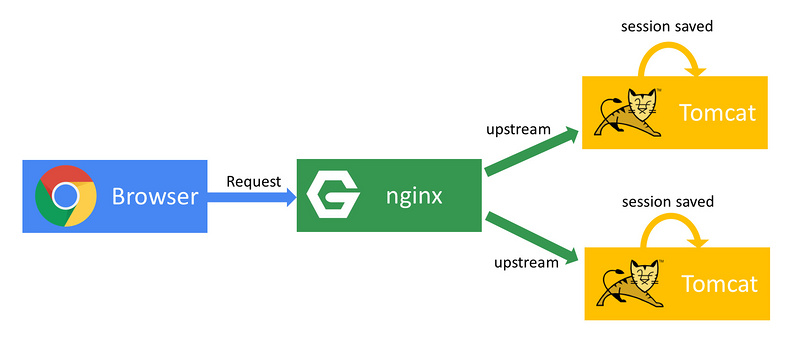
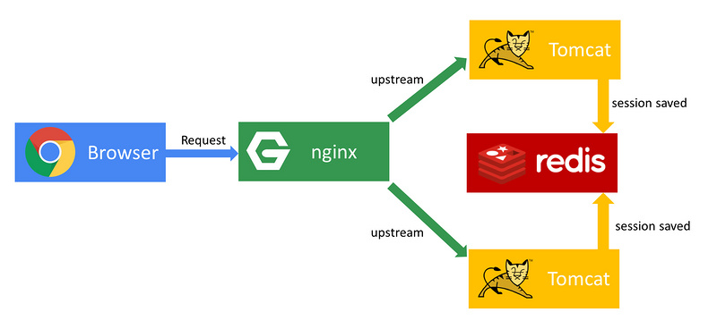
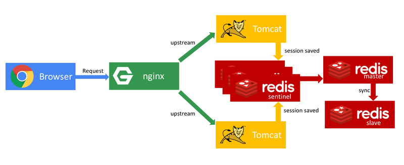

# Tomcat集群通过Redis共享Session

[TOC]

原文：https://segmentfault.com/a/1190000009591087

## 一、简介

### 1.1 为什么要共享Session

我们使用单台Tomcat的时候不会有共享sesssion的疑虑，只要使用Tomcat的默认配置即可，session即可存储在Tomcat上。

     

但是随着业务的扩大，增加Tomcat节点构成Tomcat集群大势所趋，分布式带来了增加更大规模并发请求的优势，但是也随之到来了一个问题，每个Tomcat只存储来访问自己的请求产生的session，如果Tomcat-A已经为客户端C创建了会话session，那么Tomcat-B并不知道客户端已与集群中的Tomcat-A产生了会话，在访问时就会为C再创建一份session，如果是基于session的验证会话权限的接口(如用户登录认证后才可访问的数据接口)，将会导致在访问集群中不同节点的时候重复认证。session的不共享导致原来的会话管理机制在Tomcat集群中无法工作。

  

所以，如果有一个Tomcat集群都能访问的公共session存取区就好了，基于这个概念，我们想到了使用Redis来做这个session公共存取区，这样子的话就有一个统一管理回话的地方了。回看我们上文提到的例子，如果Tomcat-A已经为客户端C创建了会话session，这个session信息会直接存储在公共的Redis里面，那么Tomcat-B就可以到公共session存储区里获得已为C产生的session，这样的结果是集群的公共session存取区在逻辑上就像一个tomcat的内部session存取区一样了。

  


## 二、持久化Tomcat Session到Redis中

### 2.1 session-manager

Tomcat提供了一个开放的session管理和持久化的`org.apache.catalina.session.ManagerBase`，继承这个抽象类并做一些简单的配置，即可让你的session管理类接管Tomcat的session读取和持久化。当然，我们在这里使用了一个流行的开源项目：
<https://github.com/jcoleman/tomcat-redis-session-manager>
，它已经为我们准备好了这样的一个管理类，只要将这个管理类配置在Tomcat中即可发挥功能。它可以帮助我们将tomcat的session存入我们指定的redis，甚至支持redis在sentinel模式调度的redis集群，稍后我们也将详述这样的redis集群该如何部署。

使用这个项目非常简单，如果在Tomcat6或Tomcat7下部署，直接使用项目release出的jar文件到Tomcat的**lib**下即可，准确来说还需要引入它的其他几个依赖(括号中为建议的)：

```text
tomcat-redis-session-manager-VERSION.jar(v1.2)
commons-pool2-VERSION.jar(v2.2)
jedis-VERSION.jar(v2.5.2)
```

上边的jar可以在maven仓库中搜索下载：http://mvnrepository.com/

### 2.2 context.xml

引入后需要在tomcat下修改`conf/context.xml`，没有则新建

```xml
<Valve className="com.demo.redis_session.RedisSessionHandlerValve" />  
<Manager className="com.demo.redis_session.RedisSessionManager"  
    host="127.0.0.1"  
    port="6379"  
    database="0"  
    maxInactiveInterval="60" />
```

这样一来我们的tomcat即可把session的管理交由我们配置的redis来处理,注意这个文件需要在几集群的所有的tomcat中新建。


### 2.3 tomcat8 session共享失败解决

需要注意的是，如果在Tomcat8下按照上述部署，会在启动时报错，笔者查看过原因，是`tomcat-redis-session-manager`最后更新的年代相隔较久，代码中使用的Tomcat api出现了过时删去的情况，在Tomcat8下会出现问题，如果想在Tomcat8下使用，需要自行对过时的api进行修改，替换成新的Tomcat api。笔者自己修改了未经严格验证的一个版本，可供使用Tomcat8的读者试用：
<https://github.com/jinhaoplus/tomcat-redis-session-manager>


## 三、nginx反向代理的负载均衡

虽然这不是本文的重点，但是使用负载均衡在搭建集群的过程中重要性不言而喻，使用nginx默认的轮询机制，我们可以将前端的浏览器请求转发到不同的Tomcat实例上。

首先来讲讲正向代理和反向代理

一言以蔽之：正向代理帮助内网client访问外网server用，反向代理将来自外网client的请求f转发到到内网server。

- 最实际的区别是使用二者时正向代理需要用户主动配置，而反向代理对用户透明，不需要用户做主动配置。

- 「代理」是指代人理事，即代理服务器是为其他人或机器服务的。

- 正向代理是替内网中的用户访问外网服务的（即代替用户去访问外网），用户和外网之间的沟通全部交由正向代理服务器完成，用户的请求不发给外网服务器而发给代理服务器让其代为处理，这个过程是隐藏用户的。

- 反向代理是为真正的服务节点机器服务的（即代替真正的服务节点机器去提供服务），代理服务器接收来自外界的请求，并将请求转给真正的服务节点机器，用户不与真正的机器打交道，这个过程是隐藏真正的服务实例机器的。

  ​

### 3.1 使用nginx做负载均衡

实例可以参考笔记：[nginx的使用-3.9 nginx反向代理和负载均衡](https://github.com/caojx-git/learn/blob/master/notes/nginx/nginx%E4%BD%BF%E7%94%A8.md)

nginx可以作为高效的反向代理服务器，同时起到了负载均衡的作用。如果想要使用反向代理Tomcat集群的负载，方法也非常简单，只需要在其配置`nginx.conf`中将负载的Tomcat集群的实际地址加入upstream，并将locate导向配好的upstream即可：

```conf
http{
    ...
    upstream tomcats {
        server      <tomcat1_ip>:<tomcat1_port>;
        server      <tomcat2_ip>:<tomcat2_port>;
        ...
        server      <tomcatn_ip>:<tomcatn_port>;
      }
    ...
    server {
        listen       80;
        ...
        location / {
            root   html;
            index  index.html index.htm;
            proxy_pass      http://tomcats; 
        }
      }
}
```

默认的轮询机制将每次请求都发至不同的Tomcat实例上，以此实现负载均衡。


## 四、基于sentinel的redis集群搭建

实例可以参考笔记：[redis主从配置](https://github.com/caojx-git/learn/blob/master/notes/redis/redis%E4%B8%BB%E4%BB%8E%E9%85%8D%E7%BD%AE.md)

上面我们已经说到redis是session的公共存储区，如果redis不幸挂掉的话将会导致致命的问题，因为无session源可取，Tomcat中有session读取的接口会直接报错。所以搭建一个redis集群还是很有必要的，幸好redis对分布式HA的搭建支持得很好，原生即有一套sentinel哨兵机制即可用，sentinel哨兵机制很容实现redis主从架构。


以sentinel模式启动的redis实例起到了监控者的作用，redis集群以master-slave的模式启动，消息不再直接发给redis实例，而是发给sentinel，由sentinel同步至所有的redis实例，如果出现redis master实例挂掉的情况，会由sentinel发现，根据配置还可以由sentinel自己组成的集群去选举产生新的master，新的master将会承担起作用，起到了灾难自动回恢复的作用。

**实现：**

我们使用两个redis实例来组成master-slave，需要三个sentinel组成哨兵集群来监控两个redis实例，在master出现问题的时候选举产生新的master，需要3个sentinel是因为当master出故障的时候，主服务器判断为失效至少需要 2 个 sentinel 同意。

**路径假设如下：**
`redis1`
`redis2`
`sentinel1`
`sentinel2`
`sentinel3`

配置`redis1/redis.conf`为master：

```
    bind 127.0.0.1
    port 6379
```

配置`redis2/redis.conf`为redis1的slave：

```
    bind 127.0.0.1
    port 6379
    slaveof <redis1_ip> 6379

```

配置`sentinel1/redis-sentinel.conf`：

```
    port 26379    
    sentinel monitor mymaster <redis1_ip> 6379 2

```

指定redis1为master，slave信息会在启动后被sentinel监听到并自动写入到配置文件中，因此不需要手动写入，最后的quorum表示当有2个sentinel判断master挂掉的时候即可选举slave为新的master。

sentinel2与sentinel3的配置与sentinel1相同。


这样之后启动redis和sentinel集群，即可构建一个高可用的redis集群。可以尝试一下把`redis1`这个master挂掉，sentinel就会探查到并且在2个sentinel都探查到的时候即会选举产生新的master：

```shell
# +monitor master mymaster <redis1-ip> 6379 quorum 2
# +sdown master mymaster <redis1-ip> 6379
```

同时我们的Tomcat配置也将改为使用sentinel集群的版本：

```xml
<Valve className="com.orangefunction.tomcat.redissessions.RedisSessionHandlerValve" />
    <Manager className="com.orangefunction.tomcat.redissessions.RedisSessionManager"
         sentinelMaster="mymaster"
         sentinels="<sentinel1-ip>:26379,<sentinel2-ip>:26379,<sentinel3-ip>:26379"
         maxInactiveInterval="60"/>
```

这个集群搭建完成后，我们的系统将会更为稳定：

  


## 推荐文章

https://segmentfault.com/a/1190000009591087

http://blog.csdn.net/jerome_s/article/details/52658946

