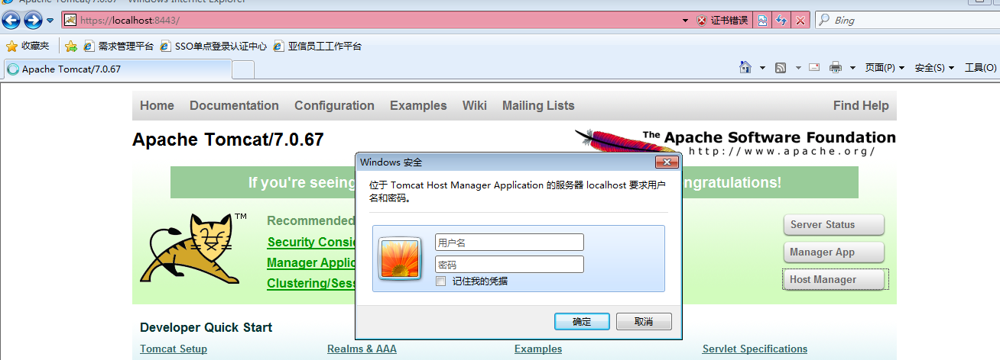

#一、使用Tomcat HostManager管理平台

1.1进入tomcat首页

这里需要输入用户名和密码，这里还没有配置，所以不知道


1.2配置用户名密码
修改/usr/local/apache-tomcat-7.0.67/conf/tomcat-users.xml文件

解开最后的，这里可以配置用户名密码
```xml
 <role rolename="tomcat"/>
  <role rolename="role1"/>
  <user username="tomcat" password="tomcat" roles="tomcat"/>
  <user username="both" password="tomcat" roles="tomcat,role1"/>
  <user username="role1" password="tomcat" roles="role1"/>
```
这样还需要添加管理员权限，不然还是无法登录
使用Manager App的时候需要添加角色 role rolename="manager-gui" 还需要给用户添加相应的权限如
 ```xml
 <role rolename="manager-gui"/>
 <user username="tomcat" password="tomcat" roles="tomcat,manager-gui"/>
 ```
 使用Host Manager的时候需要添加角色 role rolename="admin-gui"，同样也需要给用户添加对应的权限
```xml
 <role rolename="tomcat"/>
  <role rolename="role1"/>
  <role rolename="admin-gui"/>
  <user username="tomcat" password="tomcat" roles="tomcat,admin-gui"/>
  <user username="both" password="tomcat" roles="tomcat,role1"/>
  <user username="role1" password="tomcat" roles="role1"/>
```
这样就可使用界面对项目进行管理

参考：http://blog.csdn.net/jaray/article/details/7721591
