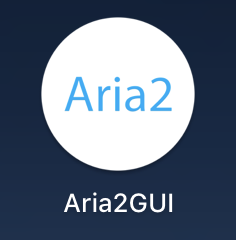
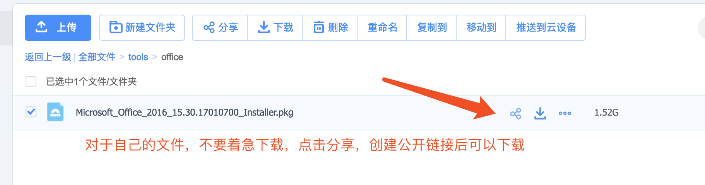
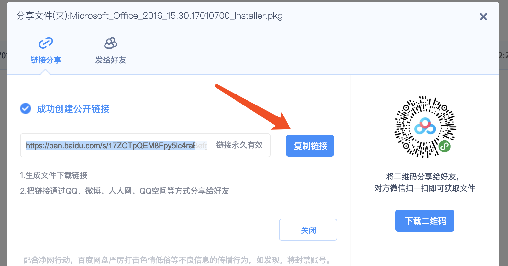
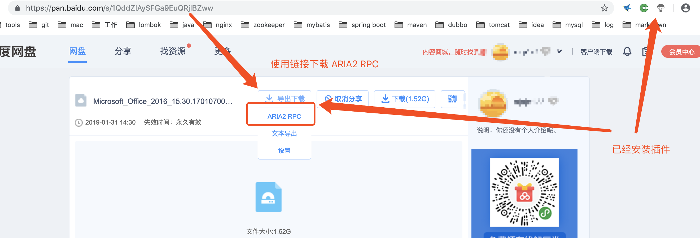
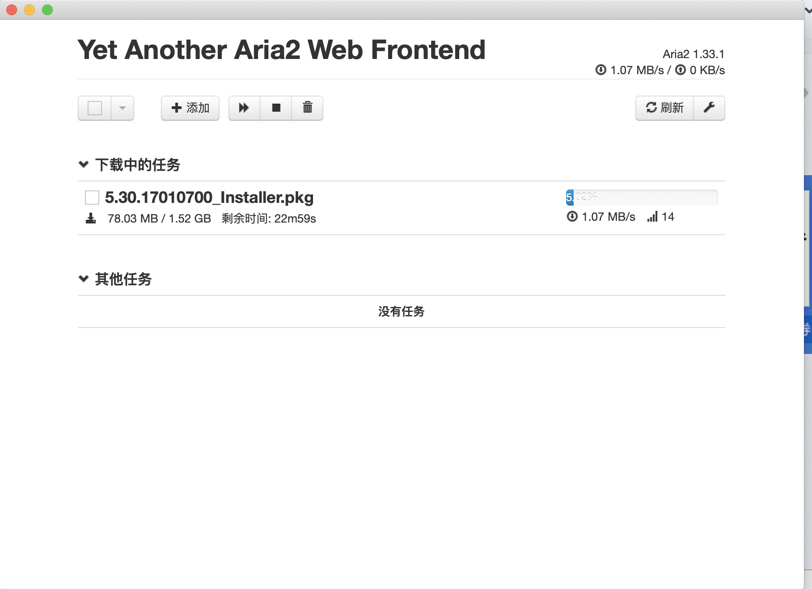

# Aria2GUI+baiduexporter 突破百度网盘限速

[toc]

## 1. 安装chrome插件 
https://raw.githubusercontent.com/acgotaku/BaiduExporter/master/BaiduExporter.crx
https://chrome.google.com/webstore/detail/baiduexporter/jgebcefbdjhkhapijgbhkidaegoocbjj
链接: https://pan.baidu.com/s/1nu_WjHTqritnaz0p7LMHmA 提取码: 6vkf 复制这段内容后打开百度网盘手机App，操作更方便哦

## 2. 安装 Aria2GUI
https://aria2.github.io/

  

## 3. 浏览器打开百度网盘，创建分享下载链接

浏览器打开百度网盘，对于是自己网盘的文件，创建一个公开链接后使用链接下载
如果是别人的文件，见第4步有导出下载的按钮即可

  

复制链接
  

## 4.  使用Aria2GUI下载
注意：下载前打开 Aria2GUI
  

1MB/S的下载速度

  

