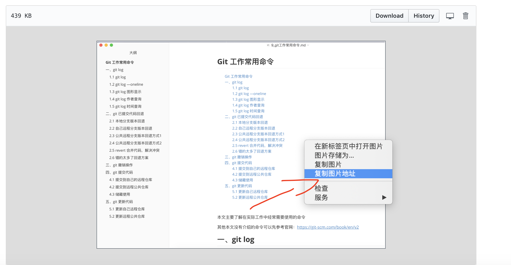

# CSDN或Markdown引用GitHub的图片

**方式一**

进入GitHub`找到图片并点开图片`，右击复制图片地址，可以得到如下地址，可以直接在MarkDown中使用该地址引入GitHub中的图片

> https://github.com/caojx-git/learn/blob/master/notes/images/markdown/markdown_1.png?raw=true

  

**方式二**

如果GitHub中有一些MarkDown文章（文章中引入了一下GitHub中的图片），想把文章发布到其他博客平台，如CSDN，发现直接贴MarkDown文本到CSDN无法引入图片，使用如下方式可以解决

1. GitHub打开MarkDown文件，点击右上角的Raw

2. 复制浏览器中的地址，对于MarkDown中的图片引用，取域名再拼接上GitHub中图片的正常路径即可

   > https://raw.githubusercontent.com/xxx/xxx.png

   如我引入一张GitHub的图片：https://raw.githubusercontent.com/caojx-git/learn/master/notes/images/mysql/mysql-sql-1.png

   markdown引入图片语法请自行百度

3. 复制MarkDown中所有的内容到本地，替换所有的图片引用地址，然后将MarkDown贴到博客即可（注意博客要使用markdown编辑）