## 1基于腾讯云的域名绑定与tomcat部署

### 1.1注册域名
进入腾讯云主机官网，依次选择：云产品->域名服务->域名注册
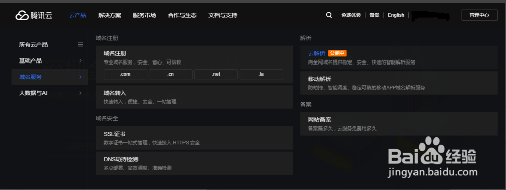
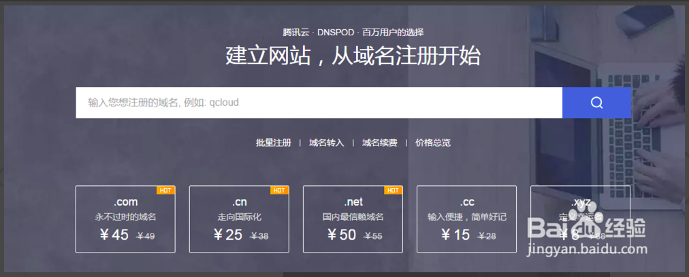
输入你想要注册的域名进行测试，看看是否已经被别人注册了，比如这里使用【www.couplus.com】进行测试，可以看到.com域名和.cn域名已经被使用了，我们选择.org的域名加入购物车，点击立即购买

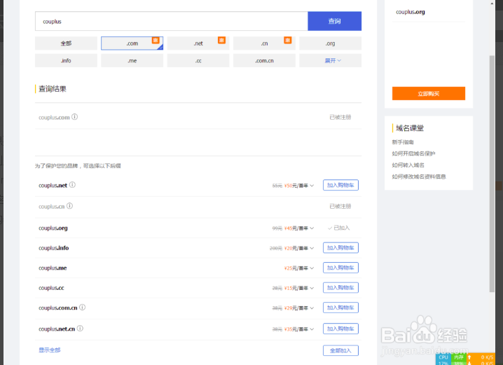

紧接着会要求你输入申请者的域名信息，勾选免费开启域名信息保护，这样别人查看你购买的域名的信息的时候不会把你的个人信息暴露出来，最后点击立即支付，购买成功
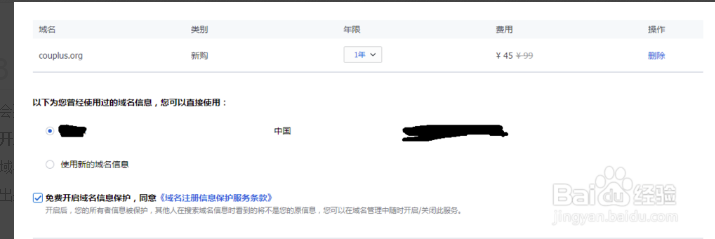

### 1.2域名解析

有了域名后还需要添加该域名的解析地址，否则别人通过该域名是无法得知实际的公网IP地址。这里使用腾讯云的云解析功能，依次选择：云产品->域名服务->云解析

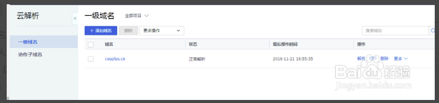

这里需要做进一步的设置，比如，在更多选项卡中，开启CNAME加速，开启搜索引擎推送
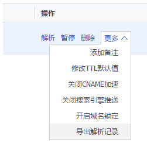

接着点击解析选项，进入添加记录的控制台，可以看到已经存在两条记录，对于www服务，一般我们还需要添加一条A记录，即
记录类型为A（将域名指向一个IPv4地址）
主机记录为www（就是域名的前缀）

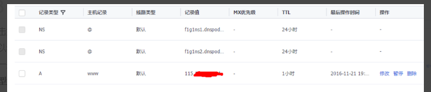

线路类型默认即可  
记录值填写你购买的云主机的公网IP  
TTL选择10分钟即可（即在DNS服务器缓存中的刷新时间）  

这样子我们就完成了域名注册与解析工作，等待大约10分钟后，我们可以进行测试。在Windows下ping该域名，看看是否能够ping通，并且查看返回的IP地址是否是云主机的公网IP

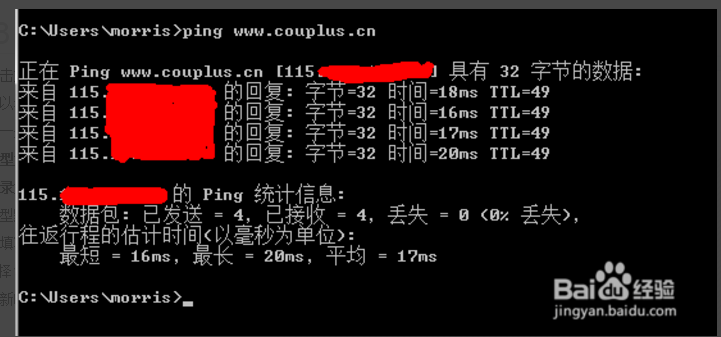

除了ping命令，我们在ssh远程登陆的时候再也不需要记或者去查云主机的公网IP了，直接使用域名即可，比如ssh ubuntu@www.couplus.net,然后输入密码就能成功登陆

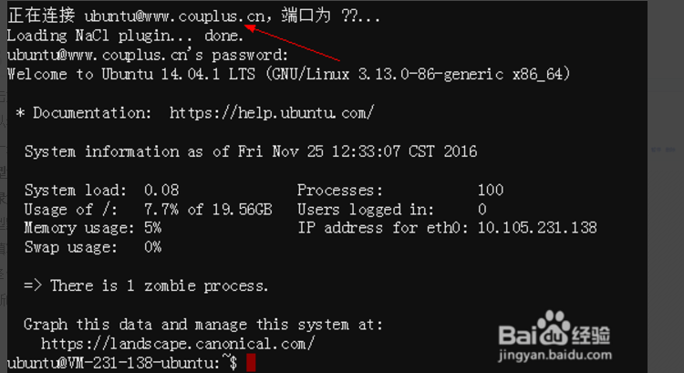

## 2注意事项

添加新的域名后要等待几分钟后再进行测试，一般10分钟左右

## 3部署tomcat

### 3.1配置安全组，开放80端口
安全组->新建

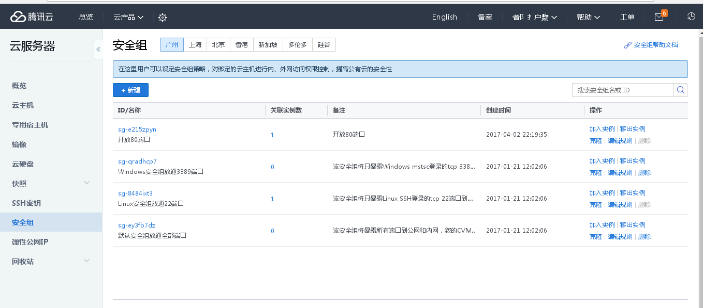
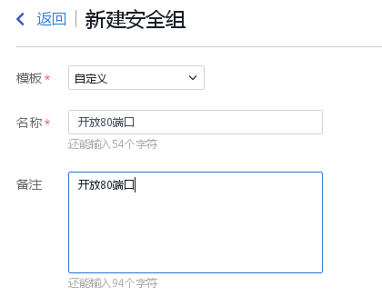


配置入站规则列表

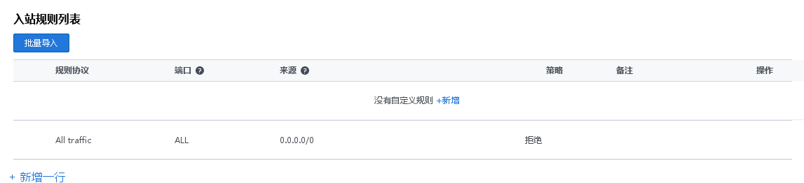
新增
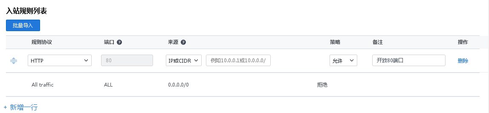


配置出站规则列表

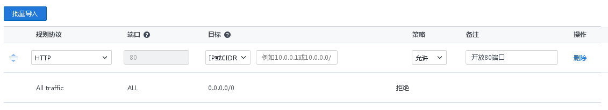

最后点击新建保存


### 3.2关联云主机

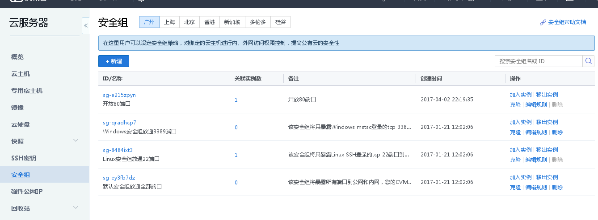
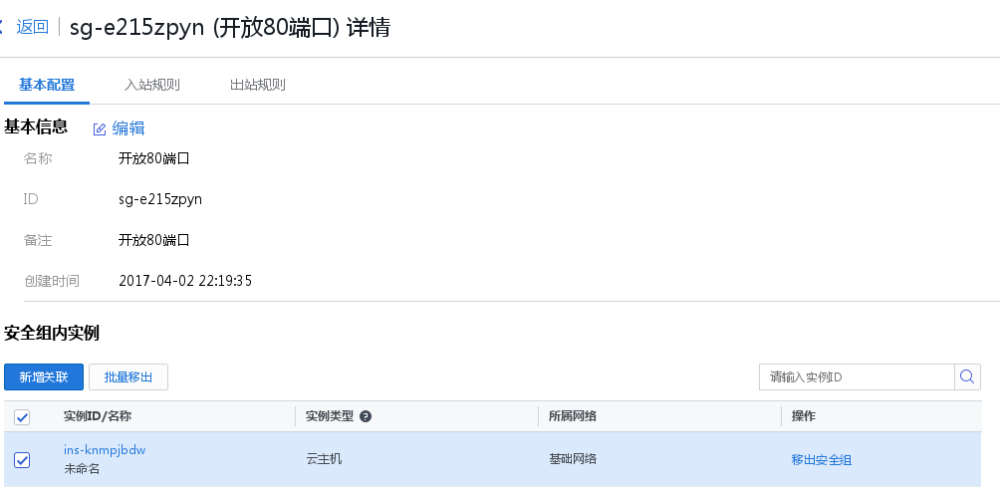

### 3.3Tomcat中server.xml文件配置
开放80端口后，这里我们在腾讯云部署tomcat，使用域名对其进行访问。

修改一下tomcat的server.xml文件

1.将http服务端口修改为80
```xml
<Connector port="80" protocol="HTTP/1.1"
               connectionTimeout="20000"
               redirectPort="8443" />
```


2.Engine节点中defaultHost原localhost改为目标域名
```xml
<Engine name="Catalina" defaultHost="www.xxx.com">
```

3.Host节点中name原localhost改为目标域名，并且在Host节点中添加如下的Context节点
```xml
<Host name="www.xxx.com"  appBase="webapps"
            unpackWARs="true" autoDeploy="true"
            xmlValidation="false" xmlNamespaceAware="false">
       <Context path="" docBase="/MyWebProject" debug="0" reloadable="true"></Context>
</Host>
```

访问： 


注意：部署tomcat之前应该安装了jdk，如果tomcat启动后不能立即访问，请等待10分钟左右

参考：

http://blog.csdn.net/lucahan/article/details/51713486
http://jingyan.baidu.com/article/0bc808fc2c6a851bd485b92a.html
http://bbs.qcloud.com/thread-8022-1-1.html