# Web Service学习

[TOC]

源码：https://github.com/caojx-git/learn/tree/master/code/webservice-java  

## 一、Web Service简介
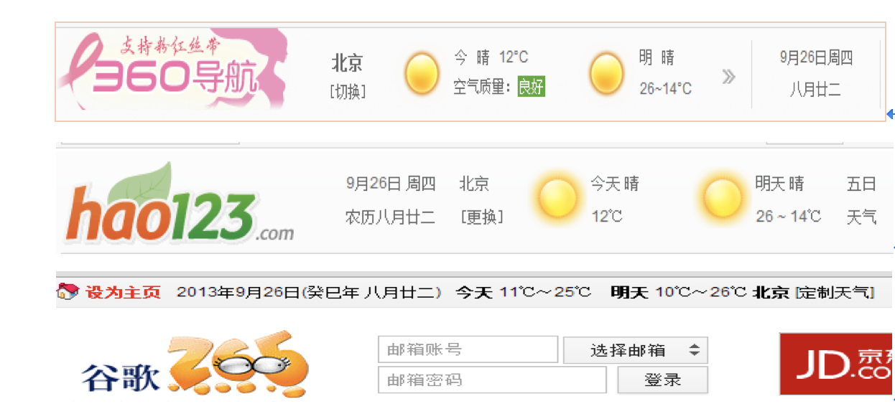  
我们手机或浏览器中一般都会有查询天气的服务，那么么个公司服务器的数据库中都保存了天气预报数据吗?如果没有, 那数据都存在哪了呢?这些网站是
如何得到这些数据的呢?其实大多这种公共服务都是调用WebService获得的。

### 1.1 Web Service是什么

1. 基于Web的服务：服务器端整出一些资源让客户端应用访问（获取数据）
2. 一个跨语言、跨平台的规范（抽象）
3. 多个跨平台、跨语言的应用间通信整合的方案（实际）

以各个网站显示天气预报功能为例:
气象中心的管理系统将收集的天气信息并将数据暴露出来(通过WebService Server), 而各大站点的应用就去调用它们得到天气信息并以不同的样式去展示(WebService Client).
网站提供了天气预报的服务，但其实它们什么也没有做，只是简单了调用了一下气象中心服务器上的一段代码而已。

### 1.2 为什么要用Web Service
web service能解决如下问题  
- 跨平台调用 
- 跨语言调用
- 远程调用

### 1.3 什么时候使用Web Service
1. 同一家公司的新旧应用之间
2. 不同公司的应用之间
  分析业务需求：天猫网与中通物流系统如何交互？
3. 一些提供数据的内容聚合应用：天气预报、股票行情

### 1.4 免费的Web Service
百度或google搜索免费webService接口，如天气查询，号码归属地查询，航班查询等，都有免费的接口。
http://www.webxml.com.cn/zh_cn/web_services.aspx

### 1.5 Web Service中的几个重要术语
>WSDL：web service definition language
```text
直译 : WebService定义语言

1. 对应一种类型的文件.wsdl
2. 定义了webservice的服务器端与客户端应用交互传递请求和响应数据的格式和方式
3. 一个webservice对应一个唯一的wsdl文档
```
>SOAP：simple object  access protocal
```text
直译: 简单对象访问协议

1.	是一种简单的、基于HTTP和XML的协议, 用于在WEB上交换结构化的数据
2.	soap消息：请求消息和响应消息
3.	http+xml片断
```
>SEI：WebService EndPoint Interface(终端)
```text
直译: webservice的终端接口

1. 就是WebService服务器端用来处理请求的接口
```

>CXF：Celtix + XFire
```text
一个apache的用于开发webservice服务器端和客户端的框架
```

### 1.6 Web Service开发框架
jws的发布对java webservice框架产生了巨大的影响，经过大浪淘沙，目前java开发webservice的框架主要包括axis2和cxf。  
axis2和cxf都是apache旗下的产品，但是其目的不同，导致webservice开发方法也不一样。两个框架都得到了开发者的支持。有必要对二者进行以下对比。

 

|          |              Axis2              |                   CXF                    |
| -------- | :-----------------------------: | :--------------------------------------: |
| 目标       |          WebService引擎           |             简易的SOA框架，可以作为ESB             |
| ws* 标准支持 |          不支持WS-Policy           | WS-Addressing，WS-Policy， WS-RM， WS-Security，WS-I Basic Profile |
| 数据绑定支持   | XMLBeans、JiBX、JaxMe 、JaxBRI、ADB |     JAXB, Aegis, XMLBeans, SDO, JiBX     |
| spring集成 |               不支持               |                    支持                    |
| 应用集成     |               困难                |                    简单                    |
| 多语言      |             支持C/C++             |                   不支持                    |
| 部署       |              web应用              |                   嵌入式                    |
| 服务监控和管理  |               支持                |                   不支持                    |

结论：  
如果希望以一种一致的方式实现webservice，特别是有跨语言的需求时，应该使用Axis2  
如果需要在现有的java程序（包括web应用）中增加webservice支持，应该使用CXF  

来自：  
https://www.cnblogs.com/holbrook/archive/2012/12/12/2814821.html

## 二、开发Web Service
•	开发手段：  
–	使用JDK开发(1.6及以上版本)  
–	使用CXF框架开发(工作中)  
•	组成：  
–	服务器端  
–	客户端  

### 2.1 使用JDK开发Web Service

1).开发服务器端  
•	webservice编码：  
–	@WebService( SEI和SEI的实现类)  
–	@WebMethod(SEI中的所有方法)  
•	发布webservice：  
–	Endpoint(终端, 发布WebService)  
2). 开发客户端  
•	使用eclipse提供的WebService浏览器访问  
–	查看对应的wsdl文档：…..?wsdl (一般浏览器)  
–	请求webservice并查看请求和响应消息(WebService浏览器)  

•	创建客户端应用编码方式访问  
–	借助jdk的wsimort.exe工具生成客户端代码：  
```text
wsimport -keep url   //url为wsdl文件的路径,-keep是保存生成的java代码的意思  
```
–	借助生成的代码编写请求代码  

- 开发服务端

1. 建立mave工程    
  建立mave工程webservice-java项目，包含两个模块webservice-client是web项目，webservice-server也是web项目分别作用客户端和服务端。
  这里只是为了方便测试，将服务端和客户端建在同一个maven项目中，一般情况下服务端都调用其他公司的项目。
  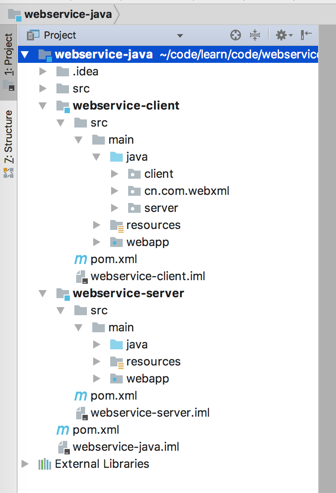  

2. HelloWS.java  
  定义WebService服务接口，需要在类中添加@WebService注解和方法中添加@WebMethod注解
```java
package server.ws01;

import javax.jws.WebMethod;
import javax.jws.WebService;

/**
 * SEI：定义WebService服务接口
 */

//该注解声明该类是webService类
@WebService
public interface HelloWS {

    //该注解声明该类是webService方法
    @WebMethod
    public String sayHello(String name);
}
```

3. HelloWSImpl.java   
  实现HelloWS，只需要在实现类中添加@WebService注解
```java
package server.ws01;

import javax.jws.WebService;

/**
 * SEI的实现类
 */
@WebService
public class HelloWSImpl implements HelloWS {

    @Override
    public String sayHello(String name) {
        System.out.println("server sayHello()"+name);
        return "hello "+name;
    }
}
```

4. ServerTest.java  
  发布webservice
```java
package server.ws01;

import javax.xml.ws.Endpoint;

/**
 * 发布WebService
 */
public class ServerTest {

    public static void main(String[] args) {
        System.out.println("发布开始");
        //发布地址
        String address = "http://127.0.0.1:8989/ws01/hellows";
        //指定发布的地址和SEI实现类对象
        Endpoint.publish(address, new HelloWSImpl());
        System.out.println("发布完成");
    }
}
```
5. 浏览器访问  
  地址：http://127.0.0.1:8989/ws01/hellows?wsdl
  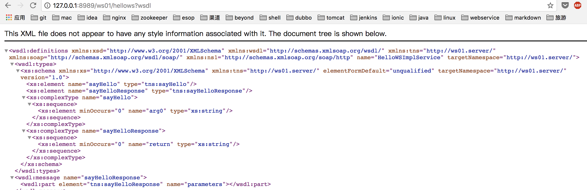

- 开发客户端  
1. 根据wsdl文档地址生成可客户端代码  
```text
$cd ~/code/learn/code/webservice-java/webservice-client/src/main/java/
$wsimport -keep http://127.0.0.1:8989/ws01/hellows?wsdl
```
代码生成结果  
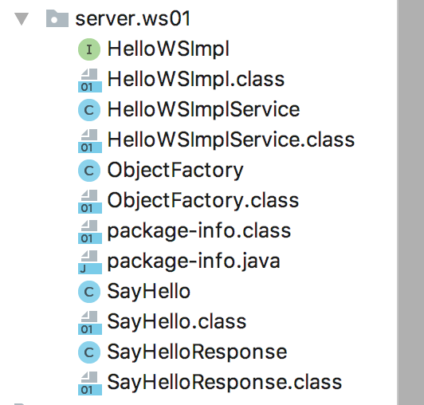

2. 根据生成的客户端代码调用服务  
```java
package client;

import server.ws01.HelloWSImpl;
import server.ws01.HelloWSImplService;

/**
 * 调用WebService
 */
public class ClientTest {

    public static void main(String[] args) {
        //获取factory对应wsdl中<service name="HelloWSImplService">中的name值
        HelloWSImplService factory = new HelloWSImplService();
        //获取具体的服务对应<port name="HelloWSImplPort" binding="tns:HelloWSImplPortBinding">...</port>中的get+name值
        HelloWSImpl helloWS = factory.getHelloWSImplPort();
        System.out.println(helloWS.getClass());
        String result = helloWS.sayHello("jack");
        System.out.println("client:"+result);
    }
}
```
结果  
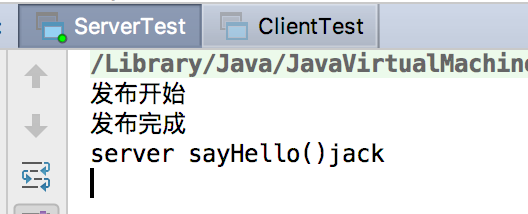    
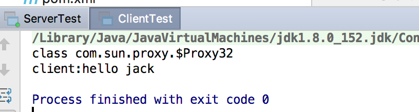  

### 2.2 一次Web service请求的流程  
一次web service请求的本质:   
1)客户端向服务器端发送了一个soap消息(http请求+xml片断)
2)服务器端处理完请求后, 向客户端返回一个soap消息，那么它的流程是怎样的呢？  
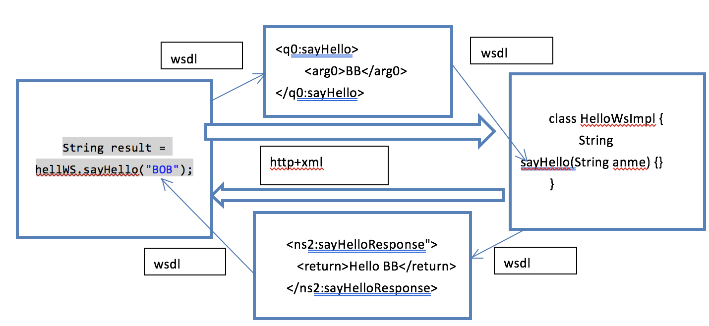    

## 三、编写天气预报的Web Service
网络上有很多免费的WebService接口如下，提供了一些免费的WebService接口，比如天气查询服务、手机号码归属查询、航班查询等。      
http://ws.webxml.com.cn/WebServices/WeatherWS.asmx?wsdl  
下边我们来编写天气预报查询的Web Service

1. 根据wsdl生成客户端代码
```text
wsimport -keep http://ws.webxml.com.cn/WebServices/WeatherWS.asmx?wsdl #这样直接生成客户代码出现问题，因为该服务式net写的，所以
java方式在生成客户端代码的时候都需要进行少许的修改
```
解决方案
- 将wsdl文档先保存到本地 [weather.wsd]()
- 将 <s:element ref="s:schema" /><s:any /> 替换成 <s:any minOccurs="2" maxOccurs="2"/> 这个是Java调用net的webservice都有的问题

生成客户端代码  
```text
$cd ~/code/learn/code/webservice-java/webservice-client/src/main/java/
$wsimport -keep ~/code/learn/code/webservice-java/webservice-client/src/main/resources/weather.wsdl
```
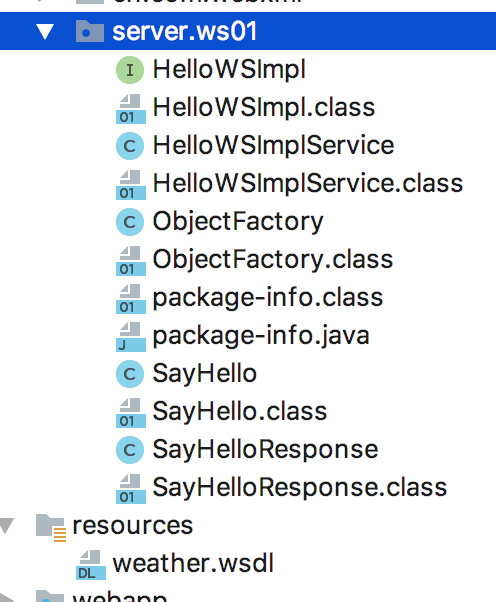

2. WeatherClientTest.java  
  调用天气服务
```java
package client;

import cn.com.webxml.WeatherWS;
import cn.com.webxml.WeatherWSSoap;

public class WeatherClientTest {

    public static void main(String[] args) {
       //创建服务工厂，对应wsdl文档<wsdl:service name="WeatherWS">...</wsdl:service>中的name
       WeatherWS weatherWS = new WeatherWS();
       //创建具体的服务对象，对应wsdl文档中<wsdl:port name="WeatherWSSoap" binding="tns:WeatherWSSoap">...</wsdl:port>中的name
       WeatherWSSoap weatherWSSoap = weatherWS.getWeatherWSSoap();
       //调用天气服务
       System.out.println(weatherWSSoap.getWeather("上海","").getString());
    }
}
```
结果  
```text
[直辖市 上海, 上海, 2013, 2018/01/17 21:31:43, 今日天气实况：气温：8℃；风向/风力：东北风 1级；湿度：81%, 紫外线强度：最弱。空气质量：中。, 紫外线指数：最弱，辐射弱，涂擦SPF8-12防晒护肤品。
健臻·血糖指数：不易波动，天气条件好，血糖不易波动，可适时进行户外锻炼。
感冒指数：较易发，温差较大，较易感冒，注意防护。
穿衣指数：较冷，建议着厚外套加毛衣等服装。
洗车指数：较适宜，无雨且风力较小，易保持清洁度。
空气污染指数：中，易感人群应适当减少室外活动。
, 1月17日 多云, 5℃/14℃, 西北风小于3级, 1.gif, 1.gif, 1月18日 多云转阴, 6℃/11℃, 东北风小于3级, 1.gif, 2.gif, 1月19日 多云, 8℃/12℃, 东北风小于3级, 1.gif, 1.gif, 1月20日 阴转小雨, 8℃/11℃, 东风小于3级, 2.gif, 7.gif, 1月21日 中雨, 6℃/11℃, 东风3-4级转西北风4-5级, 8.gif, 8.gif]
```
## 四、WSDL文档分析

### 4.1 wsdl文档结构
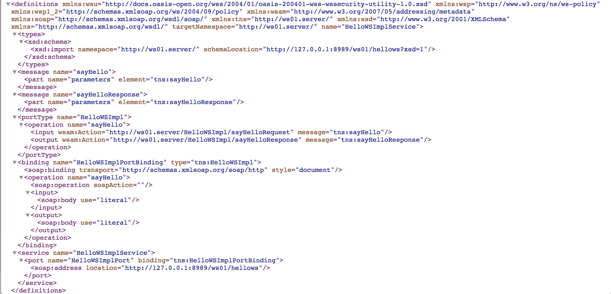  
从上图可以看出wsdl文档结构是如下的，这也是JDK开发WebService时生成的wsdl文档的默认结构，如果使用cxf框架或axis框架开发的cxf与该文档结构可能会略有区别。
```xml
<definitions>
    <types>
        <schema></schema>
    </types>
    <message>
        <part></part>
    </message>
    <portType>
        <operation>
            <input></input>
            <output></output>
        </operation>
    </portType>
    <binding>
        <operation>
            <input></input>
            <output></output>
        </operation>
    </binding>
    <service>
        <port></port>
        <address></address>
    </service>
</definitions>
```
### 4.2 标签作用详情
```xml
<definitions xmlns:wsu="http://docs.oasis-open.org/wss/2004/01/oasis-200401-wss-wssecurity-utility-1.0.xsd" xmlns:wsp="http://www.w3.org/ns/ws-policy" xmlns:wsp1_2="http://schemas.xmlsoap.org/ws/2004/09/policy" xmlns:wsam="http://www.w3.org/2007/05/addressing/metadata" xmlns:soap="http://schemas.xmlsoap.org/wsdl/soap/" xmlns:tns="http://ws01.server/" xmlns:xsd="http://www.w3.org/2001/XMLSchema" xmlns="http://schemas.xmlsoap.org/wsdl/" targetNamespace="http://ws01.server/" name="HelloWSImplService">
    <types>
       <!-- <xsd:schema>
            <xsd:import namespace="http://ws01.server/" schemaLocation="http://127.0.0.1:8989/ws01/hellows?xsd=1"/>
        </xsd:schema>-->

        <xs:schema xmlns:tns="http://ws01.server/" xmlns:xs="http://www.w3.org/2001/XMLSchema" version="1.0" targetNamespace="http://ws01.server/">

            <!--定义消息片段-->
            <!--

                请求入参标签片段定义：
                <sayHello>
                    <arg0>string<arg0>
                 </sayHello>

                响应出参标签片段定义：
                 <sayHelloResponse>
                    <return>string</return>
                 <sayHelloResponse>
            -->

            <xs:element name="sayHello" type="tns:sayHello"/>
            <xs:element name="sayHelloResponse" type="tns:sayHelloResponse"/>
            <xs:complexType name="sayHello">
                <xs:sequence>
                    <xs:element name="arg0" type="xs:string" minOccurs="0"/>
                </xs:sequence>
            </xs:complexType>
            <xs:complexType name="sayHelloResponse">
                <xs:sequence>
                    <xs:element name="return" type="xs:string" minOccurs="0"/>
                </xs:sequence>
            </xs:complexType>
        </xs:schema>
    </types>


    <!--
        message: 用于定义消息的结构，声明消息中包含的片段
            part：用于指定引用的types中定义的标签片段
    -->
    <message name="sayHello">
        <part name="parameters" element="tns:sayHello"/>
    </message>
    <message name="sayHelloResponse">
        <part name="parameters" element="tns:sayHelloResponse"/>
    </message>

    <!--
        portType:用来定义服务器端的SEI
               operation：用来指定SEI中的请求方法
                    input：指定客户端应用传过来的数据，会引用上边定义的<message>
                    output:指定服务端应用返回给客户端的数据，会引用上边定义的<message>
    -->
    <portType name="HelloWSImpl">
        <operation name="sayHello">
            <input wsam:Action="http://ws01.server/HelloWSImpl/sayHelloRequest" message="tns:sayHello"/>
            <output wsam:Action="http://ws01.server/HelloWSImpl/sayHelloResponse" message="tns:sayHelloResponse"/>
        </operation>
    </portType>

<!--
    binding:用于定义SEI的实现类
        type：引用上边的<portType>
        <soap:binding style="document"/> ：绑定的数据是一个document(xml)
        operation:用来定义实现的方法
            <soap:operation soapAction="" style="document"/>: 传输的是document(xml)
            input:指定客户端应用传过来的数据
                <soap:body use="literal"/>：文本数据
            output:指定服务端返回给客户端的数据
                <soap:body use="literal"/>：文本数据

-->
    <binding name="HelloWSImplPortBinding" type="tns:HelloWSImpl">
        <soap:binding transport="http://schemas.xmlsoap.org/soap/http" style="document"/>
        <operation name="sayHello">
            <soap:operation soapAction="" style="document"/>
            <input>
                <soap:body use="literal"/>
            </input>
            <output>
                <soap:body use="literal"/>
            </output>
        </operation>
    </binding>

    <!--
        service：相当于一个webservice容器
            name属性：用来指定一个客户端容器类
            port属性：用来指定一个服务器端处理的请求入口（就是SEI的实现）
                binding属性：引用上边定义的<binding>
                address:当前webservice请求地址
    -->
    <service name="HelloWSImplService">
        <port name="HelloWSImplPort" binding="tns:HelloWSImplPortBinding">
            <soap:address location="http://127.0.0.1:8989/ws01/hellows"/>
        </port>
    </service>
</definitions>
```
### 4.3 重要标签的说明
- types - 数据类型(标签)定义的容器，里面使用schema定义了一些标签结构供message引用 
- message - 通信消息的数据结构的抽象类型化定义。引用types中定义的标签
- operation - 对服务中所支持的操作的抽象描述，一个operation描述了一个访问入口的请求消息与响应消息对。
- portType - 对于某个访问入口点类型所支持的操作的抽象集合，这些操作可以由一个或多个服务访问点来支持。
- binding - 特定端口类型的具体协议和数据格式规范的绑定。
- service- 相关服务访问点的集合
- port - 定义为协议/数据格式绑定与具体Web访问地址组合的单个服务访问点。


## 五、使用CXF开发WebService

### 5.1 CXF简介
Apache CXF 是一个开源的 Services 框架，CXF 帮助您利用 Frontend 编程 API 来构建和开发 Services ，像 JAX-WS 。这些 Services 
可以支持多种协议，比如：SOAP、XML/HTTP、RESTful HTTP 或者 CORBA ，并且可以在多种传输协议上运行，比如：HTTP、JMS 或者 JBI，CXF 
大大简化了 Services 的创建，同时它继承了 XFire 传统，一样可以天然地和 Spring 进行无缝集成。 --百度百科


### 5.2 CXF支持的数据类型

1. 基本类型    
- short，char，float,double，int,long，boolean等  
2. 引用类型  
- String  
- 集合：数组，List, Set, Map（JDK开发WebService不支持Map类型） 
- 自定义类型   Student  

1. maven依赖  
```xml
<?xml version="1.0" encoding="UTF-8"?>
<project xmlns="http://maven.apache.org/POM/4.0.0"
         xmlns:xsi="http://www.w3.org/2001/XMLSchema-instance"
         xsi:schemaLocation="http://maven.apache.org/POM/4.0.0 http://maven.apache.org/xsd/maven-4.0.0.xsd">
    <modelVersion>4.0.0</modelVersion>

    <groupId>caojx.learn</groupId>
    <artifactId>webservice-java</artifactId>
    <version>1.0-SNAPSHOT</version>
    <packaging>pom</packaging>
    <modules>
        <module>webservice-server</module>
        <module>webservice-client</module>
    </modules>

    <properties>
        <cxf.version>3.1.7</cxf.version>
    </properties>

    <dependencies>
        <!--cxf依赖必须-->
        <dependency>
            <groupId>org.apache.cxf</groupId>
            <artifactId>apache-cxf</artifactId>
            <version>${cxf.version}</version>
            <type>pom</type>
        </dependency>

        <!--cxf可根据需要添加-->
        <dependency>
            <groupId>org.apache.cxf</groupId>
            <artifactId>cxf-rt-frontend-jaxws</artifactId>
            <version>${cxf.version}</version>
        </dependency>
        <dependency>
            <groupId>org.apache.cxf</groupId>
            <artifactId>cxf-rt-transports-http</artifactId>
            <version>${cxf.version}</version>
        </dependency>
    </dependencies>
</project>
```

2. Student.java  
  用于测试自定义类型是否支持  
```java
package server.datetype;

public class Student {

    private int id;

    private String name;

    private float price;

    public Student(){
        super();
    }

    public Student(int id, String name, float price) {
        this.id = id;
        this.name = name;
        this.price = price;
    }

    public int getId() {
        return id;
    }

    public void setId(int id) {
        this.id = id;
    }

    public String getName() {
        return name;
    }

    public void setName(String name) {
        this.name = name;
    }

    public float getPrice() {
        return price;
    }

    public void setPrice(float price) {
        this.price = price;
    }

    @Override
    public String toString() {
        return "Student{" +
                "id=" + id +
                ", name='" + name + '\'' +
                ", price=" + price +
                '}';
    }
}
```

3. DateTypeWS.java  
  定义WebService接口  
```java
package server.datetype;

import javax.jws.WebMethod;
import javax.jws.WebService;
import java.util.List;
import java.util.Map;

@WebService
public interface DateTypeWS {

    @WebMethod
    public boolean addStudent(Student s);

    @WebMethod
    public Student getStudentById(int id);

    @WebMethod
    public List<Student> getStudentByPrice(float price);

    /**
     * 如果使用的cxf发布报错： com.sun.xml.bind.v2.runtime.IllegalAnnotationsException: 2 counts of IllegalAnnotationExceptions
     * java.util.Map is an interface, and JAXB can't handle interfaces.
     * 原因是不支持map类型数据，解决方案参考如下：
     * 方案一： http://blog.csdn.net/kongxx/article/details/7544640
     * 方案二： 我将将cxf版本换到3.1.7以上就好了
     * @return
     */
    @WebMethod
    public Map<Integer,Student> getAllStudentsMap();
}
```

4. DateTypeWSImpl.java  
  接口实现类，用于测试各种数据类型是否支持，注意没有使用cxf框架或cxf版本过低可能会出现类似于如下的错误   
```text
com.sun.xml.bind.v2.runtime.IllegalAnnotationsException: 2 counts of IllegalAnnotationExceptions
java.util.Map is an interface, and JAXB can't handle interfaces.
```
解决方案：  
一：参考http://blog.csdn.net/kongxx/article/details/7544640。   
二：我切换到cxf版本3.1.7后可以支持map类型了,之前使用2.2.7版本发现不支持map类型，其他的版本没有试。  

```java
package server.datetype;

import javax.jws.WebService;
import java.util.ArrayList;
import java.util.HashMap;
import java.util.List;
import java.util.Map;

@WebService
public class DateTypeWSImpl implements DateTypeWS {

    public boolean addStudent(Student s) {
        System.out.println("server addStudent() " + s);
        return true;
    }

    public Student getStudentById(int id) {
        System.out.println("server getStudentById() " + id);
        return new Student(id, "CAT", 1000);
    }

    public List<Student> getStudentByPrice(float price) {
        System.out.println("server getStudentByPrice() " + price);
        List<Student> list = new ArrayList<Student>();
        list.add(new Student(1, "TOM1", price+1));
        list.add(new Student(2, "TOM1", price+2));
        list.add(new Student(3, "TOM1", price+3));
        return list;
    }

    /**
     * 如果使用的cxf发布报错： com.sun.xml.bind.v2.runtime.IllegalAnnotationsException: 2 counts of IllegalAnnotationExceptions
     * java.util.Map is an interface, and JAXB can't handle interfaces.
     * 原因是不支持map类型数据，解决方案参考如下：
     * 方案一： http://blog.csdn.net/kongxx/article/details/7544640
     * 方案二： 我将将cxf版本换到3.1.7以上就好了
     * @return
     */
    public Map<Integer, Student> getAllStudentsMap() {
        System.out.println("server getAllStudentsMap() ");
        Map<Integer, Student> map = new HashMap<Integer, Student>();
        map.put(1,new Student(1, "JACK1", 100));
        map.put(2,new Student(1, "JACK1", 200));
        map.put(3,new Student(1, "JACK1", 300));
        return map;
    }
}
```

5. ServerTest.java   
  发布服务，注意需要添加cxf的maven依赖，不然不能支持map类型
```java
package server.datetype;


import javax.xml.ws.Endpoint;

public class ServerTest {

    public static void main(String[] args) {
        System.out.println("发布开始");
        //发布地址
        String address = "http://127.0.0.1:8989/dateType/dateTypews";
        //指定发布的地址和SEI实现类对象
        Endpoint.publish(address, new DateTypeWSImpl());
        System.out.println("发布完成");
    }
}
```

6. 生成客户端代码  

```text
$cd ~/code/learn/code/webservice-java/webservice-client/src/main/java/
$wsimport -keep http://127.0.0.1:8989/dateType/dateTypews?wsdl
```

7. DateTypeClientTest.java  
  客户端测试
```java
package client;

import server.datetype.DateTypeWS;
import server.datetype.DateTypeWSImplService;
import server.datetype.GetAllStudentsMapResponse;
import server.datetype.Student;

import java.util.List;

/**
 * 使用cxf框架后测试支持的数据类型
 */
public class DateTypeClientTest {

    public static void main(String[] args) {
        DateTypeWSImplService factory = new DateTypeWSImplService();
        DateTypeWS dateTypeWS = factory.getDateTypeWSImplPort();

        Student student = new Student();
        student.setId(12);
        student.setName("abc");
        student.setPrice(23);
        boolean success = dateTypeWS.addStudent(student);

        System.out.println("client "+success);

        List<Student> list = dateTypeWS.getStudentByPrice(23);

        System.out.println(list);

        GetAllStudentsMapResponse.Return r = dateTypeWS.getAllStudentsMap();
        List<GetAllStudentsMapResponse.Return.Entry> entries = r.getEntry();
        for(GetAllStudentsMapResponse.Return.Entry entry :entries){
            Integer id = entry.getKey();
            Student student1 = entry.getValue();
            System.out.println(id +"_"+student1); //不知原因，客户端中没有生成toString()方法
            System.out.println(student1.getId()+"-"+student1.getName()+"-"+student1.getPrice());
        }
    }
}
```

8. 结果  
  引入cxf的maven依赖后，通过结果可以看出，cxf支持所有的数据类型包括自定义类型 
```text
client true
[server.datetype.Student@6399551e, server.datetype.Student@13d73fa, server.datetype.Student@5023bb8b]
1_server.datetype.Student@3e30646a
1-JACK1-100.0
2_server.datetype.Student@5cde6747
1-JACK1-200.0
3_server.datetype.Student@63a270c9
1-JACK1-300.0
```


### 5.4 CXF拦截器

- 为什么设计拦截器？   
1. 为了在webservice请求过程中,能动态操作请求和响应数据, CXF设计了拦截器，JDK没有提供类似与cxf开发webservice拦截器功能.  
- 拦截器分类：  
1. 按所处的位置分：服务器端拦截器，客户端拦截器  
2. 按消息的方向分：入拦截器，出拦截器  
3. 按定义者分：系统拦截器，自定义拦截器  


- 拦截器API  
  Interceptor(拦截器接口)  
  AbstractPhaseInterceptor(自定义拦截器从此继承)  
  LoggingInInterceptor(系统日志入拦截器类)  
  LoggingOutInterceptor(系统日志出拦截器类)  

> 使用日志拦截器，实现日志记录
- LoggingInInterceptor
- LoggingOutInterceptor


1. ServerTest.java   
  给服务端添加日志出拦截器和日志入拦截器  
```java
package server.ws02.cxf.interceptor1;

import org.apache.cxf.interceptor.Interceptor;
import org.apache.cxf.interceptor.LoggingInInterceptor;
import org.apache.cxf.interceptor.LoggingOutInterceptor;
import org.apache.cxf.jaxws.EndpointImpl;
import org.apache.cxf.message.Message;

import javax.xml.ws.Endpoint;
import java.util.List;

/**
 * 发布WebService,并添加入拦截器和出拦截器，添加后我们可以在debug窗口看到请求响应日志
 */
public class ServerTest {

    public static void main(String[] args) {
        System.out.println("发布开始");
        //发布地址
        String address = "http://127.0.0.1:8989/ws02/interceptor1";
        //指定发布的地址和SEI实现类对象
        Endpoint endpoint = Endpoint.publish(address, new HelloWSImpl());

        EndpointImpl endpointImpl = (EndpointImpl) endpoint;
        //服务端的日志入拦截器
        List<Interceptor<? extends Message>> inInterceptors = endpointImpl.getInInterceptors();
        inInterceptors.add(new LoggingInInterceptor());

        //服务端的日志出拦截器
        List<Interceptor<? extends Message>> outInterceptors = endpointImpl.getOutInterceptors();
        outInterceptors.add(new LoggingOutInterceptor());

        System.out.println("发布完成");
    }
}
```

2. 生成客户端代码  
```text
$cd ~/code/learn/code/webservice-java/webservice-client/src/main/java/
$wsimport -keep http://127.0.0.1:8989/ws02/interceptor1?wsdl
```

3. InterceptorClientTest.java  
  客户端也添加日志拦截器    
```java
package client;

import org.apache.cxf.endpoint.Client;
import org.apache.cxf.frontend.ClientProxy;
import org.apache.cxf.interceptor.Interceptor;
import org.apache.cxf.interceptor.LoggingInInterceptor;
import org.apache.cxf.interceptor.LoggingOutInterceptor;
import org.apache.cxf.message.Message;
import server.ws02.cxf.interceptor1.HelloWS;
import server.ws02.cxf.interceptor1.HelloWSImplService;

import java.util.List;

/**
 * 调用WebService，添加入拦截器和出拦截器
 */
public class InterceptorClientTest {

    public static void main(String[] args) {
        //获取factory对应wsdl中<service name="HelloWSImplService">中的name值
        HelloWSImplService factory = new HelloWSImplService();
        //获取具体的服务对应<port name="HelloWSImplPort" binding="tns:HelloWSImplPortBinding">...</port>中的get+name值
        HelloWS helloWS = factory.getHelloWSImplPort();
        System.out.println(helloWS.getClass());

        //发送请求的客户端对象
        Client client = ClientProxy.getClient(helloWS);

        //客户端出拦截器
        //客户端的日志入拦截器
        List<Interceptor<? extends Message>> inInterceptors = client.getInInterceptors();
        inInterceptors.add(new LoggingInInterceptor());

        //客户端的日志出拦截器
        List<Interceptor<? extends Message>> outInterceptors = client.getOutInterceptors();
        outInterceptors.add(new LoggingOutInterceptor());

        String result = helloWS.sayHello("jack");
        System.out.println("client:"+result);
    }
}

```
4. 效果    
  在客户端和服务端添加日志拦截器后我们可以在终端看到请求出入参数    
  客户端：  
```text
信息: Creating Service {http://interceptor1.cxf.ws02.server/}HelloWSImplService from WSDL: http://127.0.0.1:8989/ws02/interceptor1?wsdl
class com.sun.proxy.$Proxy34
一月 21, 2018 9:26:33 下午 org.apache.cxf.services.HelloWSImplService.HelloWSImplPort.HelloWS
信息: Outbound Message
---------------------------
ID: 1
Address: http://127.0.0.1:8989/ws02/interceptor1
Encoding: UTF-8
Http-Method: POST
Content-Type: text/xml
Headers: {Accept=[*/*], SOAPAction=[""]}
Payload: <soap:Envelope xmlns:soap="http://schemas.xmlsoap.org/soap/envelope/"><soap:Body><ns2:sayHello xmlns:ns2="http://interceptor1.cxf.ws02.server/"><arg0>jack</arg0></ns2:sayHello></soap:Body></soap:Envelope>
--------------------------------------
一月 21, 2018 9:26:33 下午 org.apache.cxf.services.HelloWSImplService.HelloWSImplPort.HelloWS
信息: Inbound Message
----------------------------
ID: 1
Response-Code: 200
Encoding: UTF-8
Content-Type: text/xml; charset=UTF-8
Headers: {content-type=[text/xml; charset=UTF-8], Date=[Sun, 21 Jan 2018 13:26:33 GMT], Server=[Jetty(9.2.15.v20160210)], transfer-encoding=[chunked]}
Payload: <soap:Envelope xmlns:soap="http://schemas.xmlsoap.org/soap/envelope/"><soap:Body><ns2:sayHelloResponse xmlns:ns2="http://interceptor1.cxf.ws02.server/"><return>hello jack</return></ns2:sayHelloResponse></soap:Body></soap:Envelope>
--------------------------------------
client:hello jack
```

服务端：  
```text
一月 21, 2018 9:26:32 下午 org.apache.cxf.services.HelloWSImplService.HelloWSImplPort.HelloWS
信息: Inbound Message
----------------------------
ID: 5
Address: http://127.0.0.1:8989/ws02/interceptor1?wsdl
Http-Method: GET
Content-Type: 
Headers: {Accept=[*/*], Cache-Control=[no-cache], connection=[keep-alive], Content-Type=[null], Host=[127.0.0.1:8989], Pragma=[no-cache], User-Agent=[Apache-CXF/3.1.7]}
--------------------------------------
一月 21, 2018 9:26:33 下午 org.apache.cxf.services.HelloWSImplService.HelloWSImplPort.HelloWS
server sayHello()jack
信息: Inbound Message
----------------------------
ID: 6
Address: http://127.0.0.1:8989/ws02/interceptor1
Encoding: UTF-8
Http-Method: POST
Content-Type: text/xml; charset=UTF-8
Headers: {Accept=[*/*], Cache-Control=[no-cache], connection=[keep-alive], Content-Length=[204], content-type=[text/xml; charset=UTF-8], Host=[127.0.0.1:8989], Pragma=[no-cache], SOAPAction=[""], User-Agent=[Apache-CXF/3.1.7]}
Payload: <soap:Envelope xmlns:soap="http://schemas.xmlsoap.org/soap/envelope/"><soap:Body><ns2:sayHello xmlns:ns2="http://interceptor1.cxf.ws02.server/"><arg0>jack</arg0></ns2:sayHello></soap:Body></soap:Envelope>
--------------------------------------
一月 21, 2018 9:26:33 下午 org.apache.cxf.services.HelloWSImplService.HelloWSImplPort.HelloWS
信息: Outbound Message
---------------------------
ID: 6
Response-Code: 200
Encoding: UTF-8
Content-Type: text/xml
Headers: {}
Payload: <soap:Envelope xmlns:soap="http://schemas.xmlsoap.org/soap/envelope/"><soap:Body><ns2:sayHelloResponse xmlns:ns2="http://interceptor1.cxf.ws02.server/"><return>hello jack</return></ns2:sayHelloResponse></soap:Body></soap:Envelope>
--------------------------------------
```

> 使用自定义拦截器，实现用户名与密码的检验
- 服务器端的in拦截器
- 客户端的out拦截器

1. 客户端自定义拦截器  
  假设需要在客户端入参中添加如下格式参数  
```xml
<test>
    <name></name>
    <password></password>
<test/>
```

AddUserInterceptor.java  

```java
package client;

import com.sun.org.apache.xml.internal.utils.DOMHelper;
import org.apache.cxf.binding.soap.SoapMessage;
import org.apache.cxf.headers.Header;
import org.apache.cxf.interceptor.Fault;
import org.apache.cxf.phase.AbstractPhaseInterceptor;
import org.apache.cxf.phase.Phase;
import org.w3c.dom.Document;
import org.w3c.dom.Element;

import javax.xml.namespace.QName;
import java.util.List;

/**
 * 客户端自定义拦截器
 */
public class AddUserInterceptor extends AbstractPhaseInterceptor<SoapMessage> {

    private String name;
    private String password;


    public AddUserInterceptor(String name, String password) {
        super(Phase.PRE_PROTOCOL); //准备协议化的时候调用，还有其他的常量见Phase
        this.name = name;
        this.password = password;
    }

    /**
     * <Envelope>
     *      <head>
     *          <test>
     *              <name></name>
     *              <password></password>
     *          </test>
     *          <test>
     *              <name></name>
     *              <password></password>
     *          </test>
     *      </head>
     *      <body>
     *          <sayHello>
     *              <arg0></arg0>
     *          </sayHello>
     *      </body>
     * </Envelope>
     * @param soapMessage
     * @throws Fault
     */
    @Override
    public void handleMessage(SoapMessage soapMessage) throws Fault {

        /**
         * <test>
         *     <name></name>
         *     <password></password>
         * <test/>
         */
        List<Header> headerList = soapMessage.getHeaders();
        Document document = DOMHelper.createDocument();
        Element rootEle = document.createElement("test");
        Element nameEle = document.createElement("name");
        nameEle.setTextContent(name);
        rootEle.appendChild(nameEle);
        Element passwordEle = document.createElement("password");
        passwordEle.setTextContent(password);
        rootEle.appendChild(passwordEle);
        headerList.add(new Header(new QName("test"), rootEle));

        System.out.println("client handleMessage()");
    }
}
```


2. InterceptorClientTest2.java
  客户端使用自定义拦截器  
```java
package client;

import org.apache.cxf.endpoint.Client;
import org.apache.cxf.frontend.ClientProxy;
import org.apache.cxf.interceptor.Interceptor;
import org.apache.cxf.interceptor.LoggingInInterceptor;
import org.apache.cxf.interceptor.LoggingOutInterceptor;
import org.apache.cxf.message.Message;
import server.ws02.cxf.interceptor1.HelloWS;
import server.ws02.cxf.interceptor1.HelloWSImplService;

import java.util.List;

/**
 * 调用WebService，使用自定义拦截器
 */
public class InterceptorClientTest2 {

    public static void main(String[] args) {
        //获取factory对应wsdl中<service name="HelloWSImplService">中的name值
        HelloWSImplService factory = new HelloWSImplService();
        //获取具体的服务对应<port name="HelloWSImplPort" binding="tns:HelloWSImplPortBinding">...</port>中的get+name值
        HelloWS helloWS = factory.getHelloWSImplPort();
        System.out.println(helloWS.getClass());

        //发送请求的客户端对象
        Client client = ClientProxy.getClient(helloWS);

        //客户端出拦截器
        //客户端的日志入拦截器
        List<Interceptor<? extends Message>> inInterceptors = client.getInInterceptors();
        inInterceptors.add(new LoggingInInterceptor());

        //客户端的日志出拦截器
        List<Interceptor<? extends Message>> outInterceptors = client.getOutInterceptors();
        outInterceptors.add(new LoggingOutInterceptor());
        //自定义拦截器
        outInterceptors.add(new AddUserInterceptor("tom", "123"));

        String result = helloWS.sayHello("jack");
        System.out.println("client:"+result);
    }
}
```

3. CheckUserInterceptor.java  
  服务端检查客户端传输过来的数据是否正确，如果校验不通过拦截抛出异常
```java
package server.ws02.cxf.interceptor2;

import org.apache.cxf.binding.soap.SoapMessage;
import org.apache.cxf.headers.Header;
import org.apache.cxf.interceptor.Fault;
import org.apache.cxf.phase.AbstractPhaseInterceptor;
import org.apache.cxf.phase.Phase;
import org.w3c.dom.Element;

import javax.xml.namespace.QName;

/**
 * 检查用户的拦截器
 */
public class CheckUserInterceptor extends AbstractPhaseInterceptor<SoapMessage> {

    private String name;
    private String password;


    public CheckUserInterceptor() {
        super(Phase.PRE_PROTOCOL); //准备协议化的时候调用，还有其他的常量见Phase
    }

    /**
     * <Envelope>
     *      <head>
     *          <test>
     *              <name></name>
     *              <password></password>
     *          </test>
     *          <test>
     *              <name></name>
     *              <password></password>
     *          </test>
     *      </head>
     *      <body>
     *          <sayHello>
     *              <arg0></arg0>
     *          </sayHello>
     *      </body>
     * </Envelope>
     * @param soapMessage
     * @throws Fault
     */
    @SuppressWarnings("deprecation")
    @Override
    public void handleMessage(SoapMessage soapMessage) throws Fault {

        /**
         * <test>
         *     <name></name>
         *     <password></password>
         * <test/>
         */
       Header header = soapMessage.getHeader(new QName("test"));
       if(header != null){
           Element testEle = (Element) header.getObject();
           String name = testEle.getElementsByTagName("name").item(0).getTextContent();
           String password = testEle.getElementsByTagName("password").item(0).getTextContent();
           if("tom".equals(name) && "123".equals(password)){
               System.out.println("server 通过拦截器。。。。");
               return;
           }
           //不能通过
           System.out.println("没有通过拦截器。。。");
           throw  new Fault(new RuntimeException("请求需要一个正确的用户名或密码!"));
       }
        System.out.println("server handleMessage()");
    }
}
```
4. ServerTest.java  
```java
package server.ws02.cxf.interceptor1;

import org.apache.cxf.interceptor.Interceptor;
import org.apache.cxf.interceptor.LoggingInInterceptor;
import org.apache.cxf.interceptor.LoggingOutInterceptor;
import org.apache.cxf.jaxws.EndpointImpl;
import org.apache.cxf.message.Message;
import server.ws02.cxf.interceptor2.CheckUserInterceptor;

import javax.xml.ws.Endpoint;
import java.util.List;

/**
 * 发布WebService,并添加入拦截器和出拦截器，添加后我们可以在debug窗口看到请求响应日志
 */
public class ServerTest {

    public static void main(String[] args) {
        System.out.println("发布开始");
        //发布地址
        String address = "http://127.0.0.1:8989/ws02/interceptor1";
        //指定发布的地址和SEI实现类对象
        Endpoint endpoint = Endpoint.publish(address, new HelloWSImpl());

        EndpointImpl endpointImpl = (EndpointImpl) endpoint;
        //服务端的日志入拦截器
        List<Interceptor<? extends Message>> inInterceptors = endpointImpl.getInInterceptors();
        inInterceptors.add(new LoggingInInterceptor());
        inInterceptors.add(new CheckUserInterceptor()); //拦截器校验用户名或密码
        //服务端的日志出拦截器
        List<Interceptor<? extends Message>> outInterceptors = endpointImpl.getOutInterceptors();
        outInterceptors.add(new LoggingOutInterceptor());

        System.out.println("发布完成");
    }
}
```
5. 结果  
  客户端：   
```text
信息: Creating Service {http://interceptor1.cxf.ws02.server/}HelloWSImplService from WSDL: http://127.0.0.1:8989/ws02/interceptor1?wsdl
class com.sun.proxy.$Proxy34
client handleMessage()
一月 21, 2018 10:16:48 下午 org.apache.cxf.services.HelloWSImplService.HelloWSImplPort.HelloWS
信息: Outbound Message
---------------------------
ID: 1
Address: http://127.0.0.1:8989/ws02/interceptor1
Encoding: UTF-8
Http-Method: POST
Content-Type: text/xml
Headers: {Accept=[*/*], SOAPAction=[""]}
Payload: <soap:Envelope xmlns:soap="http://schemas.xmlsoap.org/soap/envelope/"><soap:Header><test><name>tom</name><password>123</password></test></soap:Header><soap:Body><ns2:sayHello xmlns:ns2="http://interceptor1.cxf.ws02.server/"><arg0>jack</arg0></ns2:sayHello></soap:Body></soap:Envelope>
--------------------------------------
一月 21, 2018 10:16:48 下午 org.apache.cxf.services.HelloWSImplService.HelloWSImplPort.HelloWS
信息: Inbound Message
----------------------------
ID: 1
Response-Code: 200
Encoding: UTF-8
Content-Type: text/xml; charset=UTF-8
Headers: {content-type=[text/xml; charset=UTF-8], Date=[Sun, 21 Jan 2018 14:16:48 GMT], Server=[Jetty(9.2.15.v20160210)], transfer-encoding=[chunked]}
Payload: <soap:Envelope xmlns:soap="http://schemas.xmlsoap.org/soap/envelope/"><soap:Body><ns2:sayHelloResponse xmlns:ns2="http://interceptor1.cxf.ws02.server/"><return>hello jack</return></ns2:sayHelloResponse></soap:Body></soap:Envelope>
--------------------------------------
client:hello jack

Process finished with exit code 0
```
服务端：  
```text
一月 21, 2018 10:16:48 下午 org.apache.cxf.services.HelloWSImplService.HelloWSImplPort.HelloWS
信息: Inbound Message
----------------------------
ID: 3
Address: http://127.0.0.1:8989/ws02/interceptor1?wsdl
Http-Method: GET
Content-Type: 
Headers: {Accept=[*/*], Cache-Control=[no-cache], connection=[keep-alive], Content-Type=[null], Host=[127.0.0.1:8989], Pragma=[no-cache], User-Agent=[Apache-CXF/3.1.7]}
--------------------------------------
server 通过拦截器。。。。
server sayHello()jack
一月 21, 2018 10:16:48 下午 org.apache.cxf.services.HelloWSImplService.HelloWSImplPort.HelloWS
信息: Inbound Message
----------------------------
ID: 4
Address: http://127.0.0.1:8989/ws02/interceptor1
Encoding: UTF-8
Http-Method: POST
Content-Type: text/xml; charset=UTF-8
Headers: {Accept=[*/*], Cache-Control=[no-cache], connection=[keep-alive], Content-Length=[284], content-type=[text/xml; charset=UTF-8], Host=[127.0.0.1:8989], Pragma=[no-cache], SOAPAction=[""], User-Agent=[Apache-CXF/3.1.7]}
Payload: <soap:Envelope xmlns:soap="http://schemas.xmlsoap.org/soap/envelope/"><soap:Header><test><name>tom</name><password>123</password></test></soap:Header><soap:Body><ns2:sayHello xmlns:ns2="http://interceptor1.cxf.ws02.server/"><arg0>jack</arg0></ns2:sayHello></soap:Body></soap:Envelope>
--------------------------------------
一月 21, 2018 10:16:48 下午 org.apache.cxf.services.HelloWSImplService.HelloWSImplPort.HelloWS
信息: Outbound Message
---------------------------
ID: 4
Response-Code: 200
Encoding: UTF-8
Content-Type: text/xml
Headers: {}
Payload: <soap:Envelope xmlns:soap="http://schemas.xmlsoap.org/soap/envelope/"><soap:Body><ns2:sayHelloResponse xmlns:ns2="http://interceptor1.cxf.ws02.server/"><return>hello jack</return></ns2:sayHelloResponse></soap:Body></soap:Envelope>
--------------------------------------
```

## 六、用CXF编写基于spring的web service

### 6.1 编码实现
1. Server端  
– 创建spring的配置文件beans.xml,在其中配置SEI  
– 在web.xml中，配置上CXF的一些核心组件  
2. Client端  
– 生成客户端代码  
– 创建客户端的spring配置文件beans-client.xml,并配置  
– 编写测试类请求web service  


> 服务端

所在模块webservice-server  
1. Order.java   
订单实体类  
```java
package server.ws02.cxf.spring;

import java.io.Serializable;

public class Order implements Serializable{

    private Integer id;

    private String name;

    private double price;

    public Order(){
        super();
    }

    public Order(Integer id, String name, double price){
        this.id = id;
        this.name = name;
        this.price = price;
    }

    public Integer getId() {
        return id;
    }

    public void setId(Integer id) {
        this.id = id;
    }

    public String getName() {
        return name;
    }

    public void setName(String name) {
        this.name = name;
    }

    public double getPrice() {
        return price;
    }

    public void setPrice(double price) {
        this.price = price;
    }

    @Override
    public String toString() {
        return "Order{" +
                "id=" + id +
                ", name='" + name + '\'' +
                ", price=" + price +
                '}';
    }
}
```

2. OrderWS.java  
订单服务接口
```java
package server.ws02.cxf.spring;

import javax.jws.WebMethod;
import javax.jws.WebService;

@WebService
public interface OrderWS {

    @WebMethod
    public Order getOrderById(int id);
}
```

3. OrderWSImpl.java  
订单接口实现  
```java
package server.ws02.cxf.spring;

import javax.jws.WebMethod;
import javax.jws.WebService;

@WebService
public class OrderWSImpl implements OrderWS{

    @Override
    public Order getOrderById(int id){
        System.out.println("getOrderById() "+id);
        return new Order(id, "飞机", 100000000);
    }
}
```

4. pom.xml  
webservice-java父模块的pom.xml中添加cxf依赖
```xml
<project xmlns="http://maven.apache.org/POM/4.0.0" xmlns:xsi="http://www.w3.org/2001/XMLSchema-instance"
         xsi:schemaLocation="http://maven.apache.org/POM/4.0.0 http://maven.apache.org/xsd/maven-4.0.0.xsd">
    <modelVersion>4.0.0</modelVersion>

    <groupId>caojx.learn</groupId>
    <artifactId>webservice-java</artifactId>
    <version>1.0-SNAPSHOT</version>
    <packaging>pom</packaging>

    <name>webservice-java</name>
    <url>http://maven.apache.org</url>

    <modules>
        <module>webservice-server</module>
        <module>webservice-client</module>
    </modules>

    <properties>
        <project.build.sourceEncoding>UTF-8</project.build.sourceEncoding>
        <cxf.version>3.1.7</cxf.version>
    </properties>

    <dependencies>
        <!--cxf依赖必须-->
        <dependency>
            <groupId>org.apache.cxf</groupId>
            <artifactId>apache-cxf</artifactId>
            <version>${cxf.version}</version>
            <type>pom</type>
            <!--
            需要排除如下依赖，不然会出现如下报错
            java.lang.ClassCastException: org.apache.cxf.transport.servlet.CXFServlet cannot be cast to javax.servlet.Servlet
            -->
            <exclusions>
                <exclusion>
                    <groupId>org.apache.geronimo.specs</groupId>
                    <artifactId>geronimo-servlet_3.0_spec</artifactId>
                </exclusion>
                <exclusion>
                    <groupId>javax.servlet</groupId>
                    <artifactId>javax.servlet-api</artifactId>
                </exclusion>
            </exclusions>
        </dependency>

        <!--cxf可根据需要添加-->
        <dependency>
            <groupId>org.apache.cxf</groupId>
            <artifactId>cxf-rt-frontend-jaxws</artifactId>
            <version>${cxf.version}</version>
        </dependency>
        <dependency>
            <groupId>org.apache.cxf</groupId>
            <artifactId>cxf-rt-transports-http</artifactId>
            <version>${cxf.version}</version>
        </dependency>

    </dependencies>
</project>
```

5. pom.xml  
webservice-server中的pom.xml添加tomcat插件
```xml
<?xml version="1.0" encoding="UTF-8"?>
<project xmlns="http://maven.apache.org/POM/4.0.0"
         xmlns:xsi="http://www.w3.org/2001/XMLSchema-instance"
         xsi:schemaLocation="http://maven.apache.org/POM/4.0.0 http://maven.apache.org/xsd/maven-4.0.0.xsd">
    <parent>
        <artifactId>webservice-java</artifactId>
        <groupId>caojx.learn</groupId>
        <version>1.0-SNAPSHOT</version>
    </parent>
    <modelVersion>4.0.0</modelVersion>
    <artifactId>webservice-server</artifactId>
    <packaging>war</packaging>
    <name>webservice-server Maven Webapp</name>
    <url>http://maven.apache.org</url>

    <build>
        <finalName>webservice-server</finalName>
        <plugins>
            <plugin>
                <artifactId>tomcat7-maven-plugin</artifactId>
                <groupId>org.apache.tomcat.maven</groupId>
                <version>2.2</version>
                <configuration>
                    <port>8081</port>
                    <path>/</path>
                    <uriEncoding>UTF-8</uriEncoding>
                </configuration>
            </plugin>
            <plugin>
                <groupId>org.apache.maven.plugins</groupId>
                <artifactId>maven-compiler-plugin</artifactId>
                <configuration>
                    <source>1.7</source>
                    <target>1.7</target>
                </configuration>
            </plugin>
        </plugins>
    </build>

</project>
```

6. web.xml  
webservice-server模块的web.xml配置，配置cxf的入口  
```xml
<!DOCTYPE web-app PUBLIC
        "-//Sun Microsystems, Inc.//DTD Web Application 2.3//EN"
        "http://java.sun.com/dtd/web-app_2_3.dtd" >

<web-app>
    <display-name>Archetype Created Web Application</display-name>

    <!--配置bean-->
    <context-param>
        <param-name>contextConfigLocation</param-name>
        <param-value>classpath:beans.xml</param-value>
    </context-param>

    <listener>
        <listener-class>org.springframework.web.context.ContextLoaderListener</listener-class>
    </listener>

    <!--cxf请求入口，所有的请求都会先经过cxf-->
    <servlet>
        <servlet-name>cxf</servlet-name>
        <servlet-class>org.apache.cxf.transport.servlet.CXFServlet</servlet-class>
        <load-on-startup>1</load-on-startup>
    </servlet>

    <servlet-mapping>
        <servlet-name>cxf</servlet-name>
        <url-pattern>/*</url-pattern>
    </servlet-mapping>

    <welcome-file-list>
        <welcome-file>index.jsp</welcome-file>
    </welcome-file-list>
</web-app>
```

7. beans.xml  
新建beans.xml，spring的bean配置文件，引入cxf的核心配置，和配置webservice服务
```xml
<?xml version="1.0" encoding="UTF-8"?>
<beans xmlns="http://www.springframework.org/schema/beans"
       xmlns:xsi="http://www.w3.org/2001/XMLSchema-instance" xmlns:jaxws="http://cxf.apache.org/jaxws"
       xsi:schemaLocation="http://www.springframework.org/schema/beans http://www.springframework.org/schema/beans/spring-beans.xsd
http://cxf.apache.org/jaxws http://cxf.apache.org/schemas/jaxws.xsd">

    <!--3.0以下的cxf需要引入如下三个资源文件，引入cxf的核心配置-->
<!--    <import resource="classpath:META-INF/cxf/cxf.xml" />
    <import resource="classpath:META-INF/cxf/cxf-extension-soap.xml" />
    <import resource="classpath:META-INF/cxf/cxf-servlet.xml" />-->

    <!--3.0之后只需要引入一个，引入cxf的核心配置-->
    <import resource="classpath:META-INF/cxf/cxf.xml" />

    <!--webService服务-->
    <jaxws:endpoint id="orderWS" implementor="server.ws02.cxf.spring.OrderWSImpl" address="/orderWS" />

</beans>
```

> 客户端开发  

所在模块websrvice-client，由于属于webservice-java的子模块，所以不需要再引入cxf依赖    
1. 生成客户端代码  
```text
$cd ~/code/learn/code/webservice-java/webservice-client/src/main/java/
$ wsimport -keep http://localhost:8081/orderWS?wsdl
```

2. client-beans.xml  
配置webservice客户端，注意由于web  
```xml
<?xml version="1.0" encoding="UTF-8"?>
<beans xmlns="http://www.springframework.org/schema/beans"
       xmlns:xsi="http://www.w3.org/2001/XMLSchema-instance" xmlns:jaxws="http://cxf.apache.org/jaxws"
       xsi:schemaLocation="http://www.springframework.org/schema/beans http://www.springframework.org/schema/beans/spring-beans.xsd
http://cxf.apache.org/jaxws http://cxf.apache.org/schemas/jaxws.xsd">

    <!--webservice客户端-->
  <jaxws:client id="orderClient" serviceClass="server.ws02.cxf.spring.OrderWS" address="http://localhost:8081/orderWS">
        <jaxws:outInterceptors>
            <bean class="org.apache.cxf.interceptor.LoggingOutInterceptor"></bean>
        </jaxws:outInterceptors>
</jaxws:client>

</beans>
```

3. SpringClientTest.java  
编写客户端测试代码  
```java
package client;

import org.springframework.context.support.ClassPathXmlApplicationContext;
import server.ws02.cxf.spring.Order;
import server.ws02.cxf.spring.OrderWS;

public class SpringClientTest {

    public static void main(String[] args) {
        ClassPathXmlApplicationContext context = new ClassPathXmlApplicationContext("client-beans.xml");
        OrderWS orderWS = (OrderWS) context.getBean("orderClient");
        Order order = orderWS.getOrderById(24);
        System.out.println(order.getId()+"-"+order.getName()+"-"+order.getPrice());
    }
}
```

4. 结果  
客户端：    
```text
一月 24, 2018 10:31:05 下午 org.springframework.context.support.AbstractApplicationContext prepareRefresh
信息: Refreshing org.springframework.context.support.ClassPathXmlApplicationContext@4f47d241: startup date [Wed Jan 24 22:31:05 CST 2018]; root of context hierarchy
一月 24, 2018 10:31:05 下午 org.springframework.beans.factory.xml.XmlBeanDefinitionReader loadBeanDefinitions
信息: Loading XML bean definitions from class path resource [client-beans.xml]
一月 24, 2018 10:31:07 下午 org.apache.cxf.wsdl.service.factory.ReflectionServiceFactoryBean buildServiceFromClass
信息: Creating Service {http://spring.cxf.ws02.server/}OrderWSService from class server.ws02.cxf.spring.OrderWS
一月 24, 2018 10:31:08 下午 org.apache.cxf.services.OrderWSService.OrderWSPort.OrderWS
信息: Outbound Message
---------------------------
ID: 1
Address: http://localhost:8081/orderWS
Encoding: UTF-8
Http-Method: POST
Content-Type: text/xml
Headers: {Accept=[*/*], SOAPAction=[""]}
Payload: <soap:Envelope xmlns:soap="http://schemas.xmlsoap.org/soap/envelope/"><soap:Body><ns2:getOrderById xmlns:ns2="http://spring.cxf.ws02.server/"><arg0>24</arg0></ns2:getOrderById></soap:Body></soap:Envelope>
--------------------------------------
24-飞机-1.0E8
```
服务端：  
```text
getOrderById() 24  
```

## 七、HttpURLConnection请求WebService
```java
package client;

import java.io.BufferedInputStream;
import java.io.InputStream;
import java.io.OutputStream;
import java.net.HttpURLConnection;
import java.net.URL;

public class HttpURLConnectionTest {

    public static void main(String[] args) throws Exception{
        String date = "<soap:Envelope xmlns:soap=\"http://schemas.xmlsoap.org/soap/envelope/\"><soap:Body><ns2:sayHello xmlns:ns2=\"http://interceptor1.cxf.ws02.server/\"><arg0>jack</arg0></ns2:sayHello></soap:Body></soap:Envelope>";
        String path = "http://127.0.0.1:8989/ws02/interceptor1";
        doPost(path,date);
    }

    public static void doPost(String path, String data) throws Exception {
        URL url = new URL(path);
        HttpURLConnection connection = (HttpURLConnection) url.openConnection();
        connection.setRequestMethod("POST");
        connection.setDoOutput(true);
        connection.setDoInput(true);
        connection.setRequestProperty("Content-Type","text/xml;charset=utf-8");

        OutputStream outputStream = connection.getOutputStream();
        outputStream.write(data.getBytes("utf-8"));
        outputStream.flush();

        int responseCode = connection.getResponseCode();
        if(responseCode == 200){
            InputStream inputStream = connection.getInputStream();
            BufferedInputStream bufferedInputStream = new BufferedInputStream(inputStream);
            StringBuilder strBuild=new StringBuilder();
            byte[] buffer = new byte[1024];
            int len = 0;
            while ((len = bufferedInputStream.read(buffer)) != -1 ){
                strBuild.append(new String(buffer,0,len));
            }
            System.out.println("文件的内容："+strBuild.toString());
        }
    }
}
```

## 八、通过注解修改wsdl文档  
注意：即使是没有修改源代码，只修改了注解，客户端的代码也必须要重新生成, 否则调用将会失败  

1. @WebService    
```text
作用在具体类上。而不是接口。
一个类只有添加了此注解才可以通过Endpoint发布为一个web服务。
一个添加了此注解的类，必须要至少包含一个实例方法。静态方法和final方法不能被发布为服务方法。
```
WebService注解包含以下参数：    
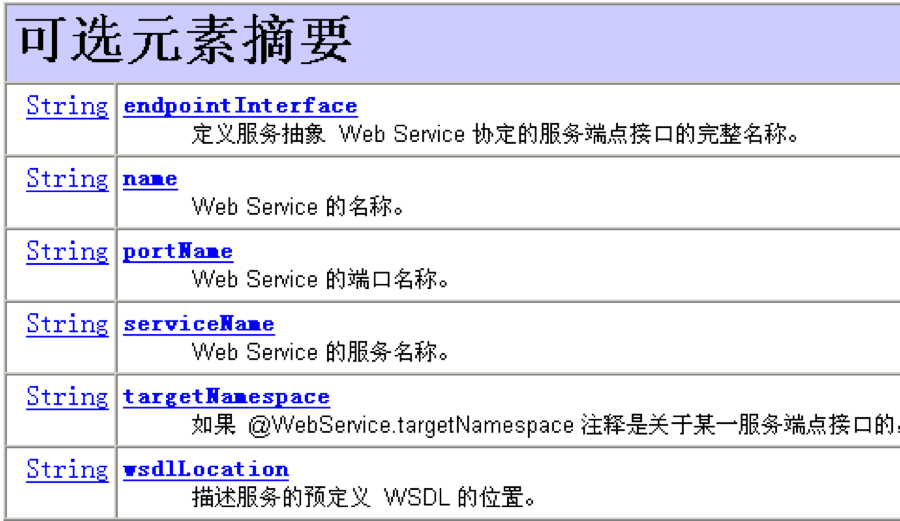    

2. @WebMethod  
```text
此注解用在方法上，用于修改对外暴露的方法
```  
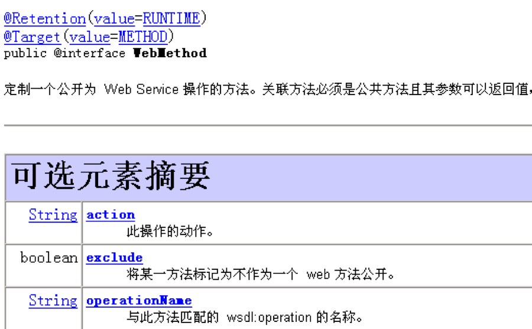  
 
3. @WebResult  
```text
用于定制返回值到WSDL的映射
```  
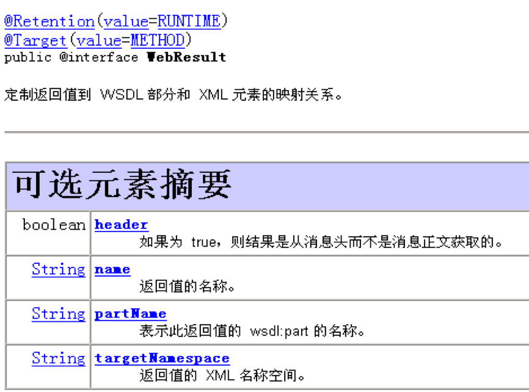  

4. @WebParam  
```text
用于定义WSDL中的参数映射    
```  
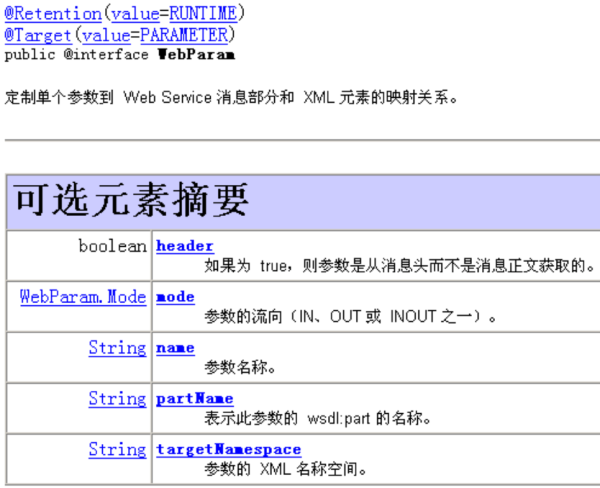    

5. @XmlElement  
```text
用于定义实体类的属性到WSDL中的映射(get/set方法上)  
```  
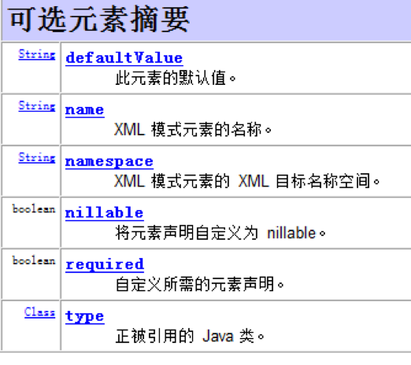

## 九、推荐其他教程 
[Web Service入门](http://www.importnew.com/12182.html)
[Web Service 那点事儿（1）](http://www.importnew.com/24800.html)     
[Web Service 那点事儿（2）—— 使用 CXF 开发 SOAP 服务](http://www.importnew.com/24816.html)      
[Web Service 那点事儿（3）—— SOAP 及其安全控制](http://www.importnew.com/24830.html)     
[Web Service 那点事儿（4）—— 使用 CXF 开发 REST 服务](http://www.importnew.com/24848.html)  
[使用Java创建RESTful Web Service](http://www.importnew.com/7336.html)    
参考：  
https://www.cnblogs.com/holbrook/archive/2012/12/12/2814821.html  
http://blog.csdn.net/kongxx/article/details/7544640    