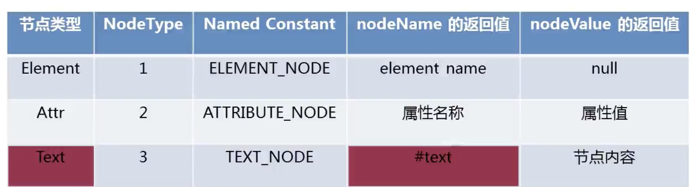
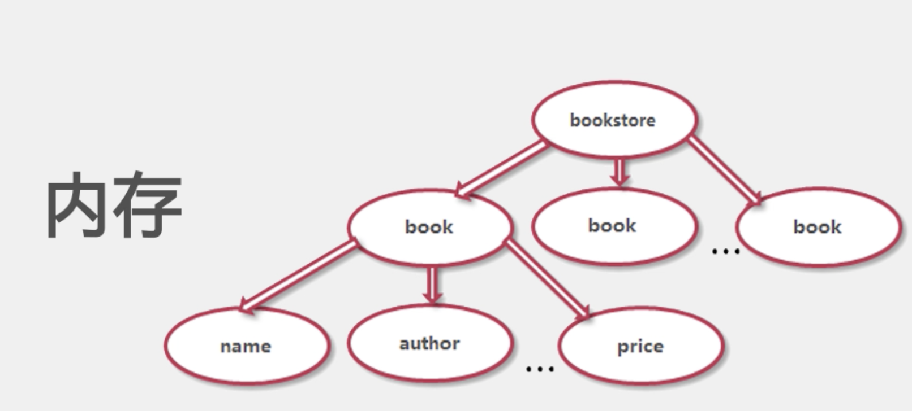

# Java对XML文件的读取

[TOC]

在Java程序中读取xml文件的过程称为解析xml文件，解析的目的有获取节点名、节点值、属性名、属性值。常见的xml文件的解析有四种
DOM解析、SAX解析、DOM4J解析、JDOM解析，其中DOM解析和SAX解析式Java官方提供的解析方式，不需要下载额外的Jar包，DOM4J和JDOM
是第三方提供的解析方式需要添加对应的Jar包。

## 一、Dom解析XML
DOM解析的时候，会将整个XML文件家在到内存中，然后进行逐个解析，对内存消耗较大。其中DOM常见的节点类型主要有如下三种，Element、Attr、Tex。注意在DOM解析的时候，节点与节点之前的空白区域会被认为是Text节点。


1.新建books.xml文件
```xml
<?xml version="1.0" encoding="UTF-8" ?>
<bookstore>
    <book id="1">
        <name>冰与火之歌</name>
        <author>乔治马丁</author>
        <year>2014</year>
        <price>89</price>
    </book>
    <book id="2">
        <name>安徒生通话</name>
        <year>2004</year>
        <price>77</price>
        <language>English</language>
    </book>
</bookstore>
```

2.DomTest.java
```java
package personal.xxxx;

import org.w3c.dom.Document;
import org.w3c.dom.NamedNodeMap;
import org.w3c.dom.Node;
import org.w3c.dom.NodeList;
import org.xml.sax.SAXException;

import javax.xml.parsers.DocumentBuilder;
import javax.xml.parsers.DocumentBuilderFactory;
import javax.xml.parsers.ParserConfigurationException;
import java.io.IOException;

/**
 * @ClassName: DomTest
 * @Description: Dom解析XML
 * @version: v1.0.0
 * @author: caojx
 * @date: 2017/8/25 13:07
 */
public class DomTest {

	public static void main(String[] args){
		//1.创建一个DocumentBuilderFactory对象
		DocumentBuilderFactory builderFactory = DocumentBuilderFactory.newInstance();
		//2.创建一个DocumentBuilder对象
		try {
			DocumentBuilder documentBuilder = builderFactory.newDocumentBuilder();
			//3.通过DocumentBuilder的parse方法读取xml文件返回Document对象
			Document document = documentBuilder.parse(DomTest.class.getClassLoader().getResourceAsStream("books.xml"));

			//获取所有的book节点
			NodeList bookList = document.getElementsByTagName("book");
			//获取所有的book的节点的长度
			System.out.println("一共有"+bookList.getLength()+"本书");
			//遍历所有的book节点
			for(int i = 0; i < bookList.getLength(); i++){
				//通过索引获取一个book节点，nodeLis的索引值从0开始
				Node book =bookList.item(i);
				//获取book节点的所有属性的集合
				NamedNodeMap attrs = book.getAttributes();
				System.out.println("第"+(i+1)+"本书共有"+attrs.getLength()+"个属性");
				//遍历book的属性
				for(int j = 0; j < attrs.getLength(); j++){
					System.out.println("下边开始遍历第"+(i+1)+"本书的内容");
					//通过item方法获取book节点的某一个属性
					Node attr = attrs.item(j);
					//获取属性名
					System.out.println("属性名："+attr.getNodeName());
					//获取属性值
					System.out.println("属性值："+attr.getNodeValue());
					System.out.println("结束遍历第"+(i+1)+"本书的内容");
				}
				//解析book节点的子节点
				NodeList childNodes = book.getChildNodes();
				//遍历childNodes获取每个节点的节点名和节点值,注意空白也会当成节点
				System.out.println("第"+(i+1)+"个节点共有"+childNodes.getLength()+"个子节点");
				for(int k = 0; k < childNodes.getLength(); k++){
					//由于空白也会被当成text节点，所有我们这里进行排除text节点
					if(childNodes.item(k).getNodeType() == Node.ELEMENT_NODE){
						//获取element类型节点中的节点名
						System.out.print("第"+(k+1)+"个节点名："+childNodes.item(k).getNodeName());
						//获取节点值方式1，会获取第一个子节点的节点值
						// System.out.println("--节点值是："+childNodes.item(k).getFirstChild().getNodeValue());
						//获取节点值方式2，会获取该节点的所有子节点值
						System.out.println("--节点值是："+childNodes.item(k).getTextContent());

					}
				}

			}
		} catch (ParserConfigurationException e) {
			e.printStackTrace();
		} catch (SAXException e) {
			e.printStackTrace();
		} catch (IOException e) {
			e.printStackTrace();
		}
	}
}

```
3.解析结果
```text
一共有2本书
第1本书共有1个属性
下边开始遍历第1本书的内容
属性名：id
属性值：1
结束遍历第1本书的内容
第1个节点共有9个子节点
第2个节点名：name--节点值是：冰与火之歌
第4个节点名：author--节点值是：乔治马丁
第6个节点名：year--节点值是：2014
第8个节点名：price--节点值是：89
第2本书共有1个属性
下边开始遍历第2本书的内容
属性名：id
属性值：2
结束遍历第2本书的内容
第2个节点共有9个子节点
第2个节点名：name--节点值是：安徒生通话
第4个节点名：year--节点值是：2004
第6个节点名：price--节点值是：77
第8个节点名：language--节点值是：English
```

## 二、SAX解析XML
SAX解析与DOM解析不同，SAX会通过自己创建的一个Handler类去逐个分析遇到的每个节点，并且节点解析的时候是安装节点出现的顺序进行的。

1.SAXTest.java
```java
package personal.caojx;

import org.xml.sax.SAXException;

import javax.xml.parsers.ParserConfigurationException;
import javax.xml.parsers.SAXParser;
import javax.xml.parsers.SAXParserFactory;
import java.io.IOException;

/**
 * @ClassName: SAXTest
 * @Description: SAX解析XML
 * @version: v1.0.0
 * @author: caojx
 * @date: 2017/8/25 13:07
 */
public class SAXTest {

    public static void main(String[] args){
        //1.获取一个SAXParserFactory的实例
        SAXParserFactory factory = SAXParserFactory.newInstance();
        try {
            //2.通过factory获取SAXParser实例
            SAXParser parser = factory.newSAXParser();
            //3.创建SAXParserHandler对象
            SAXParserHandler handler = new SAXParserHandler();
            //使用SAXParserHandler处理解析
            parser.parse(SAXTest.class.getClassLoader().getResourceAsStream("books.xml"),handler);
        } catch (ParserConfigurationException e) {
            e.printStackTrace();
        } catch (SAXException e) {
            e.printStackTrace();
        } catch (IOException e) {
            e.printStackTrace();
        }

    }
}
```

2.SAXParserHandler.java
SAX解析XML的时候需要创建一个handler类来解析XML文件
```java
package personal.caojx;

import org.xml.sax.Attributes;
import org.xml.sax.SAXException;
import org.xml.sax.helpers.DefaultHandler;

/**
 * ProjectName: xml-java
 * ClassName: SAXParserHandler.java
 *
 * @Description: SAX解析Handler类
 * @version: v1.0.0
 * @author: caojx
 * @date: 2017/9/21 下午9:58
 * @since JDK 1.8
 */
public class SAXParserHandler extends DefaultHandler {

    private int bookIndex;

    /**
     * 用来解析xml元素，开始
     * @param uri
     * @param localName
     * @param qName
     * @param attributes
     * @throws SAXException
     */
    @Override
    public void startElement(String uri, String localName, String qName, Attributes attributes) throws SAXException {
        //调用DefaultHandler类的startElement
        super.startElement(uri, localName, qName, attributes);
        //开始解析book元素的属性
        if(qName.equals("book")){
            bookIndex++;
            System.out.println("开始遍历第"+bookIndex+"本书的内容");
            //1.已知book元素的属性名，根据属性名获取属性值
            //String value = attributes.getValue("id");
            //System.out.println(value);
            //2.不知到book下的属性名以及个数，如果获取属性名以及属性值
            int num = attributes.getLength();
            for(int i = 0; i < num; i++){
                System.out.print("book元素的第"+(i+1)+"个属性名是："+attributes.getQName(i));
                System.out.println("--属性值是："+attributes.getValue(i));
            }
        }else if(!qName.equals("book") && !qName.equals("bookstore")){
            System.out.print("节点名是："+qName+" ");
        }


    }

    /**
     * 用来解析xml元素，结束
     * @param uri
     * @param localName
     * @param qName
     * @throws SAXException
     */
    @Override
    public void endElement(String uri, String localName, String qName) throws SAXException {
        //endElement
        super.endElement(uri, localName, qName);
        //判断是否针对一本书已经遍历结束
        if(qName.equals("book")){
            System.out.println("结束遍历第"+bookIndex+"本书的内容");
        }
    }

    /**
     * 获取节点值
     * @param ch
     * @param start
     * @param length
     * @throws SAXException
     */
    @Override
    public void characters(char[] ch, int start, int length) throws SAXException {
        super.characters(ch, start, length);
        String value = new String(ch, start, length);
        //去掉空格和换行
        if(!"".equals(value.trim())){
            System.out.println("节点值是："+value);
        }
    }

    /**
     * 用来标示文件解析开始
     * @throws SAXException
     */
    @Override
    public void startDocument() throws SAXException {
        super.startDocument();
        System.out.println("sax解析开始");
    }

    /**
     * 用来标示文件解析结束
     * @throws SAXException
     */
    @Override
    public void endDocument() throws SAXException {
        super.endDocument();
        System.out.println("sax解析结束");
    }
}
```

3.解析结果
```text
sax解析开始
开始遍历第1本书的内容
book元素的第1个属性名是：id--属性值是：1
节点名是：name 节点值是：冰与火之歌
节点名是：author 节点值是：乔治马丁
节点名是：year 节点值是：2014
节点名是：price 节点值是：89
结束遍历第1本书的内容
开始遍历第2本书的内容
book元素的第1个属性名是：id--属性值是：2
节点名是：name 节点值是：安徒生通话
节点名是：year 节点值是：2004
节点名是：price 节点值是：77
节点名是：language 节点值是：English
结束遍历第2本书的内容
sax解析结束
```

## 三、JDOM解析xml

1.引入JDOM依赖
```xml
        <dependency>
            <groupId>org.jdom</groupId>
            <artifactId>jdom2</artifactId>
            <version>2.0.6</version>
        </dependency>
```

2.JDOMTest.java
```java
package personal.caojx;

import org.jdom2.Attribute;
import org.jdom2.Document;
import org.jdom2.Element;
import org.jdom2.JDOMException;
import org.jdom2.input.SAXBuilder;

import java.io.FileInputStream;
import java.io.IOException;
import java.io.InputStream;
import java.util.List;

/**
 * ProjectName: xml-java
 * ClassName: JDomTest.java
 *
 * @Description: JDOM解析XML
 * @version: v1.0.0
 * @author: caojx
 * @date: 2017/9/24 下午9:12
 * @since JDK 1.8
 */
public class JDomTest {

   public static void main(String[] args){
       //对books.xml文件的jdom行解析
       //1.创建一个SAXBuilder对象
       SAXBuilder saxBuilder = new SAXBuilder();
       //3.创建输入流，将xml家在到输入流中
       InputStream in = JDomTest.class.getClassLoader().getResourceAsStream("books.xml");
       try {
           //3.通过saxBuilder的build方法，将输入流加载到saxBuilder中
           Document document = saxBuilder.build(in);
           //通过Document对象获取xml文件的根节点
           Element rootElement = document.getRootElement();
           //获取根节点下的子节点
           List<Element> bookList = rootElement.getChildren();

           //继续进行解析
           for(Element book: bookList){
               System.out.println("开始解析第"+(bookList.indexOf(book)+1)+"书");
               //解析book的属性，获取book的所有属性
               List<Attribute> attributes = book.getAttributes();
               //遍历属性(不清楚属性名和属性值)
               for(Attribute attribute: attributes){
                   //获取属性名
                  String attrName =  attribute.getName();
                   //获取属性值
                   String attrValue = attribute.getValue();
                   System.out.println("属性名："+attrName+"--属性值"+attrValue);
               }
               //对book节点的子节点的节点名称和节点值的遍历
               List<Element> bookChilds = book.getChildren();
               for(Element child: bookChilds){
                   System.out.println("节点名:"+child.getName()+"--节点值:"+child.getValue());
               }
               System.out.println("结束解析第"+(bookList.indexOf(book)+1)+"书");
           }
       } catch (JDOMException e) {
           e.printStackTrace();
       } catch (IOException e) {
           e.printStackTrace();
       }
   }
}
```

3.解析结果
```text
开始解析第1书
属性名：id--属性值1
节点名:name--节点值:冰与火之歌
节点名:author--节点值:乔治马丁
节点名:year--节点值:2014
节点名:price--节点值:89
结束解析第1书
开始解析第2书
属性名：id--属性值2
节点名:name--节点值:安徒生通话
节点名:year--节点值:2004
节点名:price--节点值:77
节点名:language--节点值:English
结束解析第2书
```

## 四、DOM4j解析XML

1.引入dom4j依赖
```xml
 <dependency>
            <groupId>dom4j</groupId>
            <artifactId>dom4j</artifactId>
            <version>1.6.1</version>
 </dependency>
```

2.DOM4JTest.java
```java
package personal.caojx;

import org.dom4j.Attribute;
import org.dom4j.Document;
import org.dom4j.DocumentException;
import org.dom4j.Element;
import org.dom4j.io.SAXReader;

import java.io.File;
import java.util.Iterator;
import java.util.List;

/**
 * ProjectName: xml-java
 * ClassName:DOM4JTest.java
 *
 * @Description: Dom4j解析XML
 * @version: v1.0.0
 * @author: caojx
 * @date: 2017/9/24 下午9:45
 * @since JDK 1.8
 */
public class DOM4JTest {

    public static void main(String[] args) throws DocumentException {
        //解析books.xml文件
        //创建SAXReader的对象reader
        SAXReader reader = new SAXReader();
        //通过reader对象的read方法加载books.xml文件
        Document document = reader.read(DOM4JTest.class.getClassLoader().getResourceAsStream("books.xml"));
        //通过document对象获取根节点bookstore
        Element bookstore = document.getRootElement();
        Iterator it = bookstore.elementIterator();
        while(it.hasNext()){
            System.out.println("开始遍历某一本书");
            Element book = (Element) it.next();
            //获取book的属性名以及属性值
            List<Attribute> bookAttrs = book.attributes();
            for(Attribute attr: bookAttrs){
                System.out.println("属性名："+attr.getName()+"--属性值："+attr.getValue());
            }

            //获取book的节点名和节点值
            Iterator iterator = book.elementIterator();
            while (iterator.hasNext()){
                Element bookChild = (Element) iterator.next();
                System.out.println("节点名："+bookChild.getName()+"--节点值："+bookChild.getStringValue());
            }
            System.out.println("结束遍历某一本书");
        }

    }
}
```

## 五、4中解析XML方式的对比
1.Java官方提供的XML解析方式DOM、SAX解析
2.第三方的XML解析方式JDOM、DOM4J解析

DOM解析
- 优点
 - 形成结构树，直观好理解，代码编写容易
 - 解析过程中结构保存在内存中，方便修改
  -缺点
 - 会一次性将整个xml加载到内存中，当xml文件较大时，第内存消耗较大，容易影响解析性能并造成内存溢出。



SAX解析
- 优点
 - 采用事件驱动、对内存耗费较小
 - 适用于只需要处理xml最后那个的数据时
- 缺点
 - 不易编码
 - 很难同时访问同一个xml中的多处不同数据

JDOM
 - 仅使用具体类而不实用接口
 - API大量使用了Collections类
 - 开放源代码

DOM4J
 - JDOM的一种智能分支，它合并了许多超极本的XML文档表示的功能
 - DOM4J使用接口和抽象极本类方法，是一个优秀的Java XML API
 - 具有性能优异、灵活性好、功能强大和极端易用使用的特点
 - 开发源代码
