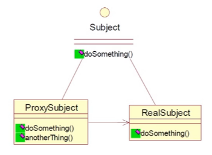

# 设计模式-代理模式
***

[TOC]

 代理模式的定义：
 为其他对象提供一种代理以控制这个对象的访问。代理对象起到中介的作用，可以去掉功能服务或增加额外的服务。

 集中常见的代理模式：  
 1.远程代理  例如：为不同地理的对象提供局域网代表对象
 2.虚拟代理  例如：根据需要将资源消耗很大的对象进行延迟，真正需要的时候进行创建
 3.保护代理 例如：控制对一个对象的访问进行权限控制
 4.智能引用代理  例如：提供对目标对象提供一些额外的代理

 下边我们只对智能引用代理作介绍，因为他在我们实际的开发任务中使用的最多。

 ## 一、智能引用代理
 两种实现方式：  
 静态代理  
 动态代理  

 ###1.1静态代理
 代理和被代理对象在代理之前是确定的。他们都实现相同的接口或者继承相同的抽象类。
 


 这里假如我们有辆车在行驶，需要使用代理用来记录车行驶的时间。

 1.Moveable.java 定义一个行驶接口
 ```java
public interface Moveable {

    void move();
}
 ```
2.Car.java 定义一个车类，实现行驶接口
```java
public class Car implements Moveable {

    @Override
    public void move() {
        //实现开车
        try {
            //模拟车的行驶
            Thread.sleep(new Random().nextInt(1000));
            System.out.println("汽车行驶中");
        } catch (InterruptedException e) {
            e.printStackTrace();
        }
    }
}
```

3.Car2.java 定义一个车类Car2.java，继承Car.java实现静态代理
```java
public class Car2 extends Car {

    @Override
    public void move() {
        long starTime = System.currentTimeMillis();
        System.out.println("汽车开始行驶");
        super.move();
        long endTime = System.currentTimeMillis();
        System.out.println("汽车结束行驶："+(endTime-starTime)+"毫秒");
    }
}
```
4.测试类
```java
public class StaticProxyTest {

    public static void main(String[] args){
        //静态代理使用继承方式
        Moveable moveable1 = new Car2();
        moveable1.move();
    }
}
```

>结果：  
>汽车开始行驶  
>汽车行驶中  
>汽车结束行驶：695毫秒  

上边使用的继承的方式实现的代理，即代理类中调用的实际上是目标类中的方法，假如我们有Car3，Car4..需要被代理
那都需要有重新书写继承类，这样很不方便,这种方式并不推荐。

5.使用聚合的方式实现静态代理
这里假如需要代理汽车行驶的时间，和汽车行驶的日志，我们需要两个代理类。

CarTimeProxy.java 汽车时间记录的代理
```java
public class CarTimeProxy implements Moveable {

    private Moveable moveable;

    public CarTimeProxy(Moveable moveable){
        super();
        this.moveable = moveable;
    }

    @Override
    public void move() {
        long starTime = System.currentTimeMillis();
        System.out.println("汽车开始行驶");
        moveable.move();
        long endTime = System.currentTimeMillis();
        System.out.println("汽车结束行驶："+(endTime-starTime)+"毫秒");
    }
}
```
CarLogProxy.java 汽车行驶日志代理
```java
public class CarLogProxy implements Moveable {

    private Moveable moveable;

    public CarLogProxy(Moveable moveable){
        super();
        this.moveable = moveable;
    }

    @Override
    public void move() {
        System.out.println("日志开始");
        moveable.move();
        System.out.println("日志结束");
    }
}
```

测试：
```java
public class StaticProxyTest {

    public static void main(String[] args){
        //使用聚合的方式实现代理
        Car car = new Car();
        CarTimeProxy ctp = new CarTimeProxy(car);
        CarLogProxy clp = new CarLogProxy(ctp);
        clp.move();
    }
}
```
>结果：  
>日志开始  
>汽车开始行驶  
>汽车行驶中  
>汽车结束行驶：540毫秒  
>日志结束  

总结：
从上边静态代理的案例来看，聚合的方式比继承的方式更加灵活，我们只需要让**代理类和被代理类实现相同的接口**
且在代理类中注入被代理类对象，就可以实现静态代理，当我们又需要代理其他的东西的时候，我们只需要新增代
代理类即可。

### 1.2 动态代理
实现方式：  
1.JDK动态代理  
    只能代理实现类接口的类  
    没有实现接口的类不能实现JDK的动态代理  
2.CGLIB动态代理  
    针对类来实现代理  
    对指定目标类产生一个子类，通过方法拦截技术拦截所有父类方法的调用  

上边的CarTimeProxy.java是我们对汽车的时间上的代理，假如我们又自行车，火车，其他类型的车需要时间上的代理，
那么使用静态代理的时候，我们就需要创建其他的代理类，假如车类型很多的时候，就需要创建数量很多的代理类，这样
就会造成我们的类爆炸，类膨胀。

使用动态代理就可以解决上边出现的问题,使用动态代理，我们事先并不需要知道被代理类和代理类实现的接口，代理类可以动态
的获取被代理类实现的接口，这样就可以实现动态代理。

JDK Dynamic Proxy实现步骤:  
1.创建一个代理类实现InvocationHanhler接口，他必须实现invoke方法
2.创建被代理的类以及接口
3.调用Proxy的静态方法，创建一个代理类newProxyInstance(ClassLoader loader,Class[] interfaces,InvocationHandler h)
4.代理类对象调用方法

#### 1.2.1JDK的动态代理
动态代理的原理图：

Java动态代理类位于java.lang.reflect包下，一般主要涉及到以下两个类：
(1)Interface InvocationHandler:该接口中仅定义了一个方法  
public Object invoke(Object obj,Method method, Object[] args)
在实际使用时，第一个参数obj一般是指被代理的对象，method是被代理的方法，args为该方法的参数数组。
这个方法在代理类中动态实现。
(2)Proxy：该类即为动态代理类
static Object newProxyInstance(ClassLoader loader,Class[] interfaces,InvocationHandler h)
返回一个代理类的实例，返回后的代理类可以当作被代理类使用（可以使用被代理类的在接口中声明过的方法）。
第一参数：loader 类加载器
第二个参数：interfaces 实现类接口
第三个参数：InvocationHandler h

1.TimeHandler.java 时间代理类，实现InvocationHandler
```java
public class TimeHandler implements InvocationHandler {

    //被代理目标对象
    private Object target;

    public TimeHandler(Object target) {
        this.target = target;
    }

    /**
     *
     * @param proxy 被代理对象
     * @param method 被代理对象的方法
     * @param args 被代理对象的方法参数
     * @return Object 方法的返回值
     * @throws Throwable
     */
    @Override
    public Object invoke(Object proxy, Method method, Object[] args) throws Throwable {
        long starTime = System.currentTimeMillis();
        System.out.println("汽车开始行驶");
        method.invoke(target);
        long endTime = System.currentTimeMillis();
        System.out.println("汽车结束行驶："+(endTime-starTime)+"毫秒");
        return null;
    }
}
```

2.JDKProxyTest.java 测试jdk的动态代理
```java
public class JDKProxyTest {

    public static void main(String[] args){
        Car car = new Car();
        InvocationHandler handler = new TimeHandler(car);
        Class<?> cls = car.getClass();
        /**
         * 第一参数：loar 类加载器
         * 第二个参数：interfaces 实现类接口
         * 第三个参数：InvocationHandler h
         */
        //返回一个代理类实例
        Moveable moveable = (Moveable) Proxy.newProxyInstance(car.getClass().getClassLoader(),cls.getInterfaces(),handler);
        moveable.move();
    }
}
```
>结果：  
>汽车开始行驶   
>汽车行驶中  
>汽车结束行驶：428毫秒  

#### 1.2.2 CGLIB动态代理

在目标类没有实现接口的情况下，我们可以使用CGLIB动态代理,通过拦截父类中的所有方法，生成一个子代理类，达到动态代理的目的。

1.引入需要的jar
```xml
 <dependency>
      <groupId>cglib</groupId>
      <artifactId>cglib-nodep</artifactId>
      <version>2.2</version>
    </dependency>
```

2.Train.java 火车目标类
```java
public class Train {

    public void move(){
        System.out.println("火车行驶中...");
    }
}
```
3.CglibProxy.java CGLIB动态代理类
```java
public class CglibProxy implements MethodInterceptor {

    private Enhancer enhancer = new Enhancer();

    public Object getProxy(Class clazz){
        //设置创建子类的类
        enhancer.setSuperclass(clazz);
        enhancer.setCallback(this);
        return enhancer.create();
    }

    /**
     * 拦截所有目标类方法的调用
     * @param obj 目标类的实例
     * @param method 目标方法的反射对象
     * @param args 方法参数
     * @param methodProxy 代理类实例
     * @return
     * @throws Throwable
     */
    @Override
    public Object intercept(Object obj, Method method, Object[] args, MethodProxy methodProxy) throws Throwable {
        System.out.println("运行方法开始");
        //代理类调用父类的方法
        methodProxy.invokeSuper(obj,args);
        System.out.println("运行方法结束");
        return null;
    }
}

```

4.测试：
```java
public class CglibProxyTest {

    public static void main(String[] args){
        CglibProxy proxy = new CglibProxy();
        //获取子代理类
        Train train = (Train) proxy.getProxy(Train.class);
        train.move();
    }
}
```
>结果：  
>运行方法开始  
>火车行驶中...  
>运行方法结束  